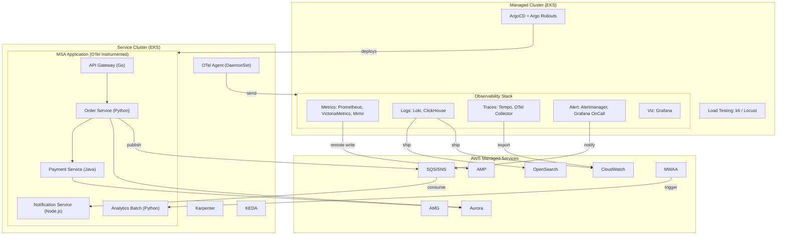
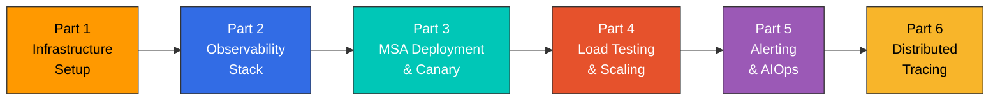
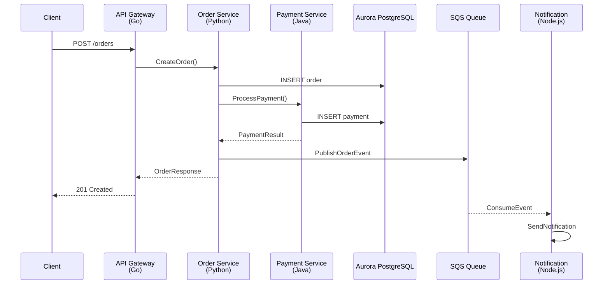

# Lab Series Introduction

> **Difficulty**: Advanced **Last Updated**: February 23, 2026

## Overview

This lab series provides a comprehensive, hands-on journey through building a full-stack observability platform for Kubernetes-based microservices. You will deploy and integrate multiple observability tools across two EKS clusters, implementing the three pillars of observability (Metrics, Logs, Traces) with real-world patterns.

The architecture simulates a production-grade environment with a **Managed Cluster** hosting the observability stack and a **Service Cluster** running MSA applications with OTel instrumentation.

## Architecture Diagram

## Prerequisites

Before starting this lab series, ensure you have the following:

| Requirement | Version  | Verification Command          |
| ----------- | -------- | ----------------------------- |
| AWS Account | -        | `aws sts get-caller-identity` |
| AWS CLI     | >= 2.15  | `aws --version`               |
| eksctl      | >= 0.175 | `eksctl version`              |
| kubectl     | >= 1.29  | `kubectl version --client`    |
| Helm        | >= 3.14  | `helm version`                |
| Terraform   | >= 1.7   | `terraform version`           |
| k6          | >= 0.49  | `k6 version`                  |
| Docker      | >= 24.0  | `docker --version`            |

### Required IAM Permissions

Your AWS user/role needs the following permissions:

* EKS full access
* EC2 full access (for node groups)
* VPC full access
* IAM limited access (for IRSA)
* CloudFormation full access
* SQS/SNS full access
* RDS full access (for Aurora)
* OpenSearch full access
* Managed Prometheus/Grafana full access
* MWAA full access

## Cost Estimate

> **Warning**: This lab series creates significant AWS resources. Estimated costs are provided below.

| Service                   | Configuration                     | Hourly Cost (USD) |
| ------------------------- | --------------------------------- | ----------------- |
| EKS Control Plane         | 2 clusters                        | $0.20             |
| EC2 (Managed Cluster)     | 3x m5.xlarge                      | $0.58             |
| EC2 (Service Cluster)     | 3x m5.large (+ Karpenter scaling) | $0.29+            |
| Aurora PostgreSQL         | db.r6g.large (multi-AZ)           | $0.52             |
| OpenSearch                | m6g.large.search (2 nodes)        | $0.25             |
| Amazon Managed Prometheus | Based on ingestion                | \~$0.10           |
| Amazon Managed Grafana    | 1 workspace                       | $0.15             |
| MWAA                      | mw1.small                         | $0.31             |
| SQS/SNS                   | Based on usage                    | \~$0.01           |
| **Total Estimate**        |                                   | **\~$2.50/hour**  |

**Tip**: Complete the lab in a single session and run cleanup immediately to minimize costs.

## Lab Sequence

| Part | Title                                                    | Duration | Key Topics                                      |
| ---- | -------------------------------------------------------- | -------- | ----------------------------------------------- |
| 1    | [Infrastructure Setup](01-infrastructure-setup-lab.md)   | 60 min   | EKS clusters, AWS services, ArgoCD              |
| 2    | [Observability Stack](02-observability-stack-lab.md)     | 90 min   | OTel, Prometheus, Loki, Tempo, Grafana          |
| 3    | [MSA Deployment & Canary](03-msa-deployment-lab.md)      | 60 min   | ArgoCD, Argo Rollouts, OTel instrumentation     |
| 4    | [Load Testing & Scaling](04-load-testing-scaling-lab.md) | 45 min   | k6, KEDA, Karpenter                             |
| 5    | [Alerting & AIOps](05-alerting-aiops-lab.md)             | 60 min   | Alertmanager, OnCall, CloudWatch Investigations |
| 6    | [Distributed Tracing](06-distributed-tracing-lab.md)     | 45 min   | Tempo, TraceQL, Log-Trace correlation           |

## MSA Application Overview

The lab uses a sample e-commerce MSA application with 5 services:

| Service              | Language           | Role                            | Dependencies              |
| -------------------- | ------------------ | ------------------------------- | ------------------------- |
| API Gateway          | Go                 | Request routing, authentication | Order, Payment            |
| Order Service        | Python (FastAPI)   | Order management, inventory     | Aurora, SQS               |
| Payment Service      | Java (Spring Boot) | Payment processing              | Aurora                    |
| Notification Service | Node.js (Express)  | Email/SMS notifications         | SQS consumer              |
| Analytics Batch      | Python             | Daily analytics aggregation     | Aurora, triggered by MWAA |

### Service Call Flow

## Observability Tool Coverage

This lab covers the following observability tools:

| Category          | Tools Covered                      | AWS Integration             |
| ----------------- | ---------------------------------- | --------------------------- |
| **Metrics**       | Prometheus, VictoriaMetrics, Mimir | AMP (remote write)          |
| **Logging**       | Loki, ClickHouse, Fluent Bit       | CloudWatch Logs, OpenSearch |
| **Tracing**       | Tempo, OTel Collector              | X-Ray (via OTel)            |
| **Visualization** | Grafana                            | AMG                         |
| **Alerting**      | Alertmanager, Grafana OnCall       | CloudWatch Alarms, SNS      |
| **AIOps**         | CloudWatch Investigations          | Bedrock Claude integration  |

> **Note**: This lab focuses on open-source and AWS-native tools. Commercial solutions like Datadog and Dynatrace are covered in separate documentation but not deployed in this lab.

## Learning Outcomes

By completing this lab series, you will be able to:

1. **Design** a production-grade observability architecture for Kubernetes
2. **Deploy** the complete LGTM stack (Loki, Grafana, Tempo, Mimir) with OTel
3. **Configure** multi-backend telemetry pipelines using OTel Collector
4. **Implement** canary deployments with observability-driven analysis
5. **Build** AIOps workflows with CloudWatch Investigations and Bedrock
6. **Analyze** distributed traces to identify performance bottlenecks
7. **Correlate** metrics, logs, and traces for root cause analysis

## References

* [Observability Overview](../../observability/)
* [Prometheus Documentation](../../observability/metrics/01-prometheus.md)
* [Grafana Dashboard](../../observability/grafana/)
* [Loki Documentation](../../observability/logging/01-loki.md)
* [Tempo Documentation](../../observability/tracing/01-tempo.md)
* [OpenTelemetry Documentation](../../observability/tracing/03-opentelemetry.md)
* [ArgoCD Documentation](../../gitops/argocd/)
* [KEDA Documentation](../../autoscaling/01-keda.md)
* [Karpenter Documentation](../../autoscaling/02-karpenter.md)

***

**Ready to begin?** Start with [Part 1: Infrastructure Setup](01-infrastructure-setup-lab.md)
