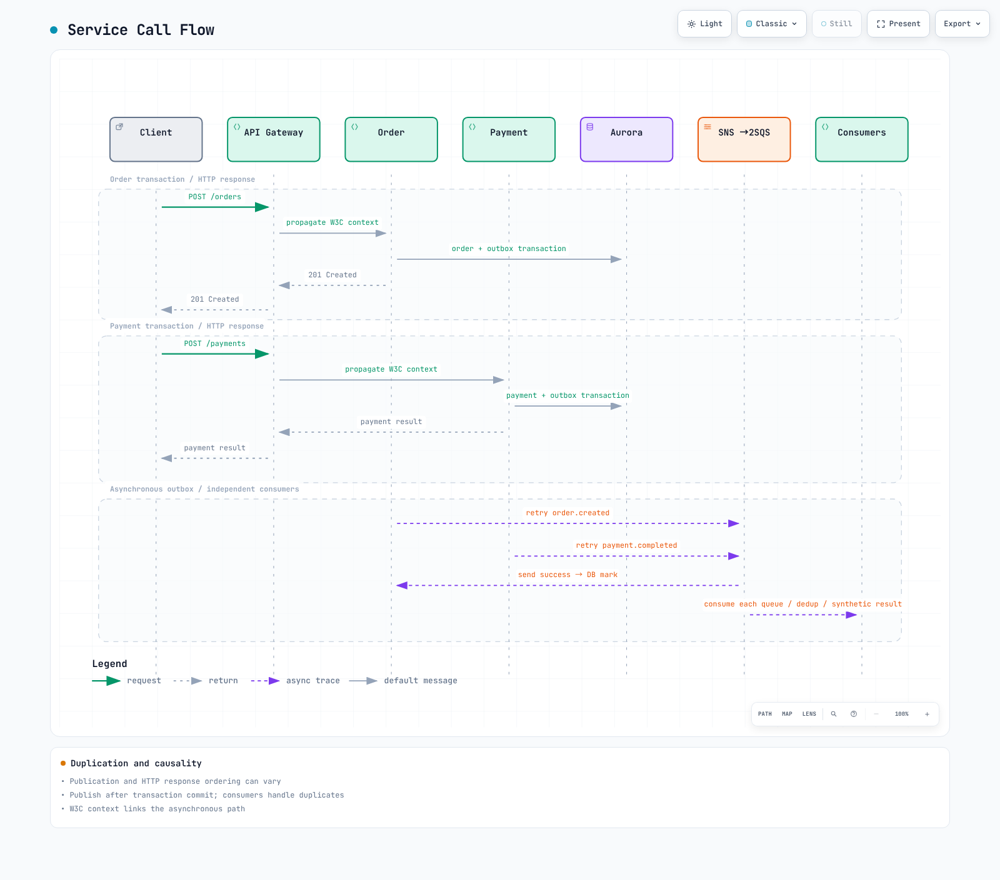

# Observability lab series

> **Difficulty**: Advanced
> **Last Updated**: September 13, 2026
Connect a runnable synthetic order application and its metrics/logs/traces across two EKS clusters. The baseline uses Prometheus, Loki, Tempo and Grafana with AWS SNS/SQS, Aurora and CloudWatch. Lab configuration is distinct from production HA/capacity validation.

[🔍 View interactive diagram](https://www.atomai.click/kubernetes-docs/archmaps/en-labs-observability-overview-0.html)

## Prerequisites {#prerequisites}

Use an approved temporary AWS role, reviewed private VPC/subnets/routes/DNS/SGs, EBS CSI/gp3, a NetworkPolicy-capable CNI and AWS Load Balancer Controller. No blanket service FullAccess or long-lived access key is required. Recheck versions, permissions and quotas in each stage.

| Tool | Reviewed baseline |
|---|---|
| EKS / kubectl | 1.36 / 1.36.2 |
| eksctl / Helm | 0.229.0 / 3.21.3 |
| Python / AWS CLI | 3.12 / v2 |
| k6 / Locust | 2.2.0 / 2.46.5 |
| Application / controllers | Pinned requirements, image digest and chart versions in examples |

## Runnable code and sequence {#sequence}

Use the [application](https://github.com/Atom-oh/kubernetes-docs/tree/main/examples/labs/observability/application), [stack](https://github.com/Atom-oh/kubernetes-docs/tree/main/examples/labs/observability/stack), [load-test](https://github.com/Atom-oh/kubernetes-docs/tree/main/examples/labs/observability/load-test) and [aiops](https://github.com/Atom-oh/kubernetes-docs/tree/main/examples/labs/observability/aiops) examples from this repository. Pin a reviewed commit/tag and preserve private LAB_STATE; do not clone the old nonexistent example repository.

[🔍 View interactive diagram](https://www.atomai.click/kubernetes-docs/archmaps/en-labs-observability-overview-2.html)

| Part | Stage | Outcome |
|---|---|---|
| 1 | [Infrastructure](01-infrastructure-setup-lab.md) | EKS, private DB, SNS fanout, scoped roles |
| 2 | [Observability stack](02-observability-stack-lab.md) | mTLS collectors/remote-write, Loki/Tempo/Grafana |
| 3 | [MSA/canary](03-msa-deployment-lab.md) | Five runnable roles, outbox, revision-only analysis |
| 4 | [Load/scaling](04-load-testing-scaling-lab.md) | Measured requests and consumer/node observations |
| 5 | [Alerting/AIOps](05-alerting-aiops-lab.md) | Separate-topic diagnostic reporter, human review |
| 6 | [Distributed tracing](06-distributed-tracing-lab.md) | Actual metric/exemplar/trace/log correlation, cleanup |

## Application and data flow {#application}

One Python image runs as separate api-gateway, order-service, payment-service, notification and analytics roles. Payments/notifications are synthetic, with no real charge/email/SMS. Orders and outbox share a transaction; independent queues and event-ID deduplication serve notification/analytics. Gateway authentication, general rate limiting and a real payment gateway are not implemented or claimed.

[🔍 View interactive diagram](https://www.atomai.click/kubernetes-docs/archmaps/en-labs-observability-overview-3.html)

## Baseline versus optional extensions {#coverage}

[🔍 View interactive diagram](https://www.atomai.click/kubernetes-docs/archmaps/en-labs-observability-overview-1.html)

| Baseline | Optional separate integration |
|---|---|
| Prometheus / CloudWatch metrics | VictoriaMetrics, Mimir, AMP |
| Loki / CloudWatch Logs | ClickHouse, OpenSearch |
| OTel / Tempo | X-Ray, Dynatrace |
| Grafana | Amazon Managed Grafana, commercial tools |
| Alertmanager / SNS / diagnostic Lambda | Existing on-call platform, CloudWatch Investigations group |
| Synthetic event consumers | MWAA scheduling/batch analytics, production transaction systems |

Installation differs from verified ingestion, queries, permissions and costs. Consult the [metrics](../../observability/metrics/README.md), [logging](../../observability/logging/README.md), [tracing](../../observability/tracing/README.md) and [Grafana](../../observability/grafana/README.md) guides for extensions. Part5 incorporates changes such as OnCall OSS archival.

## Cost, verification and cleanup {#cost-and-cleanup}

Estimate Region-specific nodes, NAT, EBS, Aurora ACU/storage/I/O, log ingestion/retention, messages, KMS, LBs, transfer and model calls from real usage. Do not mix monthly per-user charges with hourly infrastructure in a fixed total. Single-writer/backend labs are not production-grade HA; replica limits are not absolute spending caps.

Distinguish local native/SDK/schema/browser validation from actual AWS results. Inventory resources, IAM attachments, snapshots, DNS and LBs/PVCs; clean up in Part6’s dependency order. Do not suppress every failure or delete clusters before their managed dependents.
