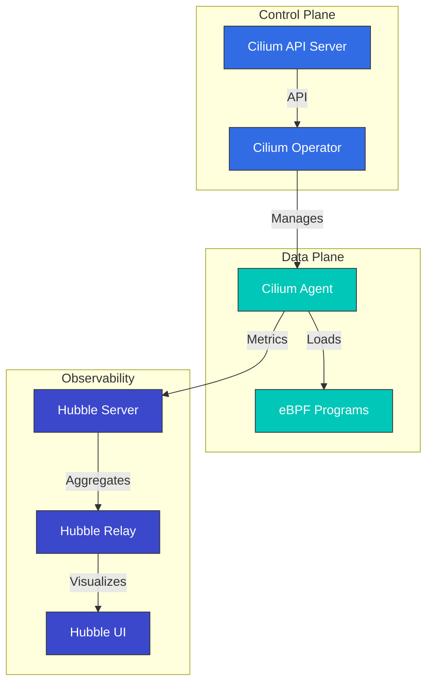

# Cilium

> **Supported Versions**: Cilium 1.17, 1.18
> **Last Updated**: July 25, 2025

## Table of Contents
- [Introduction](#introduction)
- [Architecture](#architecture)
- [Installation and Configuration](#installation-and-configuration)
- [Network Policies](#network-policies)
- [Service Mesh](#service-mesh)
- [Observability with Hubble](#observability-with-hubble)
- [Cilium Testing](#cilium-testing)
- [Integration with Amazon EKS](#integration-with-amazon-eks)
- [Best Practices](#best-practices)
- [Troubleshooting](#troubleshooting)
- [Conclusion](#conclusion)

## Introduction

Cilium is an open source networking, security, and observability solution for Linux container management platforms such as Kubernetes, Docker, and Mesos. Cilium is based on eBPF (extended Berkeley Packet Filter) technology, providing more powerful and efficient networking and security features than traditional Linux networking approaches.

> **Note**: For more detailed information about Cilium, see the [Cilium Deep Dive section](../cilium/README.md). This document covers Cilium from the perspective of EKS integration and operational practices.

### What is eBPF?

eBPF is a technology that acts like a sandboxed virtual machine within the Linux kernel, allowing programs to be safely executed within the kernel without modifying kernel code. This enables efficient execution of various tasks such as network packet processing, system call monitoring, and performance analysis.

Key characteristics of eBPF:
- High performance through kernel space execution
- Native performance through JIT (Just-In-Time) compilation
- Safe execution environment (program verification through verifier)
- Dynamic loading and unloading possible

### Key Benefits of Cilium

1. **High-Performance Networking**: Efficient packet processing using eBPF
2. **Granular Network Policies**: L3-L7 level network policy support
3. **Transparent Encryption**: Transparent IPsec or WireGuard encryption between nodes
4. **Load Balancing**: XDP (eXpress Data Path) based high-performance load balancing
5. **Observability**: Network flow visibility through Hubble
6. **Service Mesh**: L7 traffic management without existing sidecars
7. **Multi-Cluster Networking**: Transparent connectivity between clusters
8. **BGP Support**: Integration with external networks

### Comparison with Existing CNIs

| Feature | Cilium | Calico | Flannel | AWS VPC CNI |
|---------|--------|--------|---------|-------------|
| Network Model | eBPF | iptables/IPVS | VXLAN/host-gw | AWS ENI |
| Network Policies | L3-L7 | L3-L4 | Limited | AWS Security Groups |
| Encryption | IPsec/WireGuard | IPsec | None | None |
| Observability | Hubble | Flow Logs | Limited | VPC Flow Logs |
| Service Mesh | Built-in | Requires Istio | Requires Istio | Requires Istio/AppMesh |
| Performance | Very High | High | Medium | High |

## Integration with Amazon EKS

There are two main ways to use Cilium on Amazon EKS:

1. **Install as Amazon EKS Add-on**: Amazon EKS provides Cilium as a managed add-on.
2. **Manual Installation**: Install directly using Helm chart.

### Installing as Amazon EKS Add-on

```bash
# Install Cilium add-on
aws eks create-addon \
  --cluster-name my-cluster \
  --addon-name cilium \
  --addon-version v1.14.0-eksbuild.1 \
  --service-account-role-arn arn:aws:iam::123456789012:role/AmazonEKSCiliumAddonRole

# Check add-on status
aws eks describe-addon \
  --cluster-name my-cluster \
  --addon-name cilium
```

### Manual Installation with Helm

```bash
# Add Cilium Helm repository
helm repo add cilium https://helm.cilium.io/

# Update Helm repository
helm repo update

# Install Cilium
helm install cilium cilium/cilium \
  --version 1.14.0 \
  --namespace kube-system \
  --set eni.enabled=true \
  --set ipam.mode=eni \
  --set egressMasqueradeInterfaces=eth0 \
  --set tunnel=disabled
```

### EKS-Specific Configuration Options

Key configuration options to consider when using Cilium with EKS:

1. **ENI Mode**: Leverage native AWS networking performance using AWS Elastic Network Interface
2. **IPAM Mode**: Integration with AWS VPC IP address management
3. **Encryption**: Inter-node traffic encryption (WireGuard or IPsec)
4. **NodeLocal DNSCache**: DNS performance improvement
5. **Hubble**: Enable network observability

## Learn More

For more detailed information about Cilium, see the following documents:

- [Cilium Introduction and Basic Concepts](../cilium/01-introduction.md)
- [eBPF Technology Deep Dive](../cilium/02-ebpf.md)
- [Networking Model and VXLAN](../cilium/03-networking.md)
- [IPAM and Network Policies](../cilium/04-ipam-policy.md)
- [L2-L7 Networking and Load Balancing](../cilium/05-l2-l7-networking.md)
- [Security and Visibility](../cilium/06-security-visibility.md)
- [Advanced Topics](../cilium/07-advanced-topics.md)
| Multi-Cluster | Built-in | Limited | None | Requires Transit Gateway |

## Architecture

Cilium consists of a data plane based on eBPF and a control plane integrated with Kubernetes.



### Key Components

1. **Cilium Agent**: Runs on each node, loads and manages eBPF programs
2. **Cilium Operator**: Manages cluster-level resources and operations
3. **eBPF Programs**: Loaded into kernel for packet processing and policy enforcement
4. **Hubble**: Provides network flow monitoring and observability
5. **Cilium CLI**: Command-line tool for Cilium and Hubble management

### Networking Models

Cilium supports multiple networking modes:

1. **Direct Routing**: Direct routing between nodes (BGP or static routing)
2. **Tunneling**: Overlay networking through VXLAN or Geneve tunnels
3. **AWS ENI**: Utilizing Elastic Network Interface (ENI) on Amazon EKS
4. **Azure IPAM**: Utilizing Azure IPAM on Azure AKS

### Packet Flow

How packets are processed in Cilium:

1. Packet arrives at network interface
2. eBPF XDP program performs initial processing (DDoS defense, load balancing)
3. eBPF TC (Traffic Control) program applies network policies
4. Packet is delivered to container network namespace
5. Response packets are processed through similar path

## Installation and Configuration

### Prerequisites

- Kubernetes cluster (v1.16 or higher)
- Linux kernel 4.9 or higher (recommended: 5.4 or higher)
- kubectl configured
- Helm (optional)

### Installation Methods

#### 1. Install Cilium CLI

```bash
curl -L --remote-name-all https://github.com/cilium/cilium-cli/releases/latest/download/cilium-linux-amd64.tar.gz
sudo tar xzvfC cilium-linux-amd64.tar.gz /usr/local/bin
rm cilium-linux-amd64.tar.gz
```

#### 2. Install Cilium

Basic installation:
```bash
cilium install
```

Custom installation:
```bash
cilium install --version 1.13.0 \
  --set kubeProxyReplacement=strict \
  --set bpf.masquerade=true \
  --set encryption.enabled=true \
  --set encryption.type=wireguard
```

#### 3. Install Hubble

```bash
cilium hubble enable --ui
```

#### 4. Verify Installation

```bash
cilium status
```

### Configuration Options

#### Networking Mode Configuration

Direct routing mode:
```bash
cilium install --set tunnel=disabled --set autoDirectNodeRoutes=true
```

VXLAN mode:
```bash
cilium install --set tunnel=vxlan
```

#### kube-proxy Replacement Configuration

Full replacement mode:
```bash
cilium install --set kubeProxyReplacement=strict
```

Partial replacement mode:
```bash
cilium install --set kubeProxyReplacement=partial
```

#### Encryption Configuration

WireGuard encryption:
```bash
cilium install --set encryption.enabled=true --set encryption.type=wireguard
```

IPsec encryption:
```bash
cilium install --set encryption.enabled=true --set encryption.type=ipsec
```

#### Bandwidth Management Configuration

```bash
cilium install --set bandwidthManager.enabled=true
```

## Network Policies

Cilium extends the Kubernetes NetworkPolicy API to provide granular network policies at L3-L7 levels.

### Basic Network Policy

Basic policy using Kubernetes NetworkPolicy:

```yaml
apiVersion: networking.k8s.io/v1
kind: NetworkPolicy
metadata:
  name: allow-frontend-to-backend
  namespace: app
spec:
  podSelector:
    matchLabels:
      app: backend
  ingress:
  - from:
    - podSelector:
        matchLabels:
          app: frontend
    ports:
    - port: 8080
      protocol: TCP
```

### Cilium Network Policy

L7 policy using Cilium CRD:

```yaml
apiVersion: cilium.io/v2
kind: CiliumNetworkPolicy
metadata:
  name: allow-specific-http-methods
  namespace: app
spec:
  endpointSelector:
    matchLabels:
      app: backend
  ingress:
  - fromEndpoints:
    - matchLabels:
        app: frontend
    toPorts:
    - ports:
      - port: "8080"
        protocol: TCP
      rules:
        http:
        - method: "GET"
          path: "/api/v1/products"
```

### Cluster-Wide Policy

```yaml
apiVersion: cilium.io/v2
kind: CiliumClusterwideNetworkPolicy
metadata:
  name: deny-external-egress
spec:
  egress:
  - toEntities:
    - cluster
  - toEndpoints:
    - matchLabels:
        io.kubernetes.pod.namespace: kube-system
        k8s-app: kube-dns
    toPorts:
    - ports:
      - port: "53"
        protocol: UDP
      - port: "53"
        protocol: TCP
```

### Entity-Based Policy

```yaml
apiVersion: cilium.io/v2
kind: CiliumNetworkPolicy
metadata:
  name: allow-dns-to-external
  namespace: app
spec:
  endpointSelector:
    matchLabels:
      app: web
  egress:
  - toEntities:
    - world
    toPorts:
    - ports:
      - port: "53"
        protocol: UDP
      - port: "53"
        protocol: TCP
```

### FQDN-Based Policy

```yaml
apiVersion: cilium.io/v2
kind: CiliumNetworkPolicy
metadata:
  name: allow-specific-domains
  namespace: app
spec:
  endpointSelector:
    matchLabels:
      app: web
  egress:
  - toFQDNs:
    - matchName: "api.example.com"
    - matchPattern: "*.amazonaws.com"
    toPorts:
    - ports:
      - port: "443"
        protocol: TCP
```

## Service Mesh

Cilium provides sidecar-less service mesh capabilities using eBPF. This enables L7 traffic management without deploying Envoy proxies as sidecars.

### Enabling Service Mesh

```bash
cilium install --set serviceMesh.enabled=true
```

### Service Mesh Policy

L7 HTTP policy example:

```yaml
apiVersion: cilium.io/v2
kind: CiliumNetworkPolicy
metadata:
  name: l7-policy
spec:
  endpointSelector:
    matchLabels:
      app: productpage
  ingress:
  - fromEndpoints:
    - matchLabels:
        app: reviews
    toPorts:
    - ports:
      - port: "9080"
        protocol: TCP
      rules:
        http:
        - method: "GET"
          path: "/api/v1/products"
```

### Traffic Management

Traffic splitting example:

```yaml
apiVersion: cilium.io/v2alpha1
kind: CiliumEnvoyConfig
metadata:
  name: traffic-split
spec:
  services:
  - name: reviews
    namespace: default
  resources:
  - "@type": type.googleapis.com/envoy.config.listener.v3.Listener
    name: reviews-listener
    filter_chains:
    - filters:
      - name: envoy.filters.network.http_connection_manager
        typed_config:
          "@type": type.googleapis.com/envoy.extensions.filters.network.http_connection_manager.v3.HttpConnectionManager
          stat_prefix: reviews
          route_config:
            name: reviews-route
            virtual_hosts:
            - name: reviews-vhost
              domains: ["*"]
              routes:
              - match:
                  prefix: "/"
                route:
                  weighted_clusters:
                    clusters:
                    - name: reviews-v1
                      weight: 80
                    - name: reviews-v2
                      weight: 20
```

### Service Mesh Monitoring

Collecting service mesh metrics through Hubble:

```bash
cilium hubble enable --metrics=http
```

## Observability with Hubble

Hubble is Cilium's observability layer, enabling visualization and analysis of network flow data collected through eBPF.

### Installing Hubble

```bash
cilium hubble enable --ui
```

### Accessing Hubble UI

```bash
cilium hubble ui
```

### Installing Hubble CLI

```bash
export HUBBLE_VERSION=$(curl -s https://raw.githubusercontent.com/cilium/hubble/master/stable.txt)
curl -L --remote-name-all https://github.com/cilium/hubble/releases/download/$HUBBLE_VERSION/hubble-linux-amd64.tar.gz
sudo tar xzvfC hubble-linux-amd64.tar.gz /usr/local/bin
rm hubble-linux-amd64.tar.gz
```

### Observing Network Flows

```bash
# Observe all flows
hubble observe

# Observe flows in specific namespace
hubble observe --namespace app

# Observe HTTP requests
hubble observe --protocol http

# Observe flows between pods with specific labels
hubble observe --from-label app=frontend --to-label app=backend

# Observe failed connections
hubble observe --verdict DROPPED
```

### Flow Visualization

Service map visualization through Hubble UI:

```bash
cilium hubble ui
```

### Prometheus Integration

Exporting Hubble metrics to Prometheus:

```bash
cilium hubble enable --metrics="{dns:query;ignoreAAAA,drop:sourceContext=pod;destinationContext=pod,tcp,flow,icmp,http}"
```

### Grafana Dashboard

Installing Grafana dashboard for Hubble metrics:

```bash
kubectl apply -f https://raw.githubusercontent.com/cilium/cilium/master/examples/kubernetes/addons/prometheus/monitoring-example.yaml
```

## Cilium Testing

Cilium provides various tools for testing network connectivity and policies.

### Connectivity Test

```bash
# Basic connectivity test
cilium connectivity test

# Run specific test
cilium connectivity test --test=client-to-echo-service
```

### Policy Test

```bash
# Run policy test
cilium connectivity test --test=policy-stress-test
```

### Performance Test

```bash
# Network performance test
cilium connectivity test --test=performance
```

### Analyzing Test Results

```bash
# Test results summary
cilium connectivity test --summary

# Detailed test results
cilium connectivity test --verbose
```

### Custom Tests

Custom test configuration:

```yaml
apiVersion: v1
kind: ConfigMap
metadata:
  name: cilium-connectivity-test
  namespace: kube-system
data:
  config.yaml: |
    tests:
      - name: "custom-test"
        description: "Custom connectivity test"
        steps:
        - name: "client-to-custom-service"
          source:
            podLabels:
              app: client
          destination:
            podLabels:
              app: custom-service
          http:
            method: GET
            path: "/api/v1/status"
            expectedStatus: 200
```

```bash
cilium connectivity test --config=cilium-connectivity-test
```

## Integration with Amazon EKS

Cilium integrates seamlessly with Amazon EKS to provide advanced networking and security features.

### Installing Cilium on EKS

#### 1. Installing Cilium on Existing EKS Cluster

```bash
# Remove AWS CNI
kubectl delete daemonset -n kube-system aws-node

# Install Cilium
cilium install --set eni.enabled=true \
  --set ipam.mode=eni \
  --set egressMasqueradeInterfaces=eth0 \
  --set tunnel=disabled
```

#### 2. Creating New EKS Cluster with Cilium CNI

```bash
eksctl create cluster --name cilium-cluster \
  --without-nodegroup

eksctl create nodegroup --cluster cilium-cluster \
  --node-ami-family AmazonLinux2 \
  --node-type m5.large \
  --nodes 3 \
  --max-pods-per-node 110

# Install Cilium
cilium install --set eni.enabled=true \
  --set ipam.mode=eni \
  --set egressMasqueradeInterfaces=eth0 \
  --set tunnel=disabled
```

### ENI Mode Configuration

```yaml
apiVersion: v1
kind: ConfigMap
metadata:
  name: cilium-config
  namespace: kube-system
data:
  enable-endpoint-routes: "true"
  auto-create-cilium-node-resource: "true"
  ipam: "eni"
  eni-tags: "{\"Owner\": \"Cilium\"}"
  tunnel: "disabled"
  enable-ipv4: "true"
  enable-ipv6: "false"
  egress-masquerade-interfaces: "eth0"
```

### Security Group Integration

```yaml
apiVersion: cilium.io/v2
kind: CiliumNetworkPolicy
metadata:
  name: secure-app
spec:
  endpointSelector:
    matchLabels:
      app: secure-app
  ingress:
  - fromEndpoints:
    - matchLabels:
        app: frontend
    toPorts:
    - ports:
      - port: "8080"
        protocol: TCP
  egress:
  - toFQDNs:
    - matchName: "api.amazonaws.com"
    toPorts:
    - ports:
      - port: "443"
        protocol: TCP
```

### EKS Cluster Interconnection

EKS cluster interconnection using Cilium Cluster Mesh:

```bash
# On cluster 1
cilium clustermesh enable --service-type LoadBalancer

# On cluster 2
cilium clustermesh enable --service-type LoadBalancer

# Connect clusters
cilium clustermesh connect --context cluster1 --destination-context cluster2
```

### AWS Load Balancer Controller Integration

```yaml
apiVersion: networking.k8s.io/v1
kind: Ingress
metadata:
  name: example-ingress
  annotations:
    kubernetes.io/ingress.class: alb
    alb.ingress.kubernetes.io/scheme: internet-facing
spec:
  rules:
  - host: example.com
    http:
      paths:
      - path: /
        pathType: Prefix
        backend:
          service:
            name: example-service
            port:
              number: 80
```

## Best Practices

### Performance Optimization

1. **Kernel Version Optimization**: Use Linux kernel 5.4 or higher
2. **Enable BBR Congestion Control**: Improve network throughput
3. **Enable XDP Acceleration**: Improve packet processing performance
4. **MTU Optimization**: Set MTU appropriate for network environment

```bash
cilium install --set bpf.preallocateMaps=true \
  --set bpf.masquerade=true \
  --set devices=eth0 \
  --set loadBalancer.acceleration=native \
  --set loadBalancer.mode=dsr
```

### Security Hardening

1. **Apply Default Deny Policy**: Only allow explicitly permitted traffic
2. **Enable Encryption**: Encrypt inter-node traffic
3. **Apply Least Privilege Principle**: Design policies to allow only necessary communication
4. **Regular Policy Audits**: Regular review of network policies

```bash
# Default deny policy
kubectl apply -f - <<EOF
apiVersion: cilium.io/v2
kind: CiliumNetworkPolicy
metadata:
  name: default-deny
  namespace: default
spec:
  endpointSelector: {}
  ingress: []
  egress: []
EOF
```

### Improved Observability

1. **Configure Hubble Metrics**: Enable necessary metrics
2. **Optimize Log Levels**: Set appropriate log levels
3. **Prometheus Integration**: Set up metric collection and alerts
4. **Use Grafana Dashboards**: Visualization and monitoring

```bash
cilium hubble enable --metrics="{dns,drop,tcp,flow,http}"
```

### Resource Management

1. **Set Resource Requests and Limits**: Allocate appropriate CPU and memory
2. **Use Node Selectors**: Place Cilium components on specific nodes
3. **Set Priority Classes**: Assign high priority to critical components

```yaml
apiVersion: helm.toolkit.fluxcd.io/v2beta1
kind: HelmRelease
metadata:
  name: cilium
  namespace: kube-system
spec:
  chart:
    spec:
      chart: cilium
      sourceRef:
        kind: HelmRepository
        name: cilium
  values:
    agent:
      resources:
        requests:
          cpu: 100m
          memory: 512Mi
        limits:
          cpu: 500m
          memory: 1Gi
    operator:
      resources:
        requests:
          cpu: 100m
          memory: 256Mi
        limits:
          cpu: 200m
          memory: 512Mi
```

## Troubleshooting

### Common Issues

#### 1. Connectivity Issues

**Symptom**: Pod-to-pod communication failure

**Solution**:
- Check Cilium status
- Review network policies
- Analyze flows through Hubble

```bash
# Check Cilium status
cilium status

# Check endpoint status
cilium endpoint list

# Review network policies
kubectl get cnp,ccnp -A

# Analyze flows
hubble observe --verdict DROPPED
```

#### 2. Performance Issues

**Symptom**: Increased latency or reduced throughput

**Solution**:
- Verify kernel version
- Check eBPF map status
- Monitor system resources

```bash
# Check kernel version
uname -r

# Check eBPF map status
cilium bpf maps list

# Monitor system resources
cilium metrics list
```

#### 3. Policy Application Issues

**Symptom**: Network policies not applied as expected

**Solution**:
- Validate policy syntax
- Verify endpoint labels
- Enable policy tracing

```bash
# Validate policy
cilium policy validate -f policy.yaml

# Verify endpoint labels
cilium endpoint list -o json | jq '.[].status.identity.labels'

# Enable policy tracing
cilium config set policy-audit-mode=true
```

### Debugging Tools

#### Cilium CLI Debugging Commands

```bash
# Check status
cilium status --verbose

# Endpoint information
cilium endpoint list

# Service list
cilium service list

# Check policies
cilium policy get

# Check BPF maps
cilium bpf maps list

# Collect environment information
cilium sysdump
```

#### Hubble Debugging

```bash
# Observe flows in real-time
hubble observe --follow

# Observe flows for specific pod
hubble observe --pod app/frontend

# Observe flows for specific IP address
hubble observe --ip 10.0.0.1

# Observe flows for specific port
hubble observe --port 80

# Observe flows for specific protocol
hubble observe --protocol http
```

#### Log Collection

```bash
# Cilium agent logs
kubectl logs -n kube-system -l k8s-app=cilium

# Cilium operator logs
kubectl logs -n kube-system -l name=cilium-operator

# Hubble relay logs
kubectl logs -n kube-system -l k8s-app=hubble-relay
```

## Conclusion

Cilium uses eBPF technology to provide high-performance networking, granular security policies, and excellent observability in Kubernetes environments. Compared to traditional Linux networking approaches, Cilium provides more efficient and powerful networking and security features, and through Hubble, offers in-depth visibility into network flows.

This document covered Cilium's basic concepts, installation methods, network policies, service mesh, observability with Hubble, Cilium testing, integration with Amazon EKS, best practices, and troubleshooting.

Cilium continues to evolve, with more features and performance improvements expected as eBPF technology advances. Cilium is establishing itself as a powerful solution for networking, security, and observability in cloud-native environments.

### Next Steps

- Explore Cilium service mesh features
- Implement multi-cluster networking
- Build network monitoring systems using Hubble
- Advance eBPF-based security policies
- Integrate Cilium with other cloud-native tools

## References

- [Cilium Official Documentation](https://docs.cilium.io/)
- [Cilium GitHub Repository](https://github.com/cilium/cilium)
- [eBPF Documentation](https://ebpf.io/)
- [Hubble Documentation](https://github.com/cilium/hubble)
- [Cilium Network Policy Editor](https://editor.cilium.io/)
- [AWS EKS Workshop - Cilium](https://www.eksworkshop.com/beginner/115_cilium/)

## Quiz

To test what you've learned in this chapter, try the [topic quiz](../quizzes/networking/04-cilium-quiz.md).
