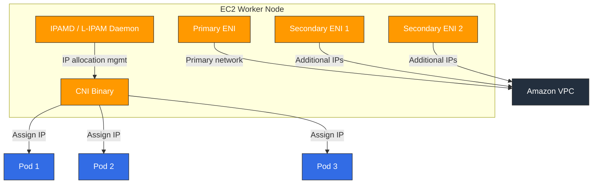

# Amazon VPC CNI

> **Supported Versions**: VPC CNI v1.19+, EKS 1.25+
> **Last Updated**: February 2025

## Table of Contents
- [VPC CNI Overview](#vpc-cni-overview)
- [Networking Model](#networking-model)
- [Installation and Configuration](#installation-and-configuration)
- [IP Address Management](#ip-address-management)
- [Network Policy Support](#network-policy-support)
- [Advanced Features](#advanced-features)
- [Troubleshooting](#troubleshooting)
- [Best Practices](#best-practices)

## VPC CNI Overview

Amazon VPC CNI (Container Network Interface) is the default networking plugin for Amazon EKS. It assigns real IP addresses from VPC subnets to each Pod, enabling Pods to communicate natively within the VPC network.

### Key Features

1. **Native VPC Networking**: Pods use actual VPC IPs, communicating without overlay networks
2. **AWS Service Integration**: Direct integration with AWS networking features like Security Groups, VPC Flow Logs, and routing tables
3. **High Performance**: Native network performance without overlay overhead
4. **IPv4/IPv6 Dual Stack**: Support for both IPv4 and IPv6 networking

### Architecture

VPC CNI consists of two main components:



1. **IPAMD (L-IPAM Daemon)**: A daemon running on each node that pre-allocates and manages ENIs and IP addresses
2. **CNI Binary**: The CNI plugin called by kubelet that receives IPs from IPAMD and configures Pod network namespaces

### IP Allocation Modes

VPC CNI supports two IP allocation modes:

| Feature | Secondary IP Mode | Prefix Delegation Mode |
|---------|-------------------|----------------------|
| Allocation Unit | Individual IP addresses | /28 IPv4 prefix (16 IPs) |
| IP Efficiency | Medium | High |
| Pod Density | Limited by IPs per ENI | Higher Pod density |
| Available Since | Initial version | v1.9+ |
| Recommended For | Small clusters | Large clusters |

## Networking Model

### ENI Architecture

Each EC2 instance can have one or more ENIs (Elastic Network Interfaces), and each ENI can be assigned multiple private IP addresses.

```
┌─────────────────────────────────────────────────┐
│                 EC2 Instance                      │
│                                                   │
│  ┌─────────────┐  ┌─────────────┐  ┌──────────┐ │
│  │ Primary ENI  │  │Secondary ENI│  │Secondary │ │
│  │ (eth0)       │  │ (eth1)      │  │ENI (eth2)│ │
│  │              │  │             │  │          │ │
│  │ Primary IP   │  │ IP 1→Pod A  │  │IP 1→PodD│ │
│  │ IP 1 → Pod X │  │ IP 2→Pod B  │  │IP 2→PodE│ │
│  │ IP 2 → Pod Y │  │ IP 3→Pod C  │  │IP 3→PodF│ │
│  └─────────────┘  └─────────────┘  └──────────┘ │
└─────────────────────────────────────────────────┘
```

### Instance Type ENI/IP Limits

| Instance Type | Max ENIs | IPv4 per ENI | Max Pods |
|--------------|----------|-------------|----------|
| t3.medium | 3 | 6 | 17 |
| t3.large | 3 | 12 | 35 |
| m5.large | 3 | 10 | 29 |
| m5.xlarge | 4 | 15 | 58 |
| m5.2xlarge | 4 | 15 | 58 |
| c5.4xlarge | 8 | 30 | 234 |
| m5.8xlarge | 8 | 30 | 234 |

> **Note**: Max Pods = (Number of ENIs × IPs per ENI) - Number of ENIs. Primary IPs are used by the node.

### Prefix Delegation (IPv4/IPv6)

In Prefix Delegation mode, /28 IPv4 prefixes (16 IPs) are assigned to ENIs instead of individual IPs:

```bash
# Enable Prefix Delegation
kubectl set env daemonset aws-node -n kube-system ENABLE_PREFIX_DELEGATION=true

# Or via EKS add-on configuration
aws eks create-addon \
  --cluster-name my-cluster \
  --addon-name vpc-cni \
  --configuration-values '{"env":{"ENABLE_PREFIX_DELEGATION":"true"}}'
```

Benefits of Prefix Delegation:
- **Higher Pod Density**: 16 IPs per /28 prefix significantly increases Pods per node
- **Faster IP Allocation**: Obtain 16 IPs with a single API call
- **Nitro Instance Optimization**: Optimal performance on Nitro-based instances

## Installation and Configuration

### Installing as EKS Add-on

```bash
# Install VPC CNI add-on (latest version)
aws eks create-addon \
  --cluster-name my-cluster \
  --addon-name vpc-cni \
  --resolve-conflicts OVERWRITE

# Check add-on status
aws eks describe-addon \
  --cluster-name my-cluster \
  --addon-name vpc-cni

# Update add-on version
aws eks update-addon \
  --cluster-name my-cluster \
  --addon-name vpc-cni \
  --addon-version v1.19.0-eksbuild.1
```

### Helm Chart Installation

```bash
# Add Helm repository
helm repo add eks https://aws.github.io/eks-charts

# Install
helm install aws-vpc-cni eks/aws-vpc-cni \
  --namespace kube-system \
  --set init.image.tag=v1.19.0 \
  --set image.tag=v1.19.0
```

### Key Environment Variables

| Variable | Description | Default |
|----------|------------|---------|
| `WARM_IP_TARGET` | Number of spare IPs to pre-allocate | Not set |
| `MINIMUM_IP_TARGET` | Minimum IPs to maintain on node | Not set |
| `WARM_ENI_TARGET` | Number of spare ENIs to pre-allocate | 1 |
| `WARM_PREFIX_TARGET` | Number of spare prefixes to pre-allocate | Not set |
| `ENABLE_PREFIX_DELEGATION` | Enable Prefix Delegation | false |
| `AWS_VPC_K8S_CNI_CUSTOM_NETWORK_CFG` | Enable Custom Networking | false |
| `ENI_CONFIG_LABEL_DEF` | Label for ENIConfig selection | Not set |
| `ENABLE_POD_ENI` | Enable per-Pod Security Groups | false |
| `POD_SECURITY_GROUP_ENFORCING_MODE` | Security Group enforcement mode | strict |

### Custom Networking (ENIConfig)

Custom Networking allows assigning IPs from a different subnet than the node:

```yaml
apiVersion: crd.k8s.amazonaws.com/v1alpha1
kind: ENIConfig
metadata:
  name: us-east-1a
spec:
  subnet: subnet-0123456789abcdef0
  securityGroups:
    - sg-0123456789abcdef0
---
apiVersion: crd.k8s.amazonaws.com/v1alpha1
kind: ENIConfig
metadata:
  name: us-east-1b
spec:
  subnet: subnet-0abcdef0123456789
  securityGroups:
    - sg-0123456789abcdef0
```

```bash
# Enable Custom Networking
kubectl set env daemonset aws-node -n kube-system AWS_VPC_K8S_CNI_CUSTOM_NETWORK_CFG=true
kubectl set env daemonset aws-node -n kube-system ENI_CONFIG_LABEL_DEF=topology.kubernetes.io/zone
```

## IP Address Management

### WARM_IP_TARGET Tuning

`WARM_IP_TARGET` controls the number of spare IPs to pre-allocate on each node:

```bash
# Small clusters: fewer spare IPs
kubectl set env daemonset aws-node -n kube-system WARM_IP_TARGET=2 MINIMUM_IP_TARGET=4

# Large clusters: more spare IPs for faster Pod startup
kubectl set env daemonset aws-node -n kube-system WARM_IP_TARGET=5 MINIMUM_IP_TARGET=10
```

### Adding Secondary CIDR

When the primary VPC CIDR is insufficient, add a Secondary CIDR:

```bash
# Add Secondary CIDR to VPC
aws ec2 associate-vpc-cidr-block \
  --vpc-id vpc-0123456789abcdef0 \
  --cidr-block 100.64.0.0/16

# Create subnets for Secondary CIDR
aws ec2 create-subnet \
  --vpc-id vpc-0123456789abcdef0 \
  --cidr-block 100.64.0.0/19 \
  --availability-zone us-east-1a
```

### IPv6 Cluster Configuration

```bash
# Create IPv6 EKS cluster
eksctl create cluster \
  --name ipv6-cluster \
  --version 1.28 \
  --ip-family ipv6
```

## Network Policy Support

### VPC CNI Native Network Policy (v1.14+)

Starting from VPC CNI v1.14, native Network Policy based on eBPF is supported:

```bash
# Enable Network Policy
aws eks create-addon \
  --cluster-name my-cluster \
  --addon-name vpc-cni \
  --configuration-values '{"enableNetworkPolicy":"true"}'
```

### Network Policy Example

```yaml
apiVersion: networking.k8s.io/v1
kind: NetworkPolicy
metadata:
  name: allow-frontend-to-backend
  namespace: app
spec:
  podSelector:
    matchLabels:
      app: backend
  policyTypes:
    - Ingress
  ingress:
    - from:
        - podSelector:
            matchLabels:
              app: frontend
      ports:
        - protocol: TCP
          port: 8080
```

### Verifying Network Policies

```bash
# Check Network Policy controller logs
kubectl logs -n kube-system -l k8s-app=aws-node -c aws-network-policy-agent

# List Network Policies
kubectl get networkpolicy -A

# Check eBPF policy maps
kubectl exec -n kube-system ds/aws-node -c aws-node -- ebpf-sdk list-maps
```

## Advanced Features

### Per-Pod Security Groups

Assign AWS Security Groups directly to individual Pods:

```yaml
apiVersion: vpcresources.k8s.aws/v1beta1
kind: SecurityGroupPolicy
metadata:
  name: my-security-group-policy
  namespace: app
spec:
  podSelector:
    matchLabels:
      app: database
  securityGroups:
    groupIds:
      - sg-0123456789abcdef0
      - sg-0abcdef0123456789
```

```bash
# Enable Pod Security Groups
kubectl set env daemonset aws-node -n kube-system ENABLE_POD_ENI=true
```

### Trunk ENI / Branch ENI

Per-Pod Security Groups use Trunk ENI and Branch ENI architecture:

- **Trunk ENI**: The node's main ENI that hosts Branch ENIs
- **Branch ENI**: Virtual ENIs assigned to each Pod with independent Security Group enforcement

### Multus CNI Integration

Use VPC CNI as the default CNI while configuring additional network interfaces through Multus:

```yaml
apiVersion: k8s.cni.cncf.io/v1
kind: NetworkAttachmentDefinition
metadata:
  name: ipvlan-conf
spec:
  config: |
    {
      "cniVersion": "0.3.1",
      "type": "ipvlan",
      "master": "eth1",
      "mode": "l2",
      "ipam": {
        "type": "host-local",
        "subnet": "192.168.1.0/24"
      }
    }
```

### Windows Node Support

VPC CNI is also available on Windows nodes:

```bash
# Create Windows node group
eksctl create nodegroup \
  --cluster my-cluster \
  --name windows-ng \
  --node-type m5.large \
  --nodes 2 \
  --node-ami-family WindowsServer2022FullContainer
```

## Troubleshooting

### IP Exhaustion

**Symptom**: Pods stuck in `Pending` state with IP allocation failure

```bash
# Check IPAMD logs
kubectl logs -n kube-system -l k8s-app=aws-node -c aws-node | grep -i "insufficient"

# Check per-node IP usage
kubectl get nodes -o json | jq '.items[] | {name: .metadata.name, allocatable_pods: .status.allocatable.pods}'

# Check available IPs in subnet
aws ec2 describe-subnets --subnet-ids subnet-xxx --query 'Subnets[].AvailableIpAddressCount'
```

**Solutions**:
1. Enable Prefix Delegation to increase Pod density
2. Add Secondary CIDR to expand IP pool
3. Use Custom Networking with dedicated Pod subnets
4. Tune `WARM_IP_TARGET` to optimize IP pre-allocation

### ENI Limit Exceeded

**Symptom**: `ENI limit reached` error

```bash
# Check node's ENI count
aws ec2 describe-instances --instance-ids i-xxx \
  --query 'Reservations[].Instances[].NetworkInterfaces | length(@)'

# Check ENI limits for instance type
aws ec2 describe-instance-types --instance-types m5.large \
  --query 'InstanceTypes[].NetworkInfo.{MaxENI: MaximumNetworkInterfaces, IPv4PerENI: Ipv4AddressesPerInterface}'
```

### IPAMD Log Analysis

```bash
# Watch IPAMD logs in real-time
kubectl logs -n kube-system -l k8s-app=aws-node -c aws-node -f

# Filter IP allocation events
kubectl logs -n kube-system -l k8s-app=aws-node -c aws-node | grep -E "(allocated|freed|assigned)"

# Check IPAMD metrics
kubectl exec -n kube-system ds/aws-node -c aws-node -- curl http://localhost:61678/v1/enis
```

### Common Errors and Solutions

| Error | Cause | Solution |
|-------|-------|----------|
| `InsufficientFreeAddressesInSubnet` | Subnet IP exhaustion | Add Secondary CIDR or enable Prefix Delegation |
| `SecurityGroupLimitExceeded` | Too many Security Groups | Clean up unused SGs or consolidate |
| `ENI limit reached` | ENI count exceeded | Use larger instance type |
| `Failed to create ENI` | Insufficient IAM permissions | Add ENI creation permissions to node role |
| `Timeout waiting for pod IP` | IPAMD delay | Restart IPAMD and check logs |

## Best Practices

### Subnet CIDR Planning

1. **Ensure sufficient subnet size**: Use /19 or larger subnets
2. **Separate subnets per AZ**: Assign dedicated Pod subnets for each availability zone
3. **Leverage 100.64.0.0/10 range**: Use RFC 6598 address space for Pods

```
VPC CIDR: 10.0.0.0/16
├── 10.0.0.0/19   - Node subnet (AZ-a)
├── 10.0.32.0/19  - Node subnet (AZ-b)
├── 10.0.64.0/19  - Node subnet (AZ-c)
└── Secondary CIDR: 100.64.0.0/16
    ├── 100.64.0.0/19  - Pod subnet (AZ-a)
    ├── 100.64.32.0/19 - Pod subnet (AZ-b)
    └── 100.64.64.0/19 - Pod subnet (AZ-c)
```

### Recommended Prefix Delegation Settings

```bash
kubectl set env daemonset aws-node -n kube-system \
  ENABLE_PREFIX_DELEGATION=true \
  WARM_PREFIX_TARGET=1 \
  WARM_IP_TARGET=5 \
  MINIMUM_IP_TARGET=2
```

### Large Cluster Optimization

1. **Prefix Delegation required**: Maximize IP efficiency at scale
2. **Use Custom Networking**: Separate subnets for nodes and Pods
3. **Tune WARM_IP_TARGET**: Minimize Pod scheduling delays
4. **Set up monitoring**: Monitor IP utilization and configure alerts

```yaml
# IP utilization monitoring Prometheus rule
apiVersion: monitoring.coreos.com/v1
kind: PrometheusRule
metadata:
  name: vpc-cni-alerts
spec:
  groups:
    - name: vpc-cni
      rules:
        - alert: HighIPUtilization
          expr: awscni_assigned_ip_addresses / awscni_total_ip_addresses > 0.9
          for: 5m
          labels:
            severity: warning
          annotations:
            summary: "VPC CNI IP utilization is above 90%"
```

## References

- [AWS VPC CNI Official Documentation](https://docs.aws.amazon.com/eks/latest/userguide/managing-vpc-cni.html)
- [VPC CNI GitHub Repository](https://github.com/aws/amazon-vpc-cni-k8s)
- [EKS Best Practices - Networking](https://aws.github.io/aws-eks-best-practices/networking/)
- [Prefix Delegation Guide](https://docs.aws.amazon.com/eks/latest/userguide/cni-increase-ip-addresses.html)
- [Security Groups for Pods](https://docs.aws.amazon.com/eks/latest/userguide/security-groups-for-pods.html)

## Quiz

To test what you've learned in this chapter, try the [VPC CNI Quiz](../quizzes/networking/01-vpc-cni-quiz.md).
