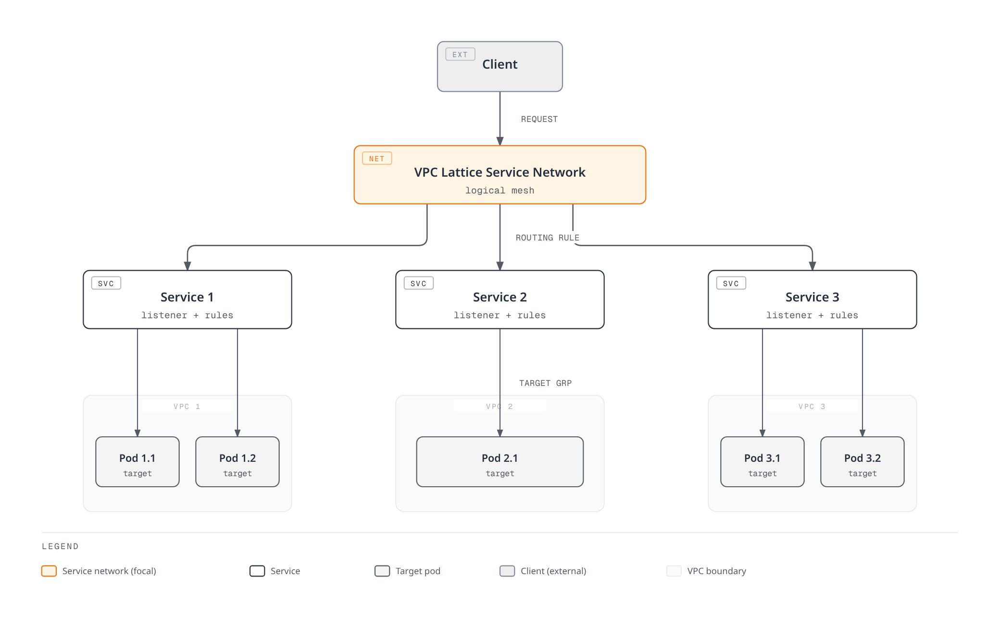
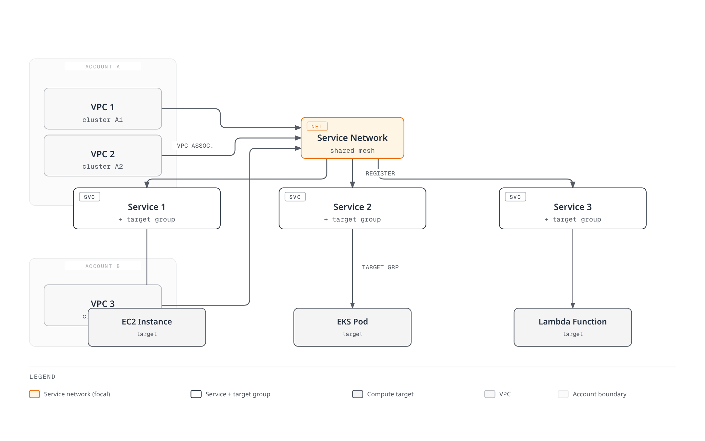
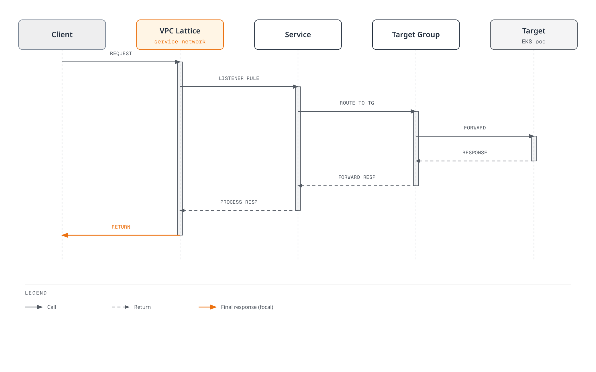
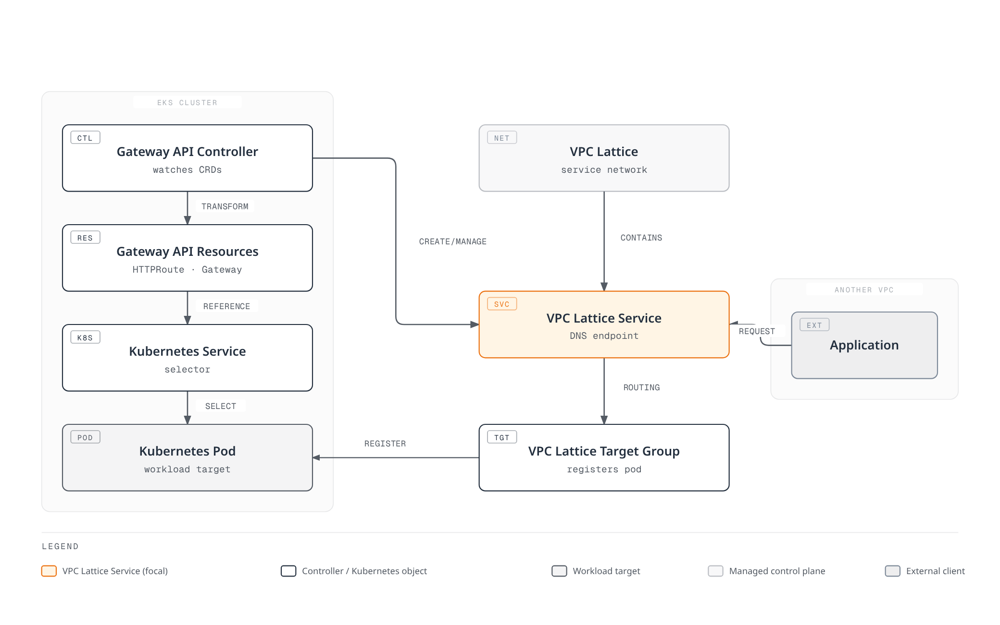

# VPC Lattice

Amazon VPC Lattice is an AWS application networking service that allows you to securely connect and manage services across different VPCs and accounts. This document explains the concepts, architecture, integration methods with Amazon EKS, and best practices for VPC Lattice.

## Table of Contents

1. [Overview](#overview)
2. [Architecture](#architecture)
3. [EKS and VPC Lattice Integration](#eks-and-vpc-lattice-integration)
4. [Installation and Configuration](#installation-and-configuration)
5. [Service Management](#service-management)
6. [Routing and Traffic Management](#routing-and-traffic-management)
7. [Security and Authentication](#security-and-authentication)
8. [Monitoring and Logging](#monitoring-and-logging)
9. [Best Practices](#best-practices)
10. [Troubleshooting](#troubleshooting)
11. [Conclusion](#conclusion)

## Overview

### What is VPC Lattice?

Amazon VPC Lattice is a fully managed application networking service for service-to-service connectivity, security, and monitoring. Key features include:

- **Service Network**: A logical boundary that connects services across multiple VPCs and accounts
- **Service Discovery**: Automatic discovery of services within the service network
- **Traffic Management**: Support for routing rules, weighted routing, and path-based routing
- **Authentication and Authorization**: Access control through AWS IAM and resource policies
- **Observability**: Integrated monitoring, logging, and tracing capabilities

### Key Use Cases

1. **Microservices Architecture**: Simplify and secure communication between microservices
2. **Multi-Account Environments**: Secure communication between services across multiple AWS accounts
3. **Hybrid Workloads**: Communication between containerized and non-containerized workloads
4. **Service Mesh Alternative**: Provide lightweight service mesh functionality to reduce complexity
5. **Multi-Cluster Connectivity**: Simplify service communication between multiple EKS clusters

### VPC Lattice vs Other Services

#### VPC Lattice vs API Gateway

| Feature | VPC Lattice | API Gateway |
|---------|------------|------------|
| Primary Use | Internal service-to-service communication | External API exposure |
| Network Location | Inside VPC | Internet-connected |
| Protocols | HTTP/HTTPS, gRPC | HTTP/HTTPS, WebSocket, REST, GraphQL |
| Authentication | AWS IAM, resource policies | IAM, Lambda authorizers, Cognito |
| Scalability | Auto-scaling | Auto-scaling |
| Pricing | Hourly + data throughput | Request count + data throughput |

#### VPC Lattice vs AWS App Mesh

| Feature | VPC Lattice | AWS App Mesh |
|---------|------------|-------------|
| Architecture | Managed service | Sidecar proxy-based |
| Complexity | Low | Medium |
| Protocols | HTTP/HTTPS, gRPC | HTTP/HTTPS, gRPC, TCP |
| Service Discovery | Built-in | AWS Cloud Map integration |
| Traffic Control | Basic routing rules | Advanced traffic control |
| Observability | CloudWatch integration | Detailed metrics via Envoy |

#### VPC Lattice vs Transit Gateway

| Feature | VPC Lattice | Transit Gateway |
|---------|------------|----------------|
| Primary Use | Service-to-service communication | VPC-to-VPC network connectivity |
| Abstraction Level | Service level | Network level |
| Protocol | Application layer (L7) | Network layer (L3) |
| Routing | Service name-based | IP-based |
| Security | Service-level policies | Security groups, NACLs |

## Architecture

### VPC Lattice Components

VPC Lattice consists of the following main components:

1. **Service Network**: A logical boundary for service-to-service communication
2. **Service**: An endpoint representing an application or microservice
3. **Target Group**: A set of targets to route traffic to a service
4. **Listener**: A process that handles connection requests to a service
5. **Rule**: Defines how a listener routes traffic
6. **VPC Association**: Connects a VPC to a service network



### Service Network Architecture

The service network is a core component of VPC Lattice that connects services across multiple VPCs and accounts.



### Traffic Flow

How traffic flows in VPC Lattice:

1. Client sends a request to the VPC Lattice service DNS name
2. VPC Lattice receives the request and processes it according to listener rules
3. Listener rules route the request to the appropriate target group
4. Target group forwards the request to registered targets (EC2, EKS pods, Lambda, etc.)
5. Target processes the response and returns it to the client



### Service Discovery

VPC Lattice automatically provides service discovery within the service network:

1. Each service has a unique DNS name (`service-name.vpc-lattice-svcs.region.on.aws`)
2. Clients access services using this DNS name
3. VPC Lattice handles DNS resolution and routing
4. Services are accessible from all VPCs connected to the service network

### Security Model

VPC Lattice provides the following security mechanisms:

1. **Network Isolation**: Service network provides a logically isolated environment
2. **Authentication and Authorization**: Service access control through AWS IAM
3. **Resource Policies**: Fine-grained access control for services and service networks
4. **TLS Encryption**: Encryption of service-to-service communication
5. **VPC Security Groups**: Additional security layer for targets

## EKS and VPC Lattice Integration

### Integration Architecture

The integration of Amazon EKS and VPC Lattice consists of the following components:

1. **AWS Gateway API Controller**: Transforms Kubernetes Gateway API into VPC Lattice resources
2. **Kubernetes Gateway API**: Standard Kubernetes API for service routing
3. **VPC Lattice Service Network**: Service network to which EKS clusters connect
4. **VPC Lattice Service**: VPC Lattice services mapped to Kubernetes services
5. **VPC Lattice Target Group**: Target groups mapped to Kubernetes pods



### Benefits of Integration

Integrating EKS with VPC Lattice provides the following benefits:

1. **Standardized API**: Consistent service management through Kubernetes Gateway API
2. **Cross-Cluster Communication**: Seamless communication between multiple EKS clusters
3. **Hybrid Workloads**: Communication between EKS pods and non-containerized workloads
4. **Centralized Management**: Manage all service networks from AWS console
5. **Unified Observability**: Integrated monitoring and logging through CloudWatch and CloudTrail
6. **Simplified Service Mesh**: Provide service mesh functionality without sidecars

### VPC Lattice as a Service Mesh Alternative

VPC Lattice can be an alternative to traditional service meshes (Istio, Linkerd, etc.) for the following reasons:

1. **Low Complexity**: Provides service mesh functionality without sidecar proxies
2. **Reduced Management Overhead**: Fully managed service by AWS
3. **Resource Efficiency**: Reduced resource usage without sidecar proxies
4. **AWS Service Integration**: Seamless integration with AWS service ecosystem

| Feature | VPC Lattice | Traditional Service Mesh |
|---------|------------|-----------------|
| Service Discovery | Built-in | Requires separate configuration |
| Traffic Routing | Supported | Supported |
| Traffic Splitting | Supported | Supported |
| Detailed Traffic Control | Limited | Extensive |
| Sidecar Proxy | Not required | Required |
| Management Complexity | Low | High |
| Resource Overhead | Low | High |
| Observability | CloudWatch integration | Various tool support |
## Installation and Configuration

### Prerequisites

Prerequisites for integrating VPC Lattice with EKS:

1. **Amazon EKS Cluster**: Kubernetes version 1.23 or higher
2. **IAM Permissions**: Permissions to create and manage VPC Lattice resources
3. **VPC Setup**: VPC with private subnets
4. **AWS CLI**: Latest version of AWS CLI
5. **kubectl**: Latest version of kubectl
6. **Helm**: (Optional) Helm 3 for AWS Gateway API Controller installation

### Installing AWS Gateway API Controller

AWS Gateway API Controller is responsible for transforming Kubernetes Gateway API resources into VPC Lattice resources.

#### Installation Using Helm

```bash
# Add Helm repository
helm repo add eks https://aws.github.io/eks-charts
helm repo update

# Install AWS Gateway API Controller
helm install gateway-api-controller eks/aws-gateway-controller \
  --namespace aws-gateway-controller \
  --create-namespace \
  --set serviceAccount.create=true \
  --set serviceAccount.name=aws-gateway-controller \
  --set serviceAccount.annotations."eks\.amazonaws\.com/role-arn"=arn:aws:iam::<AWS_ACCOUNT_ID>:role/AmazonGatewayControllerRole
```

#### Installation Using YAML Manifests

1. Service account and RBAC setup:

```yaml
apiVersion: v1
kind: ServiceAccount
metadata:
  name: aws-gateway-controller
  namespace: aws-gateway-controller
  annotations:
    eks.amazonaws.com/role-arn: arn:aws:iam::<AWS_ACCOUNT_ID>:role/AmazonGatewayControllerRole
---
apiVersion: rbac.authorization.k8s.io/v1
kind: ClusterRole
metadata:
  name: aws-gateway-controller
rules:
- apiGroups: ["gateway.networking.k8s.io"]
  resources: ["gatewayclasses", "gateways", "httproutes"]
  verbs: ["get", "list", "watch", "update", "patch"]
- apiGroups: [""]
  resources: ["services", "secrets", "namespaces"]
  verbs: ["get", "list", "watch"]
- apiGroups: [""]
  resources: ["events"]
  verbs: ["create", "patch"]
---
apiVersion: rbac.authorization.k8s.io/v1
kind: ClusterRoleBinding
metadata:
  name: aws-gateway-controller
roleRef:
  apiGroup: rbac.authorization.k8s.io
  kind: ClusterRole
  name: aws-gateway-controller
subjects:
- kind: ServiceAccount
  name: aws-gateway-controller
  namespace: aws-gateway-controller
```

2. Controller deployment:

```yaml
apiVersion: apps/v1
kind: Deployment
metadata:
  name: aws-gateway-controller
  namespace: aws-gateway-controller
spec:
  replicas: 1
  selector:
    matchLabels:
      app: aws-gateway-controller
  template:
    metadata:
      labels:
        app: aws-gateway-controller
    spec:
      serviceAccountName: aws-gateway-controller
      containers:
      - name: controller
        image: public.ecr.aws/aws-application-networking-k8s/aws-gateway-controller:v1.0.0
        args:
        - --health-probe-bind-address=:8081
        - --metrics-bind-address=:8080
        - --leader-elect
        resources:
          limits:
            cpu: 500m
            memory: 128Mi
          requests:
            cpu: 10m
            memory: 64Mi
```

### IAM Role Setup

The AWS Gateway API Controller requires appropriate IAM permissions to manage VPC Lattice resources.

#### IRSA (IAM Roles for Service Accounts) Setup

```bash
# Create IAM policy
cat <<EOF > vpc-lattice-policy.json
{
  "Version": "2012-10-17",
  "Statement": [
    {
      "Effect": "Allow",
      "Action": [
        "vpc-lattice:*",
        "ec2:DescribeVpcs",
        "ec2:DescribeSubnets",
        "ec2:DescribeSecurityGroups",
        "elasticloadbalancing:DescribeTargetGroups",
        "elasticloadbalancing:DescribeTargetHealth",
        "elasticloadbalancing:RegisterTargets",
        "elasticloadbalancing:DeregisterTargets"
      ],
      "Resource": "*"
    }
  ]
}
EOF

aws iam create-policy \
  --policy-name AmazonGatewayControllerPolicy \
  --policy-document file://vpc-lattice-policy.json

# Create IAM role and associate with service account
eksctl create iamserviceaccount \
  --name aws-gateway-controller \
  --namespace aws-gateway-controller \
  --cluster <CLUSTER_NAME> \
  --attach-policy-arn arn:aws:iam::<AWS_ACCOUNT_ID>:policy/AmazonGatewayControllerPolicy \
  --approve \
  --override-existing-serviceaccounts
```

### Creating VPC Lattice Service Network

VPC Lattice service networks can be created through AWS Management Console, AWS CLI, or AWS CloudFormation.

#### Creation Using AWS CLI

```bash
# Create service network
aws vpc-lattice create-service-network \
  --name my-service-network \
  --auth-type AWS_IAM

# Store service network ID
SERVICE_NETWORK_ID=$(aws vpc-lattice list-service-networks \
  --query "items[?name=='my-service-network'].id" \
  --output text)

# Associate VPC with service network
aws vpc-lattice create-service-network-vpc-association \
  --service-network-identifier $SERVICE_NETWORK_ID \
  --vpc-identifier <VPC_ID> \
  --security-group-ids <SECURITY_GROUP_ID>
```

#### Creation Using AWS CloudFormation

```yaml
Resources:
  MyServiceNetwork:
    Type: AWS::VpcLattice::ServiceNetwork
    Properties:
      Name: my-service-network
      AuthType: AWS_IAM

  MyVpcAssociation:
    Type: AWS::VpcLattice::ServiceNetworkVpcAssociation
    Properties:
      ServiceNetworkIdentifier: !Ref MyServiceNetwork
      VpcIdentifier: !Ref MyVPC
      SecurityGroupIds:
        - !Ref MySecurityGroup
```

### Configuring Gateway API Resources

Configure Kubernetes Gateway API resources to integrate with VPC Lattice.

#### 1. Create GatewayClass

GatewayClass defines the implementation of Gateway resources.

```yaml
apiVersion: gateway.networking.k8s.io/v1beta1
kind: GatewayClass
metadata:
  name: amazon-vpc-lattice
spec:
  controllerName: application-networking.k8s.aws/gateway-api-controller
```

#### 2. Create Gateway

Gateway defines how traffic enters the cluster.

```yaml
apiVersion: gateway.networking.k8s.io/v1beta1
kind: Gateway
metadata:
  name: my-gateway
  namespace: default
  annotations:
    application-networking.k8s.aws/service-network-id: <SERVICE_NETWORK_ID>
spec:
  gatewayClassName: amazon-vpc-lattice
  listeners:
  - name: http
    port: 80
    protocol: HTTP
```

#### 3. Create HTTPRoute

HTTPRoute defines how HTTP traffic is routed to services.

```yaml
apiVersion: gateway.networking.k8s.io/v1beta1
kind: HTTPRoute
metadata:
  name: my-http-route
  namespace: default
spec:
  parentRefs:
  - name: my-gateway
    kind: Gateway
  rules:
  - matches:
    - path:
        type: PathPrefix
        value: /api
    backendRefs:
    - name: my-service
      port: 8080
```

### Service and Pod Configuration

Configure Kubernetes services and pods to integrate with VPC Lattice.

#### 1. Create Service

```yaml
apiVersion: v1
kind: Service
metadata:
  name: my-service
  namespace: default
spec:
  selector:
    app: my-app
  ports:
  - port: 8080
    targetPort: 8080
  type: ClusterIP
```

#### 2. Create Deployment

```yaml
apiVersion: apps/v1
kind: Deployment
metadata:
  name: my-app
  namespace: default
spec:
  replicas: 3
  selector:
    matchLabels:
      app: my-app
  template:
    metadata:
      labels:
        app: my-app
    spec:
      containers:
      - name: my-container
        image: nginx:latest
        ports:
        - containerPort: 8080
        readinessProbe:
          httpGet:
            path: /health
            port: 8080
          initialDelaySeconds: 5
          periodSeconds: 10
```

## Service Management

### Creating VPC Lattice Services

VPC Lattice services can be created directly through AWS Management Console, AWS CLI, or AWS CloudFormation, or indirectly through Kubernetes Gateway API.

#### Direct Creation Using AWS CLI

```bash
# Create target group
aws vpc-lattice create-target-group \
  --name my-target-group \
  --type INSTANCE \
  --config '{"port":80,"protocol":"HTTP","vpcIdentifier":"<VPC_ID>","healthCheck":{"enabled":true,"protocol":"HTTP","path":"/health","port":80,"healthCheckIntervalSeconds":30,"healthCheckTimeoutSeconds":5,"healthyThresholdCount":5,"unhealthyThresholdCount":2}}'

# Store target group ID
TARGET_GROUP_ID=$(aws vpc-lattice list-target-groups \
  --query "items[?name=='my-target-group'].id" \
  --output text)

# Create service
aws vpc-lattice create-service \
  --name my-service \
  --auth-type AWS_IAM

# Store service ID
SERVICE_ID=$(aws vpc-lattice list-services \
  --query "items[?name=='my-service'].id" \
  --output text)

# Create listener
aws vpc-lattice create-listener \
  --service-identifier $SERVICE_ID \
  --name my-listener \
  --protocol HTTP \
  --port 80 \
  --default-action '{"forward":{"targetGroups":[{"targetGroupIdentifier":"'$TARGET_GROUP_ID'"}]}}'

# Associate service with service network
aws vpc-lattice create-service-network-service-association \
  --service-network-identifier $SERVICE_NETWORK_ID \
  --service-identifier $SERVICE_ID
```

#### Indirect Creation Using Kubernetes Gateway API

When you create Gateway API resources, the AWS Gateway API Controller automatically creates VPC Lattice resources.

```yaml
apiVersion: gateway.networking.k8s.io/v1beta1
kind: Gateway
metadata:
  name: my-gateway
  namespace: default
  annotations:
    application-networking.k8s.aws/service-network-id: <SERVICE_NETWORK_ID>
spec:
  gatewayClassName: amazon-vpc-lattice
  listeners:
  - name: http
    port: 80
    protocol: HTTP
---
apiVersion: gateway.networking.k8s.io/v1beta1
kind: HTTPRoute
metadata:
  name: my-http-route
  namespace: default
spec:
  parentRefs:
  - name: my-gateway
    kind: Gateway
  rules:
  - matches:
    - path:
        type: PathPrefix
        value: /api
    backendRefs:
    - name: my-service
      port: 8080
```

### Service Discovery and Access

VPC Lattice services are automatically assigned DNS names and are discoverable within the service network.

#### DNS Name Format

```
<service-name>.<service-network-id>.vpc-lattice-svcs.<region>.on.aws
```

#### Service Access Example

```bash
# Query service DNS name
SERVICE_DNS=$(aws vpc-lattice get-service \
  --service-identifier $SERVICE_ID \
  --query "dnsEntry.domainName" \
  --output text)

# Access service
curl -v http://$SERVICE_DNS/api
```

### Updating and Deleting Services

#### Updating Services Using AWS CLI

```bash
# Update service
aws vpc-lattice update-service \
  --service-identifier $SERVICE_ID \
  --auth-type NONE

# Update listener
aws vpc-lattice update-listener \
  --service-identifier $SERVICE_ID \
  --listener-identifier <LISTENER_ID> \
  --default-action '{"forward":{"targetGroups":[{"targetGroupIdentifier":"'$TARGET_GROUP_ID'","weight":100}]}}'
```

#### Deleting Services Using AWS CLI

```bash
# Dissociate from service network
aws vpc-lattice delete-service-network-service-association \
  --service-network-service-association-identifier <ASSOCIATION_ID>

# Delete listener
aws vpc-lattice delete-listener \
  --service-identifier $SERVICE_ID \
  --listener-identifier <LISTENER_ID>

# Delete service
aws vpc-lattice delete-service \
  --service-identifier $SERVICE_ID

# Delete target group
aws vpc-lattice delete-target-group \
  --target-group-identifier $TARGET_GROUP_ID
```

#### Service Management Using Kubernetes Gateway API

When you update or delete Gateway API resources, the AWS Gateway API Controller automatically updates or deletes VPC Lattice resources.

```bash
# Update HTTPRoute
kubectl apply -f updated-http-route.yaml

# Delete HTTPRoute
kubectl delete httproute my-http-route

# Delete Gateway
kubectl delete gateway my-gateway
```

## Routing and Traffic Management

### Basic Routing

VPC Lattice provides various routing options including path-based routing, header-based routing, and weighted routing.

#### Path-based Routing

```yaml
apiVersion: gateway.networking.k8s.io/v1beta1
kind: HTTPRoute
metadata:
  name: path-based-route
  namespace: default
spec:
  parentRefs:
  - name: my-gateway
    kind: Gateway
  rules:
  - matches:
    - path:
        type: PathPrefix
        value: /api/v1
    backendRefs:
    - name: service-v1
      port: 8080
  - matches:
    - path:
        type: PathPrefix
        value: /api/v2
    backendRefs:
    - name: service-v2
      port: 8080
```

#### Header-based Routing

```yaml
apiVersion: gateway.networking.k8s.io/v1beta1
kind: HTTPRoute
metadata:
  name: header-based-route
  namespace: default
spec:
  parentRefs:
  - name: my-gateway
    kind: Gateway
  rules:
  - matches:
    - headers:
      - name: "version"
        value: "v1"
    backendRefs:
    - name: service-v1
      port: 8080
  - matches:
    - headers:
      - name: "version"
        value: "v2"
    backendRefs:
    - name: service-v2
      port: 8080
```

### Traffic Splitting and Canary Deployment

VPC Lattice supports traffic splitting and canary deployments through weighted routing.

#### Weighted Routing Using AWS CLI

```bash
# Set up weighted routing
aws vpc-lattice update-listener \
  --service-identifier $SERVICE_ID \
  --listener-identifier <LISTENER_ID> \
  --default-action '{
    "forward": {
      "targetGroups": [
        {
          "targetGroupIdentifier": "'$TARGET_GROUP_ID_V1'",
          "weight": 80
        },
        {
          "targetGroupIdentifier": "'$TARGET_GROUP_ID_V2'",
          "weight": 20
        }
      ]
    }
  }'
```

#### Weighted Routing Using Kubernetes Gateway API

Currently, Kubernetes Gateway API does not directly support weighted routing, but the AWS Gateway API Controller supports this feature through annotations.

```yaml
apiVersion: gateway.networking.k8s.io/v1beta1
kind: HTTPRoute
metadata:
  name: weighted-route
  namespace: default
  annotations:
    application-networking.k8s.aws/traffic-weights: |
      {
        "service-v1": 80,
        "service-v2": 20
      }
spec:
  parentRefs:
  - name: my-gateway
    kind: Gateway
  rules:
  - matches:
    - path:
        type: PathPrefix
        value: /api
    backendRefs:
    - name: service-v1
      port: 8080
    - name: service-v2
      port: 8080
```

### Health Check Configuration

VPC Lattice supports health checks for target groups.

#### Health Check Configuration Using AWS CLI

```bash
# Update health check configuration
aws vpc-lattice update-target-group \
  --target-group-identifier $TARGET_GROUP_ID \
  --health-check '{
    "enabled": true,
    "protocol": "HTTP",
    "path": "/health",
    "port": 8080,
    "healthCheckIntervalSeconds": 30,
    "healthCheckTimeoutSeconds": 5,
    "healthyThresholdCount": 5,
    "unhealthyThresholdCount": 2,
    "matcher": {
      "httpCode": "200-299"
    }
  }'
```

#### Health Check Configuration Using Kubernetes Gateway API

The AWS Gateway API Controller supports health check configuration through annotations.

```yaml
apiVersion: gateway.networking.k8s.io/v1beta1
kind: HTTPRoute
metadata:
  name: health-check-route
  namespace: default
  annotations:
    application-networking.k8s.aws/health-check: |
      {
        "enabled": true,
        "protocol": "HTTP",
        "path": "/health",
        "port": 8080,
        "intervalSeconds": 30,
        "timeoutSeconds": 5,
        "healthyThresholdCount": 5,
        "unhealthyThresholdCount": 2,
        "matcher": {
          "httpCode": "200-299"
        }
      }
spec:
  parentRefs:
  - name: my-gateway
    kind: Gateway
  rules:
  - matches:
    - path:
        type: PathPrefix
        value: /api
    backendRefs:
    - name: my-service
      port: 8080
```
## Security and Authentication

### Authentication Methods

VPC Lattice supports the following authentication methods:

1. **AWS IAM**: Authentication using AWS Identity and Access Management
2. **No Authentication**: Allow all requests without authentication

#### Configuring AWS IAM Authentication

```bash
# Create service with IAM authentication
aws vpc-lattice create-service \
  --name my-service \
  --auth-type AWS_IAM
```

#### Configuring IAM Authentication Using Kubernetes Gateway API

```yaml
apiVersion: gateway.networking.k8s.io/v1beta1
kind: Gateway
metadata:
  name: my-gateway
  namespace: default
  annotations:
    application-networking.k8s.aws/service-network-id: <SERVICE_NETWORK_ID>
    application-networking.k8s.aws/auth-type: "AWS_IAM"
spec:
  gatewayClassName: amazon-vpc-lattice
  listeners:
  - name: http
    port: 80
    protocol: HTTP
```

### Resource Policies

VPC Lattice provides fine-grained access control for services and service networks through resource policies.

#### Setting Service Resource Policy

```bash
# Set service resource policy
aws vpc-lattice put-resource-policy \
  --resource-arn arn:aws:vpc-lattice:<REGION>:<ACCOUNT_ID>:service/<SERVICE_ID> \
  --policy '{
    "Version": "2012-10-17",
    "Statement": [
      {
        "Effect": "Allow",
        "Principal": {
          "AWS": "arn:aws:iam::<ACCOUNT_ID>:role/MyRole"
        },
        "Action": "vpc-lattice:Invoke",
        "Resource": "arn:aws:vpc-lattice:<REGION>:<ACCOUNT_ID>:service/<SERVICE_ID>"
      }
    ]
  }'
```

#### Setting Service Network Resource Policy

```bash
# Set service network resource policy
aws vpc-lattice put-resource-policy \
  --resource-arn arn:aws:vpc-lattice:<REGION>:<ACCOUNT_ID>:servicenetwork/<SERVICE_NETWORK_ID> \
  --policy '{
    "Version": "2012-10-17",
    "Statement": [
      {
        "Effect": "Allow",
        "Principal": {
          "AWS": "arn:aws:iam::<ACCOUNT_ID>:role/MyRole"
        },
        "Action": [
          "vpc-lattice:CreateServiceNetworkVpcAssociation",
          "vpc-lattice:CreateServiceNetworkServiceAssociation"
        ],
        "Resource": "arn:aws:vpc-lattice:<REGION>:<ACCOUNT_ID>:servicenetwork/<SERVICE_NETWORK_ID>"
      }
    ]
  }'
```

### Cross-Account Access

VPC Lattice supports communication between services across multiple AWS accounts through service networks.

#### Sharing Service Network Cross-Account

1. Share service network using AWS RAM (Resource Access Manager):

```bash
# Share service network
aws ram create-resource-share \
  --name my-service-network-share \
  --resource-arns arn:aws:vpc-lattice:<REGION>:<ACCOUNT_ID>:servicenetwork/<SERVICE_NETWORK_ID> \
  --principals arn:aws:organizations::o-<ORGANIZATION_ID>:organization

# Or share with specific account
aws ram create-resource-share \
  --name my-service-network-share \
  --resource-arns arn:aws:vpc-lattice:<REGION>:<ACCOUNT_ID>:servicenetwork/<SERVICE_NETWORK_ID> \
  --principals <TARGET_ACCOUNT_ID>
```

2. Accept shared service network in target account:

```bash
# Accept share invitation
aws ram accept-resource-share-invitation \
  --resource-share-invitation-arn arn:aws:ram:<REGION>:<ACCOUNT_ID>:resource-share-invitation/<INVITATION_ID>
```

3. Connect VPC to shared service network in target account:

```bash
# VPC association
aws vpc-lattice create-service-network-vpc-association \
  --service-network-identifier <SERVICE_NETWORK_ID> \
  --vpc-identifier <VPC_ID> \
  --security-group-ids <SECURITY_GROUP_ID>
```

### TLS Configuration

VPC Lattice supports TLS encryption for services.

#### TLS Configuration Using AWS CLI

```bash
# Create or import ACM certificate
CERTIFICATE_ARN=$(aws acm request-certificate \
  --domain-name my-service.example.com \
  --validation-method DNS \
  --query CertificateArn \
  --output text)

# Create TLS listener
aws vpc-lattice create-listener \
  --service-identifier $SERVICE_ID \
  --name my-tls-listener \
  --protocol HTTPS \
  --port 443 \
  --tls '{
    "certificateArn": "'$CERTIFICATE_ARN'",
    "mode": "STRICT"
  }' \
  --default-action '{
    "forward": {
      "targetGroups": [
        {
          "targetGroupIdentifier": "'$TARGET_GROUP_ID'"
        }
      ]
    }
  }'
```

#### TLS Configuration Using Kubernetes Gateway API

```yaml
apiVersion: gateway.networking.k8s.io/v1beta1
kind: Gateway
metadata:
  name: my-tls-gateway
  namespace: default
  annotations:
    application-networking.k8s.aws/service-network-id: <SERVICE_NETWORK_ID>
spec:
  gatewayClassName: amazon-vpc-lattice
  listeners:
  - name: https
    port: 443
    protocol: HTTPS
    tls:
      mode: Terminate
      certificateRefs:
      - kind: Secret
        name: my-tls-cert
```

## Monitoring and Logging

### CloudWatch Metrics

VPC Lattice provides various CloudWatch metrics to monitor service performance and status.

#### Key Metrics

| Metric Name | Description | Dimensions |
|------------|------|------|
| RequestCount | Number of processed requests | ServiceId, ServiceName, TargetGroupId |
| HTTP_4XX_Count | Number of 4XX HTTP response codes | ServiceId, ServiceName, TargetGroupId |
| HTTP_5XX_Count | Number of 5XX HTTP response codes | ServiceId, ServiceName, TargetGroupId |
| ProcessedBytes | Number of processed bytes | ServiceId, ServiceName, TargetGroupId |
| TargetProcessingTime | Target processing time (ms) | ServiceId, ServiceName, TargetGroupId |
| HealthyTargetCount | Number of healthy targets | TargetGroupId |
| UnhealthyTargetCount | Number of unhealthy targets | TargetGroupId |

#### Creating CloudWatch Dashboard

```bash
# Create CloudWatch dashboard
aws cloudwatch put-dashboard \
  --dashboard-name VPCLatticeMonitoring \
  --dashboard-body '{
    "widgets": [
      {
        "type": "metric",
        "x": 0,
        "y": 0,
        "width": 12,
        "height": 6,
        "properties": {
          "metrics": [
            ["AWS/VpcLattice", "RequestCount", "ServiceName", "my-service"]
          ],
          "period": 60,
          "stat": "Sum",
          "region": "<REGION>",
          "title": "Request Count"
        }
      },
      {
        "type": "metric",
        "x": 12,
        "y": 0,
        "width": 12,
        "height": 6,
        "properties": {
          "metrics": [
            ["AWS/VpcLattice", "HTTP_4XX_Count", "ServiceName", "my-service"],
            ["AWS/VpcLattice", "HTTP_5XX_Count", "ServiceName", "my-service"]
          ],
          "period": 60,
          "stat": "Sum",
          "region": "<REGION>",
          "title": "Error Count"
        }
      }
    ]
  }'
```

### CloudWatch Alarms

Set up CloudWatch alarms for VPC Lattice metrics to detect issues early.

```bash
# Create 5XX error alarm
aws cloudwatch put-metric-alarm \
  --alarm-name VPCLattice-5XX-Errors \
  --alarm-description "Alarm when 5XX errors exceed threshold" \
  --metric-name HTTP_5XX_Count \
  --namespace AWS/VpcLattice \
  --dimensions Name=ServiceName,Value=my-service \
  --statistic Sum \
  --period 60 \
  --evaluation-periods 5 \
  --threshold 10 \
  --comparison-operator GreaterThanThreshold \
  --alarm-actions arn:aws:sns:<REGION>:<ACCOUNT_ID>:my-alert-topic
```

### Access Logging

VPC Lattice can send access logs for services to Amazon S3, Amazon CloudWatch Logs, or Amazon Kinesis Data Firehose.

#### Configuring S3 Access Logging

```bash
# Create S3 bucket
aws s3 mb s3://vpc-lattice-access-logs-<ACCOUNT_ID>

# Set bucket policy
aws s3api put-bucket-policy \
  --bucket vpc-lattice-access-logs-<ACCOUNT_ID> \
  --policy '{
    "Version": "2012-10-17",
    "Statement": [
      {
        "Effect": "Allow",
        "Principal": {
          "Service": "delivery.logs.amazonaws.com"
        },
        "Action": "s3:PutObject",
        "Resource": "arn:aws:s3:::vpc-lattice-access-logs-<ACCOUNT_ID>/*",
        "Condition": {
          "StringEquals": {
            "s3:x-amz-acl": "bucket-owner-full-control"
          }
        }
      }
    ]
  }'

# Enable access logging
aws vpc-lattice create-access-log-subscription \
  --resource-identifier $SERVICE_ID \
  --destination-arn arn:aws:s3:::vpc-lattice-access-logs-<ACCOUNT_ID> \
  --destination-name my-s3-logs
```

#### Configuring CloudWatch Logs Access Logging

```bash
# Create log group
aws logs create-log-group \
  --log-group-name /aws/vpc-lattice/my-service

# Enable access logging
aws vpc-lattice create-access-log-subscription \
  --resource-identifier $SERVICE_ID \
  --destination-arn arn:aws:logs:<REGION>:<ACCOUNT_ID>:log-group:/aws/vpc-lattice/my-service \
  --destination-name my-cloudwatch-logs
```

### AWS X-Ray Integration

VPC Lattice integrates with AWS X-Ray to support distributed tracing.

#### Enabling X-Ray Tracing

```bash
# Enable X-Ray tracing
aws vpc-lattice update-service \
  --service-identifier $SERVICE_ID \
  --auth-type AWS_IAM \
  --tracing-config '{
    "enabled": true
  }'
```

#### Enabling X-Ray Tracing Using Kubernetes Gateway API

```yaml
apiVersion: gateway.networking.k8s.io/v1beta1
kind: Gateway
metadata:
  name: my-gateway
  namespace: default
  annotations:
    application-networking.k8s.aws/service-network-id: <SERVICE_NETWORK_ID>
    application-networking.k8s.aws/xray-tracing: "enabled"
spec:
  gatewayClassName: amazon-vpc-lattice
  listeners:
  - name: http
    port: 80
    protocol: HTTP
```

## Best Practices

### Design and Architecture

1. **Service Network Design**
   - Separate service networks by logical boundaries
   - Separate service networks by environment (development, staging, production)
   - Separate service networks based on security requirements

2. **Service Naming Conventions**
   - Use consistent naming conventions
   - Include environment, service type, version in names
   - Example: `<env>-<service-name>-<version>`

3. **Target Group Design**
   - Place targets with similar characteristics in the same target group
   - Optimize health check path and interval
   - Set appropriate unhealthy threshold

### Performance Optimization

1. **Health Check Optimization**
   - Set appropriate health check interval (not too short)
   - Implement lightweight health check endpoints
   - Configure health check path to verify critical dependencies

2. **Connection Reuse**
   - Implement client-side connection pooling
   - Use Keep-Alive headers
   - Optimize connection timeout

3. **Caching Strategy**
   - Implement client-side caching for static content
   - Optimize Cache-Control headers
   - Integrate CDN if needed

### Security Hardening

1. **Principle of Least Privilege**
   - Grant only minimum required permissions
   - Create service-specific IAM policies
   - Regular permission review and audit

2. **Network Security**
   - Restrict traffic using security groups
   - Open only required ports
   - Consider using VPC endpoints

3. **Encryption**
   - Use TLS for data encryption in transit
   - Use latest TLS versions and cipher suites
   - Configure automatic certificate renewal

### Monitoring and Observability

1. **Comprehensive Monitoring**
   - Create CloudWatch dashboards for all services
   - Set up alarms for key metrics
   - Implement log analysis and anomaly detection

2. **Logging Strategy**
   - Enable access logging for all services
   - Set log retention policies
   - Integrate log analysis tools

3. **Distributed Tracing**
   - Enable X-Ray tracing
   - Implement trace correlation between services
   - Analyze and visualize trace data

### Cost Optimization

1. **Resource Usage Monitoring**
   - Track service and target group usage
   - Identify and remove unused resources
   - Use cost allocation tags

2. **Traffic Optimization**
   - Reduce unnecessary requests
   - Optimize response sizes
   - Implement batch processing (when possible)

3. **Auto Scaling**
   - Auto scale targets based on traffic patterns
   - Implement scheduled scaling (for predictable traffic patterns)
   - Optimize scaling thresholds

## Troubleshooting

### Common Issues and Solutions

#### 1. Connectivity Issues

**Issue**: Client cannot connect to VPC Lattice service

**Solution**:
- Check connectivity between VPC and service network
- Verify security group rules
- Check DNS resolution
- Check target status

```bash
# Check VPC association
aws vpc-lattice list-service-network-vpc-associations \
  --service-network-identifier $SERVICE_NETWORK_ID

# Check target status
aws vpc-lattice list-targets \
  --target-group-identifier $TARGET_GROUP_ID
```

#### 2. Authentication Issues

**Issue**: Client receives authentication error

**Solution**:
- Verify IAM policies and permissions
- Check resource policies
- Check signature version and headers
- Check temporary credential expiration

```bash
# Check resource policy
aws vpc-lattice get-resource-policy \
  --resource-arn arn:aws:vpc-lattice:<REGION>:<ACCOUNT_ID>:service/<SERVICE_ID>
```

#### 3. Routing Issues

**Issue**: Request is routed to wrong target

**Solution**:
- Check listener rules and priorities
- Check path patterns and match conditions
- Check target group configuration
- Check weighted routing settings

```bash
# Check listener rules
aws vpc-lattice list-listeners \
  --service-identifier $SERVICE_ID

# Check target group
aws vpc-lattice get-target-group \
  --target-group-identifier $TARGET_GROUP_ID
```

#### 4. Health Check Failures

**Issue**: Target is failing health checks

**Solution**:
- Check health check endpoint availability
- Check health check configuration
- Check target application logs
- Check network connectivity

```bash
# Check health check configuration
aws vpc-lattice get-target-group \
  --target-group-identifier $TARGET_GROUP_ID \
  --query "config.healthCheck"

# Check target status
aws vpc-lattice list-targets \
  --target-group-identifier $TARGET_GROUP_ID
```

### Logging and Debugging

#### 1. Access Log Analysis

You can analyze VPC Lattice access logs to diagnose issues.

```bash
# Download access logs from S3
aws s3 cp s3://vpc-lattice-access-logs-<ACCOUNT_ID>/ . --recursive

# Query access logs from CloudWatch Logs
aws logs start-query \
  --log-group-name /aws/vpc-lattice/my-service \
  --start-time $(date -d '1 hour ago' +%s) \
  --end-time $(date +%s) \
  --query-string 'fields @timestamp, client_ip, request_path, status_code, request_processing_time | filter status_code >= 400'
```

#### 2. CloudWatch Metrics Analysis

You can analyze CloudWatch metrics to diagnose performance issues.

```bash
# Query request count metrics
aws cloudwatch get-metric-statistics \
  --namespace AWS/VpcLattice \
  --metric-name RequestCount \
  --dimensions Name=ServiceName,Value=my-service \
  --start-time $(date -d '1 hour ago' -u +%Y-%m-%dT%H:%M:%SZ) \
  --end-time $(date -u +%Y-%m-%dT%H:%M:%SZ) \
  --period 60 \
  --statistics Sum

# Query error metrics
aws cloudwatch get-metric-statistics \
  --namespace AWS/VpcLattice \
  --metric-name HTTP_5XX_Count \
  --dimensions Name=ServiceName,Value=my-service \
  --start-time $(date -d '1 hour ago' -u +%Y-%m-%dT%H:%M:%SZ) \
  --end-time $(date -u +%Y-%m-%dT%H:%M:%SZ) \
  --period 60 \
  --statistics Sum
```

#### 3. X-Ray Trace Analysis

You can analyze distributed traces using AWS X-Ray.

```bash
# Query X-Ray traces
aws xray get-service-graph \
  --start-time $(date -d '1 hour ago' +%s) \
  --end-time $(date +%s)

# Query specific trace
aws xray batch-get-traces \
  --trace-ids <TRACE_ID>
```

### AWS Support and Troubleshooting Tools

#### 1. Creating AWS Support Cases

For severe issues, you can create AWS support cases.

```bash
# Create AWS support case
aws support create-case \
  --subject "VPC Lattice Connectivity Issue" \
  --service-code vpc-lattice \
  --category-code connectivity \
  --severity-code urgent \
  --communication-body "We are experiencing connectivity issues with our VPC Lattice service. Service ID: $SERVICE_ID" \
  --language en
```

#### 2. AWS Resource Health Check

You can check AWS service status through the AWS Health Dashboard.

```bash
# Check AWS Health events
aws health describe-events \
  --filter 'eventTypeCategories=issue,scheduledChange,accountNotification' \
  --region <REGION>
```

## Conclusion

Amazon VPC Lattice is an AWS application networking service that allows you to securely connect and manage services across different VPCs and accounts. Through integration with EKS, it provides service mesh functionality in Kubernetes environments in a simplified manner.

This document covered the following content:

1. **Overview**: Concepts of VPC Lattice, key use cases, and comparison with other services
2. **Architecture**: VPC Lattice components, service network architecture, and traffic flow
3. **EKS and VPC Lattice Integration**: Integration through AWS Gateway API Controller and its benefits
4. **Installation and Configuration**: AWS Gateway API Controller installation, IAM role setup, and service network creation
5. **Service Management**: VPC Lattice service creation, discovery, access, update, and deletion
6. **Routing and Traffic Management**: Basic routing, traffic splitting, canary deployment, and health checks
7. **Security and Authentication**: Authentication methods, resource policies, cross-account access, and TLS configuration
8. **Monitoring and Logging**: CloudWatch metrics, alarms, access logging, and X-Ray integration
9. **Best Practices**: Design, performance, security, monitoring, and cost optimization
10. **Troubleshooting**: Common issues and solutions, logging and debugging

Effectively implementing and managing VPC Lattice reduces the complexity of microservices architecture, enhances security of service-to-service communication, and improves observability. As an AWS managed service, it provides the benefits of a service mesh while minimizing operational overhead.

## References

- [Amazon VPC Lattice Official Documentation](https://docs.aws.amazon.com/vpc-lattice/)
- [AWS Gateway API Controller Official Documentation](https://github.com/aws/aws-application-networking-k8s)
- [Kubernetes Gateway API Documentation](https://gateway-api.sigs.k8s.io/)
- [Amazon EKS Workshop - VPC Lattice](https://www.eksworkshop.com/networking/vpc-lattice/)
- [AWS Blog - VPC Lattice Introduction](https://aws.amazon.com/blogs/aws/amazon-vpc-lattice-a-new-application-networking-service/)
- [AWS Blog - EKS and VPC Lattice Integration](https://aws.amazon.com/blogs/containers/amazon-eks-and-vpc-lattice-integration/)
- [AWS re:Invent 2022 - VPC Lattice Session](https://www.youtube.com/watch?v=bGHZlJGQl1I)
- [AWS Samples - VPC Lattice Examples](https://github.com/aws-samples/aws-vpc-lattice-examples)

## Quiz

To test what you've learned in this chapter, try the [VPC Lattice quiz](../quizzes/networking/02-vpc-lattice-quiz.md).
