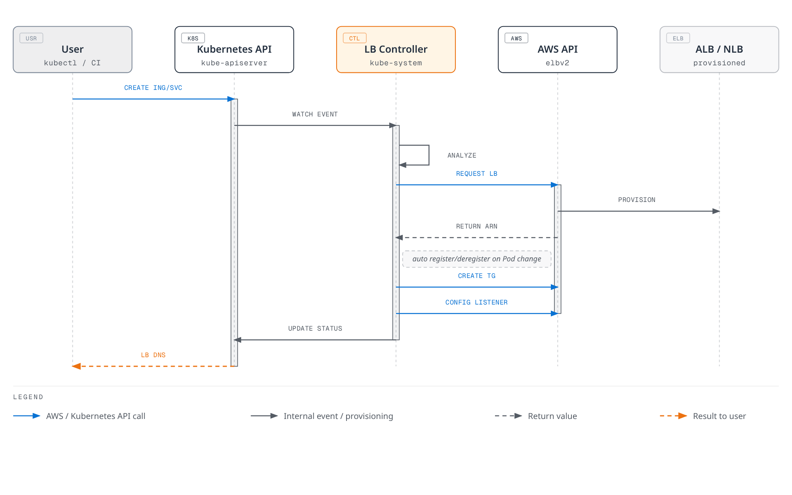

# AWS Load Balancer Controller

> **Review baseline**: AWS Load Balancer Controller / Helm chart v3.5.0
> **Last Updated**: September 11, 2026

## Overview

AWS Load Balancer Controller is a controller that manages AWS Elastic Load Balancers (ELB) for Kubernetes clusters. It automatically integrates Kubernetes Ingress and Service resources with AWS Application Load Balancer (ALB) and Network Load Balancer (NLB).

### Key Features

- **Application Load Balancer (ALB)**: HTTP/HTTPS traffic, path-based routing, host-based routing
- **Network Load Balancer (NLB)**: TCP/UDP traffic, high-performance L4 load balancing
- **TargetGroupBinding**: Connect existing Target Groups to Kubernetes Services
- **AWS WAF Integration**: Web Application Firewall enforcement
- **AWS Shield**: DDoS protection


[🔍 View interactive diagram](https://www.atomai.click/kubernetes-docs/archmaps/en-networking-03-aws-lb-controller-0.html)

## Architecture

### How the Controller Works



[🔍 View interactive diagram](https://www.atomai.click/kubernetes-docs/archmaps/en-networking-03-aws-lb-controller-1.html)

### Component Structure

Install the complete released chart, including RBAC, CRDs, probes, and webhook certificates. The controller watches Kubernetes objects and calls AWS APIs; application traffic passes through the load balancer and its targets, not through the controller pod. With leader election, one replica reconciles while the others provide standby capacity and webhook availability. Replica count alone does not guarantee placement across nodes or Availability Zones.

## Prerequisites

### Ownership and compatibility

This chapter configures the **self-managed open-source controller**. EKS Auto Mode supplies its own managed load balancing: NLB Services use `eks.amazonaws.com/nlb`, ALB IngressClass uses `eks.amazonaws.com/alb`, and its TargetGroupBinding API differs from `elbv2.k8s.aws/v1beta1`. Check the Auto Mode migration guide rather than changing a class or copying all annotations in place. Explicit classes prevent ambiguity when both models are present.

Use a currently supported EKS Kubernetes release and verify every controller sharing cluster-wide CRDs. LBC **v3.5.0** was released on **2026-08-03**; the verified chart **3.5.0** packages that controller. Gateway API users need **v1.6.0** CRDs before upgrading, and LBC-specific Gateway CRDs now use `gateway.k8s.aws/v1`. This does not mean that an arbitrary latest Gateway API or Kubernetes release is compatible. The old generic “Kubernetes 1.22+” installation floor is not a current EKS support matrix.

The controller webhook needs TCP 9443 reachability from the control plane. Set region/VPC values explicitly when IMDS is restricted or the controller runs on Fargate/Hybrid Nodes; choose a supported credential mechanism for that compute type. IP targets need VPC-routable pod addresses and supported endpoint/ENI discovery. Amazon VPC CNI is the common EKS choice, but it is not the only possible CNI configuration. Instance targets require a NodePort-capable Service and appropriate node networking.


### 1. Create IAM Policy

Use the IAM policy shipped with **v3.5.0** and the correct AWS partition. Review its broad discovery and security-group permissions, resource/tag conditions, and the features enabled in this deployment. Save the reviewed policy before creating it. Do not treat the upstream policy as a least-privilege guarantee or copy an old v2.8 policy into a current installation. Controller AWS credentials can use **IRSA or EKS Pod Identity** on supported nodes; they are separate from Kubernetes API RBAC.

### 2. IRSA Setup

```bash
export AWS_REGION=us-east-1
export CLUSTER_NAME=my-cluster
export AWS_ACCOUNT_ID="$(aws sts get-caller-identity --query Account --output text)"
export VPC_ID="$(aws eks describe-cluster --name "$CLUSTER_NAME" \
  --query 'cluster.resourcesVpcConfig.vpcId' --output text)"
kubectl config current-context

aws eks describe-cluster --name "$CLUSTER_NAME" \
  --query cluster.identity.oidc.issuer --output text
# Only if this cluster's IAM OIDC provider does not already exist:
eksctl utils associate-iam-oidc-provider --cluster "$CLUSTER_NAME" \
  --region "$AWS_REGION" --approve

curl --fail --location --output iam-policy-upstream.json \
  https://raw.githubusercontent.com/kubernetes-sigs/aws-load-balancer-controller/v3.5.0/docs/install/iam_policy.json
export REVIEWED_POLICY_FILE=iam-policy-reviewed.json
test -s "$REVIEWED_POLICY_FILE"
export CONTROLLER_POLICY_ARN="$(aws iam create-policy \
  --policy-name AWSLoadBalancerControllerIAMPolicy \
  --policy-document "file://$REVIEWED_POLICY_FILE" --query Policy.Arn --output text)"
eksctl create iamserviceaccount --cluster "$CLUSTER_NAME" --region "$AWS_REGION" \
  --namespace kube-system --name aws-load-balancer-controller \
  --attach-policy-arn "$CONTROLLER_POLICY_ARN" --approve
```

Reuse existing reviewed policies/roles instead of recreating them. A reused IRSA role needs a trust statement for this cluster’s OIDC provider and the intended service account. For an existing service account, review ownership and annotations before changing it. Pod Identity uses its own agent/association and role trust configuration; do not copy static access keys into chart values.

## Installation

### Installation with Helm

```bash
helm repo add eks https://aws.github.io/eks-charts
helm repo update eks
helm pull eks/aws-load-balancer-controller --version 3.5.0

# Review cluster-wide CRD changes and other controllers before applying.
curl --fail --location --output gateway-api-v1.6.0.yaml \
  https://github.com/kubernetes-sigs/gateway-api/releases/download/v1.6.0/standard-install.yaml
kubectl apply --server-side -f gateway-api-v1.6.0.yaml
helm show crds ./aws-load-balancer-controller-3.5.0.tgz > lbc-crds.yaml
kubectl apply --server-side -f lbc-crds.yaml

# Save the values below as controller-values.yaml and replace its cluster/region/VPC.
helm install aws-load-balancer-controller ./aws-load-balancer-controller-3.5.0.tgz \
  -n kube-system -f controller-values.yaml --wait --timeout 5m
```

```yaml
# values.yaml example
clusterName: my-cluster
serviceAccount:
  create: false
  name: aws-load-balancer-controller

region: us-east-1
vpcId: vpc-0123456789abcdef0

# Resource settings
resources:
  requests:
    cpu: 100m
    memory: 128Mi
  limits:
    cpu: 200m
    memory: 256Mi

# Replica count
replicaCount: 2

# Pod Disruption Budget
podDisruptionBudget:
  minAvailable: 1

# Anti-Affinity for HA
affinity:
  podAntiAffinity:
    preferredDuringSchedulingIgnoredDuringExecution:
      - weight: 100
        podAffinityTerm:
          labelSelector:
            matchExpressions:
              - key: app.kubernetes.io/name
                operator: In
                values:
                  - aws-load-balancer-controller
          topologyKey: kubernetes.io/hostname

# Webhook certificates
enableCertManager: false

# Log level
logLevel: info

# IngressClass settings
ingressClass: alb
createIngressClassResource: true

# Additional settings
enableShield: false
enableWaf: false
enableWafv2: true
# Use explicit Service classes; do not claim unclassified LoadBalancer Services.
enableServiceMutatorWebhook: false
enableEndpointSlices: true
keepTLSSecret: true
clusterSecretsPermissions:
  allowAllSecrets: false
```

The resource values are examples, not measured production sizing. Existing releases need a reviewed `helm upgrade` with saved values; Helm does not automatically upgrade CRDs. With `enableServiceMutatorWebhook: false`, this chapter’s NLB Services explicitly select `service.k8s.aws/nlb`. The default webhook otherwise mutates newly created LoadBalancer Services, not an existing Service whose type is later changed. `keepTLSSecret: true` reuses the Helm-managed webhook Secret when available; coordinate the CA bundle and pod certificate during GitOps/rotation, or use a separately installed compatible cert-manager. Do not delete shared CRDs to force an upgrade.

### Verify Installation

```bash
# Check Deployment status
kubectl get deployment -n kube-system aws-load-balancer-controller

# Check Pod status
kubectl get pods -n kube-system -l app.kubernetes.io/name=aws-load-balancer-controller

# Check logs
kubectl logs -n kube-system -l app.kubernetes.io/name=aws-load-balancer-controller

# Check IngressClass
kubectl get ingressclass
```

## Application Load Balancer (ALB)

Treat each manifest below as an independent example. Replace account/resource IDs, domains, subnets, security groups and certificate ARNs with verified values in the correct region. Create the referenced namespaces, Services and ready backend workloads first; service port 80 and target port 8080 are different roles. A declared containerPort does not make an application listen or implement /health. The health endpoint, actual target port, HTTP/TLS protocol, security groups and NetworkPolicies must agree. The image in the overview illustrates **IP targets**; instance targets register nodes and use NodePorts. TargetGroupBinding is also reconciled by this controller, and the sequence diagram is illustrative rather than an atomic transaction.

### Basic Ingress Configuration

```yaml
apiVersion: networking.k8s.io/v1
kind: Ingress
metadata:
  name: my-ingress
  namespace: default
  annotations:
    # ALB scheme (internet-facing or internal)
    alb.ingress.kubernetes.io/scheme: internet-facing

    # Target Type (ip or instance)
    alb.ingress.kubernetes.io/target-type: ip

    # Listener ports
    alb.ingress.kubernetes.io/listen-ports: '[{"HTTP": 80}, {"HTTPS": 443}]'

    # SSL redirect
    alb.ingress.kubernetes.io/ssl-redirect: "443"

    # ACM certificate
    alb.ingress.kubernetes.io/certificate-arn: arn:aws:acm:us-east-1:ACCOUNT:certificate/CERT_ID

    # Subnet specification
    alb.ingress.kubernetes.io/subnets: subnet-xxx,subnet-yyy,subnet-zzz

    # Security groups
    alb.ingress.kubernetes.io/security-groups: sg-xxxxxxxxx
    alb.ingress.kubernetes.io/manage-backend-security-group-rules: "true"

    # Health check settings
    alb.ingress.kubernetes.io/healthcheck-path: /health
    alb.ingress.kubernetes.io/healthcheck-interval-seconds: "15"
    alb.ingress.kubernetes.io/healthcheck-timeout-seconds: "5"
    alb.ingress.kubernetes.io/healthy-threshold-count: "2"
    alb.ingress.kubernetes.io/unhealthy-threshold-count: "2"

spec:
  ingressClassName: alb
  rules:
    - host: api.example.com
      http:
        paths:
          - path: /
            pathType: Prefix
            backend:
              service:
                name: api-service
                port:
                  number: 80
```

### Advanced Ingress Configuration

```yaml
apiVersion: networking.k8s.io/v1
kind: Ingress
metadata:
  name: advanced-ingress
  annotations:
    alb.ingress.kubernetes.io/scheme: internet-facing
    alb.ingress.kubernetes.io/target-type: ip

    # Group multiple Ingresses into single ALB
    alb.ingress.kubernetes.io/group.name: my-app-group
    alb.ingress.kubernetes.io/group.order: "10"

    # Target group attributes
    alb.ingress.kubernetes.io/target-group-attributes: >-
      stickiness.enabled=true,
      stickiness.lb_cookie.duration_seconds=60,
      slow_start.duration_seconds=30,
      deregistration_delay.timeout_seconds=30

    # IP address type
    alb.ingress.kubernetes.io/ip-address-type: dualstack

    # Load balancer attributes
    alb.ingress.kubernetes.io/load-balancer-attributes: >-
      idle_timeout.timeout_seconds=60,
      routing.http2.enabled=true,
      routing.http.drop_invalid_header_fields.enabled=true,
      access_logs.s3.enabled=true,
      access_logs.s3.bucket=my-alb-logs,
      access_logs.s3.prefix=my-app

    # Tags
    alb.ingress.kubernetes.io/tags: Environment=production,Team=platform

    # WAF v2 integration
    alb.ingress.kubernetes.io/wafv2-acl-arn: arn:aws:wafv2:us-east-1:ACCOUNT:regional/webacl/my-acl/xxx

    # Shield Advanced
    alb.ingress.kubernetes.io/shield-advanced-protection: "true"

spec:
  ingressClassName: alb
  tls:
    - hosts:
        - api.example.com
        - www.example.com
  rules:
    - host: api.example.com
      http:
        paths:
          - path: /v1
            pathType: Prefix
            backend:
              service:
                name: api-v1
                port:
                  number: 80
          - path: /v2
            pathType: Prefix
            backend:
              service:
                name: api-v2
                port:
                  number: 80
    - host: www.example.com
      http:
        paths:
          - path: /
            pathType: Prefix
            backend:
              service:
                name: web-frontend
                port:
                  number: 80
```

### Path-Based Routing

```yaml
apiVersion: networking.k8s.io/v1
kind: Ingress
metadata:
  name: path-based-routing
  annotations:
    alb.ingress.kubernetes.io/scheme: internet-facing
    alb.ingress.kubernetes.io/target-type: ip

    # Condition-based routing
    alb.ingress.kubernetes.io/conditions.api-v2: >-
      [{"field":"http-header","httpHeaderConfig":{"httpHeaderName":"X-Api-Version","values":["v2"]}}]

spec:
  ingressClassName: alb
  rules:
    - host: api.example.com
      http:
        paths:
          # Exact path matching
          - path: /health
            pathType: Exact
            backend:
              service:
                name: health-service
                port:
                  number: 80

          # API version routing
          - path: /api
            pathType: Prefix
            backend:
              service:
                name: api-v2
                port:
                  number: 80
          - path: /api
            pathType: Prefix
            backend:
              service:
                name: api-v1
                port:
                  number: 80

          # Static files
          - path: /static
            pathType: Prefix
            backend:
              service:
                name: static-service
                port:
                  number: 80

          # Default path
          - path: /
            pathType: Prefix
            backend:
              service:
                name: default-service
                port:
                  number: 80
```

### Authentication Configuration

These examples require an existing HTTPS certificate and identity-provider application. Configure the callback `https://app.example.com/oauth2/idpresponse`, authorization-code flow, allowed scopes, and the required client secret. The ALB must reach the provider’s token/user-info endpoints over IPv4; an internal ALB may need an appropriate egress/NAT path. Authentication happens only on HTTPS listeners. `allow` for unauthenticated requests does not protect the backend. Restrict direct backend access and verify the ALB-signed user claims as required by the application.

```yaml
apiVersion: networking.k8s.io/v1
kind: Ingress
metadata:
  name: auth-ingress
  annotations:
    alb.ingress.kubernetes.io/scheme: internet-facing
    alb.ingress.kubernetes.io/target-type: ip
    alb.ingress.kubernetes.io/listen-ports: '[{"HTTPS": 443}]'
    alb.ingress.kubernetes.io/certificate-arn: arn:aws:acm:us-east-1:123456789012:certificate/12345678-1234-1234-1234-123456789012

    # Cognito authentication
    alb.ingress.kubernetes.io/auth-type: cognito
    alb.ingress.kubernetes.io/auth-idp-cognito: >-
      {"userPoolARN":"arn:aws:cognito-idp:us-east-1:ACCOUNT:userpool/us-east-1_xxxxx",
       "userPoolClientID":"xxxxxxxxx",
       "userPoolDomain":"my-domain"}
    alb.ingress.kubernetes.io/auth-on-unauthenticated-request: authenticate
    alb.ingress.kubernetes.io/auth-scope: "openid profile email"
    alb.ingress.kubernetes.io/auth-session-cookie: "AWSELBAuthSessionCookie"
    alb.ingress.kubernetes.io/auth-session-timeout: "3600"

spec:
  ingressClassName: alb
  rules:
    - host: app.example.com
      http:
        paths:
          - path: /
            pathType: Prefix
            backend:
              service:
                name: protected-app
                port:
                  number: 80
```

```yaml
# OIDC Authentication Example
apiVersion: networking.k8s.io/v1
kind: Ingress
metadata:
  name: oidc-ingress
  annotations:
    alb.ingress.kubernetes.io/scheme: internet-facing
    alb.ingress.kubernetes.io/target-type: ip
    alb.ingress.kubernetes.io/listen-ports: '[{"HTTPS": 443}]'
    alb.ingress.kubernetes.io/certificate-arn: arn:aws:acm:us-east-1:123456789012:certificate/12345678-1234-1234-1234-123456789012

    # OIDC authentication
    alb.ingress.kubernetes.io/auth-type: oidc
    alb.ingress.kubernetes.io/auth-idp-oidc: >-
      {"issuer":"https://accounts.google.com",
       "authorizationEndpoint":"https://accounts.google.com/o/oauth2/v2/auth",
       "tokenEndpoint":"https://oauth2.googleapis.com/token",
       "userInfoEndpoint":"https://openidconnect.googleapis.com/v1/userinfo",
       "secretName":"oidc-secret"}
    alb.ingress.kubernetes.io/auth-on-unauthenticated-request: authenticate

spec:
  ingressClassName: alb
  rules:
    - host: app.example.com
      http:
        paths:
          - path: /
            pathType: Prefix
            backend:
              service:
                name: protected-app
                port:
                  number: 80
---
# OIDC Secret
apiVersion: v1
kind: Secret
metadata:
  name: oidc-secret
type: Opaque
stringData:
  clientID: your-client-id
  clientSecret: your-client-secret
```

The OIDC Secret must be in the Ingress namespace. The chart defaults to `clusterSecretsPermissions.allowAllSecrets: false`; grant this controller only the required Secret access. v3.5.0 watches a Secret using a `metadata.name` field selector, so the Role can constrain `resourceNames`. Create the real Secret through the approved secret-management workflow; do not commit a real client secret.

```yaml
apiVersion: rbac.authorization.k8s.io/v1
kind: Role
metadata:
  name: lbc-oidc-secret
  namespace: default
rules:
- apiGroups:
  - ''
  resources:
  - secrets
  resourceNames:
  - oidc-secret
  verbs:
  - get
  - list
  - watch
---
apiVersion: rbac.authorization.k8s.io/v1
kind: RoleBinding
metadata:
  name: lbc-oidc-secret
  namespace: default
subjects:
- kind: ServiceAccount
  name: aws-load-balancer-controller
  namespace: kube-system
roleRef:
  apiGroup: rbac.authorization.k8s.io
  kind: Role
  name: lbc-oidc-secret
```

## Network Load Balancer (NLB)

### Basic NLB Service Configuration

```yaml
apiVersion: v1
kind: Service
metadata:
  name: nlb-service
  annotations:
    # Specify NLB type
    service.beta.kubernetes.io/aws-load-balancer-nlb-target-type: "ip"

    # Scheme
    service.beta.kubernetes.io/aws-load-balancer-scheme: "internet-facing"

    # Subnet specification
    service.beta.kubernetes.io/aws-load-balancer-subnets: subnet-xxx,subnet-yyy

    # Health check
    service.beta.kubernetes.io/aws-load-balancer-healthcheck-protocol: "HTTP"
    service.beta.kubernetes.io/aws-load-balancer-healthcheck-path: "/health"
    service.beta.kubernetes.io/aws-load-balancer-healthcheck-port: "8080"
    service.beta.kubernetes.io/aws-load-balancer-healthcheck-interval: "10"
    service.beta.kubernetes.io/aws-load-balancer-healthcheck-healthy-threshold: "2"
    service.beta.kubernetes.io/aws-load-balancer-healthcheck-unhealthy-threshold: "2"

spec:
  type: LoadBalancer
  loadBalancerClass: service.k8s.aws/nlb
  selector:
    app: my-app
  ports:
    - name: tcp
      port: 80
      targetPort: 8080
      protocol: TCP
```

### Weighted Target Groups

The Service below gives its own implicit target group weight 90 and the existing `service-canary:8080` backend weight 10. Both Services must have the intended ready endpoints and compatible target settings; this annotation does not create the canary workload. The annotation suffix is the listener protocol and port, **`actions.TCP-80`**.

Weights are relative values from **0 to 999** and apply to new connections. Ordinary weight changes preserve existing connections; **setting a target group’s weight to 0 closes its existing connections after a short period**, as well as stopping new ones. Do not describe this as a guaranteed zero-downtime drain. TLS listeners require compatible target-group protocols and do not support target-group stickiness.

```yaml
apiVersion: v1
kind: Service
metadata:
  name: nlb-weighted
  namespace: default
  annotations:
    service.beta.kubernetes.io/aws-load-balancer-nlb-target-type: ip
    service.beta.kubernetes.io/aws-load-balancer-scheme: internal
    service.beta.kubernetes.io/actions.TCP-80: '{"type":"forward","forwardConfig":{"baseServiceWeight":90,"targetGroups":[{"serviceName":"service-canary","servicePort":8080,"weight":10}]}}'
spec:
  type: LoadBalancer
  loadBalancerClass: service.k8s.aws/nlb
  selector:
    app: my-app
    version: stable
  ports:
  - name: tcp
    port: 80
    targetPort: 8080
    protocol: TCP
```

### TLS Termination NLB

```yaml
apiVersion: v1
kind: Service
metadata:
  name: nlb-tls-service
  annotations:
    service.beta.kubernetes.io/aws-load-balancer-nlb-target-type: "ip"
    service.beta.kubernetes.io/aws-load-balancer-scheme: "internet-facing"

    # TLS configuration
    service.beta.kubernetes.io/aws-load-balancer-ssl-cert: "arn:aws:acm:us-east-1:ACCOUNT:certificate/CERT_ID"
    service.beta.kubernetes.io/aws-load-balancer-ssl-ports: "443"
    service.beta.kubernetes.io/aws-load-balancer-ssl-negotiation-policy: "ELBSecurityPolicy-TLS13-1-2-2021-06"

    # Backend is HTTP
    service.beta.kubernetes.io/aws-load-balancer-backend-protocol: "tcp"

spec:
  type: LoadBalancer
  loadBalancerClass: service.k8s.aws/nlb
  selector:
    app: my-app
  ports:
    - name: https
      port: 443
      targetPort: 8080
      protocol: TCP
```

### Internal NLB

```yaml
apiVersion: v1
kind: Service
metadata:
  name: internal-nlb
  annotations:
    service.beta.kubernetes.io/aws-load-balancer-nlb-target-type: "ip"

    # Internal scheme
    service.beta.kubernetes.io/aws-load-balancer-scheme: "internal"

    # Cross-zone load balancing
    service.beta.kubernetes.io/aws-load-balancer-attributes: "load_balancing.cross_zone.enabled=true"

    # Private subnets
    service.beta.kubernetes.io/aws-load-balancer-subnets: subnet-private-a,subnet-private-b

    # Security groups (optional)
    service.beta.kubernetes.io/aws-load-balancer-security-groups: sg-xxxxxxxxx
    service.beta.kubernetes.io/aws-load-balancer-manage-backend-security-group-rules: "true"

spec:
  type: LoadBalancer
  loadBalancerClass: service.k8s.aws/nlb
  selector:
    app: internal-service
  ports:
    - port: 80
      targetPort: 8080
```

### UDP Support NLB

```yaml
apiVersion: v1
kind: Service
metadata:
  name: udp-nlb
  annotations:
    service.beta.kubernetes.io/aws-load-balancer-enable-tcp-udp-listener: "true"
    service.beta.kubernetes.io/aws-load-balancer-nlb-target-type: "ip"
    service.beta.kubernetes.io/aws-load-balancer-scheme: "internet-facing"

spec:
  type: LoadBalancer
  loadBalancerClass: service.k8s.aws/nlb
  selector:
    app: dns-server
  ports:
    - name: dns-udp
      port: 53
      targetPort: 53
      protocol: UDP
    - name: dns-tcp
      port: 53
      targetPort: 53
      protocol: TCP
```

### Proxy Protocol v2

Proxy Protocol v2 conveys the original client address as binary connection metadata; it does **not** preserve the IP packet’s source address. The example disables packet-level client-IP preservation to make the distinction explicit. The backend must parse Proxy Protocol before application data, including applicable health-check connections. An ordinary HTTP/TLS server cannot consume that prefix without configuration.

`preserve_client_ip.enabled` controls NLB packet-source preservation where supported by the target type/protocol/network path. With instance/NodePort targets, `externalTrafficPolicy: Local` can avoid a subsequent kube-proxy SNAT hop; it is not a universal substitute for NLB preservation. IP-family translation and unsupported transit/hairpin paths require separate consideration.

```yaml
apiVersion: v1
kind: Service
metadata:
  name: proxy-protocol-nlb
  annotations:
    service.beta.kubernetes.io/aws-load-balancer-nlb-target-type: "ip"
    service.beta.kubernetes.io/aws-load-balancer-scheme: "internet-facing"

    # Enable Proxy Protocol v2

    # Target Group attributes
    service.beta.kubernetes.io/aws-load-balancer-target-group-attributes: >-
      proxy_protocol_v2.enabled=true,
      preserve_client_ip.enabled=false

spec:
  type: LoadBalancer
  loadBalancerClass: service.k8s.aws/nlb
  selector:
    app: proxy-aware-app
  ports:
    - port: 80
      targetPort: 8080
```

## IngressClass and IngressClassParams

This optional class is named `alb-platform` to avoid overwriting the chart-owned `alb` class. Label the intended namespaces `alb-enabled=true` and set their Ingress `spec.ingressClassName: alb-platform`. Do not make it a cluster default unless that is the intended policy. IngressClassParams settings take precedence over corresponding annotations.

### IngressClass Definition

```yaml
apiVersion: networking.k8s.io/v1
kind: IngressClass
metadata:
  name: alb-platform
spec:
  controller: ingress.k8s.aws/alb
  parameters:
    apiGroup: elbv2.k8s.aws
    kind: IngressClassParams
    name: alb-params
```

### IngressClassParams Configuration

```yaml
apiVersion: elbv2.k8s.aws/v1beta1
kind: IngressClassParams
metadata:
  name: alb-params
spec:
  # Default scheme
  scheme: internet-facing

  # IP address type
  ipAddressType: dualstack

  # Namespace selector (allow only specific namespaces)
  namespaceSelector:
    matchLabels:
      alb-enabled: "true"

  # Default tags
  tags:
    - key: Environment
      value: production
    - key: ManagedBy
      value: aws-load-balancer-controller

  # Load balancer attributes
  loadBalancerAttributes:
    - key: idle_timeout.timeout_seconds
      value: "60"
    - key: routing.http2.enabled
      value: "true"

  # Subnet selection
  # subnets:
  #   ids:
  #     - subnet-xxx
  #     - subnet-yyy
  #   tags:
  #     kubernetes.io/role/elb: ["1"]

  # Group settings
  group:
    name: my-default-group
```

## TargetGroupBinding

The TargetGroupBinding CRD allows you to directly connect existing AWS Target Groups to Kubernetes Services.

### Basic TargetGroupBinding

```yaml
apiVersion: elbv2.k8s.aws/v1beta1
kind: TargetGroupBinding
metadata:
  name: my-tgb
  namespace: default
spec:
  # Existing Target Group ARN
  targetGroupARN: arn:aws:elasticloadbalancing:us-east-1:ACCOUNT:targetgroup/my-tg/xxxxxxxxxxxx

  # Service to connect
  serviceRef:
    name: my-service
    port: 80

  # Target Type (ip or instance)
  targetType: ip

  # Networking settings
  networking:
    ingress:
      - from:
          - securityGroup:
              groupID: sg-xxxxxxxxx
        ports:
          - port: 80
            protocol: TCP
```

A TGB manages registrations, not the existing load balancer/listener lifecycle. Keep its service port, target-group protocol/IP family, backend target port, and security-group rules consistent. `nodeSelector` only filters **instance** targets; it does not choose IP-mode pods. Restrict TGB creation/update to trusted operators because the controller’s IAM permissions can allow references to other target groups in the account.

When multiple clusters or TGBs share one target group, configure `spec.multiClusterTargetGroup: true` **from creation on every participating TGB**. The default `false` assumes full ownership and can deregister targets from other clusters. Do not casually toggle this flag after creation; the documented change can leak targets. Separate target groups per cluster are another ownership model.

### Advanced TargetGroupBinding

```yaml
apiVersion: elbv2.k8s.aws/v1beta1
kind: TargetGroupBinding
metadata:
  name: advanced-tgb
  namespace: production
spec:
  targetGroupARN: arn:aws:elasticloadbalancing:us-east-1:ACCOUNT:targetgroup/prod-tg/xxxxxxxxxxxx

  serviceRef:
    name: production-service
    port: 8080

  targetType: ip

  # IP address type
  ipAddressType: ipv4

  # VPC ID (auto-detected, can be explicit)
  # vpcID: vpc-xxxxxxxxx

  # Networking settings
  networking:
    ingress:
      # Allow traffic from multiple security groups
      - from:
          - securityGroup:
              groupID: sg-alb-sg
          - securityGroup:
              groupID: sg-internal-sg
        ports:
          - port: 8080
            protocol: TCP
          - port: 8443
            protocol: TCP

  # Node selector applies to instance targets, not IP-mode pod selection
  # nodeSelector:
  #   matchLabels:
  #     node-type: compute
```

### Multi-port TargetGroupBinding

```yaml
# Separate TargetGroupBindings for multiple ports
---
apiVersion: elbv2.k8s.aws/v1beta1
kind: TargetGroupBinding
metadata:
  name: http-tgb
spec:
  targetGroupARN: arn:aws:elasticloadbalancing:...:targetgroup/http-tg/xxx
  serviceRef:
    name: multi-port-service
    port: 80
  targetType: ip
---
apiVersion: elbv2.k8s.aws/v1beta1
kind: TargetGroupBinding
metadata:
  name: https-tgb
spec:
  targetGroupARN: arn:aws:elasticloadbalancing:...:targetgroup/https-tg/yyy
  serviceRef:
    name: multi-port-service
    port: 443
  targetType: ip
```

## WAF and Shield Integration

Use an existing regional Web ACL in the ALB region and configure its intended rules. The installation values enable WAF v2 but disable Shield integration; to use the Shield Advanced example, first arrange the required subscription/permissions and enable the controller’s Shield integration. Its annotation alone does not activate a paid subscription or override a disabled controller feature. These ALB integrations do not imply WAF inspects arbitrary NLB TCP/UDP traffic. The S3 access-log example also requires an existing destination bucket and the documented ALB log-delivery bucket policy.

### AWS WAF v2 Integration

```yaml
apiVersion: networking.k8s.io/v1
kind: Ingress
metadata:
  name: waf-protected-ingress
  annotations:
    alb.ingress.kubernetes.io/scheme: internet-facing
    alb.ingress.kubernetes.io/target-type: ip

    # Connect WAF v2 WebACL
    alb.ingress.kubernetes.io/wafv2-acl-arn: arn:aws:wafv2:us-east-1:ACCOUNT:regional/webacl/my-webacl/xxxxxxxx-xxxx-xxxx-xxxx-xxxxxxxxxxxx

spec:
  ingressClassName: alb
  rules:
    - host: api.example.com
      http:
        paths:
          - path: /
            pathType: Prefix
            backend:
              service:
                name: api-service
                port:
                  number: 80
```

### AWS Shield Advanced

```yaml
apiVersion: networking.k8s.io/v1
kind: Ingress
metadata:
  name: shield-protected-ingress
  annotations:
    alb.ingress.kubernetes.io/scheme: internet-facing
    alb.ingress.kubernetes.io/target-type: ip

    # Enable Shield Advanced protection
    alb.ingress.kubernetes.io/shield-advanced-protection: "true"

spec:
  ingressClassName: alb
  rules:
    - host: critical-app.example.com
      http:
        paths:
          - path: /
            pathType: Prefix
            backend:
              service:
                name: critical-service
                port:
                  number: 80
```

## Notable Version Updates

- **v2.16.0 — 2025-11-20:** ALB Target Optimizer and NLB weighted target groups. Target Optimizer requires its target-control agent and configuration; it is not enabled merely by installing LBC.
- **v2.17.0 — 2025-12-19:** Global Accelerator support through the single `aga.k8s.aws/v1beta1` `GlobalAccelerator` CRD, with nested listeners, endpoint groups and endpoints; Gateway API GA release-candidate status. Global Accelerator needs its additional IAM permissions and feature configuration.
- **v3.5.0 — 2026-08-03:** Gateway API v1.6.0 conformance and stable v1 TCPRoute/UDPRoute support. LBC Gateway configuration resources use `gateway.k8s.aws/v1`; the still-served v1beta1 version is deprecated.

Current v3.5 supports QUIC/TCP_QUIC configuration and ALB JWT validation. These are distinct features with protocol-specific constraints. JWT validation is HTTPS-only and its JSON uses **`jwksEndpoint`**, not `jwksUri`. Add the following to the annotations of an HTTPS Ingress with a valid certificate, reachable trusted JWKS endpoint, and reviewed issuer/claims:

```yaml
alb.ingress.kubernetes.io/jwt-validation: >-
  {"issuer":"https://accounts.example.com","jwksEndpoint":"https://accounts.example.com/.well-known/jwks.json"}
```

This is an annotation fragment, not a complete Kubernetes object. Validate the required audience/other claims for the application instead of assuming signature validation alone is sufficient authorization. See the [Gateway API guide](./04-gateway-api.md) for the separate Gateway configuration.

## Annotation Reference

### ALB Ingress Annotations

| Annotation | Description | Default |
|------------|-------------|---------|
| `alb.ingress.kubernetes.io/scheme` | internet-facing or internal | internal |
| `alb.ingress.kubernetes.io/target-type` | ip or instance | instance |
| `alb.ingress.kubernetes.io/subnets` | Subnet IDs or names | Auto-detect |
| `alb.ingress.kubernetes.io/security-groups` | Security group IDs | Auto-create |
| `alb.ingress.kubernetes.io/listen-ports` | Listener ports JSON | HTTP 80, or HTTPS 443 when certificate-arn is specified |
| `alb.ingress.kubernetes.io/certificate-arn` | ACM certificate ARN | - |
| `alb.ingress.kubernetes.io/ssl-redirect` | SSL redirect port | - |
| `alb.ingress.kubernetes.io/ssl-policy` | SSL policy | ELBSecurityPolicy-2016-08 |
| `alb.ingress.kubernetes.io/healthcheck-path` | Health check path | / |
| `alb.ingress.kubernetes.io/healthcheck-port` | Health check port | traffic-port |
| `alb.ingress.kubernetes.io/healthcheck-protocol` | Health check protocol | HTTP |
| `alb.ingress.kubernetes.io/healthcheck-interval-seconds` | Health check interval | 15 |
| `alb.ingress.kubernetes.io/healthcheck-timeout-seconds` | Health check timeout | 5 |
| `alb.ingress.kubernetes.io/healthy-threshold-count` | Healthy threshold | 2 |
| `alb.ingress.kubernetes.io/unhealthy-threshold-count` | Unhealthy threshold | 2 |
| `alb.ingress.kubernetes.io/group.name` | Ingress group name | - |
| `alb.ingress.kubernetes.io/group.order` | Priority within group | 0 |
| `alb.ingress.kubernetes.io/ip-address-type` | ipv4 or dualstack | ipv4 |
| `alb.ingress.kubernetes.io/load-balancer-attributes` | LB attributes | - |
| `alb.ingress.kubernetes.io/target-group-attributes` | TG attributes | - |
| `alb.ingress.kubernetes.io/tags` | Resource tags | - |
| `alb.ingress.kubernetes.io/wafv2-acl-arn` | WAF v2 WebACL ARN | - |
| `alb.ingress.kubernetes.io/shield-advanced-protection` | Shield protection | false |
| `alb.ingress.kubernetes.io/auth-type` | Auth type (none, cognito, oidc) | none |

### NLB Service Annotations

| Annotation | Description | Default |
|------------|-------------|---------|
| `service.beta.kubernetes.io/aws-load-balancer-type` | external (NLB) or nlb | - |
| `service.beta.kubernetes.io/aws-load-balancer-nlb-target-type` | ip or instance | instance |
| `service.beta.kubernetes.io/aws-load-balancer-scheme` | internet-facing or internal | internal |
| `service.beta.kubernetes.io/aws-load-balancer-subnets` | Subnet IDs | Auto-detect |
| `service.beta.kubernetes.io/aws-load-balancer-ssl-cert` | ACM certificate ARN | - |
| `service.beta.kubernetes.io/aws-load-balancer-ssl-ports` | SSL-enabled ports | - |
| `service.beta.kubernetes.io/aws-load-balancer-ssl-negotiation-policy` | SSL policy | - |
| `service.beta.kubernetes.io/aws-load-balancer-backend-protocol` | Backend protocol | - |
| `service.beta.kubernetes.io/aws-load-balancer-proxy-protocol` | Proxy Protocol | - |
| `service.beta.kubernetes.io/aws-load-balancer-cross-zone-load-balancing-enabled` | Deprecated; use aws-load-balancer-attributes | false |
| `service.beta.kubernetes.io/aws-load-balancer-healthcheck-protocol` | Health check protocol | TCP |
| `service.beta.kubernetes.io/aws-load-balancer-healthcheck-path` | Health check path | - |
| `service.beta.kubernetes.io/aws-load-balancer-healthcheck-port` | Health check port | - |
| `service.beta.kubernetes.io/aws-load-balancer-attributes` | LB attributes | - |
| `service.beta.kubernetes.io/aws-load-balancer-target-group-attributes` | TG attributes | - |
| `service.beta.kubernetes.io/aws-load-balancer-security-groups` | Security groups | Auto-create |

## EKS Best Practices

### 1. Subnet Tagging

Role tags are a clear way to select intended public/private subnets. In self-managed LBC v2.12.1+, when there are no matching role-tagged subnets, the default `SubnetDiscoveryByReachability` behavior can instead classify them from route tables. Explicit subnet IDs or IngressClassParams tag filters are other paths. EKS Auto Mode still requires its documented subnet tags. Check cluster-tag filtering, available IPs, and one eligible subnet per selected AZ; an ordinary ALB requires at least two AZs. Tagging a subnet does not change its route table or make it public.

```bash
# Public subnets (for internet-facing ALB/NLB)
aws ec2 create-tags \
  --resources subnet-xxx \
  --tags Key=kubernetes.io/role/elb,Value=1

# Private subnets (for internal ALB/NLB)
aws ec2 create-tags \
  --resources subnet-yyy \
  --tags Key=kubernetes.io/role/internal-elb,Value=1

# Cluster-specific tag (optional)
aws ec2 create-tags \
  --resources subnet-xxx subnet-yyy \
  --tags Key=kubernetes.io/cluster/my-cluster,Value=shared
```

### 2. Security Group Management

```yaml
apiVersion: networking.k8s.io/v1
kind: Ingress
metadata:
  name: secure-ingress
  annotations:
    alb.ingress.kubernetes.io/scheme: internet-facing
    alb.ingress.kubernetes.io/target-type: ip

    # Explicit security group specification
    alb.ingress.kubernetes.io/security-groups: sg-alb-external

    # Configure approved inbound sources on this explicit security group.
    # inbound-cidrs is ignored when security-groups is specified.

    # Additional security groups (for backend communication)
    alb.ingress.kubernetes.io/manage-backend-security-group-rules: "true"

spec:
  ingressClassName: alb
  rules:
    - host: api.example.com
      http:
        paths:
          - path: /
            pathType: Prefix
            backend:
              service:
                name: api-service
                port:
                  number: 80
```

### 3. Cost Optimization

IngressGroup shares an ALB and its rule space. Use it only within a trust boundary: a user able to create an Ingress that joins the group can affect routing and priority. Enforce RBAC/admission and review merged/exclusive annotation settings. Group membership is not a namespace-isolation feature or an unconditional cost guarantee.

```yaml
# Share ALB using Ingress groups
apiVersion: networking.k8s.io/v1
kind: Ingress
metadata:
  name: app1-ingress
  annotations:
    alb.ingress.kubernetes.io/group.name: shared-alb
    alb.ingress.kubernetes.io/group.order: "1"
spec:
  ingressClassName: alb
  rules:
    - host: app1.example.com
      http:
        paths:
          - path: /
            pathType: Prefix
            backend:
              service:
                name: app1
                port:
                  number: 80
---
apiVersion: networking.k8s.io/v1
kind: Ingress
metadata:
  name: app2-ingress
  annotations:
    alb.ingress.kubernetes.io/group.name: shared-alb
    alb.ingress.kubernetes.io/group.order: "2"
spec:
  ingressClassName: alb
  rules:
    - host: app2.example.com
      http:
        paths:
          - path: /
            pathType: Prefix
            backend:
              service:
                name: app2
                port:
                  number: 80
```

### 4. High Availability Configuration

```yaml
apiVersion: networking.k8s.io/v1
kind: Ingress
metadata:
  name: ha-ingress
  annotations:
    alb.ingress.kubernetes.io/scheme: internet-facing
    alb.ingress.kubernetes.io/target-type: ip

    # Specify subnets in 3+ AZs
    alb.ingress.kubernetes.io/subnets: subnet-az-a,subnet-az-b,subnet-az-c

    # ALB cross-zone is enabled at the load-balancer level.
    # Review target-group overrides separately.

    # Health check optimization
    alb.ingress.kubernetes.io/healthcheck-interval-seconds: "10"
    alb.ingress.kubernetes.io/healthy-threshold-count: "2"
    alb.ingress.kubernetes.io/unhealthy-threshold-count: "2"

    # Draining timeout
    alb.ingress.kubernetes.io/target-group-attributes: deregistration_delay.timeout_seconds=30

spec:
  ingressClassName: alb
  rules:
    - host: api.example.com
      http:
        paths:
          - path: /
            pathType: Prefix
            backend:
              service:
                name: api-service
                port:
                  number: 80
```

## Troubleshooting

Set the named variables below from the actual namespace and resource inventory. Inspect the controller’s event/error reason before changing infrastructure. The optional exec health check assumes the application image contains curl; otherwise use an approved diagnostic container. Protect logs and credentials when gathering evidence. A 502 can have connection-reset, malformed-response or TLS causes; inspect ALB access-log error details rather than assuming every unhealthy target produces the same HTTP status.

### Common Issues

#### 1. ALB Not Created

```bash
# Check controller logs
kubectl logs -n kube-system -l app.kubernetes.io/name=aws-load-balancer-controller

# Check Ingress events
kubectl describe ingress "$INGRESS_NAME" -n "$NAMESPACE"

# Common causes:
# - Insufficient IAM permissions
# - Missing subnet tags
# - IngressClass not specified
```

#### 2. Targets Unhealthy

```bash
# Check Target Group status
aws elbv2 describe-target-health \
  --target-group-arn "$TARGET_GROUP_ARN"

# Check Pod logs
kubectl logs "$POD_NAME" -n "$NAMESPACE" --tail=100

# Test health check endpoint
kubectl exec "$POD_NAME" -n "$NAMESPACE" -- curl --fail --max-time 5 http://localhost:8080/health

# Check security groups
aws ec2 describe-security-groups --group-ids "$SECURITY_GROUP_ID"
```

#### 3. 502 Bad Gateway

```bash
# Root cause analysis:
# 1. Pod not ready
kubectl get pods -l app=my-app

# 2. Target Group draining
aws elbv2 describe-target-health --target-group-arn "$TARGET_GROUP_ARN"

# 3. Health check failure
# - Verify health check path
# - Adjust health check timeout

# 4. Security group rules
# - Verify ALB -> Pod communication allowed
```

#### 4. SSL Certificate Issues

```bash
# Check ACM certificate status
aws acm describe-certificate --certificate-arn "$ACM_CERTIFICATE_ARN"

# Verify certificate is ISSUED status
# Check domain validation completed

# Verify region (must be same region as ALB)
```

### Debugging Commands

```bash
# Controller detailed logs
kubectl logs -n kube-system deployment/aws-load-balancer-controller -f

# Ingress status check
kubectl get ingress -o wide
kubectl describe ingress "$INGRESS_NAME" -n "$NAMESPACE"

# Service status check
kubectl get svc -o wide
kubectl describe svc "$SERVICE_NAME" -n "$NAMESPACE"

# TargetGroupBinding status check
kubectl get targetgroupbindings -A
kubectl describe targetgroupbinding "$TGB_NAME" -n "$NAMESPACE"

# AWS resource check
aws elbv2 describe-load-balancers --query 'LoadBalancers[?contains(LoadBalancerName, `k8s`)]'
aws elbv2 describe-target-groups --query 'TargetGroups[?contains(TargetGroupName, `k8s`)]'
```

---

## References

- [AWS Load Balancer Controller Documentation](https://kubernetes-sigs.github.io/aws-load-balancer-controller/)
- [GitHub Repository](https://github.com/kubernetes-sigs/aws-load-balancer-controller)
- [EKS User Guide](https://docs.aws.amazon.com/eks/latest/userguide/aws-load-balancer-controller.html)
- [ALB Documentation](https://docs.aws.amazon.com/elasticloadbalancing/latest/application/)
- [NLB Documentation](https://docs.aws.amazon.com/elasticloadbalancing/latest/network/)

- [LBC v3.5.0 release](https://github.com/kubernetes-sigs/aws-load-balancer-controller/releases/tag/v3.5.0)
- [LBC v3.5.0 Ingress annotations](https://github.com/kubernetes-sigs/aws-load-balancer-controller/blob/v3.5.0/docs/guide/ingress/annotations.md)
- [LBC v3.5.0 Service annotations](https://github.com/kubernetes-sigs/aws-load-balancer-controller/blob/v3.5.0/docs/guide/service/annotations.md)
- [TargetGroupBinding ownership](https://github.com/kubernetes-sigs/aws-load-balancer-controller/blob/v3.5.0/docs/guide/targetgroupbinding/targetgroupbinding.md)
- [Subnet discovery](https://github.com/kubernetes-sigs/aws-load-balancer-controller/blob/v3.5.0/docs/deploy/subnet_discovery.md)
- [NLB listener weights and connections](https://docs.aws.amazon.com/elasticloadbalancing/latest/network/load-balancer-listeners.html)
- [ALB authentication prerequisites](https://docs.aws.amazon.com/elasticloadbalancing/latest/application/listener-authenticate-users.html)
- [EKS Auto Mode NLB](https://docs.aws.amazon.com/eks/latest/userguide/auto-configure-nlb.html)
