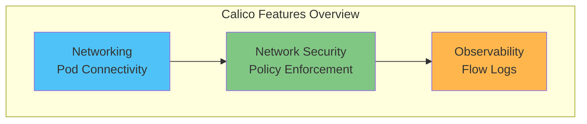
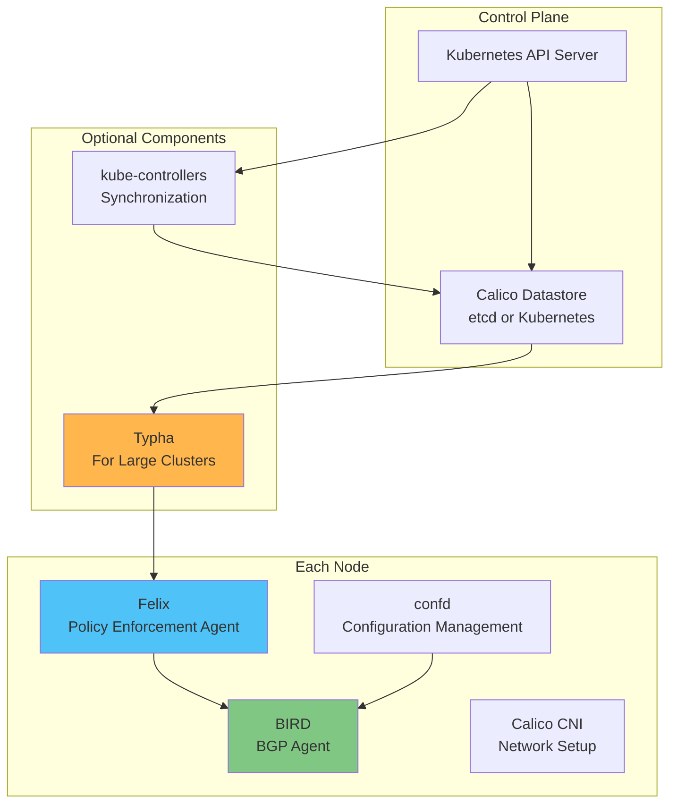
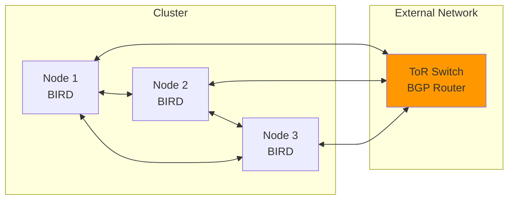
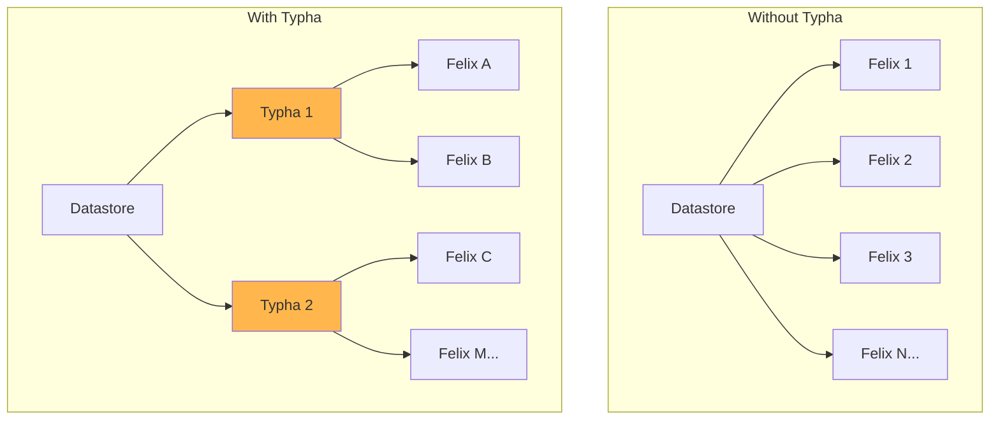
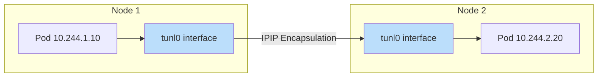
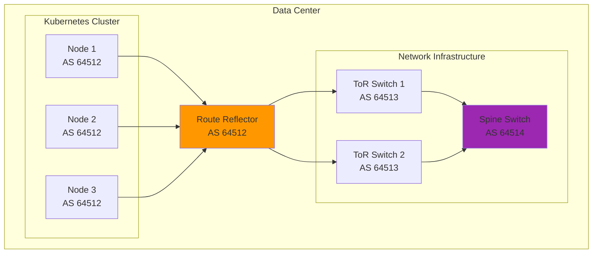
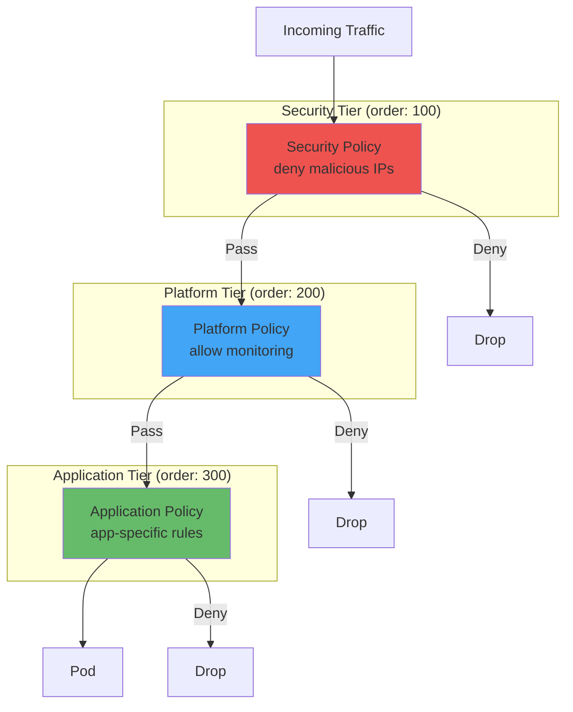
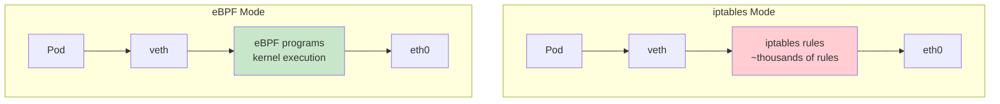
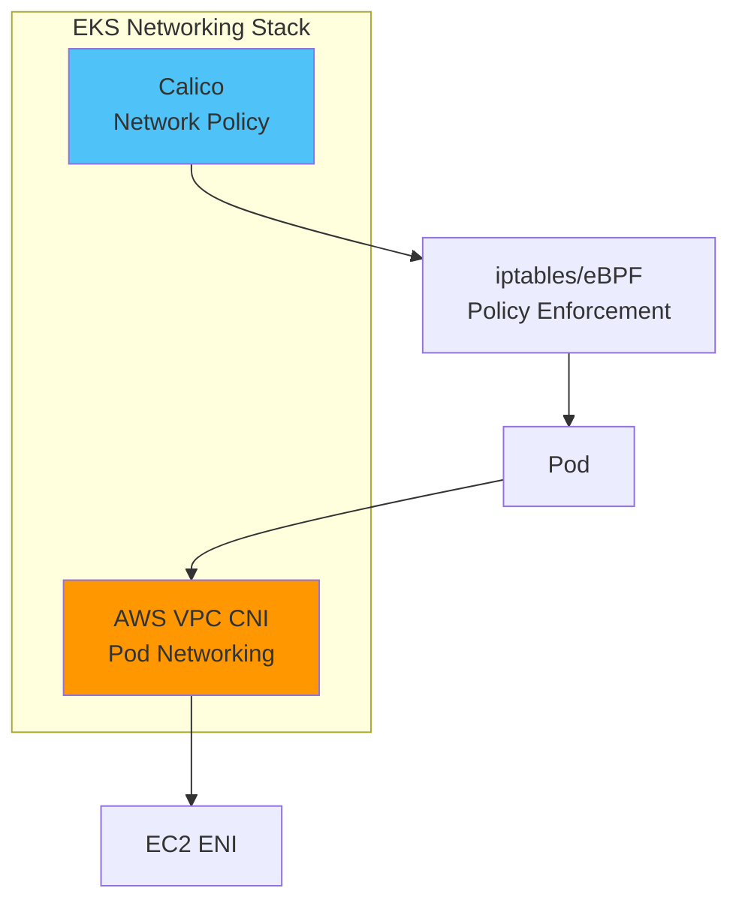

# Calico Network CNI

> **Supported Versions**: Calico 3.28+
> **Last Updated**: February 21, 2026

## Overview

Calico is an open-source networking and network security solution for Kubernetes, virtual machines, and bare-metal workloads. Started as Project Calico and now maintained by Tigera, it is one of the most widely used Kubernetes CNIs globally.

### Key Features of Calico

- **High-Performance Networking**: BGP-based routing, eBPF dataplane
- **Powerful Network Policy**: Kubernetes standard + Calico extended policies
- **Flexible Networking Modes**: Overlay, Direct Routing, BGP
- **Large-Scale Cluster Support**: Scale to thousands of nodes with Typha
- **Multi-Environment Support**: Cloud, on-premises, hybrid



## Calico History

| Year | Event |
|------|-------|
| 2014 | Project Calico started at Metaswitch |
| 2016 | Tigera founded, Calico commercialized |
| 2017 | Calico 2.0 released, Kubernetes native support |
| 2019 | Calico Enterprise released |
| 2020 | eBPF dataplane introduced |
| 2022 | Calico Cloud service launched |
| 2024 | Calico 3.28 - Enhanced eBPF and Windows support |

## Architecture

Calico consists of several core components.



### Core Components

#### 1. Felix

Felix is the core agent running on each node.

**Primary Responsibilities:**
- Interface management (Pod veth pair creation)
- Routing table programming
- iptables/eBPF rule management
- Network Policy enforcement

```yaml
# Felix Configuration Example
apiVersion: projectcalico.org/v3
kind: FelixConfiguration
metadata:
  name: default
spec:
  # Enable eBPF mode
  bpfEnabled: true
  bpfDataIfacePattern: "^(en.*|eth.*)"

  # Logging configuration
  logSeverityScreen: Info
  logSeverityFile: Warning

  # IP auto-detection
  ipAutoDetectionMethod: "kubernetes-internal-ip"

  # Flow logs
  flowLogsFlushInterval: "15s"
  flowLogsFileEnabled: true

  # Health check
  healthEnabled: true
  healthPort: 9099

  # Performance tuning
  iptablesRefreshInterval: "90s"
  routeRefreshInterval: "90s"
```

#### 2. BIRD

BIRD (BIRD Internet Routing Daemon) handles BGP routing.

**Primary Responsibilities:**
- BGP peer connection management
- Route exchange and propagation
- Route Reflector functionality



#### 3. confd

confd dynamically generates BIRD configuration files.

**Primary Responsibilities:**
- BGP configuration template processing
- Node/peer change detection
- Automatic BIRD configuration updates

#### 4. Typha

Typha is an essential component for large clusters (50+ nodes).

**Primary Responsibilities:**
- Datastore connection aggregation
- Provide cached data to Felix
- Reduce API server load



```yaml
# Typha Deployment Configuration
apiVersion: apps/v1
kind: Deployment
metadata:
  name: calico-typha
  namespace: calico-system
spec:
  replicas: 3  # Adjust based on node count
  selector:
    matchLabels:
      k8s-app: calico-typha
  template:
    metadata:
      labels:
        k8s-app: calico-typha
    spec:
      tolerations:
        - key: CriticalAddonsOnly
          operator: Exists
      containers:
        - name: calico-typha
          image: calico/typha:v3.28.0
          ports:
            - containerPort: 5473
              name: calico-typha
          env:
            - name: TYPHA_LOGSEVERITYSCREEN
              value: "info"
            - name: TYPHA_DATASTORETYPE
              value: "kubernetes"
            - name: TYPHA_MAXCONNECTIONSLOWERLIMIT
              value: "100"
            - name: TYPHA_CONNECTIONREBALANCINGMODE
              value: "kubernetes"
          resources:
            requests:
              cpu: 200m
              memory: 256Mi
            limits:
              cpu: 1000m
              memory: 512Mi
          livenessProbe:
            httpGet:
              path: /liveness
              port: 9098
            periodSeconds: 30
          readinessProbe:
            httpGet:
              path: /readiness
              port: 9098
            periodSeconds: 10
```

#### 5. kube-controllers

kube-controllers handles synchronization between Kubernetes and the Calico datastore.

**Included Controllers:**
- Policy Controller: NetworkPolicy synchronization
- Namespace Controller: Namespace profile management
- ServiceAccount Controller: Service account synchronization
- WorkloadEndpoint Controller: Endpoint cleanup
- Node Controller: Node information synchronization

## Networking Modes

Calico supports multiple networking modes.

### 1. IPIP (IP-in-IP) Mode

Encapsulates IP packets within other IP packets.



```yaml
# IPIP Mode Configuration
apiVersion: projectcalico.org/v3
kind: IPPool
metadata:
  name: default-ipv4-ippool
spec:
  cidr: 10.244.0.0/16
  ipipMode: Always  # Always, CrossSubnet, Never
  vxlanMode: Never
  natOutgoing: true
  nodeSelector: all()
```

**IPIP Mode Options:**

| Option | Description | Use Case |
|--------|-------------|----------|
| `Always` | Always use IPIP encapsulation | Complex networks, cloud environments |
| `CrossSubnet` | Encapsulate only across subnets | Hybrid environments |
| `Never` | Disable IPIP | BGP direct routing |

### 2. VXLAN Mode

Overlay network using Virtual Extensible LAN.

```yaml
# VXLAN Mode Configuration
apiVersion: projectcalico.org/v3
kind: IPPool
metadata:
  name: default-ipv4-ippool
spec:
  cidr: 10.244.0.0/16
  ipipMode: Never
  vxlanMode: Always  # Always, CrossSubnet, Never
  natOutgoing: true
  nodeSelector: all()
```

**IPIP vs VXLAN Comparison:**

| Characteristic | IPIP | VXLAN |
|----------------|------|-------|
| Overhead | 20 bytes | 50 bytes |
| Performance | Better | Slightly lower |
| Compatibility | Requires IP protocol 4 | UDP-based, more compatible |
| Azure Support | Limited | Supported |
| Hardware Offload | Limited | Widely supported |

### 3. Direct / Unencapsulated Mode

Direct routing without encapsulation. Used with BGP.

```yaml
# Direct Routing Configuration
apiVersion: projectcalico.org/v3
kind: IPPool
metadata:
  name: direct-routing-pool
spec:
  cidr: 10.244.0.0/16
  ipipMode: Never
  vxlanMode: Never
  natOutgoing: false
  nodeSelector: all()
```

### 4. BGP Peering

Establish BGP connections with external routers.



#### Global BGP Peer Configuration

```yaml
# Global BGP Peer (applies to all nodes)
apiVersion: projectcalico.org/v3
kind: BGPPeer
metadata:
  name: global-tor-peer
spec:
  peerIP: 192.168.1.1
  asNumber: 64513
  # All nodes connect to this peer
---
# Apply to specific nodes only
apiVersion: projectcalico.org/v3
kind: BGPPeer
metadata:
  name: rack1-tor-peer
spec:
  peerIP: 192.168.1.1
  asNumber: 64513
  nodeSelector: "rack == 'rack1'"
  # Only nodes in rack1 connect to this peer
```

#### BGPConfiguration Settings

```yaml
apiVersion: projectcalico.org/v3
kind: BGPConfiguration
metadata:
  name: default
spec:
  # Local AS number
  asNumber: 64512

  # Advertise Service External IPs
  serviceExternalIPs:
    - cidr: 203.0.113.0/24

  # Advertise Service LoadBalancer IPs
  serviceLoadBalancerIPs:
    - cidr: 198.51.100.0/24

  # Advertise Service ClusterIPs (optional)
  serviceClusterIPs:
    - cidr: 10.96.0.0/12

  # Disable node-to-node mesh (when using Route Reflector)
  nodeToNodeMeshEnabled: false

  # Community tags
  communities:
    - name: internal
      value: "64512:100"

  # Prefix advertisement settings
  prefixAdvertisements:
    - cidr: 10.244.0.0/16
      communities:
        - internal
```

#### Route Reflector Configuration

For large clusters, use Route Reflectors instead of full-mesh BGP.

```yaml
# Label nodes as Route Reflectors
# kubectl label node rr-node-1 route-reflector=true

# Route Reflector Configuration
apiVersion: projectcalico.org/v3
kind: BGPPeer
metadata:
  name: node-to-rr
spec:
  nodeSelector: "!has(route-reflector)"
  peerSelector: "has(route-reflector)"
---
apiVersion: projectcalico.org/v3
kind: BGPPeer
metadata:
  name: rr-mesh
spec:
  nodeSelector: "has(route-reflector)"
  peerSelector: "has(route-reflector)"
---
# Route Reflector Node Configuration
apiVersion: projectcalico.org/v3
kind: Node
metadata:
  name: rr-node-1
  labels:
    route-reflector: "true"
spec:
  bgp:
    routeReflectorClusterID: 244.0.0.1
```

## Network Policy Deep Dive

### Kubernetes Standard NetworkPolicy

```yaml
# Basic NetworkPolicy Example
apiVersion: networking.k8s.io/v1
kind: NetworkPolicy
metadata:
  name: allow-frontend-to-backend
  namespace: production
spec:
  podSelector:
    matchLabels:
      app: backend
  policyTypes:
    - Ingress
  ingress:
    - from:
        - podSelector:
            matchLabels:
              app: frontend
      ports:
        - protocol: TCP
          port: 8080
```

### Calico NetworkPolicy (Extended)

Calico extends Kubernetes NetworkPolicy with additional features.

```yaml
# Calico Extended NetworkPolicy
apiVersion: projectcalico.org/v3
kind: NetworkPolicy
metadata:
  name: advanced-policy
  namespace: production
spec:
  selector: app == 'backend'

  # Policy order (lower evaluated first)
  order: 100

  # Ingress rules
  ingress:
    - action: Allow
      protocol: TCP
      source:
        selector: app == 'frontend'
      destination:
        ports:
          - 8080

    # HTTP method-based (L7)
    - action: Allow
      protocol: TCP
      source:
        selector: app == 'api-gateway'
      destination:
        ports:
          - 8080
      http:
        methods: ["GET", "POST"]
        paths:
          - prefix: "/api/v1/"

  # Egress rules
  egress:
    # Allow DNS
    - action: Allow
      protocol: UDP
      destination:
        selector: k8s-app == 'kube-dns'
        ports:
          - 53

    # External database
    - action: Allow
      protocol: TCP
      destination:
        nets:
          - 10.0.100.0/24
        ports:
          - 5432

    # FQDN-based allow
    - action: Allow
      protocol: TCP
      destination:
        domains:
          - "*.amazonaws.com"
        ports:
          - 443
```

### GlobalNetworkPolicy

Policies that apply across the entire cluster.

```yaml
apiVersion: projectcalico.org/v3
kind: GlobalNetworkPolicy
metadata:
  name: default-deny
spec:
  # Apply to all Pods
  selector: all()

  # Apply to Host Endpoints as well
  applyOnForward: true

  # Policy order
  order: 1000

  types:
    - Ingress
    - Egress

  # Default deny - no rules
---
apiVersion: projectcalico.org/v3
kind: GlobalNetworkPolicy
metadata:
  name: allow-dns
spec:
  selector: all()
  order: 100

  egress:
    - action: Allow
      protocol: UDP
      destination:
        ports:
          - 53

    - action: Allow
      protocol: TCP
      destination:
        ports:
          - 53
---
apiVersion: projectcalico.org/v3
kind: GlobalNetworkPolicy
metadata:
  name: deny-external-egress
spec:
  selector: "!has(internet-access)"
  order: 200

  egress:
    - action: Deny
      destination:
        notNets:
          - 10.0.0.0/8
          - 172.16.0.0/12
          - 192.168.0.0/16
```

### NetworkSet

Define IP address sets for reuse.

```yaml
# External service IP set
apiVersion: projectcalico.org/v3
kind: NetworkSet
metadata:
  name: external-databases
  namespace: production
  labels:
    service-type: database
spec:
  nets:
    - 10.0.100.10/32  # Primary DB
    - 10.0.100.11/32  # Secondary DB
    - 10.0.100.12/32  # Analytics DB
---
# GlobalNetworkSet (cluster-wide)
apiVersion: projectcalico.org/v3
kind: GlobalNetworkSet
metadata:
  name: trusted-partners
  labels:
    partner: trusted
spec:
  nets:
    - 203.0.113.0/24
    - 198.51.100.0/24
```

```yaml
# Policy referencing NetworkSet
apiVersion: projectcalico.org/v3
kind: NetworkPolicy
metadata:
  name: allow-db-access
  namespace: production
spec:
  selector: app == 'backend'
  egress:
    - action: Allow
      protocol: TCP
      destination:
        selector: service-type == 'database'
        namespaceSelector: projectcalico.org/name == 'production'
        ports:
          - 5432
```

### Tier-Based Policies

Organize policies in hierarchical tiers.

```yaml
# Create Tiers
apiVersion: projectcalico.org/v3
kind: Tier
metadata:
  name: security
spec:
  order: 100
---
apiVersion: projectcalico.org/v3
kind: Tier
metadata:
  name: platform
spec:
  order: 200
---
apiVersion: projectcalico.org/v3
kind: Tier
metadata:
  name: application
spec:
  order: 300
```



```yaml
# Security Tier Policy
apiVersion: projectcalico.org/v3
kind: GlobalNetworkPolicy
metadata:
  name: security.block-malicious
spec:
  tier: security
  order: 10
  selector: all()
  ingress:
    - action: Deny
      source:
        selector: "global(name == 'blocked-ips')"
    - action: Pass  # Pass to next tier
---
# Platform Tier Policy
apiVersion: projectcalico.org/v3
kind: GlobalNetworkPolicy
metadata:
  name: platform.allow-monitoring
spec:
  tier: platform
  order: 10
  selector: all()
  ingress:
    - action: Allow
      source:
        namespaceSelector: "projectcalico.org/name == 'monitoring'"
    - action: Pass
---
# Application Tier Policy
apiVersion: projectcalico.org/v3
kind: NetworkPolicy
metadata:
  name: application.frontend-policy
  namespace: production
spec:
  tier: application
  order: 10
  selector: app == 'frontend'
  ingress:
    - action: Allow
      source:
        selector: app == 'load-balancer'
```

## eBPF Mode vs iptables Mode

### Dataplane Comparison



### Performance Comparison

| Item | iptables | eBPF |
|------|----------|------|
| **Throughput** | Baseline | +20-40% |
| **Latency** | Baseline | -20-30% |
| **CPU Usage** | High (proportional to rules) | Low (constant) |
| **Scalability** | Degrades with rule count | Consistent performance |
| **Policy Evaluation** | Linear search | Optimized maps |

### Enabling eBPF Mode

```yaml
# Enable eBPF in FelixConfiguration
apiVersion: projectcalico.org/v3
kind: FelixConfiguration
metadata:
  name: default
spec:
  bpfEnabled: true

  # Enable Direct Server Return (DSR)
  bpfExternalServiceMode: "DSR"

  # Replace kube-proxy
  bpfKubeProxyIptablesCleanupEnabled: true

  # Data interface pattern
  bpfDataIfacePattern: "^(en.*|eth.*|ens.*)"

  # Log level
  bpfLogLevel: "Info"

  # Connection tracking table size
  bpfConnectTimeLoadBalancingEnabled: true
```

```bash
# Disable kube-proxy after enabling eBPF
kubectl patch ds -n kube-system kube-proxy -p '{"spec": {"template": {"spec": {"nodeSelector": {"non-existing": "true"}}}}}'

# Or delete kube-proxy DaemonSet
kubectl delete ds kube-proxy -n kube-system
```

### eBPF Mode Requirements

- Linux kernel 5.3+ (recommended 5.8+)
- x86_64 or ARM64 architecture
- BTF (BPF Type Format) support
- `/sys/fs/bpf` mounted on host

## EKS Integration

### VPC CNI + Calico Combination

In EKS, you can use AWS VPC CNI for networking and Calico for Network Policy.



#### Installation Method

```bash
# 1. Create EKS cluster (VPC CNI included by default)
eksctl create cluster \
  --name my-cluster \
  --region us-east-1 \
  --nodegroup-name standard-workers \
  --node-type m5.large \
  --nodes 3

# 2. Install Calico (Policy only mode)
kubectl create -f https://raw.githubusercontent.com/projectcalico/calico/v3.28.0/manifests/calico-policy-only.yaml

# Or install with Helm
helm repo add projectcalico https://docs.tigera.io/calico/charts
helm install calico projectcalico/tigera-operator \
  --namespace tigera-operator \
  --create-namespace \
  --set installation.kubernetesProvider=EKS \
  --set installation.cni.type=AmazonVPC
```

```yaml
# Helm values.yaml (for EKS)
installation:
  kubernetesProvider: EKS
  cni:
    type: AmazonVPC
  calicoNetwork:
    # Disable BGP/IPAM since using VPC CNI
    bgp: Disabled

# Enable Typha (for 50+ nodes)
typhaDeployment:
  replicas: 3
```

### EKS Network Policy Controller

EKS v1.25+ includes native Network Policy support.

```yaml
# Enable Network Policy via EKS addon
apiVersion: eksctl.io/v1alpha5
kind: ClusterConfig
metadata:
  name: my-cluster
  region: us-east-1
addons:
  - name: vpc-cni
    version: latest
    configurationValues: |
      enableNetworkPolicy: "true"
```

## Comparison with Cilium

| Feature | Calico | Cilium |
|---------|--------|--------|
| **Core Technology** | iptables/eBPF | eBPF |
| **Maturity** | Very high | High |
| **Network Policy** | L3-L4 (L7 in Enterprise) | L3-L7 |
| **Service Mesh** | Separate (Enterprise) | Built-in |
| **BGP Support** | Strong | Supported |
| **Observability** | Basic | Hubble (powerful) |
| **Windows Support** | Full support | Beta |
| **Community** | Very large and active | Rapidly growing |
| **Enterprise** | Calico Enterprise | Cilium Enterprise |
| **Learning Curve** | Medium | High |
| **Documentation** | Excellent | Excellent |

### Selection Guide

**Choose Calico:**
- BGP-based on-premises environment
- Windows workload requirements
- Prefer mature solutions
- Need enterprise support

**Choose Cilium:**
- L7 Network Policy required
- Built-in Service Mesh needed
- Advanced observability needed
- Leverage latest eBPF features

## Installation

### Operator Installation (Recommended)

```bash
# Install Tigera Operator
kubectl create -f https://raw.githubusercontent.com/projectcalico/calico/v3.28.0/manifests/tigera-operator.yaml

# Apply Installation resource
kubectl create -f - <<EOF
apiVersion: operator.tigera.io/v1
kind: Installation
metadata:
  name: default
spec:
  # Default settings
  calicoNetwork:
    bgp: Enabled
    ipPools:
      - cidr: 10.244.0.0/16
        encapsulation: VXLANCrossSubnet
        natOutgoing: Enabled
        nodeSelector: all()

  # Component resources
  componentResources:
    - componentName: Node
      resourceRequirements:
        requests:
          cpu: 200m
          memory: 256Mi
        limits:
          cpu: 1000m
          memory: 512Mi

    - componentName: Typha
      resourceRequirements:
        requests:
          cpu: 100m
          memory: 128Mi
        limits:
          cpu: 500m
          memory: 256Mi

  # Typha deployment (automatic)
  typhaDeployment:
    spec:
      minReadySeconds: 10
EOF
```

### Manifest Installation

```bash
# Full Calico installation (self-managed)
kubectl apply -f https://raw.githubusercontent.com/projectcalico/calico/v3.28.0/manifests/calico.yaml
```

### Helm Installation

```bash
# Add Helm repo
helm repo add projectcalico https://docs.tigera.io/calico/charts
helm repo update

# Install
helm install calico projectcalico/tigera-operator \
  --namespace tigera-operator \
  --create-namespace \
  --version v3.28.0 \
  -f values.yaml
```

```yaml
# values.yaml example
installation:
  calicoNetwork:
    bgp: Enabled
    ipPools:
      - cidr: 10.244.0.0/16
        encapsulation: VXLANCrossSubnet
        natOutgoing: Enabled
    nodeAddressAutodetectionV4:
      kubernetes: NodeInternalIP

  # Enable eBPF
  # calicoNetwork:
  #   linuxDataplane: BPF

  # Component customization
  nodeUpdateStrategy:
    rollingUpdate:
      maxUnavailable: 1

# Enable API Server (Calico Enterprise feature)
# apiServer:
#   enabled: true
```

### Verify Installation

```bash
# Check Calico component status
kubectl get pods -n calico-system

# Or kube-system (for manifest installation)
kubectl get pods -n kube-system -l k8s-app=calico-node

# Check Installation status
kubectl get installation default -o yaml

# Check node status with calicoctl
calicoctl node status

# Check BGP peer status
calicoctl get bgppeer
calicoctl get node -o wide
```

## Troubleshooting

### Common Issues

#### 1. Pod Not Receiving IP

```bash
# Check calico-node logs
kubectl logs -n calico-system -l k8s-app=calico-node -c calico-node

# Check IPAM blocks
calicoctl ipam show
calicoctl ipam show --show-blocks

# Check IP Pool
calicoctl get ippool -o yaml
```

#### 2. Pod-to-Pod Communication Failure

```bash
# Check routing table
kubectl exec -n calico-system <calico-node-pod> -- ip route

# Check BIRD status
kubectl exec -n calico-system <calico-node-pod> -c calico-node -- birdcl show protocols

# Check Felix logs
kubectl logs -n calico-system -l k8s-app=calico-node -c calico-node | grep -i felix
```

#### 3. Network Policy Not Working

```bash
# Check policy list
calicoctl get networkpolicy -A
calicoctl get globalnetworkpolicy

# Check endpoint for specific Pod
calicoctl get workloadendpoint -n <namespace>

# Check if Felix recognizes the policy
kubectl exec -n calico-system <calico-node-pod> -c calico-node -- \
  calico-node -felix-live
```

#### 4. BGP Peering Failure

```bash
# Check BGP peer status
calicoctl node status

# Check BIRD logs
kubectl exec -n calico-system <calico-node-pod> -c calico-node -- \
  cat /var/log/calico/bird/current

# Check BGP configuration
calicoctl get bgpconfig default -o yaml
calicoctl get bgppeer -o yaml
```

### Installing calicoctl

```bash
# Linux
curl -L https://github.com/projectcalico/calico/releases/download/v3.28.0/calicoctl-linux-amd64 -o calicoctl
chmod +x calicoctl
sudo mv calicoctl /usr/local/bin/

# macOS
curl -L https://github.com/projectcalico/calico/releases/download/v3.28.0/calicoctl-darwin-amd64 -o calicoctl
chmod +x calicoctl
sudo mv calicoctl /usr/local/bin/

# Datastore configuration (Kubernetes API)
export DATASTORE_TYPE=kubernetes
export KUBECONFIG=~/.kube/config
```

## Best Practices

### 1. Large-Scale Cluster Configuration

```yaml
# Configuration for 50+ node clusters
apiVersion: operator.tigera.io/v1
kind: Installation
metadata:
  name: default
spec:
  typhaDeployment:
    spec:
      minReadySeconds: 10
      template:
        spec:
          containers:
            - name: calico-typha
              resources:
                requests:
                  cpu: 200m
                  memory: 256Mi
                limits:
                  cpu: 1000m
                  memory: 512Mi

  # Typha replica count (node count / 200, minimum 3)
  # typhaDeployment:
  #   replicas: 3

  calicoNetwork:
    # Use Route Reflector
    bgp: Enabled
```

### 2. Security Hardening

```yaml
# Default deny policy
apiVersion: projectcalico.org/v3
kind: GlobalNetworkPolicy
metadata:
  name: default-deny
spec:
  selector: all()
  types:
    - Ingress
    - Egress
---
# Allow only essential traffic
apiVersion: projectcalico.org/v3
kind: GlobalNetworkPolicy
metadata:
  name: allow-essential
spec:
  selector: all()
  order: 100
  egress:
    # DNS
    - action: Allow
      protocol: UDP
      destination:
        ports: [53]
    # Kubernetes API
    - action: Allow
      protocol: TCP
      destination:
        nets: ["10.96.0.1/32"]
        ports: [443]
```

### 3. Observability Configuration

```yaml
# Enable Felix flow logs
apiVersion: projectcalico.org/v3
kind: FelixConfiguration
metadata:
  name: default
spec:
  flowLogsFlushInterval: "15s"
  flowLogsFileEnabled: true
  flowLogsFileDirectory: "/var/log/calico/flowlogs"
  flowLogsFileMaxFiles: 5
  flowLogsFileMaxFileSizeMb: 100

  # Prometheus metrics
  prometheusMetricsEnabled: true
  prometheusMetricsPort: 9091
```

---

## References

- [Calico Official Documentation](https://docs.tigera.io/calico/latest/about/)
- [Calico GitHub](https://github.com/projectcalico/calico)
- [Calico Network Policy Reference](https://docs.tigera.io/calico/latest/reference/resources/networkpolicy)
- [BGP Configuration Guide](https://docs.tigera.io/calico/latest/networking/configuring/bgp)
- [eBPF Dataplane](https://docs.tigera.io/calico/latest/operations/ebpf/)
