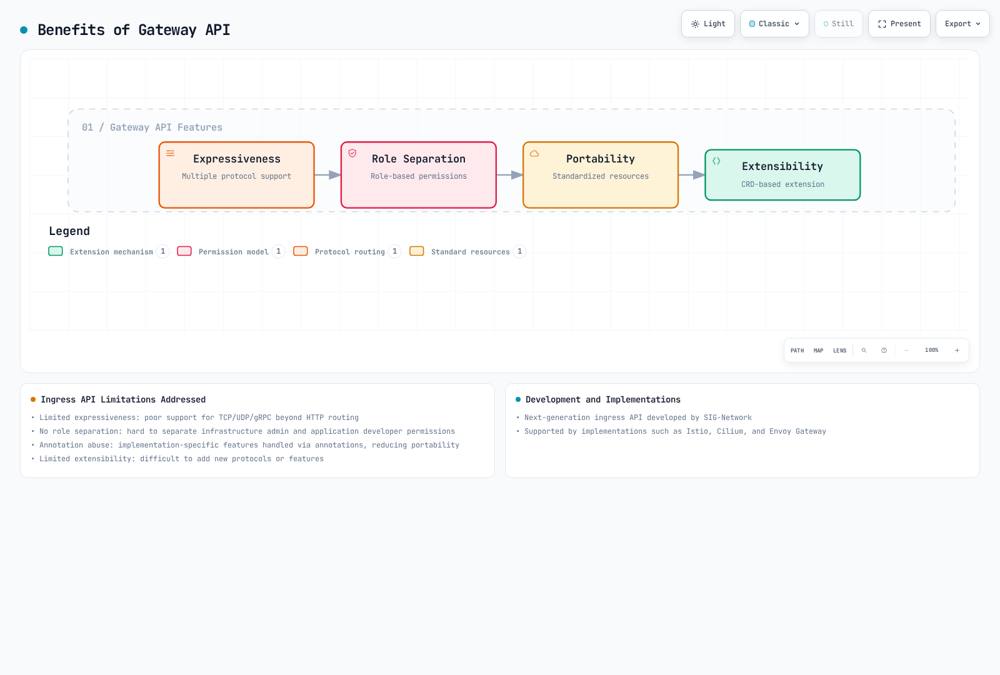

# Kubernetes Gateway API

> **Supported Versions**: Gateway API v1.2+
> **Last Updated**: August 10, 2026

## Overview

Gateway API is the next-generation ingress API for Kubernetes, designed to overcome the limitations of the existing Ingress API and provide more expressive and extensible network routing capabilities. Developed by SIG-Network, it is supported by various implementations including Istio, Cilium, Envoy Gateway, and more.

### Limitations of Ingress API

| Problem | Description |
|---------|-------------|
| **Limited Expressiveness** | Poor support for TCP/UDP/gRPC beyond HTTP routing |
| **No Role Separation** | Difficult to separate infrastructure admin and application developer permissions |
| **Annotation Abuse** | Implementation-specific features handled via annotations, reducing portability |
| **Limited Extensibility** | Difficult to add new protocols or features |
| **Cross-Namespace** | Complex routing across namespaces |

### Benefits of Gateway API



[🔍 View interactive diagram](https://www.atomai.click/kubernetes-docs/archmaps/en-networking-04-gateway-api-0.html)

## Resource Model

Gateway API uses a layered resource model.


[🔍 View interactive diagram](https://www.atomai.click/kubernetes-docs/archmaps/en-networking-04-gateway-api-1.html)

### Role Separation

| Role | Managed Resources | Responsibility |
|------|------------------|----------------|
| **Infrastructure Provider** | GatewayClass | Define basic infrastructure configuration |
| **Cluster Operator** | Gateway, ReferenceGrant | Load balancer provisioning, permission management |
| **Application Developer** | HTTPRoute, GRPCRoute, etc. | Define application routing rules |

## GatewayClass

GatewayClass defines the controller and configuration to use when creating Gateways.

```yaml
apiVersion: gateway.networking.k8s.io/v1
kind: GatewayClass
metadata:
  name: istio
spec:
  # Controller that handles this GatewayClass
  controllerName: istio.io/gateway-controller

  # Controller-specific parameters (optional)
  parametersRef:
    group: ""
    kind: ConfigMap
    name: istio-gateway-config
    namespace: istio-system

  # Description
  description: "Istio Gateway Controller for production workloads"
```

### GatewayClass by Implementation

```yaml
# Istio
apiVersion: gateway.networking.k8s.io/v1
kind: GatewayClass
metadata:
  name: istio
spec:
  controllerName: istio.io/gateway-controller
---
# Cilium
apiVersion: gateway.networking.k8s.io/v1
kind: GatewayClass
metadata:
  name: cilium
spec:
  controllerName: io.cilium/gateway-controller
---
# AWS Gateway API Controller
apiVersion: gateway.networking.k8s.io/v1
kind: GatewayClass
metadata:
  name: amazon-vpc-lattice
spec:
  controllerName: application-networking.k8s.aws/gateway-api-controller
---
# Envoy Gateway
apiVersion: gateway.networking.k8s.io/v1
kind: GatewayClass
metadata:
  name: envoy-gateway
spec:
  controllerName: gateway.envoyproxy.io/gatewayclass-controller
---
# Contour
apiVersion: gateway.networking.k8s.io/v1
kind: GatewayClass
metadata:
  name: contour
spec:
  controllerName: projectcontour.io/gateway-controller
---
# NGINX Gateway Fabric
apiVersion: gateway.networking.k8s.io/v1
kind: GatewayClass
metadata:
  name: nginx
spec:
  controllerName: gateway.nginx.org/nginx-gateway-controller
```

## Gateway

Gateway defines the actual load balancer instance.

### Basic Gateway Configuration

```yaml
apiVersion: gateway.networking.k8s.io/v1
kind: Gateway
metadata:
  name: production-gateway
  namespace: gateway-system
spec:
  # GatewayClass to use
  gatewayClassName: istio

  # Listener configuration
  listeners:
    # HTTP listener
    - name: http
      protocol: HTTP
      port: 80
      # Allow Routes from all namespaces
      allowedRoutes:
        namespaces:
          from: All

    # HTTPS listener
    - name: https
      protocol: HTTPS
      port: 443
      tls:
        mode: Terminate
        certificateRefs:
          - kind: Secret
            name: tls-cert
            namespace: gateway-system
      allowedRoutes:
        namespaces:
          from: Selector
          selector:
            matchLabels:
              gateway-access: "true"

    # Host-specific listener
    - name: api
      protocol: HTTPS
      port: 443
      hostname: "api.example.com"
      tls:
        mode: Terminate
        certificateRefs:
          - kind: Secret
            name: api-tls-cert
      allowedRoutes:
        namespaces:
          from: Same

  # Address configuration (optional)
  addresses:
    - type: IPAddress
      value: "192.168.1.100"
```

### Advanced Gateway Configuration

```yaml
apiVersion: gateway.networking.k8s.io/v1
kind: Gateway
metadata:
  name: multi-protocol-gateway
  namespace: gateway-system
  annotations:
    # Implementation-specific annotation
    networking.istio.io/service-type: LoadBalancer
spec:
  gatewayClassName: istio

  listeners:
    # For HTTP -> HTTPS redirect
    - name: http-redirect
      protocol: HTTP
      port: 80
      allowedRoutes:
        namespaces:
          from: All

    # HTTPS wildcard
    - name: https-wildcard
      protocol: HTTPS
      port: 443
      hostname: "*.example.com"
      tls:
        mode: Terminate
        certificateRefs:
          - kind: Secret
            name: wildcard-cert
      allowedRoutes:
        namespaces:
          from: All
        kinds:
          - kind: HTTPRoute

    # gRPC dedicated
    - name: grpc
      protocol: HTTPS
      port: 443
      hostname: "grpc.example.com"
      tls:
        mode: Terminate
        certificateRefs:
          - kind: Secret
            name: grpc-cert
      allowedRoutes:
        kinds:
          - kind: GRPCRoute

    # TCP passthrough
    - name: tcp-passthrough
      protocol: TLS
      port: 8443
      tls:
        mode: Passthrough
      allowedRoutes:
        kinds:
          - kind: TLSRoute

    # TCP
    - name: tcp
      protocol: TCP
      port: 9000
      allowedRoutes:
        kinds:
          - kind: TCPRoute
```

### TLS Modes

| Mode | Description | Use Case |
|------|-------------|----------|
| **Terminate** | TLS termination at Gateway | Standard HTTPS |
| **Passthrough** | Pass TLS to backend | End-to-end encryption |

```yaml
# TLS Terminate example
listeners:
  - name: https
    protocol: HTTPS
    port: 443
    tls:
      mode: Terminate
      certificateRefs:
        - kind: Secret
          name: server-cert
---
# TLS Passthrough example
listeners:
  - name: tls-passthrough
    protocol: TLS
    port: 443
    tls:
      mode: Passthrough
```

## HTTPRoute

HTTPRoute defines routing rules for HTTP/HTTPS traffic.

### Basic HTTPRoute

```yaml
apiVersion: gateway.networking.k8s.io/v1
kind: HTTPRoute
metadata:
  name: basic-route
  namespace: production
spec:
  # Gateway to attach to
  parentRefs:
    - name: production-gateway
      namespace: gateway-system
      sectionName: https  # Target specific listener

  # Host matching
  hostnames:
    - "api.example.com"
    - "www.example.com"

  # Routing rules
  rules:
    - matches:
        - path:
            type: PathPrefix
            value: /api/v1
      backendRefs:
        - name: api-v1-service
          port: 80

    - matches:
        - path:
            type: PathPrefix
            value: /api/v2
      backendRefs:
        - name: api-v2-service
          port: 80

    # Default path
    - backendRefs:
        - name: default-service
          port: 80
```

### Advanced Matching Rules

```yaml
apiVersion: gateway.networking.k8s.io/v1
kind: HTTPRoute
metadata:
  name: advanced-matching
  namespace: production
spec:
  parentRefs:
    - name: production-gateway
      namespace: gateway-system

  hostnames:
    - "api.example.com"

  rules:
    # Exact path matching
    - matches:
        - path:
            type: Exact
            value: /health
      backendRefs:
        - name: health-service
          port: 80

    # Regex path matching (implementation dependent)
    - matches:
        - path:
            type: RegularExpression
            value: "/users/[0-9]+"
      backendRefs:
        - name: user-service
          port: 80

    # Header-based routing
    - matches:
        - headers:
            - name: X-Version
              value: "v2"
      backendRefs:
        - name: api-v2-service
          port: 80

    # Query parameter based
    - matches:
        - queryParams:
            - name: debug
              value: "true"
      backendRefs:
        - name: debug-service
          port: 80

    # HTTP method based
    - matches:
        - method: POST
          path:
            type: PathPrefix
            value: /api/data
      backendRefs:
        - name: write-service
          port: 80

    - matches:
        - method: GET
          path:
            type: PathPrefix
            value: /api/data
      backendRefs:
        - name: read-service
          port: 80

    # Combined conditions (AND)
    - matches:
        - path:
            type: PathPrefix
            value: /admin
          headers:
            - name: X-Admin-Token
              type: Exact
              value: "secret-token"
      backendRefs:
        - name: admin-service
          port: 80

    # Multiple conditions (OR)
    - matches:
        - path:
            type: PathPrefix
            value: /api
        - path:
            type: PathPrefix
            value: /v1
      backendRefs:
        - name: api-service
          port: 80
```

### Filters

Filters allow modifying requests/responses.

```yaml
apiVersion: gateway.networking.k8s.io/v1
kind: HTTPRoute
metadata:
  name: filtered-route
  namespace: production
spec:
  parentRefs:
    - name: production-gateway
      namespace: gateway-system

  rules:
    # Request header modification
    - matches:
        - path:
            type: PathPrefix
            value: /api
      filters:
        - type: RequestHeaderModifier
          requestHeaderModifier:
            add:
              - name: X-Request-ID
                value: "generated-id"
            set:
              - name: X-Forwarded-Proto
                value: "https"
            remove:
              - X-Internal-Header
      backendRefs:
        - name: api-service
          port: 80

    # Response header modification
    - matches:
        - path:
            type: PathPrefix
            value: /public
      filters:
        - type: ResponseHeaderModifier
          responseHeaderModifier:
            add:
              - name: Cache-Control
                value: "public, max-age=3600"
            set:
              - name: X-Content-Type-Options
                value: "nosniff"
      backendRefs:
        - name: public-service
          port: 80

    # URL rewrite
    - matches:
        - path:
            type: PathPrefix
            value: /old-api
      filters:
        - type: URLRewrite
          urlRewrite:
            path:
              type: ReplacePrefixMatch
              replacePrefixMatch: /new-api
            hostname: "new-api.example.com"
      backendRefs:
        - name: new-api-service
          port: 80

    # Redirect
    - matches:
        - path:
            type: PathPrefix
            value: /legacy
      filters:
        - type: RequestRedirect
          requestRedirect:
            scheme: https
            hostname: "new.example.com"
            port: 443
            statusCode: 301
            path:
              type: ReplacePrefixMatch
              replacePrefixMatch: /modern

    # Mirroring
    - matches:
        - path:
            type: PathPrefix
            value: /api
      filters:
        - type: RequestMirror
          requestMirror:
            backendRef:
              name: shadow-service
              port: 80
      backendRefs:
        - name: main-service
          port: 80
```

### Traffic Splitting (Weights)

```yaml
apiVersion: gateway.networking.k8s.io/v1
kind: HTTPRoute
metadata:
  name: canary-route
  namespace: production
spec:
  parentRefs:
    - name: production-gateway
      namespace: gateway-system

  hostnames:
    - "app.example.com"

  rules:
    - matches:
        - path:
            type: PathPrefix
            value: /
      backendRefs:
        # 90% traffic to stable version
        - name: app-stable
          port: 80
          weight: 90

        # 10% traffic to canary version
        - name: app-canary
          port: 80
          weight: 10
```

### Timeouts and Retries

```yaml
apiVersion: gateway.networking.k8s.io/v1
kind: HTTPRoute
metadata:
  name: resilient-route
  namespace: production
spec:
  parentRefs:
    - name: production-gateway
      namespace: gateway-system

  rules:
    - matches:
        - path:
            type: PathPrefix
            value: /api
      # Timeout configuration (implementation dependent)
      timeouts:
        request: "30s"
        backendRequest: "25s"
      backendRefs:
        - name: api-service
          port: 80
```

## GRPCRoute

Defines routing rules for gRPC traffic.

```yaml
apiVersion: gateway.networking.k8s.io/v1
kind: GRPCRoute
metadata:
  name: grpc-route
  namespace: production
spec:
  parentRefs:
    - name: production-gateway
      namespace: gateway-system
      sectionName: grpc

  hostnames:
    - "grpc.example.com"

  rules:
    # Service-based routing
    - matches:
        - method:
            service: "myapp.UserService"
      backendRefs:
        - name: user-grpc-service
          port: 50051

    - matches:
        - method:
            service: "myapp.OrderService"
            method: "CreateOrder"
      backendRefs:
        - name: order-grpc-service
          port: 50052

    # Header-based routing
    - matches:
        - headers:
            - name: x-environment
              value: "staging"
      backendRefs:
        - name: staging-grpc-service
          port: 50051

    # Default routing
    - backendRefs:
        - name: default-grpc-service
          port: 50051
```

## TCPRoute

Defines TCP traffic routing.

```yaml
# GA in v1 since Gateway API v1.6 (v1alpha2 deprecated)
apiVersion: gateway.networking.k8s.io/v1
kind: TCPRoute
metadata:
  name: database-route
  namespace: production
spec:
  parentRefs:
    - name: production-gateway
      namespace: gateway-system
      sectionName: tcp

  rules:
    - backendRefs:
        - name: database-service
          port: 5432
---
# Multi-backend TCP routing
apiVersion: gateway.networking.k8s.io/v1
kind: TCPRoute
metadata:
  name: tcp-loadbalance
  namespace: production
spec:
  parentRefs:
    - name: production-gateway
      namespace: gateway-system
      sectionName: tcp

  rules:
    - backendRefs:
        - name: tcp-backend-1
          port: 9000
          weight: 50
        - name: tcp-backend-2
          port: 9000
          weight: 50
```

## TLSRoute

Defines TLS passthrough traffic routing.

```yaml
apiVersion: gateway.networking.k8s.io/v1alpha2
kind: TLSRoute
metadata:
  name: tls-passthrough-route
  namespace: production
spec:
  parentRefs:
    - name: production-gateway
      namespace: gateway-system
      sectionName: tcp-passthrough

  hostnames:
    - "secure.example.com"

  rules:
    - backendRefs:
        - name: secure-backend
          port: 8443
```

## UDPRoute

Defines UDP traffic routing.

```yaml
# GA in v1 since Gateway API v1.6 (v1alpha2 deprecated)
apiVersion: gateway.networking.k8s.io/v1
kind: UDPRoute
metadata:
  name: dns-route
  namespace: production
spec:
  parentRefs:
    - name: production-gateway
      namespace: gateway-system
      sectionName: udp

  rules:
    - backendRefs:
        - name: dns-service
          port: 53
```

## ReferenceGrant

ReferenceGrant allows cross-namespace references.

```yaml
# Allow Routes from other namespaces to reference Services in this namespace
apiVersion: gateway.networking.k8s.io/v1beta1
kind: ReferenceGrant
metadata:
  name: allow-routes-to-backend
  namespace: backend-services
spec:
  from:
    # HTTPRoute from production namespace
    - group: gateway.networking.k8s.io
      kind: HTTPRoute
      namespace: production
    # HTTPRoute from staging namespace too
    - group: gateway.networking.k8s.io
      kind: HTTPRoute
      namespace: staging
  to:
    # Can reference Services in this namespace
    - group: ""
      kind: Service
---
# Allow Gateway to reference Secrets (TLS certificates) from another namespace
apiVersion: gateway.networking.k8s.io/v1beta1
kind: ReferenceGrant
metadata:
  name: allow-gateway-to-secrets
  namespace: cert-management
spec:
  from:
    - group: gateway.networking.k8s.io
      kind: Gateway
      namespace: gateway-system
  to:
    - group: ""
      kind: Secret
```

## Implementation Comparison

### Major Implementations

| Implementation | Controller | Features |
|----------------|------------|----------|
| **Istio** | istio.io/gateway-controller | Service Mesh integration, advanced traffic management |
| **Cilium** | io.cilium/gateway-controller | eBPF-based, high performance |
| **Envoy Gateway** | gateway.envoyproxy.io/gatewayclass-controller | Envoy-based, standards compliant |
| **AWS Gateway API Controller** | application-networking.k8s.aws/gateway-api-controller | VPC Lattice integration |
| **Contour** | projectcontour.io/gateway-controller | Envoy-based, simple configuration |
| **NGINX Gateway Fabric** | gateway.nginx.org/nginx-gateway-controller | NGINX-based |
| **Traefik** | traefik.io/gateway-controller | Dynamic configuration |

### Feature Support Status

| Feature | Istio | Cilium | Envoy GW | AWS | Contour |
|---------|-------|--------|----------|-----|---------|
| HTTPRoute | Yes | Yes | Yes | Yes | Yes |
| GRPCRoute | Yes | Yes | Yes | Partial | Yes |
| TCPRoute | Yes | Yes | Yes | No | Yes |
| TLSRoute | Yes | Yes | Yes | No | Yes |
| UDPRoute | Yes | Yes | Partial | No | No |
| ReferenceGrant | Yes | Yes | Yes | Yes | Yes |
| Traffic Split | Yes | Yes | Yes | Yes | Yes |
| Header Modification | Yes | Yes | Yes | Partial | Yes |
| URL Rewrite | Yes | Yes | Yes | Partial | Yes |
| Mirroring | Yes | Partial | Yes | No | Yes |

## AWS Load Balancer Controller Gateway API Support (v3.0 GA)

Starting with AWS Load Balancer Controller v3.0.0 (January 2026), Gateway API support reached GA, enabling declarative management of ALB/NLB through the GatewayClass/Gateway/HTTPRoute role-separation model.

- **Background**: With NGINX Ingress Controller reaching end of support in March 2026, AWS positions LBC v3.0 + Gateway API as the native alternative.
- **Backward compatibility**: Existing Ingress/Service resources remain fully supported — immediate cutover isn't required, and migration can happen gradually.
- **Benefits**: Header/query-based routing, weighted traffic distribution (Blue/Green, Canary), and a multi-protocol design covering TCP/UDP/gRPC.
- **Upgrade caution**: If you install via Helm with `enableCertManager=true`, set `keepTLSSecret=false` before upgrading (this is handled automatically from v3.0.0 onward).

### v3.4.0 Migration Tooling (June 2026)

Tooling was added to migrate existing ALB-based Ingress to Gateway API without downtime.

- **Ingress to Gateway Migration Tool**: Creates new Gateway API resources alongside the existing ALB, enabling a zero-downtime transition
- **lbc-migrate CLI**: Automatically converts existing Ingress annotations, routing rules, and IngressGroups into Gateway API resources; the `--from-cluster` option analyzes the cluster directly
- **Migration Console**: A web UI for validating the converted configuration before migrating

> **Caution**: Behavior changed for Gateway API + NLB combinations. If multiple TCP/UDP/TLS Routes attach to a single Listener, only the oldest Route receives traffic. Review your L4 Route configuration before upgrading.

(Common source: [AWS Load Balancer Controller Releases](https://github.com/kubernetes-sigs/aws-load-balancer-controller/releases))

## Migrating from Ingress to Gateway API

### Step-by-Step Migration Guide

#### Step 1: Analyze Existing Ingress

```yaml
# Existing Ingress
apiVersion: networking.k8s.io/v1
kind: Ingress
metadata:
  name: my-ingress
  annotations:
    kubernetes.io/ingress.class: "nginx"
    nginx.ingress.kubernetes.io/rewrite-target: /
    nginx.ingress.kubernetes.io/ssl-redirect: "true"
spec:
  tls:
    - hosts:
        - api.example.com
      secretName: api-tls
  rules:
    - host: api.example.com
      http:
        paths:
          - path: /api/v1
            pathType: Prefix
            backend:
              service:
                name: api-v1
                port:
                  number: 80
          - path: /api/v2
            pathType: Prefix
            backend:
              service:
                name: api-v2
                port:
                  number: 80
```

#### Step 2: Create Gateway and GatewayClass

```yaml
# GatewayClass (Infrastructure Admin)
apiVersion: gateway.networking.k8s.io/v1
kind: GatewayClass
metadata:
  name: production
spec:
  controllerName: istio.io/gateway-controller
---
# Gateway (Cluster Operator)
apiVersion: gateway.networking.k8s.io/v1
kind: Gateway
metadata:
  name: production-gateway
  namespace: gateway-system
spec:
  gatewayClassName: production
  listeners:
    - name: http
      protocol: HTTP
      port: 80
      allowedRoutes:
        namespaces:
          from: All
    - name: https
      protocol: HTTPS
      port: 443
      tls:
        mode: Terminate
        certificateRefs:
          - kind: Secret
            name: api-tls
            namespace: gateway-system
      allowedRoutes:
        namespaces:
          from: All
```

#### Step 3: Create HTTPRoute

```yaml
# HTTPRoute (Application Developer)
apiVersion: gateway.networking.k8s.io/v1
kind: HTTPRoute
metadata:
  name: api-route
  namespace: default
spec:
  parentRefs:
    - name: production-gateway
      namespace: gateway-system

  hostnames:
    - "api.example.com"

  rules:
    # HTTP -> HTTPS redirect
    - matches:
        - path:
            type: PathPrefix
            value: /
      filters:
        - type: RequestRedirect
          requestRedirect:
            scheme: https
            statusCode: 301

---
# HTTPRoute for HTTPS
apiVersion: gateway.networking.k8s.io/v1
kind: HTTPRoute
metadata:
  name: api-route-https
  namespace: default
spec:
  parentRefs:
    - name: production-gateway
      namespace: gateway-system
      sectionName: https

  hostnames:
    - "api.example.com"

  rules:
    - matches:
        - path:
            type: PathPrefix
            value: /api/v1
      filters:
        - type: URLRewrite
          urlRewrite:
            path:
              type: ReplacePrefixMatch
              replacePrefixMatch: /
      backendRefs:
        - name: api-v1
          port: 80

    - matches:
        - path:
            type: PathPrefix
            value: /api/v2
      filters:
        - type: URLRewrite
          urlRewrite:
            path:
              type: ReplacePrefixMatch
              replacePrefixMatch: /
      backendRefs:
        - name: api-v2
          port: 80
```

#### Step 4: Gradual Transition

```yaml
# Gradual transition via traffic splitting
apiVersion: gateway.networking.k8s.io/v1
kind: HTTPRoute
metadata:
  name: gradual-migration
spec:
  parentRefs:
    - name: production-gateway
      namespace: gateway-system

  rules:
    - backendRefs:
        # Existing service (gradually decrease)
        - name: legacy-service
          port: 80
          weight: 90
        # New service (gradually increase)
        - name: new-service
          port: 80
          weight: 10
```

### Migration Checklist

- [ ] Analyze existing Ingress annotations
- [ ] Select implementation and create GatewayClass
- [ ] Create Gateway resource and configure listeners
- [ ] Convert routing rules to HTTPRoute
- [ ] Configure cross-namespace access with ReferenceGrant
- [ ] Migrate TLS certificates
- [ ] Gradual transition via traffic splitting
- [ ] Set up monitoring and logging
- [ ] Remove existing Ingress resources

## EKS Patterns

### AWS Gateway API Controller (VPC Lattice)

```yaml
# GatewayClass
apiVersion: gateway.networking.k8s.io/v1
kind: GatewayClass
metadata:
  name: amazon-vpc-lattice
spec:
  controllerName: application-networking.k8s.aws/gateway-api-controller
---
# Gateway (maps to VPC Lattice Service Network)
apiVersion: gateway.networking.k8s.io/v1
kind: Gateway
metadata:
  name: lattice-gateway
  namespace: default
spec:
  gatewayClassName: amazon-vpc-lattice
  listeners:
    - name: http
      protocol: HTTP
      port: 80
      allowedRoutes:
        namespaces:
          from: All
---
# HTTPRoute (maps to VPC Lattice Service)
apiVersion: gateway.networking.k8s.io/v1
kind: HTTPRoute
metadata:
  name: lattice-route
spec:
  parentRefs:
    - name: lattice-gateway
  rules:
    - backendRefs:
        - name: my-service
          port: 80
```

### Using with ALB Controller

```yaml
# Istio Gateway API + ALB Ingress combination
apiVersion: gateway.networking.k8s.io/v1
kind: Gateway
metadata:
  name: internal-gateway
  namespace: istio-system
  annotations:
    # Internal Gateway
    networking.istio.io/service-type: ClusterIP
spec:
  gatewayClassName: istio
  listeners:
    - name: http
      protocol: HTTP
      port: 80
      allowedRoutes:
        namespaces:
          from: All
---
# ALB receives external traffic and forwards to Gateway
apiVersion: networking.k8s.io/v1
kind: Ingress
metadata:
  name: alb-to-gateway
  annotations:
    alb.ingress.kubernetes.io/scheme: internet-facing
    alb.ingress.kubernetes.io/target-type: ip
spec:
  ingressClassName: alb
  rules:
    - host: "*.example.com"
      http:
        paths:
          - path: /
            pathType: Prefix
            backend:
              service:
                name: internal-gateway
                port:
                  number: 80
```

## API Channels and Maturity

Gateway API provides features at various maturity levels.

### Channel Classification

| Channel | Maturity | Resources |
|---------|----------|-----------|
| **Standard** | GA | GatewayClass, Gateway, HTTPRoute, ReferenceGrant, TCPRoute, UDPRoute |
| **Experimental** | Beta/Alpha | GRPCRoute, TLSRoute |

### Versions and Compatibility

```yaml
# Standard channel (stable)
apiVersion: gateway.networking.k8s.io/v1
kind: HTTPRoute

# Experimental channel
apiVersion: gateway.networking.k8s.io/v1alpha2
kind: TLSRoute
```

### August 2026 Update: Gateway API v1.6 — TCPRoute and UDPRoute Graduate to Standard

Gateway API v1.6.0 was released on June 30, 2026, and [announced on the Kubernetes blog on August 3, 2026](https://kubernetes.io/blog/2026/08/03/gateway-api-v1-6-release/). Two changes matter for the tables above:

- **TCPRoute and UDPRoute are now Standard (GA)**: both moved to the `gateway.networking.k8s.io/v1` API version, giving raw L4 workloads (databases, DNS, VoIP, gaming, IoT telemetry) a portable, stable routing model. The `v1alpha2` version of each is deprecated as of v1.6 and will be removed in a future release.
- **Experimental API group separation**: experimental resources move to a distinct API group, `gateway.networking.x-k8s.io`, with an `X` prefix (e.g., the new `XBackend` resource) to make the standard vs. experimental boundary explicit.

Implementations are adopting v1.6 quickly — for example, Cilium 1.20 (July 2026) ships Gateway API v1.6.1 support including TCPRoute/UDPRoute.

## Comparison with Ingress API

| Feature | Ingress | Gateway API |
|---------|---------|-------------|
| **Role Separation** | No | Yes (3 layers) |
| **HTTP Routing** | Yes | Yes |
| **TCP/UDP** | No | Yes |
| **gRPC** | Via annotation | Native |
| **TLS Passthrough** | Implementation dependent | Yes |
| **Traffic Split** | Via annotation | Native |
| **Header-based Routing** | Via annotation | Native |
| **Cross-Namespace** | Limited | ReferenceGrant |
| **Portability** | Annotation dependent | Standardized |
| **Extensibility** | No | CRD |

## Best Practices

### 1. Follow Role Separation

```yaml
# Infrastructure team: Manage GatewayClass
# Platform team: Manage Gateway
# App team: Manage HTTPRoute
```

### 2. Least Privilege ReferenceGrant

```yaml
# Explicitly allow only required namespaces
apiVersion: gateway.networking.k8s.io/v1beta1
kind: ReferenceGrant
metadata:
  name: minimal-access
  namespace: backend
spec:
  from:
    - group: gateway.networking.k8s.io
      kind: HTTPRoute
      namespace: frontend  # Specific namespace only
  to:
    - group: ""
      kind: Service
      name: specific-service  # Specific service only
```

### 3. Gateway Separation

```yaml
# Separate Gateway by environment
# production-gateway, staging-gateway

# Separate Gateway by protocol
# http-gateway, grpc-gateway
```

### 4. Monitoring Configuration

```yaml
# Prometheus metrics collection (varies by implementation)
# - Request count, latency, error rate
# - Backend status
# - TLS certificate expiry
```

---

## References

- [Gateway API Official Documentation](https://gateway-api.sigs.k8s.io/)
- [Gateway API GitHub](https://github.com/kubernetes-sigs/gateway-api)
- [Istio Gateway API Support](https://istio.io/latest/docs/tasks/traffic-management/ingress/gateway-api/)
- [Cilium Gateway API](https://docs.cilium.io/en/stable/network/servicemesh/gateway-api/)
- [AWS Gateway API Controller](https://www.gateway-api-controller.eks.aws.dev/)
- [Envoy Gateway](https://gateway.envoyproxy.io/)
