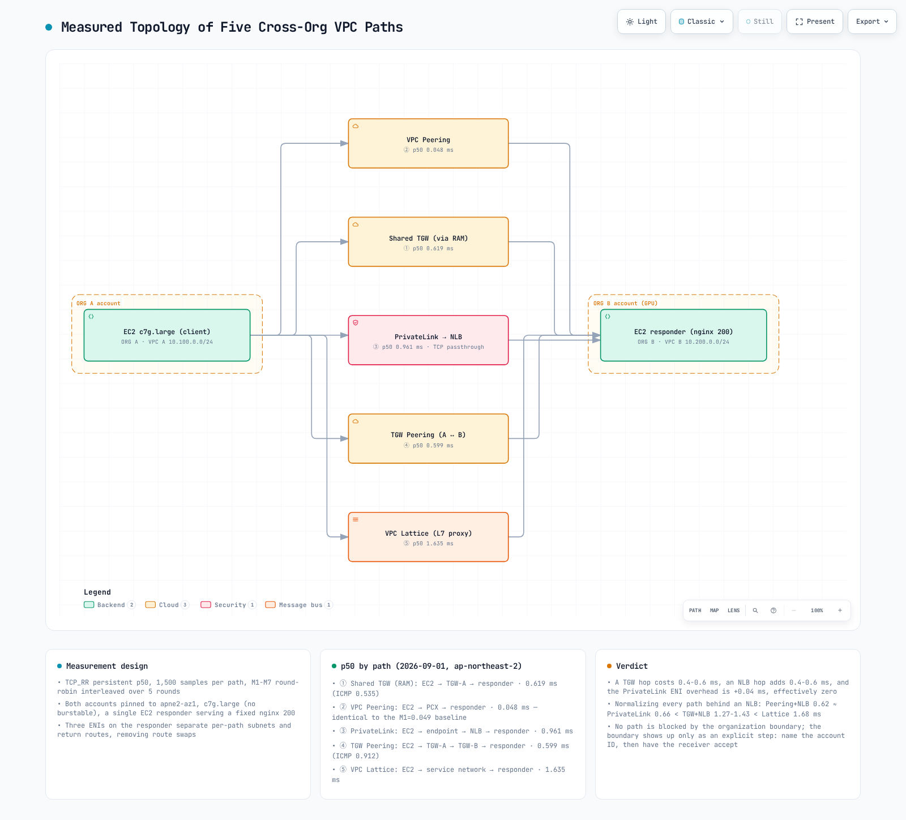

# Cross-Org VPC Connectivity

> **Last Updated**: September 1, 2026

This document covers five ways to **connect VPCs across two different AWS Organizations** — for example, when GPU workloads are contracted under a separate payer (separate Organization) from the existing MSP payer. Every number here comes from a live build-and-measure verification across two real Organizations (ap-northeast-2, both accounts pinned to ZoneId `apne2-az1`).

## Table of Contents

1. [Why Cross-Org Connectivity](#why-cross-org-connectivity)
2. [Comparing the Five Options](#comparing-the-five-options)
3. [Field Verification Results](#field-verification-results)
4. [Latency Measurements (M1–M7)](#latency-measurements-m1m7)
5. [Operational Findings from the Field](#operational-findings-from-the-field)
6. [Recommended Architecture by Scenario](#recommended-architecture-by-scenario)
7. [Conclusion](#conclusion)

## Why Cross-Org Connectivity

GPU instances (P5/P6, etc.) carry costs large enough that organizations increasingly contract them under a **separate payer (separate AWS Organization)** rather than the existing MSP payer. Common motivations:

- **Billing separation**: GPU-specific volume discounts / EDP optimization
- **Service quota isolation**: manage GPU vCPU limits and Capacity Blocks independently
- **Blast radius containment**: keep SCP misconfigurations and security incidents away from existing production
- **Regulatory compliance**: separate data boundaries and audit trails for AI/ML workloads

The key challenge becomes connecting the existing environment (ORG A) with the GPU environment (ORG B). From an EKS perspective, this covers training clusters (ORG B) reaching existing data pipelines (ORG A), or exposing inference APIs back to existing services.

## Comparing the Five Options

| Aspect | ① TGW RAM Sharing | ② VPC Peering | ③ PrivateLink | ④ TGW Peering | ⑤ VPC Lattice |
|---|---|---|---|---|---|
| Mechanism | Share TGW to external account via RAM | 1:1 VPC connection | NLB-based endpoint | Peering between per-ORG TGWs | L7 service network |
| Overlapping CIDRs | ❌ | ❌ | ✅ (ENI-based) | ❌ | ✅ (link-local based) |
| Direction | Bidirectional L3 | Bidirectional L3 | One-way (Consumer→Provider) | Bidirectional L3 | One-way (Consumer→Provider) |
| Transitive routing | ✅ via TGW RT | ❌ | ❌ | ✅ | ❌ (per service) |
| Routing control | **TGW owner account (ORG A)** | Both sides independent | Provider controls principals | **Each ORG independent** | Service network owner |
| Provisioning time (measured) | TGW ~3 min + acceptance steps | **Under 1 min** | Endpoint ~3 min | **~7 min (longest)** | ~5 min |

## Field Verification Results

All five options were built across accounts in two different Organizations and tested through both control plane (connection establishment) and data plane (real traffic). **All five are implementable.** Nothing is blocked by the organization boundary itself — the boundary shows up only as explicit procedures: **naming the account ID plus acceptance on the receiving side**.

[🔍 View interactive diagram](https://www.atomai.click/kubernetes-docs/archmaps/en-networking-05-cross-org-vpc-connectivity-0.html)

## Latency Measurements (M1–M7)

**Measurement design** — the signal is sub-millisecond, so measurement error must be smaller than the signal:

- **c7g.large** instances (no burstable types); the responder is **one EC2 instance (nginx fixed 200)** — load balancers appear only where structurally required (③⑤, plus M7 to isolate the NLB hop)
- The responder has 3 ENIs (per-path subnets with separate return route tables), so **M1–M7 run round-robin interleaved ×5 rounds** without route swapping
- Primary metric: **persistent TCP_RR ping-pong, 1,500 samples/path** (eliminates process startup and handshake costs); secondary: ICMP 100/path, HTTP keep-alive 275/path

| ID | Path | ICMP p50 | TCP_RR p50 | RR p99 | RR sd | HTTP KA p50 | TTL |
|---|---|---|---|---|---|---|---|
| M1 | Same VPC → EC2 (baseline) | 0.121 | **0.049** | 0.062 | 0.007 | 0.087 | 127 |
| M2 | ② VPC Peering → EC2 | 0.125 | **0.048** | 0.057 | 0.011 | 0.080 | 127 |
| M3 | ① Shared TGW (RAM) → EC2 | 0.535 | **0.619** | 0.695 | 0.141 | 0.686 | 126 |
| M4 | ④ TGW Peering (2 hops) → EC2 | 0.912 | **0.599** | 0.855 | 0.133 | 0.488 | 125 |
| M5 | ③ PrivateLink → NLB → EC2 | not measured | **0.961** | 1.084 | 0.035 | 0.711 | — |
| M6 | ⑤ VPC Lattice → EC2 target | not measured | not measured (L7 only) | — | — | **1.635** | — |
| M7 | ② Peering → NLB → EC2 (NLB hop isolation) | not measured | **0.841** | 0.909 | 0.119 | 0.883 | — |

**Derived metrics (p50, ms):**

| Metric | Definition | TCP_RR | ICMP |
|---|---|---|---|
| TGW 1-hop cost | M3 − M2 | **+0.571** | +0.410 |
| TGW 2-hop cost | M4 − M2 | **+0.551** | +0.787 |
| NLB hop cost | M7 − M2 | **+0.793** | — |
| Pure PrivateLink ENI overhead | M5 − M7 | **+0.120** | — |
| Lattice proxy cost (HTTP) | M6 − M2 | +1.555 | — |

**Verdict:**

> **Within the same AZ, a TGW hop adds 0.4–0.6 ms at p50** — consistent with the common "sub-ms per hop" observation.
> **VPC Peering's latency cost is zero within measurement limits** (M2 0.048 ≈ M1 baseline 0.049).
> **The PrivateLink ENI itself adds only +0.12 ms** — the bulk of PrivateLink's total latency (0.96 ms) is the structurally required **NLB hop (+0.79 ms)**. Lattice's L7 proxy costs +1.6 ms.

**Additional measurement — service-fronted fair comparison (NLB on every path):** In real deployments the Peering and TGW paths also front the service with an NLB, so an NLB-fronted configuration was additionally built and measured for every L3 path (per-subnet NLBs, IP targets, same methodology).

| Configuration | TCP_RR p50 | HTTP KA p50 |
|---|---|---|
| ② Peering → NLB → EC2 | **0.622** | 0.648 |
| ③ PrivateLink → NLB → EC2 | **0.658** | 0.845 |
| ① Shared TGW → NLB → EC2 | **1.273** | 1.257 |
| ④ TGW Peering → NLB → EC2 | **1.425** | 1.279 |
| ⑤ Lattice (acts as the LB itself — no NLB needed) | — | **1.680** |

> **Service-exposure-frame verdict:** the pure PrivateLink ENI cost is +0.036 ms (N5−N2) — effectively zero. In a real service-exposure setup where an NLB in front of the responder is the common baseline, **③ PrivateLink matches Peering+NLB and is roughly 2× faster than the TGW paths + NLB.** "Direct TGW beats PrivateLink" holds only in the LB-less direct frame. Lattice acts as the load balancer itself, so no separate NLB is needed — its gap to TGW+NLB in the same frame narrows to +0.3–0.4 ms.

**Methodology lesson** (why an earlier measurement round was discarded and redone): combining a burstable instance (t-family), a two-stage NLB→ALB proxy chain, and a fresh connection per request (curl) buries a sub-ms signal under noise (path-independent p95 around 7 ms). New TCP flows do pay a real +0.6–1.6 ms flow-setup cost on the first RTT through TGW/NLB, so **evaluate latency separately for keep-alive/long-lived connection workloads (gRPC, NCCL, DB pools) versus one-shot connection workloads**.

## Operational Findings from the Field

1. **Cross-org RAM sharing requires an explicit invitation acceptance step** — sharing is rejected without `--allow-external-principals`, and the resource is invisible until the receiver runs `accept-resource-share-invitation` (same for TGW and Lattice). Automation pipelines need this acceptance step.
2. **A foreign ORG's attachment to a shared TGW stalls at `pendingAcceptance`** — the TGW owner must accept it. "Owner-side central control" is enforced at the API level.
3. **TGW peering shows different attachment IDs on each side** — calling the accept API with the requester-side ID returns `NotFound`. The accepter account must list and find its own ID, and propagation takes about 2 minutes.
4. **TGW peering does not support BGP** — static routes must be added manually to both TGW route tables.
5. **The Lattice data plane arrives from link-local (169.254.171.0/24)** — if the target SG only allows the VPC CIDR, every health check goes UNHEALTHY. Add the managed prefix list `com.amazonaws.<region>.vpc-lattice` to the SG.
6. **Static TGW routes take priority over propagated routes** — watch for unintended path selection when both coexist.
7. **Account automation interferes with teardown** — GuardDuty Runtime Monitoring's managed SG blocks VPC deletion (DependencyViolation), and auto-attached IAM policies block role deletion; a lingering Lattice target group also blocks VPC deletion.

## Recommended Architecture by Scenario

| Scenario | First choice | Rationale (measured) |
|---|---|---|
| Full GPU ORG separation, bidirectional bulk (training data) | **④ TGW Peering** | Independent routing per ORG + 0.4–0.6 ms/hop penalty is negligible |
| Exposing only an inference API (one-way) | **③ PrivateLink** | Minimal exposure, overlapping CIDRs OK, matches Peering+NLB in the service-fronted comparison (~2× faster than TGW paths + NLB) |
| Unavoidable CIDR overlap (M&A, MSP migration) | **③ PrivateLink / ⑤ Lattice** | ENI / link-local based — CIDR-independent |
| Adding just a GPU account to an existing TGW | **① TGW RAM Sharing** | Reuses the existing hub; the foreign ORG cannot change routing |
| Small PoC (1–2 VPCs) | **② VPC Peering** | Under 1 minute to set up, latency cost ≈ 0, no extra infrastructure |
| Service exposure needing L7 auth/governance | **⑤ VPC Lattice** | Built-in IAM Auth and service discovery (accepting +1.6 ms proxy cost) |

For most GPU-separation scenarios the hybrid of **④ TGW Peering (bidirectional infrastructure) + ③ PrivateLink (inference API exposure)** is optimal, and the measurements support that recommendation.

## Conclusion

- All five options can be configured across different Organizations purely through APIs; the organization boundary appears only as "name the account ID + acceptance on the receiving side."
- In the same AZ: TGW 0.4–0.6 ms/hop, VPC Peering ≈ 0, NLB hop +0.79 ms, PrivateLink ENI +0.12 ms, Lattice proxy +1.6 ms — latency cost scales honestly with hops and proxy layers.
- For EKS: route bulk training-data transfer (long-lived connections) over TGW, and expose inference APIs via PrivateLink.

**Limitations (not measured):** paths through Network Firewall inspection, Cross-Region, overlapping-CIDR environments (functionally confirmed only), and the throughput/concurrency axis.

---

## References

- [Building Scalable Multi-VPC Network Infrastructure (AWS Whitepaper)](https://docs.aws.amazon.com/whitepapers/latest/building-scalable-secure-multi-vpc-network-infrastructure/welcome.html)
- [TGW Cross-Org Sharing with RAM (AWS Prescriptive Guidance)](https://docs.aws.amazon.com/prescriptive-guidance/latest/integrate-third-party-services/architecture-3-1.html)
- [Choosing Single vs Multiple Organizations (AWS Architecture Blog)](https://aws.amazon.com/blogs/architecture/choosing-between-single-or-multiple-organizations-in-aws-organizations/)
- [VPC Lattice (this series)](02-vpc-lattice.md)
