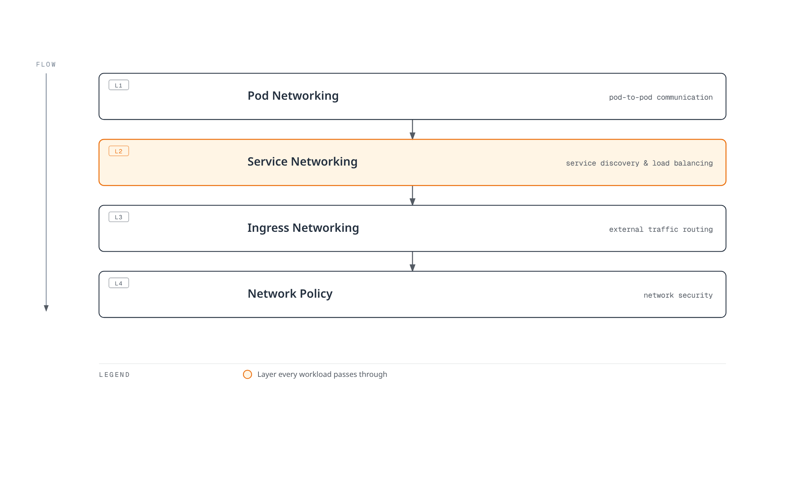
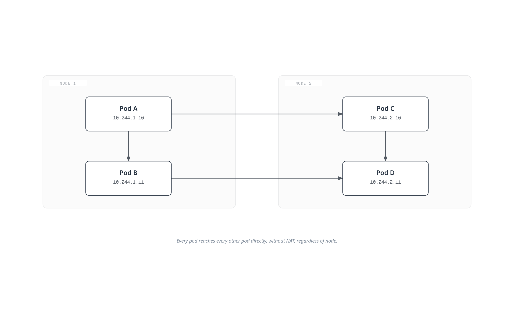
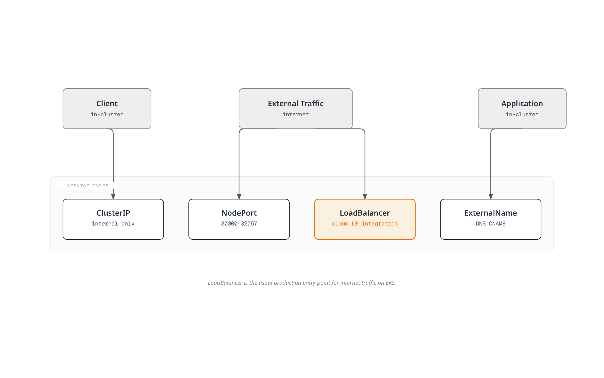
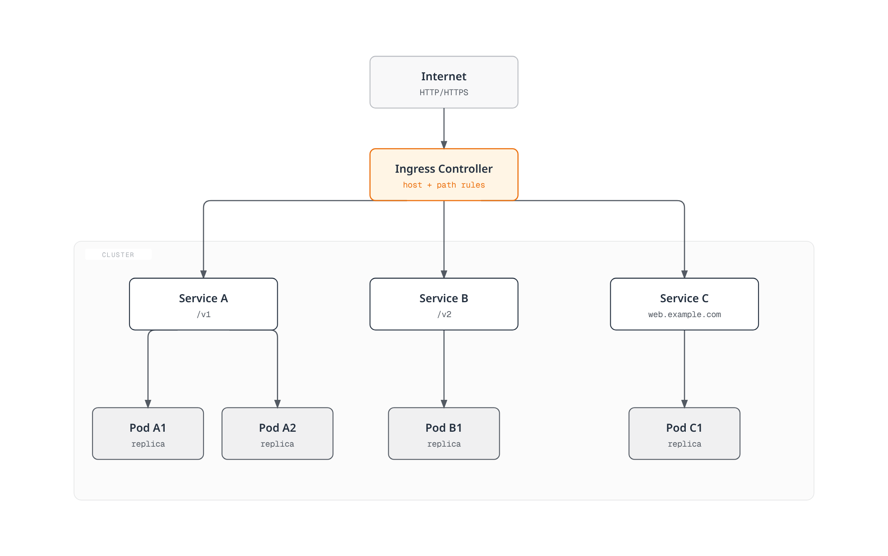
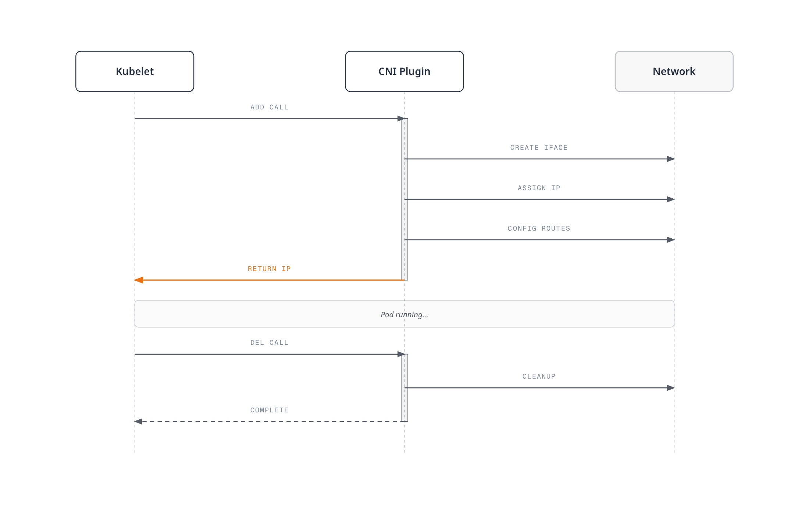
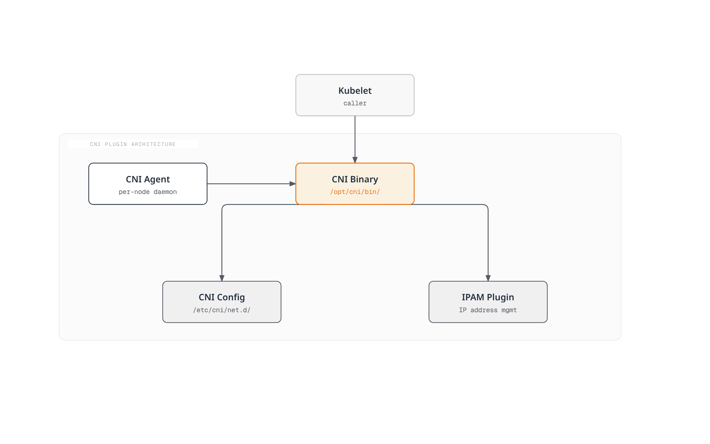
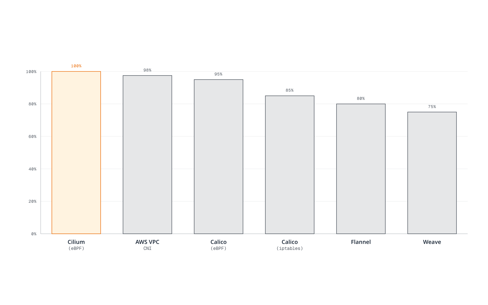
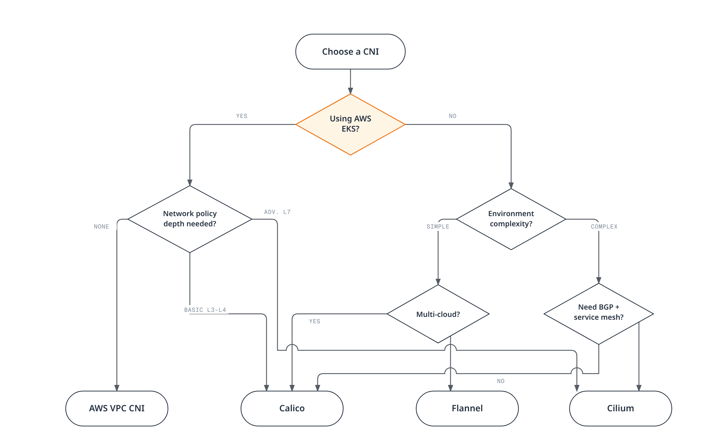
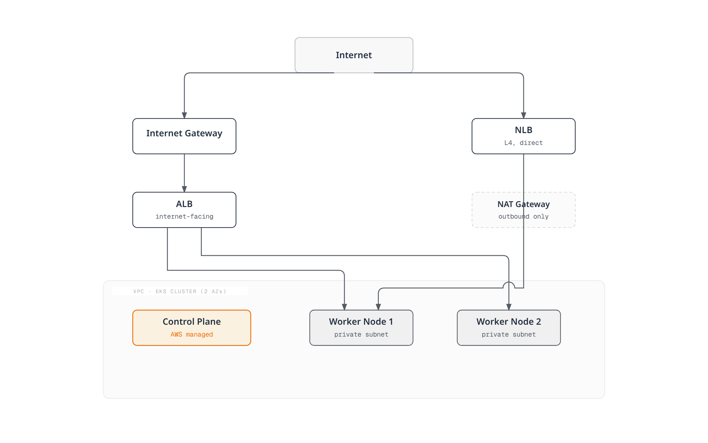
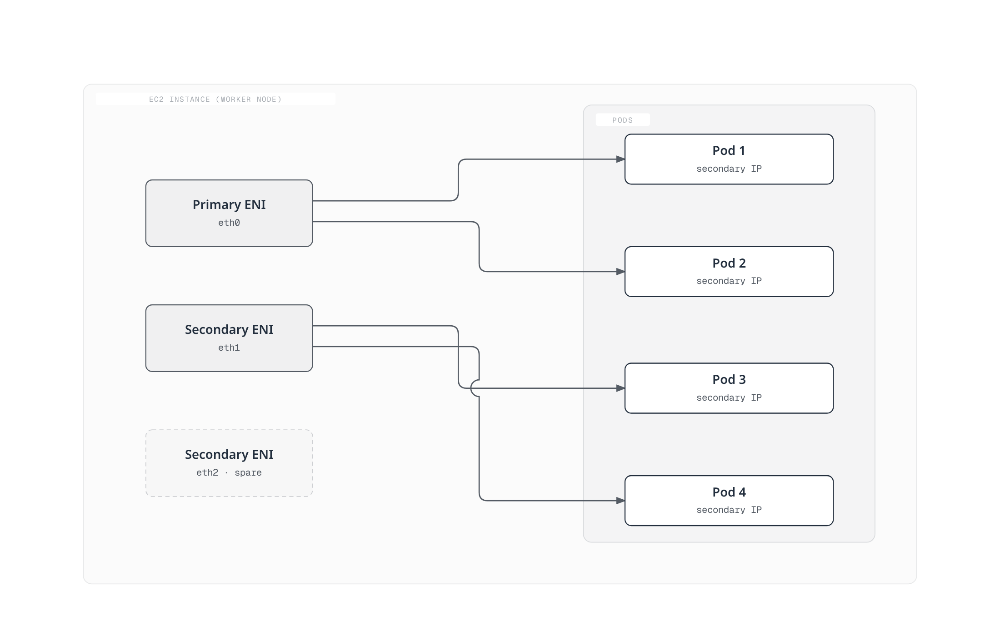

# Kubernetes Networking

> **Last Updated**: February 22, 2026

## Overview

Kubernetes networking is the core infrastructure layer that enables communication between containerized applications. This section covers everything from basic Kubernetes networking concepts to advanced CNI (Container Network Interface) solutions and networking patterns in AWS EKS environments.

## Kubernetes Networking Model

Kubernetes is designed based on the following networking requirements:

1. **Every Pod can communicate with every other Pod without NAT**
2. **Every Node can communicate with every Pod without NAT**
3. **The IP that a Pod sees itself as is the same IP that others see it as**



### Pod Networking

Pod networking is the most fundamental layer of Kubernetes networking. Each Pod has a unique IP address and can communicate directly with all other Pods in the cluster.



#### Pod Networking Implementation Methods

| Method | Description | Example CNI |
|--------|-------------|-------------|
| **Overlay Network** | Virtual network built on top of existing network | Flannel (VXLAN), Calico (IPIP), Weave Net |
| **Underlay Network** | Direct routing on physical network | AWS VPC CNI, Calico (BGP), Cilium (Native Routing) |
| **Hybrid** | Choose overlay/underlay based on environment | Cilium, Calico |

### Service Networking

Services provide stable network endpoints for a set of Pods.



#### Service Type Characteristics

```yaml
# ClusterIP Service Example
apiVersion: v1
kind: Service
metadata:
  name: my-service
  namespace: default
spec:
  type: ClusterIP
  selector:
    app: my-app
  ports:
    - protocol: TCP
      port: 80
      targetPort: 8080
---
# NodePort Service Example
apiVersion: v1
kind: Service
metadata:
  name: my-nodeport-service
spec:
  type: NodePort
  selector:
    app: my-app
  ports:
    - protocol: TCP
      port: 80
      targetPort: 8080
      nodePort: 30080  # Range: 30000-32767
---
# LoadBalancer Service Example
apiVersion: v1
kind: Service
metadata:
  name: my-loadbalancer-service
  annotations:
    service.beta.kubernetes.io/aws-load-balancer-type: "nlb"
spec:
  type: LoadBalancer
  selector:
    app: my-app
  ports:
    - protocol: TCP
      port: 443
      targetPort: 8443
```

### Ingress Networking

Ingress defines rules for routing HTTP/HTTPS traffic to internal cluster Services.



```yaml
# Ingress Example
apiVersion: networking.k8s.io/v1
kind: Ingress
metadata:
  name: my-ingress
  annotations:
    kubernetes.io/ingress.class: "alb"
    alb.ingress.kubernetes.io/scheme: "internet-facing"
spec:
  rules:
    - host: api.example.com
      http:
        paths:
          - path: /v1
            pathType: Prefix
            backend:
              service:
                name: api-v1
                port:
                  number: 80
          - path: /v2
            pathType: Prefix
            backend:
              service:
                name: api-v2
                port:
                  number: 80
    - host: web.example.com
      http:
        paths:
          - path: /
            pathType: Prefix
            backend:
              service:
                name: web-frontend
                port:
                  number: 80
```

## CNI (Container Network Interface)

CNI is a standard interface for container network connectivity. Kubernetes implements Pod networking through CNI plugins.

### How CNI Works



### CNI Plugin Components



## CNI Comparison Matrix

### Major CNI Solution Comparison

| Feature | Cilium | Calico | Flannel | AWS VPC CNI | Weave Net |
|---------|--------|--------|---------|-------------|-----------|
| **Core Technology** | eBPF | iptables/eBPF | VXLAN/host-gw | AWS ENI | VXLAN |
| **Network Policy** | Advanced (L3-L7) | Advanced (L3-L4) | None | Basic (L3-L4) | Basic |
| **Encryption** | WireGuard/IPsec | WireGuard/IPsec | None | None | Built-in |
| **Service Mesh** | Built-in | None | None | None | None |
| **Observability** | Hubble | Limited | None | None | None |
| **BGP Support** | Yes | Yes | No | No | No |
| **Multi-cluster** | ClusterMesh | Federation | No | No | Yes |
| **Windows Support** | Beta | Yes | Yes | Yes | Yes |
| **Performance** | Excellent | Very Good | Good | Excellent | Good |
| **Complexity** | Medium-High | Medium | Low | Low | Low |
| **Community** | Active | Very Active | Active | AWS Supported | Moderate |

### Detailed Feature Comparison

#### Networking Modes

| CNI | Overlay | Native Routing | BGP | Direct Routing |
|-----|---------|----------------|-----|----------------|
| **Cilium** | VXLAN, Geneve | Yes | Yes | Yes |
| **Calico** | VXLAN, IPIP | Yes | Yes | Yes |
| **Flannel** | VXLAN | host-gw | No | No |
| **AWS VPC CNI** | No | VPC Native | No | Yes |
| **Weave Net** | VXLAN | No | No | No |

#### Network Policy Features

| Feature | Cilium | Calico | AWS VPC CNI |
|---------|--------|--------|-------------|
| **Ingress Policy** | Yes | Yes | Yes |
| **Egress Policy** | Yes | Yes | Yes |
| **L7 Policy (HTTP)** | Yes | No | No |
| **DNS-based Policy** | Yes | Yes | No |
| **FQDN Policy** | Yes | Yes | No |
| **Host Policy** | Yes | Yes | No |
| **Global Policy** | Yes | Yes | No |
| **Policy Tiers** | Yes | Yes | No |

#### Performance Benchmark (Relative Comparison)



## CNI Selection Guide

### Decision Flowchart



### Recommended CNI by Use Case

#### 1. AWS EKS Production Environment

**Recommended: AWS VPC CNI + Calico (Network Policy)**

```yaml
# eksctl cluster configuration example
apiVersion: eksctl.io/v1alpha5
kind: ClusterConfig
metadata:
  name: production-cluster
  region: ap-northeast-2
vpc:
  cidr: "10.0.0.0/16"
addons:
  - name: vpc-cni
    version: latest
    configurationValues: |
      enableNetworkPolicy: "true"
  - name: coredns
  - name: kube-proxy
```

#### 2. Advanced Security Requirements

**Recommended: Cilium**

- L7 Network Policy support
- DNS-based policy
- Process/file level security policies
- Encrypted communication (WireGuard)

#### 3. On-premises/Bare-metal Environment

**Recommended: Calico (BGP Mode)**

- Integration with existing network infrastructure
- BGP peering with ToR switches
- High performance (no overlay)

#### 4. Development/Test Environment

**Recommended: Flannel**

- Simple installation and configuration
- Low resource usage
- Sufficient basic features

#### 5. Service Mesh Integration Environment

**Recommended: Cilium (Sidecar-less Service Mesh)**

- Can replace Istio/Envoy
- mTLS, traffic management
- Low overhead

## EKS Networking Fundamentals

### EKS Default Networking Architecture



### How VPC CNI Works

AWS VPC CNI assigns actual VPC IP addresses to each Pod.



#### ENI and IP Limits

| Instance Type | Max ENIs | IPv4 per ENI | Max Pods (Recommended) |
|---------------|----------|--------------|------------------------|
| t3.medium | 3 | 6 | 17 |
| t3.large | 3 | 12 | 35 |
| m5.large | 3 | 10 | 29 |
| m5.xlarge | 4 | 15 | 58 |
| m5.2xlarge | 4 | 15 | 58 |
| c5.4xlarge | 8 | 30 | 234 |

### EKS Networking Considerations

#### IP Address Management

```yaml
# VPC CNI Configuration - IP Prefix Delegation
apiVersion: v1
kind: ConfigMap
metadata:
  name: amazon-vpc-cni
  namespace: kube-system
data:
  enable-prefix-delegation: "true"
  warm-prefix-target: "1"
  minimum-ip-target: "5"
  warm-ip-target: "2"
```

#### Custom Networking

```yaml
# ENIConfig for Custom Subnets
apiVersion: crd.k8s.amazonaws.com/v1alpha1
kind: ENIConfig
metadata:
  name: us-east-1a
spec:
  securityGroups:
    - sg-0123456789abcdef0
  subnet: subnet-0123456789abcdef0
---
apiVersion: crd.k8s.amazonaws.com/v1alpha1
kind: ENIConfig
metadata:
  name: us-east-1b
spec:
  securityGroups:
    - sg-0123456789abcdef0
  subnet: subnet-fedcba9876543210f
```

## Networking Sub-pages

This section covers the following topics in detail:

### [VPC CNI](01-vpc-cni.md)
Default EKS CNI. Assigns VPC IPs to each Pod for native VPC networking.

### [Cilium Deep Dive](cilium/README.md)
High-performance eBPF-based CNI solution. Provides advanced features like L7 Network Policy, Service Mesh, and observability (Hubble).

### [Calico Deep Dive](calico/README.md)
One of the most widely used CNIs. Powerful Network Policy, BGP support, and enterprise features. Covers introduction, architecture, networking modes, BGP deep dive, Network Policy, eBPF, advanced topics, EKS integration, and operations guide.

### [VPC Lattice](02-vpc-lattice.md)
AWS managed application networking service. Cross-VPC, cross-account service-to-service communication.

### [AWS Load Balancer Controller](03-aws-lb-controller.md)
Integrates Kubernetes Services and Ingress with AWS ELB (ALB/NLB).

### [Gateway API](04-gateway-api.md)
Next-generation Kubernetes ingress API. Standardized resource model and role-based configuration.

## Network Troubleshooting

### Common Issues and Solutions

#### Pod-to-Pod Communication Failure

```bash
# 1. Check Pod IPs
kubectl get pods -o wide

# 2. Test network connectivity
kubectl exec -it <pod-name> -- ping <target-pod-ip>

# 3. Test DNS resolution
kubectl exec -it <pod-name> -- nslookup <service-name>

# 4. Check CNI logs
kubectl logs -n kube-system -l k8s-app=aws-node
kubectl logs -n kube-system -l k8s-app=cilium
```

#### Service Unreachable

```bash
# 1. Check Service status
kubectl get svc <service-name> -o yaml

# 2. Check Endpoints
kubectl get endpoints <service-name>

# 3. Check kube-proxy logs
kubectl logs -n kube-system -l k8s-app=kube-proxy
```

#### Network Policy Debugging

```bash
# For Cilium
kubectl exec -n kube-system -it <cilium-pod> -- cilium policy get
kubectl exec -n kube-system -it <cilium-pod> -- cilium endpoint list

# For Calico
kubectl get networkpolicy -A
kubectl get globalnetworkpolicy
calicoctl get policy -o yaml
```

### Network Performance Testing

```yaml
# Network performance test using iperf3
apiVersion: v1
kind: Pod
metadata:
  name: iperf-server
  labels:
    app: iperf-server
spec:
  containers:
  - name: iperf
    image: networkstatic/iperf3
    command: ["iperf3", "-s"]
    ports:
    - containerPort: 5201
---
apiVersion: v1
kind: Pod
metadata:
  name: iperf-client
spec:
  containers:
  - name: iperf
    image: networkstatic/iperf3
    command: ["sleep", "infinity"]
```

```bash
# Run the test
kubectl exec -it iperf-client -- iperf3 -c <iperf-server-ip> -t 30
```

## Best Practices

### 1. IP Address Planning

- Design CIDR blocks large enough
- Separate Pod network from Service network
- Design subnets with future expansion in mind

### 2. Apply Network Policies

- Apply default deny policies (Zero Trust)
- Explicitly allow only required traffic
- Isolate namespaces

```yaml
# Default deny policy example
apiVersion: networking.k8s.io/v1
kind: NetworkPolicy
metadata:
  name: default-deny-all
  namespace: production
spec:
  podSelector: {}
  policyTypes:
    - Ingress
    - Egress
```

### 3. Performance Optimization

- Choose appropriate CNI (matching workload)
- MTU optimization
- Kernel parameter tuning

### 4. Security Hardening

- Encrypted communication (WireGuard, IPsec)
- Apply mTLS
- Regular security audits

### 5. Ensure Observability

- Collect network metrics
- Enable flow logs
- Implement distributed tracing

## Next Steps

1. [VPC CNI](01-vpc-cni.md) - Default EKS CNI
2. [Cilium Deep Dive](cilium/README.md) - eBPF-based networking
3. [Calico Deep Dive](calico/README.md) - Enterprise CNI
4. [VPC Lattice](02-vpc-lattice.md) - AWS managed networking
5. [AWS Load Balancer Controller](03-aws-lb-controller.md) - ELB integration
6. [Gateway API](04-gateway-api.md) - Next-generation ingress

---

## References

- [Kubernetes Networking Model](https://kubernetes.io/docs/concepts/cluster-administration/networking/)
- [CNI Specification](https://github.com/containernetworking/cni/blob/master/SPEC.md)
- [AWS VPC CNI Documentation](https://docs.aws.amazon.com/eks/latest/userguide/pod-networking.html)
- [Network Policy Guide](https://kubernetes.io/docs/concepts/services-networking/network-policies/)
