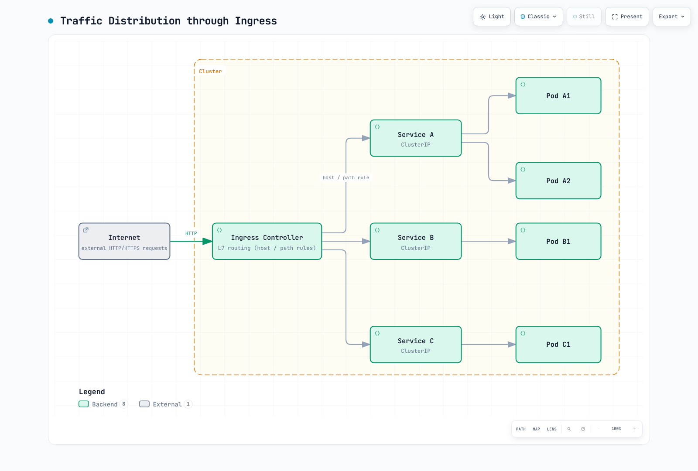
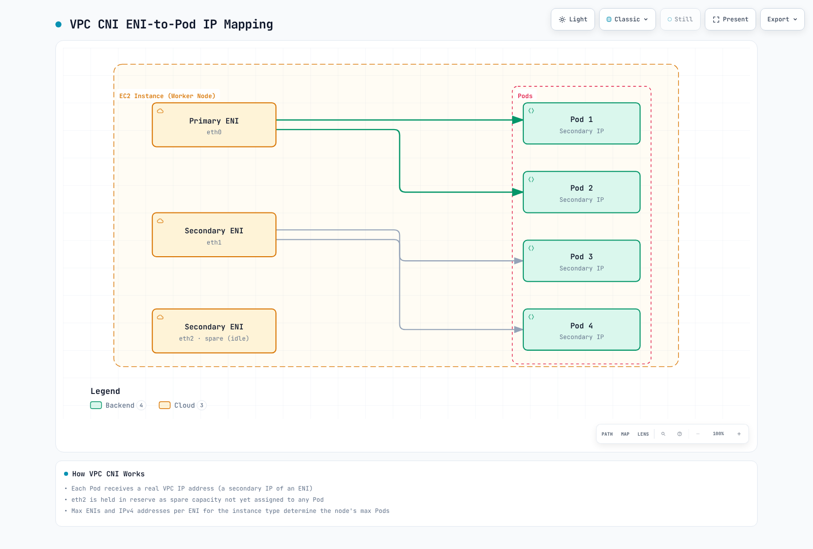

# Kubernetes Networking

> **Last Updated**: September 13, 2026. Feature references include Cilium 1.20.1, Calico Open Source 3.32, Flannel 0.28.9 and AWS VPC CNI 1.23.0. Check each product's Kubernetes/platform matrix before installation; these are not a jointly tested cluster configuration.

## Overview

Kubernetes networking is the core infrastructure layer that enables communication between containerized applications. This section covers everything from basic Kubernetes networking concepts to advanced CNI (Container Network Interface) solutions and networking patterns in AWS EKS environments.

## Kubernetes Networking Model

The current Kubernetes model provides a Pod network in which Pods can communicate directly across nodes without address translation or proxies, **subject to intentional network segmentation**. Node agents such as kubelet must be able to reach Pods on their own node. Network policy, routing and application listeners still determine whether a particular connection succeeds.

Ordinary Pods have their own network namespace and cluster-wide addresses; containers in one Pod share that namespace and localhost. Host-network Pods share the node network, and dual-stack or multi-network configurations need more precise address handling. Recreating a Pod may assign a different IP; restarting a container inside the same Pod does not necessarily recreate its network sandbox.

| Component | Role |
|---|---|
| Pod network | Addressing and connectivity between workload network namespaces |
| Service/discovery | Stable service names or virtual addresses over changing endpoints |
| Ingress/Gateway implementation | Configured external entry and application routing |
| Network policy engine | Enforces the policies supported by the selected implementation |

These roles do not form a mandatory serial packet path. Service translation, an L7 proxy and workload policy can change how a particular request traverses the network.

### Pod Networking

Pod networking supplies the addressing and routes for Pod communication. The illustration below shows ordinary IPv4 Pods; its connections assume that applicable policies and network controls permit them.


[🔍 View interactive diagram](https://www.atomai.click/kubernetes-docs/archmaps/en-networking-readme-1.html)

The addresses are illustrative ordinary Pod addresses. Intentional isolation and host-network or multi-network configurations require their own interpretation.

#### Pod Networking Implementation Methods

| Method | Description | Example CNI |
|--------|-------------|-------------|
| **Overlay Network** | Encapsulates traffic over the existing network | Flannel VXLAN, Calico VXLAN/IPIP, Cilium VXLAN/Geneve |
| **Native Routing** | Uses routes in the underlying network without that overlay encapsulation | AWS VPC CNI, Calico routing/BGP, Cilium native routing |
| **Conditional Encapsulation** | Uses direct paths or encapsulation according to configured topology | Supported Calico/Flannel/Cilium modes, with different prerequisites |

### Service Networking

Services describe a logical set of endpoints, usually Pods, and how to reach them. ClusterIP supplies a stable virtual IP by default; headless Services omit that virtual IP, and ExternalName uses DNS CNAME mapping. A Service can also have endpoints managed without a Pod selector.


[🔍 View interactive diagram](https://www.atomai.click/kubernetes-docs/archmaps/en-networking-readme-2.html)

These are typical exposure mechanisms, not security guarantees. NodePort range and accessible node addresses are configurable; LoadBalancers can be internal. ExternalName returns a DNS alias and does not create a forwarding proxy.

#### Service Type Characteristics

Create matching `app: my-app` Pods in `default`, listening on the shown target ports. The NodePort default allocation range is 30000–32767 and can be configured. External reachability still depends on addresses, routes and access controls.

The LoadBalancer example explicitly selects **AWS Load Balancer Controller**, with EC2 instance targets and allocated NodePorts. Install/configure that controller and its IAM/subnet prerequisites first. EKS Auto Mode uses a different controller/class. Port 443 merely selects a TCP port here; TLS must be served by the backend on 8443 or configured separately on the load balancer.

These port mappings illustrate the general Kubernetes Service API. AWS currently documents additional native EKS network-policy requirements: the Service port must match the container port, and controller-managed Pods with `metadata.ownerReferences` provide reliable enforcement. Adapt the examples to those requirements before testing that policy implementation.

```yaml
apiVersion: v1
kind: Service
metadata:
  name: my-service
  namespace: default
spec:
  type: ClusterIP
  selector:
    app: my-app
  ports:
  - protocol: TCP
    port: 80
    targetPort: 8080
---
apiVersion: v1
kind: Service
metadata:
  name: my-nodeport-service
  namespace: default
spec:
  type: NodePort
  selector:
    app: my-app
  ports:
  - protocol: TCP
    port: 80
    targetPort: 8080
    nodePort: 30080
---
apiVersion: v1
kind: Service
metadata:
  name: my-loadbalancer-service
  annotations:
    service.beta.kubernetes.io/aws-load-balancer-scheme: internet-facing
    service.beta.kubernetes.io/aws-load-balancer-nlb-target-type: instance
  namespace: default
spec:
  type: LoadBalancer
  selector:
    app: my-app
  ports:
  - protocol: TCP
    port: 443
    targetPort: 8443
  loadBalancerClass: service.k8s.aws/nlb
  allocateLoadBalancerNodePorts: true
```

### Ingress Networking

An Ingress resource needs a controller and its data plane. This HTTP example uses AWS LBC with `spec.ingressClassName: alb` and IP targets. The referenced `api-v1`, `api-v2` and `web-frontend` Services must exist in `default`, expose port 80 and have ready, VPC-routable Pod endpoints. Configure HTTPS/certificates separately when required. See the [LBC guide](03-aws-lb-controller.md) for its installation and target prerequisites.

Ingress defines rules for routing HTTP/HTTPS traffic to internal cluster Services.



[🔍 View interactive diagram](https://www.atomai.click/kubernetes-docs/archmaps/en-networking-readme-3.html)

The box represents the Ingress data-plane function. AWS LBC programs ALB; application traffic does not traverse the controller reconciliation process. Depending on target mode, the data plane can reach Pod IPs or NodePorts instead of traversing a Service virtual IP as a literal extra hop.

```yaml
apiVersion: networking.k8s.io/v1
kind: Ingress
metadata:
  name: my-ingress
  annotations:
    alb.ingress.kubernetes.io/scheme: internet-facing
    alb.ingress.kubernetes.io/target-type: ip
  namespace: default
spec:
  rules:
  - host: api.example.com
    http:
      paths:
      - path: /v1
        pathType: Prefix
        backend:
          service:
            name: api-v1
            port:
              number: 80
      - path: /v2
        pathType: Prefix
        backend:
          service:
            name: api-v2
            port:
              number: 80
  - host: web.example.com
    http:
      paths:
      - path: /
        pathType: Prefix
        backend:
          service:
            name: web-frontend
            port:
              number: 80
  ingressClassName: alb
```

## CNI (Container Network Interface)

CNI standardizes the interface through which a runtime configures a container network. For current Kubernetes, kubelet requests Pod-sandbox operations through CRI and the **container runtime manages CNI**. Kubelet's old direct CNI management flags were removed in Kubernetes 1.24.

### Runtime and Plugin Responsibilities

| Actor | Responsibility |
|---|---|
| kubelet | Requests sandbox creation/removal through the container runtime interface |
| Container runtime | Selects the network configuration and invokes the CNI plugin chain |
| CNI plugin | Receives configuration, performs ADD/DEL and other supported operations, and returns results |
| IPAM implementation | Allocates/releases addresses; may be a delegated plugin or part of a provider-specific agent |
| Optional node agent | Maintains provider-specific routes, policy, IP pools or datapath state |

The runtime passes configuration to the plugin through the CNI interface; a separate long-running agent or IPAM binary is not mandatory for every plugin. Interface types also vary: veth pairs are common, but are not the only implementation.

## CNI Comparison

| Project / scope | Networking and policy | Features and limits to distinguish |
|---|---|---|
| **Cilium 1.20.1** | eBPF networking; Envoy for relevant L7 functions; Cilium network policies and Hubble | Linux worker dataplane, with AMD64/Arm64 requirements. Windows CLI availability is not Windows CNI support. WireGuard/IPsec and Beta ztunnel mTLS have distinct scopes. |
| **Calico Open Source 3.32** | Routing/encapsulation choices; iptables, nftables and eBPF options; ordered policy tiers and host/workload policy | Windows has separate limits, including no Linux eBPF or WireGuard dataplane. Whisker/Goldmane flow observability is available as Tech Preview. Consult the edition matrix for paid capabilities. |
| **Flannel 0.28.9** | Host subnet allocation and inter-node transport; VXLAN, host-gw and other backends | `flanneld` itself does not enforce NetworkPolicy; the chart's optional `netpol.enabled` deploys a SIGs policy controller. WireGuard is a documented backend; IPsec is experimental. Windows VXLAN has specific settings/limits. |
| **AWS VPC CNI 1.23.0 / EKS** | VPC address allocation and EC2 ENIs/prefixes; EKS standard and Admin network policy capabilities on supported Linux EC2 nodes | EKS Auto Mode is a managed networking implementation with additional DNS policy capabilities. Windows, Fargate, custom networking, prefix delegation and multi-NIC support have separate conditions. |
| **Original Weave Net project** | Historical overlay networking implementation | The original `weaveworks/weave` repository is archived. Do not describe it as an active, supported default for a new cluster. |

### Policy, Encryption and Observability

- Cilium provides HTTP/DNS-aware policy through the applicable L7 components, and cluster-wide/host policy. Its deny/allow semantics are not Calico's ordered Tier API.
- Calico Open Source includes hierarchical policy tiers and host policy. The current product matrix assigns application-layer policy, DNS/FQDN policy and Cluster Mesh to Cloud/Enterprise; those must not be silently attributed to the open-source edition. Calico's documented in-transit encryption uses WireGuard.
- Amazon EKS provides `ClusterNetworkPolicy` Admin/Baseline controls for Auto Mode and supported EC2/VPC-CNI installations. The DNS/FQDN `ApplicationNetworkPolicy` feature described by AWS is for **Auto Mode**. Its name does not imply current HTTP-method/body inspection.
- Flannel's optional policy controller has its own requirements; selecting a networking backend alone does not enable enforcement.
- Node-to-node encryption, authenticated workload identity and application mTLS are different controls. Network flow visibility also differs from application tracing or process/file enforcement.

### Routing and Performance

Calico and Cilium can advertise routes using BGP; that does not by itself provide multi-cluster service discovery, policy synchronization or encryption. Flannel host-gw uses direct routes and requires suitable layer-2 connectivity. An overlay adds encapsulation and MTU considerations, but a universal performance ranking cannot be inferred from the CNI name.

The former 100/98/95/85/80/75 percent throughput figure had no reproducible workload, versions or measurement source. Use comparable hardware, kernel, packet/request sizes, concurrency, encryption/policy settings, throughput, loss and tail latency. The separate [Pod benchmark](06-pod-network-benchmark.md) retains its own historical environment and measurements.

## CNI Selection Guide

Choose the required routing, policy, operating-system and support model first, then test that combination.

| Need | Evaluation path |
|---|---|
| Standard EKS VPC addressing and supported network policies | Evaluate AWS VPC CNI/EKS capabilities before adding a second policy engine. |
| Ordered policy tiers, host policy or infrastructure BGP | Evaluate the relevant Calico edition/dataplane and routing prerequisites. |
| Cilium policy, Hubble or selected mesh features | Check Linux/kernel/platform compatibility and the [Cilium mesh guide](../service-mesh/cilium-service-mesh/README.md). Envoy remains part of applicable L7 paths. |
| A small network with a limited feature set | Evaluate Flannel's backend and optional policy controller against actual requirements. |
| Process, syscall or file enforcement | Evaluate a runtime-security component such as Tetragon separately from network policy. |

### EKS Managed Add-on Configuration

The following is an example **configuration payload**, not an instruction to install both Calico and the VPC CNI policy engine on the same workloads:

```json
{
  "enableNetworkPolicy": "true"
}
```

The string `"true"` is the documented type for this setting. Select a compatible EKS add-on build for the existing Kubernetes version and inspect that build's configuration schema:

```bash
EKS_REGION=ap-northeast-2
KUBERNETES_MINOR=1.35  # Replace with the existing cluster's minor version
aws eks describe-addon-versions --region "$EKS_REGION" --addon-name vpc-cni \
  --kubernetes-version "$KUBERNETES_MINOR"
: "${VPC_CNI_ADDON_VERSION:?Set the compatible eksbuild version selected from metadata}"
aws eks describe-addon-configuration --region "$EKS_REGION" --addon-name vpc-cni \
  --addon-version "$VPC_CNI_ADDON_VERSION"
```

The upstream 1.23.0 release number and an EKS `eksbuild` version are different identifiers. Merge changes with the intended managed add-on configuration; do not blindly select `latest` or replace unrelated values. A migration from a third-party policy implementation also needs removal of its existing enforcement state and a tested node/workload transition plan.

## EKS Networking Fundamentals

### EKS Default Networking Architecture

| Location / component | Responsibility |
|---|---|
| EKS-managed VPC | AWS runs the managed Kubernetes control plane across Availability Zones. |
| Customer cluster VPC | Worker networking, selected subnets and EKS-managed cross-account ENIs provide the configured paths to the control plane. |
| ALB/NLB in selected customer VPC subnets | Provides the chosen public or internal application entry point; an internet gateway/NAT gateway is not a substitute for that routing configuration. |
| NAT gateway or private service endpoints | Supplies the particular outbound paths the workload design requires. |

The former figure put the control plane inside the customer VPC and load balancers outside it; it has been replaced by these ownership boundaries.

### DNS and Networking by Compute Mode

| Compute mode | DNS / component placement |
|---|---|
| Standard EC2 nodes | Normally use the configured CoreDNS Deployment and installed networking components; replacements need their own supported configuration. |
| Pure EKS Auto Mode | CoreDNS, VPC CNI and kube-proxy functions run as managed node systemd services. A CoreDNS Deployment/add-on is unnecessary for these nodes. |
| Auto Mode mixed with non-Auto nodes | Retain the CoreDNS Deployment for the non-Auto nodes; they cannot use another node's Auto Mode DNS service. |

Auto Mode's first DNS resolver is node-local. Upstream forwarding and control-plane communication can still require network access; this is not a guarantee that every DNS-related packet stays on the node. AWS documents both Admin and DNS policies for Auto Mode, while standard EC2 VPC-CNI Admin policy has its own version/enabling requirements.

### How VPC CNI Works

AWS VPC CNI gives ordinary Pods VPC-routable addresses using the selected IPAM mode. Secondary IPv4 addresses, delegated prefixes, branch ENIs and multi-NIC configurations differ; host-network Pods share the node network.



[🔍 View interactive diagram](https://www.atomai.click/kubernetes-docs/archmaps/en-networking-readme-9.html)

This depicts secondary-IP mode only. A warm ENI is a configurable allocation strategy, not a requirement that every node always reserves exactly one. Prefix delegation, custom networking and branch ENIs have different allocation rules.

#### ENI and IP Limits

| Instance Type | Max ENIs | IPv4 slots per ENI | Legacy secondary-IP bootstrap value |
|---------------|----------|--------------|------------------------|
| t3.medium | 3 | 6 | 17 |
| t3.large | 3 | 12 | 35 |
| m5.large | 3 | 10 | 29 |
| m5.xlarge | 4 | 15 | 58 |
| m5.2xlarge | 4 | 15 | 58 |
| c5.4xlarge | 8 | 30 | 234 |

These values are verified against the VPC CNI 1.23.0 instance limits and legacy max-Pods table. The historical calculation is `ENIs × (IPv4 slots per ENI − 1) + 2`; it is not a current universal recommendation. Prefix delegation, custom networking, branch ENIs and multiple network cards change address capacity. Kubernetes scheduling is also bounded by kubelet `maxPods` and resources. EKS managed node groups cap `maxPods` at 110 for instances with fewer than 30 vCPUs and 250 otherwise; available IP count alone does not override that cap.

### EKS Networking Considerations

#### IP Address Management

For **Linux VPC CNI**, configure the documented environment variables through the selected add-on/Helm/DaemonSet management mechanism. The following is an EKS add-on configuration fragment. The old `amazon-vpc-cni` ConfigMap with `enable-prefix-delegation` does not configure Linux IPAMD this way. Preserve other intended add-on values when applying a change.

```json
{
  "env": {
    "ENABLE_PREFIX_DELEGATION": "true",
    "WARM_PREFIX_TARGET": "1"
  }
}
```

Alternatively, tune the total allocation floor and free-IP target. When either `MINIMUM_IP_TARGET` or `WARM_IP_TARGET` is configured, it takes precedence over `WARM_PREFIX_TARGET`; these are alternative policies rather than four independent additive targets. Allocation still occurs in prefix-sized units. Nitro support, contiguous `/28` space for IPv4 and a suitable kubelet Pod limit are separate prerequisites.

Windows prefix allocation is a different configuration path: AWS documents `enable-windows-prefix-delegation` and its warm-target keys in the `amazon-vpc-cni` ConfigMap. Do not copy the Linux environment-variable procedure unchanged to Windows.

```json
{
  "env": {
    "ENABLE_PREFIX_DELEGATION": "true",
    "MINIMUM_IP_TARGET": "5",
    "WARM_IP_TARGET": "2"
  }
}
```

#### Custom Networking

These IPv4 examples require real subnet/security-group IDs in the intended AZ and VPC. Enable custom networking and select each node's ENIConfig through its zone label. An explicit ENIConfig node annotation takes precedence over that label. The example names below use the same region in both languages; replace them with the actual node zones. Installing ENIConfig objects alone does not activate custom networking.

```json
{
  "env": {
    "AWS_VPC_K8S_CNI_CUSTOM_NETWORK_CFG": "true",
    "ENI_CONFIG_LABEL_DEF": "topology.kubernetes.io/zone"
  }
}
```

```yaml
apiVersion: crd.k8s.amazonaws.com/v1alpha1
kind: ENIConfig
metadata:
  name: ap-northeast-2a
spec:
  securityGroups:
  - sg-0123456789abcdef0
  subnet: subnet-0123456789abcdef0
---
apiVersion: crd.k8s.amazonaws.com/v1alpha1
kind: ENIConfig
metadata:
  name: ap-northeast-2b
spec:
  securityGroups:
  - sg-0123456789abcdef0
  subnet: subnet-fedcba9876543210f
```

## Advanced Networking Concepts

The items below get named in passing elsewhere in this overview. Full setup procedures and measured numbers live in the linked deep-dive pages; this section organizes how these pieces differ by layer and where each one fits.

### L2–L7 and the Difference Between Routers and Load Balancers

"Router" and "load balancer" often show up in the same sentence, but they answer different questions. A router picks (generally) one path to a single destination; a load balancer picks one target out of several equivalent candidates using a distribution algorithm.

| Layer | Device/function | Decision basis | Kubernetes/AWS mapping |
|---|---|---|---|
| L2 (link) | Switch, bridge | Destination MAC address | veth pairs and Linux bridges created by the CNI, the virtual NIC an ENI exposes |
| L3 (network) | Router or transparent appliance insertion | Destination IP for routing; flow identity for appliance selection | The VPC's implicit router, TGW; GWLB encapsulates IP packets for appliances |
| L4 (transport) | L4 load balancer | Connection/flow identity, commonly the 5-tuple | NLB; kube-proxy (iptables, IPVS, nftables); separate eBPF Service implementations |
| L7 (application) | L7 load balancer/reverse proxy | Per-request host, path, headers; protocol-aware | ALB, Ingress/Gateway API implementations, service-mesh sidecars (Envoy) |

The key difference is the **unit of distribution**. An L4 load balancer normally selects a target for a TCP connection or tracked UDP flow. An L7 proxy can select a target for each supported application request, including requests sharing a connection. GWLB distributes encapsulated IP flows across security appliances rather than parsing application requests. Flow stickiness depends on configured timeout, health and failover behavior; it is not a guarantee that a flow can never be reassigned or interrupted.

> 📎 Protocol-level definitions of L2/L3 concepts are in [Network Fundamentals Part 1](../basics/06-network-fundamentals-part1.md); ALB/NLB target types and real configuration are in [AWS Load Balancer Controller](03-aws-lb-controller.md).

### Cross-Account/VPC Connectivity: TGW, VPC Peering, GWLB, PrivateLink, Lattice

These five connectivity options differ in layer and traffic model. Measured latency across TGW RAM sharing, VPC Peering, PrivateLink, TGW Peering and VPC Lattice is in [Cross-Org VPC Connectivity](05-cross-org-vpc-connectivity.md). This section adds GWLB, which isn't in that comparison table, and reframes all five by layer.

| Connectivity | Layer/model | Characteristics |
|---|---|---|
| VPC Peering | L3, bidirectional IP routing | Not transitive; can't be configured across overlapping CIDRs |
| Transit Gateway (TGW) | L3, hub-and-spoke IP routing | Uses attachment associations and propagation across one or more TGW route tables; shared cross-account via RAM |
| Gateway Load Balancer (GWLB) | L3, transparent appliance insertion | Encapsulates the original packet in GENEVE (UDP 6081); a VPC endpoint service model connects consumer traffic to the provider's appliance fleet |
| PrivateLink | Private endpoint connectivity | An NLB-backed endpoint service is one model; resource endpoints also exist. Consumer/provider CIDRs may overlap |
| VPC Lattice | Application and resource networking | HTTP/HTTPS services support L7 routing and optional IAM authorization; TLS passthrough and resource configurations have different capabilities |

GWLB inserts inspection appliances such as firewalls and IDS/IPS into an IP path through a Gateway Load Balancer endpoint. Its default flow stickiness uses five fields; supported configurations can instead use two or three. Validate forward and return routes, appliance health, encapsulation MTU, NACLs and the security groups of the actual workloads/appliances. GWLB itself does not have an ALB-style security group, and flow stickiness does not replace failure testing.

> 📎 The full EKS/VPC Lattice integration (Gateway API Controller, IAM authorization, routing) is in [VPC Lattice](02-vpc-lattice.md).

### How DNS Resolver and Route Tables Actually Behave

**DNS resolver:** AmazonProvidedDNS **is Route 53 Resolver**. Its addresses include the primary VPC IPv4 network address plus two (`10.0.0.2` for `10.0.0.0/16`) and `169.254.169.253`; it resolves associated private zones and public names according to Resolver rules. CoreDNS normally serves the configured Kubernetes cluster domain, often `cluster.local`; `kube-dns` is its Service name, not a namespace or DNS zone. External forwarding follows the Corefile and the resolver file visible to the DNS Pod. Inspect those settings instead of assuming the node's resolver file is used unchanged. In a Resolver endpoint design, inbound endpoints accept on-premises queries, while outbound endpoints and associated rules forward selected VPC queries to on-premises DNS. Auto Mode's node-local resolver does not eliminate upstream dependencies.

**Route tables:** VPC route evaluation generally uses longest-prefix matching. AWS permits replacing a `local` route's target and adding supported more-specific subnet routes for appliance routing; `local` is not unconditionally the most specific route. For identical destinations, static VPC routes take precedence over routes propagated from a virtual private gateway. A VPC route targeting a TGW is static; propagation inside a TGW belongs to its separate route tables. Invalid targets can leave `blackhole` entries that drop traffic, so inspect route state as well as the destination. A subnet without an explicit route-table association uses the VPC's main route table.

> 📎 TGW/Peering route priority and static-route configuration examples are in [Cross-Org VPC Connectivity's operational findings](05-cross-org-vpc-connectivity.md#operational-findings).

### The Kernel Data Plane: iptables, IPVS, eBPF and Packet Filtering

Linux Service forwarding and network-policy enforcement can use different mechanisms. Netfilter provides packet-path hooks used by iptables and nftables. eBPF implementations can attach at XDP, tc or socket hooks and perform Service selection there. This does not mean every packet in an eBPF-enabled cluster bypasses Netfilter or connection tracking; the path depends on the CNI, kernel, routing and feature configuration.

| Implementation | Where it sits | Characteristics |
|---|---|---|
| iptables | Sequential rule chains on netfilter hooks | Evaluation time scales with rule count (O(n)); kube-proxy's long-standing default mode |
| IPVS | Kernel-native L4 load balancer, a netfilter extension | Hash-based lookup (near O(1)); deprecated as a kube-proxy mode starting with Kubernetes 1.35 |
| nftables | netfilter's successor framework to iptables | kube-proxy's stable mode since 1.33; check kernel/CNI compatibility first |
| eBPF (e.g., Cilium) | Configured XDP, tc and socket hooks | Can replace kube-proxy Service handling; it is a separate implementation, with path-specific Netfilter/conntrack behavior |

Switching implementations can leave kernel rules and active connections behind. Follow the distribution/CNI migration procedure, drain workloads as required, and plan for node restarts where cleanup requires them. Replacing kube-proxy with an eBPF-based CNI also requires a supported cutover order so the implementations do not compete for the same Service traffic.

> 📎 The IPVS deprecation timeline and the nftables stable transition are covered in [Introduction to Kubernetes](../basics/04-kubernetes-introduction.md); Cilium's eBPF kube-proxy replacement is in [Cilium eBPF](cilium/02-ebpf.md); Calico's eBPF data plane and its migration procedure are in [Calico eBPF](calico/06-ebpf-dataplane.md).

### Compute-Intensive Networking: ENI, EFA, NVLink and Optical Transceivers

ENI, EFA and NVLink serve different paths. An **ENI** is a virtual network interface attached to an EC2 instance in one Availability Zone; its normal IP traffic can reach other AZs and connected VPCs when routing and policy allow it (see [VPC CNI](01-vpc-cni.md)). **EFA** provides an OS-bypass device used through libfabric by compatible MPI/NCCL software. **EFA device traffic is non-routable and cannot cross VPC/AZ boundaries**; normal IP traffic through the ENA device of an EFA-with-ENA interface remains routable. EFA-only interfaces have no ENA device or IP addressing. **NVLink** connects GPUs within supported systems, including supported rack-scale NVLink domains. Measure the selected hardware, collective operations and placement rather than assuming a fixed speedup over EFA.

**Optical transceivers** are a general data-center networking concept. Copper DAC (Direct Attach Copper) cables suit short runs; optical modules and fiber support other reach and bandwidth requirements. QSFP and OSFP describe module form factors, not a guarantee of optical media. Treat this as general background: it does not establish the physical cabling of a particular AWS workload.

> 📎 NVLink/IMEX topology-aware scheduling and GPU Pod placement examples are in [AI/ML Infrastructure](../ai-ml/06-ai-infrastructure.md); EFA's VPC/AZ boundary constraint and measurements are in [Cross-Org VPC Connectivity](05-cross-org-vpc-connectivity.md).

### What Next-Generation Protocols Mean for Kubernetes: HTTP/3, gRPC, QUIC

The protocol mechanics of HTTP/3 (RFC 9114) and its QUIC transport (RFC 9000) are covered in [Network Fundamentals Part 2](../basics/06-network-fundamentals-part2.md) and [Part 3](../basics/06-network-fundamentals-part3.md). Here we cover only what actually affects Kubernetes traffic distribution.

- **gRPC and L4 load balancers:** gRPC multiplexes requests over HTTP/2 connections. An L4 balancer normally keeps an established TCP connection on its selected endpoint; if that endpoint is a proxy, it can make further routing decisions. Adding Pods alone does not redistribute existing connections. Per-RPC distribution requires a compatible L7 proxy or client-side policy. A streaming RPC remains one call; its individual messages are not independently balanced.
- **Gateway API's GRPCRoute:** Ingress has no gRPC-specific resource, but Gateway API standardizes service/method-level routing with `GRPCRoute`. Support varies by implementation (how many header matches, retry policies, etc.), so check the controller's own documentation.
- **How far HTTP/3/QUIC actually reaches into the cluster:** HTTP/3 support between a client and the edge (a CDN, a load balancer) is a separate question from HTTP/3 support inside the cluster or on an Ingress's backend connection. Many Ingress/Gateway implementations still speak HTTP/1.1 or HTTP/2 to the backend, and whether end-to-end HTTP/3 is supported varies by implementation and version — don't generalize; check the documentation for the controller actually in use.

## Networking Sub-pages

This section covers the following topics in detail:

### [VPC CNI](01-vpc-cni.md)
EKS networking with VPC addresses for ordinary Pods and mode-specific IPAM/policy prerequisites.

### [Cilium Deep Dive](cilium/README.md)
High-performance eBPF-based CNI solution. Provides advanced features like L7 Network Policy, Service Mesh, and observability (Hubble).

### [Calico Deep Dive](calico/README.md)
One of the most widely used CNIs. Powerful Network Policy, BGP support, and enterprise features. Covers introduction, architecture, networking modes, BGP deep dive, Network Policy, eBPF, advanced topics, EKS integration, and operations guide.

### [VPC Lattice](02-vpc-lattice.md)
AWS managed application networking service. Cross-VPC, cross-account service-to-service communication.

### [AWS Load Balancer Controller](03-aws-lb-controller.md)
Integrates Kubernetes Services and Ingress with AWS ELB (ALB/NLB).

### [Gateway API](04-gateway-api.md)
Next-generation Kubernetes ingress API. Standardized resource model and role-based configuration.

### [Pod Network Benchmark](06-pod-network-benchmark.md)
Pod-to-pod RTT, HTTP latency and throughput measured on EKS for the same node, same AZ and cross-AZ, plus DNS `ndots:5` query amplification.

## Network Troubleshooting

### Common Issues and Solutions

#### Pod-to-Pod Communication Failure

```bash
NAMESPACE=default
POD_NAME=iperf-client  # An existing diagnostic Pod with nslookup/curl
SERVICE_NAME=my-service
kubectl -n "$NAMESPACE" get pods -o wide
kubectl -n "$NAMESPACE" exec "$POD_NAME" -- nslookup "$SERVICE_NAME"
kubectl -n "$NAMESPACE" exec "$POD_NAME" -- \
  curl --connect-timeout 3 --max-time 5 -v "http://$SERVICE_NAME:80/"
kubectl -n kube-system logs -l k8s-app=aws-node -c aws-node --tail=100
kubectl -n kube-system logs -l k8s-app=cilium -c cilium-agent --tail=100
```

Run diagnostics from an existing Pod with the named tools. Query only the CNI installed in the cluster; Auto Mode system services are not those DaemonSets. DNS success, TCP reachability and an application HTTP response are different checks. ICMP may be blocked or require extra privileges, so a failed ping alone does not prove a TCP service is unreachable.

#### Service Unreachable

```bash
NAMESPACE=default
SERVICE_NAME=my-service
kubectl -n "$NAMESPACE" get service "$SERVICE_NAME" -o yaml
kubectl -n "$NAMESPACE" get endpointslices \
  -l "kubernetes.io/service-name=$SERVICE_NAME" -o yaml
kubectl -n kube-system logs -l k8s-app=kube-proxy --tail=100
```

Use EndpointSlice for current endpoint diagnosis. Check Service selectors, target ports, endpoint readiness, address family and applicable policy. Inspect kube-proxy logs only if that component actually owns Service forwarding; an eBPF replacement or Auto Mode needs its own diagnostics.

#### Network Policy Debugging

```bash
kubectl get networkpolicies.networking.k8s.io -A
kubectl -n kube-system exec ds/cilium -c cilium-agent -- cilium-dbg policy get
kubectl -n kube-system exec ds/cilium -c cilium-agent -- cilium-dbg endpoint list
# For a Calico installation using its standard CRD datastore:
kubectl get networkpolicies.crd.projectcalico.org -A
kubectl get globalnetworkpolicies.crd.projectcalico.org
```

The Cilium commands inspect one Agent selected by the DaemonSet reference; choose the affected node's Agent when tracing an incident. Calico native API installations can expose a different API group, so inspect the installation's served resources. Kubernetes, Calico and AWS extension policies are distinct resources and may have different precedence.

### Network Performance Testing

This bounded TCP exercise uses the publisher's pinned Netshoot v0.16 image index, which contains Linux AMD64 and Arm64 images; its Dockerfile includes `iperf3`. Create these Pods in a test environment where TCP 5201 is permitted. It is an illustrative workload, not a measured CNI comparison.

```yaml
apiVersion: v1
kind: Pod
metadata:
  name: iperf-server
  namespace: default
  labels:
    app: iperf-server
spec:
  restartPolicy: Never
  automountServiceAccountToken: false
  nodeSelector:
    kubernetes.io/os: linux
  containers:
  - name: netshoot
    image: nicolaka/netshoot:v0.16@sha256:b09d9b21381f47a79b3cbcb30da25266dc17186ea00ae65e99fdc51396f48e70
    command:
    - iperf3
    - -s
    workingDir: /tmp
    resources:
      requests:
        cpu: 100m
        memory: 64Mi
      limits:
        cpu: 500m
        memory: 256Mi
    securityContext:
      runAsNonRoot: true
      runAsUser: 1000
      allowPrivilegeEscalation: false
      capabilities:
        drop:
        - ALL
      seccompProfile:
        type: RuntimeDefault
    ports:
    - containerPort: 5201
      protocol: TCP
---
apiVersion: v1
kind: Pod
metadata:
  name: iperf-client
  namespace: default
  labels:
    app: iperf-client
spec:
  restartPolicy: Never
  automountServiceAccountToken: false
  nodeSelector:
    kubernetes.io/os: linux
  containers:
  - name: netshoot
    image: nicolaka/netshoot:v0.16@sha256:b09d9b21381f47a79b3cbcb30da25266dc17186ea00ae65e99fdc51396f48e70
    command:
    - sleep
    - '3600'
    workingDir: /tmp
    resources:
      requests:
        cpu: 100m
        memory: 64Mi
      limits:
        cpu: 500m
        memory: 256Mi
    securityContext:
      runAsNonRoot: true
      runAsUser: 1000
      allowPrivilegeEscalation: false
      capabilities:
        drop:
        - ALL
      seccompProfile:
        type: RuntimeDefault
```

```bash
kubectl -n default wait --for=condition=Ready pod/iperf-server pod/iperf-client --timeout=120s
IPERF_SERVER_IP="$(kubectl -n default get pod iperf-server -o jsonpath='{.status.podIP}')"
test -n "$IPERF_SERVER_IP"
kubectl -n default exec iperf-client -- iperf3 -c "$IPERF_SERVER_IP" -t 10 -b 10M
```

The client sleeps for one hour and the command caps offered traffic at 10 Mbit/s for ten seconds. This tests the selected path, not maximum throughput. Record actual Pod/node/AZ placement, resource limits and policy before interpreting results. Choose Windows-specific tools for Windows nodes. Remove only the test resources you created when finished.

These standalone diagnostic Pods are for connectivity tests. For native EKS network-policy enforcement tests, use Deployment/Job-managed Pods and the documented Service/container-port requirements.

## Best Practices

### 1. IP Address Planning

- Design CIDR blocks large enough
- Separate Pod network from Service network
- Design subnets with future expansion in mind

### 2. Apply Network Policies

Create the isolated `networking-demo` namespace before using this example. It selects every Pod there and isolates both ingress and egress under standard Kubernetes NetworkPolicy semantics; required DNS and application flows need explicit allow rules. Enforcement requires a supporting policy engine. Additional cluster/admin policy APIs can alter precedence, and this one manifest is not a complete zero-trust architecture.

- Apply default deny policies (Zero Trust)
- Explicitly allow only required traffic
- Isolate namespaces

```yaml
apiVersion: networking.k8s.io/v1
kind: NetworkPolicy
metadata:
  name: default-deny-all
  namespace: networking-demo
spec:
  podSelector: {}
  policyTypes:
  - Ingress
  - Egress
```

### 3. Performance Optimization

- Choose appropriate CNI (matching workload)
- MTU optimization
- Kernel parameter tuning

### 4. Security Hardening

- Select supported transport encryption and verify which traffic it covers.
- Configure workload/application identity and mTLS where required; keep these separate from DNS/IP-based allowlists.
- Review policy, certificate and access-control changes regularly.

### 5. Ensure Observability

- Collect network metrics
- Enable flow logs
- Implement distributed tracing

## Next Steps

1. [VPC CNI](01-vpc-cni.md) - Default EKS CNI
2. [Cilium Deep Dive](cilium/README.md) - eBPF-based networking
3. [Calico Deep Dive](calico/README.md) - Routing, policy and dataplanes
4. [VPC Lattice](02-vpc-lattice.md) - AWS managed networking
5. [AWS Load Balancer Controller](03-aws-lb-controller.md) - ELB integration
6. [Gateway API](04-gateway-api.md) - Next-generation ingress
7. [Cross-Org VPC Connectivity](05-cross-org-vpc-connectivity.md) - Connecting VPCs across AWS Organizations (field-verified)
8. [Pod Network Benchmark](06-pod-network-benchmark.md) - Measured latency and throughput per node/AZ boundary

---

## References

- [Kubernetes network model](https://kubernetes.io/docs/concepts/services-networking/)
- [Kubernetes Services](https://kubernetes.io/docs/concepts/services-networking/service/)
- [Container runtime and CNI](https://kubernetes.io/docs/concepts/extend-kubernetes/compute-storage-net/network-plugins/)
- [Kubernetes NetworkPolicy](https://kubernetes.io/docs/concepts/services-networking/network-policies/)
- [CNI specification](https://raw.githubusercontent.com/containernetworking/cni/main/SPEC.md)
- [Calico product editions](https://docs.tigera.io/calico/latest/about)
- [Calico policy tiers](https://docs.tigera.io/calico/latest/network-policy/policy-tiers/tiered-policy)
- [Calico Whisker flow logs](https://docs.tigera.io/calico/latest/observability/view-flow-logs)
- [Calico Windows limitations](https://docs.tigera.io/calico/latest/getting-started/kubernetes/windows-calico/limitations)
- [Flannel 0.28.9 networking and policy](https://raw.githubusercontent.com/flannel-io/flannel/v0.28.9/README.md)
- [Flannel backends](https://raw.githubusercontent.com/flannel-io/flannel/v0.28.9/Documentation/backends.md)
- [Original Weave repository status](https://api.github.com/repos/weaveworks/weave)
- [AWS VPC CNI 1.23.0](https://raw.githubusercontent.com/aws/amazon-vpc-cni-k8s/v1.23.0/README.md)
- [EKS network policy configuration](https://docs.aws.amazon.com/eks/latest/userguide/cni-network-policy-configure.html)
- [EKS standard and Admin network policies](https://docs.aws.amazon.com/eks/latest/userguide/cni-network-policy.html)
- [EKS prefix delegation and maxPods](https://docs.aws.amazon.com/eks/latest/userguide/cni-increase-ip-addresses-procedure.html)
- [EKS Admin and DNS policy deployment models](https://aws.amazon.com/blogs/containers/enhance-amazon-eks-network-security-posture-with-dns-and-admin-network-policies/)
- [EKS Auto Mode networking](https://docs.aws.amazon.com/eks/latest/userguide/auto-networking.html)
- [EKS add-on requirements](https://docs.aws.amazon.com/eks/latest/userguide/workloads-add-ons-available-eks.html)
- [EKS control plane architecture](https://docs.aws.amazon.com/eks/latest/best-practices/control-plane.html)
- [Netshoot v0.16 image metadata](https://hub.docker.com/v2/repositories/nicolaka/netshoot/tags/v0.16)
- [Netshoot v0.16 Dockerfile](https://raw.githubusercontent.com/nicolaka/netshoot/v0.16/Dockerfile)
- [Tetragon runtime security](https://tetragon.io/docs/overview/)
- [AWS LBC 3.5 NLB configuration](https://github.com/kubernetes-sigs/aws-load-balancer-controller/blob/v3.5.0/docs/guide/service/nlb.md)
- [AWS LBC 3.5 Ingress configuration](https://github.com/kubernetes-sigs/aws-load-balancer-controller/blob/v3.5.0/docs/guide/ingress/annotations.md)
- [Gateway Load Balancer concepts](https://docs.aws.amazon.com/vpc/latest/privatelink/gateway-load-balancers.html)
- [GENEVE encapsulation (RFC 8926)](https://www.rfc-editor.org/rfc/rfc8926)
- [VPC DNS resolver](https://docs.aws.amazon.com/vpc/latest/userguide/vpc-dns.html)
- [Route 53 Resolver endpoints and rules](https://docs.aws.amazon.com/Route53/latest/DeveloperGuide/resolver.html)
- [VPC route table evaluation order](https://docs.aws.amazon.com/vpc/latest/userguide/VPC_Route_Tables.html)
- [Local routes and more-specific subnet routes](https://docs.aws.amazon.com/vpc/latest/userguide/subnet-route-tables.html)
- [Static and propagated route priority](https://docs.aws.amazon.com/vpc/latest/userguide/route-tables-priority.html)
- [AmazonProvidedDNS addresses and behavior](https://docs.aws.amazon.com/vpc/latest/userguide/AmazonDNS-concepts.html)
- [GWLB flow stickiness and failover](https://docs.aws.amazon.com/elasticloadbalancing/latest/gateway/edit-target-group-attributes.html)
- [Kubernetes Service virtual IPs and kube-proxy modes](https://kubernetes.io/docs/reference/networking/virtual-ips/)
- [CoreDNS Service names and forwarding configuration](https://kubernetes.io/docs/tasks/administer-cluster/dns-custom-nameservers/)
- [PrivateLink resource endpoints](https://docs.aws.amazon.com/vpc/latest/privatelink/privatelink-access-resources.html)
- [Netfilter/iptables project documentation](https://www.netfilter.org/documentation/index.html)
- [EC2 Elastic Fabric Adapter](https://docs.aws.amazon.com/AWSEC2/latest/UserGuide/efa.html)
- [QUIC transport protocol (RFC 9000)](https://www.rfc-editor.org/rfc/rfc9000)
- [HTTP/3 (RFC 9114)](https://www.rfc-editor.org/rfc/rfc9114)
- [gRPC over HTTP/2 and load balancing](https://grpc.io/blog/grpc-load-balancing/)
- [Gateway API GRPCRoute](https://gateway-api.sigs.k8s.io/api-types/grpcroute/)
