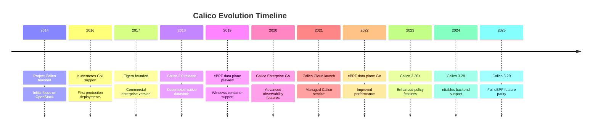
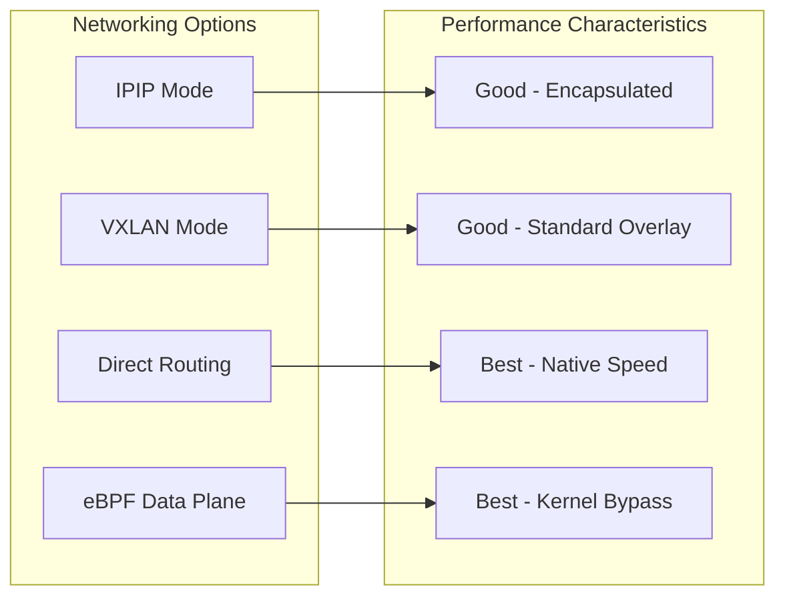
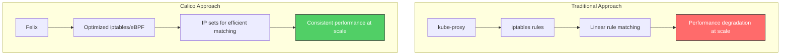
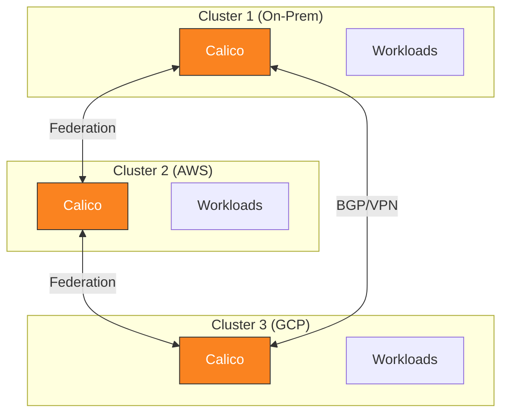

# Part 1: Introduction to Calico

> **Supported Versions**: Calico v3.29+ / Kubernetes 1.28+
> **Last Updated**: February 22, 2025

## Lab Environment Setup

To follow along with the examples in this document, you will need the following tools and environment.

### Required Tools

| Tool | Version | Purpose |
|------|---------|---------|
| kubectl | v1.28+ | Kubernetes cluster management |
| calicoctl | v3.29+ | Calico resource management |
| Helm | v3.12+ | Package management (optional) |
| kind/minikube | Latest | Local Kubernetes cluster |

### Installing calicoctl

```bash
# Download calicoctl binary
curl -L https://github.com/projectcalico/calico/releases/download/v3.29.0/calicoctl-linux-amd64 -o calicoctl
chmod +x calicoctl
sudo mv calicoctl /usr/local/bin/

# Verify installation
calicoctl version

# Configure datastore access (Kubernetes API)
export DATASTORE_TYPE=kubernetes
export KUBECONFIG=~/.kube/config
```

### Setting Up a Local Cluster with kind

```bash
# Create kind cluster configuration
cat <<EOF > kind-calico.yaml
kind: Cluster
apiVersion: kind.x-k8s.io/v1alpha4
networking:
  disableDefaultCNI: true
  podSubnet: 192.168.0.0/16
nodes:
- role: control-plane
- role: worker
- role: worker
EOF

# Create the cluster
kind create cluster --config kind-calico.yaml --name calico-lab

# Install Calico
kubectl create -f https://raw.githubusercontent.com/projectcalico/calico/v3.29.0/manifests/tigera-operator.yaml
kubectl create -f https://raw.githubusercontent.com/projectcalico/calico/v3.29.0/manifests/custom-resources.yaml

# Wait for Calico to be ready
kubectl wait --for=condition=Ready pods -l k8s-app=calico-node -n calico-system --timeout=300s
```

### Verifying the Installation

```bash
# Check all Calico components
kubectl get pods -n calico-system

# Expected output:
# NAME                                       READY   STATUS    RESTARTS   AGE
# calico-kube-controllers-xxxxxxxxx-xxxxx    1/1     Running   0          2m
# calico-node-xxxxx                          1/1     Running   0          2m
# calico-node-yyyyy                          1/1     Running   0          2m
# calico-typha-xxxxxxxxx-xxxxx               1/1     Running   0          2m
# csi-node-driver-xxxxx                      2/2     Running   0          2m

# Check node status
calicoctl node status

# Check IP pools
calicoctl get ippools -o wide
```

## What is Calico?

Calico is an open-source networking and network security solution designed for cloud-native workloads. It provides a highly scalable networking and network policy solution for Kubernetes, virtual machines, and bare metal workloads.

### Project History: From Project Calico to Tigera



| Year | Milestone | Significance |
|------|-----------|--------------|
| 2014 | Project Calico founded | Started as networking for OpenStack |
| 2016 | Kubernetes CNI support | Expanded to container orchestration |
| 2017 | Tigera founded | Commercial backing and enterprise features |
| 2018 | Calico 3.0 | Kubernetes-native datastore support |
| 2019 | Windows support | Enterprise adoption accelerated |
| 2020 | Calico Enterprise GA | Full enterprise feature set |
| 2021 | Calico Cloud | SaaS offering launched |
| 2022 | eBPF data plane GA | Modern data plane option |
| 2024 | nftables backend | Next-gen Linux firewall support |
| 2025 | Calico 3.29 | Full eBPF feature parity |

## Core Features

Calico provides five core capabilities that make it a leading choice for Kubernetes networking.

### 1. High-Performance Networking

Calico offers multiple networking modes optimized for different environments:



**Key Performance Features:**
- Native Linux networking stack integration
- Optional eBPF data plane for reduced overhead
- BGP-based routing for optimal path selection
- Minimal encapsulation overhead in direct routing mode

### 2. Network Policy Enforcement

Calico implements the Kubernetes NetworkPolicy API and extends it with powerful additional features:

```yaml
# Standard Kubernetes NetworkPolicy (supported by Calico)
apiVersion: networking.k8s.io/v1
kind: NetworkPolicy
metadata:
  name: default-deny-ingress
  namespace: production
spec:
  podSelector: {}
  policyTypes:
  - Ingress
---
# Calico-specific GlobalNetworkPolicy
apiVersion: projectcalico.org/v3
kind: GlobalNetworkPolicy
metadata:
  name: security-baseline
spec:
  selector: all()
  types:
  - Ingress
  - Egress
  ingress:
  - action: Allow
    source:
      selector: trusted == 'true'
  egress:
  - action: Allow
    destination:
      nets:
      - 10.0.0.0/8
```

**Policy Capabilities:**
- Label-based pod selection
- Namespace isolation
- CIDR-based rules
- Protocol and port filtering
- Global policies (cluster-wide)
- Ordered policy tiers (Enterprise)
- FQDN-based egress policies

### 3. Flexible IP Address Management (IPAM)

Calico's IPAM system efficiently allocates IP addresses across the cluster:

```yaml
apiVersion: projectcalico.org/v3
kind: IPPool
metadata:
  name: default-ipv4-pool
spec:
  cidr: 192.168.0.0/16
  blockSize: 26              # 64 IPs per block
  ipipMode: Always
  vxlanMode: Never
  natOutgoing: true
  nodeSelector: all()
```

**IPAM Features:**
- Block-based allocation (default: /26 blocks)
- Multiple IP pools for different workload types
- Node-specific IP pool assignment
- IPv4 and IPv6 dual-stack support
- Automatic IP reclamation

### 4. BGP-Based Routing

Calico's native BGP support enables seamless integration with existing network infrastructure:

```yaml
apiVersion: projectcalico.org/v3
kind: BGPConfiguration
metadata:
  name: default
spec:
  logSeverityScreen: Info
  nodeToNodeMeshEnabled: true
  asNumber: 64512
---
apiVersion: projectcalico.org/v3
kind: BGPPeer
metadata:
  name: rack-tor-switch
spec:
  peerIP: 10.0.0.1
  asNumber: 64513
  nodeSelector: rack == 'rack-1'
```

**BGP Capabilities:**
- Full mesh between nodes (auto-configured)
- Peering with external routers (ToR switches, firewalls)
- Route reflector support for large clusters
- AS path prepending and communities
- Graceful restart support

### 5. Cross-Platform Support

Calico runs consistently across diverse environments:

| Platform | Support Level | Notes |
|----------|---------------|-------|
| AWS EKS | Full | Native VPC integration available |
| Azure AKS | Full | Azure CNI + Calico policy option |
| Google GKE | Full | Dataplane V2 based on Calico |
| On-Premises | Full | BGP integration with physical network |
| OpenStack | Full | Original platform support |
| Windows | Full | Windows Server 2019/2022 |
| Bare Metal | Full | Direct routing recommended |

## Calico vs Traditional Networking

### Traditional Kubernetes Networking Challenges



### Comparison Table

| Aspect | Traditional (kube-proxy) | Calico |
|--------|-------------------------|--------|
| **Rule Organization** | Linear iptables chains | IP sets + optimized chains |
| **Scale Impact** | O(n) rule traversal | O(1) IP set lookups |
| **Policy Support** | None (requires separate CNI) | Native, extended features |
| **Routing** | Service-level only | Full L3 routing |
| **Visibility** | Limited | Flow logs, metrics |
| **BGP** | Not supported | Native support |
| **Data Plane Options** | iptables only | iptables, nftables, eBPF |

### Performance at Scale

```
Cluster Size: 1000 nodes, 50,000 pods

Traditional iptables (kube-proxy):
- Rules: ~150,000 iptables rules
- Latency: 2-5ms added per connection
- Memory: ~500MB per node

Calico (optimized):
- Rules: ~5,000 rules + IP sets
- Latency: <0.5ms added per connection
- Memory: ~150MB per node
```

## Use Cases

### 1. On-Premises Data Center

Calico excels in on-premises deployments where BGP integration with existing network infrastructure is required:

```yaml
# BGP peering with data center ToR switches
apiVersion: projectcalico.org/v3
kind: BGPPeer
metadata:
  name: datacenter-tor
spec:
  peerIP: 10.1.0.1
  asNumber: 65001
  password:
    secretKeyRef:
      name: bgp-secrets
      key: tor-password
```

**Benefits:**
- No overlay overhead
- Direct integration with existing routing
- Hardware load balancer compatibility
- Consistent security policies across VMs and containers

### 2. Cloud Deployments (AWS, GCP, Azure)

Calico provides enhanced security and policy features on top of cloud provider networking:

```yaml
# EKS deployment with VXLAN
apiVersion: operator.tigera.io/v1
kind: Installation
metadata:
  name: default
spec:
  kubernetesProvider: EKS
  cni:
    type: Calico
  calicoNetwork:
    bgp: Disabled
    ipPools:
    - cidr: 10.244.0.0/16
      encapsulation: VXLAN
```

**Benefits:**
- Works within cloud VPC constraints
- Enhanced network policies beyond cloud-native options
- Consistent policy model across multi-cloud
- Integration with cloud security groups

### 3. Hybrid and Multi-Cluster

Calico Federation enables policy and routing across multiple clusters:



**Benefits:**
- Unified policy management across clusters
- Cross-cluster service discovery
- Consistent security posture
- Gradual migration support

### 4. Compliance-Focused Environments

Calico Enterprise provides advanced features for regulated industries:

- **Audit Logging**: Complete record of policy changes and enforcement
- **Compliance Reports**: Pre-built reports for PCI-DSS, SOC 2, HIPAA
- **Encryption**: WireGuard-based node-to-node encryption
- **Threat Defense**: DDoS protection and anomaly detection

## Project Governance and Community

### Open Source Governance

Calico is an open-source project hosted under the Cloud Native Computing Foundation (CNCF) ecosystem:

- **License**: Apache 2.0
- **Governance**: Open community with Tigera as primary maintainer
- **Contribution**: Open to community contributions via GitHub
- **Releases**: Regular release cadence (approximately quarterly)

### Community Resources

| Resource | URL |
|----------|-----|
| GitHub | https://github.com/projectcalico/calico |
| Documentation | https://docs.tigera.io/calico/latest/ |
| Slack | https://calicousers.slack.com |
| Community Meetings | Bi-weekly, open to all |
| Stack Overflow | Tag: `project-calico` |

### Getting Help

```bash
# Join the Calico Slack community
# Visit: https://slack.projectcalico.org

# File issues on GitHub
# https://github.com/projectcalico/calico/issues

# Check the FAQ
# https://docs.tigera.io/calico/latest/reference/faq
```

## Summary

Calico provides a mature, battle-tested networking solution for Kubernetes with:

1. **Proven Stability**: Used in production by thousands of organizations
2. **Flexible Architecture**: Multiple data plane options (iptables, nftables, eBPF)
3. **Comprehensive Policies**: Kubernetes NetworkPolicy plus extended Calico policies
4. **Native BGP**: First-class support for on-premises and hybrid deployments
5. **Cross-Platform**: Consistent experience across cloud, on-prem, and hybrid

In the next section, we will dive deep into Calico's architecture to understand how these components work together.

[Next: Part 2 - Calico Architecture Deep Dive](02-architecture.md)

[Return to Calico Overview](README.md)

## Quiz

To test what you've learned in this chapter, try the [Introduction Quiz](../../quizzes/networking/calico/01-introduction-quiz.md).
