# Part 2: Architecture

> **Supported Versions**: Calico v3.29+ / Kubernetes 1.28+ **Last Updated**: February 23, 2026

## Overview

This section provides an in-depth exploration of Calico's architecture. Understanding how each component works and interacts is essential for effective deployment, troubleshooting, and optimization of Calico in production environments.

## Full Architecture Diagram

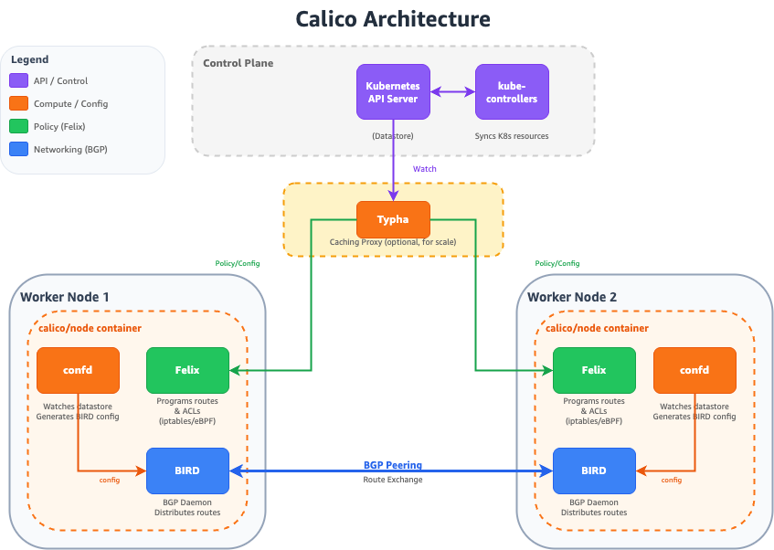

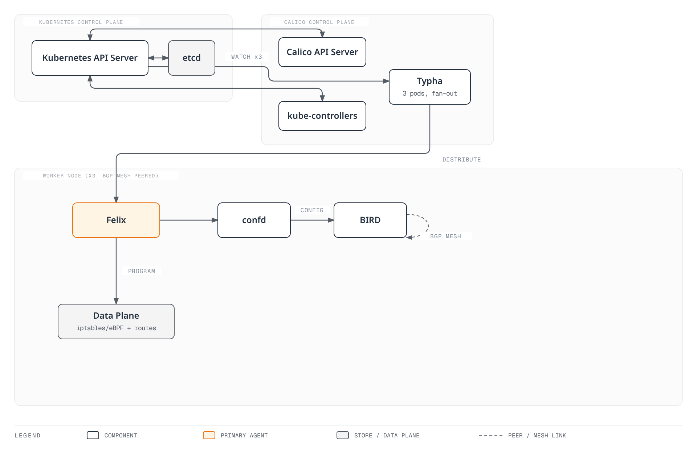

## Felix: The Calico Agent

Felix is the primary Calico agent that runs on every node in the cluster. It is responsible for programming routes and ACLs (Access Control Lists) on the host to provide desired connectivity and network policy enforcement.

### Felix Responsibilities

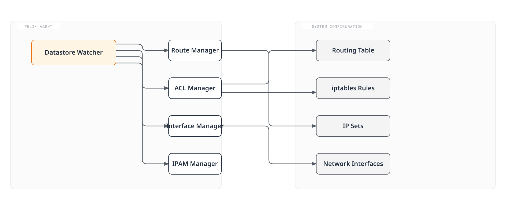

### Core Functions

1. **Route Programming**: Manages routes for pod CIDR blocks
2. **ACL Enforcement**: Programs iptables/nftables/eBPF rules for network policies
3. **Interface Management**: Configures workload endpoint interfaces
4. **Health Reporting**: Reports node and endpoint health to the datastore
5. **IPAM Coordination**: Manages IP address allocation for local workloads

### Felix Data Plane Options

Felix supports multiple data plane backends:

| Data Plane   | Description                | Best For                                    |
| ------------ | -------------------------- | ------------------------------------------- |
| **iptables** | Traditional Linux firewall | Compatibility, mature deployments           |
| **nftables** | Modern Linux firewall      | Newer kernels, better performance           |
| **eBPF**     | In-kernel programmable     | Maximum performance, kube-proxy replacement |

### FelixConfiguration Resource

```yaml
apiVersion: projectcalico.org/v3
kind: FelixConfiguration
metadata:
  name: default
spec:
  # Logging configuration
  logSeverityScreen: Info
  logSeverityFile: Warning
  logFilePath: /var/log/calico/felix.log

  # Data plane selection
  bpfEnabled: false                    # Set true for eBPF data plane
  bpfDataIfacePattern: ^((en|wl|eth).*|bond[0-9]+)$
  bpfConnectTimeLoadBalancingEnabled: true
  bpfExternalServiceMode: Tunnel

  # iptables configuration
  iptablesBackend: Auto               # Auto, Legacy, NFT
  iptablesRefreshInterval: 90s
  iptablesPostWriteCheckIntervalSecs: 1
  iptablesLockFilePath: /run/xtables.lock
  iptablesLockTimeoutSecs: 0
  iptablesLockProbeIntervalMillis: 50

  # Performance tuning
  ipipMTU: 1440
  vxlanMTU: 1410
  wireguardMTU: 1420

  # Health and metrics
  healthEnabled: true
  healthPort: 9099
  prometheusMetricsEnabled: true
  prometheusMetricsPort: 9091
  prometheusGoMetricsEnabled: true
  prometheusProcessMetricsEnabled: true

  # Policy configuration
  defaultEndpointToHostAction: Drop
  failsafeInboundHostPorts:
    - protocol: TCP
      port: 22
    - protocol: UDP
      port: 68
  failsafeOutboundHostPorts:
    - protocol: UDP
      port: 53
    - protocol: UDP
      port: 67

  # Interface configuration
  interfacePrefix: cali
  chainInsertMode: Insert

  # Reporting
  reportingIntervalSecs: 30
  reportingTTLSecs: 90
```

### Felix iptables Rule Structure

Felix organizes iptables rules into chains for efficient processing:

```
                         ┌─────────────────────────────────────────┐
                         │              FORWARD Chain              │
                         └─────────────────┬───────────────────────┘
                                           │
                         ┌─────────────────▼───────────────────────┐
                         │          cali-FORWARD (Calico)          │
                         └─────────────────┬───────────────────────┘
                                           │
              ┌────────────────────────────┼────────────────────────────┐
              │                            │                            │
┌─────────────▼─────────────┐ ┌────────────▼────────────┐ ┌─────────────▼─────────────┐
│   cali-from-wl-dispatch   │ │   cali-to-wl-dispatch   │ │    cali-from-host-ep     │
│  (from workload traffic)  │ │  (to workload traffic)  │ │   (from host endpoints)   │
└─────────────┬─────────────┘ └────────────┬────────────┘ └─────────────┬─────────────┘
              │                            │                            │
┌─────────────▼─────────────┐ ┌────────────▼────────────┐ ┌─────────────▼─────────────┐
│    cali-fw-caliXXXXXX     │ │    cali-tw-caliXXXXXX   │ │    Per-endpoint policy    │
│    (per-endpoint rules)   │ │   (per-endpoint rules)  │ │          chains           │
└───────────────────────────┘ └─────────────────────────┘ └───────────────────────────┘
```

### Felix Data Flow

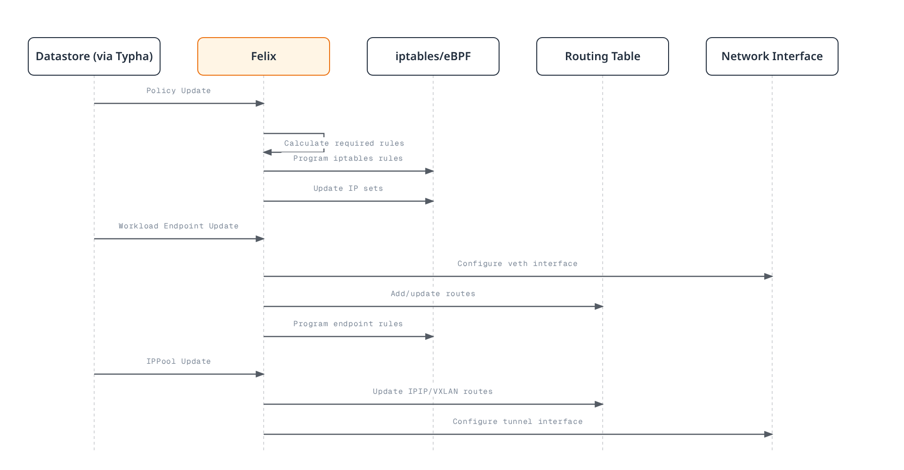

## BIRD: BGP Routing Daemon

BIRD (BIRD Internet Routing Daemon) is the BGP daemon used by Calico for distributing routes between nodes.

### BIRD in Calico Architecture

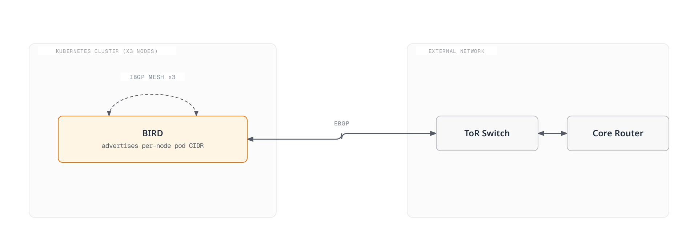

### BGP Session Types

| Session Type          | Use Case                    | Configuration          |
| --------------------- | --------------------------- | ---------------------- |
| **Node-to-Node Mesh** | Default for small clusters  | Automatic, full mesh   |
| **Route Reflector**   | Large clusters (100+ nodes) | Dedicated RR nodes     |
| **External Peering**  | On-premises integration     | Manual BGP peer config |

### BGP Configuration Examples

#### Node-to-Node Mesh (Default)

```yaml
apiVersion: projectcalico.org/v3
kind: BGPConfiguration
metadata:
  name: default
spec:
  logSeverityScreen: Info
  nodeToNodeMeshEnabled: true
  asNumber: 64512
```

#### Route Reflector Configuration

```yaml
# Disable node-to-node mesh
apiVersion: projectcalico.org/v3
kind: BGPConfiguration
metadata:
  name: default
spec:
  nodeToNodeMeshEnabled: false
  asNumber: 64512
---
# Configure route reflector nodes
apiVersion: projectcalico.org/v3
kind: Node
metadata:
  name: node-rr-1
  labels:
    route-reflector: "true"
spec:
  bgp:
    routeReflectorClusterID: 224.0.0.1
---
# Configure BGP peer to route reflector
apiVersion: projectcalico.org/v3
kind: BGPPeer
metadata:
  name: peer-to-rr
spec:
  nodeSelector: "!has(route-reflector)"
  peerSelector: route-reflector == "true"
```

#### External BGP Peering

```yaml
apiVersion: projectcalico.org/v3
kind: BGPPeer
metadata:
  name: tor-switch-peer
spec:
  peerIP: 10.0.0.1
  asNumber: 65001
  nodeSelector: rack == 'rack-1'
  password:
    secretKeyRef:
      name: bgp-passwords
      key: tor-password
  sourceAddress: UseNodeIP
  keepOriginalNextHop: false
```

### Route Propagation Process

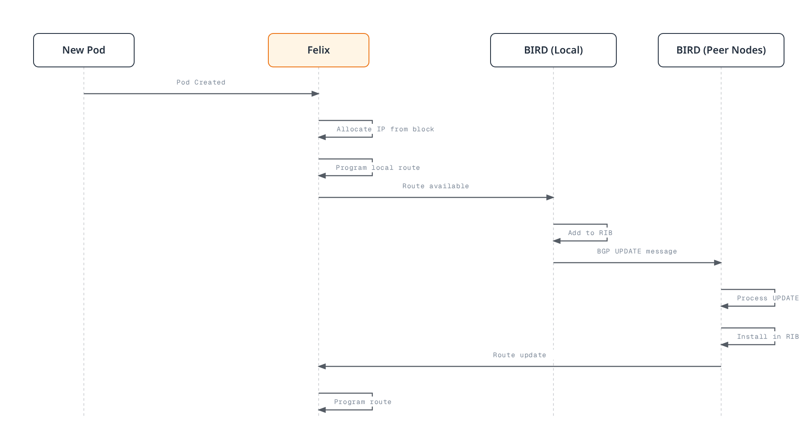

### BIRD Status Commands

```bash
# Access BIRD CLI on a Calico node
kubectl exec -n calico-system calico-node-xxxxx -c calico-node -- birdcl

# Show BGP protocol status
birdcl> show protocols
name     proto    table    state  since       info
kernel1  Kernel   master   up     2024-01-01
device1  Device   master   up     2024-01-01
direct1  Direct   master   up     2024-01-01
Mesh_10_0_1_10  BGP  master  up   2024-01-01  Established
Mesh_10_0_1_11  BGP  master  up   2024-01-01  Established

# Show BGP routes
birdcl> show route protocol Mesh_10_0_1_10
192.168.1.0/26     via 10.0.1.10 on eth0 [Mesh_10_0_1_10 2024-01-01] * (100/0) [i]
192.168.1.64/26    via 10.0.1.10 on eth0 [Mesh_10_0_1_10 2024-01-01] * (100/0) [i]

# Show route details
birdcl> show route 192.168.1.0/26 all
```

## confd: Configuration Management

confd is a lightweight configuration management tool that watches the Calico datastore and generates BIRD configuration files.

### confd Workflow

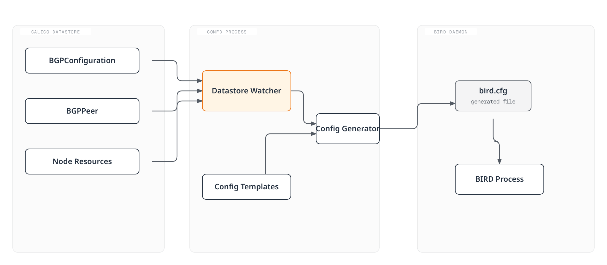

### confd Template Processing

confd uses Go templates to generate BIRD configuration:

```
# Template: /etc/calico/confd/templates/bird.cfg.template
# Output: /etc/calico/confd/config/bird.cfg

router id {{.NodeIP}};

protocol kernel {
    learn;
    persist;
    scan time 2;
    import all;
    export {{if .ExportKernel}}all{{else}}none{{end}};
}

protocol device {
    scan time 2;
}

{{range .BGPPeers}}
protocol bgp {{.Name}} {
    local as {{$.LocalAS}};
    neighbor {{.PeerIP}} as {{.PeerAS}};
    import all;
    export {{if .ExportFilter}}filter {{.ExportFilter}}{{else}}all{{end}};
    {{if .Password}}password "{{.Password}}";{{end}}
    graceful restart;
}
{{end}}
```

## Typha: Scaling Component

Typha is a fan-out proxy that sits between the Kubernetes API server and Felix agents. It reduces load on the API server by caching and distributing datastore updates.

### Why Typha?

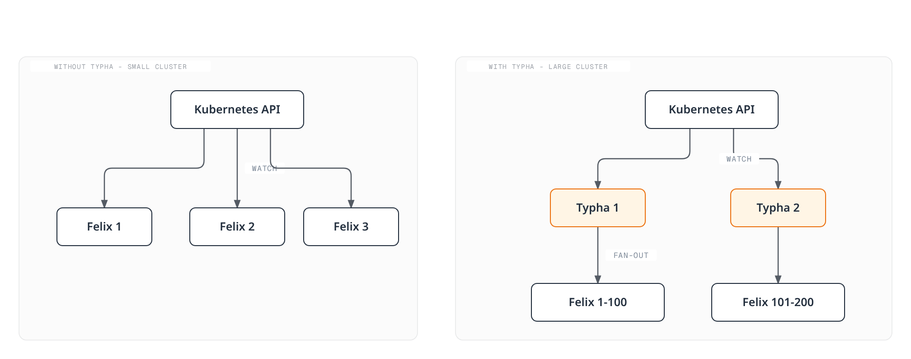

### Typha Scaling Calculation

The recommended number of Typha replicas depends on cluster size:

```
Typha Replicas = max(3, ceil(Nodes / 200))

Examples:
- 50 nodes:   3 Typha replicas (minimum)
- 200 nodes:  3 Typha replicas
- 500 nodes:  3 Typha replicas
- 1000 nodes: 5 Typha replicas
- 2000 nodes: 10 Typha replicas
```

### Typha Deployment Configuration

```yaml
apiVersion: apps/v1
kind: Deployment
metadata:
  name: calico-typha
  namespace: calico-system
spec:
  replicas: 3
  revisionHistoryLimit: 2
  selector:
    matchLabels:
      k8s-app: calico-typha
  strategy:
    type: RollingUpdate
    rollingUpdate:
      maxSurge: 1
      maxUnavailable: 1
  template:
    metadata:
      labels:
        k8s-app: calico-typha
    spec:
      nodeSelector:
        kubernetes.io/os: linux
      tolerations:
      - key: CriticalAddonsOnly
        operator: Exists
      priorityClassName: system-cluster-critical
      serviceAccountName: calico-typha
      containers:
      - name: calico-typha
        image: calico/typha:v3.29.0
        ports:
        - containerPort: 5473
          name: calico-typha
          protocol: TCP
        env:
        - name: TYPHA_LOGSEVERITYSCREEN
          value: "info"
        - name: TYPHA_LOGFILEPATH
          value: "none"
        - name: TYPHA_LOGSEVERITYSYS
          value: "none"
        - name: TYPHA_CONNECTIONREBALANCINGMODE
          value: "kubernetes"
        - name: TYPHA_DATASTORETYPE
          value: "kubernetes"
        - name: TYPHA_HEALTHENABLED
          value: "true"
        - name: TYPHA_PROMETHEUSMETRICSENABLED
          value: "true"
        - name: TYPHA_PROMETHEUSMETRICSPORT
          value: "9093"
        livenessProbe:
          httpGet:
            path: /liveness
            port: 9098
          periodSeconds: 30
          initialDelaySeconds: 30
        readinessProbe:
          httpGet:
            path: /readiness
            port: 9098
          periodSeconds: 10
        resources:
          requests:
            cpu: 100m
            memory: 128Mi
          limits:
            cpu: 1000m
            memory: 512Mi
---
apiVersion: v1
kind: Service
metadata:
  name: calico-typha
  namespace: calico-system
spec:
  ports:
  - port: 5473
    protocol: TCP
    targetPort: calico-typha
    name: calico-typha
  selector:
    k8s-app: calico-typha
```

### Typha Fan-out Architecture

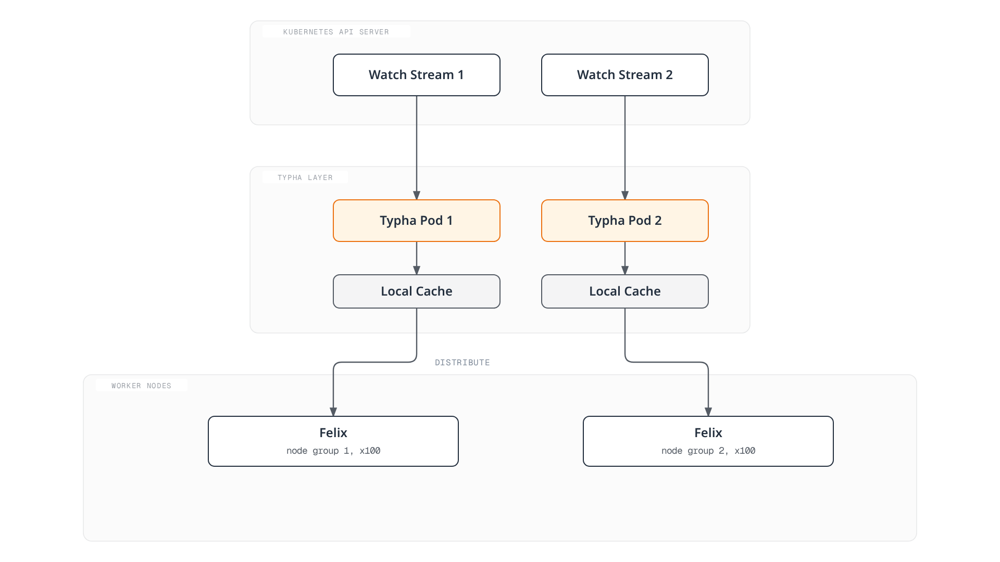

## kube-controllers: Kubernetes Integration

The calico-kube-controllers pod runs a set of controllers that sync Kubernetes resources with Calico datastore.

### Controllers Overview

| Controller                      | Purpose                                           |
| ------------------------------- | ------------------------------------------------- |
| **Node Controller**             | Syncs Kubernetes nodes with Calico node resources |
| **Policy Controller**           | Syncs Kubernetes NetworkPolicy with Calico policy |
| **Namespace Controller**        | Syncs namespace labels for profile management     |
| **ServiceAccount Controller**   | Syncs service account labels for RBAC             |
| **WorkloadEndpoint Controller** | Cleans up stale workload endpoints                |

### Controller Reconciliation Loop


### kube-controllers Configuration

```yaml
apiVersion: v1
kind: ConfigMap
metadata:
  name: calico-kube-controllers-config
  namespace: calico-system
data:
  config: |
    {
      "logSeverityScreen": "info",
      "healthEnabled": true,
      "prometheusPort": 9094,
      "controllers": {
        "node": {
          "hostEndpoint": {
            "autoCreate": "Disabled"
          },
          "syncLabels": "Enabled",
          "leakGracePeriod": "15m"
        },
        "policy": {
          "reconcilerPeriod": "5m"
        },
        "workloadEndpoint": {
          "reconcilerPeriod": "5m"
        },
        "namespace": {
          "reconcilerPeriod": "5m"
        },
        "serviceAccount": {
          "reconcilerPeriod": "5m"
        }
      }
    }
```

## Datastore Options

Calico supports two datastore backends for storing its configuration and state.

### Kubernetes API Datastore (Recommended)

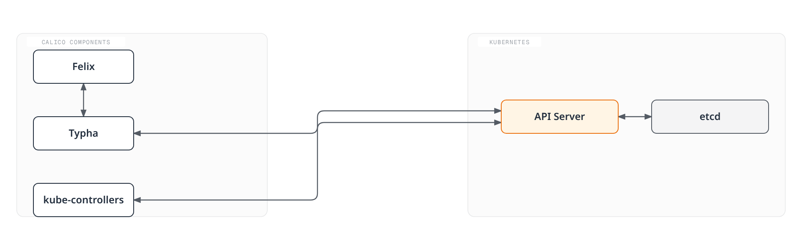

**Advantages:**

* No separate etcd cluster to manage
* Uses Kubernetes RBAC for access control
* Simpler operational model
* Works with any Kubernetes distribution

### etcd Datastore (Legacy)

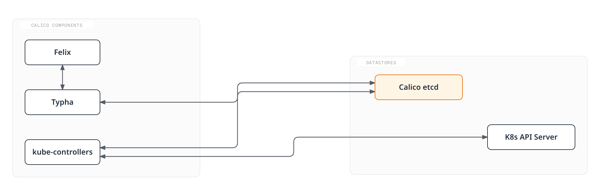

**Advantages:**

* Decoupled from Kubernetes API server
* Can be used for non-Kubernetes workloads (VMs, bare metal)
* Historical option for very large clusters

### Datastore Comparison

| Feature                    | Kubernetes API    | etcd               |
| -------------------------- | ----------------- | ------------------ |
| **Operational Complexity** | Lower             | Higher             |
| **Scalability**            | Good (with Typha) | Excellent          |
| **Non-K8s Workloads**      | Limited           | Full support       |
| **Backup/Restore**         | Via K8s           | Separate tooling   |
| **Access Control**         | K8s RBAC          | etcd auth          |
| **Recommendation**         | Default choice    | Special cases only |

## Component Interaction Sequence

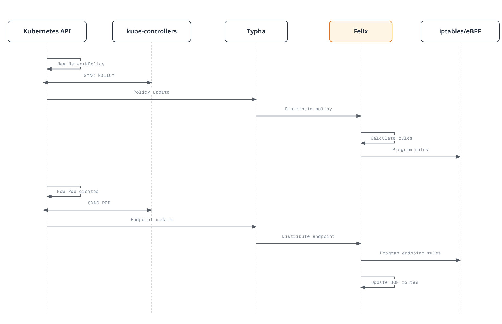

## Packet Flow Analysis

### Ingress Packet Flow (Pod-to-Pod, Same Node)

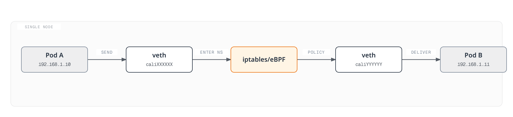

### Egress Packet Flow (Pod-to-Pod, Different Nodes with IPIP)

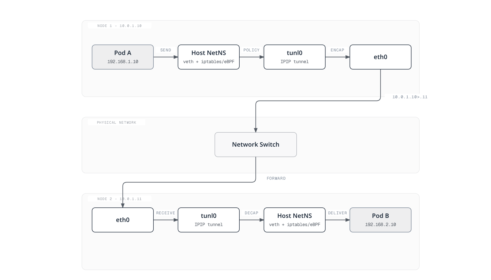

### Packet Structure Comparison

```
Original Pod-to-Pod Packet:
┌─────────────────────────────────────────────────────────────┐
│ Ethernet │   IP Header    │   TCP/UDP   │     Payload      │
│  Header  │ Src: 192.168.1.10 │   Header    │                  │
│          │ Dst: 192.168.2.10 │             │                  │
└─────────────────────────────────────────────────────────────┘

IPIP Encapsulated Packet:
┌───────────────────────────────────────────────────────────────────────────────┐
│ Ethernet │   Outer IP     │   Inner IP     │   TCP/UDP   │     Payload      │
│  Header  │ Src: 10.0.1.10 │ Src: 192.168.1.10 │   Header    │                  │
│          │ Dst: 10.0.1.11 │ Dst: 192.168.2.10 │             │                  │
│          │ Proto: 4 (IPIP)│                │             │                  │
└───────────────────────────────────────────────────────────────────────────────┘
```

## Summary

Calico's architecture is designed for scalability, performance, and operational simplicity:

1. **Felix**: The workhorse agent on every node, programming routes and ACLs
2. **BIRD**: Distributes routes via BGP, enabling native routing integration
3. **confd**: Bridges the datastore to BIRD configuration
4. **Typha**: Scales the system by reducing API server load
5. **kube-controllers**: Keeps Kubernetes and Calico in sync
6. **Datastore**: Kubernetes API (recommended) or etcd for configuration storage

Understanding these components and their interactions is essential for:

* Troubleshooting connectivity issues
* Optimizing performance at scale
* Planning capacity and architecture
* Integrating with existing network infrastructure

[Previous: Part 1 - Introduction to Calico](01-introduction.md)

[Next: Part 3 - Networking Modes](03-networking-modes.md)

[Return to Calico Overview](./README.md)

## Quiz

To test what you've learned in this chapter, try the [Architecture Quiz](../../quizzes/networking/calico/02-architecture-quiz.md).
