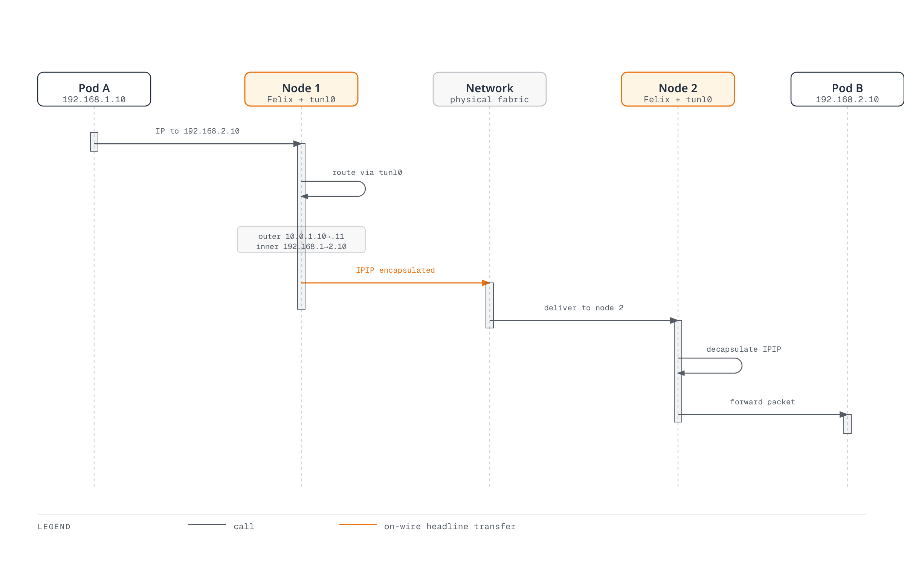
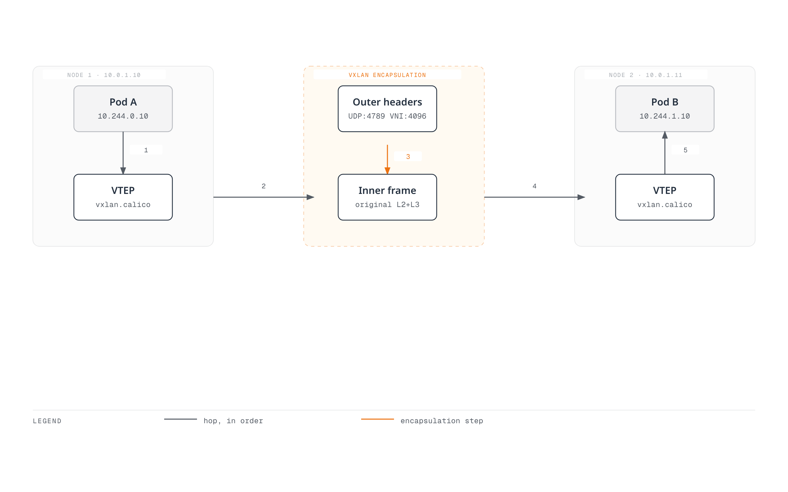
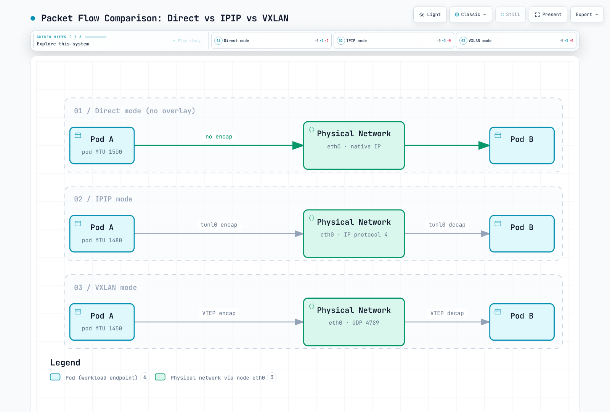
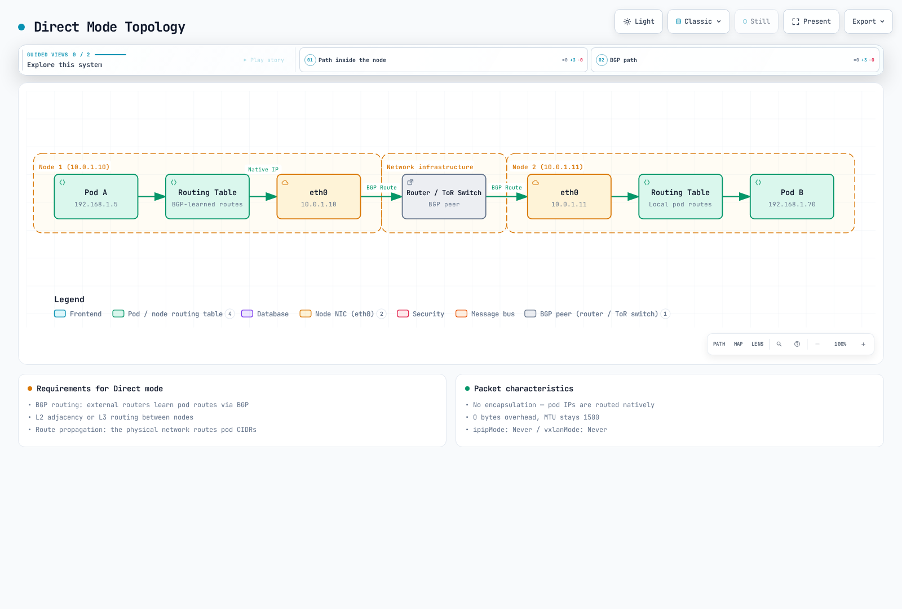

# Part 3: Networking Modes

> **Review baseline**: Calico Open Source 3.32.2 / operator 1.42.6; Kubernetes 1.34–1.36 is Calico 3.32's tested range.
> **Reviewed**: September 12, 2026. Historical benchmark values below are retained as unverified reports, not new measurements.

## Scope and mode selection

This chapter concerns Calico-owned Linux Pod networking and IPAM. In EKS policy-only mode, Amazon VPC CNI still owns Pod networking; creating Calico IPPools does not switch that installation to an overlay. The examples are alternative designs, not manifests to apply together or over the already-created pool in the introductory lab. The audit performed no cluster migration or network benchmark.

| Choice | Meaning | Important boundary |
|---|---|---|
| IPIP | IPv4-in-IPv4, IP protocol 4 | Calico IPIP is IPv4-only; underlay must permit it |
| VXLAN | Inner Ethernet carried in UDP, Calico default port 4789 | Outer IPv4 and IPv6 have different overhead; port/VNI are configurable |
| Direct / unencapsulated | Pod IP packets routed without a Pod-network overlay | Underlay and return paths must route Pod addresses |
| CrossSubnet | A setting of IPIP or VXLAN | Encapsulate inter-node traffic only when the relevant node addresses lie in different configured subnets |

`Always` concerns eligible inter-node traffic to addresses in the configured pool; same-node traffic does not need a physical tunnel. `Never` disables that encapsulation, not all networking. CrossSubnet is not an AZ, Region or WAN-link detector: two subnets in one AZ can still require encapsulation. Inspect the node address and subnet mask used by Calico.

Defaults depend on installation/provider and data plane. There is no universal “IPIP is the default for all clouds” rule or guarantee that Direct is always fastest. The [overlay guide](https://docs.tigera.io/calico/latest/networking/configuring/vxlan-ipip) describes the supported routing paths.

### Routing and encapsulation are separate choices

By default, Felix programs routes for VXLAN pools, while confd/BIRD program cluster routes for IPIP and unencapsulated pools. Calico 3.32 also supports `Installation.spec.calicoNetwork.clusterRoutingMode: Felix` for those non-VXLAN routes. The corresponding lower-level settings are Felix `programClusterRoutes: Enabled` and BGP `programClusterRoutes: Disabled`; use the operator setting when it owns the installation. External BGP advertisements still require BGP. Static routes or a suitable routed fabric can also provide underlay reachability, so BGP and same-L2 adjacency are not universal requirements for every unencapsulated design.

## Packet structure and overhead

The following uses an **underlay IP MTU**. The outer Ethernet header is outside that IP MTU. Assume no IPv4 options or extra inner VLAN tags; TCP options and other encapsulations can reduce payload further.

```text
Direct: outer Ethernet | Pod IP | TCP or UDP | payload
IPIP:   outer Ethernet | outer IPv4 | Pod IPv4 | TCP or UDP | payload
VXLAN:  outer Ethernet | outer IP | UDP | VXLAN | inner Ethernet | Pod IP | TCP or UDP | payload
```

| Transport | Overhead above the Pod IP packet | Pod IP MTU when underlay IP MTU is 1500 |
|---|---|---|
| Direct, no other tunnel | 0 | 1500 |
| IPIP, outer IPv4 | 20 | 1480 |
| VXLAN, outer IPv4 | 20 + 8 + 8 + 14 = 50 | 1450 |
| VXLAN, outer IPv6 | 40 + 8 + 8 + 14 = 70 | 1430 |
| WireGuard, outer IPv4 | 60 | 1440 |
| WireGuard, outer IPv6 | 80 | 1420 |

For VXLAN, the 14 bytes in the MTU overhead are the **inner Ethernet header**, not the outer Ethernet header. Plain TCP has a minimum 20-byte header; UDP has an 8-byte header. Thus a 1500-byte IPv4 IP packet can contain up to 1460 bytes of TCP payload or 1472 bytes of UDP payload under these assumptions. The original shared “TCP/UDP = 20 bytes” label was incorrect.

IPIP's protocol number is 4, not TCP/UDP port 4. Calico's usual VXLAN VNI is 4096 and its default UDP port is 4789, but both can be configured. Other current VXLAN implementations may use 8472; that is not limited to obsolete software. See [IP-in-IP](https://www.rfc-editor.org/rfc/rfc2003) and [VXLAN](https://www.rfc-editor.org/rfc/rfc7348).

### Illustrated packet paths



[🔍 View interactive diagram](https://www.atomai.click/kubernetes-docs/archmaps/en-networking-calico-03-networking-modes-2.html)

The “Felix” columns represent kernel routing/policy programmed by Felix; packets do not traverse the Felix daemon. This is the IPv4 inter-node path, not same-node traffic or an encryption mechanism.



[🔍 View interactive diagram](https://www.atomai.click/kubernetes-docs/archmaps/en-networking-calico-03-networking-modes-3.html)

4789 and VNI 4096 are the illustrated defaults. The 50-byte overhead and 1450 MTU apply to an outer-IPv4 1500-byte path with the stated header assumptions, not every network or address family.

### CrossSubnet example

With node addresses 10.0.1.10/24 and 10.0.1.11/24, the same-subnet path can be unencapsulated. A peer at 10.0.2.20/24 needs encapsulation in the CrossSubnet design. Incorrect node masks can therefore change the result even when the cloud subnet names look right. CrossSubnet does not establish inter-VPC/Region connectivity or provide encryption.


[🔍 View interactive diagram](https://www.atomai.click/kubernetes-docs/archmaps/en-networking-calico-03-networking-modes-1.html)

The subnet addresses/masks drive this choice. The figure's 1500/1480 values assume an IPv4 1500-byte underlay; workloads should still use the minimum MTU across their possible paths. Their interface MTU does not increase dynamically for a same-subnet flow.

### Node diagnostics

Run these read-only commands in an authorized **Linux node network namespace**, not an ordinary application Pod. Interfaces are present only for the enabled mode. The values shown by the commands depend on the actual installation.

```bash
ip link show tunl0
ip link show vxlan.calico
bridge fdb show dev vxlan.calico
ip route show
```

A typical local Pod route is a host route such as `10.244.1.5/32 dev cali…`; do not route an entire /24 or /26 into one Pod's veth. An aggregate block may instead have a blackhole route plus more-specific Pod routes. Remote blocks can use a tunnel or next-hop node/router, and the route protocol label depends on BIRD versus Felix programming.



[🔍 View interactive diagram](https://www.atomai.click/kubernetes-docs/archmaps/en-networking-calico-03-networking-modes-5.html)

These are IPv4 1500-byte-underlay examples. The diagram compares packet wrappers, not measured speed or identical control-plane behavior. Other encapsulations and Service paths must be included when selecting the workload MTU.

## Configure a pool through its owner

The `kubectl …projectcalico.org` examples assume the aggregated Calico API used in the introduction (or the appropriate native-v3 setup). Without it, use a matching calicoctl for logical Calico resources. Operator commands apply only to operator installations. Pool ranges must also avoid conflicting Service and node/underlay ranges.

Use one configuration owner. Pools listed in `Installation.spec.calicoNetwork.ipPools` are reconciled by the operator; edit that desired list through its owner rather than applying competing IPPool objects. Standalone pools use the Calico IPPool API. In both cases, verify the actual cluster Pod CIDR, non-overlap, IPAM type and existing allocations first.

```bash
kubectl get installation.operator.tigera.io default -o yaml
kubectl get ippools.projectcalico.org -o yaml
calicoctl ipam show --show-blocks
```

For an operator-owned pool, this is an **entry fragment** for the existing `ipPools` list. Preserve other entries and Installation fields. Do not create it over the introductory lab's already-allocated /16 pool:

```yaml
- name: mode-demo-pool
  cidr: 10.244.0.0/16
  blockSize: 26
  encapsulation: VXLAN
  natOutgoing: Enabled
  nodeSelector: all()
```

For a standalone, newly planned pool, the equivalent IPv4 resource is below. This is an alternative to the operator entry, not an additional overlapping pool. The CIDR is an example that must fit the real cluster and not collide with any existing pool.

```yaml
apiVersion: projectcalico.org/v3
kind: IPPool
metadata:
  name: mode-demo-pool
spec:
  cidr: 10.244.0.0/16
  blockSize: 26
  ipipMode: Never
  vxlanMode: Always
  natOutgoing: true
  nodeSelector: all()
```

Select one row, not multiple resources with the same CIDR:

| IPv4 design | IPPool `ipipMode` | IPPool `vxlanMode` | Operator `encapsulation` |
|---|---|---|---|
| IPIP Always | Always | Never | IPIP |
| IPIP CrossSubnet | CrossSubnet | Never | IPIPCrossSubnet |
| VXLAN Always | Never | Always | VXLAN |
| VXLAN CrossSubnet | Never | CrossSubnet | VXLANCrossSubnet |
| Direct | Never | Never | None |

IPIP and VXLAN cannot both be enabled in one pool. `encapsulation` is an operator pool field; it is not the standalone IPPool field name. In the normal aggregated-API installation, overlapping pool creation is rejected. With native v3 CRDs (tech preview), overlap validation is asynchronous and a created pool can receive a Disabled condition; creation success is not proof of usable allocation.

Calico 3.32's Installation schema permits a pool list (up to 25 entries), with controller validation and platform constraints. Older examples claiming exactly one IPv4 pool should not be used as a universal current limit.

### Direct routing with external BGP

If the design uses external BGP, configure the real peers and return routes before removing an overlay. A peer declaration alone does not configure the physical router or prove route acceptance. This separate topology example is not an addition to a BGP-disabled VXLAN lab:

```yaml
apiVersion: projectcalico.org/v3
kind: BGPPeer
metadata:
  name: example-rack-tor
spec:
  peerIP: 192.0.2.1
  asNumber: 65001
  nodeSelector: rack == 'rack1'
```

Replace the documentation address and AS number, label the intended nodes and validate route filters/AS-loop handling for each rack. `natOutgoing: false` is appropriate only when return routing and any required external NAT are designed; BGP does not make private Pod addresses internet-routable by itself. Use the [BGP transition guidance](02-architecture.md) and [BGP deep dive](04-bgp-deep-dive.md) for mesh/RR changes.



[🔍 View interactive diagram](https://www.atomai.click/kubernetes-docs/archmaps/en-networking-calico-03-networking-modes-4.html)

This illustrates a BGP-based design, not a requirement that every Direct design use BGP. The 1500 value assumes that usable path MTU and no other tunnel; eBPF Service handoff or encryption can impose a lower workload MTU.

## NAT and pool selection

With `natOutgoing: true`, the usual Calico behavior is SNAT for source addresses in that pool when the destination is outside **all Calico IPPools**. It is not simply a “leaving the cluster” test. Even a disabled pool can identify a no-NAT destination range; removing it can change NAT behavior. Additional Felix settings can also exclude host IPs. NAT does not grant NetworkPolicy permission. See [outgoing NAT](https://docs.tigera.io/calico/latest/networking/configuring/workloads-outside-cluster).

### Topology-based automatic allocation

This is a separate planning example with two disjoint /18 pools inside a /16 cluster range. It must not coexist with an allocated parent /16 pool. Do not delete an in-use parent pool just to make the example fit.

```yaml
apiVersion: projectcalico.org/v3
kind: IPPool
metadata:
  name: zone-a-pool
spec:
  cidr: 10.244.0.0/18
  ipipMode: Never
  vxlanMode: CrossSubnet
  natOutgoing: true
  nodeSelector: topology.kubernetes.io/zone == 'ap-northeast-2a'
---
apiVersion: projectcalico.org/v3
kind: IPPool
metadata:
  name: zone-b-pool
spec:
  cidr: 10.244.64.0/18
  ipipMode: Never
  vxlanMode: CrossSubnet
  natOutgoing: true
  nodeSelector: topology.kubernetes.io/zone == 'ap-northeast-2b'
```

For automatic allocation, ensure every intended node matches an eligible pool; the selector does not schedule Pods. The zone labels above choose allocation pools, while CrossSubnet still uses node addresses/masks to decide encapsulation.

### Explicit namespace or Pod pool requests

Create and verify a suitable pool before requesting it. This fragment adds an annotation through the namespace's existing owner; it is not a complete namespace replacement. Pod annotations take precedence over namespace annotations, which override CNI pool configuration.

```yaml
metadata:
  annotations:
    cni.projectcalico.org/ipv4pools: '["production-pool"]'
```

`production-pool` must be an existing enabled pool with sufficient addresses. `assignmentMode: Manual` can exclude a pool from automatic selection while allowing explicit requests. **Neither a pool selector nor this annotation is a security boundary.** The released [IPAM implementation](https://github.com/projectcalico/calico/blob/v3.32.2/libcalico-go/lib/ipam/ipam.go) deliberately ignores node/namespace pool selectors when an enabled pool is explicitly requested. Control who can request pools if address ranges carry trust implications. Existing Pods keep their addresses; changing annotations does not renumber them.

## Cloud and platform boundaries

| Environment | Guidance |
|---|---|
| Self-managed AWS EC2 | Check IP protocol 4 or VXLAN UDP reachability, routes, source/destination checks and return paths for the chosen mode |
| EKS with Amazon VPC CNI | Default Pod networking is VPC CNI, not Calico VXLAN; policy-only Calico does not own these pools |
| EKS with full Calico networking | Separate planned installation with Calico CNI/IPAM; use the [official EKS procedure](https://docs.tigera.io/calico/latest/getting-started/kubernetes/managed-public-cloud/eks) |
| Azure with Calico-owned networking | The Calico overlay guide supports VXLAN where IPIP is unsupported; UDR configuration is not a fix for unsupported IPIP encapsulation |
| AKS | Use the specific supported Azure CNI/policy integration, not a generic Calico-overlay assumption |
| GCE / GKE | Self-managed GCE routing differs from managed GKE; [GKE Dataplane V2 uses Cilium](https://cloud.google.com/kubernetes-engine/docs/concepts/dataplane-v2) |
| On-premises | Direct, static/BGP routing or overlay depends on underlay reachability; there is no universal fastest choice |
| OpenStack Neutron integration | The cited Calico overlay guide excludes this integration; do not copy Kubernetes overlay guidance without its platform procedure |

This chapter does not provide a custom-CNI recipe for EKS Auto Mode or Fargate. Disabling BGP in a VXLAN example means that configuration does not need it; it does not mean AWS has no BGP-capable services. Windows also has separate limitations, including no Calico IPIP or VXLAN CrossSubnet support.

## MTU configuration and validation

Use the minimum usable MTU across paths the workload may take, including encryption and Service paths. The [Calico MTU guide](https://docs.tigera.io/calico/latest/networking/configuring/mtu) explains automatic detection and operator/manifest ownership. `mtuIfacePattern` selects interfaces considered during detection; it is not an on/off switch and does not prove the end-to-end path MTU.

**Do not add IPIP and WireGuard overhead blindly.** In Calico's normal mixed deployment, WireGuard is used between enabled peers; IPIP/VXLAN is used on other paths. Choose the smallest applicable MTU. With a real 1500-byte path, IPv4 WireGuard plus IPIP means `min(1440, 1480) = 1440`, not `1500 − 60 − 20 = 1420`. Outer-IPv6 WireGuard separately has an 80-byte overhead.

AKS has a documented WireGuard exception: the underlying path can be 1400 even when the interface shows 1500, giving 1340 for IPv4 WireGuard or 1320 for IPv6. The eBPF NodePort path also uses VXLAN, so an unencapsulated Pod pool alone does not imply a 1500-byte workload MTU.

For an operator installation, after determining that **1450 is appropriate for this particular IPv4 VXLAN path**, merge it into the existing desired state:


```bash
kubectl patch installation.operator.tigera.io default --type merge   -p '{"spec":{"calicoNetwork":{"mtu":1450}}}'
```

For a manifest-managed installation, the documented setting is `calico-config.data.veth_mtu`; update that ConfigMap and roll the Calico node DaemonSet according to its procedure. Do not apply the manifest procedure to an operator-owned Deployment. **The updated workload MTU applies to new workloads.** Restarting calico-node does not by itself recreate application Pods or prove their MTU changed.

| Underlay IP MTU example | IPIP IPv4 | VXLAN IPv4 | VXLAN IPv6 | WireGuard IPv4 | WireGuard IPv6 |
|---|---|---|---|---|---|
| 9000 | 8980 | 8950 | 8930 | 8940 | 8920 |
| 9001, where the AWS path really supports it | 8981 | 8951 | 8931 | 8941 | 8921 |

Jumbo support must hold across the whole path; an interface setting alone is insufficient. Check from a diagnostic workload when validating the workload path, rather than only from the node.

These bounded checks assume an approved Linux diagnostic Pod with iputils and the required permissions. Set real Pod names/addresses. The payload sizes below are **IPv4 ICMP** examples: add 20 bytes of IPv4 and 8 of ICMP. IPv6 needs different accounting; successful probes do not prove every ECMP path is safe.

```bash
CHECK_NS=calico-demo
CHECK_POD=diagnostic-client
CHECK_TARGET=diagnostic-server
DEST_IPV4=$(kubectl -n "$CHECK_NS" get pod "$CHECK_TARGET" -o jsonpath='{.status.podIP}')
case "$DEST_IPV4" in
  ""|*:*) echo "Select a ready target Pod with an IPv4 address" >&2; exit 1 ;;
esac
kubectl -n "$CHECK_NS" exec "$CHECK_POD" -- ip link show eth0
kubectl -n "$CHECK_NS" exec "$CHECK_POD" -- ping -4 -c 3 -W 2 -M do -s 1472 "$DEST_IPV4"
kubectl -n "$CHECK_NS" exec "$CHECK_POD" -- ping -4 -c 3 -W 2 -M do -s 1452 "$DEST_IPV4"
kubectl -n "$CHECK_NS" exec "$CHECK_POD" -- ping -4 -c 3 -W 2 -M do -s 1422 "$DEST_IPV4"
```

The three payloads test IP packet sizes 1500, 1480 and 1450. Failures can reflect policy/ICMP filtering as well as MTU. For packet capture, inspect IPv4 fragmentation-needed and IPv6 Packet Too Big messages with the appropriate capture permissions; the original IPv4-only filter did not cover IPv6.

## Change modes or migrate addresses deliberately

Changing encapsulation is not the same as changing the Pod CIDR or block size. Calico supports changing the encapsulation configuration, but in-progress connections can be disrupted. Validate underlay permissions, routes, actual MTU, data-plane support and recovery before a maintenance change. Do not restart every node or every Deployment in a namespace as a generic migration step.

For an operator-managed pool, change its `encapsulation` in the existing desired Installation list, preserving all other pools/settings. For a **standalone IPv4 IPPool only**, this mode-only example preserves its CIDR and allocation settings and changes the two encapsulation fields together:

```bash
POOL_NAME=mode-demo-pool
kubectl get ippool.projectcalico.org "$POOL_NAME" -o yaml > pool-before.yaml
kubectl patch ippool.projectcalico.org "$POOL_NAME" --type merge   -p '{"spec":{"ipipMode":"Never","vxlanMode":"Always"}}'
```

This is not a no-disruption guarantee. If a planned Direct-to-IPIP-CrossSubnet transition is appropriate, its field pair is `ipipMode: CrossSubnet` / `vxlanMode: Never`; changing it does not require replacing the pool CIDR. Recreate selected application workloads only as needed for the validated MTU/address plan, using their own rollout and readiness strategy. [PodDisruptionBudgets](https://kubernetes.io/docs/concepts/workloads/pods/disruptions/) do not limit a Deployment controller's rolling update.

### A separate IPPool/CIDR migration

Use the [pool migration procedure](https://docs.tigera.io/calico/latest/networking/ipam/migrate-pools) only when Calico owns IPAM and the orchestrator/network design supports it.

1. Inventory existing pools, the Kubernetes/kube-proxy cluster CIDR, explicit pool requests and all allocations. A new pool outside the cluster CIDR can change NAT or break traffic; the old example's 10.245/16 is not automatically compatible with the introductory 10.244/16 cluster.
2. Add a verified non-overlapping pool through its owner and test new allocations before withdrawing the old one. Preserve the existing pool for old workloads.
3. Stop new old-pool allocations through the appropriate owner. A standalone `spec.disabled: true` excludes the pool from IPAM. An operator's `nodeSelector: "!all()"` disables **automatic selection**, but explicit old-pool requests bypass selectors; remove those requests too.
4. Migrate selected workloads in controlled batches, checking addresses, MTU, routes, policy and application readiness. Recreating Pods can interrupt applications and change IP addresses; a new pool does not guarantee seamless rollback.
5. Retire the old pool only after its remaining allocations and dependencies have been accounted for, including tunnel or LoadBalancer uses where applicable. Pod listings alone are insufficient. Keep its NAT/routing effects in mind when removing it from the owner.

Useful read-only checks are:


```bash
kubectl get ippools.projectcalico.org -o yaml
calicoctl ipam show --show-blocks
calicoctl ipam show --show-borrowed
kubectl get pods --all-namespaces -o wide
```

A pool's block size is a separate migration concern; do not change an existing pool's immutable allocation structure by replacing a tutorial manifest. The copied old example that restarted calico-node “for immediate mode application” did not prove workload MTU or application recovery.

## Earlier benchmark reports — unverified provenance

The earlier English and Korean pages contained different numbers and did not supply raw results, complete software versions, placement or a reproducible harness. Both records are preserved below; they cannot be treated as one experiment or as validated performance guarantees. This audit did not rerun them.

### Record A: earlier English page

Reported environment: **3 × c5.xlarge on AWS**, a stated 10 Gbps network, iperf3 TCP, **one stream for 60 seconds**. No placement-group, Calico/kernel version or latency-collection method was supplied.

| Reported metric | Direct | IPIP | VXLAN |
|---|---|---|---|
| Throughput, Gbps | 9.41 | 9.12 | 8.89 |
| p99 latency, µs | 45 | 52 | 61 |
| CPU, % per Gbps | 2.1 | 2.8 | 3.4 |

AWS documents an ordinary 5 Gbps single-flow limit outside a cluster placement group, with specified exceptions. This report's values above 9 Gbps therefore need the missing placement/path conditions before they can be used to predict a new deployment. “Up to 10 Gbps” also does not establish sustained baseline bandwidth. See [EC2 bandwidth](https://docs.aws.amazon.com/AWSEC2/latest/UserGuide/ec2-instance-network-bandwidth.html).

### Record B: earlier Korean page

| Reported metric | Direct | IPIP | VXLAN | Stated method |
|---|---|---|---|---|
| Throughput, Gbps | 9.8 | 9.2 | 8.5 | iperf3, MTU 1500 |
| Latency, µs (statistic unspecified) | 35 | 42 | 55 | netperf TCP_RR |
| CPU utilization | Low | Medium | Medium-high | At 10 Gbps |
| PPS, millions per second | 1.8 | 1.5 | 1.2 | 64-byte packets |

The hardware, sample count and exact interpretation of “64 bytes” were not supplied. netperf's TCP_RR test normally reports **transactions per second**; an explicitly justified reciprocal can estimate average request/response cycle time, but is not p99 or isolated one-way network latency. The raw output/conversion for the reported microsecond values is missing.

Header size alone does not determine which mode is faster. NIC offloads, kernel/data plane, packet size, CPU, routes, connection reuse and offered load can change the result. Preserve these records as unverified history and measure the target environment rather than ranking modes from them.

### Bounded client-side probes for a new experiment

Prepare dedicated test Pods containing matching iperf3/netperf versions, running server listeners and the required policy permissions. These commands are only client probes, not a complete reproduction of either record. Capture versions, node/AZ placement, MTU, request/response sizes, raw output and repeated runs. Confirm that the selected server has an IPv4 address for this example.

```bash
set -euo pipefail
BENCH_NS=calico-demo
CLIENT_POD=benchmark-client
SERVER_POD=benchmark-server
SERVER_IP=$(kubectl -n "$BENCH_NS" get pod "$SERVER_POD" -o jsonpath='{.status.podIP}')
: "${SERVER_IP:?Server Pod has no address}"
case "$SERVER_IP" in
  *:*) echo "This example requires an IPv4 server Pod" >&2; exit 1 ;;
esac
kubectl -n "$BENCH_NS" get pods "$CLIENT_POD" "$SERVER_POD" -o wide
kubectl -n "$BENCH_NS" exec "$CLIENT_POD" --   iperf3 -c "$SERVER_IP" -t 30 -P 4 -J > iperf3-result.json
kubectl -n "$BENCH_NS" exec "$CLIENT_POD" --   netperf -H "$SERVER_IP" -t TCP_RR -l 60 > netperf-result.txt
```

The iperf3 example uses four streams and is therefore not the single-stream Record A method. The [netperf manual](https://github.com/HewlettPackard/netperf/blob/master/doc/netperf.txt) defines its reported units and optional latency outputs. Keep the test load isolated, stop only owned test servers/resources afterward, and do not alter production network modes to reproduce an uncited chart.

[Calico overview](README.md) · [Architecture](02-architecture.md) · [Next: BGP deep dive](04-bgp-deep-dive.md) · [Networking modes quiz](../../quizzes/networking/calico/03-networking-modes-quiz.md)
