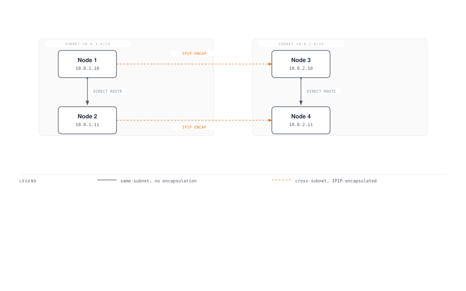
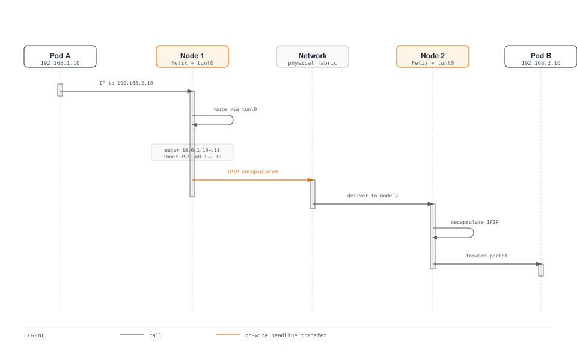
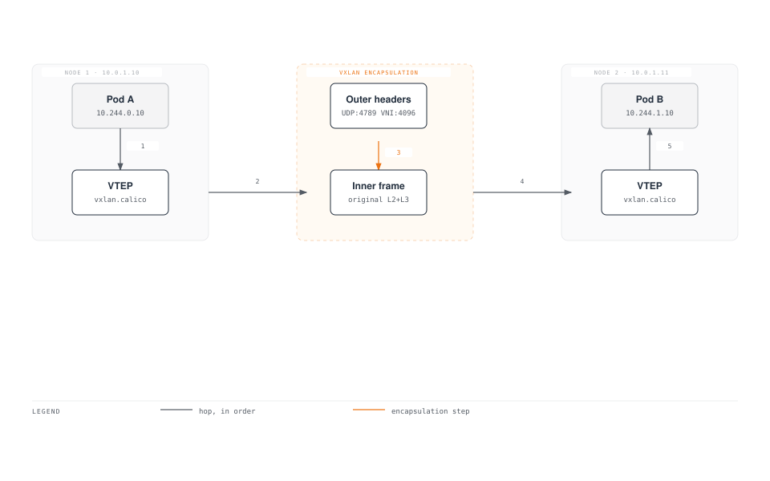
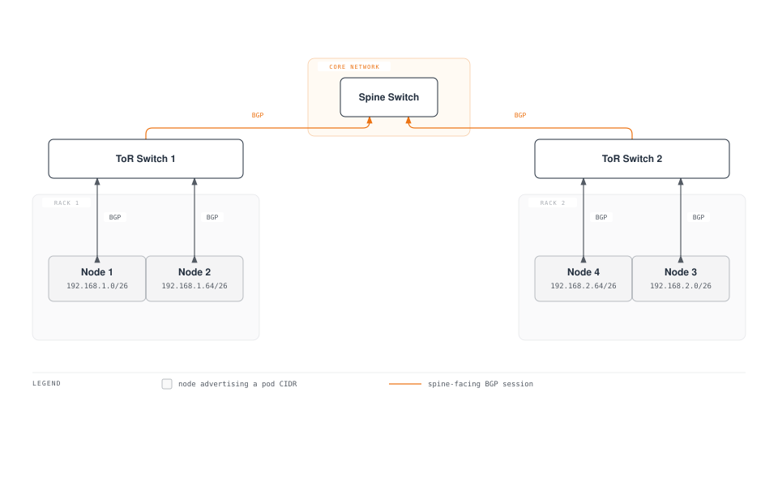
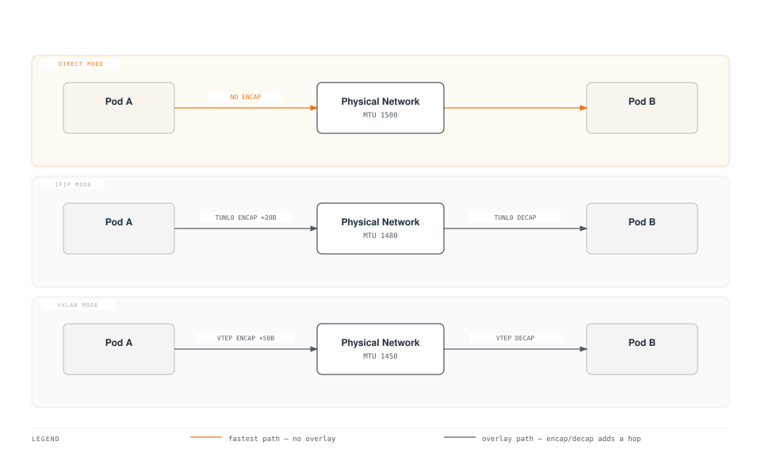
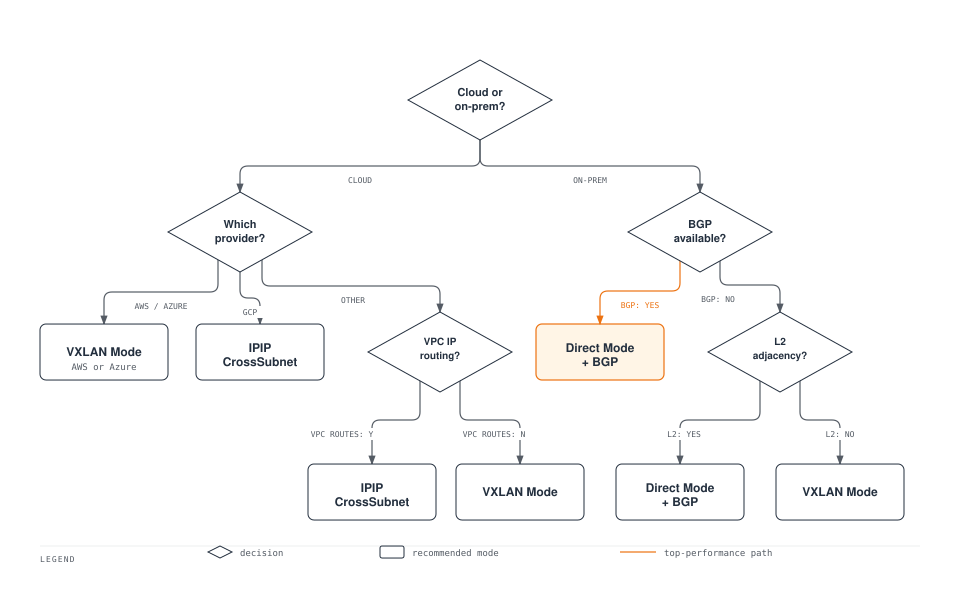

# Part 3: Networking Modes

> **Supported Versions**: Calico v3.29+ / Kubernetes 1.28+ **Last Updated**: February 23, 2026

## Overview

Calico supports multiple networking modes to accommodate different infrastructure requirements, performance needs, and operational constraints. This section provides a deep dive into each networking mode, helping you choose and configure the optimal mode for your environment.

## Networking Mode Summary


[🔍 View interactive diagram](https://www.atomai.click/kubernetes-docs/archmaps/en-networking-calico-03-networking-modes-7.html)

## IPIP Mode

IP-in-IP (IPIP) is Calico's default encapsulation mode. It wraps the original IP packet inside another IP packet for cross-subnet communication.

### IPIP Packet Structure

```
Standard IP Packet (1500 bytes MTU):
┌──────────────────────────────────────────────────────────────────┐
│ Ethernet │    IP Header (20B)    │  TCP/UDP  │     Payload      │
│   (14B)  │ Src: 192.168.1.10     │   (20B)   │   (up to 1460B)  │
│          │ Dst: 192.168.2.10     │           │                   │
└──────────────────────────────────────────────────────────────────┘

IPIP Encapsulated Packet (1500 bytes outer MTU):
┌───────────────────────────────────────────────────────────────────────────────┐
│ Ethernet │  Outer IP (20B)   │  Inner IP (20B)   │ TCP/UDP │    Payload     │
│   (14B)  │ Src: 10.0.1.10    │ Src: 192.168.1.10 │  (20B)  │ (up to 1440B)  │
│          │ Dst: 10.0.1.11    │ Dst: 192.168.2.10 │         │                │
│          │ Proto: 4 (IPIP)   │                   │         │                │
└───────────────────────────────────────────────────────────────────────────────┘
                                ▲
                                │
                         20 bytes overhead
                         Effective MTU: 1480
```

### IPIP Mode Options

| Mode            | Description                               | Use Case                                   |
| --------------- | ----------------------------------------- | ------------------------------------------ |
| **Always**      | All pod-to-pod traffic is encapsulated    | Cloud environments, simple setup           |
| **CrossSubnet** | Only cross-subnet traffic is encapsulated | Hybrid environments, optimized performance |
| **Never**       | IPIP disabled (use with Direct routing)   | On-premises with BGP                       |

### IPIP CrossSubnet Mode

CrossSubnet is an optimization that only encapsulates traffic crossing L3 boundaries:



### IPIP IPPool Configuration

```yaml
apiVersion: projectcalico.org/v3
kind: IPPool
metadata:
  name: default-ipv4-ippool
spec:
  cidr: 192.168.0.0/16
  blockSize: 26                    # /26 = 64 IPs per block
  ipipMode: Always                 # Options: Always, CrossSubnet, Never
  vxlanMode: Never
  natOutgoing: true
  nodeSelector: all()
---
# CrossSubnet mode for optimized performance
apiVersion: projectcalico.org/v3
kind: IPPool
metadata:
  name: crosssubnet-ippool
spec:
  cidr: 10.244.0.0/16
  blockSize: 26
  ipipMode: CrossSubnet
  vxlanMode: Never
  natOutgoing: true
  nodeSelector: all()
```

### IPIP Tunnel Interface

```bash
# View IPIP tunnel interface on a node
ip link show tunl0

# Expected output:
# tunl0@NONE: <NOARP,UP,LOWER_UP> mtu 1480 qdisc noqueue state UNKNOWN mode DEFAULT group default qlen 1000
#     link/ipip 0.0.0.0 brd 0.0.0.0

# View IPIP routes
ip route | grep tunl0

# Expected output:
# 192.168.2.0/26 via 10.0.1.11 dev tunl0 proto bird onlink
# 192.168.3.0/26 via 10.0.1.12 dev tunl0 proto bird onlink
```

### IPIP Packet Flow Diagram



## VXLAN Mode

VXLAN (Virtual Extensible LAN) is an industry-standard overlay protocol that encapsulates Layer 2 frames in UDP packets.

### VXLAN Packet Structure

```
VXLAN Encapsulated Packet:
┌─────────────────────────────────────────────────────────────────────────────────────────┐
│ Outer    │ Outer IP (20B)   │  UDP (8B)  │ VXLAN  │ Inner    │ Inner IP │ TCP/ │ Pay- │
│ Ethernet │ Src: 10.0.1.10   │ Src: rand  │ Header │ Ethernet │  (20B)   │ UDP  │ load │
│  (14B)   │ Dst: 10.0.1.11   │ Dst: 4789  │  (8B)  │  (14B)   │          │(20B) │      │
└─────────────────────────────────────────────────────────────────────────────────────────┘
                                                      ▲
                                                      │
                                               50 bytes overhead
                                               Effective MTU: 1450
```

### VXLAN Components

| Component             | Description                                      |
| --------------------- | ------------------------------------------------ |
| **VTEP**              | VXLAN Tunnel Endpoint - encap/decap point        |
| **VNI**               | VXLAN Network Identifier (Calico uses fixed VNI) |
| **UDP Port**          | 4789 (IANA assigned)                             |
| **Multicast/Unicast** | Calico uses unicast with known peer VTEPs        |

### VXLAN IPPool Configuration

```yaml
apiVersion: projectcalico.org/v3
kind: IPPool
metadata:
  name: vxlan-ippool
spec:
  cidr: 10.244.0.0/16
  blockSize: 26
  ipipMode: Never
  vxlanMode: Always                # Options: Always, CrossSubnet, Never
  natOutgoing: true
  nodeSelector: all()
---
# VXLAN CrossSubnet mode
apiVersion: projectcalico.org/v3
kind: IPPool
metadata:
  name: vxlan-crosssubnet-ippool
spec:
  cidr: 10.245.0.0/16
  blockSize: 26
  ipipMode: Never
  vxlanMode: CrossSubnet
  natOutgoing: true
  nodeSelector: all()
```

### VXLAN Interface Configuration

```bash
# View VXLAN interface
ip link show vxlan.calico

# Expected output:
# vxlan.calico: <BROADCAST,MULTICAST,UP,LOWER_UP> mtu 1450 qdisc noqueue state UNKNOWN mode DEFAULT group default
#     link/ether 66:5b:5c:5d:5e:5f brd ff:ff:ff:ff:ff:ff

# View VXLAN FDB (Forwarding Database)
bridge fdb show dev vxlan.calico

# Expected output:
# 66:a1:a2:a3:a4:a5 dst 10.0.1.11 self permanent
# 66:b1:b2:b3:b4:b5 dst 10.0.1.12 self permanent

# View VXLAN routes
ip route | grep vxlan

# Expected output:
# 10.244.1.0/26 via 10.244.1.0 dev vxlan.calico onlink
# 10.244.2.0/26 via 10.244.2.0 dev vxlan.calico onlink
```

### VXLAN Packet Flow



## Direct/Unencapsulated Mode

Direct routing mode uses native IP routing without any encapsulation, providing the best possible performance.

### Requirements for Direct Mode

| Requirement           | Description                                    |
| --------------------- | ---------------------------------------------- |
| **L2 Adjacency**      | Nodes must be on the same L2 network, OR       |
| **BGP Routing**       | External routers must learn pod routes via BGP |
| **Route Propagation** | Physical network must route pod CIDRs          |

### Direct Mode Topology



### Direct Mode IPPool Configuration

```yaml
apiVersion: projectcalico.org/v3
kind: IPPool
metadata:
  name: direct-routing-pool
spec:
  cidr: 192.168.0.0/16
  blockSize: 26
  ipipMode: Never                  # Disable IPIP
  vxlanMode: Never                 # Disable VXLAN
  natOutgoing: true
  nodeSelector: all()
```

### BGP Configuration for Direct Mode

```yaml
# Global BGP configuration
apiVersion: projectcalico.org/v3
kind: BGPConfiguration
metadata:
  name: default
spec:
  logSeverityScreen: Info
  nodeToNodeMeshEnabled: true      # Full mesh for small clusters
  asNumber: 64512
---
# Peer with ToR switches
apiVersion: projectcalico.org/v3
kind: BGPPeer
metadata:
  name: rack1-tor
spec:
  peerIP: 10.0.1.1
  asNumber: 65001
  nodeSelector: rack == 'rack1'
---
apiVersion: projectcalico.org/v3
kind: BGPPeer
metadata:
  name: rack2-tor
spec:
  peerIP: 10.0.2.1
  asNumber: 65001
  nodeSelector: rack == 'rack2'
```

### Direct Mode Routes

```bash
# View routes on a node in direct mode
ip route

# Expected output (no tunnel interfaces):
# default via 10.0.1.1 dev eth0
# 10.0.1.0/24 dev eth0 proto kernel scope link src 10.0.1.10
# 192.168.1.0/26 dev cali123456 scope link           # Local pods
# 192.168.1.64/26 via 10.0.1.11 dev eth0 proto bird  # Node 2 pods
# 192.168.2.0/26 via 10.0.1.1 dev eth0 proto bird    # Rack 2 via ToR
# 192.168.2.64/26 via 10.0.1.1 dev eth0 proto bird   # Rack 2 via ToR
```

## Mode Comparison

### IPIP vs VXLAN vs Direct

| Feature               | IPIP                | VXLAN                | Direct       |
| --------------------- | ------------------- | -------------------- | ------------ |
| **Protocol**          | IP Protocol 4       | UDP Port 4789        | Native IP    |
| **Overhead**          | 20 bytes            | 50 bytes             | 0 bytes      |
| **MTU**               | 1480                | 1450                 | 1500         |
| **Firewall Friendly** | May need IP proto 4 | UDP pass-through     | Native       |
| **Hardware Offload**  | Limited             | Better support       | Full support |
| **L2 Requirement**    | No                  | No                   | Yes (or BGP) |
| **Multicast**         | Not needed          | Not needed (unicast) | Not needed   |
| **Performance**       | Good                | Good                 | Best         |
| **Complexity**        | Low                 | Low                  | Medium       |

### Performance Benchmark Comparison

```
Test Environment:
- Nodes: 3x c5.xlarge (AWS)
- Network: 10 Gbps
- Tool: iperf3 TCP, 60 second test

Results (TCP throughput, single stream):

┌─────────────────────────────────────────────────────────────┐
│                    Throughput (Gbps)                        │
├─────────────────────────────────────────────────────────────┤
│ Direct Mode      ████████████████████████████████  9.41     │
│ IPIP Mode        ███████████████████████████████   9.12     │
│ VXLAN Mode       ██████████████████████████████    8.89     │
└─────────────────────────────────────────────────────────────┘

Latency (microseconds, p99):

┌─────────────────────────────────────────────────────────────┐
│                    Latency (μs)                             │
├─────────────────────────────────────────────────────────────┤
│ Direct Mode      ████                              45       │
│ IPIP Mode        █████                             52       │
│ VXLAN Mode       ██████                            61       │
└─────────────────────────────────────────────────────────────┘

CPU Usage (% per Gbps):

┌─────────────────────────────────────────────────────────────┐
│                    CPU (% per Gbps)                         │
├─────────────────────────────────────────────────────────────┤
│ Direct Mode      ███                               2.1      │
│ IPIP Mode        ████                              2.8      │
│ VXLAN Mode       █████                             3.4      │
└─────────────────────────────────────────────────────────────┘
```

### Packet Flow Comparison



## Cloud Provider Compatibility

| Provider        | IPIP | VXLAN | Direct           | Recommended               |
| --------------- | ---- | ----- | ---------------- | ------------------------- |
| **AWS EC2**     | Yes  | Yes   | With VPC routing | VXLAN or IPIP CrossSubnet |
| **AWS EKS**     | Yes  | Yes   | Limited          | VXLAN (default)           |
| **Azure**       | Yes  | Yes   | With UDR         | VXLAN                     |
| **GCP**         | Yes  | Yes   | With VPC routes  | IPIP CrossSubnet          |
| **On-Premises** | Yes  | Yes   | Yes (BGP)        | Direct (with BGP)         |
| **Bare Metal**  | Yes  | Yes   | Yes              | Direct (with BGP)         |
| **OpenStack**   | Yes  | Yes   | Yes              | Depends on neutron config |

### AWS-Specific Configuration

```yaml
# For AWS EC2/EKS with VXLAN
apiVersion: operator.tigera.io/v1
kind: Installation
metadata:
  name: default
spec:
  kubernetesProvider: EKS
  cni:
    type: Calico
  calicoNetwork:
    bgp: Disabled                  # AWS VPC doesn't support BGP
    ipPools:
    - cidr: 10.244.0.0/16
      encapsulation: VXLAN
      natOutgoing: Enabled
      nodeSelector: all()
```

### On-Premises with BGP

```yaml
# For on-premises with BGP peering
apiVersion: operator.tigera.io/v1
kind: Installation
metadata:
  name: default
spec:
  kubernetesProvider: ""
  cni:
    type: Calico
  calicoNetwork:
    bgp: Enabled
    ipPools:
    - cidr: 192.168.0.0/16
      encapsulation: None          # Direct routing
      natOutgoing: Enabled
      nodeSelector: all()
```

## Mode Migration Guide

### Migrating from IPIP to VXLAN

```bash
# Step 1: Create new VXLAN IPPool
cat <<EOF | kubectl apply -f -
apiVersion: projectcalico.org/v3
kind: IPPool
metadata:
  name: vxlan-pool
spec:
  cidr: 10.245.0.0/16
  blockSize: 26
  ipipMode: Never
  vxlanMode: Always
  natOutgoing: true
  nodeSelector: all()
EOF

# Step 2: Disable old IPIP pool (prevents new allocations)
calicoctl patch ippool default-ipv4-ippool -p '{"spec": {"disabled": true}}'

# Step 3: Rolling restart workloads to get new IPs
kubectl rollout restart deployment -n <namespace>

# Step 4: After all pods migrated, delete old pool
calicoctl delete ippool default-ipv4-ippool
```

### Migrating from Overlay to Direct

```yaml
# Step 1: Ensure BGP is configured
apiVersion: projectcalico.org/v3
kind: BGPConfiguration
metadata:
  name: default
spec:
  nodeToNodeMeshEnabled: true
  asNumber: 64512
---
# Step 2: Configure BGP peers (for external routing)
apiVersion: projectcalico.org/v3
kind: BGPPeer
metadata:
  name: tor-peer
spec:
  peerIP: 10.0.0.1
  asNumber: 65001
---
# Step 3: Create direct mode IPPool
apiVersion: projectcalico.org/v3
kind: IPPool
metadata:
  name: direct-pool
spec:
  cidr: 192.168.0.0/16
  ipipMode: Never
  vxlanMode: Never
  natOutgoing: true
```

## MTU Optimization Guide

### MTU Calculation by Mode

| Mode             | Base MTU | Overhead | Effective MTU | Configuration        |
| ---------------- | -------- | -------- | ------------- | -------------------- |
| Direct           | 1500     | 0        | 1500          | No change needed     |
| IPIP             | 1500     | 20       | 1480          | `ipipMTU: 1480`      |
| VXLAN            | 1500     | 50       | 1450          | `vxlanMTU: 1450`     |
| WireGuard        | 1500     | 60       | 1440          | `wireguardMTU: 1440` |
| IPIP + WireGuard | 1500     | 80       | 1420          | Combined overhead    |

### MTU Configuration

```yaml
apiVersion: projectcalico.org/v3
kind: FelixConfiguration
metadata:
  name: default
spec:
  # Auto-detect MTU (recommended)
  mtuIfacePattern: ^((en|wl|eth).*|bond[0-9]+)$

  # Or set explicit values
  ipipMTU: 1480
  vxlanMTU: 1450
  wireguardMTU: 1440
```

### Jumbo Frames Configuration

```yaml
# For networks supporting jumbo frames (MTU 9000)
apiVersion: projectcalico.org/v3
kind: FelixConfiguration
metadata:
  name: default
spec:
  ipipMTU: 8980              # 9000 - 20 (IPIP overhead)
  vxlanMTU: 8950             # 9000 - 50 (VXLAN overhead)
```

### Verifying MTU

```bash
# Check interface MTU
ip link show | grep mtu

# Test path MTU
ping -M do -s 1472 <destination-pod-ip>   # For 1500 MTU
ping -M do -s 1452 <destination-pod-ip>   # For IPIP (1480 MTU)
ping -M do -s 1422 <destination-pod-ip>   # For VXLAN (1450 MTU)

# Check for MTU issues in tcpdump
tcpdump -i eth0 'icmp[icmptype] == 3 and icmp[icmpcode] == 4'
```

## Decision Flowchart



## Summary

Choosing the right networking mode is critical for optimal Calico performance:

1. **IPIP Mode**: Default choice for cloud environments, simple to configure
2. **VXLAN Mode**: Better firewall compatibility, standard overlay protocol
3. **Direct Mode**: Maximum performance for on-premises with BGP infrastructure

Key considerations:

* **Cloud deployments**: Use VXLAN or IPIP CrossSubnet
* **On-premises with BGP**: Use Direct mode for best performance
* **Mixed environments**: IPIP or VXLAN CrossSubnet provides good balance
* **Performance critical**: Direct mode with proper BGP configuration

[Previous: Part 2 - Calico Architecture Deep Dive](02-architecture.md)

[Return to Calico Overview](./README.md)

## Quiz

To test what you've learned in this chapter, try the [Networking Modes Quiz](../../quizzes/networking/calico/03-networking-modes-quiz.md).
