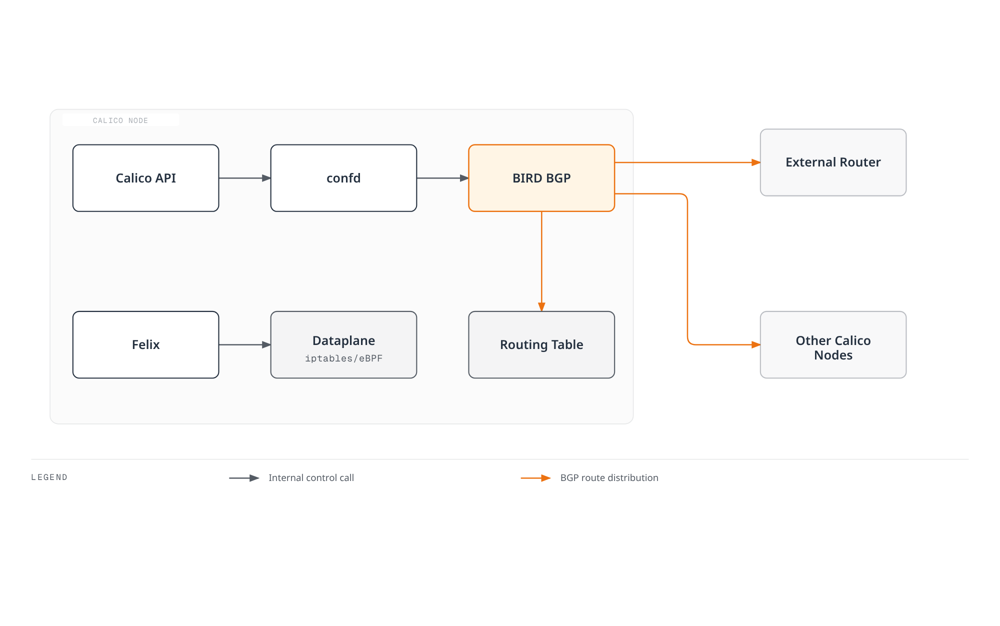
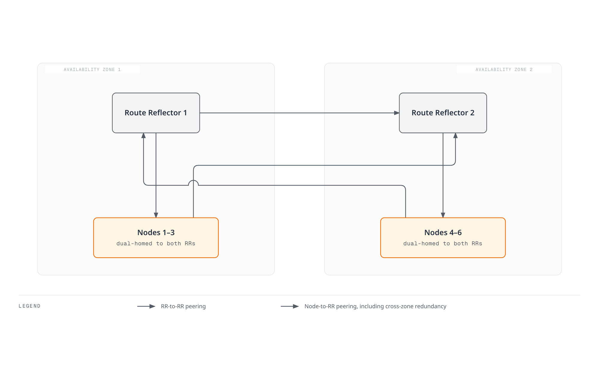
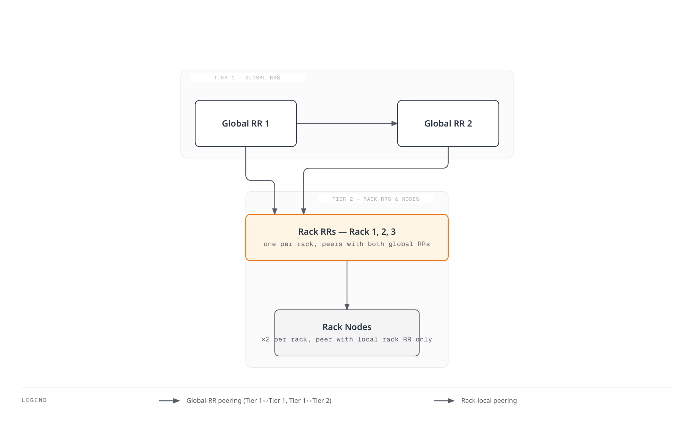
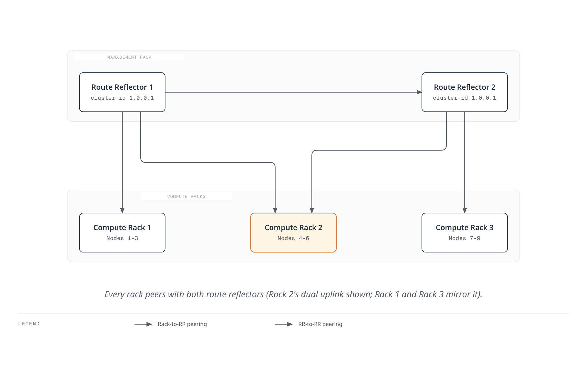

# Part 4: BGP Deep Dive

> **Review baseline**: Calico 3.32.2; Calico 3.32 tests Kubernetes 1.34–1.36. **Last Updated**: September 12, 2026.
>
> Configuration examples assume a Linux Calico cluster with BGP enabled and the standard Calico API server installed (`projectcalico.org/v3`). They are separate topology alternatives, not one manifest to apply in sequence. Retain the installation's operator/GitOps ownership and merge intended fields into its existing configuration. The [installation guide](01-introduction.md) covers API prerequisites; the [networking modes guide](03-networking-modes.md) covers BGP-free routing alternatives. Router addresses, ASNs and CIDRs must match a network you control. No live fabric or cluster failover was tested for this review.

## Introduction

Border Gateway Protocol (BGP) exchanges reachability information. Calico can use it to distribute workload routes and integrate with an existing routed fabric. BGP is a control-plane protocol: it can accompany unencapsulated routing or IP-in-IP, and it does not itself guarantee better performance. Calico 3.32 also supports Felix-managed cluster routing without BGP; external BGP advertisement still requires a BGP speaker.

This deep dive covers BGP fundamentals, Calico's BGP architecture options, configuration resources, and advanced deployment patterns for enterprise environments.

***

## BGP Fundamentals

### What is BGP?

BGP (Border Gateway Protocol) is a path-vector routing protocol designed to exchange routing information between autonomous systems. In Calico, BGP distributes pod IP routes across cluster nodes and optionally to external network infrastructure.

### Key BGP Concepts

| Concept                    | Description                                                          |
| -------------------------- | -------------------------------------------------------------------- |
| **Autonomous System (AS)** | A collection of IP networks under a single administrative domain     |
| **AS Number (ASN)**        | 16-bit or 32-bit identifier; allocation excludes special/reserved ranges  |
| **iBGP**                   | Internal BGP - sessions between routers in the same AS               |
| **eBGP**                   | External BGP - sessions between routers in different ASes            |
| **NLRI**                   | Network Layer Reachability Information - the routes being advertised |
| **BGP Speaker**            | A router or software that participates in BGP                        |

### Private AS Number Ranges

For internal use within organizations, IANA reserves the following private ASN ranges:

```
16-bit Private ASN Range: 64512 - 65534
32-bit Private ASN Range: 4200000000 - 4294967294
```

Calico's default cluster ASN is `64512`. Private ASNs must be removed from AS paths before those routes reach the global Internet; they are identifiers, not inherently unroutable IP addresses. Other special ranges include documentation ASNs `64496–64511` and `65536–65551`, and `23456` (AS_TRANS). Consult the [IANA registry](https://www.iana.org/assignments/as-numbers/as-numbers.xhtml) rather than treating every other integer as an allocated public ASN.

### BGP Route Selection Process

Compare the actual implementation and routing policy. Cisco `Weight` and administrative distances 20/200 are not universal BGP properties or Calico BIRD defaults.

Calico 3.32.2 pins its BIRD fork to `v0.3.3-211-g9111ec3c`. For comparable eligible BGP routes, its selection function checks higher LOCAL_PREF, shorter AS_PATH (when enabled), lower ORIGIN, lower MED under the applicable neighbor-AS policy, eBGP over iBGP, and lower IGP metric. Remaining ties use router/ORIGINATOR_ID, CLUSTER_LIST length and peer IP; optional older-route preference changes the tie break. Suppression, next-hop reachability, stale-route handling and BIRD route preference also matter. This is not a universal eleven-step ladder.

Calico 3.32 translates its route priorities into LOCAL_PREF and kernel metrics. Therefore, do not assume every locally exported route retains the upstream BIRD default LOCAL_PREF of 100.

### iBGP vs eBGP Behavior

| Attribute | iBGP | eBGP |
| --- | --- | --- |
| AS relationship | Same AS | Different ASes |
| AS_PATH | Normally preserved | Normally prepends the local AS |
| Route propagation | An iBGP-learned route is normally not sent to another iBGP peer; RR is an exception | Export depends on policy and loop prevention |
| Next hop | Often preserved; must remain reachable | Often changed; `nextHopMode` and topology affect this |
| TTL and administrative distance | Implementation/configuration dependent | Implementation/configuration dependent |

Locally originated or eBGP-learned routes can be sent to iBGP peers. Calico's generated external-peer configuration uses BIRD multihop; do not diagnose it from a generic “eBGP TTL 1” table. Inspect the generated configuration and negotiated session state.

***

## Calico BGP Architecture

### BIRD: Calico's BGP Implementation

When BGP is enabled, Calico runs its BIRD fork in `calico-node`; confd renders its configuration. BIRD is not required in a BGP-disabled deployment. Both BIRD and Felix have routing responsibilities depending on the selected mode.



[🔍 View interactive diagram](https://www.atomai.click/kubernetes-docs/archmaps/en-networking-calico-04-bgp-deep-dive-1.html)

> The boundary is schematic: the Calico API server is a separate component, not a process inside each calico-node Pod. Felix also manages local workload routes and, in the selected mode, cluster routes. BIRD is present only when enabled.

### BGP Topology Options

Common internal BGP topology choices are:

1. **Node-to-Node Mesh (Full Mesh)** - Default configuration
2. **Route Reflectors** - Recommended for larger clusters

***

## Full-Mesh Topology

### How Full-Mesh Works

With BGP and the default node mesh enabled, participating non-RR nodes peer with each other. Nodes marked as route reflectors are excluded from the automatic mesh.


[🔍 View interactive diagram](https://www.atomai.click/kubernetes-docs/archmaps/en-networking-calico-04-bgp-deep-dive-3.html)

> The arrows enumerate bidirectional sessions, not one-way traffic. This counts one session per pair for the address family under discussion.

### Session Count Formula

The number of BGP sessions in a full-mesh topology grows quadratically:

```
Sessions = N × (N - 1) / 2

Examples:
- 10 nodes:   10 × 9 / 2 = 45 sessions
- 50 nodes:   50 × 49 / 2 = 1,225 sessions
- 100 nodes:  100 × 99 / 2 = 4,950 sessions
- 500 nodes:  500 × 499 / 2 = 124,750 sessions
```

### Full-Mesh Scaling and Transition

The formula assumes one session per node pair for the address family being counted. Each node has `N−1` peers. CPU and memory depend on route count, update churn, policy, hardware and convergence targets; the former per-node memory table and fixed 50/200-node limits were not measured capacity limits.

Check the existing configuration:

```bash
kubectl get bgpconfiguration.projectcalico.org default -o yaml
```

An absent `default` resource means defaults may be in use. Prepare and validate replacement RR or fabric sessions before disabling the automatic mesh. Follow the transition order below; merely creating an RR label does not provide a working replacement.

***

## Route Reflector Topology

### Route Reflector Concepts

Route Reflectors (RRs) solve the iBGP scalability problem by allowing a subset of nodes to reflect routes to other nodes. This eliminates the need for a full mesh.



[🔍 View interactive diagram](https://www.atomai.click/kubernetes-docs/archmaps/en-networking-calico-04-bgp-deep-dive-4.html)

> This drawing contains six clients plus two RRs: 13 sessions. In the figure’s 2N+1 expression N counts clients, while full-mesh N counts total nodes. Automatic mesh is disabled only after the explicit replacement topology is verified.

### Route Reflector Key Attributes

| Attribute            | Description                                                   |
| -------------------- | ------------------------------------------------------------- |
| **Cluster ID**       | Identifies a set of RRs serving the same clients              |
| **Originator ID**    | Prevents routing loops (set to the router ID of originator)   |
| **Route Reflection** | RR re-advertises routes learned from clients to other clients |

### Session Count with Route Reflectors

Let `T` be the total node count, `R` the number of reflectors, and `C=T−R` the number of clients. If every client peers with every RR and the RRs peer with each other:

```text
RR sessions = C×R + R×(R−1)/2
T=100, R=2: 98×2 + 1 = 197 (full mesh of the same 100 nodes: 4,950)
T=500, R=2: 498×2 + 1 = 997 (full mesh of the same 500 nodes: 124,750)
```

If “100 nodes” instead means 100 clients plus two additional RRs, the count is 201, but that topology has 102 nodes. The two meanings must not be mixed.

### Configuring Route Reflector Nodes

Use prepared, workload-free RR nodes for this transition. Setting a cluster ID immediately removes that node from the automatic mesh; changing a busy node in place can interrupt connectivity. This Kubernetes-datastore example preserves existing node IPs and other fields.

**1. Label and annotate the prepared RR nodes**

```bash
kubectl label node rr-node-1 rr-node-2 route-reflector=true
kubectl annotate node rr-node-1 rr-node-2   projectcalico.org/RouteReflectorClusterID=244.0.0.1
```

The shared ID identifies this redundant RR cluster, not the Kubernetes cluster. Other RR clusters/hierarchy levels need an intentional ID design.

**2. Create explicit peerings**

```yaml
apiVersion: projectcalico.org/v3
kind: BGPPeer
metadata:
  name: peer-to-rr
spec:
  nodeSelector: "!has(route-reflector)"
  peerSelector: "has(route-reflector)"
---
apiVersion: projectcalico.org/v3
kind: BGPPeer
metadata:
  name: rr-mesh
spec:
  nodeSelector: "has(route-reflector)"
  peerSelector: "has(route-reflector)"
```

`peerSelector` selects Calico nodes, and reverse peering is automatic unless `reversePeering: Manual` is selected. It does not discover arbitrary external routers.

**3. Verify before removing the old path**

Verify Established sessions on both RRs and their clients, expected advertised/received workload prefixes, reachable next hops, and representative cross-node traffic. Confirm forwarding survives the planned loss of either RR. Ordinary client mesh sessions can remain during this transition.

**4. Disable automatic mesh only after those checks**

Update the owned `BGPConfiguration/default` manifest, preserving its ASN, communities and other settings. The equivalent merge patch for an existing resource is:

```bash
kubectl patch bgpconfiguration.projectcalico.org default --type=merge   -p '{"spec":{"nodeToNodeMeshEnabled":false}}'
```

If `default` does not exist, create it through the installation's configuration owner after the same checks. Recheck routes and traffic after the change; keep a rollback plan for the original topology.

### Route Reflector Redundancy Patterns

**Pattern 1: Dual Route Reflectors (Small/Medium Clusters)**


[🔍 View interactive diagram](https://www.atomai.click/kubernetes-docs/archmaps/en-networking-calico-04-bgp-deep-dive-11.html)

> This provides a redundant route-distribution path for surviving clients when one RR is lost, provided transport, forwarding and remaining capacity are healthy. It does not preserve workloads located in a failed zone.

**Pattern 2: Hierarchical Route Reflectors**

Rack-level RRs can peer with global RRs to reduce per-node session fan-out. Total sessions still grow with clients and racks. A single RR per rack remains a failure point even if global RRs are redundant; evaluate each tier's redundancy, cluster IDs, reflection rules, reachability and convergence before adopting a hierarchy.

***

## BGPPeer Resource

The `BGPPeer` resource defines BGP peering relationships between Calico nodes and external BGP speakers.

### BGPPeer Scope Types

| Type              | Description          | Use Case                |
| ----------------- | -------------------- | ----------------------- |
| **Global**        | Applies to all nodes | External router peering |
| **Node-specific** | Uses nodeSelector    | Rack-local peering      |
| **Per-node**      | Specifies exact node | Special configurations  |

### Global BGPPeer Example

Peer all nodes with external ToR switches:

```yaml
apiVersion: projectcalico.org/v3
kind: BGPPeer
metadata:
  name: peer-to-tor-switches
spec:
  peerIP: 10.0.0.1
  asNumber: 65001
  # No nodeSelector means all nodes peer with this address
```

### Node-Specific BGPPeer Example

Peer nodes in specific racks with their local ToR switch:

```yaml
apiVersion: projectcalico.org/v3
kind: BGPPeer
metadata:
  name: rack1-tor-peer
spec:
  nodeSelector: rack == 'rack1'
  peerIP: 10.0.1.1
  asNumber: 65001
---
apiVersion: projectcalico.org/v3
kind: BGPPeer
metadata:
  name: rack2-tor-peer
spec:
  nodeSelector: rack == 'rack2'
  peerIP: 10.0.2.1
  asNumber: 65002
```

### BGPPeer with peerSelector

Use `peerSelector` to dynamically select Calico nodes as peers:

```yaml
apiVersion: projectcalico.org/v3
kind: BGPPeer
metadata:
  name: client-to-rr-peering
spec:
  nodeSelector: "!has(route-reflector)"
  peerSelector: has(route-reflector)
```

### Advanced BGPPeer Configuration

Create the referenced Secret and the `tor-policy` BGPFilter from the security section first. This example assumes a directly connected peer with matching GTSM and authentication settings.

```yaml
apiVersion: projectcalico.org/v3
kind: BGPPeer
metadata:
  name: advanced-peer
spec:
  node: specific-node-name
  peerIP: 192.168.1.1
  asNumber: 65100
  password:
    secretKeyRef:
      name: bgp-secrets
      key: datacenter-password
  keepaliveTime: 30s
  maxRestartTime: 120s
  sourceAddress: UseNodeIP
  nextHopMode: Auto
  ttlSecurity: 1
  filters:
    - tor-policy
```

| Field | Meaning in Calico 3.32.2 |
| --- | --- |
| `keepaliveTime` | Duration string; the lowercase `a` is significant. Verified against the released CRD and renderer. |
| `maxRestartTime` | Graceful-restart time advertised to the neighbor; not a connection-retry interval. |
| `sourceAddress` | `UseNodeIP` or `None`; a literal source IP is not accepted. |
| `filters` | Names of existing `BGPFilter` resources, not embedded rule objects. |
| `ttlSecurity` | GTSM path length in edges; `1` means a directly connected peer. |
| `numAllowedLocalASNumbers` | Allowed occurrences of the local ASN in a received AS_PATH; relaxes loop prevention, not a multihop setting. Leave unset unless the routing design requires it. |

The current `BGPPeer` API has no `holdTime`, `keepAliveTime` or `restartTime` field. `nextHopMode` is `Auto`, `Self` or `Keep`; the older `keepOriginalNextHop` field is deprecated, not removed.

***

## BGPConfiguration Resource

The `BGPConfiguration` resource defines cluster-wide BGP settings.

### Basic BGPConfiguration

```yaml
apiVersion: projectcalico.org/v3
kind: BGPConfiguration
metadata:
  name: default
spec:
  # Cluster AS number
  asNumber: 64512

  # Set topology separately after validating its peerings.
  # Log level for BIRD
  logSeverityScreen: Info
```

### Service IP Advertisement

Calico can advertise existing Service IPs to an authorized routed network. Advertisement does not allocate the IP, create a cloud load balancer, or guarantee a reachable return path. The CIDRs below are examples: merge only the required ranges into the existing configuration and retain other settings.

```yaml
apiVersion: projectcalico.org/v3
kind: BGPConfiguration
metadata:
  name: default
spec:
  asNumber: 64512

  # Advertise Service ClusterIPs
  serviceClusterIPs:
    - cidr: 10.96.0.0/12

  # Advertise Service ExternalIPs
  serviceExternalIPs:
    - cidr: 203.0.113.0/24

  # Advertise Service LoadBalancerIPs
  serviceLoadBalancerIPs:
    - cidr: 198.51.100.0/24
```

### BGP Communities Configuration

`prefixAdvertisements` adds communities to matching existing routes, including Pod routes in the current renderer. It does **not** originate the listed prefix or aggregate all Pod blocks into that prefix. Named communities take effect only when referenced; their names and arbitrary values do not implement a routing policy by themselves.

```yaml
apiVersion: projectcalico.org/v3
kind: BGPConfiguration
metadata:
  name: default
spec:
  asNumber: 64512

  # Community tagging for pod networks
  prefixAdvertisements:
    - cidr: 10.244.0.0/16
      communities:
        - "64512:100"  # Standard community
        - "64512:200"
    - cidr: 10.96.0.0/12
      communities:
        - "64512:300"  # Service IPs community

  # Named aliases, referenced by prefixAdvertisements in this configuration
  communities:
    - name: pod-networks
      value: "64512:100"
    - name: service-networks
      value: "64512:300"
    - name: no-export
      value: "65535:65281"  # Well-known NO_EXPORT
```

### Node-Specific AS Number

For a Kubernetes datastore, annotate the existing node to preserve its addresses and other fields. Changing an ASN resets affected peerings; coordinate both endpoints and the routing topology.

```bash
kubectl annotate node border-node-1 projectcalico.org/ASNumber=65001
```

For an existing annotation, update it through the configuration owner after reviewing its current value. Other datastores use the Calico Node API; do not replace an existing Node with a partial example containing invented addresses.

***

## Service IP Advertisement

### Advertisement Types and Forwarding

| Type | Address owner and prerequisite |
| --- | --- |
| ClusterIP | Kubernetes allocates it; advertising the Service CIDR exposes a route into the service network. |
| ExternalIP | The operator must already own and route the assigned address. `spec.externalIPs` is deprecated since Kubernetes 1.36; existing support is not removal. |
| LoadBalancer IP | A compatible controller allocates it. Calico can allocate owned VIPs itself, or interoperate with an explicitly chosen allocator. A cloud LB hostname is not an IP prefix. |

With the default aggregation behavior, Cluster-mode Services use configured aggregate advertisements, while Local-mode Services use host routes (`/32` or `/128`) from nodes with ready local endpoints. Explicit host-prefix ranges and Calico 3.32’s `serviceLoadBalancerAggregation` setting can change the advertised routes; inspect the actual RIB/export rather than inferring it solely from the Service type. Validate endpoints, the Service dataplane, upstream ECMP and return paths. This is distinct from Pod IPAM block advertisement.

### Native Calico LoadBalancer IPAM

Calico 3.32 includes a LoadBalancer controller in `calico-kube-controllers`. It requires an IPPool with `allowedUses: [LoadBalancer]`; the standard Pod pool does not supply those addresses automatically. Confirm that controller is enabled. This standalone bare-metal example also assumes an existing `calico-demo` namespace and ready `app=my-app` endpoints serving the stated port. Replace the documentation range with an owned, routable range.

```yaml
apiVersion: projectcalico.org/v3
kind: IPPool
metadata:
  name: service-lb-pool
spec:
  cidr: 198.51.100.0/24
  allowedUses:
    - LoadBalancer
  assignmentMode: Automatic
---
apiVersion: projectcalico.org/v3
kind: BGPConfiguration
metadata:
  name: default
spec:
  serviceLoadBalancerIPs:
    - cidr: 198.51.100.0/24
---
apiVersion: v1
kind: Service
metadata:
  name: my-lb-service
  namespace: calico-demo
  annotations:
    projectcalico.org/loadBalancerIPs: '["198.51.100.50"]'
spec:
  type: LoadBalancer
  loadBalancerClass: calico
  externalTrafficPolicy: Local
  selector:
    app: my-app
  ports:
    - port: 443
      targetPort: 8443
```

The explicit `projectcalico.org/loadBalancerIPs` request must belong to an eligible pool and be available; it does not fall back to another address if allocation fails. Allocation and BGP advertisement are separate. Review the controller's `assignIPs` mode before changing it: `RequestedServicesOnly` can unassign existing unannotated Services. Preserve existing pool and controller ownership.

MetalLB is an alternative allocator: its current requested-IP annotation is `metallb.io/loadBalancerIPs`. Choose allocation and BGP-speaker ownership deliberately rather than running competing allocators/speakers for the same VIP. Do not advertise AWS-managed load balancer addresses as a locally owned pool.

### Selective Service Advertisement

There is no documented Calico Service opt-out annotation named `projectcalico.org/bgp-advertise`. Select advertised ranges in `BGPConfiguration`, and apply peer-specific BGPFilters where needed. The supported node label `node.kubernetes.io/exclude-from-external-load-balancers=true` excludes a node; it is not a per-Service opt-out.

Rejecting one `/32` does not make an IP unreachable if a covering Service aggregate is still advertised. For a Service that must remain internal, ensure no advertised range covers it and enforce access policy independently; route filtering is not an authorization boundary.

***

## Physical Network Integration

### ToR Routing Policy and Vendor Adaptation

Configure the router's ASN, node neighbors, address family, authentication, import/export policy and reachable next hops as one design. Decide whether nodes use a pre-existing underlay default route or receive a default from BGP. `network` originates an existing matching route; it is not a command to accept routes from a neighbor. Broad `redistribute connected` can leak unrelated networks.

| Platform | Adaptation required |
| --- | --- |
| Cisco IOS XE / NX-OS | Use the exact platform/release syntax. IOS XE dynamic neighbors use a peer group and `bgp listen range`; do not combine IOS and NX-OS command hierarchies. Define every referenced route map and prefix list. |
| Arista EOS | Use the deployed release’s peer-group, address-family, secret and import/export policy configuration. The former unverified EOS command block is not a runnable recipe. |
| Junos | A plain prefix-list match is exact. Use an explicit route-filter match type when more-specific routes are intended. |

For example, this **Junos policy fragment**, attached as import policy on the ToR's intended node-facing BGP group, accepts planned Pod `/26`–`/32` routes and LoadBalancer `/32` routes, then rejects the rest:

```text
policy-options {
    policy-statement K8S-IMPORT {
        term approved {
            from {
                route-filter 10.244.0.0/16 prefix-length-range /26-/32;
                route-filter 198.51.100.0/24 prefix-length-range /32-/32;
            }
            then accept;
        }
        term reject-rest {
            then reject;
        }
    }
}
```

The minimum Pod length assumes `/26` IPAM blocks; adapt it to the actual pool and route inventory. Borrowed addresses and some mobility paths can require `/32` routes, so `le 26` is not a generally safe Pod filter. This fragment neither creates neighbors nor advertises a default route. Vendor device configuration and failover have not been runtime tested here; complete and validate export policy, limits and next-hop behavior on the exact router release before deployment.

### Spine-Leaf Architecture Integration



[🔍 View interactive diagram](https://www.atomai.click/kubernetes-docs/archmaps/en-networking-calico-04-bgp-deep-dive-5.html)

> Grouped boxes summarize multiple sessions. The shared node ASN needs an explicit AS-loop/override design; dual spines alone do not provide leaf or node-uplink redundancy. Use the addresses and ASNs as an illustrative topology, not a complete deployable configuration.

Calico peer fragments for a spine-leaf design follow. Confirm node labels, direct/recursive next-hop reachability, export policies and the return path first. Reusing ASN 64512 on nodes across racks can cause a route to be rejected when its AS_PATH contains the receiving node's ASN; design unique ASNs or a deliberately validated fabric AS-override/loop policy. Do not work around this by blindly raising `numAllowedLocalASNumbers`. Validate the replacement path before removing mesh sessions.

```yaml
# Final topology alternative: establish fabric peerings before removing mesh.
apiVersion: projectcalico.org/v3
kind: BGPConfiguration
metadata:
  name: default
spec:
  asNumber: 64512

---
# Peer nodes with their local leaf switch
apiVersion: projectcalico.org/v3
kind: BGPPeer
metadata:
  name: rack1-leaf-peer
spec:
  nodeSelector: topology.kubernetes.io/zone == 'rack1'
  peerIP: 10.0.1.1
  asNumber: 65001

---
apiVersion: projectcalico.org/v3
kind: BGPPeer
metadata:
  name: rack2-leaf-peer
spec:
  nodeSelector: topology.kubernetes.io/zone == 'rack2'
  peerIP: 10.0.2.1
  asNumber: 65002

---
apiVersion: projectcalico.org/v3
kind: BGPPeer
metadata:
  name: rack3-leaf-peer
spec:
  nodeSelector: topology.kubernetes.io/zone == 'rack3'
  peerIP: 10.0.3.1
  asNumber: 65003
```

***

## BGP Community Tagging Strategy

### Community Design Patterns

The private values below are a local convention requiring router policy; they are not built-in priority controls. Standard communities contain two 16-bit values. Large communities contain three 32-bit values and can represent a four-byte ASN without squeezing it into a standard community.

| Community     | Meaning        | Action                           |
| ------------- | -------------- | -------------------------------- |
| `64512:100`   | Pod Networks   | Accept, normal routing           |
| `64512:200`   | Service IPs    | Accept, may apply special policy |
| `64512:300`   | Infrastructure | Higher priority routing          |
| `65535:65281` | NO\_EXPORT | Do not advertise outside the AS confederation boundary (outside the AS when no confederation is used) |
| `65535:65282` | NO\_ADVERTISE  | Do not advertise to any peer     |

### Community-Based Traffic Engineering

```yaml
apiVersion: projectcalico.org/v3
kind: BGPConfiguration
metadata:
  name: default
spec:
  asNumber: 64512

  communities:
    - name: production
      value: "64512:100"
    - name: staging
      value: "64512:200"
    - name: local-only
      value: "65535:65281"  # NO_EXPORT

  prefixAdvertisements:
    # Tag existing production routes; actual propagation follows routing policy
    - cidr: 10.244.0.0/17
      communities:
        - production

    # Add NO_EXPORT to existing staging routes
    - cidr: 10.244.128.0/17
      communities:
        - staging
        - local-only

    # Service IPs
    - cidr: 10.96.0.0/12
      communities:
        - production
```

***

## BGP Security

### MD5 Authentication

Calico supports the TCP MD5 signature option for BGP. It authenticates traffic from peers sharing the secret; it does not encrypt traffic or validate the legitimacy of routes sent by an authenticated peer.

Provision `bgp-secrets` through your secret-management process in the namespace where `calico-node` runs (`calico-system` for the operator installation used here; manifest installations may use `kube-system`). The example requires the `datacenter-password` key. Other examples referencing `mesh-password`, rack-specific or leaf-specific keys require those keys too. Configure matching credentials on the corresponding routers and confirm the Calico service account can read the Secret.

```yaml
apiVersion: projectcalico.org/v3
kind: BGPPeer
metadata:
  name: secure-peer
spec:
  peerIP: 192.168.1.1
  asNumber: 65100
  password:
    secretKeyRef:
      name: bgp-secrets
      key: datacenter-password
```

### Prefix Filtering

Rules are evaluated in order; the first match executes immediately. Unmatched routes default to **Accept**, so a whitelist needs an unconditional final Reject. `Equal 0.0.0.0/0` matches only the default route; `In 0.0.0.0/0` matches every IPv4 route and `NotIn 0.0.0.0/0` matches none.

The following external-peer example accepts only a default route and the planned underlay `10.0.0.0/16` on import. On export it allows actual Pod `/26`–`/32` routes and LoadBalancer `/32` routes. Adapt the CIDRs and lengths to the actual route inventory; do not attach this external policy indiscriminately to RR/client sessions.

```yaml
apiVersion: projectcalico.org/v3
kind: BGPFilter
metadata:
  name: tor-policy
spec:
  importV4:
    - action: Accept
      matchOperator: Equal
      cidr: 0.0.0.0/0
    - action: Accept
      matchOperator: In
      cidr: 10.0.0.0/16
    - action: Reject
  exportV4:
    - action: Accept
      matchOperator: In
      cidr: 10.244.0.0/16
      prefixLength:
        min: 26
        max: 32
      operations:
        - addCommunity:
            value: "64512:100"
    - action: Accept
      matchOperator: In
      cidr: 198.51.100.0/24
      prefixLength:
        min: 32
        max: 32
    - action: Reject
---
apiVersion: projectcalico.org/v3
kind: BGPPeer
metadata:
  name: filtered-peer
spec:
  peerIP: 192.168.1.1
  asNumber: 65100
  filters:
    - tor-policy
```

`prefixLength` is an object with `min` and `max`, not a range string. Calico 3.32 also supports accepted-route operations such as `addCommunity`. An explicit export Accept returns before the built-in Calico export/aggregation/`prefixAdvertisements` processing. It may therefore export more-specific routes already in the RIB, and this example adds its Pod tag directly in the rule. Inspect `show route export` before applying it to the fabric; a BGPFilter does not create missing routes.

### GTSM (TTL Security)

GTSM rejects packets arriving with a TTL below the expected path threshold; it reduces off-path spoofing exposure but does not authenticate the peer or stop an on-link attacker. Configure both endpoints consistently.

```yaml
apiVersion: projectcalico.org/v3
kind: BGPPeer
metadata:
  name: gtsm-enabled-peer
spec:
  peerIP: 192.168.1.1
  asNumber: 65100
  ttlSecurity: 1
```

For the pinned BIRD implementation, GTSM sends TTL 255 and sets minimum receive TTL to `256−hops`. Thus `ttlSecurity: 1` requires 255, not 254; two edges require at least 254. Verify the actual path before enabling it. This setting is unrelated to the count of local ASNs allowed in AS_PATH.

***

## Performance Tuning

### BGP Timer Configuration

```yaml
apiVersion: projectcalico.org/v3
kind: BGPPeer
metadata:
  name: tuned-peer
spec:
  peerIP: 192.168.1.1
  asNumber: 65100
  keepaliveTime: 20s
  maxRestartTime: 120s
```

The pinned BIRD fork proposes a 240-second Hold Time by default and negotiates the smaller value with the neighbor. If no keepalive interval is configured, it uses one third of that negotiated Hold Time. An explicit `keepaliveTime` overrides the interval; it does **not** automatically change Hold Time to three times that value. Inspect the actual negotiated timers and choose an interval that fits them.

`BGPPeer` does not expose `holdTime`. The former 60/180, 10/30 and 3/9 recommendations were not verified Calico defaults or failure-detection guarantees. BIRD's standalone BFD capability does not imply a supported Calico BFD CRD or configuration field. Test any separate BFD integration against the exact supported deployment rather than adding an invented field.

### Route Aggregation

Calico normally aggregates local IPAM addresses into their allocated blocks; the current BIRD aggregation template also permits higher-priority more-specific routes. Borrowing and mobility may require host routes. `prefixAdvertisements` only tags existing matching routes and does not turn every `/26` into an originated `/16`.

Larger IPAM blocks trade fewer block routes against allocation granularity and address utilization. Existing IPPool `blockSize` is immutable; use the pool migration procedure in [networking modes](03-networking-modes.md) if a new pool is required. Do not apply a new block size over an existing default pool or advertise a covering aggregate from a router that cannot reach all covered destinations.

### Graceful Restart

Calico's BIRD template enables Graceful Restart. Its benefit requires negotiated capability and a still-working forwarding path; retained stale routes can otherwise blackhole traffic. It does not guarantee interruption-free updates.

For explicit peers, `BGPPeer.maxRestartTime` sets the advertised restart time. The following setting applies to **automatic node mesh** sessions, not every explicit peer:

```yaml
apiVersion: projectcalico.org/v3
kind: BGPConfiguration
metadata:
  name: default
spec:
  nodeMeshMaxRestartTime: 120s
```

This is a duration string, not an integer or an enable switch. Change it through the existing configuration owner and validate actual peer capability and recovery behavior.

***

## Debugging BGP

### Inspect BIRD from the Correct Node

Choose an actual node and the installation namespace. These read-only commands run from the operator's shell against the IPv4 BIRD control socket. For IPv6 use `birdcl6` and `/var/run/calico/bird6.ctl`. A BGP-disabled installation need not have either daemon.

```bash
CALICO_NAMESPACE=calico-system
CALICO_NODE=worker-1
CALICO_POD="$(kubectl -n "$CALICO_NAMESPACE" get pods -l k8s-app=calico-node \
  --field-selector "spec.nodeName=$CALICO_NODE" -o jsonpath='{.items[0].metadata.name}')"
test -n "$CALICO_POD"
kubectl -n "$CALICO_NAMESPACE" exec "$CALICO_POD" -c calico-node -- \
  birdcl -s /var/run/calico/bird.ctl show protocols all
kubectl -n "$CALICO_NAMESPACE" exec "$CALICO_POD" -c calico-node -- \
  birdcl -s /var/run/calico/bird.ctl show route
```

```bash
CALICO_BGP_PROTOCOL=Global_192_168_1_1
kubectl -n "$CALICO_NAMESPACE" exec "$CALICO_POD" -c calico-node -- \
  birdcl -s /var/run/calico/bird.ctl show protocols all "$CALICO_BGP_PROTOCOL"
kubectl -n "$CALICO_NAMESPACE" exec "$CALICO_POD" -c calico-node -- \
  birdcl -s /var/run/calico/bird.ctl show route export "$CALICO_BGP_PROTOCOL"
kubectl -n "$CALICO_NAMESPACE" exec "$CALICO_POD" -c calico-node -- \
  birdcl -s /var/run/calico/bird.ctl show route protocol "$CALICO_BGP_PROTOCOL"
kubectl -n "$CALICO_NAMESPACE" exec "$CALICO_POD" -c calico-node -- \
  birdcl -s /var/run/calico/bird.ctl 'show route where net ~ [10.244.0.0/16+]'
```

```bash
kubectl get bgpconfiguration.projectcalico.org default -o yaml
kubectl get bgppeers.projectcalico.org -o wide
kubectl get bgpfilters.projectcalico.org -o yaml
kubectl -n "$CALICO_NAMESPACE" logs "$CALICO_POD" -c calico-node --tail=200
```

Replace `CALICO_BGP_PROTOCOL` with a name returned by `show protocols`; actual names include `Mesh_…`, `Global_…` and `Node_…`, not a universal `bgp*` prefix. Quote route expressions so the local shell does not expand them. `show protocols all` includes non-BGP protocols too.

Container logs can show startup and confd errors, but absence of matching stdout lines does not prove BIRD is healthy. Inspect the installation's BIRD log destination and session state. `calicoctl node status` is a node-local diagnostic requiring the node environment, not just a workstation kubeconfig. Likewise, `ip route` must be inspected on the intended node/network namespace.

| Symptom | Checks |
| --- | --- |
| Session remains Active | Peer address/ASN, TCP listener and firewall, source address, MD5/GTSM agreement, transport reachability |
| Established but no useful routes | Import/export filters, RR roles, endpoint/IPAM state, next-hop reachability and AS-loop rejection |
| Flapping or resets | Transport loss, MTU, authentication, negotiated timers, controller changes |
| Route exists but traffic fails | Actual kernel/FIB path, return route, Service forwarding, access policy and covering aggregates |

Established BGP alone does not prove workload connectivity.

***

## Multi-Rack and Multi-Datacenter Design

### Multi-Rack with Route Reflectors



[🔍 View interactive diagram](https://www.atomai.click/kubernetes-docs/archmaps/en-networking-calico-04-bgp-deep-dive-7.html)

> A surviving RR can preserve route distribution only if its transport and capacity remain available. Both RRs in one management rack share that rack’s failure risk; separate failure domains for rack-level resilience.

### Multi-Datacenter BGP Design


[🔍 View interactive diagram](https://www.atomai.click/kubernetes-docs/archmaps/en-networking-calico-04-bgp-deep-dive-8.html)

> The WAN group summarizes transit that must be separately configured; the visible links alone do not establish end-to-end reachability. DC1 origin tagging also requires the prefixAdvertisements reference shown in the text.

DC1 configuration fragments follow, assuming its owned workload CIDR is `10.244.0.0/16` and its local RR topology is already working. A named community must also be referenced by `prefixAdvertisements` to tag matching routes. DC2 needs its own non-overlapping CIDRs, ASNs and peer definitions; the WAN needs explicit transit/return routing and policy. This fragment is not a complete two-DC deployment.

```yaml
# DC1 Configuration
apiVersion: projectcalico.org/v3
kind: BGPConfiguration
metadata:
  name: default
spec:
  asNumber: 64512

  communities:
    - name: dc1-origin
      value: "64512:1"
  prefixAdvertisements:
    - cidr: 10.244.0.0/16
      communities:
        - dc1-origin

---
# Peer DC1 RRs with WAN routers
apiVersion: projectcalico.org/v3
kind: BGPPeer
metadata:
  name: dc1-to-wan
spec:
  nodeSelector: has(route-reflector)
  peerIP: 10.255.0.1  # WAN Router
  asNumber: 65000
```

***

## Best Practices Summary

### Design Recommendations

1. Size full mesh and RR deployments using measured route count, churn and convergence targets.
2. Separate redundant RRs across failure domains and verify surviving capacity and transport.
3. Use rack-aware labels and a documented ASN, CIDR and next-hop plan.
4. Add a hierarchy only when its reflection/loop rules and per-tier redundancy are understood.
5. Treat multiple datacenters as a complete routing and security design, not merely two BGPPeer objects.

### Security Recommendations

1. Always enable MD5 authentication for external peers
2. Implement prefix filtering to prevent route injection
3. Use GTSM (TTL Security) where supported
4. Configure supported prefix limits on the external routers; do not invent a Calico BGPPeer limit field.
5. Monitor BGP sessions for anomalies

### Operational Recommendations

1. Label nodes consistently for BGP topology
2. Document AS number allocation scheme
3. Implement BGP monitoring and alerting
4. Test failover scenarios regularly
5. Inspect negotiated timers and test recovery; a shorter keepalive is not a guaranteed shorter Hold Time.

***

## References

* [Calico BGP Documentation](https://docs.tigera.io/calico/latest/networking/configuring/bgp)
* [BIRD Internet Routing Daemon](https://bird.network.cz/)
* [RFC 4271 - BGP-4](https://www.rfc-editor.org/rfc/rfc4271)
* [RFC 4456 - BGP Route Reflection](https://www.rfc-editor.org/rfc/rfc4456)
* [RFC 5082 - GTSM](https://www.rfc-editor.org/rfc/rfc5082)

* [Calico BGPPeer API](https://docs.tigera.io/calico/latest/reference/resources/bgppeer)
* [Calico BGPConfiguration API](https://docs.tigera.io/calico/latest/reference/resources/bgpconfig)
* [Calico BGPFilter API](https://docs.tigera.io/calico/latest/reference/resources/bgpfilter)
* [Service IP advertisement](https://docs.tigera.io/calico/latest/networking/configuring/advertise-service-ips)
* [Calico LoadBalancer IPAM](https://docs.tigera.io/calico/latest/networking/ipam/service-loadbalancer)
* [Calico 3.32.2 BIRD configuration processing](https://github.com/projectcalico/calico/blob/v3.32.2/confd/pkg/backends/calico/bgp_processor.go)
* [Calico 3.32.2 BIRD template](https://github.com/projectcalico/calico/blob/v3.32.2/confd/etc/calico/confd/templates/bird.cfg.template)
* [Pinned BIRD best-path implementation](https://github.com/projectcalico/bird/blob/9111ec3c3ff3e769727a5940d3d829a0be8b5201/proto/bgp/attrs.c)
* [Pinned BIRD timers and GTSM](https://github.com/projectcalico/bird/blob/9111ec3c3ff3e769727a5940d3d829a0be8b5201/proto/bgp/bgp.c)
* [Cisco IOS XE dynamic neighbors](https://www.cisco.com/c/en/us/td/docs/routers/ios/config/17-x/ip-routing/b-ip-routing/m_irg-bgp-dynamic-neighbors.html)
* [Junos route-filter match types](https://www.juniper.net/documentation/en_US/junos/topics/usage-guidelines/policy-configuring-route-lists-for-use-in-routing-policy-match-conditions.html)
* [Kubernetes Service API and externalIPs deprecation](https://kubernetes.io/docs/concepts/services-networking/service/)
* [Calico 3.32.2 Service route generation](https://github.com/projectcalico/calico/blob/v3.32.2/confd/pkg/backends/calico/routes.go)
