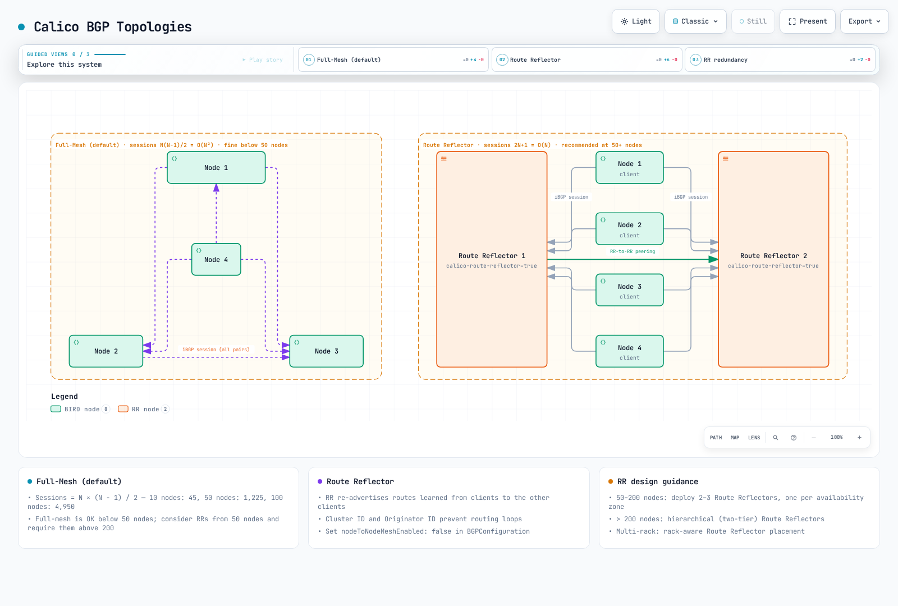

# Part 4: BGP Deep Dive

> **Supported Versions**: Calico v3.29+ / Kubernetes 1.28+ **Last Updated**: February 23, 2026

## Introduction

Border Gateway Protocol (BGP) is the routing protocol that powers the internet, and Calico leverages it to provide highly scalable, standards-based networking for Kubernetes clusters. Unlike overlay networks that encapsulate traffic, Calico's BGP-based networking enables native IP routing, delivering superior performance and seamless integration with existing network infrastructure.

This deep dive covers BGP fundamentals, Calico's BGP architecture options, configuration resources, and advanced deployment patterns for enterprise environments.

***

## BGP Fundamentals

### What is BGP?

BGP (Border Gateway Protocol) is a path-vector routing protocol designed to exchange routing information between autonomous systems. In Calico, BGP distributes pod IP routes across cluster nodes and optionally to external network infrastructure.

### Key BGP Concepts

| Concept                    | Description                                                          |
| -------------------------- | -------------------------------------------------------------------- |
| **Autonomous System (AS)** | A collection of IP networks under a single administrative domain     |
| **AS Number (ASN)**        | Unique identifier for an AS (16-bit: 1-65534, 32-bit: 1-4294967294)  |
| **iBGP**                   | Internal BGP - sessions between routers in the same AS               |
| **eBGP**                   | External BGP - sessions between routers in different ASes            |
| **NLRI**                   | Network Layer Reachability Information - the routes being advertised |
| **BGP Speaker**            | A router or software that participates in BGP                        |

### Private AS Number Ranges

For internal use within organizations, IANA reserves the following private ASN ranges:

```
16-bit Private ASN Range: 64512 - 65534
32-bit Private ASN Range: 4200000000 - 4294967294
```

Calico typically uses ASNs in the `64512-65534` range for cluster-internal BGP.

### BGP Route Selection Process

When a BGP speaker receives multiple routes to the same destination, it selects the best route using the following criteria (in order):


### iBGP vs eBGP Behavior

| Attribute               | iBGP                               | eBGP                                   |
| ----------------------- | ---------------------------------- | -------------------------------------- |
| AS\_PATH modification   | Not modified                       | Prepends local AS                      |
| Next-hop                | Not changed by default             | Changed to peering address             |
| Default TTL             | 255                                | 1 (multihop required for non-adjacent) |
| Route advertisement     | Only to eBGP peers (split-horizon) | To all peers                           |
| Administrative Distance | 200                                | 20                                     |

***

## Calico BGP Architecture



[🔍 View interactive diagram](https://www.atomai.click/kubernetes-docs/archmaps/en-networking-calico-04-bgp-deep-dive-9.html)

### BIRD: Calico's BGP Implementation

Calico uses BIRD (BIRD Internet Routing Daemon) as its BGP implementation. BIRD runs as part of the `calico-node` DaemonSet on every node.


### BGP Topology Options

Calico supports two primary BGP topologies:

1. **Node-to-Node Mesh (Full Mesh)** - Default configuration
2. **Route Reflectors** - Recommended for larger clusters

***

## Full-Mesh Topology

### How Full-Mesh Works

In the default full-mesh configuration, every Calico node establishes a BGP peering session with every other node in the cluster.


### Session Count Formula

The number of BGP sessions in a full-mesh topology grows quadratically:

```
Sessions = N × (N - 1) / 2

Examples:
- 10 nodes:   10 × 9 / 2 = 45 sessions
- 50 nodes:   50 × 49 / 2 = 1,225 sessions
- 100 nodes:  100 × 99 / 2 = 4,950 sessions
- 500 nodes:  500 × 499 / 2 = 124,750 sessions
```

### Full-Mesh Scaling Limitations

| Cluster Size  | BGP Sessions | Memory per Node | CPU Impact | Recommendation |
| ------------- | ------------ | --------------- | ---------- | -------------- |
| < 50 nodes    | < 1,225      | \~50 MB         | Minimal    | Full-mesh OK   |
| 50-100 nodes  | 1,225-4,950  | \~100 MB        | Low        | Consider RR    |
| 100-200 nodes | 4,950-19,900 | \~200 MB        | Moderate   | Use RR         |
| > 200 nodes   | > 19,900     | > 400 MB        | High       | Require RR     |

### Enabling/Disabling Node-to-Node Mesh

Check current status:

```bash
calicoctl get bgpconfiguration default -o yaml
```

Disable node-to-node mesh (when using Route Reflectors):

```yaml
apiVersion: projectcalico.org/v3
kind: BGPConfiguration
metadata:
  name: default
spec:
  nodeToNodeMeshEnabled: false
  asNumber: 64512
```

***

## Route Reflector Topology

### Route Reflector Concepts

Route Reflectors (RRs) solve the iBGP scalability problem by allowing a subset of nodes to reflect routes to other nodes. This eliminates the need for a full mesh.


### Route Reflector Key Attributes

| Attribute            | Description                                                   |
| -------------------- | ------------------------------------------------------------- |
| **Cluster ID**       | Identifies a set of RRs serving the same clients              |
| **Originator ID**    | Prevents routing loops (set to the router ID of originator)   |
| **Route Reflection** | RR re-advertises routes learned from clients to other clients |

### Session Count with Route Reflectors

With 2 Route Reflectors and N client nodes:

```
Sessions = 2 × N + 1 (RR-to-RR peering)

Examples:
- 100 nodes: 2 × 100 + 1 = 201 sessions (vs 4,950 in full-mesh)
- 500 nodes: 2 × 500 + 1 = 1,001 sessions (vs 124,750 in full-mesh)
```

### Configuring Route Reflector Nodes

**Step 1: Label nodes designated as Route Reflectors**

```bash
kubectl label node rr-node-1 calico-route-reflector=true
kubectl label node rr-node-2 calico-route-reflector=true
```

**Step 2: Configure Route Reflector cluster ID**

```yaml
apiVersion: projectcalico.org/v3
kind: Node
metadata:
  name: rr-node-1
  labels:
    calico-route-reflector: "true"
spec:
  bgp:
    ipv4Address: 10.0.1.10/24
    routeReflectorClusterID: 1.0.0.1
---
apiVersion: projectcalico.org/v3
kind: Node
metadata:
  name: rr-node-2
  labels:
    calico-route-reflector: "true"
spec:
  bgp:
    ipv4Address: 10.0.1.11/24
    routeReflectorClusterID: 1.0.0.1
```

**Step 3: Disable node-to-node mesh**

```yaml
apiVersion: projectcalico.org/v3
kind: BGPConfiguration
metadata:
  name: default
spec:
  nodeToNodeMeshEnabled: false
  asNumber: 64512
```

**Step 4: Configure BGP peering to Route Reflectors**

```yaml
# Peering from non-RR nodes to RR nodes
apiVersion: projectcalico.org/v3
kind: BGPPeer
metadata:
  name: peer-to-route-reflectors
spec:
  nodeSelector: "!has(calico-route-reflector)"
  peerSelector: has(calico-route-reflector)
---
# Peering between RR nodes
apiVersion: projectcalico.org/v3
kind: BGPPeer
metadata:
  name: route-reflector-mesh
spec:
  nodeSelector: has(calico-route-reflector)
  peerSelector: has(calico-route-reflector)
```

### Route Reflector Redundancy Patterns

**Pattern 1: Dual Route Reflectors (Small/Medium Clusters)**


**Pattern 2: Hierarchical Route Reflectors (Large Clusters)**


***

## BGPPeer Resource

The `BGPPeer` resource defines BGP peering relationships between Calico nodes and external BGP speakers.

### BGPPeer Scope Types

| Type              | Description          | Use Case                |
| ----------------- | -------------------- | ----------------------- |
| **Global**        | Applies to all nodes | External router peering |
| **Node-specific** | Uses nodeSelector    | Rack-local peering      |
| **Per-node**      | Specifies exact node | Special configurations  |

### Global BGPPeer Example

Peer all nodes with external ToR switches:

```yaml
apiVersion: projectcalico.org/v3
kind: BGPPeer
metadata:
  name: peer-to-tor-switches
spec:
  peerIP: 10.0.0.1
  asNumber: 65001
  # No nodeSelector means all nodes peer with this address
```

### Node-Specific BGPPeer Example

Peer nodes in specific racks with their local ToR switch:

```yaml
apiVersion: projectcalico.org/v3
kind: BGPPeer
metadata:
  name: rack1-tor-peer
spec:
  nodeSelector: rack == 'rack1'
  peerIP: 10.0.1.1
  asNumber: 65001
---
apiVersion: projectcalico.org/v3
kind: BGPPeer
metadata:
  name: rack2-tor-peer
spec:
  nodeSelector: rack == 'rack2'
  peerIP: 10.0.2.1
  asNumber: 65002
```

### BGPPeer with peerSelector

Use `peerSelector` to dynamically select Calico nodes as peers:

```yaml
apiVersion: projectcalico.org/v3
kind: BGPPeer
metadata:
  name: client-to-rr-peering
spec:
  nodeSelector: "!has(route-reflector)"
  peerSelector: has(route-reflector)
```

### Advanced BGPPeer Configuration

```yaml
apiVersion: projectcalico.org/v3
kind: BGPPeer
metadata:
  name: advanced-peer
spec:
  node: specific-node-name
  peerIP: 192.168.1.1
  asNumber: 65100

  # Authentication
  password:
    secretKeyRef:
      name: bgp-secrets
      key: peer-password

  # Timers (seconds)
  keepAliveTime: 30
  holdTime: 90

  # Source address for BGP session
  sourceAddress: 10.0.0.5

  # Maximum number of hops for eBGP multihop
  numAllowedLocalASNumbers: 2

  # TTL security (GTSM)
  ttlSecurity: 1

  # Filters
  filters:
    - action: Accept
      matchOperator: In
      cidr: 10.0.0.0/8
```

***

## BGPConfiguration Resource

The `BGPConfiguration` resource defines cluster-wide BGP settings.

### Basic BGPConfiguration

```yaml
apiVersion: projectcalico.org/v3
kind: BGPConfiguration
metadata:
  name: default
spec:
  # Cluster AS number
  asNumber: 64512

  # Node-to-node mesh (disable for Route Reflectors)
  nodeToNodeMeshEnabled: false

  # Log level for BIRD
  logSeverityScreen: Info
```

### Service IP Advertisement

Calico can advertise Kubernetes Service IPs via BGP, enabling external clients to reach services directly.

```yaml
apiVersion: projectcalico.org/v3
kind: BGPConfiguration
metadata:
  name: default
spec:
  asNumber: 64512
  nodeToNodeMeshEnabled: false

  # Advertise Service ClusterIPs
  serviceClusterIPs:
    - cidr: 10.96.0.0/12

  # Advertise Service ExternalIPs
  serviceExternalIPs:
    - cidr: 203.0.113.0/24

  # Advertise Service LoadBalancerIPs
  serviceLoadBalancerIPs:
    - cidr: 198.51.100.0/24
```

### BGP Communities Configuration

BGP communities allow you to tag routes for policy-based routing on external routers:

```yaml
apiVersion: projectcalico.org/v3
kind: BGPConfiguration
metadata:
  name: default
spec:
  asNumber: 64512

  # Community tagging for pod networks
  prefixAdvertisements:
    - cidr: 10.244.0.0/16
      communities:
        - "64512:100"  # Standard community
        - "64512:200"
    - cidr: 10.96.0.0/12
      communities:
        - "64512:300"  # Service IPs community

  # Named communities (referenced in other configs)
  communities:
    - name: pod-networks
      value: "64512:100"
    - name: service-networks
      value: "64512:300"
    - name: no-export
      value: "65535:65281"  # Well-known NO_EXPORT
```

### Node-Specific AS Number

For complex topologies, you can assign different AS numbers per node:

```yaml
apiVersion: projectcalico.org/v3
kind: Node
metadata:
  name: border-node-1
spec:
  bgp:
    ipv4Address: 10.0.1.10/24
    asNumber: 65001  # Override cluster default
```

***

## Service IP Advertisement

### Advertisement Types

| Type               | Description               | Use Case                |
| ------------------ | ------------------------- | ----------------------- |
| **ClusterIP**      | Internal service IP       | Internal load balancing |
| **ExternalIP**     | User-assigned external IP | Direct external access  |
| **LoadBalancerIP** | Cloud provider assigned   | Cloud integration       |

### ExternalIP Advertisement Example

```yaml
# BGPConfiguration for ExternalIP advertisement
apiVersion: projectcalico.org/v3
kind: BGPConfiguration
metadata:
  name: default
spec:
  serviceExternalIPs:
    - cidr: 203.0.113.0/24

---
# Service with ExternalIP
apiVersion: v1
kind: Service
metadata:
  name: my-external-service
spec:
  type: ClusterIP
  externalIPs:
    - 203.0.113.10
  selector:
    app: my-app
  ports:
    - port: 80
      targetPort: 8080
```

### LoadBalancer IP Advertisement

For bare-metal clusters without cloud provider integration:

```yaml
apiVersion: projectcalico.org/v3
kind: BGPConfiguration
metadata:
  name: default
spec:
  serviceLoadBalancerIPs:
    - cidr: 198.51.100.0/24

---
apiVersion: v1
kind: Service
metadata:
  name: my-lb-service
  annotations:
    metallb.universe.tf/loadBalancerIPs: 198.51.100.50
spec:
  type: LoadBalancer
  selector:
    app: my-app
  ports:
    - port: 443
      targetPort: 8443
```

### Selective Service Advertisement

Use annotations to control which services are advertised:

```yaml
apiVersion: v1
kind: Service
metadata:
  name: internal-only-service
  annotations:
    # Prevent BGP advertisement
    projectcalico.org/bgp-advertise: "false"
spec:
  type: LoadBalancer
  ...
```

***

## Physical Network Integration

### ToR Switch Configuration Examples

**Cisco NX-OS Configuration:**

```
! Configure BGP
router bgp 65001
  router-id 10.0.1.1

  ! Peer with Kubernetes nodes in rack
  neighbor 10.0.1.0/24 remote-as 64512

  address-family ipv4 unicast
    ! Accept pod network routes
    network 10.244.0.0/16
    ! Redistribute connected for node networks
    redistribute connected route-map KUBERNETES-NODES

    ! Route map for prefix filtering
    neighbor 10.0.1.0/24 route-map ACCEPT-K8S-ROUTES in
    neighbor 10.0.1.0/24 route-map DENY-ALL out

! Route map definitions
route-map ACCEPT-K8S-ROUTES permit 10
  match ip address prefix-list K8S-POD-NETS

ip prefix-list K8S-POD-NETS seq 10 permit 10.244.0.0/16 le 26
ip prefix-list K8S-POD-NETS seq 20 permit 10.96.0.0/12 le 32
```

**Arista EOS Configuration:**

```
! Configure BGP
router bgp 65001
  router-id 10.0.1.1

  ! Peer group for Kubernetes nodes
  neighbor K8S-NODES peer group
  neighbor K8S-NODES remote-as 64512
  neighbor K8S-NODES maximum-routes 10000
  neighbor K8S-NODES password 7 <encrypted>

  ! Dynamic neighbors from subnet
  bgp listen range 10.0.1.0/24 peer-group K8S-NODES

  address-family ipv4
    neighbor K8S-NODES activate
    neighbor K8S-NODES prefix-list K8S-PODS-IN in
    neighbor K8S-NODES prefix-list DENY-ALL out

! Prefix lists
ip prefix-list K8S-PODS-IN seq 10 permit 10.244.0.0/16 le 26
ip prefix-list K8S-PODS-IN seq 20 permit 10.96.0.0/12 le 32
ip prefix-list DENY-ALL seq 10 deny 0.0.0.0/0 le 32
```

**Juniper Junos Configuration:**

```
protocols {
    bgp {
        group K8S-NODES {
            type external;
            peer-as 64512;
            local-as 65001;

            multipath multiple-as;

            import K8S-IMPORT;
            export DENY-ALL;

            allow 10.0.1.0/24;

            authentication-key "$9$encrypted";
        }
    }
}

policy-options {
    prefix-list K8S-POD-NETS {
        10.244.0.0/16;
    }
    prefix-list K8S-SVC-NETS {
        10.96.0.0/12;
    }
    policy-statement K8S-IMPORT {
        term accept-pods {
            from {
                prefix-list K8S-POD-NETS;
                prefix-length-range /26-/26;
            }
            then accept;
        }
        term accept-services {
            from {
                prefix-list K8S-SVC-NETS;
            }
            then accept;
        }
        term reject-all {
            then reject;
        }
    }
    policy-statement DENY-ALL {
        then reject;
    }
}
```

### Spine-Leaf Architecture Integration


Calico configuration for spine-leaf:

```yaml
# Disable node-to-node mesh
apiVersion: projectcalico.org/v3
kind: BGPConfiguration
metadata:
  name: default
spec:
  nodeToNodeMeshEnabled: false
  asNumber: 64512

---
# Peer nodes with their local leaf switch
apiVersion: projectcalico.org/v3
kind: BGPPeer
metadata:
  name: rack1-leaf-peer
spec:
  nodeSelector: topology.kubernetes.io/zone == 'rack1'
  peerIP: 10.0.1.1
  asNumber: 65001

---
apiVersion: projectcalico.org/v3
kind: BGPPeer
metadata:
  name: rack2-leaf-peer
spec:
  nodeSelector: topology.kubernetes.io/zone == 'rack2'
  peerIP: 10.0.2.1
  asNumber: 65002

---
apiVersion: projectcalico.org/v3
kind: BGPPeer
metadata:
  name: rack3-leaf-peer
spec:
  nodeSelector: topology.kubernetes.io/zone == 'rack3'
  peerIP: 10.0.3.1
  asNumber: 65003
```

***

## BGP Community Tagging Strategy

### Community Design Patterns

| Community     | Meaning        | Action                           |
| ------------- | -------------- | -------------------------------- |
| `64512:100`   | Pod Networks   | Accept, normal routing           |
| `64512:200`   | Service IPs    | Accept, may apply special policy |
| `64512:300`   | Infrastructure | Higher priority routing          |
| `65535:65281` | NO\_EXPORT     | Do not advertise outside AS      |
| `65535:65282` | NO\_ADVERTISE  | Do not advertise to any peer     |

### Community-Based Traffic Engineering

```yaml
apiVersion: projectcalico.org/v3
kind: BGPConfiguration
metadata:
  name: default
spec:
  asNumber: 64512

  communities:
    - name: production
      value: "64512:100"
    - name: staging
      value: "64512:200"
    - name: local-only
      value: "65535:65281"  # NO_EXPORT

  prefixAdvertisements:
    # Production pod networks - advertise everywhere
    - cidr: 10.244.0.0/17
      communities:
        - production

    # Staging pod networks - keep local
    - cidr: 10.244.128.0/17
      communities:
        - staging
        - local-only

    # Service IPs
    - cidr: 10.96.0.0/12
      communities:
        - production
```

***

## BGP Security

### MD5 Authentication

Protect BGP sessions with MD5 authentication:

```yaml
# Create secret for BGP password
apiVersion: v1
kind: Secret
metadata:
  name: bgp-auth
  namespace: kube-system
type: Opaque
stringData:
  bgp-password: "SuperSecretPassword123!"

---
# Reference in BGPPeer
apiVersion: projectcalico.org/v3
kind: BGPPeer
metadata:
  name: secure-peer
spec:
  peerIP: 10.0.1.1
  asNumber: 65001
  password:
    secretKeyRef:
      name: bgp-auth
      key: bgp-password
```

### Prefix Filtering

Limit which prefixes are accepted/advertised:

```yaml
apiVersion: projectcalico.org/v3
kind: BGPFilter
metadata:
  name: allow-pod-nets-only
spec:
  exportV4:
    - action: Accept
      matchOperator: In
      cidr: 10.244.0.0/16
      prefixLength: "24-28"
    - action: Reject
      matchOperator: In
      cidr: 0.0.0.0/0

  importV4:
    - action: Accept
      matchOperator: In
      cidr: 10.0.0.0/8
    - action: Reject
      matchOperator: In
      cidr: 0.0.0.0/0

---
apiVersion: projectcalico.org/v3
kind: BGPPeer
metadata:
  name: filtered-peer
spec:
  peerIP: 10.0.1.1
  asNumber: 65001
  filters:
    - allow-pod-nets-only
```

### GTSM (TTL Security)

Generalized TTL Security Mechanism prevents spoofed BGP packets:

```yaml
apiVersion: projectcalico.org/v3
kind: BGPPeer
metadata:
  name: gtsm-enabled-peer
spec:
  peerIP: 10.0.1.1
  asNumber: 65001
  ttlSecurity: 1  # Expect TTL of 254 or higher
```

***

## Performance Tuning

### BGP Timer Configuration

```yaml
apiVersion: projectcalico.org/v3
kind: BGPPeer
metadata:
  name: tuned-peer
spec:
  peerIP: 10.0.1.1
  asNumber: 65001

  # Keepalive interval (default: 60s)
  keepAliveTime: 20

  # Hold time (default: 180s, must be 3x keepalive)
  holdTime: 60
```

### Route Aggregation

Reduce the number of routes advertised by aggregating pod CIDRs:

```yaml
apiVersion: projectcalico.org/v3
kind: BGPConfiguration
metadata:
  name: default
spec:
  asNumber: 64512

  # Aggregate individual /26 pod CIDRs into /16
  prefixAdvertisements:
    - cidr: 10.244.0.0/16
      communities:
        - "64512:100"
```

### Graceful Restart

Enable BGP Graceful Restart to minimize traffic disruption during BIRD restarts:

```yaml
apiVersion: projectcalico.org/v3
kind: BGPConfiguration
metadata:
  name: default
spec:
  asNumber: 64512

  # Enable graceful restart (BIRD default is enabled)
  # Stale route time in seconds
  nodeMeshMaxRestartTime: 120
```

***

## Debugging BGP

### birdcl Commands

Access BIRD command-line interface from a calico-node pod:

```bash
# Enter calico-node pod
kubectl exec -it -n kube-system calico-node-xxxxx -c calico-node -- /bin/sh

# Show BGP protocol status
birdcl -s /var/run/calico/bird.ctl show protocols all

# Show BGP neighbors
birdcl -s /var/run/calico/bird.ctl show protocols all bgp*

# Show routing table
birdcl -s /var/run/calico/bird.ctl show route

# Show routes to specific prefix
birdcl -s /var/run/calico/bird.ctl show route for 10.244.1.0/24

# Show route export to specific peer
birdcl -s /var/run/calico/bird.ctl show route export Mesh_10_0_1_11

# Show BGP neighbor details
birdcl -s /var/run/calico/bird.ctl show protocols all Mesh_10_0_1_11
```

### Common BGP Issues and Solutions

| Issue                    | Symptoms                      | Solution                              |
| ------------------------ | ----------------------------- | ------------------------------------- |
| Sessions stuck in Active | No routes learned             | Check firewall (TCP 179), AS numbers  |
| Routes not propagating   | Pods unreachable across racks | Verify node-to-node mesh or RR config |
| Route flapping           | Intermittent connectivity     | Check BGP timers, network stability   |
| Session resets           | Frequent Established->Active  | Check MTU, MD5 passwords              |

### Diagnostic Commands

```bash
# Check Calico node status
calicoctl node status

# List all BGP peers
calicoctl get bgppeers -o wide

# Check BGP configuration
calicoctl get bgpconfiguration default -o yaml

# View BIRD logs
kubectl logs -n kube-system calico-node-xxxxx -c calico-node | grep -i bird

# Check IP routes on node
ip route show | grep bird
```

***

## Multi-Rack and Multi-Datacenter Design

### Multi-Rack with Route Reflectors


### Multi-Datacenter BGP Design


Configuration for multi-datacenter:

```yaml
# DC1 Configuration
apiVersion: projectcalico.org/v3
kind: BGPConfiguration
metadata:
  name: default
spec:
  asNumber: 64512
  nodeToNodeMeshEnabled: false

  communities:
    - name: dc1-origin
      value: "64512:1"

---
# Peer DC1 RRs with WAN routers
apiVersion: projectcalico.org/v3
kind: BGPPeer
metadata:
  name: dc1-to-wan
spec:
  nodeSelector: has(route-reflector)
  peerIP: 10.255.0.1  # WAN Router
  asNumber: 65000
```

***

## Best Practices Summary

### Design Recommendations

1. **Cluster Size < 50 nodes**: Full-mesh is acceptable
2. **Cluster Size 50-200 nodes**: Deploy 2-3 Route Reflectors
3. **Cluster Size > 200 nodes**: Deploy hierarchical Route Reflectors
4. **Multi-rack**: Use rack-aware Route Reflector placement
5. **Multi-datacenter**: Use separate AS per DC with eBGP between DCs

### Security Recommendations

1. Always enable MD5 authentication for external peers
2. Implement prefix filtering to prevent route injection
3. Use GTSM (TTL Security) where supported
4. Limit maximum routes accepted per peer
5. Monitor BGP sessions for anomalies

### Operational Recommendations

1. Label nodes consistently for BGP topology
2. Document AS number allocation scheme
3. Implement BGP monitoring and alerting
4. Test failover scenarios regularly
5. Keep BGP timers consistent across peers

***

## References

* [Calico BGP Documentation](https://docs.tigera.io/calico/latest/networking/configuring/bgp)
* [BIRD Internet Routing Daemon](https://bird.network.cz/)
* [RFC 4271 - BGP-4](https://tools.ietf.org/html/rfc4271)
* [RFC 4456 - BGP Route Reflection](https://tools.ietf.org/html/rfc4456)
* [RFC 5765 - GTSM for BGP](https://tools.ietf.org/html/rfc5082)
