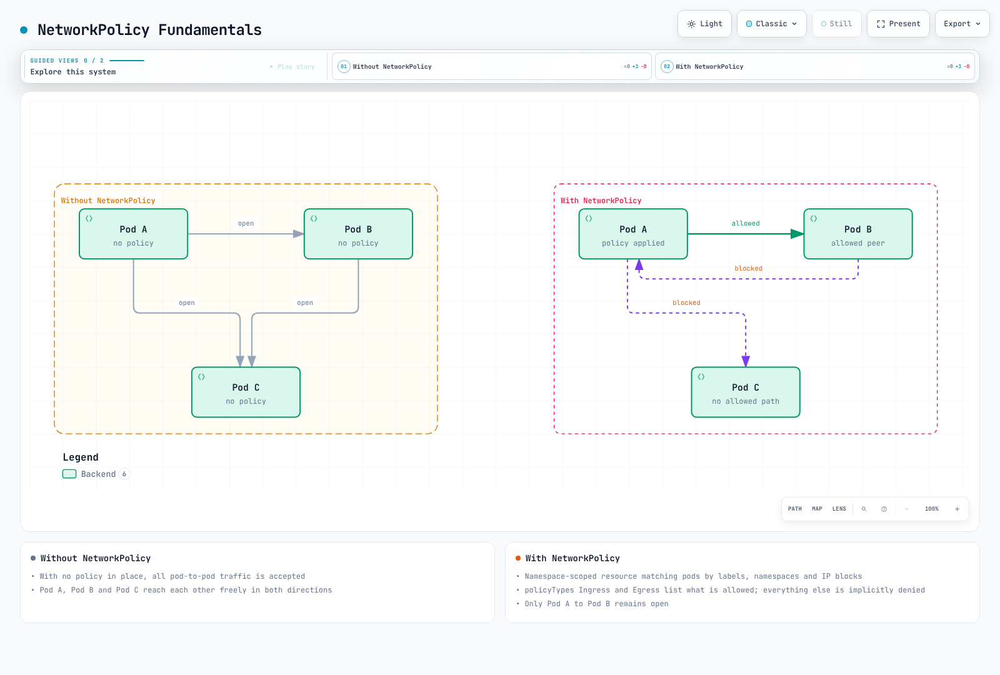

# Part 5: Network Policy

> **Review baseline**: Calico 3.32.2; Kubernetes 1.34–1.36 is Calico 3.32's tested range. **Last Updated**: September 12, 2026.
>
> Examples assume the standard Calico API server (`projectcalico.org/v3`), Kubernetes datastore and a compatible policy-enforcing dataplane. Use a dedicated `calico-demo` namespace with known workload labels, ready endpoints and a working baseline before applying policies. The sections are independent patterns, not a single manifest bundle. Existing higher-priority policies, DNS implementation, Service NAT, host policy and application behavior affect results. No production cluster, admission server or packet-forwarding test was run for this review.

## Introduction

Network policies control permitted connections between workloads and other endpoints. Calico adds ordered policy, explicit actions, global scope and host endpoint controls to the standard Kubernetes API. Feature availability depends on the product and enforcement path: DNS-domain policy is a commercial extension, while Open Source HTTP policy requires the documented Istio/Dikastes integration.

This deep dive covers both Kubernetes standard policies and Calico's extended capabilities, providing patterns and examples for enterprise security requirements.

***

## Kubernetes Standard NetworkPolicy

### NetworkPolicy Fundamentals

Kubernetes NetworkPolicy is a namespace-scoped resource that selects Pods. Ingress and egress isolation are independent; the allowed traffic for each isolated direction is the union of matching Kubernetes policies. If both ends are isolated, the source's egress and destination's ingress must allow a new connection. Replies to an allowed connection do not need a separate reverse-direction allow rule.

Entries in a `from`/`to` list are **OR** alternatives. A `namespaceSelector` and `podSelector` in the same entry are **AND** conditions. A pod selector without a namespace selector refers to the policy's namespace.

No applicable Kubernetes policy means no isolation by that API for the direction; it does not override host firewalls, Calico policies or other controls. Policy changes and existing connections are implementation dependent, so validate with new connections. The `ipBlock` address observed before/after Service or load-balancer NAT also depends on the implementation.



[🔍 View interactive diagram](https://www.atomai.click/kubernetes-docs/archmaps/en-networking-calico-05-network-policy-0.html)

> Arrows represent new connections under the illustrated policies, not response packets of an allowed connection. The example assumes no other policy, firewall or path restriction; merely having any NetworkPolicy does not isolate every Pod/direction.

### Basic NetworkPolicy Structure

```yaml
apiVersion: networking.k8s.io/v1
kind: NetworkPolicy
metadata:
  name: example-policy
  namespace: calico-demo
spec:
  # Which pods this policy applies to
  podSelector:
    matchLabels:
      app: web

  # Policy types: Ingress, Egress, or both
  policyTypes:
    - Ingress
    - Egress

  # Ingress rules (who can connect TO these pods)
  ingress:
    - from:
        - podSelector:
            matchLabels:
              app: frontend
        - namespaceSelector:
            matchLabels:
              purpose: monitoring
        - ipBlock:
            cidr: 10.0.0.0/8
            except:
              - 10.0.1.0/24
      ports:
        - protocol: TCP
          port: 8080

  # Egress rules (where these pods can connect TO)
  egress:
    - to:
        - podSelector:
            matchLabels:
              app: database
      ports:
        - protocol: TCP
          port: 5432
```

### Kubernetes NetworkPolicy Limitations

| Capability | Kubernetes NetworkPolicy | Calico extension / prerequisite |
| --- | --- | --- |
| Scope | Namespaced Pod policy | GlobalNetworkPolicy can select workloads across namespaces and HostEndpoints |
| Ordering/actions | Additive allow rules; no user-defined policy order | Tier/order and Allow, Deny, Log, Pass |
| Ports | TCP/UDP/SCTP, named ports, numeric ranges via `endPort` (stable since 1.25; plugin support required) | Calico port-range syntax and additional IP protocol/ICMP matches |
| HTTP methods/paths | Not part of this API | Open Source `http` rules require configured Istio/Dikastes application-layer enforcement |
| DNS domain names | Not part of this API | For example, Calico Enterprise domain-policy capability; `domains` is absent from the Open Source 3.32 CRD |
| Host interfaces | Not a general node firewall | HostEndpoint policy with separate local/forwarded/failsafe semantics |

The standard NetworkPolicy object's scope is distinct from newer Kubernetes cluster-policy APIs; do not assume that all Kubernetes network security APIs are namespace-only. Check the selected dataplane's protocol and logging support rather than equating schema acceptance with enforcement.

***

## Calico NetworkPolicy Extensions

### Extended Protocol Support

The SCTP examples require a compatible classic dataplane: Calico 3.32 eBPF does not support SCTP policy or Services.

Calico supports additional protocols beyond TCP and UDP:

```yaml
apiVersion: projectcalico.org/v3
kind: NetworkPolicy
metadata:
  name: extended-protocols
  namespace: calico-demo
spec:
  selector: app == 'network-tools'

  ingress:
    # ICMP ping
    - action: Allow
      protocol: ICMP
      icmp:
        type: 8  # Echo Request
        code: 0

    # ICMPv6
    - action: Allow
      protocol: ICMPv6
      icmp:
        type: 128  # Echo Request

    # SCTP
    - action: Allow
      protocol: SCTP
      destination:
        ports:
          - 3868  # Diameter

    # UDP with port range
    - action: Allow
      protocol: UDP
      destination:
        ports:
          - "5000:6000"  # Port range
```

### Port Ranges and Named Ports

```yaml
apiVersion: projectcalico.org/v3
kind: NetworkPolicy
metadata:
  name: port-examples
  namespace: calico-demo
spec:
  selector: app == 'multi-port-app'

  ingress:
    # Port range
    - action: Allow
      protocol: TCP
      destination:
        ports:
          - "8080:8090"

    # Named ports (from pod spec)
    - action: Allow
      protocol: TCP
      destination:
        ports:
          - http      # References containerPort name
          - metrics   # References containerPort name

    # Mix of specific ports and ranges
    - action: Allow
      protocol: TCP
      destination:
        ports:
          - 22
          - 80
          - 443
          - "3000:3100"
```

### Enhanced Selector Syntax

Calico uses expression selectors. The following rules illustrate alternatives: combining every broad Allow into one policy widens the permitted set. `app != 'untrusted'` also matches resources without the label; it is not evidence of trust.

`selector: !has(x)` matches known in-scope resources lacking the label. `notSelector: has(x)` negates the packet match and can also match external addresses absent from that selector. A rule's `selector: all()` does not match every packet; omit endpoint selector conditions to match all packets.

```yaml
apiVersion: projectcalico.org/v3
kind: NetworkPolicy
metadata:
  name: selector-examples
  namespace: calico-demo
spec:
  # Label equality
  selector: app == 'web'

  ingress:
    # Set membership
    - action: Allow
      source:
        selector: app in {'frontend', 'api-gateway', 'monitoring'}

    # Negation
    - action: Allow
      source:
        selector: app != 'untrusted'

    # Label existence
    - action: Allow
      source:
        selector: has(security-cleared)

    # Combining conditions (AND)
    - action: Allow
      source:
        selector: app == 'backend' && tier == 'internal'

    # OR inside one selector expression
    - action: Allow
      source:
        selector: (app == 'frontend') || (app == 'api')

    # Namespace selector
    - action: Allow
      source:
        namespaceSelector: environment == 'production'
        selector: app == 'authorized-client'
```

***

## GlobalNetworkPolicy

GlobalNetworkPolicy is non-namespaced and can select workload endpoints across namespaces or HostEndpoints. `selector: all()` alone is not “only all application Pods.” These examples explicitly limit the selected workloads to the demo namespace, preserving system and host traffic.

### Default Deny with Explicit Exceptions

The empty policy selects both directions. Its omitted `order` follows explicitly ordered policies; 10,000 is not a special “lowest priority” value. Empty rules do not override an earlier terminal Allow. Use a separately controlled earlier tier for restrictions that application policies must not override.

```yaml
apiVersion: projectcalico.org/v3
kind: GlobalNetworkPolicy
metadata:
  name: default.demo-default-deny
spec:
  tier: default
  namespaceSelector: kubernetes.io/metadata.name == 'calico-demo'
  types: [Ingress, Egress]
  ingress: []
  egress: []
---
apiVersion: projectcalico.org/v3
kind: GlobalNetworkPolicy
metadata:
  name: default.demo-essential-egress
spec:
  tier: default
  order: 100
  namespaceSelector: kubernetes.io/metadata.name == 'calico-demo'
  selector: needs-platform == 'true'
  types: [Egress]
  egress:
    - action: Allow
      protocol: UDP
      destination:
        namespaceSelector: kubernetes.io/metadata.name == 'kube-system'
        selector: k8s-app == 'kube-dns'
        ports: [53]
    - action: Allow
      protocol: TCP
      destination:
        namespaceSelector: kubernetes.io/metadata.name == 'kube-system'
        selector: k8s-app == 'kube-dns'
        ports: [53]
    - action: Allow
      destination:
        services:
          name: kubernetes
          namespace: default
```

This example grants platform egress only to workloads labeled `needs-platform=true`. The Service match follows the actual `kubernetes/default` endpoints and ports on the **Kubernetes datastore**; it is ignored with an etcd datastore. Do not mix that Service match with destination ports, CIDRs or selectors. Network access to the API is distinct from API authentication/RBAC.

Confirm the actual DNS deployment. Namespace plus Pod selectors prevent an unrelated Pod labeled `kube-dns` from becoming a trusted resolver. Node-local DNS requires a different match for the actual path. Creating an empty policy on `kube-system` before enumerating system dependencies can break the cluster; demonstrate that pattern in a separate test namespace instead.

### An Earlier Egress Guardrail

This independent example blocks the IPv4 metadata address for selected demo workloads, then delegates other traffic at the end of its tier. It does not claim complete SSRF protection, protection of privileged/host-networked processes, or coverage of every platform metadata endpoint.

```yaml
apiVersion: projectcalico.org/v3
kind: Tier
metadata:
  name: egress-guardrail
spec:
  order: 50
  defaultAction: Pass
---
apiVersion: projectcalico.org/v3
kind: GlobalNetworkPolicy
metadata:
  name: egress-guardrail.block-imds-v4
spec:
  tier: egress-guardrail
  order: 10
  namespaceSelector: kubernetes.io/metadata.name == 'calico-demo'
  types: [Egress]
  egress:
    - action: Deny
      destination:
        nets: [169.254.169.254/32]
```

Do not place an unconditional Pass before later restrictions in the same tier. Preserve platform-required identity/DNS paths and review the actual workload-to-host enforcement behavior.

***

## NetworkSet and GlobalNetworkSet

NetworkSets label reusable IP/CIDR groups; policy selectors reference their labels, not their object names. The address examples below are illustrative and are not a real country/threat feed. A label selector may also match endpoints carrying the same labels, so use controlled labels and the intended namespace/global scope.

Use `namespaceSelector: global()` in a namespaced policy's entity match when selecting a GlobalNetworkSet. Namespaced NetworkSets remain in their selected namespace. If trusted and blocked ranges overlap, evaluate the deny first; an earlier Allow is terminal.

### NetworkSet (Namespace-scoped)

```yaml
apiVersion: projectcalico.org/v3
kind: NetworkSet
metadata:
  name: corporate-networks
  namespace: calico-demo
  labels:
    network-type: corporate
spec:
  nets:
    - 10.0.0.0/8
    - 172.16.0.0/12
    - 192.168.0.0/16

---
# Reference in policy
apiVersion: projectcalico.org/v3
kind: NetworkPolicy
metadata:
  name: allow-corporate
  namespace: calico-demo
spec:
  selector: app == 'internal-app'

  ingress:
    - action: Allow
      source:
        selector: network-type == 'corporate'  # References NetworkSet by label
```

### GlobalNetworkSet (Cluster-scoped)

```yaml
apiVersion: projectcalico.org/v3
kind: GlobalNetworkSet
metadata:
  name: external-trusted-ips
  labels:
    network-group: external-trusted
spec:
  nets:
    - 203.0.113.0/24     # Partner network
    - 198.51.100.0/24    # CDN network
    - 192.0.2.50/32      # Specific trusted IP

---
apiVersion: projectcalico.org/v3
kind: GlobalNetworkSet
metadata:
  name: demo-blocked-networks
  labels:
    network-group: blocked
spec:
  nets:
    # Illustrative test ranges, not geolocation or threat intelligence
    - 192.0.2.128/25
    - 203.0.113.128/25

---
# Reference in GlobalNetworkPolicy
apiVersion: projectcalico.org/v3
kind: GlobalNetworkPolicy
metadata:
  name: external-access-control
spec:
  namespaceSelector: kubernetes.io/metadata.name == 'calico-demo'
  selector: has(external-facing)
  order: 200
  types:
    - Ingress

  ingress:
    # Deny overlaps before considering trusted ranges.
    - action: Deny
      source:
        namespaceSelector: global()
        selector: network-group == 'blocked'
    - action: Allow
      source:
        namespaceSelector: global()
        selector: network-group == 'external-trusted'
```

***

## Tiered Policies

Tiers are available in Calico Open Source 3.32. They group namespaced and global Calico policies; they are not a progression from Kubernetes NetworkPolicy to GlobalNetworkPolicy.

### Evaluation and Defaults

For normal endpoint policy, evaluate tiers by increasing `order`, then policies within each tier by increasing `order`. An unset policy order follows explicitly ordered policies. Consider the selected endpoint **and traffic direction**.

| Situation | Result |
| --- | --- |
| No policy in the tier selects that endpoint/direction | Skip the tier |
| A rule Allows or Denies | Finish this endpoint/direction's policy decision |
| A rule Logs | Continue to the next rule |
| A rule Passes | Skip the remaining policies in this tier and try the next applicable tier |
| Applicable tier has no terminal rule match | Apply its `defaultAction`, which defaults to Deny |
| Last applicable tier Passes | Evaluate endpoint Profiles; no profile allow means deny |

This is not “no rule matches, therefore always move to the next tier.” Also, an Allow at one endpoint does not bypass the other endpoint's policy. Pre-DNAT and untracked host policy have different fall-through behavior, covered below.

The built-in `default` tier has fixed order **1,000,000**, not 1,000 or infinity. Kubernetes NetworkPolicy and Calico policies without an explicit tier belong there. Current `kube-admin` and `kube-baseline` tiers use 1,000 and 10,000,000 with Pass defaults for the corresponding Kubernetes cluster-policy integration; therefore `default` is not universally the last possible tier.

### Separate Security, Platform and Application Decisions

These example tiers use end-of-tier Pass for security/platform so all their applicable rules are checked before delegation. Tier creation and reordering require centrally controlled privileges.

```yaml
apiVersion: projectcalico.org/v3
kind: Tier
metadata:
  name: security
spec:
  order: 100
  defaultAction: Pass
---
apiVersion: projectcalico.org/v3
kind: Tier
metadata:
  name: platform
spec:
  order: 200
  defaultAction: Pass
---
apiVersion: projectcalico.org/v3
kind: Tier
metadata:
  name: application
spec:
  order: 500
  defaultAction: Deny
```

The example below uses a documentation-only threat address, then a separate restricted-data rule. A Pass at the end of the first security policy would skip the second policy. Keeping delegation at the **end of the tier** avoids that bypass. The restricted-data labels illustrate segmentation, not complete PCI DSS compliance.

```yaml
apiVersion: projectcalico.org/v3
kind: GlobalNetworkSet
metadata:
  name: demo-threats
  labels:
    network-group: demo-threat
spec:
  nets:
    - 192.0.2.100/32
---
apiVersion: projectcalico.org/v3
kind: GlobalNetworkPolicy
metadata:
  name: security.block-threats
spec:
  tier: security
  order: 10
  namespaceSelector: kubernetes.io/metadata.name == 'calico-demo'
  types: [Ingress, Egress]
  ingress:
    - action: Deny
      source:
        namespaceSelector: global()
        selector: network-group == 'demo-threat'
  egress:
    - action: Deny
      destination:
        namespaceSelector: global()
        selector: network-group == 'demo-threat'
---
apiVersion: projectcalico.org/v3
kind: GlobalNetworkPolicy
metadata:
  name: security.restricted-data
spec:
  tier: security
  order: 20
  namespaceSelector: kubernetes.io/metadata.name == 'calico-demo'
  selector: data-scope == 'restricted'
  types: [Ingress]
  ingress:
    - action: Deny
      source:
        notSelector: data-scope == 'restricted'
---
apiVersion: projectcalico.org/v3
kind: GlobalNetworkPolicy
metadata:
  name: platform.dns
spec:
  tier: platform
  order: 10
  namespaceSelector: kubernetes.io/metadata.name == 'calico-demo'
  types: [Egress]
  egress:
    - action: Allow
      protocol: UDP
      destination:
        namespaceSelector: kubernetes.io/metadata.name == 'kube-system'
        selector: k8s-app == 'kube-dns'
        ports: [53]
    - action: Allow
      protocol: TCP
      destination:
        namespaceSelector: kubernetes.io/metadata.name == 'kube-system'
        selector: k8s-app == 'kube-dns'
        ports: [53]
---
apiVersion: projectcalico.org/v3
kind: NetworkPolicy
metadata:
  name: application.frontend
  namespace: calico-demo
spec:
  tier: application
  order: 10
  selector: app == 'frontend'
  types: [Ingress, Egress]
  ingress:
    - action: Allow
      protocol: TCP
      source:
        selector: app == 'gateway'
      destination:
        ports: [8080]
  egress:
    - action: Allow
      protocol: TCP
      destination:
        selector: app == 'backend'
        ports: [8080]
```

`namespaceSelector: global()` plus a separate label selector selects the GlobalNetworkSet. `global(label == 'value')` is not valid syntax. The platform DNS Allow is an intentional terminal exception for the selected workload's egress; application-tier rules cannot subsequently narrow that exception. The application policy governs only the selected frontend, not every workload in the namespace.

The DNS example assumes conventional CoreDNS Pods with verified namespace/labels. NodeLocal DNSCache or EKS Auto Mode node-local DNS needs rules for the actual resolver path, not a Pod selector copied unchanged. Keep access to the required resolver and validate both UDP and TCP queries.

### Tier RBAC Integration

Calico tier RBAC uses the pseudo-resources `tier.networkpolicies` and `tier.globalnetworkpolicies`, plus `get` on the target Tier. The Calico authorizer explicitly checks synthetic names such as `application.*`. This is not a general Kubernetes `resourceNames` wildcard on ordinary `networkpolicies`.

The following complete binding example grants one service account namespaced policy editing in the application tier. It does not grant tier creation/reordering or global policy administration.

```yaml
apiVersion: v1
kind: ServiceAccount
metadata:
  name: policy-editor
  namespace: calico-demo
---
apiVersion: rbac.authorization.k8s.io/v1
kind: ClusterRole
metadata:
  name: demo-get-application-tier
rules:
  - apiGroups: ["projectcalico.org"]
    resources: ["tiers"]
    resourceNames: ["application"]
    verbs: ["get"]
---
apiVersion: rbac.authorization.k8s.io/v1
kind: ClusterRoleBinding
metadata:
  name: demo-get-application-tier
subjects:
  - kind: ServiceAccount
    name: policy-editor
    namespace: calico-demo
roleRef:
  apiGroup: rbac.authorization.k8s.io
  kind: ClusterRole
  name: demo-get-application-tier
---
apiVersion: rbac.authorization.k8s.io/v1
kind: Role
metadata:
  name: demo-edit-application-policies
  namespace: calico-demo
rules:
  - apiGroups: ["projectcalico.org"]
    resources: ["tier.networkpolicies"]
    resourceNames: ["application.*"]
    verbs: ["get", "list", "watch", "create", "update", "patch", "delete"]
---
apiVersion: rbac.authorization.k8s.io/v1
kind: RoleBinding
metadata:
  name: demo-edit-application-policies
  namespace: calico-demo
subjects:
  - kind: ServiceAccount
    name: policy-editor
    namespace: calico-demo
roleRef:
  apiGroup: rbac.authorization.k8s.io
  kind: Role
  name: demo-edit-application-policies
```

Global policy editing uses `tier.globalnetworkpolicies` in a deliberately scoped ClusterRole/ClusterRoleBinding. Keep `get` on the intended Tier separate from permissions to modify Tier order.

The example assumes the standard Calico aggregated API server. Native v3 CRDs use an admission webhook for tier authorization of create/update/delete; that webhook cannot restrict GET/LIST/WATCH. Do not claim identical read isolation between the two modes. Plain `kubectl auth can-i` does not validate the combined Calico tier checks: test actual allowed and forbidden requests in an isolated environment with a principal that has no broader bindings. Kubernetes RBAC is additive, so an existing broad grant can defeat this intended restriction.

***

## FQDN-Based Egress Policy

The Open Source 3.32 CRD has no `destination.domains` or Felix `dnsTrustedServers` field. Setting `policySyncPathPrefix` enables the policy-sync path used by application-layer integrations; it does not add DNS-domain policy to Open Source.

Calico Enterprise 3.23 documents DNS-domain matches on **egress Allow** rules. The controller learns A/AAAA/CNAME answers from trusted DNS servers and permits matching destination IPs. This is IP-based enforcement, not HTTPS hostname authentication, so shared destination IPs and application identity still matter. Use workload/Service selectors for in-cluster services.

The following commercial example assumes that feature is enabled, the trusted resolver is verified, and no earlier terminal Allow bypasses it. Each rule has one `destination` map; repeating that YAML key could silently discard its domain restriction.

```yaml
# Calico Enterprise 3.23 example; NOT an Open Source 3.32 resource.
apiVersion: projectcalico.org/v3
kind: NetworkPolicy
metadata:
  name: allow-approved-domains
  namespace: calico-demo
spec:
  selector: app == 'external-api-client'
  types: [Egress]
  egress:
    - action: Allow
      protocol: UDP
      destination:
        namespaceSelector: kubernetes.io/metadata.name == 'kube-system'
        selector: k8s-app == 'kube-dns'
        ports: [53]
    - action: Allow
      protocol: TCP
      destination:
        namespaceSelector: kubernetes.io/metadata.name == 'kube-system'
        selector: k8s-app == 'kube-dns'
        ports: [53]
    - action: Allow
      protocol: TCP
      destination:
        domains:
          - api.github.com
          - "*.example.com"
        ports: [443]
```

Replace the documentation domain with an approved real domain. `*.example.com` matches `api.example.com` and `deep.api.example.com`, but not the apex `example.com`. The wildcard must occupy a complete component and only one wildcard is supported. Inline DNS policy mode supports prefix wildcards; non-prefix wildcard patterns require an appropriate documented mode. A broad suffix such as `*.amazonaws.com` is not an AWS account or IAM boundary.

Keep the actual resolver reachable over UDP and TCP and align its IPs with the trusted DNS configuration. Node-local resolvers require deployment-specific handling. The commercial guide excludes domain policy on the egress hook of egress-gateway Pods because its node-wide DNS cache can make matches absent or intermittent.

On Open Source, use an explicit egress proxy/gateway with its own application authorization, or maintained IP/CIDR NetworkSets when suitable. Do not substitute a one-time DNS lookup for a continuously enforced domain policy.

***

## HTTP Method Filtering (Layer 7)

Calico Open Source 3.32 supports HTTP policy through the documented **Istio + Dikastes** integration. Merely installing an arbitrary Envoy proxy or adding an `http` field to a normal CNI policy does not enable Layer 7 enforcement.

Prerequisites include the Felix Policy Sync API, the Calico CSI socket mount, Dikastes injection and Envoy external authorization on the relevant traffic path. The current integration guide describes Kubernetes native-sidecar Istio injection and recommends Istio 1.28.1; that statement is not a blanket compatibility promise for every newer Istio. Check the maintained [Istio installation guide](../../service-mesh/istio/01-installation.md), both projects' support windows and the actual integration before selecting a production combination. No such integration deployment was run here.

These are **ingress Allow** examples on an already integrated workload. HTTPS methods/paths require the enforcement proxy to see the HTTP request after TLS termination. Source Pod labels identify workloads, not authenticated end users; configure the integration's trusted workload identity/mTLS path and preserve the network access needed by DNS and the Istio control plane. Validate allowed and denied requests, including proxy/authorization-service failure behavior, before relying on the policy.

### HTTP Match Rules

```yaml
apiVersion: projectcalico.org/v3
kind: GlobalNetworkPolicy
metadata:
  name: l7-http-policy
spec:
  namespaceSelector: kubernetes.io/metadata.name == 'calico-demo'
  selector: app == 'api-server'
  order: 300
  types:
    - Ingress

  ingress:
    # Allow only GET and HEAD for read-only clients
    - action: Allow
      source:
        selector: role == 'reader'
      http:
        methods:
          - GET
          - HEAD
        paths:
          - prefix: /api/v1/

    # Allow the listed methods for admin-labeled workloads
    - action: Allow
      source:
        selector: role == 'admin'
      http:
        methods:
          - GET
          - POST
          - PUT
          - DELETE
          - PATCH

    # Allow health checks
    - action: Allow
      http:
        methods:
          - GET
        paths:
          - exact: /health
          - exact: /ready
```

### Path-Based Filtering

```yaml
apiVersion: projectcalico.org/v3
kind: NetworkPolicy
metadata:
  name: path-based-policy
  namespace: calico-demo
spec:
  selector: app == 'web-app'

  ingress:
    # Public endpoints
    - action: Allow
      http:
        paths:
          - prefix: /public/
          - exact: /

    # Admin endpoints - restricted
    - action: Allow
      source:
        selector: role == 'admin'
      http:
        paths:
          - prefix: /admin/

    # API endpoints - authenticated only
    - action: Allow
      source:
        selector: has(api-access)
      http:
        paths:
          - prefix: /api/
```

***

## Host Endpoint Protection

HostEndpoint represents an interface on a node that Calico manages. Creating one can change host connectivity immediately. `defaultEndpointToHostAction` controls workload-to-local-host behavior; it does not create HostEndpoints. `Installation.calicoNetwork.hostPorts` controls hostPort support, not automatic host protection.

### Manual Host Endpoint and Policy

The following **field example is not a complete host firewall**. It assumes a self-managed test worker `demo-worker` at `10.0.1.10`, bastion `10.0.0.100`, control-plane source `10.0.1.5` and interface `eth0`. Replace them with verified identities/addresses and prepare all required management, DNS, DHCP, BGP, API, health and egress rules before creating the HostEndpoint. It does not model an EKS-managed control-plane node.

```yaml
apiVersion: projectcalico.org/v3
kind: GlobalNetworkPolicy
metadata:
  name: default.demo-worker-ingress
spec:
  order: 100
  selector: host-demo == 'true' && !has(projectcalico.org/namespace)
  types: [Ingress]
  ingress:
    - action: Allow
      protocol: TCP
      source:
        nets: [10.0.0.100/32]
      destination:
        ports: [22]
    - action: Allow
      protocol: TCP
      source:
        nets: [10.0.1.5/32]
      destination:
        ports: [10250]
---
apiVersion: projectcalico.org/v3
kind: HostEndpoint
metadata:
  name: demo-worker-eth0
  labels:
    host-demo: "true"
spec:
  node: demo-worker
  interfaceName: eth0
  expectedIPs: [10.0.1.10]
```

The kubelet rule targets the worker's authenticated 10250 endpoint. Do not open the obsolete unauthenticated 10255 read-only port as a default requirement. The example defines ingress only; a manually created HostEndpoint without an egress policy/profile may deny host-originated traffic. Complete the actual baseline first.

Calico's default failsafes include inbound TCP 22 and other connectivity ports. They bypass the restrictive intent of the SSH rule above, so this rule alone does **not** limit SSH to the bastion. Review the failsafe list and a tested recovery path before changing it; do not blindly empty the lists.

### Automatic Host Endpoints

The node controller's `KubeControllersConfiguration.spec.controllers.node.hostEndpoint.autoCreate` controls automatic creation. Use a merge patch to preserve other controller settings:

```bash
kubectl get kubecontrollersconfiguration.projectcalico.org default -o yaml
# Apply only after reviewing existing host endpoints and global policies.
kubectl patch kubecontrollersconfiguration.projectcalico.org default --type=merge \
  -p '{"spec":{"controllers":{"node":{"hostEndpoint":{"autoCreate":"Enabled"}}}}}'
```

This can affect all eligible nodes. Automatic endpoints normally carry a default-allow profile; that profile does not override matching policy Deny. Custom templates and `createDefaultHostEndpoint` can narrow the generated endpoint set, but changing them on an existing deployment requires reviewing existing endpoints and policies first.

### Local and Forwarded Traffic

Normal host policy defaults `applyOnForward` to false. With true it also applies to forwarded traffic, which must still pass the relevant workload policy. If no forward policy selects the endpoint/direction, forwarded traffic is allowed by default; selected forward policy with no allow denies it. Locally terminated host traffic has a different default-deny behavior (subject to profiles/failsafes).

## DoNotTrack and PreDNAT Policies

These are Linux host-policy patterns. They apply to HostEndpoints, not a way to disable tracking on ordinary selected Pods. Confirm support on the chosen dataplane. `doNotTrack` and `preDNAT` cannot both be true, and either requires `applyOnForward: true`.

### DoNotTrack

An untracked Allow skips connection tracking for matching traffic. It is not a universal performance improvement and may conflict with a Service/NAT path that needs conntrack. Requests and responses require explicit rules; this example assumes a DNS process on the test host serving the trusted client subnet directly.

```yaml
apiVersion: projectcalico.org/v3
kind: GlobalNetworkPolicy
metadata:
  name: default.demo-untracked-dns
spec:
  selector: host-demo == 'true' && !has(projectcalico.org/namespace)
  order: 10
  types: [Ingress, Egress]
  doNotTrack: true
  applyOnForward: true
  ingress:
    - action: Allow
      protocol: UDP
      source:
        nets: [10.0.0.0/24]
      destination:
        ports: [53]
    - action: Allow
      protocol: TCP
      source:
        nets: [10.0.0.0/24]
      destination:
        ports: [53]
  egress:
    - action: Allow
      protocol: UDP
      source:
        ports: [53]
      destination:
        nets: [10.0.0.0/24]
    - action: Allow
      protocol: TCP
      source:
        ports: [53]
      destination:
        nets: [10.0.0.0/24]
```

Unlike normal endpoint policy, a miss in the untracked stage does not impose an end-of-tier default drop; subsequent tracked policy can still apply. This is not an implicit deny-all firewall for the host.

### PreDNAT

Pre-DNAT policy sees the original destination IP/port before DNAT. It is ingress-only and uses normal connection tracking for permitted return traffic. This example protects the specific TCP NodePort 30080 on the selected host path:

```yaml
apiVersion: projectcalico.org/v3
kind: GlobalNetworkPolicy
metadata:
  name: default.demo-nodeport
spec:
  selector: host-demo == 'true' && !has(projectcalico.org/namespace)
  order: 20
  types: [Ingress]
  preDNAT: true
  applyOnForward: true
  ingress:
    - action: Allow
      protocol: TCP
      source:
        nets: [10.0.0.0/24]
      destination:
        ports: [30080]
    - action: Deny
      protocol: TCP
      destination:
        ports: [30080]
```

There is no default-drop at the pre-DNAT stage. Unmatched traffic continues to subsequent host/workload policy. The explicit second rule rejects untrusted traffic to this NodePort; other ports are outside this example. A path that goes directly to a Pod without traversing this host NodePort is not covered by the rule.

***

## Policy Debugging

Inspect actual labels, namespaces, Service endpoints, all applicable tiers and both directions. In the standard Calico API server, a list without a tier selector can default to the `default` tier; `-A` means all namespaces, not automatically all tiers.

```bash
kubectl get networkpolicies.networking.k8s.io -n calico-demo -o yaml
kubectl get tiers.projectcalico.org -o yaml
for CALICO_TIER in $(kubectl get tiers.projectcalico.org -o jsonpath='{.items[*].metadata.name}'); do
  kubectl get networkpolicies.projectcalico.org -n calico-demo \
    -l "projectcalico.org/tier=$CALICO_TIER" -o yaml
  kubectl get globalnetworkpolicies.projectcalico.org \
    -l "projectcalico.org/tier=$CALICO_TIER" -o yaml
done
calicoctl get workloadendpoint -n calico-demo \
  --selector="app == 'frontend'" -o yaml
```

```bash
CALICO_NAMESPACE=calico-system
CALICO_NODE=demo-worker
CALICO_POD="$(kubectl -n "$CALICO_NAMESPACE" get pods -l k8s-app=calico-node \
  --field-selector "spec.nodeName=$CALICO_NODE" -o jsonpath='{.items[0].metadata.name}')"
test -n "$CALICO_POD"
kubectl -n "$CALICO_NAMESPACE" logs "$CALICO_POD" -c calico-node --tail=200
kubectl -n "$CALICO_NAMESPACE" exec "$CALICO_POD" -c calico-node -- \
  calico-node -felix-ready
```

```bash
# Assumes named, ready test Pods and an nc binary in the client image.
TARGET_POD=backend-test
TARGET_IP="$(kubectl -n calico-demo get pod "$TARGET_POD" -o jsonpath='{.status.podIP}')"
test -n "$TARGET_IP"
kubectl -n calico-demo exec frontend-client -- nc -z -w 3 "$TARGET_IP" 8080
```

The `calico-node -felix-ready` command checks readiness. It is not a policy trace or a measurement of per-packet evaluation time. The released Open Source `calicoctl` does not provide the former `policy-trace` command. Listing an endpoint or grepping policy text also does not calculate the complete effective policy.

Test an allowed client, an untrusted client, a wrong port, a cross-namespace client and resolver access using **new** connections. Check the target's destination port, not the client's ephemeral source port. Test direct Pod and Service addresses separately to distinguish policy from endpoint/NAT/forwarding problems; kube-proxy or its replacement can therefore be relevant.

In the iptables dataplane, inspect actual `cali-` chains on the correct node/network namespace; a placeholder hash is not a real chain name. iptables Log actions write to the host kernel log, whereas Felix stdout is primarily component/controller diagnostics. Neither a missing stdout message nor a zero counter proves an unused policy under every path. eBPF/nftables require their own backend diagnostics; `tc filter show` alone does not explain an effective policy verdict.

### Stage before Enforcement

Open Source 3.32 provides `StagedNetworkPolicy`, `StagedGlobalNetworkPolicy` and `StagedKubernetesNetworkPolicy`. Staged resources do not enforce packet decisions. With the flow-log/Whisker pipeline configured, inspect `policies.pending` to preview observed effects.

```yaml
apiVersion: projectcalico.org/v3
kind: StagedNetworkPolicy
metadata:
  name: default.preview-backend-egress
  namespace: calico-demo
spec:
  tier: default
  order: 100
  selector: app == 'frontend'
  types: [Egress]
  egress:
    - action: Allow
      protocol: TCP
      destination:
        selector: app == 'backend'
        ports: [8080]
```

This preview deliberately contains only the backend connection. Check whether required DNS or other flows would be denied before creating an equivalent enforced policy. Absence of observed traffic is not proof that a dependency is unnecessary. `action: Log` alone is not a universal audit-only policy mode: evaluation continues and may still end in a deny.

***

## Common Policy Patterns Library

### Frontend → Backend → Database

The demo assumes ready workloads with the shown labels and listeners. Every server port is a **destination** port; matching `source.ports: [8080]` would normally reject clients using ephemeral source ports. All numeric port rules specify TCP. The demo gateway is an application fixture, not an assumed label of a particular ingress controller.

```yaml
apiVersion: projectcalico.org/v3
kind: NetworkPolicy
metadata:
  name: default.frontend
  namespace: calico-demo
spec:
  order: 100
  selector: app == 'frontend'
  types: [Ingress, Egress]
  ingress:
    - action: Allow
      protocol: TCP
      source:
        selector: app == 'gateway'
      destination:
        ports: [8080]
  egress:
    - action: Allow
      protocol: TCP
      destination:
        selector: app == 'backend'
        ports: [8080]
---
apiVersion: projectcalico.org/v3
kind: NetworkPolicy
metadata:
  name: default.backend
  namespace: calico-demo
spec:
  order: 100
  selector: app == 'backend'
  types: [Ingress, Egress]
  ingress:
    - action: Allow
      protocol: TCP
      source:
        selector: app == 'frontend'
      destination:
        ports: [8080]
  egress:
    - action: Allow
      protocol: TCP
      destination:
        selector: app == 'database'
        ports: [5432]
---
apiVersion: projectcalico.org/v3
kind: NetworkPolicy
metadata:
  name: default.database
  namespace: calico-demo
spec:
  order: 100
  selector: app == 'database'
  types: [Ingress, Egress]
  ingress:
    - action: Allow
      protocol: TCP
      source:
        selector: app == 'backend'
      destination:
        ports: [5432]
  egress: []
```

Allow DNS separately for the clients that need it, using the scoped essential-egress pattern and its prerequisite label. The database starts no new egress connections in this simplified pattern; stateful replies still work. Backups, replication and external dependencies need their own reviewed rules.

### Tenant Isolation

Calico does not interpolate `$(namespace.tenant)`, `${namespace.labels.tenant}` or `${namespace.name}` inside selectors. Generate one policy per explicit tenant value, or use a namespaced policy for same-namespace isolation.

```yaml
apiVersion: projectcalico.org/v3
kind: GlobalNetworkPolicy
metadata:
  name: default.team-a-isolation
spec:
  order: 500
  namespaceSelector: tenant == 'team-a'
  types: [Ingress, Egress]
  ingress:
    - action: Allow
      source:
        namespaceSelector: tenant == 'team-a'
  egress:
    - action: Allow
      destination:
        namespaceSelector: tenant == 'team-a'
    - action: Allow
      protocol: UDP
      destination:
        namespaceSelector: kubernetes.io/metadata.name == 'kube-system'
        selector: k8s-app == 'kube-dns'
        ports: [53]
    - action: Allow
      protocol: TCP
      destination:
        namespaceSelector: kubernetes.io/metadata.name == 'kube-system'
        selector: k8s-app == 'kube-dns'
        ports: [53]
```

This allows all intra-team-a traffic, including across namespaces with that label. Namespace-label administration and policy-edit permissions must be controlled; earlier Allows can override the intended isolation. Test cross-tenant and unlabelled namespace cases.

### Same Namespace plus Shared Services

In this namespaced policy, entity selectors without a namespace selector stay within `calico-demo`. This is an alternative to the restrictive microservice pattern, not an additional policy to layer on top of it.

```yaml
apiVersion: projectcalico.org/v3
kind: NetworkPolicy
metadata:
  name: default.namespace-and-shared
  namespace: calico-demo
spec:
  order: 200
  selector: all()
  types: [Ingress, Egress]
  ingress:
    - action: Allow
      source:
        selector: all()
  egress:
    - action: Allow
      destination:
        selector: all()
    - action: Allow
      protocol: TCP
      destination:
        namespaceSelector: kubernetes.io/metadata.name == 'logging'
        selector: app == 'log-receiver'
        ports: [24224]
    - action: Allow
      protocol: TCP
      destination:
        namespaceSelector: kubernetes.io/metadata.name == 'auth'
        selector: app == 'identity-provider'
        ports: [8080]
```

Add the required resolver rule separately and ensure destination-side policy permits the client. A logging port or identity-provider label is an explicit demo assumption; verify actual receiver protocol/port and application authentication.

### Open Source Egress Control

Maintain approved addresses in a NetworkSet when the service has an address contract. The example IP is documentation-only; it is not a real API endpoint or a permanent DNS resolution.

```yaml
apiVersion: projectcalico.org/v3
kind: NetworkSet
metadata:
  name: approved-api-ips
  namespace: calico-demo
  labels:
    destination-group: approved-api
spec:
  nets: [203.0.113.10/32]
---
apiVersion: projectcalico.org/v3
kind: NetworkPolicy
metadata:
  name: default.approved-api-egress
  namespace: calico-demo
spec:
  order: 100
  selector: app == 'external-api-client'
  types: [Egress]
  egress:
    - action: Allow
      protocol: TCP
      destination:
        selector: destination-group == 'approved-api'
        ports: [443]
```

Use the earlier DNS rule if the application resolves names. For dynamic external services, use an appropriately authorized proxy or the separately documented commercial domain policy. Allowing all RFC1918 space does not mean “only this cluster” and may grant access to unrelated private networks.

### Default Deny as Part of a Security Design

Combine a scoped default-deny baseline with explicit required connections, controlled label/RBAC ownership and application authentication. This is network segmentation, not by itself a complete zero-trust or compliance implementation. Stage policies and test negative paths before enforcement.

***

## Policy Performance Impact

Policy count alone is not a capacity benchmark. Cost depends on endpoint count, selector changes, rule structure, active flows, update rate and the chosen dataplane. The former “1,000 policies is very slow” and linear-cost assertions had no measured environment or raw results.

Equality, set membership and label-existence selectors can all benefit from Calico's selector optimizations. Do not merge policies in a way that broadens access solely to reduce object count. Reuse maintained NetworkSets, bound logging volume and measure convergence under representative changes.

Readiness checks, grepping “Policy sync” and counting lines from `iptables -L` do not measure rule-evaluation latency. Enable and scrape the documented Felix metrics endpoint, inspect metric TYPE/HELP and units, then correlate programming/update measurements with a controlled workload:

```bash
# After enabling the documented Felix metrics endpoint through its config owner:
kubectl -n "$CALICO_NAMESPACE" port-forward "pod/$CALICO_POD" 9091:9091
```

```bash
# In another terminal while the localhost port-forward remains active:
curl --fail --silent --show-error http://127.0.0.1:9091/metrics
```

Felix metrics are disabled by default; enable `prometheusMetricsEnabled` through the configuration owner first. The endpoint must be reachable on the selected node. This is metrics discovery, not a published performance result. Test positive and negative traffic paths while changing policies and preserve the exact Calico/Kubernetes/kernel versions, dataplane, topology, load and measurements.

## Operational Principles

1. Start in an isolated namespace, inventory required connections, then stage and enforce explicit rules.
2. Treat labels, namespace labels and policy-edit RBAC as part of the authorization boundary.
3. Review terminal Allow/Pass effects whenever tiers or their order change.
4. Keep host management/failsafe and Service/DNS requirements separate from application rules.
5. Combine network segmentation with workload/end-user authentication; do not claim that an IP rule alone prevents every SSRF or compliance failure.

***

## References

* [Calico NetworkPolicy API](https://docs.tigera.io/calico/latest/reference/resources/networkpolicy)
* [GlobalNetworkPolicy API](https://docs.tigera.io/calico/latest/reference/resources/globalnetworkpolicy)
* [Tier evaluation](https://docs.tigera.io/calico/latest/reference/resources/tier)
* [Tier RBAC](https://docs.tigera.io/calico/latest/network-policy/policy-tiers/rbac-tiered-policies)
* [Kubernetes NetworkPolicy](https://kubernetes.io/docs/concepts/services-networking/network-policies/)
* [Kubernetes RBAC](https://kubernetes.io/docs/reference/access-authn-authz/rbac/)
* [Open Source Istio/Dikastes application policy](https://docs.tigera.io/calico/latest/network-policy/istio/app-layer-policy)
* [Enterprise domain policy](https://docs.tigera.io/calico-enterprise/latest/network-policy/domain-based-policy)
* [Staged policies](https://docs.tigera.io/calico/latest/network-policy/staged-network-policies)
* [Host failsafes](https://docs.tigera.io/calico/latest/reference/host-endpoints/failsafe)
* [Pre-DNAT](https://docs.tigera.io/calico/latest/reference/host-endpoints/pre-dnat)
* [Forwarded host traffic](https://docs.tigera.io/calico/latest/reference/host-endpoints/forwarded)
* [KubeControllersConfiguration](https://docs.tigera.io/calico/latest/reference/resources/kubecontrollersconfig)
* [Policy logging](https://docs.tigera.io/calico/latest/network-policy/policy-rules/log-rules)
* [Component metrics](https://docs.tigera.io/calico/latest/operations/monitor/monitor-component-metrics)

* [Calico eBPF protocol support](https://docs.tigera.io/calico/latest/operations/ebpf/install)
