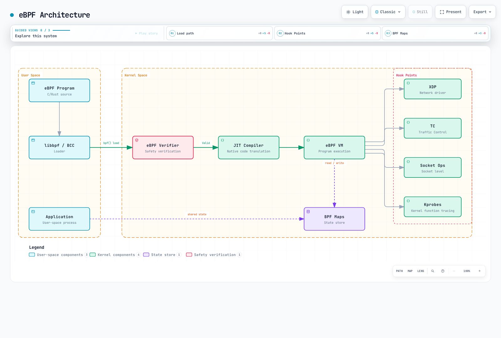
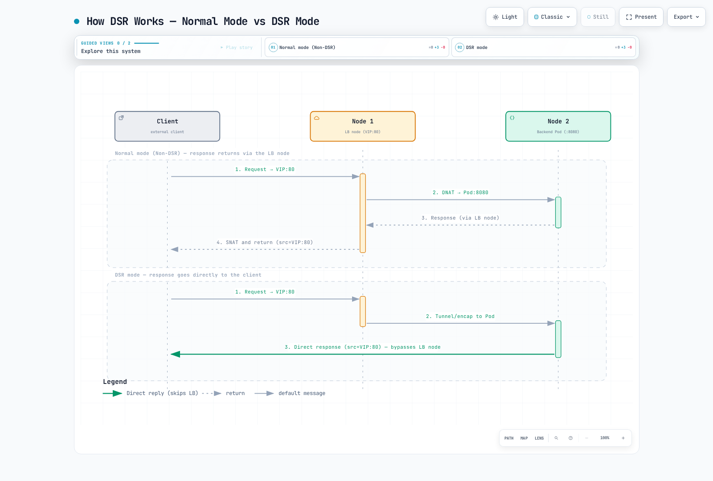
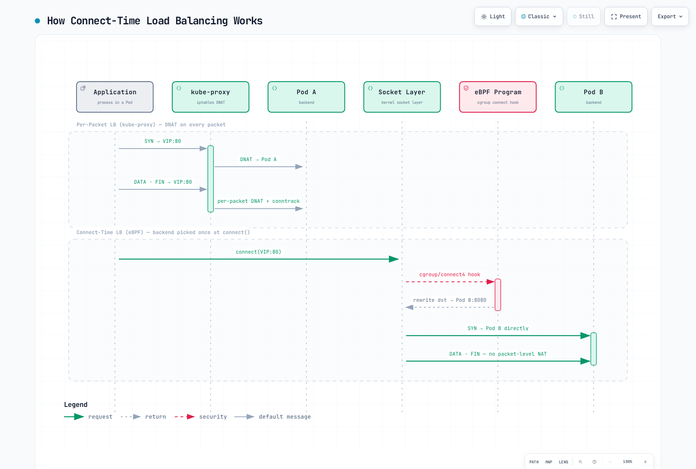
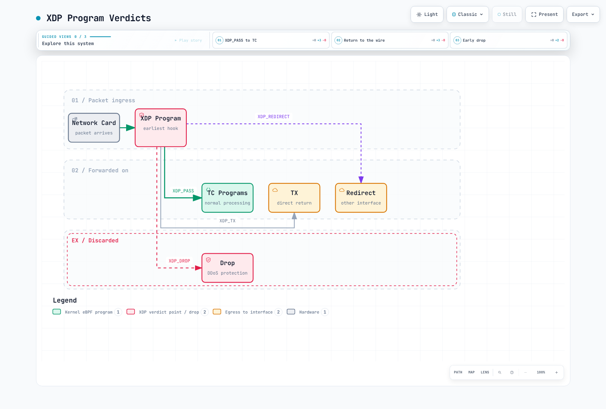

# Part 6: eBPF Dataplane

> **Review baseline**: Calico 3.32.2; Calico 3.32 tests Kubernetes 1.34–1.36. **Last Updated**: September 12, 2026.
>
> Examples assume an existing compatible Linux Calico cluster and the standard Calico API server. Choose the installation owner's workflow; these are alternative configuration fragments, not a sequence to apply to every cluster. This review did not load BPF programs, migrate a cluster or reproduce the reported benchmarks.

## Introduction

Calico's eBPF dataplane uses BPF programs and maps for workload networking, policy and Kubernetes Service handling. It can reduce overhead on suitable paths, but performance depends on the workload and configuration. Calico also provides classic Linux dataplanes and Windows HNS; eBPF is not a universal upgrade for every platform.

This deep dive explores eBPF fundamentals from a networking perspective, Calico's eBPF architecture, migration strategies, and performance optimization techniques.

***

## eBPF Fundamentals

### What is eBPF?

eBPF (extended Berkeley Packet Filter) is a revolutionary technology that allows running sandboxed programs in the Linux kernel without modifying kernel source code or loading kernel modules.



[🔍 View interactive diagram](https://www.atomai.click/kubernetes-docs/archmaps/en-networking-calico-06-ebpf-dataplane-1.html)

> The VM is an abstract instruction model. With JIT, the loaded program runs as native code at its hook; there is no additional guest VM after JIT. This is not an exact inventory of Calico hooks.

### Key eBPF Concepts for Networking

| Concept      | Description                              | Use in Calico                       |
| ------------ | ---------------------------------------- | ----------------------------------- |
| **Programs** | Bytecode executed at kernel hooks        | Packet filtering, routing           |
| **Maps**     | Key-value stores shared between programs | Route tables, policy rules          |
| **Hooks**    | Attachment points in kernel              | XDP, TC, socket                     |
| **Helpers**  | Kernel functions callable from eBPF      | Packet manipulation, map operations |
| **BTF**      | Type information for maps/programs       | Debug info, CO-RE                   |

### eBPF vs iptables

Both iptables packet processing and eBPF programs run in the kernel. Walking an iptables rule does not normally cross into userspace. kube-proxy is a control-plane process that programs Service rules; packets do not pass through that process in iptables mode.

Hash-map lookups, longest-prefix matches, compiled policy, tail calls and connection tracking have different costs. “Every eBPF policy is O(1)” and “memory is constant regardless of rules/flows” are not valid conclusions. iptables can also use indexed IP sets, and its NAT rule selection normally occurs for the first packet of a connection, with conntrack applying established translations later.

## Calico eBPF Architecture

| Mechanism | Role and scope |
| --- | --- |
| TC packet hooks | Policy, routing, connection state and packet-level Service handling; interface ingress/egress is not automatically the same as workload ingress/egress |
| Cgroup socket-address hooks | Connect-time Service destination translation; the released loader attaches connect hooks and, when enabled for UDP, sendmsg/recvmsg hooks |
| XDP | Early packet handling where supported/configured; distinguish Calico's classic-dataplane XDP acceleration from the full eBPF dataplane's own attachment logic |
| Program/IP-set/counter maps | Support compiled programs and state; policy is not a single universal tuple-to-action map |

These are different execution contexts, not a mandatory XDP → TC → sockops → sk_msg → TC pipeline. Calico's connect-time balancing does not inspect HTTP methods through sk_msg. Application-layer policy uses the separate [Istio/Dikastes integration](05-network-policy.md).

## BPF Map Structures

The following are **version-specific IPv4 layouts from Calico 3.32.2**, not a stable public ABI or a recipe for writing kernel maps:

| Map family | Type | Key / value bytes | Purpose |
| --- | --- | --- | --- |
| Routes | LPM trie | 8 / 8 | Destination prefix, flags and next-hop-or-interface union |
| NAT frontend | LPM trie | 16 / 20 | Service/source-prefix match, backend group/count, affinity and flags |
| NAT backend | Hash | 8 / 8 | Backend group/ordinal → address and port |
| Conntrack v4 format | LRU hash | 16 / 88 | Protocol, address pair, ports, state and NAT metadata |
| Affinity | LRU hash | Version-specific | Cached client-to-backend selection |

For the IPv4 route key, the first four bytes hold the prefix length in little-endian order, followed by the IPv4 address bytes. Its value contains flags and a four-byte next-hop/interface-index union, not a MAC address. Conntrack uses a 32-bit protocol field followed by addresses and ports; the former simplified five-tuple struct was not its actual layout. IPv6 uses different layouts.

Policies are compiled into BPF instructions, assisted by maps; a rule-counter map is not the policy itself. Use the matching Calico debug tool to decode current maps and inspect their actual type, capacity and version before interpreting raw bytes.

## Direct Server Return (DSR)



[🔍 View interactive diagram](https://www.atomai.click/kubernetes-docs/archmaps/en-networking-calico-06-ebpf-dataplane-6.html)

> The frontend may be a NodePort or another Service address. Calico handles return-source translation; an external cloud load balancer is not shown and its return-path restrictions still apply.

Here “load-balancer node” means the Kubernetes node performing Service forwarding. DSR can bypass that node on the return path; it does not automatically bypass an external cloud load balancer. Calico performs the return-source translation, rather than requiring the application Pod to bind a VIP.

| `bpfExternalServiceMode` | Remote-backend path |
| --- | --- |
| `Tunnel` (default) | Request and reply use the ingress node/tunnel path |
| `DSR` | Request is tunneled to the remote node; reply goes directly toward the client |

There is no `Disabled` or `IPIP` value for this field. Calico uses VXLAN for this Service forwarding, so MTU/underlay requirements matter in both modes. DSR additionally requires the fabric to permit a node to send traffic using the original frontend/ingress-node source address. The Calico AWS guidance requires nodes in the same subnet and source/destination checks disabled; do not generalize that into an arbitrary cross-subnet deployment.

The current Calico troubleshooting guide excludes AWS/GCP external-load-balancer return paths that require the original target. Do not enable DSR for such traffic solely because same-subnet/source-check conditions are met.

On an already working, compatible eBPF path, the setting is:

```yaml
apiVersion: projectcalico.org/v3
kind: FelixConfiguration
metadata:
  name: default
spec:
  bpfExternalServiceMode: DSR
```

Merge through the configuration owner and test return routing, source validation and active connections. Changing the mode can disrupt connections. DSR and connect-time balancing are separate optimizations.

## Connect-Time Load Balancing



[🔍 View interactive diagram](https://www.atomai.click/kubernetes-docs/archmaps/en-networking-calico-06-ebpf-dataplane-7.html)

> kube-proxy programs kernel rules rather than carrying packets itself. Existing iptables connections use conntrack after initial rule selection. CTLB bypasses that Service DNAT path, not all packet processing.

The diagram is conceptual: kube-proxy programs kernel state; subsequent packets use conntrack rather than reselecting a backend through the full Service-rule list. Connect-time balancing translates a supported socket's Service destination before packet processing. It does not remove all routing, policy, connection tracking or every other form of NAT.

The current field is `bpfConnectTimeLoadBalancing: TCP` (default), `Enabled` or `Disabled`. The old boolean `bpfConnectTimeLoadBalancingEnabled` is deprecated but remains accepted; inspect/remove obsolete overrides through the owner rather than setting both forms blindly.

```yaml
apiVersion: projectcalico.org/v3
kind: FelixConfiguration
metadata:
  name: default
spec:
  bpfConnectTimeLoadBalancing: TCP
  bpfHostNetworkedNATWithoutCTLB: Enabled
```

`Enabled` can include UDP socket handling; `TCP` limits CTLB to TCP. `bpfHostNetworkedNATWithoutCTLB` controls the complementary host-network NAT path, not whether ClusterIP is generally supported. A service mesh that needs original Service addresses can require CTLB disabled; follow the tested integration instead of assuming socket rewriting is always compatible.

## XDP Acceleration



[🔍 View interactive diagram](https://www.atomai.click/kubernetes-docs/archmaps/en-networking-calico-06-ebpf-dataplane-3.html)

> These are framework actions. Native, generic and offloaded execution have different prerequisites; the figure does not promise that Calico exposes every action or hardware feature.

These are generic XDP actions, not a promise that Calico provides every offload/rate-limiting feature shown. Native driver XDP can act before skb allocation; Generic XDP runs later with an skb. Hardware offload support depends on the NIC, driver and program. No universal speed ranking follows from the mode name.

The Felix `xdpEnabled` field is a **boolean** for suitable untracked ingress-deny acceleration in the classic iptables dataplane. `genericXDPEnabled` defaults to false; generic fallback is not automatically guaranteed. These knobs are distinct from the full eBPF dataplane's internal XDP programs.

```yaml
# Separate classic iptables-dataplane acceleration example.
apiVersion: projectcalico.org/v3
kind: FelixConfiguration
metadata:
  name: default
spec:
  xdpEnabled: true
  genericXDPEnabled: false
```

Inspect driver support and actual attachments on the intended interface. `xdpEnabled: Enabled`, `Offload` or `BestEffort` are not valid enum modes.

***

## eBPF Mode Requirements

Use the current requirements for the selected release, not a historical minimum:

| Requirement | Calico 3.32 eBPF scope |
| --- | --- |
| Base Linux kernel | 5.10 or newer; documented RHEL exception: RHEL 8.4 with kernel 4.18.0-305 or newer |
| Architecture | x86-64 or little-endian arm64 |
| Datastore | Kubernetes; etcd datastore is not supported for this mode |
| Additional features | eBPF Log rules require kernel 5.16; documented QoS bandwidth controls require 6.6/TCX |
| Underlay | Permit the configured VXLAN traffic between nodes, including NodePort forwarding even when Pod pools are unencapsulated |
| Runtime | Required BPF/cgroup facilities, privileges and writable mounts; immutable OS variants require a suitable `CgroupV2Path` |

BTF supplies type information for CO-RE and tooling; it is not the verifier itself or a guarantee of compatibility with every kernel. Calico's released loader selects CO-RE/non-CO-RE object variants where supported, so `/sys/kernel/btf/vmlinux` is not a complete readiness test. Verify the release requirements, node configuration and actual load diagnostics. Pinned objects in bpffs survive the creating process, not a host reboot as persistent disk data.

### Platform Boundaries

The current Calico guide lists self-managed/kubeadm, kOps, OpenShift, EKS, MKE and qualified AKS/RKE paths. It explicitly excludes GKE, steady-state clusters mixing eBPF with the standard dataplane or Windows, and SCTP policy/services. IPv6 and IPv6-only operation are documented; “switch to dual-stack to fix missing IPv6 support” is not a general solution.

AKS with Azure CNI cannot disable its managed kube-proxy; the guide treats Calico-networking AKS as a separate path still undergoing testing. An OS name, Ubuntu image or kernel version alone does not establish platform support. EKS node mode, CNI combination and OS variant must follow the specific Calico/EKS procedure; do not infer support for managed networking modes or environments unable to run the required privileged node components.

Windows uses the Windows HNS dataplane, not Linux iptables. Do not plan a persistent per-node eBPF canary mixed with Windows/standard nodes. Validate in a separate representative cluster, then follow the documented coordinated transition.

### Read-only Inventory

```bash
kubectl get nodes -o wide
kubectl -n kube-system get daemonset kube-proxy -o yaml
kubectl get installation.operator.tigera.io default -o yaml
kubectl get felixconfiguration.projectcalico.org default -o yaml
```

Use the installation namespace and inspect the actual Calico/operator image versions. On each node, inspect `uname -r`, available BTF, bpffs and cgroup mounts in the host's mount namespace. A debug container's filesystem view is not automatically identical to the host. Do not upgrade an existing Helm release with a guessed release name or discard its values just to change dataplane mode.

## iptables to eBPF Migration

### Operator Automatic Bootstrap: Restricted Prerequisites

This path applies to a self-managed kubeadm-based cluster installed with the Tigera Operator, with kube-proxy in `kube-system` **not managed by Helm, Argo CD or another reconciler**, and with the operator able to read the Kubernetes Service/endpoints.

```bash
kubectl get installation.operator.tigera.io default -o yaml
# Only when every automatic-bootstrap prerequisite above is met:
kubectl patch installation.operator.tigera.io default --type=merge \
  -p '{"spec":{"calicoNetwork":{"linuxDataplane":"BPF","bpfNetworkBootstrap":"Enabled","kubeProxyManagement":"Enabled"}}}'
```

The operator configures direct API access and manages kube-proxy during the transition. Rolling updates temporarily put nodes in different modes; the official guide explicitly notes possible NodePort disruption. Do not describe this as a guaranteed interruption-free migration.

### Manual Preparation and Ownership

For other supported installations, first establish stable **direct** API-server access that does not depend on the Service implementation being replaced. Use the actual API load-balancer hostname/address and port. For EKS this is the cluster's API endpoint hostname, normally port 443; the example below is a placeholder for a self-managed API endpoint.

```yaml
apiVersion: v1
kind: ConfigMap
metadata:
  name: kubernetes-services-endpoint
  namespace: tigera-operator
data:
  KUBERNETES_SERVICE_HOST: api.internal.example.com
  KUBERNETES_SERVICE_PORT: "6443"
```

Use `tigera-operator` for an operator installation; the standalone manifest workflow uses `kube-system`. The name is **`kubernetes-services-endpoint`** (plural). Confirm Calico has picked up the endpoint and can resolve/reach it before changing the Service dataplane. DNS bootstrap, security rules and reachability remain platform-specific prerequisites.

If kube-proxy uses IPVS, the official migration requires switching it to iptables mode and a planned node restart first. Resolve this as a separate controlled change.

Coordinate kube-proxy with its actual owner. Where it must remain running, such as the documented AKS Azure CNI case, merge these fields into the existing Felix configuration:

```yaml
apiVersion: projectcalico.org/v3
kind: FelixConfiguration
metadata:
  name: default
spec:
  bpfKubeProxyIptablesCleanupEnabled: false
  bpfKubeProxyHealthzPort: 0
```

The cleanup flag alone does not enable service handling. Running kube-proxy with cleanup enabled makes the components fight over iptables; leaving both health servers on 10256 also causes a conflict. Preserve unrelated Felix settings when merging.

Enable the dataplane using **one** ownership path:

```bash
# Operator installation:
kubectl patch installation.operator.tigera.io default --type=merge \
  -p '{"spec":{"calicoNetwork":{"linuxDataplane":"BPF"}}}'
```

```bash
# Alternative: standalone manifest installation, without operator ownership:
kubectl patch felixconfiguration.projectcalico.org default --type=merge \
  -p '{"spec":{"bpfEnabled":true}}'
```

For installations whose owner disables kube-proxy manually, follow the platform's documented sequence in the planned transition window. Save its desired configuration first. If a temporary nodeSelector is used, choose a previously unused key, verify it matches no nodes and later remove only the added key; never replace the entire existing selector map with null. Deleting a DaemonSet or scaling a nonexistent kube-proxy Deployment is not a general migration procedure.

### Validate Traffic, Not Only Loaded Programs

Inspect rollout status and actual BPF programs/maps on the intended nodes. Test new Pod-to-Pod, DNS, ClusterIP, NodePort/external, policy-deny and required host-network connections across nodes. A program listing or a small iptables line count does not prove those paths work.

The Kubernetes API normally uses HTTPS, not `http://kubernetes.default.svc`. Test API transport with the correct TLS trust and an appropriate identity; authentication failures and networking failures are different. Prefer a controlled application Service for connectivity checks rather than treating an unauthenticated API request as a success criterion.

### Rollback

Use the same owner to reverse the mode change:

```bash
# Operator installation: use its owner/GitOps source for the same change.
kubectl patch installation.operator.tigera.io default --type=merge \
  -p '{"spec":{"calicoNetwork":{"linuxDataplane":"Iptables"}}}'
```

```bash
# Alternative for standalone manifest installations:
kubectl patch felixconfiguration.projectcalico.org default --type=merge \
  -p '{"spec":{"bpfEnabled":false}}'
```

Automatic bootstrap lets the operator restore kube-proxy. If it was disabled manually, restore only the temporary change through its owner, retaining original selectors and other settings. Recheck Service rules and traffic. Disabling eBPF or changing external service mode can disrupt existing connections; do not promise that a node restart makes all application state clean.

***

## Reported Performance Records

The earlier English and Korean guides contained **different, unverified records**. Their original numbers are preserved below; they are not measurements from this audit or a guarantee for Calico 3.32.2. Neither record provides raw output, a test date, exact Calico/Kubernetes/kernel versions, topology, NIC/CPU details, connection-state setup or a complete test method.

### Record A: Earlier English Guide

| Reported latency | iptables | eBPF | Original rounded reduction |
| --- | --- | --- | --- |
| Same-node Pod | 45 μs | 25 μs | 44% |
| Cross-node Pod | 120 μs | 80 μs | 33% |
| ClusterIP | 150 μs | 60 μs | 60% |
| NodePort | 180 μs | 70 μs | 61% |

| Reported throughput | iptables | eBPF | Original rounded increase |
| --- | --- | --- | --- |
| TCP single stream | 15 Gbps | 23 Gbps | 53% |
| TCP multi-stream | 35 Gbps | 48 Gbps | 37% |
| UDP single stream | 8 Gbps | 18 Gbps | 125% |
| 64-byte packets | 2M pps | 5M pps | 150% |

| Reported rule count | iptables connections/s | eBPF connections/s |
| --- | --- | --- |
| 1,000 | 50,000 | 120,000 |
| 5,000 | 35,000 | 115,000 |
| 10,000 | 20,000 | 110,000 |


The latency percentile is unspecified. Connections per second is not a direct CPU-utilization measurement, and these three points do not prove constant policy cost at arbitrary scale.

### Record B: Earlier Korean Guide

| Reported metric | iptables | eBPF | Original rounded change |
| --- | --- | --- | --- |
| Throughput | 1.2M pps | 2.0M pps | +67% |
| Latency | 120 μs | 75 μs | −38% |
| CPU at 1,000 Services | 70% | 30% | −57% |
| Connection setup | No absolute value | No absolute value | Claimed −50% |


Record B is not the same experiment as Record A. Its memory/complexity claims were not measured data, and the connection-setup percentage has no underlying durations. Do not combine the records into one benchmark or use a fixed “20–40% improvement” as an expected result.

### A Reproducible Comparison

Use matched client/server test images, the same nodes, traffic path, CPU/NIC allocation, MTU and load. Record dataplane, kernel and software versions, test duration, sample counts, warm-up, concurrency, conntrack state and logging settings. Test an application Service separately from direct Pod IPs.

```bash
# Requires ready test Pods with netperf/netserver and an appropriate test policy.
CLIENT_POD=netperf-client
SERVER_POD=netperf-server
SERVER_IP="$(kubectl -n calico-demo get pod "$SERVER_POD" -o jsonpath='{.status.podIP}')"
test -n "$SERVER_IP"
kubectl -n calico-demo exec "$CLIENT_POD" -- \
  netperf -H "$SERVER_IP" -t TCP_RR -l 30
kubectl -n calico-demo exec "$CLIENT_POD" -- \
  netperf -H "$SERVER_IP" -t TCP_STREAM -l 30
```

`TCP_RR` normally reports **transactions per second**, not a latency percentile. A reciprocal can describe a mean transaction time only under the relevant test assumptions; it is not p99 network latency. netperf uses control and data connections, which must be permitted in the isolated test environment. Installing netperf on the operator's workstation does not install it in the client Pod. This procedure has not been run on a Calico cluster for this audit.

***

## eBPF Debugging

The Calico node image embeds the debug tool as **`calico-node -bpf`**. A standalone `calico-bpf` source entry point also exists, but do not assume a separate binary is installed in the node image. The embedded tool uses `help`; its wrapper can consume `--help` before the BPF subcommand sees it.

```bash
CALICO_NAMESPACE=calico-system
CALICO_NODE=demo-worker
CALICO_POD="$(kubectl -n "$CALICO_NAMESPACE" get pods -l k8s-app=calico-node \
  --field-selector "spec.nodeName=$CALICO_NODE" -o jsonpath='{.items[0].metadata.name}')"
test -n "$CALICO_POD"
kubectl -n "$CALICO_NAMESPACE" exec "$CALICO_POD" -c calico-node -- \
  calico-node -bpf help
kubectl -n "$CALICO_NAMESPACE" exec "$CALICO_POD" -c calico-node -- \
  calico-node -bpf routes dump
kubectl -n "$CALICO_NAMESPACE" exec "$CALICO_POD" -c calico-node -- \
  calico-node -bpf conntrack dump
kubectl -n "$CALICO_NAMESPACE" exec "$CALICO_POD" -c calico-node -- \
  calico-node -bpf nat dump
kubectl -n "$CALICO_NAMESPACE" exec "$CALICO_POD" -c calico-node -- \
  calico-node -bpf counters dump
```

```bash
# Choose an interface actually attached on this node.
BPF_INTERFACE=eth0
kubectl -n "$CALICO_NAMESPACE" exec "$CALICO_POD" -c calico-node -- \
  calico-node -bpf policy dump "$BPF_INTERFACE" all
# IPv6, when enabled: put the debug-tool flag after its subcommand.
kubectl -n "$CALICO_NAMESPACE" exec "$CALICO_POD" -c calico-node -- \
  calico-node -bpf routes dump --ipv6
```

```bash
kubectl -n "$CALICO_NAMESPACE" exec "$CALICO_POD" -c calico-node -- bpftool prog show
kubectl -n "$CALICO_NAMESPACE" exec "$CALICO_POD" -c calico-node -- bpftool map show
kubectl -n "$CALICO_NAMESPACE" exec "$CALICO_POD" -c calico-node -- bpftool net show
kubectl -n "$CALICO_NAMESPACE" exec "$CALICO_POD" -c calico-node -- \
  tc filter show dev "$BPF_INTERFACE" ingress
kubectl -n "$CALICO_NAMESPACE" exec "$CALICO_POD" -c calico-node -- \
  tc filter show dev "$BPF_INTERFACE" egress
```

`policy dump` requires both an interface and a hook (`ingress`, `egress`, `xdp` or `all`). Policy debug information must be available; `bpfPolicyDebugEnabled` defaults to true. Workload ingress is attached to the host-side veth's TC/TCX **egress** hook, while host ingress uses the host interface's ingress hook. Do not infer a workload direction from the interface-hook word alone.

`nat dump` accepts no arguments or an IP/port/protocol triple. There is no `nat frontend list` command in the reviewed CLI. Inspect real program/map IDs before using bpftool's per-ID commands. Raw map lookup keys depend on the map's complete versioned layout; four IPv4 bytes alone are not a route-map key.

Use bpftool's actual map `max_entries` and reported sizes; `/proc/sys/kernel/bpf_map_max_entries` is not a generic Linux map-capacity control. Runtime program counters such as `run_cnt` and `run_time_ns` require statistics to be enabled and are not end-to-end request latency. TCX attachments may require bpftool link/attachment inspection in addition to legacy `tc filter show`.

### Logs and Captures

`bpfLogLevel` accepts **Off, Info or Debug**, not Warn/Warning. Those program logs go to the BPF trace pipe, while Felix's component logs go to container stdout. Use the appropriate trace tooling and node when examining program/policy logs; a successful Pod rollout is not proof of a permitted packet path.

Calico can redirect directly to a workload peer, so host-side veth capture may miss traffic that bypasses that hook. Capture at the actual path and correlate policy state, routes, conntrack and Service backends.

## Kubernetes Service Replacement and Limits

Calico eBPF implements Service forwarding; it does not provision an external cloud load balancer. Keep AWS/cloud controller responsibilities separate. The current implementation has IPv4/IPv6 NAT maps, local-traffic flags and affinity handling. Do not treat an old “IPv6/Local unsupported” table as the current feature matrix, nor assume that every kube-proxy option behaves identically without validation.

The released WireGuard functional tests include BPF mode and IPv4/IPv6 configurations, so WireGuard is **not categorically incompatible** with eBPF. Verify the actual CNI, traffic class, kernel, MTU and encryption path; the generic encryption guide contains older limitations and installation examples that must not be blindly applied to a current OS.

For host-networked workloads, inspect the CTLB/host-NAT setting and HostEndpoint policy separately. SCTP and steady-state mixed eBPF/standard/Windows clusters remain excluded by the current eBPF guide. Windows requires its supported HNS architecture.

For AWS/GCP load-balancer paths, the current Calico troubleshooting guide explicitly warns that DSR does not work correctly when the external load balancer requires the return path through the original target. Use the documented supported mode and validate the complete path; same-subnet/source-check prerequisites alone do not establish cloud-LB compatibility.

## Configuration and Observability

Prefer release defaults until measurements justify a change. The following fields illustrate current names and values on an already enabled eBPF installation; merge them through the configuration owner:

```yaml
apiVersion: projectcalico.org/v3
kind: FelixConfiguration
metadata:
  name: default
spec:
  bpfLogLevel: "Off"
  bpfExternalServiceMode: Tunnel
  bpfConnectTimeLoadBalancing: TCP
  bpfHostNetworkedNATWithoutCTLB: Enabled
```

Do not overwrite `bpfDataIfacePattern` with an arbitrary `eth*` or narrow expression. It is a regular expression and must cover actual underlay/Service interfaces while excluding workload and special Calico devices. An interface name alone does not prove XDP offload support.

`bpfKubeProxyEndpointSlicesEnabled` is not a current Felix field. The old CTLB boolean is deprecated, not removed. If tuning conntrack timeouts, the current keys include `tcpEstablished`, `tcpFinsSeen`, `tcpResetSeen`, `udpTimeout`, `genericTimeout` and `icmpTimeout`; `tcpClosing`, `udp` and `icmp` are not those keys. Measure map occupancy and memory rather than assigning one million entries to every deployment.

The released endpoint manager registers these real gauges:

| Metric | Meaning |
| --- | --- |
| `felix_bpf_dataplane_endpoints` | Managed BPF endpoints |
| `felix_bpf_dirty_dataplane_endpoints` | Endpoints still dirty after a failure |
| `felix_bpf_happy_dataplane_endpoints` | Successfully programmed endpoints |

Enable the documented Felix metrics endpoint through its owner, inspect the actual scrape, and use its metric HELP/TYPE. The former `calico_bpf_*` list was not verified as exported metrics. Endpoint gauges are not a direct substitute for map occupancy, packet-denial counters or application latency.

Choose the dataplane using current platform compatibility, required Service/policy/encryption features and measured workload behavior. Rehearse both transition and rollback; neither eBPF nor iptables is inherently the right choice for every cluster.

***

## References

* [Calico 3.32 eBPF installation requirements](https://docs.tigera.io/calico/latest/operations/ebpf/install)
* [Calico eBPF migration and rollback](https://docs.tigera.io/calico/latest/operations/ebpf/enabling-ebpf)
* [Calico eBPF troubleshooting and CLI](https://docs.tigera.io/calico/latest/operations/ebpf/troubleshoot-ebpf)
* [Felix configuration](https://docs.tigera.io/calico/latest/reference/resources/felixconfig)
* [Operator installation API](https://docs.tigera.io/calico/latest/reference/installation/api)
* [Kernel BTF](https://docs.kernel.org/bpf/btf.html)
* [libbpf and CO-RE](https://docs.kernel.org/bpf/libbpf/libbpf_overview.html)
* [Calico 3.32.2 route map layout](https://raw.githubusercontent.com/projectcalico/calico/v3.32.2/felix/bpf/routes/map.go)
* [Calico 3.32.2 NAT maps](https://raw.githubusercontent.com/projectcalico/calico/v3.32.2/felix/bpf/nat/maps.go)
* [Calico 3.32.2 conntrack v4 layout](https://raw.githubusercontent.com/projectcalico/calico/v3.32.2/felix/bpf/conntrack/v4/map.go)
* [Calico 3.32.2 connect-time loader](https://raw.githubusercontent.com/projectcalico/calico/v3.32.2/felix/bpf/nat/connecttime.go)
* [Calico 3.32.2 WireGuard functional tests](https://raw.githubusercontent.com/projectcalico/calico/v3.32.2/felix/fv/wireguard_test.go)
* [bpftool program reference](https://raw.githubusercontent.com/libbpf/bpftool/main/docs/bpftool-prog.rst)
* [bpftool map reference](https://raw.githubusercontent.com/libbpf/bpftool/main/docs/bpftool-map.rst)
