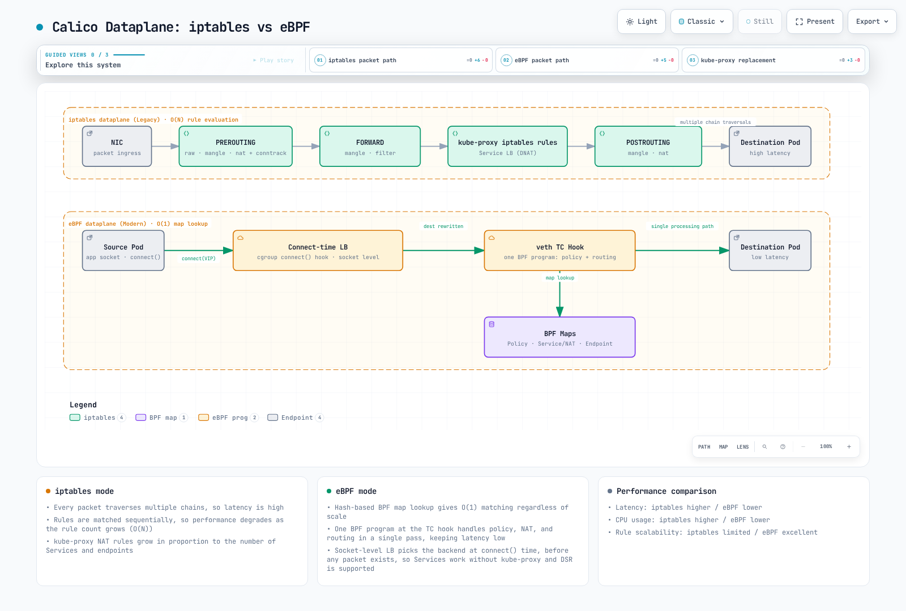

# Part 6: eBPF Dataplane

> **Supported Versions**: Calico v3.29+ / Kubernetes 1.28+ **Last Updated**: February 23, 2026

## Introduction

Calico's eBPF dataplane represents a significant evolution in Kubernetes networking, replacing traditional iptables-based packet processing with modern eBPF programs. This approach delivers substantial performance improvements, reduced latency, and enhanced observability capabilities.

This deep dive explores eBPF fundamentals from a networking perspective, Calico's eBPF architecture, migration strategies, and performance optimization techniques.

***

## eBPF Fundamentals

### What is eBPF?

eBPF (extended Berkeley Packet Filter) is a revolutionary technology that allows running sandboxed programs in the Linux kernel without modifying kernel source code or loading kernel modules.


### Key eBPF Concepts for Networking

| Concept      | Description                              | Use in Calico                       |
| ------------ | ---------------------------------------- | ----------------------------------- |
| **Programs** | Bytecode executed at kernel hooks        | Packet filtering, routing           |
| **Maps**     | Key-value stores shared between programs | Route tables, policy rules          |
| **Hooks**    | Attachment points in kernel              | XDP, TC, socket                     |
| **Helpers**  | Kernel functions callable from eBPF      | Packet manipulation, map operations |
| **BTF**      | Type information for maps/programs       | Debug info, CO-RE                   |

### eBPF vs iptables

| Aspect               | iptables                  | eBPF              |
| -------------------- | ------------------------- | ----------------- |
| **Architecture**     | Sequential rule chains    | Direct execution  |
| **Complexity**       | O(n) rule matching        | O(1) map lookup   |
| **Kernel Crossings** | Multiple per packet       | Minimal           |
| **Programmability**  | Fixed rule types          | Flexible programs |
| **Observability**    | Limited counters          | Rich metrics      |
| **CPU Efficiency**   | Higher interrupt overhead | Lower overhead    |

***

## Calico eBPF Architecture



[🔍 View interactive diagram](https://www.atomai.click/kubernetes-docs/archmaps/en-networking-calico-06-ebpf-dataplane-9.html)

### Architecture Comparison


### eBPF Program Types in Calico

Calico uses multiple eBPF program types for different functions:


### TC (Traffic Control) Programs

TC programs are the primary dataplane hook for Calico:

```
Ingress TC Program Functions:
├── Policy enforcement (allow/deny)
├── Connection tracking lookup
├── Service load balancing (DNAT)
├── Tunnel decapsulation
└── Metrics collection

Egress TC Program Functions:
├── Policy enforcement (egress rules)
├── SNAT for masquerade
├── Tunnel encapsulation
└── DSR return path handling
```

### XDP (eXpress Data Path) Programs

XDP provides the earliest packet processing hook:


### Socket Programs

Socket-level eBPF for service mesh integration:

```yaml
# sockops: Intercept socket operations
- connect() -> Redirect to local sidecar
- accept() -> Apply connection policies
- close() -> Cleanup connection state

# sk_msg: Process socket data
- sendmsg() -> Apply L7 policy
- recvmsg() -> Inspect response
```

***

## BPF Map Structures

### Map Types Used by Calico

| Map Type          | Purpose              | Example Use         |
| ----------------- | -------------------- | ------------------- |
| **Hash Map**      | Key-value lookup     | Connection tracking |
| **LRU Hash**      | Auto-evicting cache  | NAT table           |
| **Array**         | Fixed-size indexed   | Endpoint config     |
| **LPM Trie**      | Longest prefix match | Route lookup        |
| **Per-CPU Array** | Scalable counters    | Statistics          |

### Route Map Structure

```c
// Simplified route map entry
struct calico_route_key {
    __be32 prefix;
    __u32 prefix_len;
};

struct calico_route_value {
    __u32 flags;          // LOCAL, REMOTE, HOST, etc.
    __be32 next_hop;      // Next hop IP
    __u32 ifindex;        // Interface index
    __u8 mac[6];          // Destination MAC
};
```

### Connection Tracking Map

```c
// Connection tracking key
struct calico_ct_key {
    __be32 src_ip;
    __be32 dst_ip;
    __be16 src_port;
    __be16 dst_port;
    __u8 protocol;
};

// Connection tracking value
struct calico_ct_value {
    __u64 created;        // Timestamp
    __u64 last_seen;      // Last packet
    __be32 orig_dst;      // Pre-DNAT destination
    __be16 orig_port;     // Pre-DNAT port
    __u32 flags;          // Connection state
};
```

### Policy Map Structure

```c
// Policy rule entry
struct calico_policy_key {
    __u32 policy_id;
    __u32 rule_index;
};

struct calico_policy_value {
    __u32 action;         // ALLOW, DENY, PASS
    __u32 flags;
    __be32 src_net;
    __be32 src_mask;
    __be32 dst_net;
    __be32 dst_mask;
    __be16 port_start;
    __be16 port_end;
};
```

***

## Direct Server Return (DSR)

### DSR Overview

DSR allows response traffic to bypass the load balancer, reducing latency and load balancer resource consumption.


### DSR Modes in Calico

| Mode         | Description              | Use Case                  |
| ------------ | ------------------------ | ------------------------- |
| **Disabled** | All traffic through LB   | Default, all environments |
| **IPIP**     | Response via IPIP tunnel | Cross-subnet              |
| **DSR**      | Direct response          | Same L2 network           |

### Enabling DSR

```yaml
apiVersion: projectcalico.org/v3
kind: FelixConfiguration
metadata:
  name: default
spec:
  bpfEnabled: true
  bpfExternalServiceMode: DSR
```

### DSR Requirements

* Server and client must be on same L2 network OR
* Use IPIP/VXLAN encapsulation for cross-subnet
* External client IP must be routable from servers
* No SNAT on ingress path

***

## Connect-Time Load Balancing

### Traditional vs Connect-Time LB


### Benefits of Connect-Time LB

| Aspect                  | Per-Packet          | Connect-Time          |
| ----------------------- | ------------------- | --------------------- |
| **NAT overhead**        | Every packet        | Connection setup only |
| **Connection tracking** | Required            | Minimal               |
| **Latency**             | Higher (NAT lookup) | Lower (direct)        |
| **CPU usage**           | Higher              | Lower                 |

### How Connect-Time LB Works

```c
// Simplified connect-time LB logic
int bpf_connect4(struct bpf_sock_addr *ctx) {
    // Check if destination is a Service IP
    struct lb_backend *backend = lookup_service(ctx->user_ip4, ctx->user_port);

    if (backend) {
        // Rewrite destination to backend pod
        ctx->user_ip4 = backend->pod_ip;
        ctx->user_port = backend->pod_port;
    }

    return 1; // Allow connection
}
```

***

## XDP Acceleration

### XDP Processing Levels


### XDP Modes

| Mode        | Location      | Performance | Requirements   |
| ----------- | ------------- | ----------- | -------------- |
| **Offload** | NIC hardware  | Fastest     | SmartNIC       |
| **Native**  | NIC driver    | Fast        | Driver support |
| **Generic** | Network stack | Baseline    | Any NIC        |

### Enabling XDP in Calico

```yaml
apiVersion: projectcalico.org/v3
kind: FelixConfiguration
metadata:
  name: default
spec:
  bpfEnabled: true

  # XDP mode: Disabled, Enabled, Offload
  xdpEnabled: Enabled

  # Interfaces for XDP
  # Uses same detection as BPF dataplane interface
```

### XDP Use Cases in Calico

1. **DDoS Protection**: Drop malicious traffic at NIC
2. **Blocklist Enforcement**: Early rejection of blocked IPs
3. **Rate Limiting**: Packet rate limits before stack
4. **Metrics Collection**: Wire-speed packet counting

***

## eBPF Mode Requirements

### Kernel Requirements

| Requirement      | Minimum Version | Notes                     |
| ---------------- | --------------- | ------------------------- |
| **Linux Kernel** | 5.3+            | 5.8+ recommended          |
| **BTF Support**  | Required        | `CONFIG_DEBUG_INFO_BTF=y` |
| **BPF Syscall**  | Required        | `CONFIG_BPF_SYSCALL=y`    |
| **BPF JIT**      | Required        | `CONFIG_BPF_JIT=y`        |

### Verify Kernel Support

```bash
# Check kernel version
uname -r

# Check BTF support
ls /sys/kernel/btf/vmlinux

# Check BPF support
cat /boot/config-$(uname -r) | grep -E "CONFIG_BPF|CONFIG_DEBUG_INFO_BTF"

# Required output:
# CONFIG_BPF=y
# CONFIG_BPF_SYSCALL=y
# CONFIG_BPF_JIT=y
# CONFIG_DEBUG_INFO_BTF=y
```

### Distribution Support

| Distribution      | eBPF Ready | Notes                        |
| ----------------- | ---------- | ---------------------------- |
| Ubuntu 20.04+     | Yes        | Kernel 5.4+                  |
| Ubuntu 22.04+     | Yes        | Kernel 5.15+ (recommended)   |
| RHEL/CentOS 8.2+  | Yes        | Kernel 4.18+ with backports  |
| Amazon Linux 2    | Partial    | May need kernel upgrade      |
| Amazon Linux 2023 | Yes        | Kernel 6.1+                  |
| Bottlerocket      | Yes        | Purpose-built for containers |

### Calico Version Requirements

```yaml
# Minimum Calico versions for eBPF features
eBPF dataplane basic:     v3.13.0
Connect-time LB:          v3.16.0
XDP acceleration:         v3.18.0
Dual-stack eBPF:         v3.20.0
Host-networked pods:      v3.13.0 (with limitations)
```

### Node Configuration

```yaml
apiVersion: projectcalico.org/v3
kind: FelixConfiguration
metadata:
  name: default
spec:
  # Enable eBPF dataplane
  bpfEnabled: true

  # Data interface detection
  # Auto-detect: first interface with default route
  # Or specify pattern: "eth*"
  bpfDataIfacePattern: "^((en|eth|wl)[opsx].*|(eth|wlan|eno)[0-9].*)"

  # External service mode: Tunnel or DSR
  bpfExternalServiceMode: Tunnel

  # Log level for BPF programs
  bpfLogLevel: Info

  # Kube-proxy replacement
  bpfKubeProxyIptablesCleanupEnabled: true

  # Connection tracking
  bpfConnectTimeLoadBalancingEnabled: true
```

***

## iptables to eBPF Migration

### Pre-Migration Checklist

```bash
# 1. Verify kernel requirements
uname -r  # Should be 5.3+
ls /sys/kernel/btf/vmlinux  # BTF must exist

# 2. Check Calico version
kubectl get deployment -n kube-system calico-kube-controllers -o jsonpath='{.spec.template.spec.containers[0].image}'
# Should be v3.13.0+

# 3. Verify CNI plugin
kubectl get ds -n kube-system calico-node -o jsonpath='{.spec.template.spec.containers[0].env}' | grep -i cni

# 4. Check existing networking mode
calicoctl get felixconfiguration default -o yaml | grep -i bpf

# 5. Verify no conflicting CNI
ls /etc/cni/net.d/
```

### Migration Steps

**Step 1: Update FelixConfiguration (dry-run)**

```yaml
# Save current configuration
kubectl get felixconfiguration default -o yaml > felix-backup.yaml

# Create eBPF configuration
apiVersion: projectcalico.org/v3
kind: FelixConfiguration
metadata:
  name: default
spec:
  bpfEnabled: false  # Not enabled yet
  bpfLogLevel: Debug  # For troubleshooting
  bpfDataIfacePattern: "^((en|eth|wl)[opsx].*|(eth|wlan|eno)[0-9].*)"
  bpfExternalServiceMode: Tunnel
  bpfKubeProxyIptablesCleanupEnabled: false  # Don't cleanup yet
```

**Step 2: Disable kube-proxy (if using Calico as replacement)**

```bash
# Option A: Scale down kube-proxy
kubectl -n kube-system patch daemonset kube-proxy -p '{"spec":{"template":{"spec":{"nodeSelector":{"non-calico":"true"}}}}}'

# Option B: Add calico node selector to skip kube-proxy nodes
# Only if running both temporarily
```

**Step 3: Enable eBPF on test node**

```bash
# Label test node
kubectl label node test-node-1 calico-ebpf=enabled

# Apply node-specific config
calicoctl apply -f - <<EOF
apiVersion: projectcalico.org/v3
kind: FelixConfiguration
metadata:
  name: node.test-node-1
spec:
  bpfEnabled: true
EOF
```

**Step 4: Validate test node**

```bash
# Check BPF programs loaded
kubectl exec -n kube-system calico-node-xxxxx -c calico-node -- \
  bpftool prog list

# Verify connectivity
kubectl run test-pod --image=busybox --restart=Never --overrides='{"spec":{"nodeName":"test-node-1"}}' -- sleep 3600
kubectl exec test-pod -- wget -O- http://kubernetes.default.svc

# Check logs
kubectl logs -n kube-system -l k8s-app=calico-node -c calico-node | grep -i bpf
```

**Step 5: Roll out to all nodes**

```yaml
apiVersion: projectcalico.org/v3
kind: FelixConfiguration
metadata:
  name: default
spec:
  bpfEnabled: true
  bpfLogLevel: Info
  bpfDataIfacePattern: "^((en|eth|wl)[opsx].*|(eth|wlan|eno)[0-9].*)"
  bpfExternalServiceMode: Tunnel
  bpfKubeProxyIptablesCleanupEnabled: true
  bpfConnectTimeLoadBalancingEnabled: true
```

**Step 6: Cleanup iptables rules**

```bash
# After confirming eBPF is working
calicoctl patch felixconfiguration default -p '{"spec":{"bpfKubeProxyIptablesCleanupEnabled":true}}'

# Verify iptables rules are minimal
iptables -L -n | wc -l  # Should be significantly reduced
```

### Rollback Procedure

```bash
# Disable eBPF
calicoctl patch felixconfiguration default -p '{"spec":{"bpfEnabled":false}}'

# Restore kube-proxy if disabled
kubectl -n kube-system patch daemonset kube-proxy -p '{"spec":{"template":{"spec":{"nodeSelector":null}}}}'

# Wait for calico-node restart
kubectl rollout status ds/calico-node -n kube-system

# Verify iptables rules restored
iptables -L -n -v
```

***

## Performance Benchmarks

### Latency Comparison

| Scenario                | iptables | eBPF  | Improvement |
| ----------------------- | -------- | ----- | ----------- |
| Pod-to-Pod (same node)  | 45 μs    | 25 μs | 44%         |
| Pod-to-Pod (cross node) | 120 μs   | 80 μs | 33%         |
| Service (ClusterIP)     | 150 μs   | 60 μs | 60%         |
| Service (NodePort)      | 180 μs   | 70 μs | 61%         |

### Throughput Comparison

| Scenario            | iptables | eBPF    | Improvement |
| ------------------- | -------- | ------- | ----------- |
| TCP single stream   | 15 Gbps  | 23 Gbps | 53%         |
| TCP multi-stream    | 35 Gbps  | 48 Gbps | 37%         |
| UDP single stream   | 8 Gbps   | 18 Gbps | 125%        |
| Small packets (64B) | 2M pps   | 5M pps  | 150%        |

### CPU Efficiency

```
Connection rate test (connections/sec):

iptables dataplane:
├── 1000 rules: 50,000 conn/s
├── 5000 rules: 35,000 conn/s
└── 10000 rules: 20,000 conn/s

eBPF dataplane:
├── 1000 rules: 120,000 conn/s
├── 5000 rules: 115,000 conn/s
└── 10000 rules: 110,000 conn/s

Note: eBPF performance remains nearly constant regardless of rule count
```

### Running Your Own Benchmarks

```bash
# Install netperf
apt-get install netperf

# Pod-to-Pod latency (TCP_RR)
kubectl exec client-pod -- netperf -H server-pod-ip -t TCP_RR -l 30

# Throughput (TCP_STREAM)
kubectl exec client-pod -- netperf -H server-pod-ip -t TCP_STREAM -l 30

# Service latency
kubectl exec client-pod -- netperf -H service-cluster-ip -t TCP_RR -l 30

# Compare with iperf3
kubectl exec client-pod -- iperf3 -c server-pod-ip -t 30
```

***

## eBPF Debugging

### bpftool Commands

```bash
# List loaded BPF programs
bpftool prog list

# Show program details
bpftool prog show id 123

# Dump program instructions
bpftool prog dump xlated id 123

# List BPF maps
bpftool map list

# Dump map contents
bpftool map dump id 456

# Show map entries
bpftool map lookup id 456 key 0x0a 0x00 0x01 0x0a
```

### TC Filter Inspection

```bash
# Show TC filters on interface
tc filter show dev eth0 ingress
tc filter show dev eth0 egress

# Show BPF program attached to TC
tc filter show dev eth0 ingress | grep bpf

# Detailed filter info
tc -s filter show dev eth0 ingress
```

### Calico BPF Debugging

```bash
# Enable debug logging
calicoctl patch felixconfiguration default -p '{"spec":{"bpfLogLevel":"Debug"}}'

# View BPF debug logs
kubectl logs -n kube-system -l k8s-app=calico-node -c calico-node | grep -i "bpf\|ebpf"

# Check BPF map contents via calico-node
kubectl exec -n kube-system calico-node-xxxxx -c calico-node -- \
  calico-bpf conntrack dump

# Show routes in BPF map
kubectl exec -n kube-system calico-node-xxxxx -c calico-node -- \
  calico-bpf routes dump

# Show NAT entries
kubectl exec -n kube-system calico-node-xxxxx -c calico-node -- \
  calico-bpf nat dump
```

### Common Debug Scenarios

**Connectivity Issues:**

```bash
# Check if BPF programs are loaded
bpftool prog list | grep calico

# Verify route is in BPF map
kubectl exec -n kube-system calico-node-xxxxx -c calico-node -- \
  calico-bpf routes dump | grep "10.244.1.5"

# Check conntrack entries
kubectl exec -n kube-system calico-node-xxxxx -c calico-node -- \
  calico-bpf conntrack dump | grep "10.244.1.5"

# Verify policy is allowing traffic
kubectl exec -n kube-system calico-node-xxxxx -c calico-node -- \
  calico-bpf policy dump
```

**Service Load Balancing Issues:**

```bash
# Check service backends in NAT map
kubectl exec -n kube-system calico-node-xxxxx -c calico-node -- \
  calico-bpf nat dump | grep "10.96.0.1"

# Verify frontend entry exists
kubectl exec -n kube-system calico-node-xxxxx -c calico-node -- \
  calico-bpf nat frontend list
```

***

## Limitations and Known Issues

### Current Limitations

| Limitation              | Description            | Workaround                      |
| ----------------------- | ---------------------- | ------------------------------- |
| **Host-networked pods** | Limited policy support | Use iptables for host pods      |
| **IPv6**                | Partial support        | Use dual-stack mode             |
| **Wireguard**           | Not with eBPF          | Use IPsec or disable encryption |
| **Service topology**    | Limited support        | Use standard kube-proxy         |
| **Windows nodes**       | Not supported          | Use iptables dataplane          |

### Known Issues

```yaml
# Issue: BPF program fails to load
# Cause: Kernel too old or BTF missing
# Solution: Upgrade kernel or enable BTF

# Issue: Services not accessible
# Cause: kube-proxy and Calico BPF conflict
# Solution: Fully disable kube-proxy

# Issue: NodePort not working
# Cause: DSR mode with non-routable client IPs
# Solution: Use Tunnel mode instead of DSR

# Issue: High memory usage
# Cause: Large conntrack table
# Solution: Tune conntrack limits
```

### Checking for Issues

```bash
# Check for BPF verifier errors
dmesg | grep -i "bpf\|verifier"

# Check Felix logs for BPF errors
kubectl logs -n kube-system -l k8s-app=calico-node -c calico-node | grep -i error

# Verify BPF map limits
cat /proc/sys/kernel/bpf_map_max_entries
```

***

## Kube-proxy Replacement

### Complete Kube-proxy Replacement

Calico eBPF can fully replace kube-proxy for service load balancing:

```yaml
apiVersion: projectcalico.org/v3
kind: FelixConfiguration
metadata:
  name: default
spec:
  bpfEnabled: true
  bpfKubeProxyIptablesCleanupEnabled: true
  bpfKubeProxyMinSyncPeriod: 1s

  # Disable kube-proxy IPVS/iptables cleanup
  # (Calico will manage service rules)
```

### Disable kube-proxy

```bash
# Method 1: Scale to zero
kubectl -n kube-system scale deployment kube-proxy --replicas=0

# Method 2: Delete DaemonSet
kubectl -n kube-system delete ds kube-proxy

# Method 3: Prevent scheduling (reversible)
kubectl -n kube-system patch ds kube-proxy -p '{"spec":{"template":{"spec":{"nodeSelector":{"non-calico":"true"}}}}}'
```

### Verify Replacement

```bash
# Check no kube-proxy rules in iptables
iptables -t nat -L KUBE-SERVICES 2>/dev/null | wc -l
# Should be 0 or minimal

# Verify Calico is handling services
kubectl exec -n kube-system calico-node-xxxxx -c calico-node -- \
  calico-bpf nat frontend list

# Test service connectivity
kubectl run test --image=busybox --rm -it -- wget -O- http://kubernetes.default.svc
```

### Service Features Comparison

| Feature         | kube-proxy (iptables) | kube-proxy (IPVS) | Calico eBPF |
| --------------- | --------------------- | ----------------- | ----------- |
| ClusterIP       | Yes                   | Yes               | Yes         |
| NodePort        | Yes                   | Yes               | Yes         |
| LoadBalancer    | Yes                   | Yes               | Yes         |
| ExternalIPs     | Yes                   | Yes               | Yes         |
| SessionAffinity | Yes                   | Yes               | Yes         |
| Topology        | Yes                   | Yes               | Limited     |
| ProxyMode       | iptables              | IPVS              | eBPF        |

***

## Best Practices

### Deployment Recommendations

1. **Verify kernel requirements** before enabling eBPF
2. **Test on non-production** cluster first
3. **Enable incrementally** using node selectors
4. **Monitor performance** during rollout
5. **Keep rollback plan** ready

### Configuration Best Practices

```yaml
apiVersion: projectcalico.org/v3
kind: FelixConfiguration
metadata:
  name: default
spec:
  # Production settings
  bpfEnabled: true
  bpfLogLevel: Warn  # Reduce logging in production

  # Interface detection
  bpfDataIfacePattern: "^((en|eth)[0-9]+)"

  # Service mode based on topology
  bpfExternalServiceMode: Tunnel  # Safe default

  # Connection tracking
  bpfConnectTimeLoadBalancingEnabled: true

  # Cleanup legacy rules
  bpfKubeProxyIptablesCleanupEnabled: true
```

### Monitoring eBPF Dataplane

```yaml
# Prometheus metrics to monitor
calico_bpf_num_maps                    # Number of BPF maps
calico_bpf_map_size_bytes              # Size of each map
calico_bpf_conntrack_entries           # Active connections
calico_bpf_nat_frontend_entries        # Service frontends
calico_bpf_nat_backend_entries         # Service backends
felix_bpf_dataplane_apply_time_seconds # Dataplane sync time
```

***

## Summary

Calico's eBPF dataplane represents a significant advancement in Kubernetes networking:

| Benefit           | Impact                      |
| ----------------- | --------------------------- |
| **Performance**   | Up to 60% latency reduction |
| **Scalability**   | O(1) rule lookup vs O(n)    |
| **Efficiency**    | Lower CPU usage             |
| **Observability** | Rich BPF-based metrics      |
| **Simplicity**    | Replaces kube-proxy         |

### When to Use eBPF Dataplane

* High-throughput workloads
* Latency-sensitive applications
* Large clusters with many services
* Environments requiring detailed observability
* Linux kernel 5.3+ available

### When to Stay with iptables

* Windows node support required
* Older kernel versions
* Wireguard encryption needed
* Complex service topology requirements
* Risk-averse environments requiring proven technology

***

## References

* [Calico eBPF Documentation](https://docs.tigera.io/calico/latest/operations/ebpf/)
* [Linux eBPF Documentation](https://ebpf.io/what-is-ebpf/)
* [BPF and XDP Reference Guide](https://docs.cilium.io/en/stable/bpf/)
* [Calico eBPF Migration Guide](https://docs.tigera.io/calico/latest/operations/ebpf/enabling-ebpf)
* [bpftool Manual](https://man7.org/linux/man-pages/man8/bpftool.8.html)
