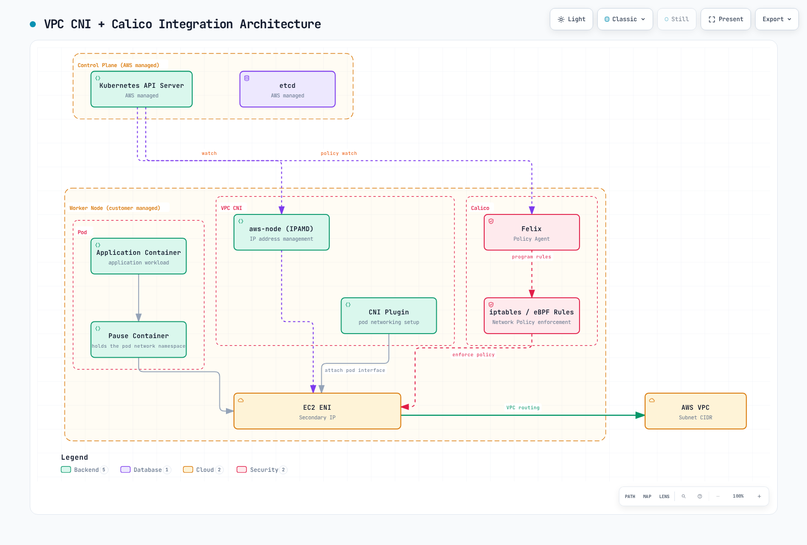
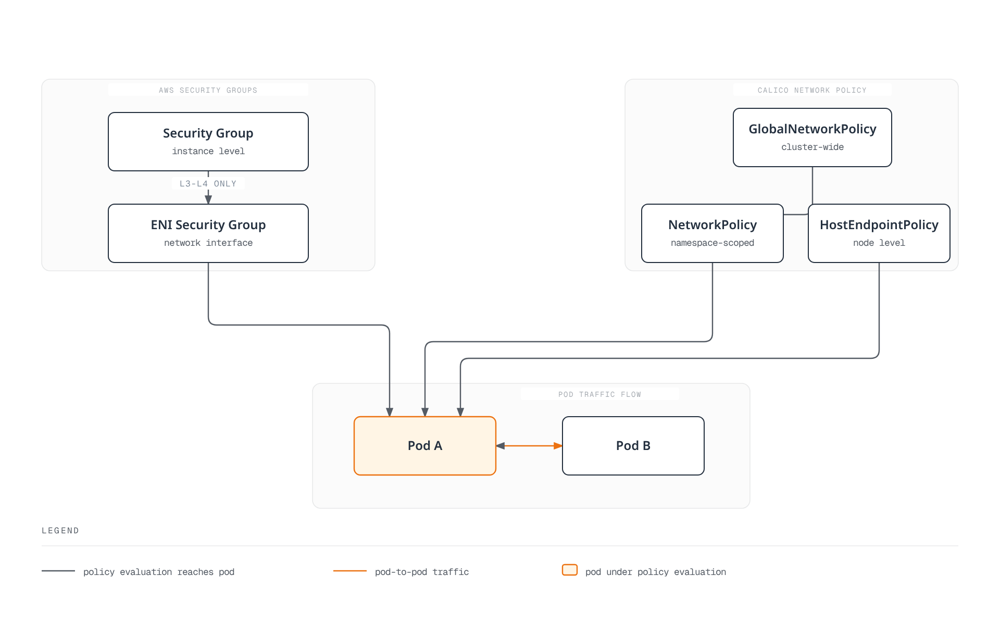

# Part 8: EKS Integration

> **Reviewed baseline**: Calico 3.32.2 / Tigera Operator 1.42.6 / Kubernetes 1.34–1.36 tested by Calico. **Last Updated**: September 12, 2026

## Overview

This guide uses Calico to enforce policy on **ordinary Linux EC2 worker nodes with Amazon VPC CNI**. VPC CNI allocates Pod IPs and configures VPC networking; Calico programs policy in the node's dataplane. The installation below keeps the Iptables dataplane and kube-proxy. Calico networking and eBPF are separate deployment choices with additional prerequisites.

As of this review, EKS lists 1.34–1.36 in standard support and 1.31–1.33 in extended support. Calico 3.32's published Kubernetes test range is 1.34–1.36. EKS availability, upstream Kubernetes releases, and Calico compatibility are separate checks; an upstream 1.37 release does not extend this matrix. Confirm the target Region's EKS and add-on versions before installation.

## VPC CNI + Calico Architecture



[🔍 View interactive diagram](https://www.atomai.click/kubernetes-docs/archmaps/en-networking-calico-08-eks-integration-0.html)

The figure summarizes component responsibilities. A packet does not traverse the pause container or Felix process as a forwarding proxy. Felix programs rules that the Linux kernel evaluates. Its `iptables / eBPF` label represents alternative dataplanes; this guide installs Iptables. Typha and kube-controllers run on customer worker capacity, not inside the AWS-managed EKS control plane.

| Component | Responsibility in this configuration |
| --- | --- |
| `aws-node` / IPAMD and VPC CNI plugin | Manage ENIs/IP allocation and configure Pod connectivity |
| Felix in `calico-node` | Program policy rules for local endpoints |
| Typha | Distribute datastore updates to Felix; operator manages scaling |
| kube-controllers | Reconcile Calico data with Kubernetes resources |
| kube-proxy | Provide Kubernetes Service forwarding in this baseline |

For cross-node traffic, the kernel evaluates the applicable policy and uses the VPC path. Same-node traffic can stay on the host. A dropped packet is discarded; a policy drop does not return the packet to the sender. Applicable source egress and destination ingress controls must both permit the connection.

## Choose a Policy Engine and Installation Method

| Choice | What it installs | Lifecycle and scope |
| --- | --- | --- |
| Amazon VPC CNI network policy | AWS's policy implementation | Configure the compatible `vpc-cni` add-on; this does not install Calico |
| Tigera Operator manifests | Operator and Calico custom resources | Pin the release, manage CRDs, then reconcile the Installation |
| Tigera Operator Helm chart | The same operator, with Helm-managed configuration | Render and review values; use the existing release for upgrades |
| Direct Calico manifests | Calico components without the operator | Preserve platform customization and own the upgrade procedure |

EKS add-ons are not automatically updated when a new add-on version is released or the cluster minor version changes. AWS, Marketplace, and community add-ons also have different support owners. Do not assume an add-on named `calico` exists or that a Marketplace product is the same as this OSS installation; inspect the actual catalog, publisher, version, licensing and compute compatibility.

**Use one network policy engine for the same endpoints.** The Calico EKS guide requires AWS VPC CNI network policy to be disabled. A migration needs a reviewed handover of policies, node state and availability; merely toggling a flag while both engines run is not a migration procedure. AWS warns that rules can remain after removing a policy agent and recommends replacing affected nodes when migrating from a third-party engine. See the [AWS policy considerations](https://docs.aws.amazon.com/eks/latest/userguide/cni-network-policy.html) and [disable procedure](https://docs.aws.amazon.com/eks/latest/userguide/network-policy-disable.html).

## Prepare the Existing VPC CNI Installation

The following commands inspect an existing managed `vpc-cni` add-on. Use the actual Region and cluster name; a self-managed VPC CNI installation must instead be changed through its own manifest or Helm owner.

```bash
EKS_CLUSTER=my-cluster
EKS_REGION=us-east-1
EKS_VERSION=$(aws eks describe-cluster --name "$EKS_CLUSTER" \
  --region "$EKS_REGION" --query cluster.version --output text)

aws eks describe-addon-versions --addon-name vpc-cni \
  --kubernetes-version "$EKS_VERSION" --region "$EKS_REGION" \
  --query 'addons[0].addonVersions[].{version:addonVersion,compatibility:compatibilities,compute:computeTypes}'

aws eks describe-addon --cluster-name "$EKS_CLUSTER" \
  --addon-name vpc-cni --region "$EKS_REGION" > vpc-cni-current.json

VPC_CNI_VERSION=$(jq -r '.addon.addonVersion' vpc-cni-current.json)
aws eks describe-addon-configuration --addon-name vpc-cni \
  --addon-version "$VPC_CNI_VERSION" --region "$EKS_REGION" \
  --query configurationSchema --output text > vpc-cni-schema.json
```

Calico requires `ANNOTATE_POD_IP=true` so that VPC CNI promptly publishes `vpc.amazonaws.com/pod-ips`. The `aws-node` ServiceAccount needs permission to patch Pods. Current VPC CNI documentation says the EKS add-on updates this permission automatically; verify it rather than overwriting the existing ClusterRole:

```bash
kubectl auth can-i patch pods --all-namespaces \
  --as=system:serviceaccount:kube-system:aws-node
```

This authorization check requires permission to impersonate that ServiceAccount. If the permission is absent, a separate binding can add the required rule without replacing existing rules. For a nonstandard installation, use its actual ServiceAccount name.

```yaml
apiVersion: rbac.authorization.k8s.io/v1
kind: ClusterRole
metadata:
  name: calico-vpc-pod-annotations
rules:
  - apiGroups: [""]
    resources: ["pods"]
    verbs: ["patch"]
---
apiVersion: rbac.authorization.k8s.io/v1
kind: ClusterRoleBinding
metadata:
  name: calico-vpc-pod-annotations
roleRef:
  apiGroup: rbac.authorization.k8s.io
  kind: ClusterRole
  name: calico-vpc-pod-annotations
subjects:
  - kind: ServiceAccount
    name: aws-node
    namespace: kube-system
```

For the reviewed **new or already policy-only configuration**, prepare the following candidate while preserving the current add-on settings:

```bash
jq '(.addon.configurationValues // "") as $current
  | (if $current == "" then {} else ($current | fromjson) end)
  | .enableNetworkPolicy = "false"
  | .env.ANNOTATE_POD_IP = "true"
  | del(.env.NETWORK_POLICY_ENFORCING_MODE)' \
  vpc-cni-current.json > vpc-cni-calico.json
```

This command expects JSON configuration values; if the existing values are YAML, parse and convert them without dropping fields before preparing the candidate. Stop on a parse error. Validate the candidate against the retrieved EKS build schema and review the diff. The `NETWORK_POLICY_ENFORCING_MODE` variable belongs to the AWS policy agent; leaving it configured when that agent is absent can break Pod creation. If AWS policy is currently active, complete the migration plan before using this candidate. Apply the approved configuration through the add-on owner:

```bash
aws eks update-addon --cluster-name "$EKS_CLUSTER" \
  --addon-name vpc-cni --region "$EKS_REGION" \
  --configuration-values file://vpc-cni-calico.json \
  --resolve-conflicts PRESERVE
```

Inspect the returned update status and the resulting DaemonSet. A preserved conflict can prevent the desired field from taking effect. Do not treat successful JSON parsing or an accepted update request as proof of policy enforcement.

## Install Calico with the Operator

Choose **one** of the manifest or Helm paths below for a fresh installation. Do not install a second operator over an existing release. These examples assume ordinary EC2 Linux workers, reachable Kubernetes API/DNS, compatible VPC CNI and no competing policy engine.

### Operator Manifest Path

Calico 3.32 separates the Calico CRDs from the operator manifest:

```bash
kubectl create -f https://raw.githubusercontent.com/projectcalico/calico/v3.32.2/manifests/v1_crd_projectcalico_org.yaml
kubectl create -f https://raw.githubusercontent.com/projectcalico/calico/v3.32.2/manifests/tigera-operator.yaml
```

Save the following as `calico-eks-installation.yaml`:

```yaml
apiVersion: operator.tigera.io/v1
kind: Installation
metadata:
  name: default
spec:
  kubernetesProvider: EKS
  cni:
    type: AmazonVPC
  calicoNetwork:
    bgp: Disabled
    linuxDataplane: Iptables
  nodeUpdateStrategy:
    type: RollingUpdate
    rollingUpdate:
      maxUnavailable: 1
---
apiVersion: operator.tigera.io/v1
kind: APIServer
metadata:
  name: default
spec: {}
---
apiVersion: operator.tigera.io/v1
kind: Goldmane
metadata:
  name: default
spec: {}
---
apiVersion: operator.tigera.io/v1
kind: Whisker
metadata:
  name: default
spec: {}
```

```bash
kubectl apply -f calico-eks-installation.yaml
kubectl get tigerastatus
kubectl get pods -n calico-system
```

The API server, Goldmane flow aggregator and Whisker UI are available in OSS. Configure their access and resource capacity for your environment. Setting `cni.type: AmazonVPC` delegates IPAM/networking to VPC CNI; `bgp: Disabled` alone does not select the CNI. Let the operator manage Typha replicas; `typhaDeployment.spec.replicas` is not a supported Installation override. See [scaling details](07-advanced-topics.md).

### Helm Path

Save this as `calico-eks-values.yaml`. `installation` maps to the Installation API. Top-level `nodeSelector` controls the operator Pod, not every Calico component. Unsupported values may be silently ignored by Helm, so inspect the rendered resources.

```yaml
installation:
  enabled: true
  kubernetesProvider: EKS
  cni:
    type: AmazonVPC
  calicoNetwork:
    bgp: Disabled
    linuxDataplane: Iptables
  nodeUpdateStrategy:
    type: RollingUpdate
    rollingUpdate:
      maxUnavailable: 1
apiServer:
  enabled: true
goldmane:
  enabled: true
whisker:
  enabled: true
manageCRDs: true
```

```bash
helm repo add projectcalico https://docs.tigera.io/calico/charts
helm repo update projectcalico
helm template calico projectcalico/tigera-operator \
  --version v3.32.2 --namespace tigera-operator \
  -f calico-eks-values.yaml > calico-rendered.yaml

# After reviewing the rendered configuration for the prepared cluster:
helm install calico projectcalico/tigera-operator \
  --version v3.32.2 --namespace tigera-operator --create-namespace \
  -f calico-eks-values.yaml
```

With `manageCRDs: true`, the operator manages required CRDs after starting. For an upgrade that uses new fields immediately, apply the matching CRDs first through their existing owner, following the [Calico upgrade procedure](https://docs.tigera.io/calico/latest/operations/upgrading/kubernetes-upgrade). Helm rollback alone does not guarantee that a CRD or stored-data migration is reversed.

## AWS Native Network Policy as an Alternative

AWS VPC CNI standard NetworkPolicy support began in **VPC CNI 1.14**, not EKS 1.14. The current AWS guide requires VPC CNI **1.21+ for both standard and admin policies**, compatible EKS/platform versions, and Linux kernel 5.10+. Use the current compatibility guidance rather than old launch-version examples.

AWS now documents `networking.k8s.aws/v1alpha1` **ClusterNetworkPolicy**, including Admin and Baseline tiers, alongside namespace-scoped `networking.k8s.io/v1` NetworkPolicy. It is a different API from Calico GlobalNetworkPolicy and Calico's configurable tiers. Do not describe native policy as permanently limited to namespace-scoped rules.

| Capability | AWS native implementation | Calico OSS in this guide |
| --- | --- | --- |
| Kubernetes NetworkPolicy | Supported on eligible EC2 Linux nodes | Supported on managed endpoints |
| Cluster policy | AWS ClusterNetworkPolicy, with its own rules and prerequisites | Calico GlobalNetworkPolicy and Tier |
| Policy observability | Agent metrics/event logs; configure any CloudWatch delivery separately | Felix/Typha metrics, Goldmane and Whisker flow observability |
| Application-layer policy | Do not infer it from L3/L4 network policy | Separate Dikastes/Istio integration; not enabled by this installation |
| DNS/FQDN policy in Calico | Not a Calico API implementation | The documented domain-based policy feature requires a commercial Calico edition |

For the native alternative, configure `enableNetworkPolicy` through the compatible VPC CNI add-on/Helm settings. Setting an invented `ENABLE_NETWORK_POLICY` environment variable on `aws-node` is insufficient. Native `standard` startup mode initially allows traffic while policy is programmed; `strict` starts with deny and requires needed paths, including DNS. These AWS settings do not configure Calico's startup behavior.

Native enforcement has documented limits: EC2 Linux only, primary Pod interface only, IP-family constraints, and reliable operation with controller-owned Pods. Review port/protocol limits and Service-port requirements. Keep AWS-managed PolicyEndpoint resources controller-owned. Use the [maintained VPC CNI guide](../01-vpc-cni.md) for the full setup and migration details.

## Node Types and Networking Profiles

| Profile | Applicability |
| --- | --- |
| Ordinary managed or self-managed EC2 Linux nodes + VPC CNI | Baseline policy-only installation above; management model alone does not decide Calico capability |
| EC2 nodes + full Calico CNI | Separate Tigera-documented design; Pod addressing, control-plane reachability, CNI ownership and support boundaries change |
| EKS Fargate | Neither Calico's node agent nor VPC CNI native network policy runs on these Pods; security groups for Pods are a separate supported control |
| EKS Auto Mode | Built-in AWS networking/policy; alternate CNI and network policy plugins are unsupported |
| EKS Hybrid Nodes | VPC CNI is incompatible; the specialized CNI guide lists AWS-maintained Cilium 1.17/1.18 builds; see the support qualification below |
| Windows nodes | Separate Windows/VPC CNI and Calico HNS procedure; no Calico eBPF dataplane; see [Windows limitations](07-advanced-topics.md) |

The specialized Hybrid CNI guide lists AWS-maintained Cilium builds and links Calico examples elsewhere, while the [general alternate-CNI page](https://docs.aws.amazon.com/eks/latest/userguide/alternate-cni-plugins.html) still describes core Cilium/Calico support for Hybrid Nodes. Do not infer Calico support termination from the example move or treat arbitrary upstream versions as AWS-supported. Confirm the specific distribution/capability support boundary.

A Calico policy on an EC2 endpoint can restrict that endpoint's traffic involving a Fargate peer; this does not mean that policy is enforced inside Fargate. Mixed compute clusters need explicit scheduling and enforcement boundaries, rather than labeling every worker “full Calico support.”

Full Calico CNI is not enabled by setting VPC CNI's `enableNetworkPolicy` to false. Tigera's fresh-cluster procedure removes the competing CNI before adding workers. Do not delete `aws-node` from an existing production cluster as a conversion shortcut. The documented overlay design also needs special consideration for API-server-to-Pod traffic, such as admission webhooks; trusted `hostNetwork` components are one documented workaround. Review Pod CIDRs, return paths, MTU, node IAM/source-destination checks where applicable, and the AWS/Tigera support boundary before adopting that profile.

For Auto Mode, VPC CNI environment variables and ENIConfig settings do not configure the managed networking service. Use NodeClass. Auto Mode runs CoreDNS as a node system service; a pure Auto Mode cluster does not need the traditional CoreDNS Deployment, while mixed non-Auto nodes still require it. Initial DNS queries can be local while upstream forwarding still leaves the node.

## IAM, IRSA and Pod Identity

The basic Calico policy-only installation uses Kubernetes RBAC; it does not require a broad EC2 discovery or CloudWatch IAM role on `calico-node`. VPC CNI needs its own documented AWS permissions. A separate log exporter or a commercial cloud integration may need additional permissions on **that component's** ServiceAccount.

IRSA uses the cluster OIDC provider and an appropriately scoped trust policy to obtain AWS credentials for a ServiceAccount. EKS Pod Identity is another option where the component, SDK and compute type support it. Neither an IAM policy nor an invented `Installation.spec.nodeMetadata` value wires credentials into a workload. Follow the owning component's configuration and avoid competing with operator-managed ServiceAccounts. See [VPC CNI IAM configuration](https://docs.aws.amazon.com/eks/latest/userguide/cni-iam-role.html).

## Security Groups and Calico Policy



[🔍 View interactive diagram](https://www.atomai.click/kubernetes-docs/archmaps/en-networking-calico-08-eks-integration-3.html)

The figure is a conceptual layering diagram, not a fixed evaluation order. Calico evaluates policies by tier/order and rule semantics; NetworkPolicy does not always precede GlobalNetworkPolicy. CloudTrail records AWS API activity, not packet decisions. VPC Flow Logs and the configured policy logging tools provide different traffic evidence. Application mTLS/authorization must be deployed separately.

Security groups attach to ENIs. **Security groups for Pods** can select workloads through a SecurityGroupPolicy, so “security groups only select instances” is incorrect. To combine SG-for-Pods with Calico policy, AWS requires VPC CNI 1.11+ and `POD_SECURITY_GROUP_ENFORCING_MODE=standard`; in strict mode those Pods' traffic is not subject to Calico enforcement. Check branch-ENI/instance support and recreate affected Pods after changing the mode. SG-for-Pods is not supported on Windows or Auto Mode.

In standard mode with VPC CNI's usual external SNAT enabled (`AWS_VPC_K8S_CNI_EXTERNALSNAT=false`), traffic leaving the VPC uses the node's primary ENI IP and security groups. Do not assume Pod security group egress rules cover every path. See [AWS's exact conditions](https://docs.aws.amazon.com/eks/latest/userguide/security-groups-for-pods.html).

### A Namespace-Scoped Application Policy

This example selects only `app=frontend` Pods in a prepared `calico-eks-demo` namespace. It allows an **in-cluster gateway Pod** in the same namespace to reach TCP 8080 and permits frontend egress to same-namespace backend Pods on TCP 8080. The example assumes ordinary CoreDNS Pods with `k8s-app=kube-dns`; NodeLocal DNS or another resolver needs different destinations. Other policies/tiers can change the result, so inspect the entire effective policy set.

```yaml
apiVersion: projectcalico.org/v3
kind: NetworkPolicy
metadata:
  name: frontend-policy
  namespace: calico-eks-demo
spec:
  selector: app == 'frontend'
  types: [Ingress, Egress]
  ingress:
    - action: Allow
      protocol: TCP
      source:
        selector: app == 'gateway'
      destination:
        ports: [8080]
  egress:
    - action: Allow
      protocol: TCP
      destination:
        selector: app == 'backend'
        ports: [8080]
    - action: Allow
      protocol: UDP
      destination:
        namespaceSelector: projectcalico.org/name == 'kube-system'
        selector: k8s-app == 'kube-dns'
        ports: [53]
    - action: Allow
      protocol: TCP
      destination:
        namespaceSelector: projectcalico.org/name == 'kube-system'
        selector: k8s-app == 'kube-dns'
        ports: [53]
```

Keep the destination selector and port under the **same** `destination` mapping. Duplicate YAML keys can silently remove the selector and allow TCP 8080 to unintended endpoints. An ALB/NLB is not a Kubernetes Pod with `app=load-balancer`; account for target mode, health checks and observed source addresses separately using the [load balancer guide](../03-aws-lb-controller.md).

A blank, cluster-wide GlobalNetworkPolicy selecting `all()` can interrupt DNS, the API, monitoring and application traffic. Build default-deny behavior within a selected test namespace first, with explicit dependency permissions; see [network policy](05-network-policy.md).

## Upgrade and Recovery

1. Inventory the EKS control plane, node OS/kubelet, VPC CNI, kube-proxy, Calico/operator/CRD and calicoctl versions. Export the owned configuration and policies.
2. Choose a Calico version compatible with **both sides of the planned transition**. There is no universal “always upgrade Calico first/last” rule. Follow the installation-specific procedure and CRD migration notes.
3. Review EKS upgrade insights, removed APIs and all add-on compatibility. Upgrade the EKS control plane one minor version at a time, then bring nodes and applicable add-ons to compatible versions.
4. Verify policy and Service behavior during the rolling transition, including negative cases and newly created Pods. Keep configuration ownership and rollback prerequisites explicit.

```bash
aws eks describe-cluster --name "$EKS_CLUSTER" --region "$EKS_REGION" \
  --query 'cluster.{version:version,platform:platformVersion,status:status}'
kubectl get nodes -o wide
kubectl get daemonset calico-node -n calico-system -o wide
kubectl get tigerastatus
helm get values calico -n tigera-operator -o yaml
```

Current EKS supports **conditional rollback to the previous minor version within seven days of an in-place upgrade**. The cluster must meet the documented eligibility and readiness requirements; the window is not a general downgrade capability. Ordinary managed/self-managed/hybrid nodes and incompatible add-ons need preparation before the control plane. Auto Mode handles its node rollback; Fargate needs its own workload treatment. Calico and EKS add-ons are not automatically reverted, and preserving etcd data does not make incompatible resources safe. Follow the [current rollback procedure](https://docs.aws.amazon.com/eks/latest/userguide/rollback-cluster.html), without using `--force` to hide unresolved compatibility issues. Outside the eligible window, plan migration to another supported cluster.

Applying an older operator manifest or running `helm rollback` is not proof of safe Calico downgrade. Check the specific release's support and schema/data changes before choosing recovery steps. `calicoctl node status` reports node-local BGP state and is not a policy-only EKS acceptance test.

## Cost and Performance

| Factor | What to evaluate |
| --- | --- |
| Worker resources | Measure Felix, Typha, controllers and flow aggregation under actual policy/endpoint churn; CPU requests are not a separate AWS tariff |
| VPC IP capacity | Prefix delegation affects address allocation and density, not an automatic ENI attachment discount |
| Logging/metrics | Retention, ingestion, queries and exporter delivery have separate costs; metrics are not flow logs |
| Cross-AZ traffic | Evaluate actual source/destination paths and service pricing; locality also affects availability |
| EKS lifecycle | Extended support can add a cluster charge; use the current support calendar |

The earlier per-component dollar estimates lacked Region, instance pricing and allocation assumptions. They are not a usable cost model. Use observed resource demand and the relevant AWS prices rather than claiming fixed monthly savings from arbitrary resource limits.

### Prefix Delegation

For ordinary VPC CNI nodes, configure `ENABLE_PREFIX_DELEGATION`, `WARM_PREFIX_TARGET`, `MINIMUM_IP_TARGET` and `WARM_IP_TARGET` in the add-on's **`env`** settings or its owning DaemonSet/Helm configuration. Lowercase `enable-prefix-delegation` entries in a ConfigMap do not configure IPAMD.

Start with one documented allocation strategy. `WARM_IP_TARGET` and `MINIMUM_IP_TARGET` override `WARM_PREFIX_TARGET`; setting all of them does not stack their effects. IPv4 prefixes need contiguous `/28` subnet space and suitable instances. Verify subnet fragmentation, reservations, max-Pods/kubelet configuration and the rollout plan. See the [AWS prefix procedure](https://docs.aws.amazon.com/eks/latest/userguide/cni-increase-ip-addresses-procedure.html).

### Calico eBPF on EKS

Calico documents EKS and compatible VPC CNI networking for its eBPF dataplane, but this changes Service handling and needs a separate migration. Follow [Part 6](06-ebpf-dataplane.md): kernel/platform checks, direct API-server FQDN access and bootstrap DNS, kube-proxy ownership, health ports and rollback state all matter.

VPC CNI does **not** universally require kube-proxy to remain running. If kube-proxy must coexist, Calico requires both `bpfKubeProxyIptablesCleanupEnabled: false` and `bpfKubeProxyHealthzPort: 0` to avoid the documented conflicts. A generic DaemonSet selector patch may be reconciled by its owner and must not overwrite unrelated selectors. DSR is not a default EKS optimization: AWS subnet/source-address checks and external load balancer limitations require separate validation. This baseline keeps Iptables and kube-proxy.

Generic sysctl presets, reducing memory to an arbitrary minimum, or shortening conntrack lifetimes do not establish better performance. Benchmark the actual workload and preserve return paths, established connections and failure recovery.

## eksctl Cluster Planning Example

This is a **planning example for ordinary managed Linux nodes**, not a production-tested recipe or a conversion of Auto Mode. Confirm supported add-on builds through `describe-addon-versions` and pin the approved builds in the configuration before provisioning. Omitting an add-on version selects a compatible default; it is not an approval of every future release. Private API access requires a management path into the VPC. NAT, logs, worker capacity and address ranges require an environment-specific design.

```yaml
apiVersion: eksctl.io/v1alpha5
kind: ClusterConfig
metadata:
  name: calico-eks-demo
  region: us-east-1
  version: "1.36"
iam:
  withOIDC: true
vpc:
  cidr: 10.0.0.0/16
  clusterEndpoints:
    publicAccess: false
    privateAccess: true
managedNodeGroups:
  - name: linux-workers
    instanceType: m5.large
    amiFamily: AmazonLinux2023
    desiredCapacity: 3
    minSize: 3
    maxSize: 6
    privateNetworking: true
    volumeType: gp3
    volumeSize: 100
addons:
  - name: vpc-cni
    attachPolicyARNs:
      - arn:aws:iam::aws:policy/AmazonEKS_CNI_Policy
    configurationValues: |
      enableNetworkPolicy: "false"
      env:
        ANNOTATE_POD_IP: "true"
  - name: coredns
  - name: kube-proxy
cloudWatch:
  clusterLogging:
    enableTypes: [api, audit, authenticator, controllerManager, scheduler]
```

The IPv4 CNI policy belongs to the VPC CNI identity, not Calico. Revisit IAM for other IP families and identity methods. After the approved cluster exists, perform the annotation/RBAC checks and **one** Calico installation path above.

## Validate the Result

```bash
kubectl get tigerastatus
kubectl rollout status daemonset/calico-node -n calico-system --timeout=300s
kubectl get pods -n calico-system -o wide
kubectl get pods -n calico-eks-demo -o json \
  | jq '.items[] | {name: .metadata.name, ip: .status.podIP,
      annotatedIPs: .metadata.annotations["vpc.amazonaws.com/pod-ips"]}'
kubectl get networkpolicies.projectcalico.org -n calico-eks-demo
```

Use controller-managed test workloads and check allowed and denied connections on the same node, across nodes/AZs, after Pod recreation and during updates. Include DNS, API/identity endpoints needed by the application, Service traffic and load balancer health checks. A Running Pod or Ready node verifies neither the desired denial nor absence of a startup policy gap. Test IPv6 separately: Calico's current EKS guide excludes policy enforcement for IPv6 Pods with `ENABLE_V4_EGRESS=true`.

This document's examples were checked against released schemas and rendered charts; no EKS cluster, IAM resources or production traffic were created to validate them.

## References

- [Calico on EKS](https://docs.tigera.io/calico/latest/getting-started/kubernetes/managed-public-cloud/eks)
- [Calico requirements](https://docs.tigera.io/calico/latest/getting-started/kubernetes/requirements)
- [Calico Helm installation](https://docs.tigera.io/calico/latest/getting-started/kubernetes/helm)
- [Calico upgrades](https://docs.tigera.io/calico/latest/operations/upgrading/kubernetes-upgrade)
- [VPC CNI 1.23 configuration reference](https://github.com/aws/amazon-vpc-cni-k8s/blob/v1.23.0/README.md)
- [EKS native network policy](https://docs.aws.amazon.com/eks/latest/userguide/cni-network-policy.html)
- [EKS add-on updates](https://docs.aws.amazon.com/eks/latest/userguide/updating-an-add-on.html)
- [EKS version lifecycle](https://docs.aws.amazon.com/eks/latest/userguide/kubernetes-versions.html)
- [EKS Auto Mode networking](https://docs.aws.amazon.com/eks/latest/userguide/auto-networking.html)
- [EKS Hybrid Nodes CNI](https://docs.aws.amazon.com/eks/latest/userguide/hybrid-nodes-cni.html)

## Next Steps and Quiz

Continue with [operations](09-operations.md), review [advanced topics](07-advanced-topics.md) or the [glossary](glossary.md), and test your understanding with the [EKS Integration Quiz](../../quizzes/networking/calico/08-eks-integration-quiz.md).
