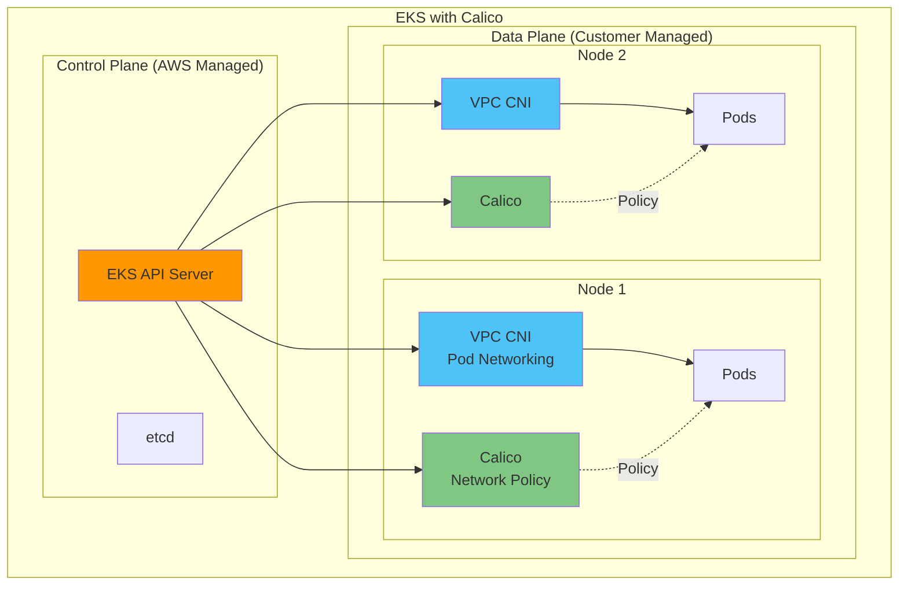
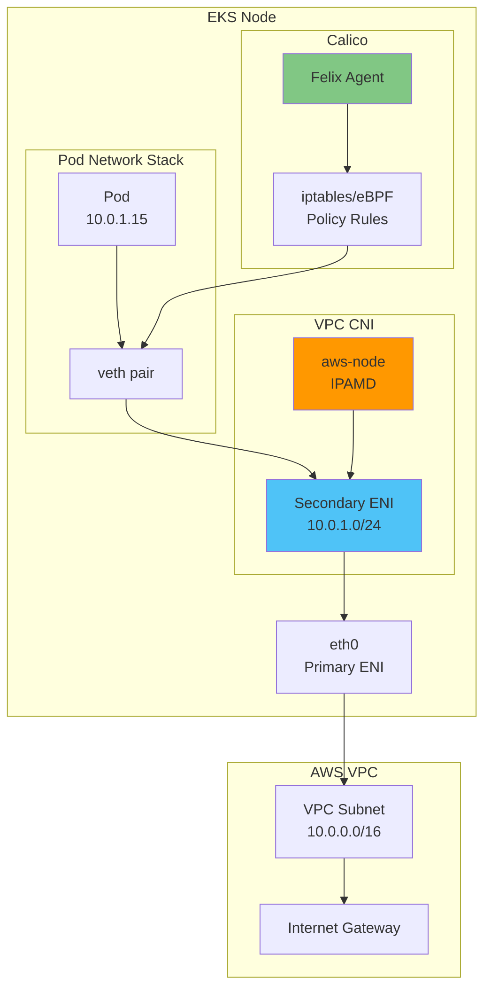
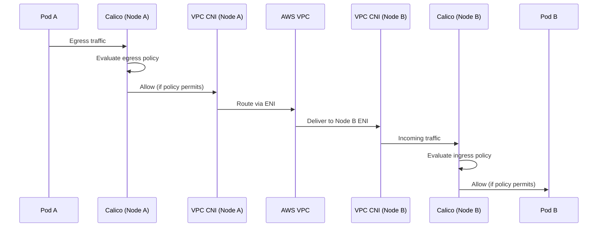
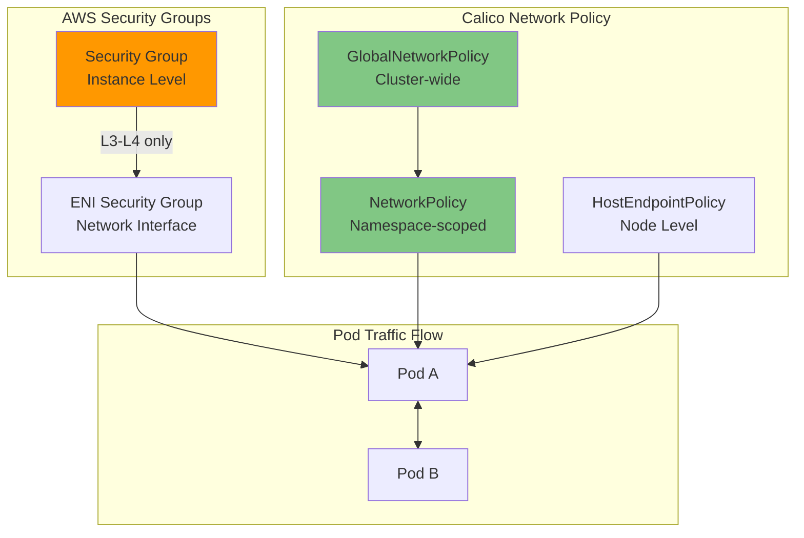

# Part 8: Calico on Amazon EKS

> **Supported Versions**: Calico v3.29+ / Kubernetes 1.28+ / EKS 1.28+
> **Last Updated**: February 22, 2026

## Overview

This chapter covers Calico integration with Amazon EKS, including architecture patterns, installation methods, and EKS-specific optimizations. Learn how to leverage Calico's network policy capabilities alongside AWS VPC CNI for optimal EKS networking.



## VPC CNI + Calico Architecture

Amazon EKS uses AWS VPC CNI by default for pod networking. Calico can be added for advanced network policy capabilities while VPC CNI handles IP address management.

### Architecture Deep Dive



### Traffic Flow with VPC CNI + Calico



## Installation Methods Comparison

### Methods Overview

| Method | Complexity | Flexibility | Upgrade Path | EKS Integration |
|--------|------------|-------------|--------------|-----------------|
| EKS Add-on | Low | Limited | Automatic | Native |
| Tigera Operator | Medium | High | Semi-auto | Good |
| Helm | Medium | Highest | Manual | Good |
| Manifest | High | Medium | Manual | Basic |

### Method 1: EKS Add-on (Simplest)

The EKS add-on provides native integration with EKS lifecycle management.

```bash
# Enable via AWS CLI
aws eks create-addon \
  --cluster-name my-cluster \
  --addon-name vpc-cni \
  --addon-version v1.18.0-eksbuild.1 \
  --configuration-values '{"enableNetworkPolicy": "true"}'

# Or enable Calico as separate add-on (if available)
aws eks create-addon \
  --cluster-name my-cluster \
  --addon-name calico \
  --service-account-role-arn arn:aws:iam::ACCOUNT:role/CalicoRole
```

```yaml
# eksctl configuration
apiVersion: eksctl.io/v1alpha5
kind: ClusterConfig
metadata:
  name: my-cluster
  region: us-east-1
  version: "1.30"

addons:
  - name: vpc-cni
    version: latest
    configurationValues: |
      enableNetworkPolicy: "true"
      nodeAgent:
        enablePolicyEventLogs: "true"
```

**Pros:**
- Automatic updates with EKS
- AWS support included
- Simple configuration
- Native CloudWatch integration

**Cons:**
- Limited to Kubernetes NetworkPolicy
- No Calico-specific features
- Less configuration flexibility

### Method 2: Tigera Operator (Recommended)

```bash
# Install Tigera Operator
kubectl create -f https://raw.githubusercontent.com/projectcalico/calico/v3.29.0/manifests/tigera-operator.yaml
```

```yaml
# Installation resource for EKS
apiVersion: operator.tigera.io/v1
kind: Installation
metadata:
  name: default
spec:
  # Specify EKS as the Kubernetes provider
  kubernetesProvider: EKS

  # Use VPC CNI for networking
  cni:
    type: AmazonVPC

  calicoNetwork:
    # Disable Calico networking (using VPC CNI)
    bgp: Disabled

    # No IP pools needed (VPC CNI handles IPAM)
    ipPools: []

    # Linux dataplane
    linuxDataplane: Iptables  # or BPF for eBPF mode

  # Component resources
  componentResources:
    - componentName: Node
      resourceRequirements:
        requests:
          cpu: 100m
          memory: 128Mi
        limits:
          cpu: 500m
          memory: 256Mi

  # Enable Typha for clusters > 50 nodes
  typhaDeployment:
    spec:
      replicas: 3
```

```bash
# Apply installation
kubectl apply -f installation.yaml

# Verify installation
kubectl get tigerastatus
kubectl get pods -n calico-system
```

**Pros:**
- Full Calico features (GlobalNetworkPolicy, Tiers, etc.)
- Operator manages lifecycle
- Automatic component reconciliation
- eBPF dataplane support

**Cons:**
- Additional operator deployment
- Requires separate upgrades from EKS

### Method 3: Helm Installation

```bash
# Add Tigera Helm repository
helm repo add projectcalico https://docs.tigera.io/calico/charts
helm repo update

# Install with EKS-specific values
helm install calico projectcalico/tigera-operator \
  --namespace tigera-operator \
  --create-namespace \
  --version v3.29.0 \
  -f eks-values.yaml
```

```yaml
# eks-values.yaml
installation:
  kubernetesProvider: EKS
  cni:
    type: AmazonVPC
  calicoNetwork:
    bgp: Disabled
    linuxDataplane: Iptables

  # Node configuration
  nodeUpdateStrategy:
    rollingUpdate:
      maxUnavailable: 1
    type: RollingUpdate

# Typha configuration
typhaDeployment:
  replicas: 3
  resources:
    requests:
      cpu: 100m
      memory: 128Mi
    limits:
      cpu: 500m
      memory: 256Mi

# Felix configuration via operator
felixConfiguration:
  prometheusMetricsEnabled: true
  prometheusMetricsPort: 9091
  flowLogsFlushInterval: "15s"
  flowLogsFileEnabled: true

# API server (for calicoctl access)
apiServer:
  enabled: false  # Set to true for Calico Enterprise
```

**Pros:**
- GitOps-friendly
- Version control for configuration
- Easy rollback
- Customizable values

**Cons:**
- Requires Helm knowledge
- Manual upgrade management

## EKS Network Policy Controller (v1.14+)

EKS 1.25+ includes native Network Policy support via the VPC CNI.

### Enabling Native Network Policy

```yaml
# eksctl configuration
apiVersion: eksctl.io/v1alpha5
kind: ClusterConfig
metadata:
  name: network-policy-cluster
  region: us-east-1
  version: "1.30"

addons:
  - name: vpc-cni
    version: latest
    configurationValues: |
      enableNetworkPolicy: "true"
      nodeAgent:
        enablePolicyEventLogs: "true"
        enableCloudWatchLogs: "true"
```

```bash
# Enable via kubectl
kubectl set env daemonset aws-node -n kube-system ENABLE_NETWORK_POLICY=true

# Verify network policy agent
kubectl get pods -n kube-system -l k8s-app=aws-node
kubectl logs -n kube-system -l k8s-app=aws-node -c aws-network-policy-agent
```

### EKS Native vs Calico Network Policy

| Feature | EKS Native (VPC CNI) | Calico |
|---------|---------------------|--------|
| Kubernetes NetworkPolicy | Yes | Yes |
| GlobalNetworkPolicy | No | Yes |
| Policy Tiers | No | Yes |
| L7 Policy (HTTP) | No | Yes (Enterprise) |
| DNS-based Policy | No | Yes |
| FQDN Egress Rules | No | Yes |
| Host Endpoint Policy | No | Yes |
| Policy Preview | No | Yes (Enterprise) |
| Flow Logs | CloudWatch | Prometheus/File |
| Performance | eBPF-optimized | iptables/eBPF |

## Node Type Considerations

### Feature Matrix by Node Type

| Feature | Managed Nodes | Self-Managed | Fargate |
|---------|--------------|--------------|---------|
| Calico CNI | No (VPC CNI) | Yes | No |
| Calico Policy | Yes | Yes | Limited |
| eBPF Dataplane | Yes | Yes | No |
| BGP | No | Yes | No |
| WireGuard | Yes | Yes | No |
| Host Endpoints | Yes | Yes | No |
| Custom IPAM | No | Yes | No |
| Node Taints | Yes | Yes | N/A |

### Managed Node Groups

```yaml
# eksctl with managed nodes and Calico
apiVersion: eksctl.io/v1alpha5
kind: ClusterConfig
metadata:
  name: managed-calico-cluster
  region: us-east-1
  version: "1.30"

managedNodeGroups:
  - name: calico-nodes
    instanceType: m5.large
    desiredCapacity: 3
    minSize: 2
    maxSize: 10
    volumeSize: 100
    volumeType: gp3

    # Labels for Calico node selector
    labels:
      calico-enabled: "true"

    # IAM policies for Calico
    iam:
      withAddonPolicies:
        cloudWatch: true

    # Taints (optional)
    taints:
      - key: calico
        value: "true"
        effect: NoSchedule
```

### Self-Managed Nodes (Full Calico)

```yaml
# Self-managed nodes with full Calico networking
apiVersion: eksctl.io/v1alpha5
kind: ClusterConfig
metadata:
  name: self-managed-calico
  region: us-east-1
  version: "1.30"

# Disable VPC CNI for self-managed nodes
addons:
  - name: vpc-cni
    version: latest
    configurationValues: |
      enableNetworkPolicy: "false"

nodeGroups:
  - name: calico-full-nodes
    instanceType: m5.xlarge
    desiredCapacity: 3

    # Custom AMI with Calico pre-installed (optional)
    ami: ami-0123456789abcdef0

    # Disable VPC CNI on these nodes
    overrideBootstrapCommand: |
      #!/bin/bash
      # Remove VPC CNI
      /etc/eks/bootstrap.sh my-cluster \
        --kubelet-extra-args '--network-plugin=cni'

    labels:
      networking: calico-full

# Then install full Calico CNI on these nodes
```

### Fargate Considerations

```yaml
# Fargate profile with limited Calico support
apiVersion: eksctl.io/v1alpha5
kind: ClusterConfig
metadata:
  name: fargate-cluster
  region: us-east-1

fargateProfiles:
  - name: default
    selectors:
      - namespace: default
      - namespace: production
    # Note: Only Kubernetes NetworkPolicy works on Fargate
    # Calico GlobalNetworkPolicy does NOT apply to Fargate pods
```

**Fargate Limitations:**
- Only Kubernetes standard NetworkPolicy
- No Calico GlobalNetworkPolicy
- No eBPF dataplane
- No host endpoint policies
- No custom IPAM

## IRSA Configuration

IAM Roles for Service Accounts (IRSA) provides fine-grained IAM permissions for Calico components.

```yaml
# Create IAM policy for Calico
# calico-policy.json
{
  "Version": "2012-10-17",
  "Statement": [
    {
      "Effect": "Allow",
      "Action": [
        "logs:CreateLogGroup",
        "logs:CreateLogStream",
        "logs:PutLogEvents",
        "logs:DescribeLogGroups",
        "logs:DescribeLogStreams"
      ],
      "Resource": "arn:aws:logs:*:*:log-group:/aws/calico/*"
    },
    {
      "Effect": "Allow",
      "Action": [
        "ec2:DescribeInstances",
        "ec2:DescribeNetworkInterfaces",
        "ec2:DescribeSecurityGroups",
        "ec2:DescribeSubnets",
        "ec2:DescribeVpcs"
      ],
      "Resource": "*"
    }
  ]
}
```

```bash
# Create IAM policy
aws iam create-policy \
  --policy-name CalicoPolicy \
  --policy-document file://calico-policy.json

# Create IRSA for Calico
eksctl create iamserviceaccount \
  --cluster my-cluster \
  --namespace calico-system \
  --name calico-node \
  --attach-policy-arn arn:aws:iam::ACCOUNT:policy/CalicoPolicy \
  --approve
```

```yaml
# Calico installation with IRSA
apiVersion: operator.tigera.io/v1
kind: Installation
metadata:
  name: default
spec:
  kubernetesProvider: EKS
  cni:
    type: AmazonVPC

  # Reference the IRSA service account
  nodeMetadata: "true"

  calicoNetwork:
    bgp: Disabled
```

## Security Group vs Calico Policy

### Comparison



| Aspect | Security Groups | Calico Policy |
|--------|----------------|---------------|
| Scope | Instance/ENI | Pod/Namespace/Cluster |
| Granularity | IP/Port | Labels/Selectors/FQDN |
| Layer | L3-L4 | L3-L7 |
| Pod Selection | By Instance | By Labels |
| Dynamic Updates | Limited | Real-time |
| Audit | CloudTrail | Flow Logs |
| Cross-AZ | Yes | Yes |
| Cost | Free | Free (OSS) |

### Using Both Together

```yaml
# Security Group for node-level protection
# (Managed via AWS Console or Terraform)

# Calico for pod-level protection
apiVersion: projectcalico.org/v3
kind: NetworkPolicy
metadata:
  name: frontend-policy
  namespace: production
spec:
  selector: app == 'frontend'
  ingress:
    - action: Allow
      source:
        selector: app == 'load-balancer'
      protocol: TCP
      destination:
        ports:
          - 80
          - 443
  egress:
    - action: Allow
      destination:
        selector: app == 'backend'
      protocol: TCP
      destination:
        ports:
          - 8080
---
# Security Groups for Pods (EKS feature)
apiVersion: vpcresources.k8s.aws/v1beta1
kind: SecurityGroupPolicy
metadata:
  name: frontend-sg
  namespace: production
spec:
  podSelector:
    matchLabels:
      app: frontend
  securityGroups:
    groupIds:
      - sg-0123456789abcdef0
```

## EKS Upgrade Considerations

### Compatibility Matrix

| EKS Version | Calico 3.26 | Calico 3.27 | Calico 3.28 | Calico 3.29 |
|-------------|-------------|-------------|-------------|-------------|
| 1.27 | Yes | Yes | Yes | Yes |
| 1.28 | Yes | Yes | Yes | Yes |
| 1.29 | Limited | Yes | Yes | Yes |
| 1.30 | No | Yes | Yes | Yes |
| 1.31 | No | Limited | Yes | Yes |

### Upgrade Procedure

```bash
# 1. Check current versions
kubectl get pods -n calico-system -o jsonpath='{.items[*].spec.containers[*].image}'
aws eks describe-cluster --name my-cluster --query 'cluster.version'

# 2. Review release notes for compatibility
# https://docs.tigera.io/calico/latest/release-notes/

# 3. Upgrade Calico first (before EKS)
helm upgrade calico projectcalico/tigera-operator \
  --namespace tigera-operator \
  --version v3.29.0 \
  -f eks-values.yaml

# 4. Verify Calico health
kubectl get tigerastatus
calicoctl node status

# 5. Upgrade EKS control plane
aws eks update-cluster-version \
  --name my-cluster \
  --kubernetes-version 1.30

# 6. Upgrade node groups
eksctl upgrade nodegroup \
  --cluster my-cluster \
  --name calico-nodes \
  --kubernetes-version 1.30
```

## Cost Considerations

### Cost Factors

| Component | Cost Driver | Optimization |
|-----------|------------|--------------|
| VPC CNI IPs | ENI attachment, IP allocation | Use prefix delegation |
| Calico Typha | Instance resources | Right-size replicas |
| Flow Logs | Storage, processing | Aggregate, filter |
| Cross-AZ | Data transfer | Zone affinity |
| eBPF | CPU efficiency | Enable where supported |

### Cost Optimization Strategies

```yaml
# 1. Enable VPC CNI prefix delegation (reduce ENI usage)
apiVersion: v1
kind: ConfigMap
metadata:
  name: amazon-vpc-cni
  namespace: kube-system
data:
  enable-prefix-delegation: "true"
  warm-prefix-target: "1"
---
# 2. Optimize Calico resource allocation
apiVersion: operator.tigera.io/v1
kind: Installation
metadata:
  name: default
spec:
  componentResources:
    - componentName: Node
      resourceRequirements:
        requests:
          cpu: 50m  # Start low, scale as needed
          memory: 64Mi
        limits:
          cpu: 200m
          memory: 128Mi
---
# 3. Reduce flow log storage
apiVersion: projectcalico.org/v3
kind: FelixConfiguration
metadata:
  name: default
spec:
  flowLogsFlushInterval: "60s"  # Less frequent
  flowLogsFileAggregationKindForAllowed: 2  # Aggregate allowed flows
```

## EKS Performance Optimization

### Prefix Delegation

```yaml
# Enable prefix delegation for better IP density
apiVersion: v1
kind: ConfigMap
metadata:
  name: amazon-vpc-cni
  namespace: kube-system
data:
  enable-prefix-delegation: "true"
  warm-prefix-target: "1"
  minimum-ip-target: "16"
  warm-ip-target: "4"
```

### eBPF on EKS

```yaml
# Enable eBPF dataplane on EKS
apiVersion: operator.tigera.io/v1
kind: Installation
metadata:
  name: default
spec:
  kubernetesProvider: EKS
  cni:
    type: AmazonVPC
  calicoNetwork:
    bgp: Disabled
    linuxDataplane: BPF
---
apiVersion: projectcalico.org/v3
kind: FelixConfiguration
metadata:
  name: default
spec:
  bpfEnabled: true
  bpfExternalServiceMode: "Tunnel"  # or "DSR" for direct server return
  bpfKubeProxyIptablesCleanupEnabled: false  # Keep kube-proxy on EKS
  bpfDataIfacePattern: "^(eth.*)"
```

**Note:** On EKS, keep kube-proxy running even with eBPF mode, as VPC CNI integration requires it.

## Complete eksctl Configuration

```yaml
# Full EKS cluster with Calico - production-ready
apiVersion: eksctl.io/v1alpha5
kind: ClusterConfig

metadata:
  name: production-calico-cluster
  region: us-east-1
  version: "1.30"
  tags:
    environment: production
    networking: calico

# IAM configuration
iam:
  withOIDC: true
  serviceAccounts:
    - metadata:
        name: calico-node
        namespace: calico-system
      wellKnownPolicies:
        cloudWatch: true
      attachPolicy:
        Version: "2012-10-17"
        Statement:
          - Effect: Allow
            Action:
              - "ec2:DescribeInstances"
              - "ec2:DescribeNetworkInterfaces"
            Resource: "*"

# VPC configuration
vpc:
  cidr: 10.0.0.0/16
  nat:
    gateway: HighlyAvailable
  clusterEndpoints:
    publicAccess: true
    privateAccess: true

# Add-ons
addons:
  - name: vpc-cni
    version: latest
    configurationValues: |
      enableNetworkPolicy: "false"
      env:
        ENABLE_PREFIX_DELEGATION: "true"
        WARM_PREFIX_TARGET: "1"
  - name: coredns
    version: latest
  - name: kube-proxy
    version: latest

# Managed node groups
managedNodeGroups:
  - name: system-nodes
    instanceType: m5.large
    desiredCapacity: 3
    minSize: 3
    maxSize: 6
    volumeSize: 100
    volumeType: gp3
    labels:
      role: system
      calico: "true"
    taints:
      - key: CriticalAddonsOnly
        effect: NoSchedule
    iam:
      withAddonPolicies:
        cloudWatch: true
    availabilityZones:
      - us-east-1a
      - us-east-1b
      - us-east-1c

  - name: workload-nodes
    instanceType: m5.xlarge
    desiredCapacity: 6
    minSize: 3
    maxSize: 20
    volumeSize: 200
    volumeType: gp3
    labels:
      role: workload
      calico: "true"
    iam:
      withAddonPolicies:
        cloudWatch: true
        autoScaler: true
    availabilityZones:
      - us-east-1a
      - us-east-1b
      - us-east-1c

# Logging
cloudWatch:
  clusterLogging:
    enableTypes:
      - api
      - audit
      - authenticator
      - controllerManager
      - scheduler
```

## Step-by-Step Helm Installation

```bash
# Step 1: Create EKS cluster
eksctl create cluster -f cluster-config.yaml

# Step 2: Verify cluster
kubectl get nodes
aws eks describe-cluster --name production-calico-cluster

# Step 3: Add Tigera Helm repo
helm repo add projectcalico https://docs.tigera.io/calico/charts
helm repo update

# Step 4: Create namespace
kubectl create namespace tigera-operator

# Step 5: Create values file
cat > calico-values.yaml << 'EOF'
installation:
  kubernetesProvider: EKS
  cni:
    type: AmazonVPC
  calicoNetwork:
    bgp: Disabled
    linuxDataplane: Iptables
  nodeUpdateStrategy:
    rollingUpdate:
      maxUnavailable: 1
    type: RollingUpdate
  componentResources:
    - componentName: Node
      resourceRequirements:
        requests:
          cpu: 100m
          memory: 128Mi
        limits:
          cpu: 500m
          memory: 256Mi
    - componentName: Typha
      resourceRequirements:
        requests:
          cpu: 100m
          memory: 128Mi
        limits:
          cpu: 500m
          memory: 256Mi

typhaDeployment:
  replicas: 3

apiServer:
  enabled: false
EOF

# Step 6: Install Calico
helm install calico projectcalico/tigera-operator \
  --namespace tigera-operator \
  --version v3.29.0 \
  -f calico-values.yaml

# Step 7: Wait for installation
kubectl wait --for=condition=Available deployment/calico-typha \
  -n calico-system --timeout=300s

# Step 8: Verify installation
kubectl get pods -n calico-system
kubectl get tigerastatus

# Step 9: Install calicoctl
curl -L https://github.com/projectcalico/calico/releases/download/v3.29.0/calicoctl-linux-amd64 -o calicoctl
chmod +x calicoctl
sudo mv calicoctl /usr/local/bin/

# Step 10: Configure calicoctl
export DATASTORE_TYPE=kubernetes
export KUBECONFIG=~/.kube/config

# Step 11: Verify connectivity
calicoctl node status
calicoctl get nodes -o wide

# Step 12: Apply default deny policy (optional)
kubectl apply -f - << 'EOF'
apiVersion: projectcalico.org/v3
kind: GlobalNetworkPolicy
metadata:
  name: default-deny
spec:
  selector: all()
  types:
    - Ingress
    - Egress
EOF

echo "Calico installation complete!"
```

---

## References

- [EKS Best Practices - Networking](https://aws.github.io/aws-eks-best-practices/networking/)
- [Calico on EKS Documentation](https://docs.tigera.io/calico/latest/getting-started/kubernetes/managed-public-cloud/eks)
- [VPC CNI Documentation](https://github.com/aws/amazon-vpc-cni-k8s)
- [EKS Add-ons](https://docs.aws.amazon.com/eks/latest/userguide/eks-add-ons.html)
- [Security Groups for Pods](https://docs.aws.amazon.com/eks/latest/userguide/security-groups-for-pods.html)

## Quiz

To test what you learned in this chapter, try the [EKS Integration Quiz](../../quizzes/networking/calico/08-eks-integration-quiz.md).
