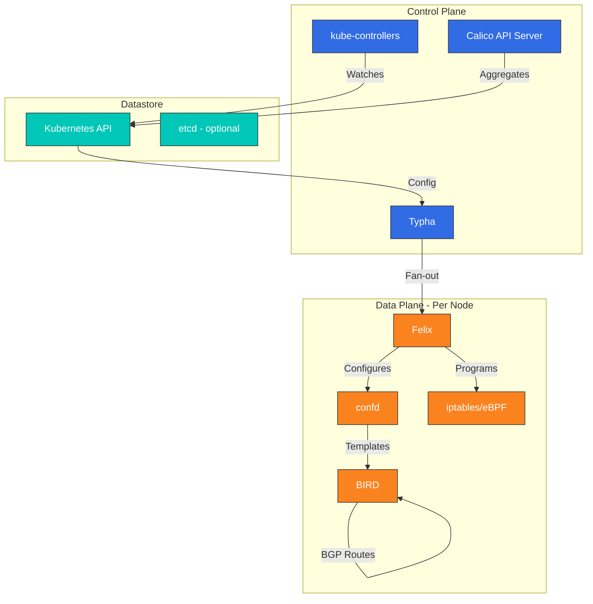
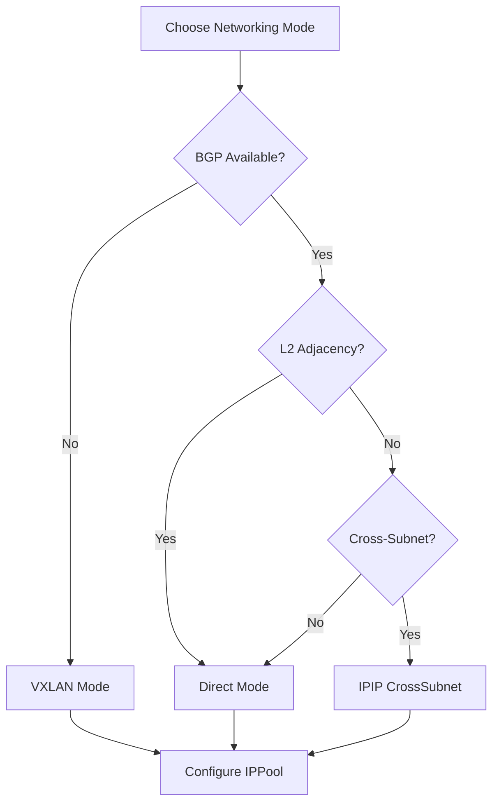

# Calico Deep Dive: Enterprise-Grade Kubernetes Networking

> **Supported Versions**: Calico v3.29+ / Kubernetes 1.28+
> **Last Updated**: February 22, 2025

## Overview

This section provides a comprehensive understanding of Calico's core concepts and technologies. We will explore Calico's architecture, networking modes, network policies, security features, and integration with cloud providers in depth.

## What is Calico?

Calico is an open-source networking and network security solution for containers, virtual machines, and native host-based workloads. Originally developed by Tigera, Calico has become one of the most widely deployed Kubernetes CNI plugins, trusted by enterprises worldwide for its stability, performance, and robust network policy capabilities.

### Core Advantages

1. **Battle-Tested Maturity**: Used in production by thousands of organizations since 2016
2. **Flexible Data Plane**: Choice between iptables, nftables, or eBPF data planes
3. **Native BGP Support**: First-class BGP integration for on-premises and hybrid deployments
4. **Comprehensive Network Policies**: Kubernetes NetworkPolicy plus extended Calico policies
5. **Windows Support**: Full Windows container networking support
6. **Enterprise Features**: Tigera Calico Enterprise adds observability, compliance, and threat defense
7. **Cloud-Native Integration**: Seamless integration with AWS, GCP, Azure, and on-premises infrastructure

### Why Choose Calico?

- **Proven at Scale**: Powers production workloads at companies processing billions of transactions
- **Operational Simplicity**: Straightforward installation and configuration
- **Strong Community**: Active open-source community with extensive documentation
- **Vendor Flexibility**: Works consistently across any Kubernetes distribution
- **Compliance Ready**: Built-in features for audit logging and policy enforcement

## Version Highlights: Calico v3.29

Calico v3.29 delivers significant improvements across networking, security, and observability:

### Networking Enhancements
- **eBPF Data Plane GA**: Production-ready eBPF data plane with full feature parity
- **Improved BGP Performance**: Optimized route convergence and reduced memory footprint
- **Enhanced VXLAN**: Better cross-subnet routing with automatic MTU detection
- **IPv6 Dual-Stack**: Full support for dual-stack networking environments

### Security Improvements
- **DNS Policy Enhancements**: More granular FQDN-based network policies
- **Policy Recommendations**: AI-assisted policy generation based on observed traffic
- **Encryption Options**: Simplified WireGuard configuration for node-to-node encryption

### Operational Features
- **Calico API Server**: Native Kubernetes API aggregation for Calico resources
- **Improved Diagnostics**: Enhanced troubleshooting tools and health checks
- **Resource Optimization**: Reduced CPU and memory consumption

## CNI Comparison

| Feature | Calico | Cilium |
|---------|--------|--------|
| **Core Technology** | iptables/eBPF | eBPF |
| **Maturity** | Very High (2016+) | High (2017+) |
| **Network Policy** | L3-L4 (L7 Enterprise) | L3-L7 |
| **Service Mesh** | Separate (Enterprise) | Built-in |
| **BGP Support** | Strong (Native) | Supported |
| **Observability** | Basic (Enterprise: Advanced) | Hubble (Powerful) |
| **Windows Support** | Full | Beta |
| **eBPF Data Plane** | Optional | Required |
| **Learning Curve** | Moderate | Steeper |
| **Resource Usage** | Lower | Higher |
| **kube-proxy Replacement** | Yes (eBPF mode) | Yes |
| **Multi-Cluster** | Federation | Cluster Mesh |

## Architecture Overview

Calico's architecture consists of several key components working together to provide networking and network security.



### Key Components

| Component | Role | Runs On |
|-----------|------|---------|
| **Felix** | Programs routes and ACLs on each host | Every node |
| **BIRD** | BGP daemon for route distribution | Every node |
| **confd** | Watches datastore, generates BIRD config | Every node |
| **Typha** | Caching proxy to reduce API server load | Dedicated pods |
| **kube-controllers** | Syncs Kubernetes resources with Calico | Control plane |
| **Calico API Server** | Kubernetes API aggregation layer | Control plane |

## Networking Modes

Calico supports multiple networking modes to fit different infrastructure requirements:

### 1. IPIP Mode (Default)
- IP-in-IP encapsulation for cross-subnet traffic
- MTU: 1480 bytes
- Best for: Cloud environments, simple setup

### 2. VXLAN Mode
- VXLAN encapsulation (UDP port 4789)
- MTU: 1450 bytes
- Best for: Environments requiring standard overlay protocol

### 3. Direct/Unencapsulated Mode
- No encapsulation, native routing
- MTU: 1500 bytes (full)
- Best for: On-premises with BGP, performance-critical workloads

### Mode Selection Guide



## Amazon EKS Integration

Calico integrates seamlessly with Amazon EKS, providing enhanced network policy capabilities.

### Quick Installation on EKS

```bash
# Install Calico operator
kubectl create -f https://raw.githubusercontent.com/projectcalico/calico/v3.29.0/manifests/tigera-operator.yaml

# Configure Calico for EKS (VXLAN mode)
cat <<EOF | kubectl apply -f -
apiVersion: operator.tigera.io/v1
kind: Installation
metadata:
  name: default
spec:
  kubernetesProvider: EKS
  cni:
    type: Calico
  calicoNetwork:
    bgp: Disabled
    ipPools:
    - blockSize: 26
      cidr: 10.244.0.0/16
      encapsulation: VXLAN
      natOutgoing: Enabled
      nodeSelector: all()
EOF

# Verify installation
kubectl get pods -n calico-system
```

### EKS with VPC CNI + Calico Policy

For EKS environments using AWS VPC CNI for networking but requiring advanced network policies:

```bash
# Install Calico for network policy only
kubectl apply -f https://raw.githubusercontent.com/aws/amazon-vpc-cni-k8s/master/config/master/calico-operator.yaml
kubectl apply -f https://raw.githubusercontent.com/aws/amazon-vpc-cni-k8s/master/config/master/calico-crs.yaml
```

## Installation Methods

### Method 1: Tigera Operator (Recommended)

```bash
# Install the operator
kubectl create -f https://raw.githubusercontent.com/projectcalico/calico/v3.29.0/manifests/tigera-operator.yaml

# Install Calico with custom configuration
cat <<EOF | kubectl apply -f -
apiVersion: operator.tigera.io/v1
kind: Installation
metadata:
  name: default
spec:
  calicoNetwork:
    ipPools:
    - blockSize: 26
      cidr: 192.168.0.0/16
      encapsulation: IPIP
      natOutgoing: Enabled
      nodeSelector: all()
EOF
```

### Method 2: Helm Installation

```bash
# Add Calico Helm repository
helm repo add projectcalico https://docs.tigera.io/calico/charts
helm repo update

# Install Calico
helm install calico projectcalico/tigera-operator \
  --version v3.29.0 \
  --namespace tigera-operator \
  --create-namespace \
  --set installation.kubernetesProvider=EKS
```

### Method 3: Manifest-Based Installation

```bash
# For clusters with 50 nodes or less
kubectl apply -f https://raw.githubusercontent.com/projectcalico/calico/v3.29.0/manifests/calico.yaml

# For larger clusters (enables Typha)
kubectl apply -f https://raw.githubusercontent.com/projectcalico/calico/v3.29.0/manifests/calico-typha.yaml
```

## Network Policy Examples

### Basic Kubernetes NetworkPolicy

```yaml
apiVersion: networking.k8s.io/v1
kind: NetworkPolicy
metadata:
  name: allow-frontend-to-backend
  namespace: production
spec:
  podSelector:
    matchLabels:
      app: backend
  policyTypes:
  - Ingress
  ingress:
  - from:
    - podSelector:
        matchLabels:
          app: frontend
    ports:
    - protocol: TCP
      port: 8080
```

### Calico GlobalNetworkPolicy

```yaml
apiVersion: projectcalico.org/v3
kind: GlobalNetworkPolicy
metadata:
  name: deny-all-egress-except-dns
spec:
  selector: all()
  types:
  - Egress
  egress:
  - action: Allow
    protocol: UDP
    destination:
      ports:
      - 53
  - action: Allow
    protocol: TCP
    destination:
      ports:
      - 53
  - action: Deny
```

### Calico NetworkPolicy with FQDN

```yaml
apiVersion: projectcalico.org/v3
kind: NetworkPolicy
metadata:
  name: allow-external-api
  namespace: production
spec:
  selector: app == 'web'
  types:
  - Egress
  egress:
  - action: Allow
    protocol: TCP
    destination:
      domains:
      - "api.example.com"
      - "*.amazonaws.com"
      ports:
      - 443
```

## Monitoring and Observability

### Prometheus Metrics

Calico exposes metrics via Prometheus. Key metrics to monitor:

```yaml
# Felix metrics endpoint configuration
apiVersion: projectcalico.org/v3
kind: FelixConfiguration
metadata:
  name: default
spec:
  prometheusMetricsEnabled: true
  prometheusMetricsPort: 9091
```

### Key Metrics

| Metric | Description |
|--------|-------------|
| `felix_active_local_endpoints` | Number of active endpoints on the node |
| `felix_iptables_rules` | Number of iptables rules programmed |
| `felix_ipsets_calico` | Number of IP sets maintained |
| `felix_int_dataplane_failures` | Dataplane programming failures |
| `felix_cluster_num_hosts` | Total hosts in the cluster |

### Health Check Endpoints

```bash
# Check Felix health
curl -s http://localhost:9099/liveness
curl -s http://localhost:9099/readiness

# Check Typha health
curl -s http://localhost:9098/liveness
```

## Troubleshooting Quick Reference

### Common Commands

```bash
# Check Calico system status
kubectl get pods -n calico-system

# View Calico node status
kubectl get nodes -o custom-columns=NAME:.metadata.name,CALICO:.status.conditions[*].type

# Check IP pools
kubectl get ippools -o wide

# View network policies
kubectl get networkpolicies -A
kubectl get globalnetworkpolicies

# Felix logs
kubectl logs -n calico-system -l k8s-app=calico-node -c calico-node

# BIRD status (BGP)
kubectl exec -n calico-system calico-node-xxxxx -c calico-node -- birdcl show protocols
```

### Common Issues and Solutions

| Issue | Diagnosis | Solution |
|-------|-----------|----------|
| Pods stuck in ContainerCreating | Check Felix logs for IPAM errors | Verify IPPool configuration |
| Cross-node connectivity fails | Check encapsulation mode | Ensure IPIP/VXLAN is enabled |
| Network policies not enforced | Check policy order and selectors | Use `calicoctl` to verify policies |
| High CPU on Felix | Too many iptables rules | Consider eBPF data plane |

## Deep Dive Table of Contents

**[Part 1: Introduction to Calico](01-introduction.md)**
- What is Calico and Project History
- Lab Environment Setup
- Core Features Overview
- Use Cases and Deployment Scenarios
- Community and Governance

**[Part 2: Calico Architecture Deep Dive](02-architecture.md)**
- Component Architecture Overview
- Felix: The Calico Agent
- BIRD: BGP Routing Daemon
- confd: Configuration Management
- Typha: Scaling Component
- kube-controllers: Kubernetes Integration
- Datastore Options
- Packet Flow Analysis

**[Part 3: Networking Modes](03-networking-modes.md)**
- IPIP Encapsulation Mode
- VXLAN Encapsulation Mode
- Direct/Unencapsulated Mode
- Mode Comparison and Selection
- Performance Benchmarks
- Cloud Provider Compatibility
- MTU Optimization

## Selection Guide: Calico vs Cilium

### Choose Calico When:
- You need proven stability and maturity in production
- Windows container support is required
- BGP integration with existing network infrastructure is critical
- You prefer operational simplicity over advanced features
- Resource efficiency is a priority
- You're already familiar with iptables-based networking

### Choose Cilium When:
- You need advanced L7 network policies
- Built-in service mesh capabilities are desired
- Deep observability with Hubble is important
- You want to leverage cutting-edge eBPF features
- Multi-cluster connectivity with Cluster Mesh is needed

### Hybrid Approach
Some organizations use both:
- Calico for production workloads requiring stability
- Cilium for development/staging environments exploring new features

## References

- [Calico Official Documentation](https://docs.tigera.io/calico/latest/about/)
- [Calico GitHub Repository](https://github.com/projectcalico/calico)
- [Tigera Calico Enterprise](https://www.tigera.io/tigera-products/calico-enterprise/)
- [Calico Network Policy Guide](https://docs.tigera.io/calico/latest/network-policy/)
- [Amazon EKS Calico Integration](https://docs.aws.amazon.com/eks/latest/userguide/calico.html)
- [calicoctl Reference](https://docs.tigera.io/calico/latest/reference/calicoctl/)
- [Calico eBPF Data Plane](https://docs.tigera.io/calico/latest/operations/ebpf/)

## Quiz

To test what you've learned in this section, try the [Calico Deep Dive Quiz](../../quizzes/networking/calico/01-introduction-quiz.md).
