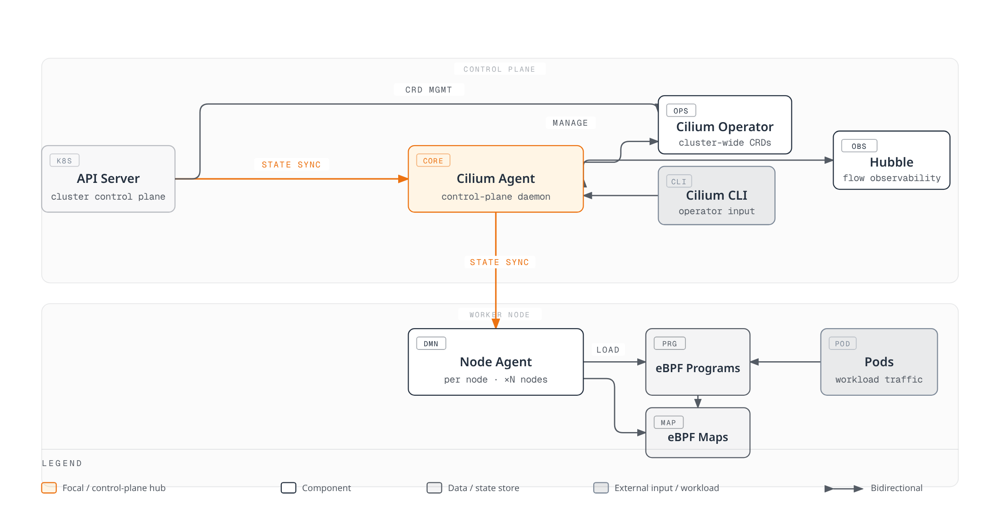

# eBPF Technology Deep Dive

> **Review baseline**: Cilium 1.20.1, Linux 5.10+ or a documented equivalent backport (for example RHEL 8.10's 4.18 kernel), tested Kubernetes 1.33–1.36. Individual BPF features have separate requirements.
> **Last reviewed**: September 12, 2026

## Lab Environment Setup

Use a disposable Linux development VM with a maintained distribution, the tracepoints used below, and permission to load tracing programs. This is separate from installing Cilium; do not load experimental programs on cluster nodes. Linux 6.12 is the source reference for the verifier discussion, not a claim that all 6.12 distributions enable every feature.

Required tools are Clang with the BPF backend, target-architecture UAPI headers, libbpf 1.x development headers/libraries, libelf, zlib, a C compiler and bpftool. BCC and bpftrace are optional alternatives. Debian/Ubuntu package names commonly include `clang`, `libbpf-dev`, `libelf-dev`, `zlib1g-dev`, `build-essential` and `pkg-config`; bpftool packaging depends on the distribution/kernel. Do not assume `linux-tools-generic` is available or appropriate on every Debian system. Cilium documents AMD64/AArch64 hosts; running Cilium natively outside its container image additionally requires Clang/LLVM 18.1+, which is a separate requirement from this small tracing lab.

```bash
uname -r
clang --version
clang --print-targets
pkg-config --modversion libbpf
bpftool version
test -r /sys/kernel/tracing/events/syscalls/sys_enter_execve/format
test -r /sys/kernel/tracing/events/sched/sched_process_exec/format
# Active feature probing: run only on the prepared lab VM.
sudo bpftool feature probe kernel
```

Tracefs must be mounted and accessible; some systems expose it under `/sys/kernel/debug/tracing`. Kernel configuration, capabilities, lockdown/LSM policy and container restrictions can prevent loading or attachment even as container root. `CAP_BPF` alone is not a universal tracing permission; requirements depend on kernel, program type and BPF-token delegation.

**Validation boundary:** these examples passed host C syntax checks against libbpf 1.7, userspace linking and deterministic helper simulations. Clang BPF-target compilation, the running kernel verifier and live tracepoint attachment still require validation in the prepared VM. They are not production-tested or lossless tracing recipes.

## Introduction to eBPF Technology and Historical Background

eBPF lets approved programs execute at supported Linux hooks to observe or influence kernel behavior. Verification restricts memory access and execution, but kernel, verifier, JIT and helper bugs remain possible. Acceptance does not prove that a host cannot crash or that the program implements the intended policy.

### From BPF to eBPF: History of Evolution

McCanne and Jacobson's *The BSD Packet Filter: A New Architecture for User-level Packet Capture* has a December 19, 1992 preprint date and identifies its presentation at Winter USENIX, January 25–29, 1993. Preserve that distinction when citing the year. Classic BPF uses the 32-bit A/X registers and scratch memory for filtering, avoiding unnecessary packet copies to userspace. Its restricted instruction set does not mean it cannot execute on modern CPUs.

Extended BPF added a 64-bit instruction set with eleven registers R0–R10 (R10 is the read-only frame pointer), a commonly limited 512-byte stack, maps and more program types. This is not a historical change from ten to eleven general-purpose registers. Function/tail-call combinations can impose additional stack limits.

### Technical Evolution of eBPF: Key Features by Kernel Version

These selected upstream milestones were checked against versioned source. They are not a distribution support matrix; backports, build options, architectures and helpers differ.

| Kernel | Selected milestone |
|---|---|
| [3.15](https://github.com/torvalds/linux/blob/v3.15/include/linux/filter.h) | Extended instruction set; internal classic-BPF translation |
| [3.16](https://github.com/torvalds/linux/blob/v3.16/arch/x86/net/bpf_jit_comp.c) | x86 extended-BPF JIT |
| [3.18](https://github.com/torvalds/linux/blob/v3.18/include/uapi/linux/bpf.h) | BPF syscall/verification infrastructure; no usable HASH/ARRAY map types yet |
| [3.19](https://github.com/torvalds/linux/blob/v3.19/include/uapi/linux/bpf.h) | HASH/ARRAY maps and socket-filter program type |
| [4.1](https://github.com/torvalds/linux/blob/v4.1/include/uapi/linux/bpf.h) | KPROBE and TC SCHED_CLS/SCHED_ACT |
| [4.2](https://github.com/torvalds/linux/blob/v4.2/include/uapi/linux/bpf.h) | PROG_ARRAY and tail calls |
| [4.8](https://github.com/torvalds/linux/blob/v4.8/include/uapi/linux/bpf.h) | XDP program type |
| [4.10](https://github.com/torvalds/linux/blob/v4.10/include/uapi/linux/bpf.h) | LRU hash maps |
| [4.16](https://github.com/torvalds/linux/blob/v4.16/include/uapi/linux/bpf.h) | BPF-to-BPF function calls |
| [4.17](https://github.com/torvalds/linux/blob/v4.17/include/uapi/linux/bpf.h) | Raw tracepoints |
| [4.18](https://github.com/torvalds/linux/blob/v4.18/include/uapi/linux/bpf.h) | BTF load API |
| [5.2](https://github.com/torvalds/linux/blob/v5.2/include/uapi/linux/bpf.h) | Direct map-value access used for global data |
| [5.7](https://github.com/torvalds/linux/blob/v5.7/include/uapi/linux/bpf.h) | BPF link API and BPF LSM |
| [5.8](https://github.com/torvalds/linux/blob/v5.8/include/uapi/linux/bpf.h) | BPF ring buffer |
| [5.10](https://github.com/torvalds/linux/blob/v5.10/include/uapi/linux/bpf.h) | Sleepable programs for supported attachment types |
| [5.15](https://github.com/torvalds/linux/blob/v5.15/include/uapi/linux/bpf.h) | BPF timer helpers |
| [5.19](https://github.com/torvalds/linux/blob/v5.19/include/uapi/linux/bpf.h) | Dynamic-pointer helpers |
| [6.2](https://github.com/torvalds/linux/blob/v6.2/kernel/bpf/helpers.c) | Typed object-allocation kfuncs, not unrestricted malloc |

Bounded loops arrived in Linux 5.3; the [upstream verifier change](https://github.com/torvalds/linux/commit/2589726d12a1b12eaaa93c7f1ea64287e383c7a5) explains loop analysis and state pruning. An old “loops are not implemented” paragraph remaining in the design FAQ is not current feature guidance. Bounded loops can still exceed verifier complexity limits.

### Growth and Application Areas

Cilium's public repository was created in December 2015; “project started in 2017” is inaccurate. Repository creation is not an exact product-launch date or proof of “first major project” status.

| Area | Examples and boundaries |
|---|---|
| Networking | Cilium/Calico datapaths, Katran load balancing and XDP filtering |
| Runtime security | Falco, Tracee and Tetragon use kernel events; enforcement depends on product and hooks |
| Tracing | BCC (including Python/Lua frontends), bpftrace, storage and block-I/O tracing |
| Network observability | Hubble flow/proxy events; flow graphs are not distributed application-span tracing |
| Service mesh | Cilium combines kernel forwarding with userspace proxies for supported L7 features |
| Community | The eBPF Foundation supports the ecosystem; funding and project maturity are not compatibility criteria |

`seccomp-bpf` uses the classic BPF filter interface for system-call decisions. Linux may internally translate classic filters, but this is not the general eBPF program/map/helper API.

### eBPF vs Traditional Kernel Modules: Paradigm Shift

| Characteristic | eBPF | Kernel module |
|---|---|---|
| Safety | Verifier-constrained; implementation bugs and operational risk remain | Broader native kernel access; bugs can destabilize the host |
| Deployment | Supported programs can be loaded/attached without reboot | Many modules can also load/unload without reboot when dependencies and usage permit |
| Compatibility | Instruction/helper ABI and feature requirements; CO-RE can relocate supported type accesses | Kernel/module ABI, configuration and distribution support |
| Performance | Often JIT-compiled; hook, program and workload determine overhead | Native execution also has workload-dependent costs |
| Development | Restricted context, helpers/kfuncs and verifier limits | Kernel API and ordinary kernel development constraints |
| Permissions | Appropriate privileges or delegation for loading/attachment | Privileged loading; signing/lockdown may restrict it |

Both require operational testing. Modules are not limited to vendor implementations, and eBPF does not inherently make production rollout safe.

## In-depth Analysis of eBPF Architecture Inside the Kernel

### Detailed Description of eBPF Architecture Components

In userspace, Clang compiles C to BPF ELF; Rust uses its own compiler/toolchain ecosystem. libbpf handles ELF sections, maps, relocations, loading and supported attachment APIs. BCC provides higher-level APIs; bpftrace provides a tracing language.

CO-RE uses BTF and relocations to adapt supported type/field accesses. It does not supply missing helpers, program types or kernel configuration, nor guarantee arbitrary cross-architecture/kernel compatibility. Kernel internal structures, tracepoint formats and kfuncs are not stable ABI merely because a program uses BTF.

In the kernel, the verifier checks a program for its type, context, helpers and permissions. JIT can translate accepted BPF into native instructions; an interpreter is another execution mechanism where supported. JIT output does not then pass through a mandatory second VM stage. Attachment connects the loaded program to a hook; loading alone does not subscribe to tracepoints.

### Detailed Analysis of eBPF Program Lifecycle

1. **Develop:** select hook/context and define maps/license metadata. Not all programs require GPL compatibility, but GPL-only helpers and certain types/kfuncs impose restrictions. These tracing samples use GPL metadata for their helpers.
2. **Compile:** create BPF ELF and required debug/BTF information with the target toolchain and headers.
3. **Open/load:** parse ELF, create or explicitly reuse maps, relocate and invoke the BPF load API. Verification and optional JIT occur during loading.
4. **Attach:** use the appropriate API. libbpf can infer these tracepoints from `SEC("tracepoint/...")`. Keep the link/attachment alive.
5. **Run/observe:** events invoke the program; userspace reads maps/buffers. Sampling and capacity limits can lose observations.
6. **Update/unload:** keep compatible maps/links/pins only deliberately. Destroy this lab's link and close its object to release resources.

In Linux 6.12, program length is limited to up to 1,000,000 instructions for the BPF-capable loading path and 4,096 for the unprivileged path. The verifier separately has a 1,000,000-instruction **analysis complexity** limit. Smaller programs can fail verification. Unprivileged BPF is often disabled; token/capability and program-type checks still apply.

### eBPF Program Types and Characteristics

| Hook / program type | Purpose and return-value boundary |
|---|---|
| XDP / `BPF_PROG_TYPE_XDP` | Native driver XDP runs before skb allocation; generic/offloaded modes differ. `XDP_DROP`, `PASS`, `TX`, `REDIRECT` are actions, not throughput guarantees |
| TC / `SCHED_CLS`, `SCHED_ACT` | Ingress/egress packet classification/actions. Classifier `TC_ACT_*` semantics require appropriate direct-action setup |
| Socket filter / `SOCKET_FILTER` | Socket packet delivery: zero drops, positive capture length may truncate. Creation/connect policies use other hooks |
| kprobe/uprobe / `KPROBE` | Kernel/userspace probes; there is no separate `BPF_PROG_TYPE_UPROBE`. Inlining, blacklists and symbol availability constrain attachment |
| Tracepoint / `TRACEPOINT` | Statically declared event context; inspect the target format. Not a guaranteed stable kernel ABI |
| Perf event / `PERF_EVENT` | Performance sampling; return behavior depends on its perf-event integration |
| cgroup / `CGROUP_SKB`, `CGROUP_SOCK`, `CGROUP_SOCK_ADDR`, etc. | Network/socket control; context and allow/deny conventions vary |
| LSM / `LSM` | MAC-style programs normally preserve earlier errors and return zero/error; cgroup-LSM has different grant semantics |
| Socket operations / `SOCK_OPS` | TCP callbacks; operation, reply fields and helper support matter |
| fentry/fexit / `TRACING` | BTF-based function tracing where supported; target and attachment constraints remain |

Select hooks by visibility/control needs. XDP lacks some later-stack context; TC handles skb-backed traffic; tracepoint/probe observation does not automatically enforce network policy. Do not copy context structs or return codes across program types.

### eBPF Maps: Core of Data Sharing and State Storage

Maps live while references remain, such as FDs, loaded programs or explicit bpffs pins. Pins are not disk persistence and do not preserve map contents across reboot. Reloading does not automatically reuse the old map.

| Type | Use and constraint |
|---|---|
| `HASH` | Bounded key/value table; insertion can fail when full. Expected constant-time lookup is not a latency guarantee |
| `ARRAY` | Preallocated, zero-initialized values at valid indices; zero is not a missing hash entry |
| `LRU_HASH` | Bounded cache with LRU-style eviction, not a lossless cumulative counter |
| `RINGBUF` | Multiple producers/single consumer across CPUs; key/value sizes zero, power-of-two byte capacity; failed reservations do not block |
| `PERF_EVENT_ARRAY` | Per-CPU perf channels; userspace must provision/consume events and track lost records |
| `PROG_ARRAY` | Tail-call program references; compatible targets and call limits apply |
| `PERCPU_HASH` / `PERCPU_ARRAY` | Less cross-CPU contention, not universally race-free. Userspace reads all possible-CPU slots with required padding |
| `SOCKMAP` / `SOCKHASH` | Socket references for supported redirection/programs, not arbitrary socket-operation hooks |

libbpf 1.x removed `struct bpf_map_def SEC("maps")`. These BTF-style definitions illustrate eight map categories using actual types. Combine needed maps with a suitable program; the declarations alone are not an event pipeline.

**`map_types.bpf.c`**

```c
#include <linux/bpf.h>
#include <bpf/bpf_helpers.h>

/* Definitions only; combine the needed maps with a suitable program. */
struct {
    __uint(type, BPF_MAP_TYPE_HASH);
    __uint(max_entries, 1024);
    __type(key, __u32);
    __type(value, __u64);
} hash_counts SEC(".maps");

struct {
    __uint(type, BPF_MAP_TYPE_ARRAY);
    __uint(max_entries, 1);
    __type(key, __u32);
    __type(value, __u64);
} total SEC(".maps");

struct {
    __uint(type, BPF_MAP_TYPE_LRU_HASH);
    __uint(max_entries, 1024);
    __type(key, __u32);
    __type(value, __u64);
} cache SEC(".maps");

struct {
    __uint(type, BPF_MAP_TYPE_RINGBUF);
    __uint(max_entries, 256 * 1024);
} events SEC(".maps");

struct {
    __uint(type, BPF_MAP_TYPE_PERF_EVENT_ARRAY);
    __type(key, __u32);
    __type(value, __u32);
    /* libbpf determines max_entries from the number of possible CPUs. */
} perf_events SEC(".maps");

struct {
    __uint(type, BPF_MAP_TYPE_PROG_ARRAY);
    __uint(max_entries, 10);
    __type(key, __u32);
    __type(value, __u32);
} jump_table SEC(".maps");

struct {
    __uint(type, BPF_MAP_TYPE_PERCPU_ARRAY);
    __uint(max_entries, 1);
    __type(key, __u32);
    __type(value, __u64);
} cpu_counts SEC(".maps");

struct {
    __uint(type, BPF_MAP_TYPE_SOCKMAP);
    __uint(max_entries, 1024);
    __type(key, __u32);
    __type(value, __u32);
} sockets SEC(".maps");
```

Shared counters need atomic increments. New hash keys need `BPF_NOEXIST` insertion followed by lookup/increment of the winning entry; `BPF_ANY` initialization can overwrite another CPU's count. Array entries already exist at valid indices.

## Utilizing eBPF in Cilium: Innovation in Container Networking

### Cilium Architecture and the Role of eBPF



[🔍 View interactive diagram](https://www.atomai.click/kubernetes-docs/archmaps/en-networking-cilium-02-ebpf-1.html)

The diagram shows logical responsibilities, not mandatory locations or a single compilation pipeline. CLI can run outside the cluster; agents run on eligible managed nodes. Program build/load details vary by version/feature. Hubble Relay aggregates flows; Prometheus metrics use separate endpoints.

The agent reconciles endpoints, identities, policy and datapath state. The Operator handles configured cluster-wide tasks such as identity/IPAM lifecycle; it is not the packet-forwarding path. Hubble combines BPF flow information with userspace proxy events.

### Detailed Analysis of Cilium's eBPF Datapath

These are cooperating functions, not a fixed order for every packet:

1. **Entry:** socket hooks can resolve Service backends before a packet exists; TC handles packet paths; optional XDP acceleration handles supported external traffic.
2. **Identity/policy:** IP/identity and endpoint policy control L3/L4 access. Supported HTTP/gRPC policy uses Envoy and DNS policy uses the DNS proxy; L7 parsing/enforcement is not entirely BPF.
3. **State/translation:** conntrack, service/backend, reverse-NAT and affinity maps have different roles. Not every packet repeats backend selection.
4. **Forwarding:** native routing or configured overlay carries traffic. DSR dispatch/return paths require the selected mode's network prerequisites.
5. **Observation:** datapath counters/events and proxy events have configuration and collection-loss limits.

Backend readiness comes from control-plane state and applicable health mechanisms, not a universal BPF application probe. Maglev, affinity, DSR and acceleration are feature choices, not universal defaults.

### Detailed Description of Cilium's Major eBPF Programs

| Cilium 1.20.1 source | Role |
|---|---|
| `bpf/bpf_lxc.c` | Endpoint packet path, policy, conntrack and forwarding |
| `bpf/bpf_overlay.c` | Overlay packet path |
| `bpf/bpf_host.c` | Host/device path and supported host-firewall processing |
| `bpf/bpf_xdp.c` | XDP path, including configured load-balancer acceleration |
| `bpf/bpf_sock.c` | Socket-address hooks including connect/sendmsg/recvmsg service translation |
| `bpf/lib/lb.h` | Shared load-balancing helpers |
| `bpf/lib/policy.h` | Shared policy helpers |

There are no top-level `bpf_lb.c` or `bpf_network.c` files in this release. Function names and feature gates change; inspect the exact release instead of treating conceptual names as source files.

### Cilium's eBPF Map Usage

These examples are not a stable map-layout API:

| Name / family | Key and role |
|---|---|
| `cilium_lxc` | Address/family → endpoint forwarding metadata; not simply endpoint ID |
| `cilium_ipcache_v2` | Prefix, address family, cluster context → identity/tunnel metadata |
| `cilium_policy_v3_<endpoint>` | Identity, direction, protocol, destination port and prefix → policy entry |
| `cilium_ct4_global`, `cilium_ct6_global`, `cilium_ct_any4_global`, etc. | Connection-tuple state; actual maps depend on protocol/family/configuration |
| `cilium_lb4_services_v2` / `cilium_lb6_services_v2` | Address/port, protocol, scope and backend slot → service metadata/backend reference; backend records are separate maps |
| `cilium_metrics` | Reason, direction and source-location key → packet/byte counters |

`cilium-dbg map get` displays userspace-cached content, not necessarily a fresh kernel dump. Use matching `cilium-dbg bpf ...` decoders or bpftool for their supported kernel views. Do not write raw bytes into Cilium maps as a troubleshooting shortcut.

### eBPF-based Features and Their Boundaries

- **Policy:** Kubernetes NetworkPolicy has L3/L4 semantics; Cilium resources add supported capabilities. Unrestricted L4 allow can bypass an overlapping L7-restricted allow; inspect combined policy.
- **Encryption:** in WireGuard/IPsec modes, BPF steers traffic into those kernel facilities; cryptography is not solely BPF instructions. Configure keys, ports, MTU and traffic coverage for the chosen mode. IPsec and WireGuard key operations differ.
- **Service mesh:** userspace proxies supply supported L7 processing. Kafka L7 policy is removed. Beta workload mTLS/ztunnel has separate prerequisites and is not implied by node encryption.
- **Bandwidth:** EDT/bandwidth-manager and congestion control do not guarantee end-to-end QoS or throughput.
- **Multi-cluster:** Cluster Mesh requires connectivity, identities, addressing and compatible configuration; it does not automatically synchronize every policy object or solve routing.

## Lab: eBPF Program Development and Debugging

### 1. Basic eBPF Program Development

Save the named files in a new lab directory. This program records `execve` **attempts**, including later failures. `execveat` has a different syscall-entry tracepoint. Debug print is shared/noisy and is not a production event transport. `SEC()` supplies the intended type/hook; the GPL metadata suits the helper used here.

**`hello.bpf.c`**

```c
#include <linux/bpf.h>
#include <bpf/bpf_helpers.h>

SEC("tracepoint/syscalls/sys_enter_execve")
int hello_execve(void *ctx)
{
    (void)ctx;
    char message[] = "execve attempt\n";
    bpf_trace_printk(message, sizeof(message));
    return 0;
}

char LICENSE[] SEC("license") = "GPL";
```

### 2. Advanced eBPF Program Using Maps

`sched_process_exec` is emitted after a successful execution transition in the referenced kernel. Count by `comm`, a short task name of at most 16 bytes including termination, not a unique executable path/process identity. Names can collide/change. This observes the host, not automatically one Pod.

The map holds at most 1,024 names. `lost_events[0]` counts name-read failures and `[1]` events without a usable counter entry, including capacity exhaustion. These do not cover every possible collection failure; 64-bit counters can wrap. The lab does not delete entries while counting.

**`exec_shared.h`**

```c
#ifndef EXEC_SHARED_H
#define EXEC_SHARED_H
#define COMM_BYTES 16
#define MAX_COMMANDS 1024
struct comm_key {
    char comm[COMM_BYTES];
};
#endif
```

**`exec_count.bpf.c`**

```c
#include <linux/bpf.h>
#include <bpf/bpf_helpers.h>
#include "exec_shared.h"

struct {
    __uint(type, BPF_MAP_TYPE_HASH);
    __uint(max_entries, MAX_COMMANDS);
    __type(key, struct comm_key);
    __type(value, __u64);
} exec_counts SEC(".maps");

struct {
    __uint(type, BPF_MAP_TYPE_ARRAY);
    __uint(max_entries, 2);
    __type(key, __u32);
    __type(value, __u64);
} lost_events SEC(".maps");

static __always_inline void record_loss(__u32 reason)
{
    __u64 *lost = bpf_map_lookup_elem(&lost_events, &reason);
    if (lost)
        __sync_fetch_and_add(lost, 1);
}

SEC("tracepoint/sched/sched_process_exec")
int count_exec(void *ctx)
{
    (void)ctx;
    struct comm_key key = {};
    __u64 zero = 0;
    if (bpf_get_current_comm(key.comm, sizeof(key.comm)) != 0) {
        record_loss(0);
        return 0;
    }

    __u64 *count = bpf_map_lookup_elem(&exec_counts, &key);
    if (!count) {
        /* A competing CPU may insert first; never overwrite its count. */
        bpf_map_update_elem(&exec_counts, &key, &zero, BPF_NOEXIST);
        count = bpf_map_lookup_elem(&exec_counts, &key);
    }
    if (count)
        __sync_fetch_and_add(count, 1);
    else
        record_loss(1);
    return 0;
}

char LICENSE[] SEC("license") = "GPL";
```

#### User-space Application and Attachment Lifetime

This loader accepts either sample object, loads exactly one program, attaches it and retains the link until Ctrl-C/SIGTERM. It reads counter map FDs from the same object rather than assuming pins exist. Iteration starts with NULL and produces a bounded, non-atomic live sample.

**`run_bpf.c`**

```c
#define _POSIX_C_SOURCE 200809L
#include <errno.h>
#include <inttypes.h>
#include <signal.h>
#include <stdio.h>
#include <stdint.h>
#include <unistd.h>
#include <bpf/bpf.h>
#include <bpf/libbpf.h>
#include "exec_shared.h"

static volatile sig_atomic_t stopping;

static void stop(int signal_number)
{
    (void)signal_number;
    stopping = 1;
}

static int dump_counts(int map_fd, int lost_fd)
{
    struct comm_key current, next;
    const struct comm_key *previous = NULL;
    unsigned int seen = 0;

    while (seen < MAX_COMMANDS) {
        if (bpf_map_get_next_key(map_fd, previous, &next) != 0) {
            if (errno == ENOENT)
                break;
            perror("get next key");
            return -1;
        }
        __u64 value;
        if (bpf_map_lookup_elem(map_fd, &next, &value) == 0)
            printf("%.*s: %" PRIu64 "\n", COMM_BYTES, next.comm,
                   (uint64_t)value);
        else if (errno != ENOENT) {
            perror("lookup count");
            return -1;
        }
        current = next;
        previous = &current;
        seen++;
    }
    for (__u32 reason = 0; reason < 2; reason++) {
        __u64 value;
        if (bpf_map_lookup_elem(lost_fd, &reason, &value) != 0) {
            perror("lookup loss");
            return -1;
        }
        printf("lost[%u]: %" PRIu64 "\n", reason, (uint64_t)value);
    }
    if (fflush(stdout) != 0) {
        perror("flush output");
        return -1;
    }
    return 0;
}

int main(int argc, char **argv)
{
    struct bpf_object *object = NULL;
    struct bpf_link *link = NULL;
    int result = 1;
    if (argc != 2) {
        fprintf(stderr, "usage: %s OBJECT.bpf.o\n", argv[0]);
        return 2;
    }
    struct sigaction action = {.sa_handler = stop};
    sigemptyset(&action.sa_mask);
    if (sigaction(SIGINT, &action, NULL) || sigaction(SIGTERM, &action, NULL)) {
        perror("sigaction");
        return 1;
    }
    object = bpf_object__open_file(argv[1], NULL);
    if (!object) {
        perror("open BPF object");
        return 1;
    }
    struct bpf_program *program = bpf_object__next_program(object, NULL);
    if (!program || bpf_object__next_program(object, program)) {
        fprintf(stderr, "expected exactly one program\n");
        goto cleanup;
    }
    if (bpf_object__load(object) != 0) {
        fprintf(stderr, "load failed; inspect libbpf/verifier diagnostics\n");
        goto cleanup;
    }
    int counts = bpf_object__find_map_fd_by_name(object, "exec_counts");
    int losses = bpf_object__find_map_fd_by_name(object, "lost_events");
    if (counts >= 0 && losses < 0) {
        fprintf(stderr, "counter object is missing lost_events\n");
        goto cleanup;
    }
    link = bpf_program__attach(program);
    if (!link) {
        perror("attach tracepoint");
        goto cleanup;
    }
    fprintf(stderr, "Attached; Ctrl-C detaches. Counts are live samples.\n");
    result = 0;
    while (!stopping) {
        if (counts >= 0 && dump_counts(counts, losses) != 0) {
            result = 1;
            break;
        }
        sleep(2);
    }
cleanup:
    bpf_link__destroy(link);
    bpf_object__close(object);
    return result;
}
```

#### Compile and Run

On Debian/Ubuntu multiarch installations, GCC's multiarch directory supplies UAPI `asm/` headers; adjust paths for other distributions. `-g` supplies BTF for `.maps`. Compile and start the loader in terminal A on the prepared VM:

```bash
MULTIARCH=$(gcc -print-multiarch)
test -n "$MULTIARCH"
clang -O2 -g -target bpf -I"/usr/include/$MULTIARCH" \
  -c hello.bpf.c -o hello.bpf.o
clang -O2 -g -target bpf -I"/usr/include/$MULTIARCH" \
  -c exec_count.bpf.c -o exec_count.bpf.o
cc -O2 -Wall -Wextra run_bpf.c -o run_bpf \
  $(pkg-config --cflags --libs libbpf)
sudo ./run_bpf hello.bpf.o
```

In terminal B read `sudo cat /sys/kernel/tracing/trace_pipe`; run an external executable such as `/usr/bin/true` in terminal C. Stop the hello loader with Ctrl-C, then run `sudo ./run_bpf exec_count.bpf.o`. Observe changing name/count pairs while executing commands in another terminal. The observer and other host activity also generate events, so no fixed total/PID is promised. Failed `execve` attempts can appear in hello output but should not emit `sched_process_exec`.

`bpftool prog load OBJECT PIN` alone does not attach this tracepoint. The example deliberately owns a link. Explicit pinning/reuse is a separate lifecycle decision: `pinmaps` and `map ... pinned ...` are not interchangeable syntax. Closing this loader releases its unpinned resources.

### 3. Exploring and Debugging Cilium eBPF Programs

Use an already prepared cluster and correct kubeconfig context. Select the agent on the affected Pod's node; endpoint IDs are node-local. Replace the explicit placeholders:

```bash
kubectl config current-context
kubectl -n kube-system get pods -l k8s-app=cilium -o wide
export CILIUM_POD=cilium-REPLACE-WITH-ACTUAL-POD
export ENDPOINT_ID=REPLACE-WITH-NODE-LOCAL-ID
kubectl -n kube-system exec "$CILIUM_POD" -c cilium-agent -- cilium-dbg status --verbose
kubectl -n kube-system exec "$CILIUM_POD" -c cilium-agent -- cilium-dbg endpoint list
kubectl -n kube-system exec "$CILIUM_POD" -c cilium-agent -- cilium-dbg endpoint get "$ENDPOINT_ID"
kubectl -n kube-system exec "$CILIUM_POD" -c cilium-agent -- cilium-dbg map list
kubectl -n kube-system exec "$CILIUM_POD" -c cilium-agent -- cilium-dbg service list
kubectl -n kube-system exec "$CILIUM_POD" -c cilium-agent -- cilium-dbg bpf lb list --frontends
kubectl -n kube-system exec "$CILIUM_POD" -c cilium-agent -- cilium-dbg bpf lb list --backends
```

Inspect desired policies with `kubectl get networkpolicy,ciliumnetworkpolicy -n YOUR_NAMESPACE` and applicable cluster-wide policies separately. Compare endpoint realized state with actual flows. Removed `policy trace` and deprecated `policy get` are not substitutes.

Run one monitor at a time, stopping with Ctrl-C:

```bash
kubectl -n kube-system exec "$CILIUM_POD" -c cilium-agent --   cilium-dbg monitor --related-to "$ENDPOINT_ID" --type drop
```

Use `--type policy-verdict` for emitted policy decisions or `--type l7` for available proxy events. Visibility depends on configuration. HTTP rejection may be HTTP 403 rather than a network DROPPED verdict.

For enabled Hubble Relay, keep `cilium hubble port-forward` running, then use:

```bash
hubble status
hubble observe --namespace default --last 20
hubble observe --protocol http --last 20
hubble observe --namespace default --last 20 --output json
```

JSON piped to `jq` is not a service-dependency graph. Enabled Hubble UI supplies a service map (`cilium hubble ui`). HTTP visibility needs a supported proxy/L7 path; encrypted application content is not automatically decoded.

### 4. Performance Analysis and Optimization

On a controlled node with profiling permissions/support, inspect actual program IDs. These commands target local kernel state and were not executed by this audit:

```bash
sudo bpftool prog show
export PROG_ID=REPLACE-WITH-ACTUAL-ID
sudo bpftool prog show id "$PROG_ID"
sudo bpftool prog dump xlated id "$PROG_ID"
sudo bpftool prog profile id "$PROG_ID" duration 10 cycles instructions
```

Profiling needs metric names and suitable kernel/PMU support. `bpftool -p map dump ...` pretty-prints content, not lookup latency. `perf`/bpftrace can profile workloads, but verify target symbols, probe availability and arguments. A kretprobe does not reliably expose entry `arg0` without explicit correlation.

Record protocol, packet size, concurrency, policy, encryption, proxy and routing when measuring the complete workload. Inspect installed Helm values and `cilium-dbg status --verbose` before changing XDP/native routing. A faster hook or synthetic result does not prove lower application latency.

### 5. Troubleshooting Tips

| Symptom | Check |
|---|---|
| C build fails | Correct UAPI/libbpf headers, BPF compiler target, `__u32`/`__u64`, `-g` for BTF |
| Verifier rejection | Loader stderr/verifier log, bounds, stack initialization, helpers, license and complexity |
| Loaded but no events | Attachment/link lifetime, exact tracepoint, trigger and permissions |
| Missing map data | Same map instance, insertion errors/capacity, key meaning, reference/pin lifetime |
| Wrong Cilium flow | Correct node/endpoint, combined desired/realized policy, route/backend state, L7 proxy behavior |
| Missing Hubble records | Relay, filters, configured visibility and lost-event reporting |

`trace_pipe` contains trace output, not verifier diagnostics. For an intentional load test in the isolated VM, bpftool `-d` gives loader/verifier diagnostics; loading still does not prove attachment or behavior. Do not disable policy, expand production privileges or rewrite maps to make a test pass.

## Sources

- [Original BPF paper](https://www.tcpdump.org/papers/bpf-usenix93.pdf), [Linux BPF design Q&A](https://docs.kernel.org/bpf/bpf_design_QA.html), [verifier](https://docs.kernel.org/bpf/verifier.html), [ring buffer](https://docs.kernel.org/bpf/ringbuf.html), [licensing](https://docs.kernel.org/bpf/bpf_licensing.html), [seccomp](https://docs.kernel.org/userspace-api/seccomp_filter.html)
- [Linux 6.12 BPF loading](https://github.com/torvalds/linux/blob/v6.12/kernel/bpf/syscall.c), [exec event placement](https://github.com/torvalds/linux/blob/v6.12/fs/exec.c), [libbpf 1.7](https://github.com/libbpf/libbpf/tree/v1.7.0), [bpftool 7.7](https://github.com/libbpf/bpftool/releases/tag/v7.7.0)
- [Cilium 1.20.1 BPF source](https://github.com/cilium/cilium/tree/v1.20.1/bpf), [maps](https://github.com/cilium/cilium/tree/v1.20.1/pkg/maps), [load-balancer maps](https://github.com/cilium/cilium/tree/v1.20.1/pkg/loadbalancer/maps), [command reference](https://github.com/cilium/cilium/tree/v1.20.1/Documentation/cmdref)
- [Cilium system requirements](https://docs.cilium.io/en/v1.20/operations/system_requirements/), [Kubernetes compatibility](https://docs.cilium.io/en/v1.20/network/kubernetes/compatibility/), [kube-proxy replacement](https://docs.cilium.io/en/v1.20/network/kubernetes/kubeproxy-free/), [encryption](https://docs.cilium.io/en/v1.20/security/network/encryption/)

## Quiz

[Check your understanding](../../quizzes/networking/cilium/02-ebpf-quiz.md).
