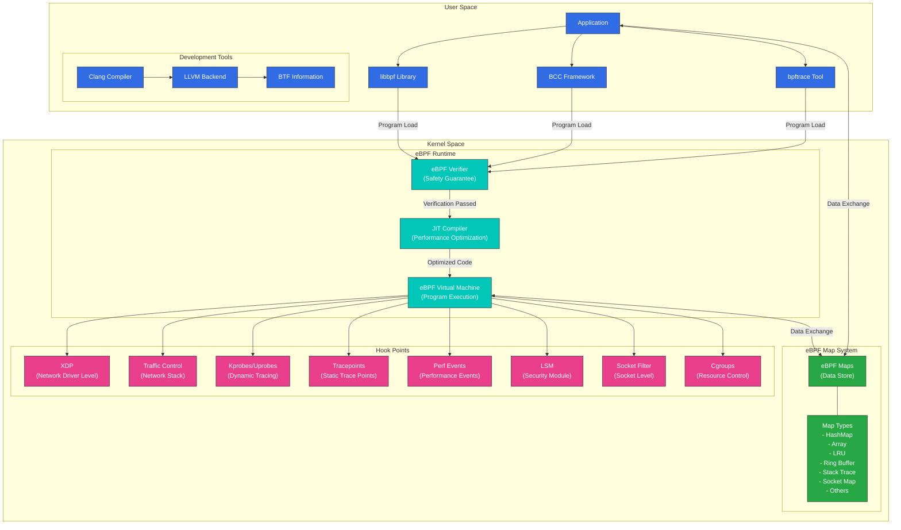
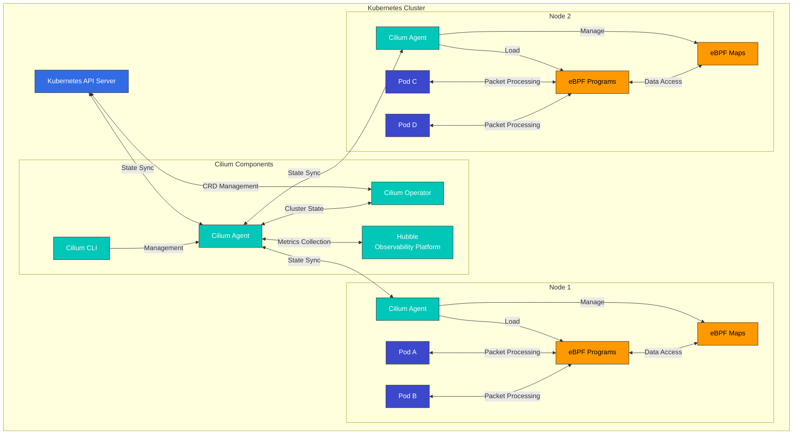

# eBPF Technology Deep Dive

> **Supported Versions**: Linux kernel 4.19+
> **Last Updated**: November 24, 2025

## Lab Environment Setup

To follow along with the examples in this document, you will need the following tools and environment:

### Required Tools
- Linux kernel 4.19 or later (5.10+ recommended)
- bpftool, libbpf-dev, clang, llvm
- bcc (BPF Compiler Collection)

### Environment Setup

```bash
# Install required packages on Ubuntu/Debian systems
sudo apt-get update
sudo apt-get install -y build-essential clang llvm libelf-dev libbpf-dev bpftool linux-tools-common linux-tools-generic

# Install BCC
sudo apt-get install -y bpfcc-tools python3-bpfcc

# Check kernel version
uname -r

# Check eBPF feature support
bpftool feature
```

## Introduction to eBPF Technology and Historical Background

eBPF (extended Berkeley Packet Filter) is a revolutionary technology that allows programs to run safely within the Linux kernel. This technology provides a powerful mechanism to extend and observe kernel behavior without modifying the kernel code. In modern cloud-native environments, eBPF has brought revolutionary changes in networking, security, monitoring, and performance analysis.

### From BPF to eBPF: History of Evolution

#### Birth and Limitations of Early BPF (1992-2013)
In 1992, Steven McCanne and Van Jacobson from UC Berkeley published a paper titled "The BSD Packet Filter: A New Architecture for User-level Packet Capture" introducing the Berkeley Packet Filter (BPF). This technology presented an innovative approach to network packet filtering.

BPF introduced the following core concepts:
- **In-kernel Virtual Machine**: Safely execute user-defined code within the kernel
- **Register-based Design**: More efficient execution model than stack-based
- **Safety Guarantees**: Infinite loop prevention and memory access restrictions
- **Packet Filtering Optimization**: Prevention of unnecessary packet copying

Early BPF was primarily used in network monitoring tools like tcpdump and had the following limitations:
- Limited instruction set (only 2 32-bit registers)
- Limited program size (maximum 4096 instructions)
- Limited functionality (mainly used for packet filtering)
- Limited interaction with user space
- Unable to utilize modern CPU architectures

Despite these limitations, BPF remained an important part of the Linux kernel for over 20 years.

#### Birth and Early Development of eBPF (2013-2016)
In 2013, Alexei Starovoitov from PLUMgrid proposed extended BPF (eBPF) to overcome the limitations of existing BPF. This proposal aimed to completely redesign BPF to match modern processor architectures.

Initial design goals of eBPF included:
- 64-bit architecture support
- More registers (10 → currently 11)
- Larger stack space (512 bytes)
- State storage and communication with user space through maps
- General-purpose capability to attach to various events

Key development stages:
- **May 2014 (Linux kernel 3.15)**: Initial eBPF infrastructure integrated into Linux kernel
  - Introduction of new eBPF instruction set
  - Addition of translation layer from classic BPF (cBPF) to eBPF
  - Introduction of initial eBPF map types (hash, array)

- **December 2014 (Linux kernel 3.18)**: Introduction of eBPF JIT (Just-In-Time) compiler
  - JIT compilation support for x86_64 architecture
  - Significant improvement in execution performance
  - Addition of tail call functionality for program chaining

- **June 2015 (Linux kernel 4.1)**: eBPF maps functionality expansion
  - Enhanced mechanism for data sharing between user space and kernel space
  - Addition of new map types (LRU hash, stack trace)
  - Addition of ability to attach eBPF programs to kprobes

- **January 2016 (Linux kernel 4.4)**: Introduction of XDP (eXpress Data Path)
  - High-performance packet processing possible at network driver level
  - Processing packets before entering kernel network stack
  - Performance capable of processing millions of packets per second

- **July 2016 (Linux kernel 4.7)**: Introduction of additional eBPF program types
  - Traffic control (TC) program support
  - Enhanced socket filtering capabilities
  - Helper function expansion

During this period, eBPF began evolving from a simple packet filtering tool to a general-purpose kernel programming infrastructure, expanding to various uses beyond networking.

#### Growth and Innovation of Modern eBPF Ecosystem (2017-Present)
Since 2017, eBPF has established itself as a core technology of cloud-native computing, with various projects and companies adopting this technology.

##### Major Projects and Technical Developments:

- **2017**:
  - **Cilium Project Started**: First major project utilizing eBPF for container networking and security
  - **BCC (BPF Compiler Collection)**: Emergence of high-level tool collection for eBPF program development
  - **Linux kernel 4.10-4.14**: Addition of cgroup, socket, tracepoint program types

- **2018**:
  - **Linux kernel 4.18**: Introduction of BTF (BPF Type Format), laying foundation for CO-RE (Compile Once – Run Everywhere) support
  - **bpftrace**: Emergence of DTrace-style high-level tracing language
  - **Facebook Katran**: Open-sourcing of eBPF-based L4 load balancer

- **2019**:
  - **Linux kernel 5.0-5.3**: BPF-to-BPF function call support, addition of raw tracepoint programs
  - **Falco**: Rising popularity of eBPF-based runtime security monitoring tool
  - **Hubble**: Emergence of Cilium-based network observability tool

- **2020**:
  - **Linux kernel 5.5-5.10**: BPF link abstraction, global variables, sleep capability, loop support
  - **libbpf**: Maturation of user-space library
  - **eBPF Foundation Established**: Formation of official organization for technology advancement
  - **Isovalent (Cilium developer) Series A Investment**: Emergence of commercial eBPF solutions

- **2021**:
  - **Linux kernel 5.11-5.15**: Memory allocation functionality, timer support, dynamic pointer addition
  - **Enhanced Kubernetes Integration**: Expanded adoption in service mesh, networking, security domains
  - **Commercial Product Launches**: Multiple companies launching eBPF-based products

- **2022-Present**:
  - **Linux kernel 6.0+**: Continuous feature expansion and optimization
  - **Standardization as Cloud-Native Technology**: Expanded integration with CNCF projects
  - **eBPF Summit**: Dedicated conference and community growth
  - **Major Cloud Provider Adoption**: AWS, GCP, Azure utilizing eBPF technology

##### Current eBPF Application Areas:

1. **Networking**:
   - Container networking (Cilium, Calico)
   - Load balancing (Katran, Cilium)
   - Packet filtering and firewalls (bpfilter)
   - Network acceleration (XDP-based solutions)

2. **Security**:
   - Runtime security monitoring (Falco, Tracee)
   - Intrusion detection systems (Tetragon)
   - System call filtering (seccomp-bpf)
   - Permission management (LSM BPF)

3. **Observability**:
   - System monitoring and tracing (bpftrace, BCC)
   - Performance analysis (BPF Performance Tools)
   - Distributed tracing (Hubble)
   - Metrics collection (eBPF Exporter)

4. **Service Mesh**:
   - Sidecar-less service mesh (Cilium Service Mesh)
   - L7 proxy and load balancing
   - Traffic management and routing

5. **Storage**:
   - Block I/O tracing and optimization
   - File system monitoring
   - Cache performance analysis

### Technical Evolution of eBPF: Key Features by Kernel Version

The technical advancement of eBPF has been gradual across several Linux kernel versions, with important features added in each version. The table below shows the major eBPF feature additions by kernel version:

| Kernel Version | Year | Major eBPF Feature Added | Technical Significance |
|---------------|------|-------------------------|----------------------|
| 3.15 | 2014 | Initial eBPF infrastructure introduction | New instruction set, register expansion |
| 3.18 | 2014 | JIT compiler addition | Significant execution performance improvement |
| 4.1 | 2015 | eBPF maps functionality, user-space API | State storage and data sharing possible |
| 4.4 | 2016 | XDP (eXpress Data Path) introduction | Ultra-fast packet processing possible |
| 4.7 | 2016 | Additional program types, tail call support | Program chaining and scalability improvement |
| 4.10 | 2017 | Socket and cgroup programs | Network socket control, container support |
| 4.14 | 2017 | XDP offload, more helper functions | Hardware acceleration support |
| 4.18 | 2018 | BTF (BPF Type Format) introduction | Foundation for CO-RE support |
| 5.0 | 2019 | BPF-to-BPF function call support | Modularization and code reuse possible |
| 5.5 | 2020 | BPF link abstraction, global variables | Improved program management |
| 5.8 | 2020 | Loop support (bounded loops) | Enhanced programming flexibility |
| 5.10 | 2020 | Sleep capability | Asynchronous programming possible |
| 5.13 | 2021 | Memory allocation functionality | Dynamic memory management possible |
| 5.15 | 2021 | Timer support | Time-based event handling |
| 6.0+ | 2022+ | Continuous feature expansion and optimization | Evolution to complete programming environment |

Through these developments, eBPF has evolved from a simple packet filter to a complete programming environment and is now one of the most important technologies in the Linux kernel. In particular, the introduction of the CO-RE (Compile Once – Run Everywhere) feature has greatly improved the portability of eBPF programs, allowing the same program to run without recompilation across various kernel versions.

### eBPF vs Traditional Kernel Modules: Paradigm Shift

eBPF provides a fundamentally different approach to extending the Linux kernel compared to traditional kernel modules. Understanding these differences is important for grasping the innovation of eBPF.

| Characteristic | eBPF | Kernel Module |
|---------------|------|---------------|
| **Safety** | Safety guaranteed through verifier, kernel crash impossible | Kernel panic possible, affects overall system stability |
| **Deployment** | Dynamic loading at runtime, binary compatibility maintained | Recompilation required per kernel version, compatibility issues possible |
| **Upgrade** | Real-time updates possible without kernel reboot | Mostly requires reboot, service interruption |
| **Performance** | Optimized through JIT compilation, near-native performance | Native performance, direct kernel access |
| **Development Complexity** | Restricted environment, special tools needed, debugging difficult | Full kernel API access, standard debugging tools available |
| **Permission Model** | Limited permissions, sandboxed environment | Full kernel permissions, unlimited access |
| **Portability** | CO-RE (Compile Once – Run Everywhere) support | Recompilation required per kernel version |
| **Deployment Scope** | Can be safely deployed in production environments | Mostly limited to vendor-provided kernel modules |

The biggest innovation of eBPF is its safety and dynamic loading capability. Traditional kernel modules run without restrictions inside the kernel, and bugs can destabilize the entire system. In contrast, eBPF programs can only be loaded after passing the kernel's verifier, which thoroughly checks for memory access, infinite loops, and kernel crash possibilities.

## In-depth Analysis of eBPF Architecture Inside the Kernel

> **Key Concept**: eBPF operates as a sandboxed virtual machine inside the Linux kernel, allowing kernel behavior to be extended without modifying kernel code.

eBPF is not just a simple technology but a complete technology stack consisting of various components from the virtual machine inside the kernel to user-space libraries. Understanding this architecture is essential for grasping the power and flexibility of eBPF.

### Detailed eBPF Architecture Diagram



### Detailed Description of eBPF Architecture Components

#### 1. User Space Components

**Development Tools and Libraries**:
- **Clang/LLVM**: Compiles eBPF programs from C or Rust to eBPF bytecode
- **libbpf**: Low-level eBPF manipulation library, direct interaction with kernel
- **BCC (BPF Compiler Collection)**: High-level library providing Python and Lua bindings
- **bpftrace**: eBPF-based tracing language, similar syntax to DTrace

**CO-RE (Compile Once – Run Everywhere)**:
- Provides portability across kernel versions using BTF (BPF Type Format)
- Run the same eBPF program across various kernel versions without recompilation
- Responds to kernel structure changes with struct relocation functionality

#### 2. Kernel Space Components

**eBPF Runtime**:
- **eBPF Verifier**: Core component that guarantees program safety
  - Infinite loop prevention
  - Only valid memory access allowed
  - Kernel stability guarantee
  - Permission checking

- **JIT (Just-In-Time) Compiler**:
  - Converts eBPF bytecode to native machine code
  - Architecture-specific optimization (x86_64, ARM64, RISC-V, etc.)
  - Significantly improved execution performance

- **eBPF Virtual Machine**:
  - 11 registers
  - 512-byte stack
  - Kernel function access through helper functions
  - Tail call support for program chaining

**eBPF Map System**:
- Data structures implemented as key-value stores
- Data sharing between kernel space and user space
- Support for various map types:
  - **BPF_MAP_TYPE_HASH**: General hash table
  - **BPF_MAP_TYPE_ARRAY**: Fixed-size array
  - **BPF_MAP_TYPE_LRU_HASH**: Tracks recently used items
  - **BPF_MAP_TYPE_RINGBUF**: High-performance ring buffer
  - **BPF_MAP_TYPE_STACK_TRACE**: Stack trace storage
  - **BPF_MAP_TYPE_SOCKHASH**: Socket reference storage
  - **BPF_MAP_TYPE_DEVMAP**: Network device reference
  - **BPF_MAP_TYPE_PROG_ARRAY**: eBPF program reference

**Hook Points**:

eBPF programs can be attached to various points within the kernel, called hook points. Each hook point allows eBPF programs to execute when specific events or operations occur. The main hook points are:

- **XDP (eXpress Data Path)**:
  - Packet processing at network driver level
  - Processes packets from NIC before entering kernel
  - Highest performance packet processing point (capable of processing tens of millions of packets per second)
  - Possible actions: packet drop, pass, redirect, modify
  - Use cases: DDoS defense, packet filtering, load balancing
  - Hardware offload support (on specific NICs)

- **Traffic Control (TC)**:
  - Traffic control layer of network stack
  - Ingress/egress queuing point
  - Provides more context than XDP
  - Packet header and payload modification possible
  - Use cases: Network policy, NAT, packet transformation
  - Supports both ingress and egress

- **Socket Filter**:
  - Packet filtering at socket level
  - Programs attached to specific sockets
  - Controls socket operations of user-space applications
  - Use cases: Per-application packet filtering, socket-level statistics
  - Can be applied at socket creation, binding, connection time

- **Kprobes/Uprobes**:
  - Dynamic tracing of kernel/user-space functions
  - Executes on function entry/return
  - Can hook arbitrary kernel functions
  - Use cases: Performance analysis, debugging, security monitoring
  - Can be dynamically added/removed
  - Has overhead (caution needed in production environments)

- **Tracepoints**:
  - Statically defined trace points within kernel
  - Provides stable ABI (compatibility across kernel versions)
  - Tracing support for major kernel events
  - Use cases: System call tracing, block I/O monitoring, network event tracing
  - Lower overhead than Kprobes

- **Perf Events**:
  - Performance monitoring events
  - CPU performance counter access
  - Hardware/software event monitoring
  - Use cases: CPU usage analysis, cache miss tracking, branch prediction failure monitoring
  - Precise performance measurement possible

- **LSM (Linux Security Module)**:
  - Security policy application
  - System call security checks
  - Permission verification and access control
  - Use cases: Container security, privilege escalation detection, file access control
  - Kernel 5.7+ support

- **Cgroups**:
  - Container resource control
  - Per-container policy application
  - Resource usage limiting and monitoring
  - Use cases: Container network policy, resource limiting, isolation
  - Important in container orchestration environments

### Detailed Analysis of eBPF Program Lifecycle

eBPF programs go through several stages from development to execution. Understanding this process helps clarify how eBPF works and its constraints.

1. **Development Stage**:
   - Write programs in high-level languages like C, Rust
   - Use kernel headers and eBPF helper functions
   - Utilize BTF information (for CO-RE support)
   - Define sections (using `SEC()` macro)
   - Specify license (GPL compatible required)

2. **Compilation Stage**:
   - Compile to eBPF bytecode using Clang/LLVM
   - Specify eBPF target with `-target bpf` option
   - Generate BTF and debugging information
   - Output in ELF file format

3. **Loading Stage**:
   - Load program into kernel through `bpf()` system call
   - libbpf or BCC library handles this process
   - Specify program type and hook to attach
   - Create necessary maps

4. **Verification Stage**:
   - In-kernel verifier checks program safety
   - Control flow graph (CFG) analysis
   - Memory access verification
   - Infinite loop prevention
   - Permission checking
   - Detailed error messages provided on failure

5. **JIT Compilation Stage**:
   - Convert bytecode to native code for host architecture
   - Apply architecture-specific optimizations
   - Improve execution performance
   - Supported on most architectures (x86_64, ARM64, RISC-V, etc.)

6. **Attachment Stage**:
   - Attach program to specific kernel events (hooks)
   - Create and initialize necessary maps
   - Set program metadata
   - Manage file descriptors

7. **Execution Stage**:
   - Program executes when events occur
   - Access context data
   - Process packets/events according to decisions
   - Call helper functions

8. **Data Exchange Stage**:
   - Store and retrieve data through eBPF maps
   - Communicate with user-space applications
   - Share performance metrics, state information, etc.
   - Event notification (perf event buffer, ring buffer, etc.)

9. **Update/Unload Stage**:
   - Dynamic program updates if needed
   - Unload program after use completion
   - Clean up related resources
   - Maintain or delete map data

### eBPF Program Types and Characteristics

eBPF programs are classified into various types depending on the hook point they attach to. Each program type has specific context and capabilities:

1. **XDP (eXpress Data Path) Programs**:
   - Program type: `BPF_PROG_TYPE_XDP`
   - Context: Network packet data, interface information
   - Return values: `XDP_DROP`, `XDP_PASS`, `XDP_TX`, `XDP_REDIRECT`, etc.
   - Features: Highest performance packet processing, driver/hardware level execution

2. **Traffic Control (TC) Programs**:
   - Program types: `BPF_PROG_TYPE_SCHED_CLS`, `BPF_PROG_TYPE_SCHED_ACT`
   - Context: Network packet data, scheduling information
   - Return values: `TC_ACT_OK`, `TC_ACT_SHOT`, `TC_ACT_REDIRECT`, etc.
   - Features: Packet classification and manipulation, ingress/egress support

3. **Socket Filter Programs**:
   - Program type: `BPF_PROG_TYPE_SOCKET_FILTER`
   - Context: Socket buffer data
   - Return values: 0 (drop packet) or packet length (allow packet)
   - Features: Socket-level packet filtering, similar functionality to tcpdump

4. **kprobe/uprobe Programs**:
   - Program types: `BPF_PROG_TYPE_KPROBE`, `BPF_PROG_TYPE_UPROBE`
   - Context: Function arguments, register values
   - Return values: Integer (no meaning)
   - Features: Dynamic function tracing, debugging and profiling

5. **tracepoint Programs**:
   - Program type: `BPF_PROG_TYPE_TRACEPOINT`
   - Context: Tracepoint definition struct
   - Return values: Integer (no meaning)
   - Features: Stable kernel trace points, version compatibility

6. **perf Event Programs**:
   - Program type: `BPF_PROG_TYPE_PERF_EVENT`
   - Context: Performance event data
   - Return values: Integer (no meaning)
   - Features: Hardware/software performance event monitoring

7. **cgroup Programs**:
   - Program types: `BPF_PROG_TYPE_CGROUP_SKB`, `BPF_PROG_TYPE_CGROUP_SOCK`, etc.
   - Context: cgroup information, socket/packet data
   - Return values: 0 (deny) or 1 (allow)
   - Features: Per-container network policy, resource control

8. **LSM (Linux Security Module) Programs**:
   - Program type: `BPF_PROG_TYPE_LSM`
   - Context: Security-related operation information
   - Return values: 0 (allow) or error code (deny)
   - Features: Security policy application, permission checking

9. **Socket Operations Programs**:
   - Program type: `BPF_PROG_TYPE_SOCK_OPS`
   - Context: Socket operation information
   - Return values: Integer (no meaning)
   - Features: TCP connection control, socket option setting

10. **fentry/fexit Programs**:
    - Program type: `BPF_PROG_TYPE_TRACING`
    - Context: Function arguments, return values
    - Return values: Integer (no meaning)
    - Features: Low-overhead function tracing, more efficient than kprobe

### Simple eBPF Program Example and Explanation

The following is a simple eBPF program example that traces system call execution:

```c
// hello_world.c
#include <linux/bpf.h>
#include <bpf/bpf_helpers.h>

// Program section definition - this program executes on execve system call entry
SEC("tracepoint/syscalls/sys_enter_execve")
int hello_execve(void *ctx) {
    // Print simple message
    char msg[] = "Hello, eBPF!";
    bpf_trace_printk(msg, sizeof(msg));
    return 0;
}

// License definition (GPL compatible required)
char LICENSE[] SEC("license") = "GPL";
```

**Code Explanation**:
1. **Header files**: Include necessary eBPF-related headers
2. **Section definition**: Specify program type and attachment point with `SEC()` macro
3. **Program function**: Function called when `execve` system call executes
4. **Context parameter**: Contains event-related data
5. **Helper function usage**: Output debug message with `bpf_trace_printk()`
6. **License specification**: GPL compatible license required (for kernel symbol access)

**Compile and Run**:
```bash
# Compile
clang -O2 -target bpf -c hello_world.c -o hello_world.o

# Load and run
bpftool prog load hello_world.o /sys/fs/bpf/hello_world

# Check output
cat /sys/kernel/debug/tracing/trace_pipe
```

**Execution Result**:
```
<...>-1234  [001] d... 123456.789012: bpf_trace_printk: Hello, eBPF!
<...>-5678  [002] d... 123456.789102: bpf_trace_printk: Hello, eBPF!
```

This simple example demonstrates the basic concepts of eBPF. In real applications, more complex logic and maps can be used to collect and analyze data.

### eBPF Maps: Core of Data Sharing and State Storage

eBPF maps are key-value stores for data sharing between eBPF programs and user-space applications. These maps are the core mechanism for eBPF programs to maintain state and communicate with user space.

#### Basic Concepts of eBPF Maps

eBPF maps have the following characteristics:

- **Persistent Storage**: Data persists even when programs are reloaded
- **Various Data Structures**: Support for various forms including hash tables, arrays, queues, stacks
- **Concurrency Support**: Concurrent access from multiple CPUs possible
- **Size Limitation**: Maximum size must be specified at creation
- **Flexible Key/Value Format**: Various data types can be stored
- **Bidirectional Access**: Accessible from both kernel space and user space

#### Main Map Types and Use Cases

1. **Hash Map (BPF_MAP_TYPE_HASH)**:
   - General key-value store
   - O(1) time complexity lookup performance
   - Dynamic size management (limited by max entries)
   - Use cases: Connection tracking, session information storage, counters
   - Example code:
     ```c
     struct bpf_map_def SEC("maps") connection_map = {
         .type = BPF_MAP_TYPE_HASH,
         .key_size = sizeof(struct connection_key),
         .value_size = sizeof(struct connection_info),
         .max_entries = 1024,
     };
     ```

2. **Array Map (BPF_MAP_TYPE_ARRAY)**:
   - Index-based fixed-size array
   - Very fast lookup performance
   - All entries pre-allocated
   - Use cases: Global settings, statistics, data requiring fast lookup
   - Example code:
     ```c
     struct bpf_map_def SEC("maps") config_array = {
         .type = BPF_MAP_TYPE_ARRAY,
         .key_size = sizeof(u32),
         .value_size = sizeof(struct config),
         .max_entries = 1,
     };
     ```

3. **LRU Hash Map (BPF_MAP_TYPE_LRU_HASH)**:
   - Hash map with least recently used item tracking
   - Automatically removes oldest entries when max entries exceeded
   - Suitable for cache implementation
   - Use cases: Connection cache, route cache
   - Example code:
     ```c
     struct bpf_map_def SEC("maps") connection_cache = {
         .type = BPF_MAP_TYPE_LRU_HASH,
         .key_size = sizeof(struct connection_key),
         .value_size = sizeof(struct connection_info),
         .max_entries = 10000,
     };
     ```

4. **Ring Buffer (BPF_MAP_TYPE_RINGBUF)**:
   - High-performance buffer with producer-consumer model
   - Single producer, single consumer support
   - Event-based notification support
   - Use cases: Log collection, event delivery, high-performance data streaming
   - Example code:
     ```c
     struct bpf_map_def SEC("maps") events = {
         .type = BPF_MAP_TYPE_RINGBUF,
         .max_entries = 256 * 1024, // 256 KB
     };
     ```

5. **Perf Event Array (BPF_MAP_TYPE_PERF_EVENT_ARRAY)**:
   - Performance event data transmission
   - Event delivery from kernel to user space
   - Use cases: Trace events, performance data collection
   - Example code:
     ```c
     struct bpf_map_def SEC("maps") perf_events = {
         .type = BPF_MAP_TYPE_PERF_EVENT_ARRAY,
         .key_size = sizeof(int),
         .value_size = sizeof(u32),
         .max_entries = 128,
     };
     ```

6. **Program Array (BPF_MAP_TYPE_PROG_ARRAY)**:
   - Stores references to other eBPF programs
   - Used for tail call implementation
   - Program chaining possible
   - Use cases: Complex processing logic modularization, conditional execution
   - Example code:
     ```c
     struct bpf_map_def SEC("maps") jump_table = {
         .type = BPF_MAP_TYPE_PROG_ARRAY,
         .key_size = sizeof(u32),
         .value_size = sizeof(u32),
         .max_entries = 10,
     };
     ```

7. **Per-CPU Maps (BPF_MAP_TYPE_PERCPU_HASH/ARRAY)**:
   - Independent data storage per CPU
   - High-performance access without concurrency issues
   - Use cases: High-performance counters, per-CPU statistics
   - Example code:
     ```c
     struct bpf_map_def SEC("maps") cpu_stats = {
         .type = BPF_MAP_TYPE_PERCPU_ARRAY,
         .key_size = sizeof(u32),
         .value_size = sizeof(struct stats),
         .max_entries = 1,
     };
     ```

8. **Socket Map (BPF_MAP_TYPE_SOCKMAP)**:
   - Socket reference storage
   - Socket-to-socket redirection support
   - Use cases: Socket acceleration, proxy implementation
   - Example code:
     ```c
     struct bpf_map_def SEC("maps") socket_map = {
         .type = BPF_MAP_TYPE_SOCKMAP,
         .key_size = sizeof(u32),
         .value_size = sizeof(u32),
         .max_entries = 1024,
     };
     ```

#### eBPF Map Operation Example

The following is a simple example of using maps in an eBPF program:

```c
#include <linux/bpf.h>
#include <bpf/bpf_helpers.h>

// Map definition
struct bpf_map_def SEC("maps") counter_map = {
    .type = BPF_MAP_TYPE_ARRAY,
    .key_size = sizeof(u32),
    .value_size = sizeof(u64),
    .max_entries = 1,
};

SEC("tracepoint/syscalls/sys_enter_execve")
int count_execve(void *ctx) {
    u32 key = 0;
    u64 *value, init_val = 1;

    // Lookup value from map
    value = bpf_map_lookup_elem(&counter_map, &key);
    if (value) {
        // Increment if value exists
        __sync_fetch_and_add(value, 1);
    } else {
        // Initialize if value doesn't exist
        bpf_map_update_elem(&counter_map, &key, &init_val, BPF_ANY);
    }

    return 0;
}

char LICENSE[] SEC("license") = "GPL";
```

Accessing map from user space:

```c
#include <bpf/bpf.h>
#include <stdio.h>

int main() {
    // Open map file descriptor
    int map_fd = bpf_obj_get("/sys/fs/bpf/counter_map");
    if (map_fd < 0) {
        perror("Failed to open map");
        return 1;
    }

    // Lookup value from map
    u32 key = 0;
    u64 value;
    if (bpf_map_lookup_elem(map_fd, &key, &value) == 0) {
        printf("execve count: %llu\n", value);
    } else {
        perror("Failed to lookup value");
    }

    return 0;
}
```

## Utilizing eBPF in Cilium: Innovation in Container Networking

Cilium is an open-source project that utilizes eBPF to implement container networking, load balancing, network policy, and visibility. It provides networking and security capabilities for container orchestration platforms like Kubernetes.

### Cilium Architecture and the Role of eBPF

Cilium consists of the following components, with eBPF playing an important role in each:



#### Key Components:

1. **Cilium Agent**:
   - Daemon running on each node
   - eBPF program compilation and loading
   - Endpoint management and policy application
   - Network topology discovery
   - State monitoring and metrics collection

2. **Cilium Operator**:
   - Cluster-wide resource management
   - CRD (Custom Resource Definition) processing
   - Inter-node coordination
   - Cluster-scope feature management

3. **eBPF Programs**:
   - Datapath programs attached to XDP and TC hooks
   - Socket-level load balancing programs
   - Connection tracking programs
   - Network policy enforcement programs

4. **eBPF Maps**:
   - Endpoint information storage
   - Policy rule storage
   - Connection tracking state management
   - Load balancing service information

5. **Hubble**:
   - eBPF-based network observability platform
   - Network flow monitoring
   - Security visibility
   - Performance analysis and troubleshooting

### Detailed Analysis of Cilium's eBPF Datapath

Cilium's datapath is implemented through eBPF programs, processing packets at multiple points as they pass through the network stack:

1. **Packet Reception (XDP/TC Ingress)**:
   - Packet reception at network interface
   - Packet interception at XDP or TC hook
   - Initial filtering and DDOS defense
   - Packet type classification (local/forwarding/host)

2. **Identity Verification**:
   - Analysis of packet source/destination IP and port
   - Kubernetes endpoint identification
   - Service backend verification
   - Context information collection

3. **Policy Application**:
   - Network policy rule checking
   - L3/L4 policy application (IP/port based)
   - L7 policy application (HTTP/gRPC/DNS, etc.)
   - Allow/deny based on policy decision

4. **Connection Tracking**:
   - Connection state tracking and management
   - Stateful firewall functionality
   - NAT state maintenance
   - Connection timeout management

5. **NAT and Load Balancing**:
   - Address translation when needed
   - Service load balancing (consistent hashing, session affinity)
   - DSR (Direct Server Return) support
   - Health check-based endpoint selection

6. **Packet Forwarding**:
   - Packet forwarding to destination endpoint
   - Overlay or native routing
   - Packet encapsulation/decapsulation (if needed)
   - Packet transformation and optimization

7. **Monitoring and Visibility**:
   - Flow information collection
   - Metrics update
   - Event generation
   - Debug information recording

### Detailed Description of Cilium's Major eBPF Programs

Cilium uses various eBPF programs to implement container networking functionality:

1. **bpf_lxc.c**: Endpoint-to-endpoint communication handling
   - Communication handling between container network namespace and host
   - Policy application and connection tracking
   - Endpoint identification and routing
   - Key functions: `handle_xgress`, `__tail_handle_ipv{4,6}`

2. **bpf_overlay.c**: Overlay network handling
   - VXLAN/Geneve encapsulation and decapsulation
   - Inter-node packet routing
   - Tunnel key management
   - Key functions: `from_overlay`, `to_overlay`

3. **bpf_host.c**: Host networking handling
   - Communication between host network stack and containers
   - Host firewall functionality
   - Host-based service handling
   - Key functions: `handle_netdev`, `handle_from_host`

4. **bpf_xdp.c**: XDP-based packet processing
   - Early packet filtering
   - DDoS defense
   - High-performance packet drop and redirect
   - Key functions: `cilium_xdp_entry`

5. **bpf_sock.c**: Socket-level load balancing
   - Load balancing at socket creation
   - Connection tracking bypass
   - High-performance service access
   - Key functions: `sock4_load_balancer`, `sock6_load_balancer`

6. **bpf_lb.c**: Service load balancing
   - Kubernetes service implementation
   - Backend selection and NAT
   - Session affinity support
   - Key functions: `lb{4,6}_service`

7. **bpf_network.c**: Network policy application
   - L3/L4 policy application
   - Policy decision caching
   - Policy statistics collection
   - Key functions: `policy_can_access`, `policy_apply_verdict`

### Cilium's eBPF Map Usage

Cilium uses various eBPF maps to store state and share data:

1. **endpoints_map**: Endpoint information storage
   - Key: Endpoint ID
   - Value: Endpoint metadata (IP, security ID, interface, etc.)
   - Purpose: Packet routing, policy application

2. **connection_map**: Connection tracking information
   - Key: Connection tuple (src IP/port, dst IP/port, protocol)
   - Value: Connection state, timestamp, statistics
   - Purpose: Stateful firewall, NAT tracking

3. **policy_map**: Network policy rules
   - Key: Policy identifier
   - Value: Policy rules (allow/deny, port, protocol, etc.)
   - Purpose: Network policy application

4. **lb_map**: Load balancing service information
   - Key: Service address (virtual IP:port)
   - Value: Backend list, selection algorithm, state
   - Purpose: Service load balancing

5. **tunnel_map**: Overlay network information
   - Key: Remote node IP
   - Value: Tunnel endpoint information
   - Purpose: Inter-node packet routing

6. **metrics_map**: Performance metrics collection
   - Key: Metric type
   - Value: Counters, gauges, etc.
   - Purpose: Monitoring and debugging

### Cilium's eBPF-based Features

Cilium provides the following advanced networking and security features using eBPF:

1. **Kubernetes Network Policies**:
   - Namespace, pod, service-level policies
   - L3/L4/L7 policy support
   - CIDR-based filtering
   - Intra/extra-cluster communication control

2. **Transparent Encryption**:
   - WireGuard or IPsec-based inter-node encryption
   - Zero configuration setup
   - Performance-optimized implementation
   - Automated key management

3. **Service Mesh Features**:
   - L7 proxy integration
   - HTTP, gRPC, Kafka protocol awareness
   - Header-based routing
   - Sidecar-less service mesh

4. **Load Balancing**:
   - Consistent hashing algorithm
   - Session affinity
   - Microservice load balancing
   - DSR (Direct Server Return) support

5. **Observability and Monitoring**:
   - Network flow visibility
   - Service dependency maps
   - Performance bottleneck identification
   - Security event detection

6. **Bandwidth Management**:
   - Per-endpoint bandwidth limiting
   - Traffic prioritization
   - Congestion control
   - Quality of Service (QoS) guarantee

7. **Multi-cluster Networking**:
   - Inter-cluster connectivity
   - Global service routing
   - Consistent policy application
   - Federation support

## Lab: eBPF Program Development and Debugging

This section covers hands-on experience developing and debugging eBPF programs. We'll start with basic eBPF programs and explore Cilium's eBPF features.

### 1. Basic eBPF Program Development

#### 1.1 System Call Tracing Program

The following is a simple eBPF program that traces the `execve` system call:

```c
// hello_ebpf.c
#include <linux/bpf.h>
#include <bpf/bpf_helpers.h>

// Specify tracepoint for program execution
SEC("tracepoint/syscalls/sys_enter_execve")
int hello_execve(void *ctx) {
    // Output debug message
    char msg[] = "Hello, eBPF! Process executed.";
    bpf_trace_printk(msg, sizeof(msg));
    return 0;
}

// Specify GPL compatible license (required)
char LICENSE[] SEC("license") = "GPL";
```

#### 1.2 Compile and Load

```bash
# Verify required packages are installed
sudo apt-get update
sudo apt-get install -y clang llvm libelf-dev libbpf-dev bpftool

# Compile
clang -O2 -target bpf -c hello_ebpf.c -o hello_ebpf.o

# Load program
sudo bpftool prog load hello_ebpf.o /sys/fs/bpf/hello_execve

# Check output
sudo cat /sys/kernel/debug/tracing/trace_pipe
```

Execution result:
```
<...>-1234  [001] d... 123456.789012: bpf_trace_printk: Hello, eBPF! Process executed.
<...>-5678  [002] d... 123456.789102: bpf_trace_printk: Hello, eBPF! Process executed.
```

#### 1.3 Check Program Information

```bash
# List loaded eBPF programs
sudo bpftool prog list

# Check specific program details
sudo bpftool prog show id 123

# Dump program bytecode
sudo bpftool prog dump xlated id 123
```

### 2. Advanced eBPF Program Using Maps

#### 2.1 Process Execution Counter Program

The following is a program that tracks process execution counts using maps:

```c
// process_counter.c
#include <linux/bpf.h>
#include <bpf/bpf_helpers.h>
#include <linux/sched.h>

// Struct to store process name
struct process_key {
    char comm[16];
};

// Map definition
struct {
    __uint(type, BPF_MAP_TYPE_HASH);
    __uint(max_entries, 1024);
    __type(key, struct process_key);
    __type(value, u64);
} process_map SEC(".maps");

SEC("tracepoint/syscalls/sys_enter_execve")
int count_execve(void *ctx) {
    struct process_key key = {};
    u64 *count, zero = 1;

    // Get current process name
    bpf_get_current_comm(&key.comm, sizeof(key.comm));

    // Lookup counter from map
    count = bpf_map_lookup_elem(&process_map, &key);
    if (count) {
        // Increment counter
        __sync_fetch_and_add(count, 1);
    } else {
        // Add new entry
        bpf_map_update_elem(&process_map, &key, &zero, BPF_ANY);
    }

    return 0;
}

char LICENSE[] SEC("license") = "GPL";
```

#### 2.2 User-space Application

User-space program to read map data:

```c
// process_reader.c
#include <stdio.h>
#include <stdlib.h>
#include <bpf/libbpf.h>
#include <bpf/bpf.h>
#include <unistd.h>

struct process_key {
    char comm[16];
};

int main() {
    // Open map file descriptor
    int map_fd = bpf_obj_get("/sys/fs/bpf/process_map");
    if (map_fd < 0) {
        perror("Failed to open map");
        return 1;
    }

    // Iterate through map entries
    struct process_key key, next_key;
    u64 value;

    while (bpf_map_get_next_key(map_fd, &key, &next_key) == 0) {
        if (bpf_map_lookup_elem(map_fd, &next_key, &value) == 0) {
            printf("Process: %-16s Count: %llu\n", next_key.comm, value);
        }
        key = next_key;
    }

    return 0;
}
```

#### 2.3 Compile and Run

```bash
# Compile eBPF program
clang -O2 -target bpf -c process_counter.c -o process_counter.o

# Compile user-space program
gcc -o process_reader process_reader.c -lbpf

# Load eBPF program
sudo bpftool prog load process_counter.o /sys/fs/bpf/process_counter map name process_map /sys/fs/bpf/process_map

# Check map pin
ls -la /sys/fs/bpf/

# Run some commands to increment counters
ls -la
echo "Hello"
find . -name "*.c"

# Check results
sudo ./process_reader
```

### 3. Exploring and Debugging Cilium eBPF Programs

Cilium uses various eBPF programs and maps. Let's learn how to explore and debug them.

#### 3.1 Check Cilium eBPF Maps

```bash
# List Cilium eBPF maps
cilium bpf maps list

# Check specific map contents
cilium bpf maps get cilium_policy_00001

# Check endpoint information
cilium endpoint list

# Check eBPF programs for specific endpoint
cilium bpf endpoint list -e 1234
```

#### 3.2 Debug Cilium Network Policies

```bash
# Check network policy status
cilium policy get

# Check policy for specific endpoint
cilium endpoint get 1234 -o json | jq '.policy'

# Enable policy tracing
cilium policy trace --src-k8s-pod default:app-frontend --dst-k8s-pod default:app-backend -p TCP --dport 80

# Enable policy debug mode
cilium config Debug=true
```

#### 3.3 Check Cilium Service Load Balancing

```bash
# List services
cilium service list

# Check service backends
cilium service get 1

# Check load balancer map
cilium bpf lb list

# Check backend status for specific service
cilium bpf lb maglev list
```

#### 3.4 Monitor Cilium Network Flows

```bash
# Enable network flow monitoring
cilium monitor

# Monitor flows for specific endpoint only
cilium monitor --related-to 1234

# Monitor dropped packets only
cilium monitor --type drop

# Monitor L7 protocol flows
cilium monitor --type l7
```

#### 3.5 Advanced Observability with Hubble

```bash
# Check Hubble status
cilium status | grep Hubble

# Access Hubble UI
kubectl port-forward -n kube-system svc/hubble-ui 12000:80

# Observe flows for specific namespace
hubble observe --namespace default

# Observe HTTP requests
hubble observe --protocol http

# Generate service dependency map
hubble observe --output json | jq
```

### 4. Performance Analysis and Optimization

#### 4.1 eBPF Program Performance Analysis

```bash
# Measure eBPF program execution time
bpftool prog profile name hello_execve

# Measure specific map lookup performance
bpftool map dump name process_map -p

# Trace kernel function calls
bpftrace -e 'kprobe:bpf_prog_run { @start[arg0] = nsecs; } kretprobe:bpf_prog_run /@start[arg0]/ { @runtime_ns[arg0] = nsecs - @start[arg0]; delete(@start[arg0]); }'
```

#### 4.2 Cilium Performance Optimization

```bash
# Check Cilium datapath optimization settings
cilium config | grep -E 'EnableAutoDirectRouting|EnableBPFMasquerade|EnableIPv4Masquerade'

# Check XDP acceleration status
cilium status | grep XDP

# Check native routing mode
cilium status | grep Routing

# Check performance metrics
cilium metrics list
```

### 5. Troubleshooting Tips

#### 5.1 Debug eBPF Program Verification Errors

```bash
# Check verifier logs
sudo cat /sys/kernel/debug/tracing/trace_pipe | grep "bpf_verifier"

# Enable detailed logs during program load
sudo bpftool prog load hello_ebpf.o /sys/fs/bpf/hello_execve -d

# Check kernel logs
dmesg | grep bpf
```

#### 5.2 Cilium Troubleshooting

```bash
# Check Cilium status
cilium status --verbose

# Check Cilium agent logs
kubectl logs -n kube-system -l k8s-app=cilium

# Check endpoint status
cilium endpoint list | grep "not-ready"

# Check health status
cilium status --all-health

# Connectivity test
cilium connectivity test
```

#### 5.3 Common Troubleshooting Methods

1. **eBPF program won't load**:
   - Check kernel version (4.19+ required)
   - Check required permissions (CAP_BPF, CAP_SYS_ADMIN)
   - Check verifier error messages

2. **Map access errors**:
   - Check map path and permissions
   - Check map type and key/value sizes
   - Check file descriptor limits

3. **Cilium network connectivity issues**:
   - Check endpoint status
   - Check policy rules
   - Check routing tables
   - Check CNI configuration

4. **Performance issues**:
   - Check eBPF program complexity
   - Optimize map size and lookup patterns
   - Verify JIT compiler is enabled
   - Consider hardware offload possibilities

[Return to Main Page](README.md)

## Quiz

To test what you've learned in this chapter, try the [Topic Quiz](../../quizzes/networking/cilium/02-ebpf-quiz.md).
