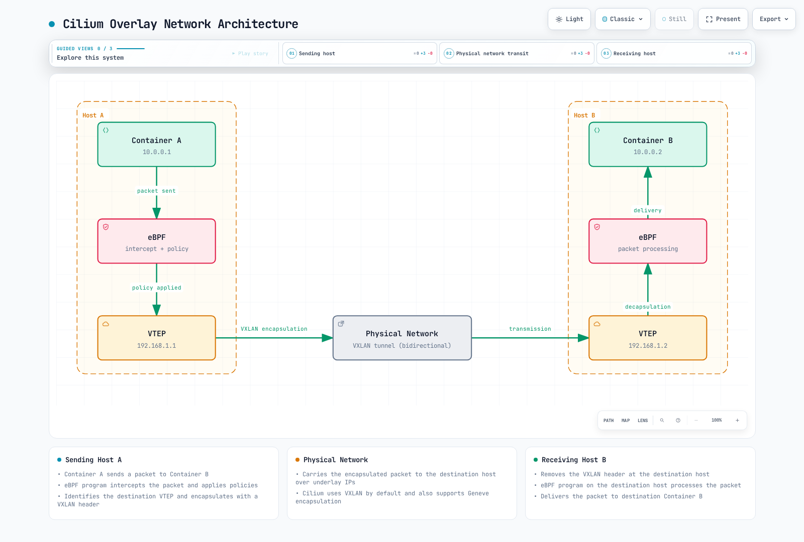

# Networking Models and VXLAN

> **Review baseline**: Cilium 1.20.1, tested Kubernetes 1.33–1.36, Linux 5.10+ or documented equivalent backports such as RHEL 8.10's 4.18 kernel.
> **Last reviewed**: September 12, 2026

## Lab Environment Setup

Use the [installation guide](README.md) to prepare a disposable cluster and architecture-appropriate Cilium CLI. Keep kubectl within one minor version of the API server; “v1.31 or higher” is not a compatibility rule.

The generic mode examples below require at least two schedulable Linux nodes, no competing Pod CNI, working kube-proxy and a non-overlapping Pod CIDR. The native-routing example additionally requires the nodes to share an L2 segment. These are not EKS ENI, GKE Dataplane V2, AKS managed-Cilium or in-place CNI migration recipes.

### Network Analysis Tools

Install tcpdump/Wireshark through the analysis host's supported package source. Node packet capture must run on the relevant node/network namespace, not merely on the laptop that runs kubectl. An agent monitor reports emitted BPF events; it is not a full packet capture.

```bash
kubectl config current-context
kubectl -n kube-system get pods -l k8s-app=cilium -o wide
export CILIUM_POD=cilium-REPLACE-WITH-AGENT-ON-TARGET-NODE
kubectl -n kube-system exec "$CILIUM_POD" -c cilium-agent -- \
  cilium-dbg monitor --type trace -v
```

For the explicit VXLAN profile below, capture a bounded sample on the relevant worker:

```bash
sudo tcpdump -nn -i any -c 50 'udp port 8472'
```

Use the configured tunnel port if it differs. Generate cross-node Pod traffic: same-node traffic need not traverse the overlay. An empty capture can mean the wrong node, interface, port or traffic path rather than a network failure.

## Container Networking Model Comparison

Host namespaces, bridges and inter-node transports describe different aspects of networking and can coexist. They are not a universal performance or security ranking.

| Model | Mechanism | Important tradeoff |
|---|---|---|
| Host network | A Pod shares the node network namespace | Port conflicts and reduced network-namespace isolation; not automatically the best application performance |
| Bridge | A virtual L2 bridge connects interfaces | Inter-node communication still needs routing/transport; Cilium does not require a Linux bridge for every endpoint |
| Overlay | Encapsulated traffic crosses an IP underlay | Extra headers and processing, but the underlay need not route every Pod prefix |
| Native/underlay routing | The network can route workload addresses | Requires correct forwarding/return routes and address planning; does not inherently provide or remove policy/encryption |

### Cilium Networking Modes

Cilium's `routingMode` is `tunnel` or `native`. VXLAN/Geneve choose the tunnel protocol. Cloud IPAM integrations are another configuration dimension, often paired with a native datapath; they are not a third `routingMode` value. BGP is a route-advertisement mechanism, not a separate packet-forwarding mode.

## VXLAN Technology Deep Dive

VXLAN carries an inner Ethernet frame in UDP over an IP network. A VTEP encapsulates/decapsulates traffic; the 24-bit VNI offers a theoretical space of 2^24 identifiers. This does not promise that a Kubernetes deployment supports 16 million tenants.

The standardized VXLAN destination port is UDP 4789. **Cilium defaults to UDP 8472** for VXLAN and UDP 6081 for Geneve; both are configurable. Cilium can carry security-identity metadata in encapsulation, so do not equate generic VXLAN segment counts with Cilium tenant/policy boundaries.

### VXLAN Packet Structure

```text
Outer Ethernet
  Outer IP (IPv4 or IPv6)
    Outer UDP (Cilium VXLAN default destination 8472; standard 4789)
      VXLAN header (8 bytes, including VNI)
        Inner Ethernet
          Inner IP packet and transport/application payload
```

IP carries UDP; an outer IP header is not itself carried inside the outer UDP header. VXLAN segmentation does not provide encryption, integrity or automatic NetworkPolicy isolation. Restrict the underlay path appropriately and configure policy/encryption separately.

### MTU Budget

For ordinary VXLAN with no additional encapsulation/options, the reduction in the inner IP budget is:

| Underlay IP family | Outer IP + UDP + VXLAN + inner Ethernet | Inner IP budget for a 1,500-byte underlay IP MTU |
|---|---|---|
| IPv4 | 20 + 8 + 8 + 14 = 50 bytes | 1,450 bytes |
| IPv6 | 40 + 8 + 8 + 14 = 70 bytes | 1,430 bytes |

The outer Ethernet header is outside that underlay IP MTU. Encryption, Geneve options and other paths can change the budget. The effective route MTU and a Pod veth's device MTU need not be identical.

In Cilium 1.20.1, Helm **`MTU` overrides the underlying-network MTU**; Cilium then calculates route overhead. `MTU: 0` selects detection. Setting `MTU: 1450` as if it meant “the final Pod payload MTU” can subtract the tunnel overhead again. Local interface detection also does not prove the smallest MTU across the entire path.

### VXLAN vs Other Encapsulations

| Technology | Carrier / identifier | Protocol or port | Boundary |
|---|---|---|---|
| VXLAN | Ethernet in UDP; 24-bit VNI | UDP 4789 standard; Cilium 8472 default | Fixed base header; not encryption |
| Geneve | Generic network virtualization with extensible options; 24-bit VNI | UDP 6081 | Option length changes overhead |
| GRE | Generic encapsulation; base GRE has no VXLAN-style VNI | IP protocol 47, not TCP/UDP port 47 | Optional extensions must be considered; “unlimited networks” is not a defined capacity |
| NVGRE | Ethernet over GRE; 24-bit VSID within the GRE key | IP protocol 47 | Different identifier/flow semantics; support depends on implementation |

## Cilium's Overlay Networking

Without an overriding platform/profile configuration, Cilium uses tunnel routing with VXLAN. Cross-node Pod transport needs reachable node addresses, permitted tunnel UDP traffic and a usable MTU. Overlay does not fix overlapping Pod address ranges or make disconnected nodes reachable.



[🔍 View interactive diagram](https://www.atomai.click/kubernetes-docs/archmaps/en-networking-cilium-03-networking-2.html)

The figure is a conceptual flow. Its addresses are not a per-node IPAM allocation plan; real node Pod blocks must be allocated consistently without overlap. Policy is applied where configured, and source/destination hooks can differ.

1. Cilium identifies the remote endpoint/node from control-plane and datapath state.
2. The source encapsulates the relevant Pod packet and sends it using underlay node addresses.
3. The destination decapsulates and processes/delivers the inner packet.
4. Datapath events, route state and captures help locate failures; one missing event alone does not identify the cause.

## Routing Mechanisms

### Encapsulation

The underlay only needs the node/tunnel path, rather than a route for every Pod prefix. The cost includes headers and processing. Larger frames can reduce the relative overhead only if the whole path supports the chosen MTU.

### Native Routing

The node and underlay must route the Pod addresses, including return traffic. Routes can come from a cloud network, a router, static configuration or another routing component. Enabling native mode does not automatically start BGP or advertise every Pod CIDR.

`autoDirectNodeRoutes: true` installs direct PodCIDR routes for nodes sharing an L2 network. With multiple L2 segments, `directRoutingSkipUnreachable` may skip unreachable direct routes while an independently working routed path handles them. It does not fall back to overlay tunnels.

**Do not combine tunnel routing with `autoDirectNodeRoutes: true`: Cilium 1.20.1 explicitly rejects this combination at startup.** The old “hybrid mode” recipe was invalid. Native routing can still coexist with feature-specific encapsulation, such as a configured Geneve DSR path; that is a separate service feature.

The Cilium BGP Control Plane advertises configured Pod/Service prefixes to peers. It does **not program the local datapath** and must not be treated as the component that automatically supplies missing intra-cluster routes.

## Performance Optimization Techniques

Measure with the same protocol, payload sizes, concurrency, node placement, policy, encryption and proxy settings before comparing modes. Removing one encapsulation header does not guarantee lower application latency.

- **Datapath:** socket load balancing, supported XDP acceleration and DSR apply to particular paths. They are not automatically enabled by VXLAN or native routing.
- **Connection tracking:** Cilium BPF connection tracking and Linux netfilter conntrack are different state mechanisms. Bypassing a netfilter path does not mean all established traffic stops using Cilium connection state.
- **Maps:** size maps against actual capacity and memory pressure. LRU eviction is useful for caches, not a universal optimization for every map.
- **Host tuning:** CPU/NUMA placement, IRQ distribution/coalescing and queue configuration can help or hurt particular workloads. Huge pages are not a general Cilium speed switch; require evidence for the actual consumer and environment.

## Cloud Provider-specific Networking

| Environment | Correct distinction |
|---|---|
| AWS ENI IPAM | Cilium allocates VPC-routable ENI addresses with operator IAM/API/subnet/instance-capacity requirements. ENI security groups and Cilium policy complement each other; this is not automatically the AWS VPC CNI's per-Pod branch-ENI feature |
| EKS platforms | Alternate CNI on ordinary EC2 nodes has separate support responsibilities. Fargate and EKS Auto Mode do not support replacing their CNI with this generic lab profile. Hybrid Nodes have a separate supported installation path |
| Google Cloud | Self-managed upstream Cilium can use Kubernetes host-scope IPAM and routable alias ranges. Managed GKE Dataplane V2 uses Google-managed Cilium/`anetd`; do not install another upstream dataplane over it or assume identical exposed features |
| Azure | Azure CNI Powered by Cilium is managed by AKS with delegated IPAM. Upstream Azure IPAM targets self-managed Azure VM/VMSS clusters; AKS BYOCNI is another explicitly selected deployment model |

Cloud firewall/security-group configuration is not automatically created by every Cilium policy. Select the platform guide and support model first.

## Lab: Cilium Networking Mode Configuration and Performance Testing

### Select One Mode on a Fresh Prepared Cluster

Save this common file, first replacing the Pod CIDR if it overlaps node, Service, VPC or connected-network ranges. Keep the chosen range consistent with cluster/kube-proxy configuration and the native profile's `ipv4NativeRoutingCIDR`; changing only one file is insufficient. `kubeProxyReplacement: false` deliberately assumes working kube-proxy. These are Helm values, not a ConfigMap to apply with kubectl.

**`lab-common.yaml`**

```yaml
kubeProxyReplacement: false
ipv4:
  enabled: true
ipv6:
  enabled: false
ipam:
  mode: cluster-pool
  operator:
    clusterPoolIPv4PodCIDRList:
    - 10.244.0.0/16
    clusterPoolIPv4MaskSize: 24
MTU: 0
hubble:
  enabled: true
  relay:
    enabled: true
  ui:
    enabled: true
```


Choose exactly one of the following mode files. Use separate disposable clusters for comparisons rather than reinstalling the CNI repeatedly on a live cluster.

**`mode-vxlan.yaml`**

```yaml
routingMode: tunnel
tunnelProtocol: vxlan
tunnelPort: 8472
autoDirectNodeRoutes: false
```

**`mode-geneve.yaml`**

```yaml
routingMode: tunnel
tunnelProtocol: geneve
tunnelPort: 6081
autoDirectNodeRoutes: false
```

**`mode-native.yaml`**

```yaml
routingMode: native
ipv4NativeRoutingCIDR: 10.244.0.0/16
autoDirectNodeRoutes: true
```


For the VXLAN example:

```bash
kubectl config current-context
cilium install --version 1.20.1 --values lab-common.yaml --values mode-vxlan.yaml
cilium status --wait
```

Select `mode-geneve.yaml` or `mode-native.yaml` instead only when its network prerequisites hold. Do not apply the obsolete `tunnel: vxlan`, `ipv4-range` or `ipv4-service-range` ConfigMap examples; configure IPAM through the supported Helm fields.

### Network Performance Testing

Use the CLI's maintained performance workloads rather than assuming an unrelated manifest creates `netperf-client` and `netperf-server`. On the prepared disposable cluster:

```bash
cilium connectivity perf --test-namespace cilium-net-perf \
  --namespace-labels docs-audit-lab=cilium-networking-03 \
  --duration 10s --samples 2 --crr --udp \
  --host-net=false --pod-net=true --same-node=true --other-node=true \
  --report-dir ./cilium-net-perf-results
```

The duration is per test case/sample, not a ten-second total run. This creates test workloads and network load. CLI 0.20.0 appends a sequence suffix to the namespace (`cilium-net-perf-1` for the default single suite). Save versions, placement and settings with results; no throughput/latency number is guaranteed.

TCP request/response, connection-rate and stream tests answer different questions. If using an independently prepared iperf3 setup, UDP testing still needs the TCP control connection and a UDP data path; a Service exposing only TCP 5201 is insufficient. Offered UDP rate is not measured achieved throughput.

These examples were checked against current official values, API schemas and CLI source. This audit did not render Helm templates, deploy a cluster or run a network benchmark after the host restart; validate the complete platform/lab environment before relying on results.

## Sources

- [Cilium 1.20.1 routing](https://github.com/cilium/cilium/blob/v1.20.1/Documentation/network/concepts/routing.rst), [Helm values](https://github.com/cilium/cilium/blob/v1.20.1/install/kubernetes/cilium/values.yaml), [startup validation](https://github.com/cilium/cilium/blob/v1.20.1/daemon/cmd/daemon_main.go), [MTU calculation](https://github.com/cilium/cilium/blob/v1.20.1/pkg/mtu/mtu.go), [MTU option](https://github.com/cilium/cilium/blob/v1.20.1/pkg/mtu/cell.go)
- [VXLAN RFC 7348](https://www.rfc-editor.org/rfc/rfc7348.txt), [Geneve RFC 8926](https://www.rfc-editor.org/rfc/rfc8926.txt), [GRE RFC 2784](https://www.rfc-editor.org/rfc/rfc2784.txt), [NVGRE RFC 7637](https://www.rfc-editor.org/rfc/rfc7637.txt)
- [BGP Control Plane](https://github.com/cilium/cilium/blob/v1.20.1/Documentation/network/bgp-control-plane/bgp-control-plane.rst), [AWS ENI](https://github.com/cilium/cilium/blob/v1.20.1/Documentation/network/concepts/ipam/eni.rst), [EKS alternate CNI](https://docs.aws.amazon.com/eks/latest/userguide/alternate-cni-plugins.html), [GKE Dataplane V2](https://docs.cloud.google.com/kubernetes-engine/docs/concepts/dataplane-v2), [Azure IPAM](https://github.com/cilium/cilium/blob/v1.20.1/Documentation/network/concepts/ipam/azure.rst)
- [CLI 0.20.0 connectivity/perf options](https://github.com/cilium/cilium-cli/blob/v0.20.0/vendor/github.com/cilium/cilium/cilium-cli/cli/connectivity.go), [iperf3 invocation](https://software.es.net/iperf/invoking.html), [kubectl version skew](https://kubernetes.io/releases/version-skew-policy/)


[Return to Main Page](README.md)

## Quiz

Work through the [networking validation exercises and expected results](../../quizzes/networking/cilium/03-networking-quiz.md).
