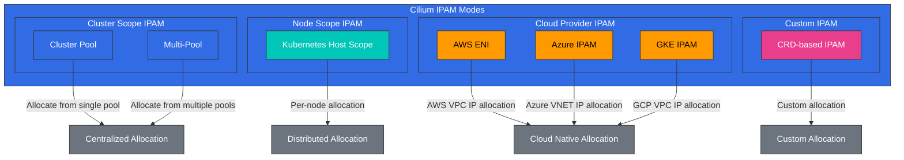

# IPAM and Network Policies

> **Supported Versions**: Cilium 1.18
> **Last Updated**: November 24, 2025

## Lab Environment Setup

To follow along with the examples in this document, you need the following tools and environment:

### Required Tools
- kubectl v1.31 or higher
- A working Kubernetes cluster (EKS, minikube, kind, etc.)
- Cilium CLI

### IPAM and Network Policy Lab Setup

```bash
# Check Cilium status
cilium status --wait

# Check current IPAM configuration
kubectl -n kube-system get configmap cilium-config -o yaml | grep -E 'ipam|allocator'

# Create namespace for network policy testing
kubectl create namespace policy-test

# Deploy test application
kubectl -n policy-test apply -f https://raw.githubusercontent.com/cilium/cilium/v1.14/examples/minikube/http-sw-app.yaml
```

## IP Address Management (IPAM) Strategies

> **Key Concept**: IPAM (IP Address Management) is a system responsible for allocating, tracking, and managing IP addresses.

IPAM is a system responsible for allocating, tracking, and managing IP addresses. Cilium supports various IPAM modes that can be flexibly configured to match different environments and requirements.

### Cilium IPAM Architecture



### Cilium IPAM Modes:

1. **Cluster Pool**:
   - Default IPAM mode
   - Centralized IP address allocation across the entire cluster
   - Can configure single or multiple IP pools
   - Simple and easy to use

2. **Kubernetes Host Scope**:
   - Allocates IP address range to each node
   - Node allocates IP addresses from its own range
   - No central coordination needed
   - Prevents IP conflicts between nodes

3. **CRD-based IPAM**:
   - IP pool definition through CiliumIPPool custom resource
   - Allocate IP pools to specific namespaces or pods
   - Fine-grained IP address management
   - Dynamic IP pool management

4. **AWS ENI (Elastic Network Interface)**:
   - AWS VPC ENI integration
   - Assigns native VPC IP addresses to pods
   - VPC native networking without overlay network
   - Optimized for AWS environment

5. **Azure IPAM**:
   - Azure VNET integration
   - Assigns native VNET IP addresses to pods
   - Optimized for Azure environment

### IPAM Components:

- **IP Pool**: Range of IP addresses available for allocation
- **IP Allocation**: Assigning IP addresses to endpoints
- **IP Release**: Reclaiming unused IP addresses
- **IP Conflict Detection**: Preventing IP address conflicts
- **IP Reservation**: Reserving IP addresses for specific purposes

### IPAM Considerations:

- **Address Space Size**: Number of IP addresses needed
- **Network Segmentation**: Subnet and CIDR block design
- **Scalability**: Considering future growth

### IPAM Configuration Example

Cluster Pool IPAM Configuration:
```yaml
apiVersion: v1
kind: ConfigMap
metadata:
  name: cilium-config
  namespace: kube-system
data:
  ipam: "cluster-pool"
  cluster-pool-ipv4-cidr: "10.0.0.0/16"
  cluster-pool-ipv4-mask-size: "24"
  enable-ipv4: "true"
  enable-ipv6: "false"
```

AWS ENI IPAM Configuration:
```yaml
apiVersion: v1
kind: ConfigMap
metadata:
  name: cilium-config
  namespace: kube-system
data:
  ipam: "eni"
  enable-ipv4: "true"
  enable-ipv6: "false"
  eni-tags: "{\"cluster\": \"eks-cluster\"}"
  ec2-api-endpoint: "ec2.us-west-2.amazonaws.com"
```
- **Cloud Integration**: Integration with cloud provider networking
- **IPv4 vs IPv6**: Single or dual stack configuration

## Kubernetes and Cilium IPAM Integration

Cilium integrates closely with Kubernetes to allocate and manage IP addresses for pods and services.

### Kubernetes IPAM Integration Flow:

1. **Pod Creation**: Kubernetes requests pod creation
2. **CNI Call**: kubelet calls Cilium CNI plugin
3. **IP Allocation Request**: Cilium requests IP address from IPAM module
4. **IP Allocation**: IPAM allocates available IP address
5. **Network Setup**: Cilium configures pod's network namespace
6. **State Storage**: IP allocation information stored
7. **Pod Start**: Pod starts with configured network

### Cilium Cluster Pool Configuration:

```yaml
# cilium-config.yaml
apiVersion: v1
kind: ConfigMap
metadata:
  name: cilium-config
  namespace: kube-system
data:
  # Cluster pool IPAM mode
  ipam: "cluster-pool"

  # IPv4 CIDR range
  cluster-pool-ipv4-cidr: "10.0.0.0/8"
  cluster-pool-ipv4-mask-size: "24"

  # IPv6 CIDR range (optional)
  cluster-pool-ipv6-cidr: "fd00::/104"
  cluster-pool-ipv6-mask-size: "120"

  # Enable dual stack
  enable-ipv4: "true"
  enable-ipv6: "true"
```

### CRD-based IPAM Example:

```yaml
# cilium-ippool.yaml
apiVersion: "cilium.io/v2alpha1"
kind: CiliumIPPool
metadata:
  name: "production-pool"
spec:
  ipv4:
    cidr: "10.10.0.0/16"
    blockSize: 27  # 32 IP address blocks
  selector:
    matchLabels:
      environment: production
```

### AWS ENI IPAM Configuration:

```yaml
# cilium-aws-config.yaml
apiVersion: v1
kind: ConfigMap
metadata:
  name: cilium-config
  namespace: kube-system
data:
  # AWS ENI IPAM mode
  ipam: "eni"

  # AWS ENI configuration
  enable-endpoint-routes: "true"
  auto-create-cilium-node-resource: "true"

  # ENI tags (optional)
  eni-tags: "{\"team\": \"platform\"}"

  # Prefix delegation (optional)
  enable-prefix-delegation: "true"
  eni-prefix-delegation-enabled: "true"
```

## IPAM Mode Deep Dive

### 1. Cluster Scope - Default Mode

Cluster Scope IPAM is Cilium's default IPAM mode, allocating IP addresses centrally across the entire cluster.

**Key Features**:
- Centralized IP address allocation
- Guarantees IP address uniqueness across the cluster
- Can configure single or multiple IP pools
- Simple and easy to use

**How it works**:
1. Cilium agent allocates IP addresses from the cluster-wide IP pool.
2. Allocated IP addresses are stored in Kubernetes CRDs.
3. IP address allocation information is shared across all nodes in the cluster.

### 2. Kubernetes Host Scope

Kubernetes Host Scope IPAM allocates IP address ranges to each node, and nodes allocate IP addresses from their own range.

**Key Features**:
- Per-node IP address range allocation
- No central coordination needed
- Prevents IP conflicts between nodes
- Improved scalability

**How it works**:
1. Kubernetes allocates a PodCIDR to each node.
2. Cilium allocates IP addresses from the node's PodCIDR.
3. Each node independently manages its own IP address range.

### 3. Multi-Pool - Beta

Multi-Pool IPAM provides the ability to define multiple IP pools and allocate specific pools to specific workloads.

**Key Features**:
- Define and manage multiple IP pools
- Allocate IP pools per namespace, pod, or node
- Fine-grained IP address management
- Support for various network requirements

**How it works**:
1. Define multiple IP pools using CiliumIPPool CRD.
2. Use selectors to allocate specific pools to specific workloads.
3. Cilium allocates IP addresses from the appropriate pool according to defined rules.

### 4. Azure IPAM

Azure IPAM integrates with Azure VNET to assign native VNET IP addresses to pods.

**Key Features**:
- Azure VNET native IP address allocation
- Azure network security group integration
- Azure networking optimization

### 5. Azure Delegated IPAM

Azure Delegated IPAM is a mode that delegates IP address management to Azure CNI.

**Key Features**:
- Integration with Azure CNI
- Azure-managed IP address allocation
- Leverages Azure networking features

### 6. CRD-based IPAM

CRD-based IPAM uses Kubernetes CRDs to manage IP address allocation.

**Key Features**:
- IP address management through Kubernetes CRDs
- Declarative IP address allocation
- Integration with Kubernetes native workflows

**How it works**:
1. IP address pool information is stored in CiliumNode CRD.
2. Cilium agent reads IP address allocation information from CRD.
3. IP address allocation state is updated in CRD.

## Querying Per-Node PodCIDRs via CiliumNode CR

In Cilium's `cluster-pool` IPAM mode, pod CIDR allocation information for each node is recorded in the **CiliumNode CR**. This CR serves as the authoritative source for static route configuration, IPAM debugging, and network troubleshooting.

> **Note**: The Kubernetes Node object's `spec.podCIDR` may differ from the CiliumNode CR's `spec.ipam.podCIDRs`. In Cilium environments, always use the CiliumNode CR as the source of truth.

### CiliumNode CR Structure (Key Fields)

```yaml
apiVersion: cilium.io/v2
kind: CiliumNode
metadata:
  name: hybrid-node-001
spec:
  addresses:
  - ip: 10.80.1.10        # Node IP (used as next hop for static routes)
    type: InternalIP
  ipam:
    podCIDRs:
    - 10.85.0.0/25         # Pod CIDR allocated to this node
```

- **`spec.addresses[].ip`**: The node's actual IP address. Used as the next hop when configuring static routes.
- **`spec.ipam.podCIDRs`**: List of pod CIDRs allocated to this node by the Cilium Operator.

### Query Commands

```bash
# List all CiliumNodes
kubectl get ciliumnodes

# Query node IP and PodCIDR in table format
kubectl get ciliumnodes -o custom-columns='\
NAME:.metadata.name,\
NODE_IP:.spec.addresses[0].ip,\
POD_CIDR:.spec.ipam.podCIDRs[0]'
```

Example output:

```
NAME                NODE_IP       POD_CIDR
hybrid-node-001     10.80.1.10    10.85.0.0/25
hybrid-node-002     10.80.1.11    10.85.0.128/25
hybrid-node-003     10.80.1.12    10.85.1.0/25
```

### Scripting Usage

```bash
# Extract routing table information using jq
kubectl get ciliumnodes -o json | jq -r \
  '.items[] | "\(.metadata.name)\t\(.spec.addresses[0].ip)\t\(.spec.ipam.podCIDRs[0])"'

# Auto-generate static route commands (useful for EKS Hybrid Nodes, etc.)
kubectl get ciliumnodes -o json | jq -r \
  '.items[] | "ip route add \(.spec.ipam.podCIDRs[0]) via \(.spec.addresses[0].ip)"'
```

> **Use Case**: This information is used to configure static routes without BGP in EKS Hybrid Nodes environments. For details, see [EKS Hybrid Nodes - Network Configuration](../../eks-hybrid-nodes/02-network-configuration.md).

## Network Policy Design and Implementation

Cilium network policies provide a powerful mechanism to control communication between microservices at L3-L7 layers. These policies extend the Kubernetes NetworkPolicy API to provide more granular control.

### Network Policy Basic Concepts:

- **Endpoint Selector**: Defines endpoints to which policy applies
- **Ingress Rules**: Controls incoming traffic
- **Egress Rules**: Controls outgoing traffic
- **L3/L4 Policy**: IP address and port-based filtering
- **L7 Policy**: Application layer protocol-aware filtering

### L3/L4 Network Policy Example:

```yaml
# l3-l4-policy.yaml
apiVersion: "cilium.io/v2"
kind: CiliumNetworkPolicy
metadata:
  name: "l3-l4-policy"
spec:
  endpointSelector:
    matchLabels:
      app: backend
  ingress:
  - fromEndpoints:
    - matchLabels:
        app: frontend
    toPorts:
    - ports:
      - port: "8080"
        protocol: TCP
  egress:
  - toEndpoints:
    - matchLabels:
        app: database
    toPorts:
    - ports:
      - port: "3306"
        protocol: TCP
```

### L7 HTTP Policy Example:

```yaml
# l7-http-policy.yaml
apiVersion: "cilium.io/v2"
kind: CiliumNetworkPolicy
metadata:
  name: "l7-http-policy"
spec:
  endpointSelector:
    matchLabels:
      app: backend
  ingress:
  - fromEndpoints:
    - matchLabels:
        app: frontend
    toPorts:
    - ports:
      - port: "8080"
        protocol: TCP
      rules:
        http:
        - method: "GET"
          path: "/api/v1/users"
        - method: "POST"
          path: "/api/v1/users"
          headers:
          - "Content-Type: application/json"
```

### L7 Kafka Policy Example:

```yaml
# l7-kafka-policy.yaml
apiVersion: "cilium.io/v2"
kind: CiliumNetworkPolicy
metadata:
  name: "l7-kafka-policy"
spec:
  endpointSelector:
    matchLabels:
      app: kafka-broker
  ingress:
  - fromEndpoints:
    - matchLabels:
        app: kafka-client
    toPorts:
    - ports:
      - port: "9092"
        protocol: TCP
      rules:
        kafka:
        - apiKey: "Produce"
          topic: "allowed-topic-1"
        - apiKey: "Fetch"
          topic: "allowed-topic-1"
        - apiKey: "CreateTopics"
          topic: "allowed-topic-.*"
          apiVersions: ["0", "1"]
```

### DNS-based Policy Example:

```yaml
# dns-policy.yaml
apiVersion: "cilium.io/v2"
kind: CiliumNetworkPolicy
metadata:
  name: "dns-policy"
spec:
  endpointSelector:
    matchLabels:
      app: client
  egress:
  - toEndpoints:
    - matchLabels:
        "k8s:io.kubernetes.pod.namespace": kube-system
        "k8s:k8s-app": kube-dns
    toPorts:
    - ports:
      - port: "53"
        protocol: UDP
      - port: "53"
        protocol: TCP
  - toFQDNs:
    - matchName: "api.example.com"
    - matchPattern: "*.googleapis.com"
    toPorts:
    - ports:
      - port: "443"
        protocol: TCP
```

### Network Policy Best Practices:

1. **Apply Default Deny Policy**:
   - Block all traffic not explicitly allowed
   - Apply least privilege principle

2. **Gradual Approach**:
   - Start with observation mode to assess impact
   - Gradually apply and strengthen policies

3. **Use Label-based Selectors**:
   - Use label-based selectors instead of IP addresses
   - Provides flexibility in dynamic environments

4. **Policy Layering**:
   - Combine base policies and specific policies
   - Separation of concerns and maintainability

5. **Policy Testing and Validation**:
   - Test before policy application
   - Continuous policy validation and monitoring

## Multi-cluster Scenarios

Cilium provides powerful features for networking and security across multiple Kubernetes clusters. This enables cross-cluster service communication, network policy enforcement, and load balancing.

### Multi-cluster Connectivity Models:

1. **Global Services**:
   - Expose services across multiple clusters
   - Cross-cluster load balancing
   - Automatic failover and high availability

2. **Cluster Mesh**:
   - Direct connectivity between clusters
   - Cross-cluster network policies
   - Unified observability

3. **Remote Nodes**:
   - Display nodes from remote clusters as local
   - Transparent communication between clusters
   - Single network namespace simulation

### Cilium Cluster Mesh Architecture:

```
+-------------------+        +-------------------+
| Cluster A         |        | Cluster B         |
|                   |        |                   |
| +---------------+ |        | +---------------+ |
| | Service A     | |        | | Service B     | |
| | (Global)      | |        | | (Global)      | |
| +-------+-------+ |        | +-------+-------+ |
|         |         |        |         |         |
|     +---v---+     |        |     +---v---+     |
|     | eBPF  |     |        |     | eBPF  |     |
|     +---+---+     |        |     +---+---+     |
|         |         |        |         |         |
| +-------v-------+ |        | +-------v-------+ |
| | Cilium        | |<------>| | Cilium        | |
| | Clustermesh   | |        | | Clustermesh   | |
| +---------------+ |        | +---------------+ |
|                   |        |                   |
+-------------------+        +-------------------+
```

### Cilium Cluster Mesh Setup:

```bash
# Enable Cluster Mesh on Cluster A
cilium clustermesh enable --context cluster-a

# Enable Cluster Mesh on Cluster B
cilium clustermesh enable --context cluster-b

# Connect clusters
cilium clustermesh connect --context cluster-a --destination-context cluster-b

# Check status
cilium clustermesh status --context cluster-a
```

### Global Service Definition:

```yaml
# global-service.yaml
apiVersion: v1
kind: Service
metadata:
  name: global-service
  annotations:
    io.cilium/global-service: "true"
spec:
  selector:
    app: global-app
  ports:
  - port: 80
    targetPort: 8080
  type: ClusterIP
```

### Cross-cluster Network Policy:

```yaml
# cross-cluster-policy.yaml
apiVersion: "cilium.io/v2"
kind: CiliumNetworkPolicy
metadata:
  name: "cross-cluster-policy"
spec:
  endpointSelector:
    matchLabels:
      app: backend
  ingress:
  - fromEndpoints:
    - matchLabels:
        app: frontend
        io.kubernetes.pod.namespace: frontend-ns
        io.cilium.k8s.policy.cluster: cluster-a
    toPorts:
    - ports:
      - port: "8080"
        protocol: TCP
```

[Return to Main Page](README.md)

## Quiz

To test what you learned in this chapter, try the [Topic Quiz](../../quizzes/networking/cilium/04-ipam-policy-quiz.md).
