# Advanced Topics and Real-World Cases

> **Supported Versions**: Cilium 1.18
> **Last Updated**: November 24, 2025

## Lab Environment Setup

To follow along with the examples in this document, you need the following tools and environment:

### Required Tools
- kubectl v1.31 or higher
- A working Kubernetes cluster (EKS, minikube, kind, etc.)
- Cilium CLI
- Helm v3.10 or higher
- System monitoring tools (sysstat, htop, bpftool)

### Performance Testing Environment Setup

```bash
# Create performance testing namespace
kubectl create namespace perf-test

# Deploy test application
kubectl -n perf-test apply -f - <<EOF
apiVersion: apps/v1
kind: Deployment
metadata:
  name: load-generator
  namespace: perf-test
spec:
  replicas: 2
  selector:
    matchLabels:
      app: load-generator
  template:
    metadata:
      labels:
        app: load-generator
    spec:
      containers:
      - name: wrk
        image: skandyla/wrk
        command: ["sleep", "infinity"]
EOF

# Monitor system status
kubectl -n kube-system exec -it $(kubectl -n kube-system get pods -l k8s-app=cilium -o jsonpath='{.items[0].metadata.name}') -- cilium status --verbose
```

## Performance Tuning and Troubleshooting

> **Key Concept**: To optimize Cilium's performance, you need to properly adjust kernel parameters, eBPF map sizes, resource allocation, and networking modes.

Understanding how to optimize Cilium's performance and resolve common issues is important for effectively operating Cilium in production environments.

### Performance Tuning Architecture

```mermaid
flowchart TD
    subgraph "Cilium Performance Tuning Areas"
        direction TB

        subgraph "Kernel Parameters"
            TCP[TCP Parameters]
            Conntrack[Connection Tracking]
            ARP[ARP Cache]
            Memory[Memory Management]
        end

        subgraph "eBPF Maps"
            CTMap[Connection Tracking Map]
            NATMap[NAT Map]
            PolicyMap[Policy Map]
            EndpointMap[Endpoint Map]
        end

        subgraph "Resource Allocation"
            CPULimit[CPU Limits]
            MemLimit[Memory Limits]
            PodPriority[Pod Priority]
            NodeAffinity[Node Affinity]
        end

        subgraph "Networking Mode"
            DirectRouting[Direct Routing]
            Overlay[Overlay]
            KubeProxy[kube-proxy Replacement]
            XDP[XDP Acceleration]
        end
    end

    Performance[Performance Optimization] --> TCP & Conntrack & ARP & Memory
    Performance --> CTMap & NATMap & PolicyMap & EndpointMap
    Performance --> CPULimit & MemLimit & PodPriority & NodeAffinity
    Performance --> DirectRouting & Overlay & KubeProxy & XDP

    classDef kernel fill:#326CE5,stroke:#333,stroke-width:1px,color:white;
    classDef ebpf fill:#00C7B7,stroke:#333,stroke-width:1px,color:white;
    classDef resource fill:#FF9900,stroke:#333,stroke-width:1px,color:black;
    classDef network fill:#E83E8C,stroke:#333,stroke-width:1px,color:white;
    classDef perf fill:#6c757d,stroke:#333,stroke-width:1px,color:white;

    class TCP,Conntrack,ARP,Memory kernel;
    class CTMap,NATMap,PolicyMap,EndpointMap ebpf;
    class CPULimit,MemLimit,PodPriority,NodeAffinity resource;
    class DirectRouting,Overlay,KubeProxy,XDP network;
    class Performance perf;
```



### Performance Tuning Areas:

1. **Kernel Parameter Tuning**:
   - `net.core.somaxconn`: TCP connection queue size
   - `net.ipv4.tcp_max_syn_backlog`: SYN backlog size
   - `net.ipv4.neigh.default.gc_thresh`: ARP cache size
   - `net.netfilter.nf_conntrack_max`: Connection tracking table size

2. **eBPF Map Tuning**:
   - Connection tracking map size
   - NAT map size
   - Endpoint map size
   - Policy map size

3. **Resource Allocation**:
   - Cilium agent CPU requests and limits
   - Cilium agent memory requests and limits
   - Hubble component resource allocation
   - Node resource allocation

4. **Networking Mode Selection**:
   - Direct routing vs overlay
   - Encryption enable/disable
   - kube-proxy replacement mode
   - XDP acceleration

### Performance Tuning Configuration Example:

```yaml
# performance-tuning.yaml
apiVersion: v1
kind: ConfigMap
metadata:
  name: cilium-config
  namespace: kube-system
data:
  # eBPF map size adjustment
  bpf-map-dynamic-size-ratio: "0.0025"
  bpf-ct-global-any-max: "262144"
  bpf-nat-global-max: "131072"

  # Proxy configuration
  proxy-max-memory-percentage: "30"
  proxy-max-threads: "8"

  # Networking mode
  tunnel: "disabled"
  enable-ipv4: "true"
  enable-ipv6: "false"
  auto-direct-node-routes: "true"

  # kube-proxy replacement
  kube-proxy-replacement: "strict"
  enable-node-port: "true"
  node-port-algorithm: "maglev"

  # XDP acceleration
  enable-xdp: "true"
```

### Common Troubleshooting Scenarios:

| Issue | Symptoms | Diagnostic Commands | Resolution |
|-------|----------|---------------------|------------|
| Connection tracking map full | Connection failures, packet loss | `cilium bpf ct list global` | Increase connection tracking map size |
| Out of memory | OOM kills, restarts | `kubectl top pods -n kube-system` | Increase memory limits |
| Policy application failure | Unexpected connection blocking | `cilium policy get` | Policy debugging, log review |
| Inter-node communication issues | Pod-to-pod connection failures | `cilium connectivity test` | Verify routing tables, firewall rules |

### Common Issues and Solutions:

1. **Connection Issues**:
   - Symptoms: Pod-to-pod connection failures
   - Diagnostics: `cilium status`, `cilium endpoint list`, `cilium bpf tunnel list`
   - Resolution: Check network policies, verify endpoint status, verify routing tables

2. **Policy Application Issues**:
   - Symptoms: Network policies not working as expected
   - Diagnostics: `cilium policy get`, `cilium endpoint get <id>`, `hubble observe`
   - Resolution: Verify policy syntax, check labels, verify policy priorities

3. **Performance Issues**:
   - Symptoms: High latency, low throughput
   - Diagnostics: `cilium bpf metrics list`, `cilium monitor`, system resource monitoring
   - Resolution: Increase resource allocation, adjust map sizes, tune kernel parameters

4. **Upgrade Issues**:
   - Symptoms: Feature loss or errors after upgrade
   - Diagnostics: `cilium status`, log review, version compatibility check
   - Resolution: Staged upgrade, configuration migration, rollback plan

### Troubleshooting Commands:

```bash
# Check Cilium status
cilium status --verbose

# Check endpoint status
cilium endpoint list
cilium endpoint get <id>

# Check policies
cilium policy get
cilium policy selectors

# Check eBPF maps
cilium bpf metrics list
cilium bpf tunnel list
cilium bpf lb list

# Monitor network flows
cilium monitor
hubble observe --verdict DROPPED

# Check logs
kubectl logs -n kube-system -l k8s-app=cilium
kubectl logs -n kube-system -l k8s-app=hubble-relay
```

## Large-Scale Deployment Strategies

Strategies for effectively deploying and managing Cilium in large-scale Kubernetes clusters are important for ensuring stability, performance, and operational efficiency.

### Large-Scale Deployment Considerations:

1. **Cluster Size Planning**:
   - Node count and density
   - Pod count and density
   - Service count and density
   - Network policy count and complexity

2. **Resource Allocation**:
   - Cilium agent CPU and memory requirements
   - Hubble component resource requirements
   - Node resource requirements
   - Storage requirements

3. **Networking Architecture**:
   - Direct routing vs overlay
   - Inter-cluster connectivity
   - External service integration
   - Load balancing strategy

4. **Operational Strategy**:
   - Monitoring and alerting
   - Backup and recovery
   - Upgrade strategy
   - Incident response plan

### Large-Scale Deployment Architecture:

```
+-------------------+        +-------------------+
| Management        |        | Workload          |
| Cluster           |        | Cluster           |
|                   |        |                   |
| +---------------+ |        | +---------------+ |
| | Cilium        | |        | | Cilium        | |
| | Operator      | |        | | Agent         | |
| +---------------+ |        | +---------------+ |
|                   |        |                   |
| +---------------+ |        | +---------------+ |
| | Hubble        | |        | | Hubble        | |
| | Centralized   | |        | | Distributed   | |
| +---------------+ |        | +---------------+ |
|                   |        |                   |
| +---------------+ |        | +---------------+ |
| | Monitoring    | |        | | Workload      | |
| | Dashboard     | |        | | Pods          | |
| +---------------+ |        | +---------------+ |
|                   |        |                   |
+-------------------+        +-------------------+
```

### Large-Scale Deployment Best Practices:

1. **Gradual Rollout**:
   - Use canary deployments
   - Blue/green deployment strategy
   - Prepare rollback plans
   - Validate changes

2. **Automation**:
   - Implement GitOps workflows
   - CI/CD pipeline integration
   - Automated testing and validation
   - Configuration management automation

3. **Monitoring and Alerting**:
   - Comprehensive metric collection
   - Multi-level alerting strategy
   - Dashboards and visualization
   - Log aggregation and analysis

4. **Disaster Recovery**:
   - Regular backups
   - Documented recovery procedures
   - Disaster recovery drills
   - Multi-zone/region strategy

### Large-Scale Deployment Configuration Example:

```yaml
# large-scale-cilium.yaml
apiVersion: v1
kind: ConfigMap
metadata:
  name: cilium-config
  namespace: kube-system
data:
  # Large cluster optimization
  cluster-name: "prod-cluster"
  cluster-id: "1"

  # Resource optimization
  preallocate-bpf-maps: "true"
  bpf-map-dynamic-size-ratio: "0.005"

  # Scalability optimization
  enable-endpoint-slice: "true"
  enable-local-node-route: "false"
  auto-direct-node-routes: "true"

  # Operational optimization
  enable-ipv4: "true"
  enable-ipv6: "false"
  enable-ipv4-masquerade: "true"
  enable-bpf-masquerade: "true"

  # Monitoring optimization
  monitor-aggregation: "medium"
  hubble-export-file-max-size-mb: "100"
  hubble-export-file-max-backups: "5"
```

## Real-World Use Case Studies

Let's explore how Cilium is used across various industries and environments, sharing real implementation cases and lessons learned.

### Case Study 1: Large-Scale E-commerce Platform

**Background**:
- Thousands of microservices
- Hundreds of Kubernetes nodes
- Millions of requests per second
- Strict security requirements

**Challenges**:
- Securing inter-microservice communication
- Managing large-scale network policies
- High throughput and low latency requirements
- Complex service dependencies

**Cilium Implementation**:
- Replaced kube-proxy with eBPF-based load balancing
- Secured microservices with L7 policies
- Network visibility through Hubble
- Multi-cluster connectivity with Cluster Mesh

**Results**:
- 30% reduction in network latency
- 40% increase in throughput
- 80% reduction in security incidents
- 50% reduction in operational overhead

### Case Study 2: Financial Services Institution

**Background**:
- Strict regulatory compliance requirements
- Sensitive financial data processing
- Hybrid cloud environment
- Zero trust security model

**Challenges**:
- Granular access control
- Encrypted communication
- Audit and compliance reporting
- Multi-cloud connectivity

**Cilium Implementation**:
- Strict L3-L7 network policies
- Inter-node communication protection with WireGuard encryption
- Comprehensive audit logging through Hubble
- Multi-cloud connectivity with Cluster Mesh

**Results**:
- 70% reduction in compliance audit pass time
- 90% reduction in security configuration errors
- 60% reduction in network troubleshooting time
- 80% reduction in multi-cloud connectivity setup time

### Case Study 3: Telecommunications Service Provider

**Background**:
- 5G Network Function Virtualization (NFV)
- Edge computing deployment
- High-performance requirements
- Large-scale distributed environment

**Challenges**:
- Ultra-low latency networking
- Large-scale scalability
- Connectivity between edge locations
- Resource-constrained environments

**Cilium Implementation**:
- High-performance packet processing with XDP acceleration
- Minimized latency with optimized data path
- Edge location connectivity with Cluster Mesh
- Improved resource efficiency with eBPF-based load balancing

**Results**:
- 50% reduction in packet processing latency
- 10 million packets per second processing on single node
- 75% reduction in edge location connectivity setup time
- 40% reduction in computing resource usage

## Future Roadmap and Development Direction

Cilium continues to evolve, and the future roadmap includes new features, performance improvements, and use case expansion.

### Technology Development Direction:

1. **eBPF Technology Advancement**:
   - Expanded CO-RE (Compile Once, Run Everywhere) support
   - Enhanced BTF (BPF Type Format) utilization
   - New eBPF features and helper utilization
   - Improved kernel version compatibility

2. **Networking Feature Enhancement**:
   - Multi-cluster networking improvements
   - Hybrid and multi-cloud connectivity strengthening
   - IPv6 support enhancement
   - New overlay protocol support

3. **Security Feature Strengthening**:
   - Advanced threat detection and prevention
   - Expanded zero trust networking support
   - Runtime security integration
   - Compliance automation

4. **Observability Enhancement**:
   - Distributed tracing integration
   - Machine learning-based anomaly detection
   - Advanced visualization and analysis
   - Long-term data storage and analysis

### Ecosystem Integration:

1. **Service Mesh Integration**:
   - Enhanced integration with Istio, Linkerd, etc.
   - Sidecarless service mesh support
   - Unified policy management
   - Unified observability

2. **Cloud Provider Integration**:
   - Enhanced native integration with AWS, Azure, GCP
   - Cloud native networking optimization
   - Cloud security service integration
   - Cloud observability integration

3. **Application Framework Integration**:
   - Enhanced Kubernetes integration
   - Serverless platform support
   - Database and messaging system integration
   - CI/CD pipeline integration

### Use Case Expansion:

1. **Edge Computing**:
   - Resource-constrained environment optimization
   - Edge-cloud connectivity
   - Local data processing and filtering
   - Edge security

2. **5G and Telecommunications**:
   - Network Function Virtualization (NFV) support
   - User Plane Function (UPF) optimization
   - Mobile Edge Computing (MEC) integration
   - Network slicing support

3. **IoT and Embedded Systems**:
   - Lightweight agent
   - Limited resource environment support
   - Device-cloud connectivity
   - IoT security

4. **AI/ML Workloads**:
   - GPU networking optimization
   - Distributed training support
   - Model serving optimization
   - Data pipeline security

### Community and Ecosystem:

1. **Open Source Collaboration**:
   - Enhanced collaboration with CNCF projects
   - Expanded community contributions
   - Education and certification programs
   - User groups and events

2. **Commercial Support**:
   - Enterprise-grade support options
   - Managed service offerings
   - Consulting and professional services
   - Training and certification

3. **Standardization Efforts**:
   - eBPF standardization participation
   - Networking and security standards contribution
   - Interoperability improvement
   - Industry best practices definition

## New Features in Cilium 1.18

Cilium 1.18 introduces important improvements in networking, security, and observability areas.

### BGP Control Plane Improvements

Cilium 1.18 significantly improves the BGP control plane to provide more flexible and scalable routing configuration:

```yaml
apiVersion: cilium.io/v2alpha1
kind: CiliumBGPPeeringPolicy
metadata:
  name: bgp-peering-policy
spec:
  virtualRouters:
  - localASN: 64512
    exportPodCIDR: true
    neighbors:
    - peerAddress: "192.168.1.1/32"
      peerASN: 64513
      connectRetryTimeSeconds: 120
      holdTimeSeconds: 90
      keepAliveTimeSeconds: 30
```

**Key Improvements**:
- More granular BGP peer configuration
- Enhanced route filtering options
- Improved multi-hop BGP support
- BGP Graceful Restart support

### Enhanced Network Observability

New features in Hubble provide deeper network insights:

**New Metrics**:
- Granular latency metrics
- Enhanced drop reason analysis
- DNS query tracking improvements
- TCP connection state tracking

**Real-time Flow Analysis**:
```bash
# Enhanced Hubble queries
hubble observe --protocol tcp --verdict DROPPED --since 1h
hubble observe --dns --type A --from-label app=frontend
hubble observe --http-status 5xx --from-namespace production
```

### Performance Optimization

Cilium 1.18 significantly improves performance in large-scale clusters:

**Memory Optimization**:
- 20% reduction in eBPF map memory usage
- Improved memory efficiency with connection tracking optimization
- More efficient endpoint management

**CPU Optimization**:
- 15% improvement in eBPF program execution speed
- Improved network policy evaluation performance
- Faster service load balancing

### Security Enhancements

**Network Policy Improvements**:
```yaml
apiVersion: "cilium.io/v2"
kind: CiliumNetworkPolicy
metadata:
  name: enhanced-l7-policy
spec:
  endpointSelector:
    matchLabels:
      app: backend
  ingress:
  - fromEndpoints:
    - matchLabels:
        app: frontend
    toPorts:
    - ports:
      - port: "8080"
        protocol: TCP
      rules:
        http:
        - method: "GET|POST"
          path: "/api/v1/.*"
          headers:
          - "X-API-Version: 1.0"
```

**Encryption Improvements**:
- 30% improvement in WireGuard encryption performance
- Expanded IPsec encryption suites
- Faster key rotation

### Multi-cluster Networking Improvements

Cilium 1.18 improves performance and stability in multi-cluster scenarios:

**ClusterMesh Improvements**:
- Faster inter-cluster service discovery
- Enhanced failure recovery mechanisms
- Better load balancing algorithms
- Improved inter-cluster network policy propagation

### Kubernetes 1.32 Support

Cilium 1.18 fully supports new features in Kubernetes 1.32:

- Gateway API v1.0 support
- Enhanced service API support
- New Kubernetes networking feature integration

## Conclusion and Next Steps

Through this week-long deep dive course, we have comprehensively explored Cilium's core concepts, architecture, features, and real-world use cases. You now have the knowledge and tools to solve networking, security, and observability challenges in containerized environments using Cilium.

### Key Learning Points:

- Cilium's basic concepts and architecture
- eBPF technology and its use in Cilium
- Networking models and VXLAN technology
- IPAM and network policies
- L2-L7 networking and load balancing
- Security and visibility features
- Performance tuning and troubleshooting
- Large-scale deployment strategies
- Real-world use cases and future development direction

### Next Steps:

1. **Practice and Experiment**:
   - Install and configure Cilium in a test environment
   - Experiment with various networking modes and features
   - Design and test network policies
   - Explore network visibility with Hubble

2. **Knowledge Expansion**:
   - Deep learning of eBPF technology
   - Strengthen Kubernetes networking concepts
   - Learn network security best practices
   - Explore cloud native networking patterns

3. **Community Participation**:
   - Follow Cilium GitHub repository
   - Join Cilium Slack channel
   - Attend community events and webinars
   - Submit bug reports or feature requests

4. **Production Implementation Planning**:
   - Define requirements and goals
   - Design and validate architecture
   - Establish staged implementation plan
   - Develop monitoring and operational strategy

### Additional Resources:

- [Cilium Official Documentation](https://docs.cilium.io/)
- [Cilium GitHub Repository](https://github.com/cilium/cilium)
- [eBPF.io](https://ebpf.io/)
- [CNCF Website](https://www.cncf.io/)
- [Kubernetes Networking Documentation](https://kubernetes.io/docs/concepts/cluster-administration/networking/)

We hope this course has helped deepen your understanding of Cilium and cloud native networking. Since Cilium continues to evolve, it's important to keep learning about the latest developments and best practices.

[Return to Main Page](README.md)

## Quiz

To test what you learned in this chapter, try the [Topic Quiz](../../quizzes/networking/cilium/07-advanced-topics-quiz.md).
