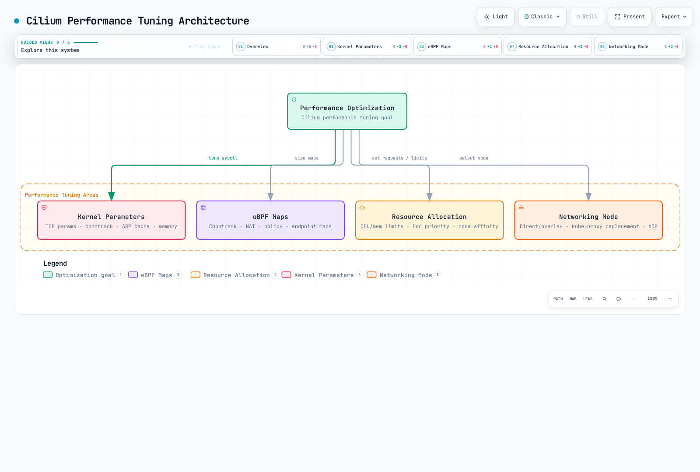

# Advanced Topics and Real-World Cases

> **Review baseline**: Cilium 1.20.1, Cilium CLI 0.20.0 and Hubble CLI 1.19.4.
> **Last reviewed**: September 12, 2026. Cilium 1.20's Kubernetes compatibility range is 1.33–1.36; historical measurements below retain their original environment.

## Lab Environment Setup

Use [the installation prerequisites](README.md) and a disposable test cluster with at least two schedulable Linux nodes. Keep the OS, kernel, Cilium settings, topology, MTU, policies, encryption and test workload in the result record. Use kubectl within its supported API-server version skew. Helm, jq and the Cilium/Hubble CLIs are needed for the commands below; `kubectl top` additionally needs a metrics API.

### Performance Testing Environment Setup

Record the existing deployment before changing it:

```bash
cilium version
cilium status --verbose
kubectl version
kubectl get nodes -o wide
kubectl -n kube-system get pods -l k8s-app=cilium -o wide
helm get values cilium --namespace kube-system -o yaml > cilium-current-values.yaml
```

The current CLI can create its own matching test workloads. Run this only when generating network load and creating test resources are acceptable:

```bash
cilium connectivity perf --test-namespace cilium-advanced-perf \
  --namespace-labels docs-audit-lab=cilium-advanced-07 \
  --duration 10s --samples 2 --crr --udp \
  --host-net=false --pod-net=true --same-node=true --other-node=true \
  --report-dir ./cilium-advanced-perf-results
```

The default single-concurrency run uses **`cilium-advanced-perf-1`**, even though the argument lacks that suffix. Ensure that namespace is unused before the test. `--duration` applies to each scenario/sample, not to the complete run; scheduling, setup and the combination of cases add time. The command is an active workload test, not a read-only diagnostic.

Compare same-node and cross-node results, TCP request/response and UDP, and the actual CPU/memory/packet-loss behavior. Repeat with one planned change at a time. A successful run does not prove application SLOs, a production capacity limit or every policy path. The audit validated these command contracts without running the test or provisioning a cluster.

## Performance Tuning and Troubleshooting

### Performance Tuning Architecture



[View interactive diagram](https://www.atomai.click/kubernetes-docs/archmaps/en-networking-cilium-07-advanced-topics-0.html)

The figure groups investigation areas; it does not prescribe increasing every setting or disabling security controls.

### Performance Tuning Areas

| Area | What to measure and what the setting controls |
| --- | --- |
| Socket backlogs | `net.core.somaxconn` limits the socket listen backlog; `net.ipv4.tcp_max_syn_backlog` concerns pending SYN_RECV requests per listener. Check the server's accept behavior and the relevant network namespace. |
| Neighbor entries | `net.ipv4.neigh.default.gc_thresh1`, `gc_thresh2` and `gc_thresh3` are distinct garbage-collection thresholds. There is no single `gc_thresh` setting. |
| Connection tracking | Netfilter's `nf_conntrack_max` and Cilium's BPF CT maps are separate mechanisms. Increasing the former does not resize the latter. |
| BPF maps | Inspect map pressure, insertion failures, churn and memory. CT, NAT, LB and per-endpoint policy maps have different scopes and sizing rules. |
| CPU and memory | Measure agent, operator, Envoy and Hubble separately. Requests affect scheduling; CPU limits can throttle and memory limits can cause OOM termination. Raising all limits is not a diagnosis. |
| Network path | Identify native/tunnel routing, MTU, masquerading, encryption and service forwarding. XDP acceleration applies to supported paths and drivers; it is not required for kube-proxy replacement. |

Keep security and routing requirements constant when comparing performance. A faster result obtained by removing required encryption or policy is not an equivalent configuration.

### Map Sizing

Save the following only as a **candidate change** after measuring pressure. Merge it into the complete, versioned release values; do not replace the whole Cilium ConfigMap with a small snippet.

```yaml
# map-sizing-values.yaml
bpf:
  mapDynamicSizeRatio: 0.005
```

`0.005` is a nominal **0.5% of node memory** input to dynamic sizing, not 5% and not a hard limit on all Cilium memory. For example, 32 GiB × 0.005 is 163.84 MiB before map limits, rounding and other allocations. The affected large maps include CT, NAT, neighbor and socket reverse-NAT maps; other maps and userspace memory remain separate.

Explicit `bpf.ctTcpMax`, `bpf.ctAnyMax` or `bpf.natMax` values override dynamic sizing for those maps. Keep NAT capacity compatible with CT capacity and verify the resolved startup sizes. Increasing maps can consume more memory; replacing maps can disrupt existing connections.

Distributed LRU (`bpf.distributedLRU.enabled`) uses per-CPU pools to reduce contention, with memory/eviction tradeoffs. It requires dynamic sizing and recreates maps when enabled. The official high-performance profile is not a universal live toggle: introduce such datapath changes on prepared new nodes or use the documented migration procedure.

The old `proxy-max-memory-percentage`, `proxy-max-threads`, `enable-xdp`, `tunnel: disabled` and `kube-proxy-replacement: strict` examples are not current configuration recipes. Use supported chart settings such as `envoy.resources`, `routingMode`, boolean `kubeProxyReplacement` and `loadBalancer.acceleration`, with their prerequisites.

### Hubble Cost and Event Loss

A larger event queue can absorb a burst, but it uses memory and does not solve a sustained processing deficit or reduce CPU consumption:

```yaml
# hubble-queue-values.yaml
hubble:
  eventQueueSize: 32768
```

If repeated trace events dominate processing, separately evaluate a longer aggregation interval:

```yaml
# hubble-aggregation-values.yaml
bpf:
  monitorAggregation: medium
  monitorInterval: 10s
```

The actual chart field is **`bpf.monitorInterval`**, not `bpf.events.monitorInterval`. Inspect the rendered `monitor-aggregation-interval` before deployment. Increased aggregation, event-rate limits and disabled event classes all reduce observations available to monitor, Hubble metrics and export. A lost Hubble event is not itself a dropped application packet; check both observability loss and datapath drops.

### Advanced Datapath Prerequisites

| Feature | Prerequisites and limits to check |
| --- | --- |
| netkit | Beta in this baseline; Linux 6.8+ and BPF host routing. Existing veth Pods cannot simply switch device type on agent restart. |
| BIG TCP | Family-specific kernel/NIC requirements; the combined tuning profile requires Linux 6.8+ and supported NICs. It is not a generic MTU increase. |
| BPF host routing | Requires compatible kube-proxy replacement and BPF masquerading. Bypasses host netfilter hooks; check Istio and other integrations that rely on those hooks. |
| XDP service acceleration | Native XDP-capable devices and a supported external service-forwarding path. Use the driver/platform guidance and verify the running status. |
| Bandwidth Manager | Per-Pod egress uses EDT; ingress uses an eBPF token bucket. `10M` in the bandwidth annotation means 10 Mbit/s, not 10 MB/s. |
| BBR for Pods | Bandwidth Manager, Linux 5.18+ and BPF host routing; newly created Pods adopt the setting. Host-only BBR is a separate option. |

Bandwidth enforcement has documented limitations with egress L7 Cilium policies and nested network namespaces such as kind. These conditions differ from ordinary Cilium installation requirements. Do not use one tuning profile as evidence that all service-mesh, cloud or kernel combinations work.

### Targeted Troubleshooting Commands

Use the standalone `cilium` CLI for cluster operations and **`cilium-dbg` inside the relevant agent** for local endpoints, policies and maps. Select the node being investigated instead of arbitrarily querying the first agent:

```bash
set -euo pipefail
: "${NODE_NAME:?Set NODE_NAME to the node being investigated}"
CILIUM_POD=$(kubectl -n kube-system get pods -l k8s-app=cilium \
  --field-selector "spec.nodeName=$NODE_NAME,status.phase=Running" -o json |
  jq -er 'if (.items | length) == 1
then .items[0].metadata.name
else error("expected exactly one running Cilium Pod on the selected node")
end')
kubectl -n kube-system exec "$CILIUM_POD" -c cilium-agent -- cilium-dbg status --verbose
kubectl -n kube-system exec "$CILIUM_POD" -c cilium-agent -- cilium-dbg endpoint list
kubectl -n kube-system exec "$CILIUM_POD" -c cilium-agent -- cilium-dbg policy get
kubectl -n kube-system exec "$CILIUM_POD" -c cilium-agent -- cilium-dbg policy selectors
kubectl -n kube-system exec "$CILIUM_POD" -c cilium-agent -- cilium-dbg map list
kubectl -n kube-system exec "$CILIUM_POD" -c cilium-agent -- cilium-dbg bpf metrics list
kubectl -n kube-system logs "$CILIUM_POD" -c cilium-agent --since=10m --tail=200
```

Endpoint IDs are local to that agent. Use an ID from its endpoint list:

```bash
: "${CILIUM_POD:?Select the owning Cilium Pod first}"
: "${ENDPOINT_ID:?Read the endpoint ID from the selected agent endpoint list}"
kubectl -n kube-system exec "$CILIUM_POD" -c cilium-agent -- \
  cilium-dbg endpoint get "$ENDPOINT_ID"
# Stream local BPF drop events; stop with Ctrl-C.
kubectl -n kube-system exec "$CILIUM_POD" -c cilium-agent -- \
  cilium-dbg monitor --type drop
```

`cilium-dbg map list` lists open maps known to the agent's map manager; it is not an inventory of every kernel BPF map. `cilium-dbg monitor` displays emitted BPF events and optional captured traces, not a lossless tcpdump of every packet. Large CT-map dumps can be expensive; inspect metrics and the affected node before running `cilium-dbg bpf ct list global`.

For Hubble, first establish the local Relay connection described in [Security and Visibility](06-security-visibility.md):

```bash
hubble status
hubble observe --protocol tcp --verdict DROPPED --since 1h
hubble observe --protocol dns --from-label k8s:app=frontend --last 100
hubble observe --http-status '5+' --from-namespace production --last 100
```

`--type` selects event types, not DNS record type A. Use the DNS flow fields if you need to distinguish query types. HTTP status filters use `5+`, not `5xx`. Retained history and event availability bound `--since 1h`; it cannot recover an hour of overwritten events.

### Common Troubleshooting Scenarios

| Symptom | Evidence to gather | Next decision |
| --- | --- | --- |
| CT/NAT pressure | Map pressure, insertion/drop reasons, connection churn, actual configured sizes | Investigate churn/timeouts and memory headroom before resizing. |
| OOM or CPU saturation | Container termination reason, memory/CPU history, throttling, proxy and Hubble load | Identify the responsible component and change its budget or workload. |
| Unexpected policy result | Correct namespace/labels, endpoint policy revision, proxy errors and Hubble verdict | Check direction, additive allow rules and deny precedence; ordinary allows are not a priority-ordered firewall list. |
| Cross-node failure | DNS, node/pod routes, MTU, tunnel/encryption ports and platform firewall | Verify forward and return paths; a BGP session alone does not prove datapath reachability. |
| Upgrade regression | Old/new values, version notes, all component versions, proxy reconnections | Use the prepared supported rollback path and investigate feature compatibility. |

## Large-Scale Deployment Strategies

Capacity planning must include node/Pod density, Services and backends, identities, policy expansion, API watch traffic, IPAM allocation and flow volume. A policy's object count alone does not determine its per-endpoint map cost.

### Large-Scale Deployment Architecture

```text
Management / GitOps / shared monitoring
          | config and collected telemetry
          +-----------------------+
          v                       v
  Workload cluster A       Workload cluster B
  - Cilium Operator        - Cilium Operator
  - agent on each node     - agent on each node
  - local Hubble servers   - local Hubble servers
  - Relay/export setup     - Relay/export setup
          |                       |
          +--- optional ClusterMesh metadata/data paths
```

A central management cluster does not replace the operator in every managed cluster. Size each cluster's operator and agents; the chart's operator replicas and anti-affinity need enough eligible nodes. Aggregate metrics/logs through configured collectors. ClusterMesh requires its own addressing, identity, trust and reachability design; it does not automatically replicate every policy resource.

`ciliumEndpointSlice.enabled` is an opt-in Cilium feature, distinct from Kubernetes EndpointSlice. It is not the old `enable-endpoint-slice` ConfigMap flag. Evaluate version and feature compatibility before enabling it; Egress Gateway currently cannot be combined with CiliumEndpointSlice or ClusterMesh.

Egress Gateway **SNATs** selected traffic to a predictable gateway address; it does not preserve the original Pod source address. Gateway interfaces/IPs and routing must already be provisioned, including platform-specific requirements on AWS. It needs BPF masquerading, kube-proxy replacement and CRD identity allocation. Newly started Pods can briefly send traffic before the egress policy takes effect; do not treat it as an immediate fail-closed source-IP guarantee.

### Rollout and Recovery

Keep desired values, policies, address-pool definitions and necessary trust/key material under appropriate versioning and backup controls. Rehearse recovery; a ConfigMap backup is not a complete IPAM or cryptographic recovery plan.

For minor upgrades, first reach the current minor's latest patch, run the required preflight, then move **one minor at a time**. Preserve initial `upgradeCompatibility` as instructed by the upgrade guide and migrate renamed/removed values. Do not use `--reuse-values` across minor versions. Agents, operator and other Cilium components should converge on the same version.

Traffic through userspace proxies can reconnect during upgrades; buffered monitoring events can be lost. New features/resources may need removal or migration before a rollback is valid. A generic application blue/green deployment or Helm rollback is not a guarantee of a reversible, zero-downtime CNI migration.

## Real-World Use Case Studies

### A Documented Historical Scalability Experiment

The official scalability report describes **1,000 worker nodes**, three controller nodes and kernel **5.4.0-1009-gcp** on Google Cloud. Its setup does not identify a Cilium version, so these results must not be relabeled as a Cilium 1.20.1 benchmark. The report discusses resource consumption and convergence under its own workload; it is not a current support matrix or a capacity promise.

Its health-check changes and large rollout concurrency were experiment choices. Preserve the actual test conditions when citing it and validate an operational configuration separately.

### Design Scenario 1: Large-Scale E-commerce

For many services and high request volume, evaluate eBPF service forwarding, identity/L7 policy, Hubble and optional ClusterMesh. Measure p95/p99 latency, throughput, errors, CPU per request and policy convergence under the same topology and protection requirements. No named implementation or reproducible measurements support a universal percentage improvement here.

### Design Scenario 2: Financial Services

Combine least-privilege policy, appropriately scoped transport/application encryption and controlled flow export with application/API audit records. Test key rotation, event loss, retention and cross-cluster trust. Hubble flows alone do not constitute complete regulatory audit evidence or guarantee a shorter audit.

### Design Scenario 3: Telecommunications and Edge

Assess NIC/driver support, CPU scheduling, service-forwarding paths, packet sizes, loss and latency under realistic traffic. XDP may benefit a qualifying forwarding path. It does not by itself implement a 5G user-plane function or prove a fixed packets-per-second rate on arbitrary hardware. Remote sites still require an underlay and explicit failure/recovery testing.

## Future Roadmap and Development Direction

The community roadmap explicitly makes **no date commitments**. Track release notes, accepted designs and issues for a specific capability rather than treating a list of desired integrations as a delivery promise.

| Area | Questions to investigate |
| --- | --- |
| eBPF and kernels | Which kernel feature, backport, NIC and architecture does the proposed path require? CO-RE does not supply missing kernel capabilities. |
| Networking and IPv6 | Which IPAM, routing, policy and external-integration combinations are supported by the selected release? |
| Security and observability | Is this Cilium network policy, Beta workload authentication/encryption, Tetragon runtime enforcement, or an external detector/storage system? |
| Cloud, mesh and serverless | Does the managed platform permit the intended CNI/host hooks? Are mesh interception and authentication preserved? |
| Edge, IoT, 5G and AI/ML | What extra device, transport, runtime or accelerator integration is required? A Kubernetes CNI does not establish all application-specific capabilities. |

Participate through project issues, design proposals, documentation and community discussions. Commercial support and managed distributions have their own feature/support contracts.

## Current BGP Configuration

The former `CiliumBGPPeeringPolicy` example is obsolete for this baseline. Current configuration separates cluster/node selection, peer settings and advertised prefixes into three **`cilium.io/v2`** resources.

This is a configuration model for an isolated routing lab, not a complete cloud-router setup. It assumes cluster-pool or Kubernetes host-scope IPAM for `PodCIDR` advertisements, a reachable peer router, the corresponding router configuration, and nodes intentionally labeled `cilium-bgp=lab`. `192.0.2.1` is a documentation address; replace it with the real peer IP, without `/32`. Multi-pool IPAM uses a different advertisement type and pool selection.

```yaml
# bgp-values.yaml
bgpControlPlane:
  enabled: true
```
```yaml
# bgp-lab.yaml
apiVersion: cilium.io/v2
kind: CiliumBGPClusterConfig
metadata:
  name: lab-bgp
spec:
  nodeSelector:
    matchLabels:
      cilium-bgp: lab
  bgpInstances:
  - name: asn-64512
    localASN: 64512
    peers:
    - name: router-64513
      peerASN: 64513
      peerAddress: 192.0.2.1
      peerConfigRef:
        name: lab-peer
---
apiVersion: cilium.io/v2
kind: CiliumBGPPeerConfig
metadata:
  name: lab-peer
spec:
  timers:
    connectRetryTimeSeconds: 120
    holdTimeSeconds: 90
    keepAliveTimeSeconds: 30
  gracefulRestart:
    enabled: true
    restartTimeSeconds: 120
  families:
  - afi: ipv4
    safi: unicast
    advertisements:
      matchLabels:
        advertise: lab
---
apiVersion: cilium.io/v2
kind: CiliumBGPAdvertisement
metadata:
  name: lab-pod-cidrs
  labels:
    advertise: lab
spec:
  advertisements:
  - advertisementType: PodCIDR
```

The peer's advertisement selector matches `advertise: lab`, and `peerConfigRef` resolves to `lab-peer`. Graceful Restart requires compatible peer behavior and appropriate timers; it cannot retain a failed datapath or guarantee application availability. BGP advertises reachability but does **not install the local datapath routes** or create DNS records.

After preparing and applying an appropriate configuration in your routing lab, inspect both Cilium's state and the external router's received routes:

```bash
kubectl get ciliumbgpclusterconfigs,ciliumbgppeerconfigs,ciliumbgpadvertisements
cilium bgp peers
cilium bgp routes advertised ipv4 unicast
```

Test actual forward/return traffic separately. Do not describe long-existing HTTP policy or arbitrary percentage gains as new features of an old release. Consult the exact release notes when migrating from Cilium 1.18 or another earlier minor.

## Next Steps

Use the [IPAM and policy](04-ipam-policy.md), [L2–L7 networking](05-l2-l7-networking.md) and [security/visibility](06-security-visibility.md) chapters to validate individual paths. Keep benchmark conditions and limitations with each result, then rehearse a staged rollout and recovery.

After reviewing the exact namespace created by the performance test, remove its resources:

```bash
set -eu
PERF_NS=cilium-advanced-perf-1
LAB_OWNER=$(kubectl get namespace "$PERF_NS" -o jsonpath='{.metadata.labels.docs-audit-lab}')
test "$LAB_OWNER" = cilium-advanced-07
kubectl delete namespace "$PERF_NS"
```

## Primary References

- [Tuning guide](https://raw.githubusercontent.com/cilium/cilium/v1.20.1/Documentation/operations/performance/tuning.rst)
- [Chart values](https://raw.githubusercontent.com/cilium/cilium/v1.20.1/install/kubernetes/cilium/values.yaml)
- [Chart ConfigMap template](https://raw.githubusercontent.com/cilium/cilium/v1.20.1/install/kubernetes/cilium/templates/cilium-configmap.yaml)
- [Map sizing](https://raw.githubusercontent.com/cilium/cilium/v1.20.1/Documentation/network/ebpf/maps.rst)
- [Map sizing implementation](https://raw.githubusercontent.com/cilium/cilium/v1.20.1/pkg/option/config.go)
- [Upgrade guide](https://raw.githubusercontent.com/cilium/cilium/v1.20.1/Documentation/operations/upgrade.rst)
- [Upgrade limitations](https://raw.githubusercontent.com/cilium/cilium/v1.20.1/Documentation/operations/upgrade-warning.rst)
- [BGP configuration](https://raw.githubusercontent.com/cilium/cilium/v1.20.1/Documentation/network/bgp-control-plane/bgp-control-plane-configuration.rst)
- [BGP operation](https://raw.githubusercontent.com/cilium/cilium/v1.20.1/Documentation/network/bgp-control-plane/bgp-control-plane-operation.rst)
- [Bandwidth Manager](https://raw.githubusercontent.com/cilium/cilium/v1.20.1/Documentation/network/kubernetes/bandwidth-manager.rst)
- [Egress Gateway](https://raw.githubusercontent.com/cilium/cilium/v1.20.1/Documentation/network/egress-gateway/egress-gateway.rst)
- [Historical scalability report](https://raw.githubusercontent.com/cilium/cilium/v1.20.1/Documentation/operations/performance/scalability/report.rst)
- [Community roadmap](https://raw.githubusercontent.com/cilium/cilium/v1.20.1/Documentation/community/roadmap.rst)
- [Linux IP sysctls](https://www.kernel.org/doc/html/latest/networking/ip-sysctl.html)

[Return to Main Page](README.md)

## Quiz

Review the operational boundaries and diagnostic commands in the [topic quiz](../../quizzes/networking/cilium/07-advanced-topics-quiz.md).
