# Deep Dive into Networking Concepts

> **Last Updated**: February 22, 2026

This document provides in-depth explanations of core networking concepts needed to understand Cilium. It explores technical concepts that form the foundation of Cilium, including container networking, overlay networks, and routing protocols.

## Learning Objectives

Through this document, you will understand:
- The basic structure of the OSI model and TCP/IP stack and the role of each layer
- Basic principles and implementation methods of container networking
- Differences between overlay networks and underlay networks
- How core networking concepts such as NAT, routing, and DNS are utilized in Cilium

## Table of Contents

1. [OSI Model and TCP/IP Stack](#osi-model-and-tcpip-stack)
2. [Container Networking Basics](#container-networking-basics)
3. [Overlay Networks](#overlay-networks)
4. [Network Address Translation (NAT)](#network-address-translation-nat)
5. [Routing Protocols](#routing-protocols)
6. [DNS and Service Discovery](#dns-and-service-discovery)
7. [Load Balancing Concepts](#load-balancing-concepts)
8. [Network Security Basics](#network-security-basics)

## OSI Model and TCP/IP Stack

> **Key Concept**: The OSI model is a conceptual framework that classifies network communication into 7 abstract layers, making complex networking processes easier to understand.

The OSI (Open Systems Interconnection) model is a conceptual framework that classifies network communication into 7 abstract layers. Each layer is responsible for specific networking functions, allowing complex networking processes to be broken down for easier understanding.

### OSI Model and TCP/IP Model Comparison

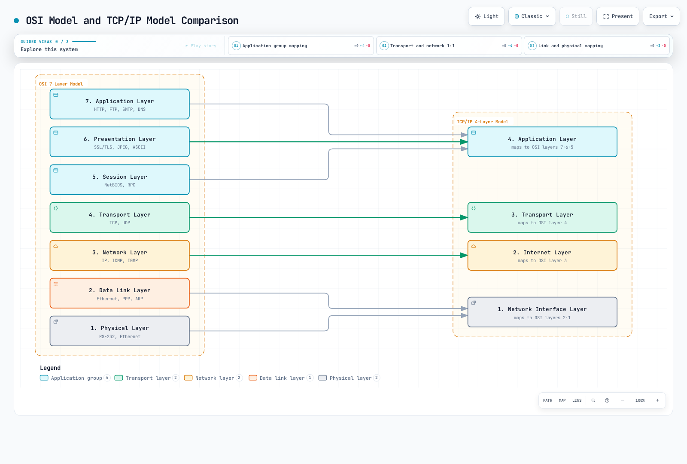

[🔍 View interactive diagram](https://www.atomai.click/kubernetes-docs/archmaps/en-networking-cilium-networking-concepts-0.html)

### OSI 7-Layer Model

1. **Physical Layer**
   - Converts bit streams into electrical, optical, or wireless signals
   - Includes physical devices such as cables, switches, and hubs
   - Data unit: Bit

2. **Data Link Layer**
   - Responsible for data transfer between nodes on a physical network
   - Device identification using MAC (Media Access Control) addresses
   - Error detection and correction
   - Data unit: Frame
   - Ethernet and Wi-Fi protocols operate at this layer

3. **Network Layer**
   - Responsible for packet routing between different networks
   - Logical addressing (IP addresses)
   - Path determination and packet forwarding
   - Data unit: Packet
   - IP (Internet Protocol) is the core protocol of this layer

4. **Transport Layer**
   - End-to-end communication control
   - Data segmentation and reassembly
   - Flow control and error recovery
   - Data unit: Segment
   - TCP (Transmission Control Protocol) and UDP (User Datagram Protocol) are the main protocols of this layer

5. **Session Layer**
   - Establishment, maintenance, and termination of communication sessions
   - Synchronization and dialog control
   - Checkpoint setting and recovery
   - NetBIOS and RPC (Remote Procedure Call) are examples of this layer

6. **Presentation Layer**
   - Data format conversion and encryption
   - Character encoding, data compression, encryption/decryption
   - SSL/TLS, JPEG, ASCII are examples of this layer

7. **Application Layer**
   - Provides user interface and application services
   - Services such as email, file transfer, web browsing
   - HTTP, FTP, SMTP, DNS are examples of this layer

### Relationship Between Cilium and OSI Model

Cilium operates at multiple OSI layers:

| OSI Layer | Cilium Feature | Example |
|-----------|----------------|---------|
| L2 (Data Link) | ARP handling, MAC filtering | MAC address verification between nodes |
| L3 (Network) | IP routing, CIDR-based policy | IP routing between pods |
| L4 (Transport) | Port-based filtering, connection tracking | Service port access control |
| L7 (Application) | HTTP, gRPC, Kafka filtering | API path-based access control |

### TCP/IP Stack

The TCP/IP stack is a set of protocols that form the foundation of the Internet, a simplified 4-layer model of the OSI model.

1. **Network Interface Layer**
   - Corresponds to the Physical and Data Link layers of the OSI model
   - Responsible for interface with physical network media
   - Includes protocols like Ethernet and Wi-Fi

2. **Internet Layer**
   - Corresponds to the Network layer of the OSI model
   - Packet routing using IP (Internet Protocol)
   - Includes ICMP (Internet Control Message Protocol) and ARP (Address Resolution Protocol)

3. **Transport Layer**
   - Same as the Transport layer of the OSI model
   - Includes TCP and UDP protocols
   - Provides connection-oriented (TCP) and connectionless (UDP) communication

4. **Application Layer**
   - Integrates the Session, Presentation, and Application layers of the OSI model
   - Includes protocols like HTTP, SMTP, FTP, DNS
   - Provides interface between user applications and the network

### Cilium Features by Layer

Cilium provides features at various network layers:

- **L2 (Data Link Layer)**: MAC address-based filtering, ARP spoofing prevention
- **L3 (Network Layer)**: IP address-based routing and filtering, IPAM
- **L4 (Transport Layer)**: Port-based filtering, load balancing, connection tracking
- **L7 (Application Layer)**: Protocol-aware filtering and load balancing for HTTP, gRPC, Kafka, etc.

## Container Networking Basics

Container networking is a mechanism that allows containerized applications to communicate with each other and with the outside world. Container orchestration platforms like Kubernetes use various networking models and solutions.

### Container Network Interface (CNI)

CNI (Container Network Interface) defines a standard interface between container runtimes and network plugins. This allows various networking solutions to be integrated into container platforms.

#### Key Components of CNI:

1. **Plugins**: Executables responsible for creating and configuring network interfaces
2. **Configuration Files**: JSON format files that define plugin behavior
3. **IPAM (IP Address Management)**: Module responsible for IP address allocation and management

#### Main Responsibilities of CNI Plugins:

- Adding/removing interfaces to/from container network namespaces
- Allocating and releasing IP addresses
- Configuring routing tables
- Applying network policies

### Container Networking Models

There are several container networking models, each suitable for different use cases and requirements.

#### 1. Bridge Networking

- Creates a virtual bridge on the host to connect containers
- Each container connects to the bridge through virtual ethernet (veth) pairs
- Efficient communication between containers on the same host
- Default networking mode for Docker

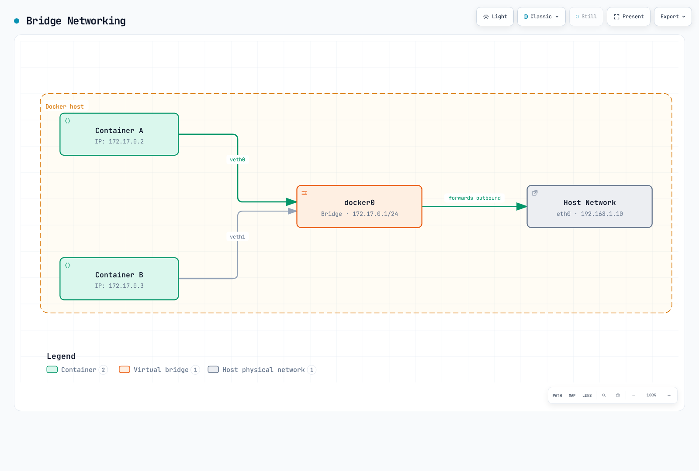

[🔍 View interactive diagram](https://www.atomai.click/kubernetes-docs/archmaps/en-networking-cilium-networking-concepts-1.html)

#### 2. Host Networking

- Container directly uses the host's network namespace
- No separate network isolation
- Provides best network performance
- Potential for port conflicts

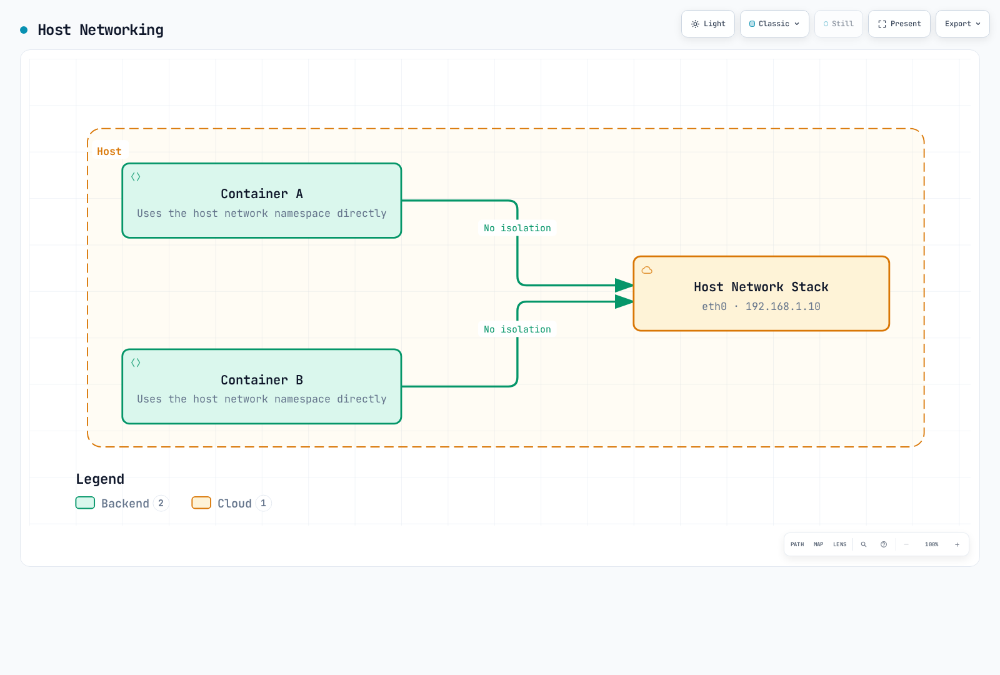

[🔍 View interactive diagram](https://www.atomai.click/kubernetes-docs/archmaps/en-networking-cilium-networking-concepts-2.html)

#### 3. Overlay Networking

- Supports communication between containers across multiple hosts
- Uses encapsulation protocols like VXLAN and GENEVE
- Suitable for large-scale clusters
- Supported by Cilium, Calico, Flannel, etc.


[🔍 View interactive diagram](https://www.atomai.click/kubernetes-docs/archmaps/en-networking-cilium-networking-concepts-3.html)

#### 4. Underlay Networking (Direct Routing)

- Directly utilizes physical network infrastructure
- No encapsulation overhead
- Requires control over network infrastructure
- Can integrate with routing protocols like BGP

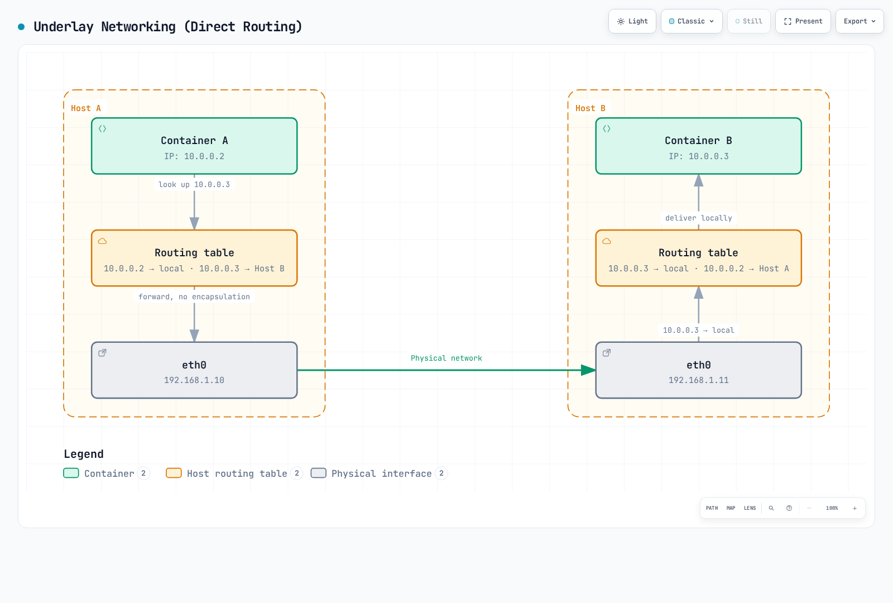

[🔍 View interactive diagram](https://www.atomai.click/kubernetes-docs/archmaps/en-networking-cilium-networking-concepts-4.html)

### Kubernetes Networking Model

Kubernetes has a fundamental requirement that all pods must be able to communicate with each other without NAT. To achieve this, it defines the following networking model:

1. **Pod-to-Pod Communication**: All pods must be able to communicate with each other without NAT
2. **Node-to-Pod Communication**: Nodes must be able to communicate with all pods without NAT
3. **Pod-to-External Communication**: Pods must be able to communicate with external networks (typically using NAT)

#### Kubernetes Network Components:

1. **Pod Network**: Network connecting all pods in the cluster
2. **Service Network**: Provides stable endpoints for sets of pods
3. **Cluster DNS**: DNS service for service discovery
4. **Ingress/Egress**: Manages communication with outside the cluster

### Cilium's Container Networking Approach

Cilium leverages eBPF to provide a high-performance, scalable container networking solution:

1. **eBPF-based Data Path**: Direct packet processing within the kernel
2. **Support for Various Networking Modes**: Overlay (VXLAN, Geneve) and underlay (direct routing)
3. **Advanced Load Balancing**: kube-proxy replacement functionality
4. **Network Policies**: Granular policies at L3-L7 levels
5. **Integrated IPAM**: Support for various IP address allocation strategies

## Overlay Networks

Overlay networks are a technology that builds a virtual network layer on top of existing network infrastructure. This technology allows virtual network topologies to be created independently of physical network topology. In container environments, it is widely used to enable communication between containers across multiple hosts.

### How Overlay Networks Work

Overlay networks work using encapsulation technology. Original packets are encapsulated inside other packets and transmitted through the physical network.

1. **Packet Encapsulation**: The original packet (inner packet) is wrapped with new headers and sometimes new trailers.
2. **Tunneling**: Encapsulated packets are transmitted through the physical network to the destination host.
3. **Packet Decapsulation**: At the destination host, the outer header is removed and the original packet is extracted.
4. **Packet Forwarding**: The original packet is forwarded to the destination container.

### Major Overlay Network Protocols

#### VXLAN (Virtual Extensible LAN)

VXLAN is one of the most widely used overlay protocols in container networking.

- **VXLAN Tunnel Endpoint (VTEP)**: Responsible for encapsulation and decapsulation of packets
- **VXLAN Network Identifier (VNI)**: Supports up to 16,777,216 virtual networks
- **UDP Encapsulation**: VXLAN packets are transmitted via UDP port 4789
- **MAC-in-UDP Encapsulation**: Encapsulates original L2 frames into UDP packets

VXLAN Packet Structure:

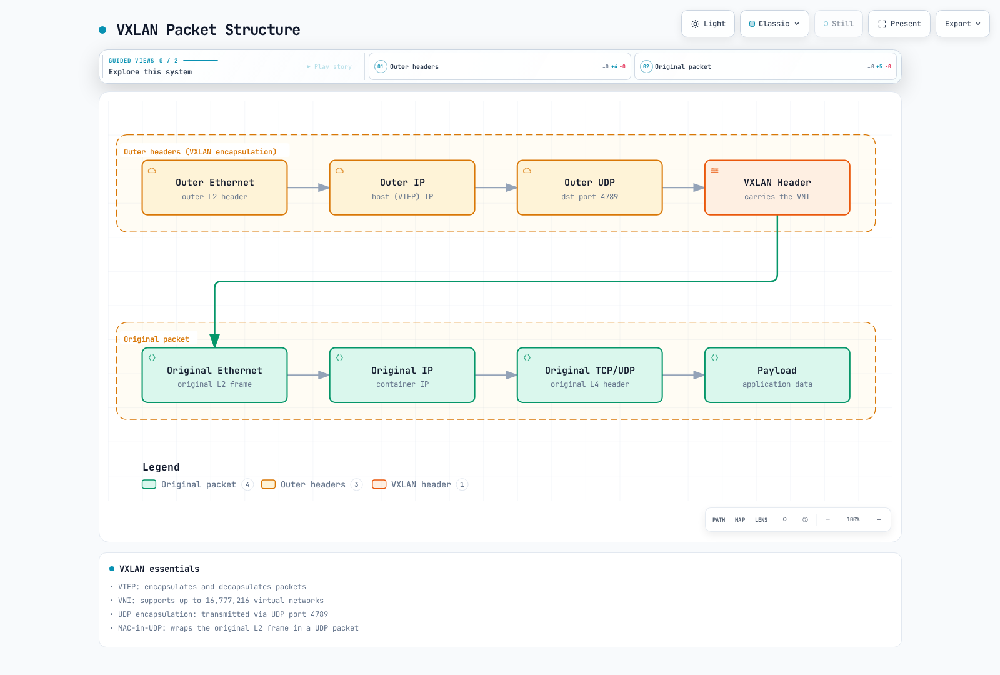

[🔍 View interactive diagram](https://www.atomai.click/kubernetes-docs/archmaps/en-networking-cilium-networking-concepts-5.html)

#### GENEVE (Generic Network Virtualization Encapsulation)

GENEVE is a more flexible overlay protocol designed to overcome VXLAN limitations.

- **Extensible Option Headers**: Supports various metadata
- **Protocol Independent**: Can be used with various virtualization technologies
- **UDP Encapsulation**: Transmitted via UDP port 6081
- **Flexible Tunneling**: Supports various network virtualization requirements

#### IPsec

IPsec is a protocol suite that provides security services at the IP packet level.

- **Authentication and Encryption**: Ensures data integrity and confidentiality
- **Transport and Tunnel Modes**: Supports various deployment scenarios
- **Security Association (SA)**: Defines security parameters between communicating parties
- **Internet Key Exchange (IKE)**: Automates security key management

### Advantages and Disadvantages of Overlay Networks

#### Advantages:

- **Flexibility**: Can configure virtual networks independently of physical network topology
- **Scalability**: Supports large network segments and numerous endpoints
- **Isolation**: Provides network isolation between different tenants or applications
- **Compatibility**: Can work with existing network infrastructure

#### Disadvantages:

- **Overhead**: Increased packet size and processing overhead due to encapsulation
- **MTU Considerations**: Reduced Maximum Transmission Unit (MTU) due to encapsulation
- **Complexity**: Troubleshooting and debugging can be more complex
- **Latency**: Slight latency added during encapsulation and decapsulation

### Overlay Networks in Cilium

Cilium supports overlay protocols like VXLAN and Geneve, leveraging eBPF to provide efficient packet processing.

- **eBPF-based VXLAN Processing**: Direct packet encapsulation and decapsulation within the kernel
- **Efficient Routing**: Packet forwarding through optimized paths
- **Encryption Options**: Encrypted overlay via IPsec or WireGuard
- **Hybrid with Direct Routing**: Can combine overlay and direct routing as needed

#### Cilium VXLAN Configuration Example:

```yaml
apiVersion: v1
kind: ConfigMap
metadata:
  name: cilium-config
  namespace: kube-system
data:
  tunnel: "vxlan"
  enable-ipv4: "true"
  enable-ipv6: "false"
  ipv4-range: "10.0.0.0/16"
  ipv4-tunnel-endpoint-selector: "kubernetes.io/hostname"
```

## Network Address Translation (NAT)

Network Address Translation (NAT) is the process of modifying the source or destination addresses of IP packets. NAT is primarily used to enable devices on private networks to communicate with the public internet, or to enable communication between two networks with overlapping network address spaces.

### Main Types of NAT

#### 1. Source NAT (SNAT)

Source NAT modifies the source IP address of packets. It is typically used when devices on private networks access the internet.

- **How It Works**: Translates the private IP address of internal hosts to a public IP address
- **Use Cases**: Internet access, outbound connections
- **Tracking**: Stores connection state in NAT table

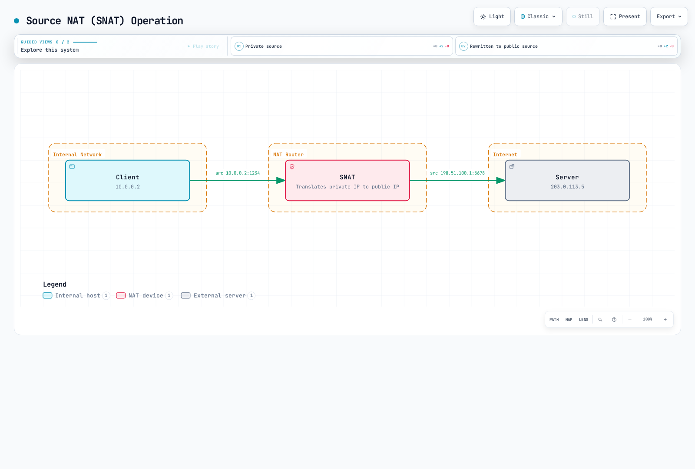

[🔍 View interactive diagram](https://www.atomai.click/kubernetes-docs/archmaps/en-networking-cilium-networking-concepts-6.html)

#### 2. Destination NAT (DNAT)

Destination NAT modifies the destination IP address of packets. It is typically used when accessing services on private networks from the public internet.

- **How It Works**: Translates public IP addresses to private IP addresses of internal hosts
- **Use Cases**: Port forwarding, load balancing, inbound connections
- **Configuration**: Defines mappings for specific ports or port ranges

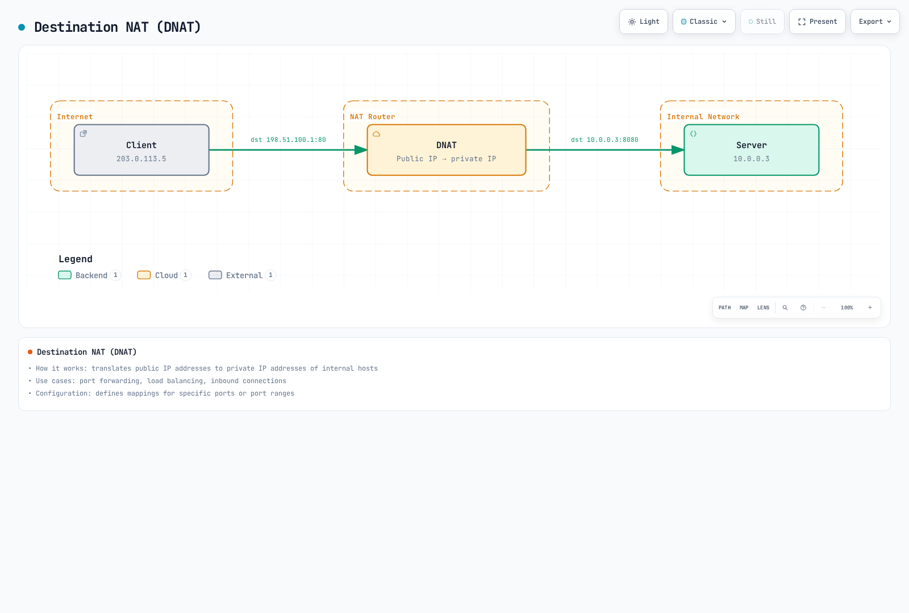

[🔍 View interactive diagram](https://www.atomai.click/kubernetes-docs/archmaps/en-networking-cilium-networking-concepts-7.html)

#### 3. Port Address Translation (PAT)

PAT modifies both IP addresses and port numbers. This allows multiple internal hosts to share a single public IP address.

- **How It Works**: Translates IP:port combinations of internal hosts to different ports of a single public IP
- **Use Cases**: IP address conservation, support for many internal hosts
- **Limitations**: Limited by the number of available ports (approximately 65,000)

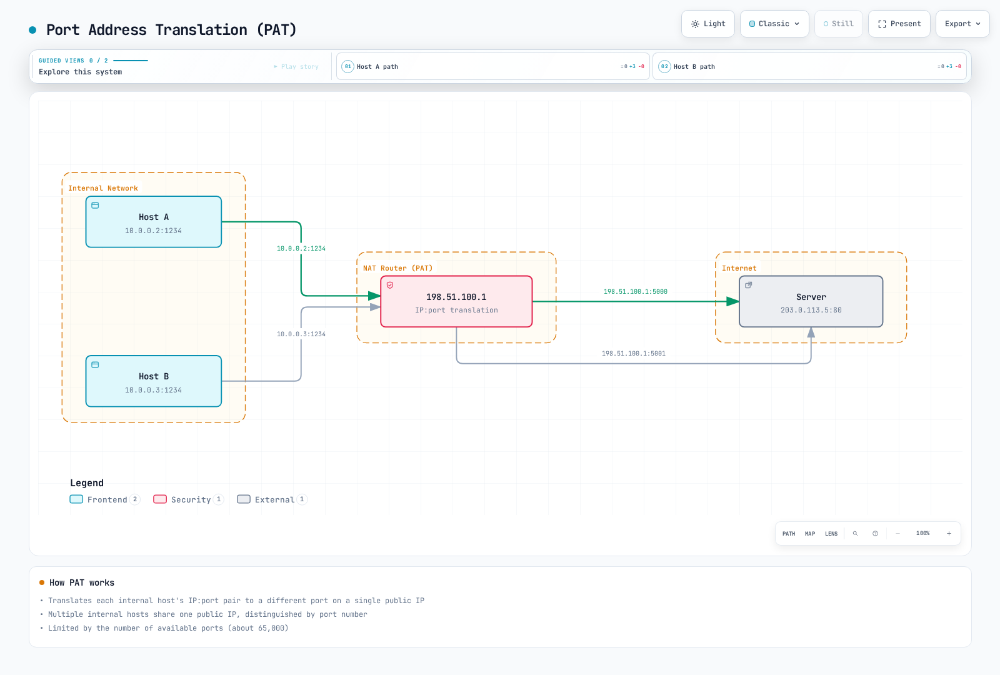

[🔍 View interactive diagram](https://www.atomai.click/kubernetes-docs/archmaps/en-networking-cilium-networking-concepts-8.html)

#### 4. Bi-directional NAT

Bi-directional NAT modifies both source and destination addresses. This enables communication between two networks with overlapping network address spaces.

- **How It Works**: Address translation in both directions
- **Use Cases**: Network mergers, address space conflict resolution
- **Complexity**: More complex configuration and maintenance

### Advantages and Disadvantages of NAT

#### Advantages:

- **IP Address Conservation**: Supports many internal hosts with a limited number of public IP addresses
- **Enhanced Security**: Hides internal network topology
- **Network Isolation**: Can connect networks with overlapping address spaces
- **Flexible Network Design**: Can change ISP without reconfiguring internal network

#### Disadvantages:

- **Connection Tracking Overhead**: Resources needed for state table maintenance
- **Certain Protocol Issues**: Some protocols may not be compatible with NAT
- **Loss of End-to-End Connectivity**: Difficulty with direct peer-to-peer communication
- **Complex Troubleshooting**: NAT-related problem debugging can be complex

### NAT in Kubernetes and Cilium

#### NAT in Kubernetes

Kubernetes uses NAT in various scenarios:

1. **Communication Outside the Cluster**: SNAT when pods communicate outside the cluster
2. **Service Implementation**: Cluster IP services use DNAT to redirect traffic to pods
3. **NodePort Services**: DNAT from node IP:port to pods
4. **LoadBalancer Services**: DNAT from external load balancer IP to pods

#### NAT in Cilium

Cilium leverages eBPF to provide efficient NAT implementation:

1. **eBPF-based NAT**: Performs NAT directly within the kernel
2. **High-Performance Connection Tracking**: Connection state tracking using optimized BPF maps
3. **NAT Policies**: Can define granular NAT rules
4. **Masquerading**: Automatic SNAT for communication from pods to outside the cluster

#### Cilium NAT Configuration Example:

```yaml
apiVersion: v1
kind: ConfigMap
metadata:
  name: cilium-config
  namespace: kube-system
data:
  # Enable masquerading for communication outside the cluster
  enable-ipv4-masquerade: "true"

  # Use eBPF-based masquerading
  enable-bpf-masquerade: "true"

  # NAT map size setting
  bpf-nat-global-max: "262144"

  # Exclude specific CIDRs from masquerading
  ipv4-masquerade-exclude-cidr: "10.0.0.0/8,172.16.0.0/12,192.168.0.0/16"
```

## Routing Protocols

Routing protocols define the rules and procedures that determine the optimal path for packets to travel from source to destination in a network. These protocols play an important role in adapting to network topology changes, efficiently forwarding traffic, and bypassing network failures.

### Classification of Routing Protocols

#### 1. Interior Gateway Protocols (IGP)

Interior Gateway Protocols are used to exchange routing information within a single Autonomous System (AS).

##### Distance Vector Protocols

- **RIP (Routing Information Protocol)**
  - Uses hop count as metric
  - Maximum 15 hop limit
  - Simple implementation, suitable for small networks
  - Updates entire routing table every 30 seconds

- **EIGRP (Enhanced Interior Gateway Routing Protocol)**
  - Composite metric considering bandwidth, delay, load, reliability
  - Sends only partial updates
  - Fast convergence
  - Cisco proprietary protocol (formerly)

##### Link State Protocols

- **OSPF (Open Shortest Path First)**
  - Calculates shortest path using Dijkstra's algorithm
  - Area-based hierarchy
  - Fast convergence
  - Supports large-scale networks
  - Exchanges topology information through Link State Advertisements (LSAs)

- **IS-IS (Intermediate System to Intermediate System)**
  - Link state protocol similar to OSPF
  - Widely used in large service provider networks
  - Supports multiple network layers
  - Efficient routing updates

#### 2. Exterior Gateway Protocols (EGP)

Exterior Gateway Protocols are used to exchange routing information between different Autonomous Systems.

- **BGP (Border Gateway Protocol)**
  - Core routing protocol of the Internet
  - Path vector protocol
  - Policy-based routing decisions
  - Reliable sessions over TCP
  - Path selection through path attributes (AS path, local preference, etc.)
  - iBGP (internal BGP) and eBGP (external BGP) variants

### Routing Protocols in Container Networking

In container environments, traditional routing protocols are used alongside container-specific routing mechanisms.

#### 1. Container Networking with BGP

BGP is gaining popularity in container networking for the following reasons:

- **Direct Routing**: Routes pod IPs directly without overlay overhead
- **Scalability**: Supports large-scale clusters and multi-cluster environments
- **Existing Network Integration**: Integration with data center network infrastructure
- **High Availability**: Support for multiple paths and fast failover

#### 2. Container Network Routing Mechanisms

- **Host-based Routing**: Each node advertises routing information for its own pod CIDR
- **Centralized Routing**: Controller manages routing decisions centrally
- **Distributed Routing**: Direct routing information exchange between nodes
- **Policy-based Routing**: Routing decisions based on traffic characteristics

### Routing in Cilium

Cilium implements efficient routing using eBPF and supports various routing modes.

#### 1. Native Routing (Direct Routing)

In native routing mode, Cilium routes pod IPs directly without overlay encapsulation.

- **How It Works**: Each node advertises routing information for its pod CIDR
- **Advantages**: No encapsulation overhead, optimal performance
- **Requirements**: Routable network between nodes
- **Use Cases**: Performance-critical workloads, single-subnet clusters

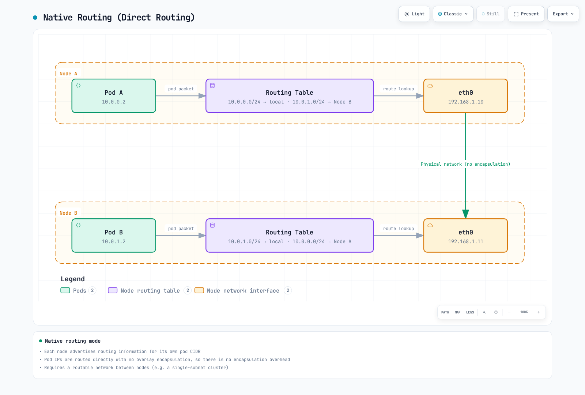

[🔍 View interactive diagram](https://www.atomai.click/kubernetes-docs/archmaps/en-networking-cilium-networking-concepts-9.html)

#### 2. BGP Routing

Cilium supports BGP routing to integrate pod IPs with physical network infrastructure.

- **How It Works**: Cilium advertises pod CIDRs through BGP peering
- **Advantages**: Integration with existing network infrastructure, high availability
- **Components**: BGP peering, route filtering, community attributes
- **Use Cases**: Integration with data center networks, multi-cluster environments

#### 3. Overlay Routing

Cilium can route pod traffic between nodes using overlay protocols like VXLAN or Geneve.

- **How It Works**: Encapsulates pod packets for transmission between nodes
- **Advantages**: Minimizes network infrastructure requirements, flexible deployment
- **Use Cases**: Cloud environments, complex network topologies

#### 4. Hybrid Routing

Cilium supports a hybrid approach combining direct routing and overlay routing.

- **How It Works**: Uses direct routing when possible, overlay otherwise
- **Advantages**: Balance between performance and flexibility
- **Use Cases**: Mixed network environments, cloud and on-premises deployments

### Cilium Routing Configuration Examples

#### Native Routing Configuration:

```yaml
apiVersion: v1
kind: ConfigMap
metadata:
  name: cilium-config
  namespace: kube-system
data:
  tunnel: "disabled"
  enable-auto-direct-node-routes: "true"
  ipv4-native-routing-cidr: "10.0.0.0/16"
```

#### BGP Routing Configuration:

```yaml
apiVersion: v1
kind: ConfigMap
metadata:
  name: cilium-config
  namespace: kube-system
data:
  tunnel: "disabled"
  enable-bgp: "true"
  bgp-announce-pod-cidr: "true"
  bgp-config-path: "/var/lib/cilium/bgp/config.yaml"
```

#### Overlay Routing Configuration:

```yaml
apiVersion: v1
kind: ConfigMap
metadata:
  name: cilium-config
  namespace: kube-system
data:
  tunnel: "vxlan"
  enable-ipv4: "true"
  ipv4-range: "10.0.0.0/16"
```

## DNS and Service Discovery

DNS (Domain Name System) and service discovery play a critical role in modern network applications, especially in dynamic container environments. These mechanisms abstract service locations and allow applications to adapt to network topology changes.

### DNS (Domain Name System)

DNS is a distributed system that translates human-readable domain names into IP addresses.

#### How DNS Works

1. **Hierarchical Namespace**: Domain names are organized in a hierarchical structure separated by dots (e.g., www.example.com)
2. **Distributed Database**: Network of DNS servers distributed worldwide
3. **Iterative and Recursive Queries**: Two main methods of processing client requests
4. **Caching**: Temporary storage of results for performance improvement

#### DNS Record Types

- **A Record**: Maps domain name to IPv4 address
- **AAAA Record**: Maps domain name to IPv6 address
- **CNAME Record**: Alias (canonical name) for domain name
- **MX Record**: Specifies mail server
- **SRV Record**: Specifies server providing specific service
- **TXT Record**: Stores text information (primarily used for verification and policies)
- **PTR Record**: Reverse mapping of IP address to domain name (reverse DNS)

#### DNS Resolution Process

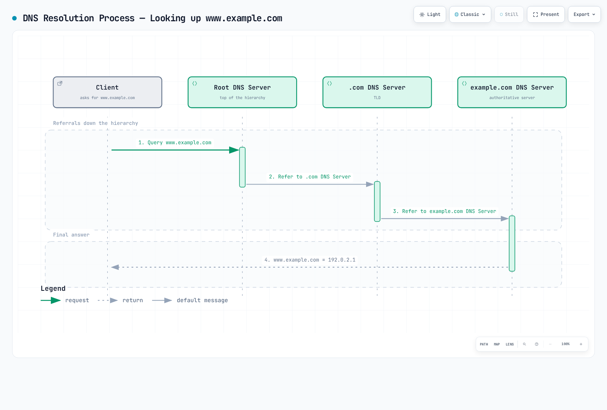

[🔍 View interactive diagram](https://www.atomai.click/kubernetes-docs/archmaps/en-networking-cilium-networking-concepts-10.html)

### Service Discovery in Container Environments

Service discovery is the process of automatically detecting available services and locating them on a network. In container environments, it is particularly important for effectively managing dynamically created and removed services.

#### Service Discovery Approaches

1. **DNS-based Service Discovery**
   - Creates DNS records when services are registered
   - Clients discover services through standard DNS lookups
   - Simple and widely supported
   - Examples: Kubernetes DNS, CoreDNS

2. **Key-Value Store-based Service Discovery**
   - Stores service information in centralized key-value stores
   - Clients query the store to discover services
   - Rich metadata support
   - Examples: etcd, Consul, ZooKeeper

3. **API-based Service Discovery**
   - Provides service information through dedicated APIs
   - Clients call APIs to discover services
   - Complex querying and filtering support
   - Example: Kubernetes API Server

4. **Mesh-based Service Discovery**
   - Service mesh infrastructure handles service discovery
   - Supports client-side load balancing and routing
   - Advanced traffic management features
   - Examples: Istio, Linkerd

### DNS and Service Discovery in Kubernetes

Kubernetes provides built-in mechanisms for service discovery within the cluster.

#### Kubernetes Services

Kubernetes Services provide stable endpoints for sets of pods:

- **ClusterIP**: Virtual IP accessible only within the cluster
- **NodePort**: Accessible through specific port on all nodes
- **LoadBalancer**: Accessible through external load balancer
- **ExternalName**: DNS alias for external service

#### Kubernetes DNS

Kubernetes runs a cluster DNS service (typically CoreDNS) to support service discovery:

- **Service DNS**: `<service-name>.<namespace>.svc.cluster.local`
- **Pod DNS**: `<pod-ip>.<namespace>.pod.cluster.local`
- **Headless Services**: Service name resolves to DNS records of all pod IPs

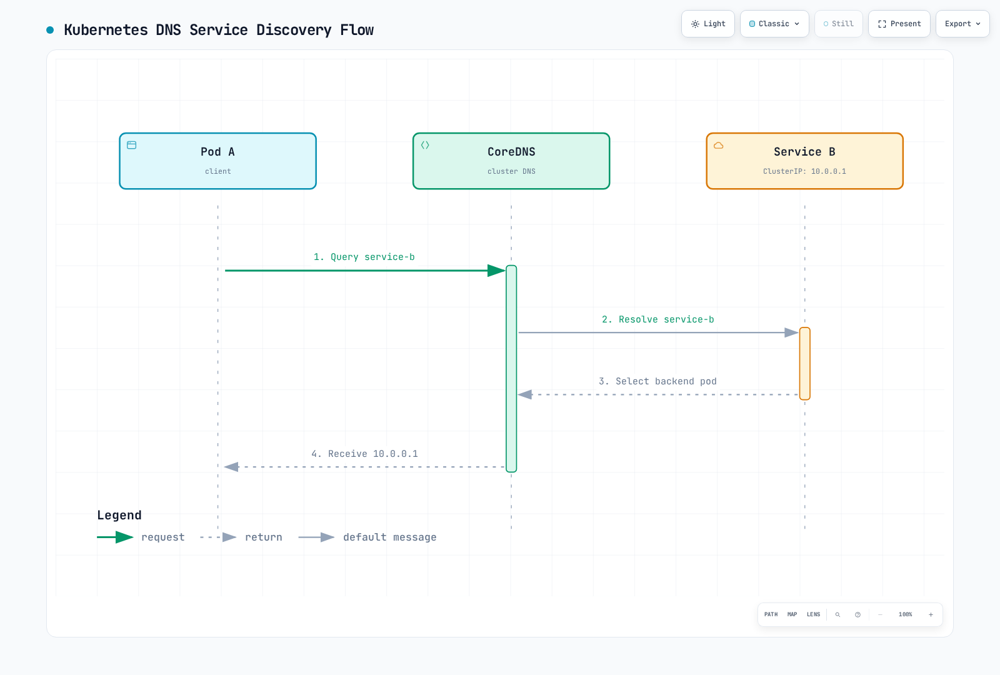

[🔍 View interactive diagram](https://www.atomai.click/kubernetes-docs/archmaps/en-networking-cilium-networking-concepts-11.html)

#### Kubernetes Service Discovery Mechanisms

1. **Environment Variables**: Environment variables for active services are injected into each pod
2. **DNS**: Service name resolution through cluster DNS
3. **API Server**: Retrieve service information by directly querying Kubernetes API
4. **Endpoint Objects**: Provide IP and port information of service backend pods

### DNS and Service Discovery in Cilium

Cilium integrates with Kubernetes service discovery mechanisms and provides additional features.

#### Cilium's DNS-based Policies

Cilium can define network policies based on DNS names:

- **DNS Name-based Filtering**: Access control for specific domain names
- **Wildcard Support**: Pattern matching like `*.example.com`
- **FQDN Policies**: Policies based on Fully Qualified Domain Names (FQDNs)

```yaml
apiVersion: "cilium.io/v2"
kind: CiliumNetworkPolicy
metadata:
  name: "dns-policy"
spec:
  endpointSelector:
    matchLabels:
      app: myapp
  egress:
  - toFQDNs:
    - matchName: "api.example.com"
    - matchPattern: "*.api.example.com"
```

#### Cilium's Service Discovery Enhancements

Cilium provides several features that enhance Kubernetes service discovery:

1. **eBPF-based Service Implementation**:
   - kube-proxy replacement
   - Direct service load balancing within the kernel
   - Improved performance and features

2. **Global Services**:
   - Service discovery across multiple clusters
   - Cross-cluster load balancing
   - Unified service namespace

3. **Service Affinity**:
   - Session affinity support
   - Consistent backend selection based on source IP
   - Stateful connection support

4. **Health Check Integration**:
   - Backend health monitoring
   - Automatic removal of unhealthy backends
   - Fast failure detection and recovery

#### Cilium Service Configuration Example:

```yaml
apiVersion: v1
kind: ConfigMap
metadata:
  name: cilium-config
  namespace: kube-system
data:
  # Enable kube-proxy replacement
  enable-k8s-services: "true"
  kube-proxy-replacement: "strict"

  # Enable DNS policy support
  enable-fqdn-filter: "true"

  # Configure service affinity
  enable-session-affinity: "true"

  # Enable global services
  enable-global-services: "true"
```

## Load Balancing Concepts

Load balancing is a technology that distributes network traffic across multiple servers or backend services to optimize resource utilization, increase throughput, reduce latency, and ensure high availability. In container environments, effectively distributing traffic among dynamically changing backend instances is particularly important.

### Types of Load Balancing

#### 1. L4 (Transport Layer) Load Balancing

L4 load balancing distributes traffic based on transport layer information such as IP addresses and port numbers.

- **How It Works**: Routing decisions based on TCP/UDP header information
- **Advantages**: Fast processing, low overhead, can handle encrypted traffic
- **Disadvantages**: Cannot perform advanced routing based on application layer information
- **Use Cases**: TCP/UDP-based services, high-performance requirements

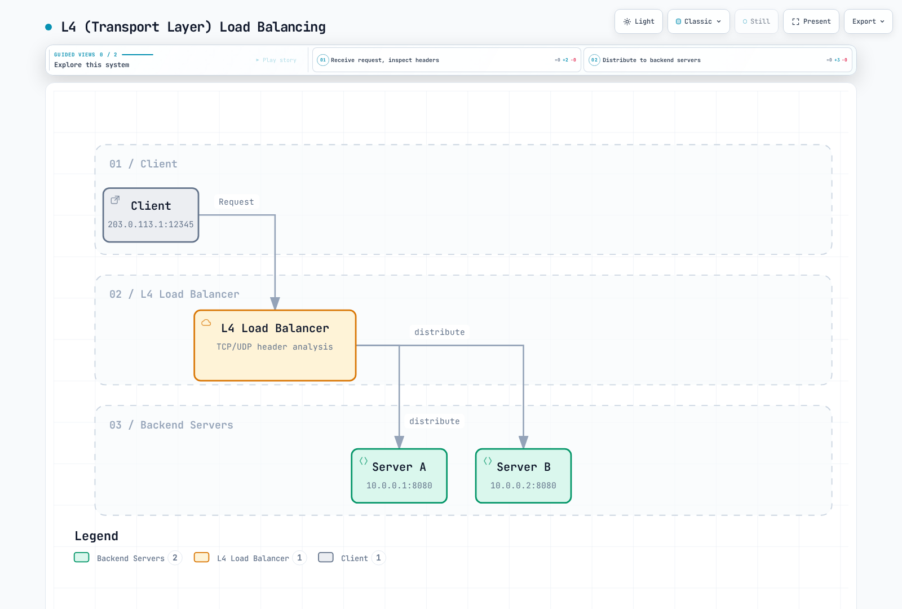

[🔍 View interactive diagram](https://www.atomai.click/kubernetes-docs/archmaps/en-networking-cilium-networking-concepts-12.html)

#### 2. L7 (Application Layer) Load Balancing

L7 load balancing distributes traffic based on application layer information such as HTTP headers, URLs, and cookies.

- **How It Works**: Routing decisions by inspecting HTTP/HTTPS request contents
- **Advantages**: Content-based routing, advanced traffic management, security features
- **Disadvantages**: Higher processing overhead, SSL termination required for encrypted traffic
- **Use Cases**: Web applications, microservices, API gateways

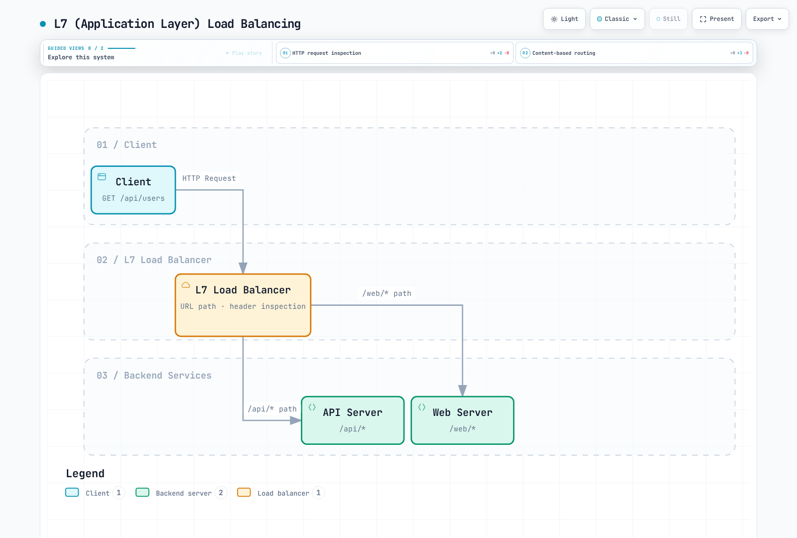

[🔍 View interactive diagram](https://www.atomai.click/kubernetes-docs/archmaps/en-networking-cilium-networking-concepts-13.html)

### Load Balancing Algorithms

Load balancing algorithms determine how traffic is distributed to backend servers.

#### 1. Round Robin

- **How It Works**: Distributes requests to each backend server sequentially
- **Advantages**: Simple implementation, even distribution
- **Disadvantages**: Does not consider server capacity differences or current load
- **Variants**: Weighted Round Robin (applies weights based on server capacity)

#### 2. Least Connections

- **How It Works**: Forwards new requests to server with fewest active connections
- **Advantages**: Considers server load, effective for long connections
- **Disadvantages**: Connection count does not always accurately reflect load
- **Variants**: Weighted Least Connections (applies weights based on server capacity)

#### 3. IP Hash

- **How It Works**: Hashes client IP address for consistent backend server selection
- **Advantages**: Provides session persistence, same client routed to same server
- **Disadvantages**: Possible uneven distribution, potential overload on specific servers
- **Variants**: Source-Destination IP Hash (considers both source and destination IPs)

#### 4. Least Response Time

- **How It Works**: Forwards requests to server with shortest response time
- **Advantages**: Considers performance and availability, suitable for latency-sensitive applications
- **Disadvantages**: Response time measurement overhead, affected by network variability
- **Variants**: Weighted Response Time (considers both server capacity and response time)

#### 5. Random Selection

- **How It Works**: Randomly selects backend server
- **Advantages**: Simple implementation, no special state tracking required
- **Disadvantages**: Possible uneven distribution
- **Variants**: Weighted Random Selection (adjusts probability based on server capacity)

### Load Balancer Deployment Models

#### 1. Hardware Load Balancers

- **Characteristics**: Dedicated physical equipment
- **Advantages**: High performance, reliability, dedicated hardware acceleration
- **Disadvantages**: Cost, limited scalability, lack of flexibility
- **Examples**: F5 BIG-IP, Citrix ADC, A10 Networks

#### 2. Software Load Balancers

- **Characteristics**: Software running on general-purpose servers
- **Advantages**: Flexibility, cost efficiency, programmability
- **Disadvantages**: Generally lower performance than hardware load balancers
- **Examples**: NGINX, HAProxy, Envoy

#### 3. Cloud Load Balancers

- **Characteristics**: Services managed by cloud providers
- **Advantages**: Reduced management overhead, auto-scaling, high availability
- **Disadvantages**: Vendor lock-in, limited customization
- **Examples**: AWS ELB/ALB/NLB, Google Cloud Load Balancing, Azure Load Balancer

#### 4. Container-Native Load Balancers

- **Characteristics**: Load balancing optimized for container environments
- **Advantages**: Integration with container orchestration, dynamic service discovery
- **Disadvantages**: Specialized for container environments
- **Examples**: Kubernetes Services, Istio, Cilium

### Load Balancing in Kubernetes

Kubernetes provides multiple levels of load balancing:

#### 1. Service Load Balancing

- **ClusterIP**: Internal cluster load balancing
- **NodePort**: External access through node ports
- **LoadBalancer**: External load balancer provisioning
- **ExternalName**: DNS alias for external services

#### 2. Ingress Controllers

- L7 load balancing and routing
- URL-based routing, SSL termination, authentication
- Various implementations: NGINX, Traefik, HAProxy, Istio

#### 3. Service Mesh

- Advanced traffic management between microservices
- Granular routing, traffic splitting, fault injection
- Examples: Istio, Linkerd, Consul Connect

### Load Balancing in Cilium

Cilium implements efficient load balancing using eBPF:

#### 1. eBPF-based Load Balancing

- **kube-proxy Replacement**: Direct service load balancing within the kernel
- **Performance Improvement**: Reduced latency through network stack bypass
- **Scalability**: Supports large-scale services and endpoints
- **Connection Tracking Optimization**: Efficient state management


[🔍 View interactive diagram](https://www.atomai.click/kubernetes-docs/archmaps/en-networking-cilium-networking-concepts-14.html)

#### 2. Load Balancing Algorithms

Cilium supports various load balancing algorithms:

- **Round Robin**: Default algorithm, even distribution
- **Maglev**: Consistent backend selection based on source IP
- **Session Affinity**: Persistent connections based on client IP
- **Maglev Timeout**: Rebalancing after specified time

#### 3. L7 Load Balancing

Cilium also supports L7 (Application Layer) load balancing:

- **HTTP Header-based Routing**: Routing based on specific header values
- **URL Path-based Routing**: Traffic distribution based on URL patterns
- **gRPC Routing**: Routing based on gRPC methods and metadata
- **Kafka Routing**: Routing based on Kafka topics and message keys

#### 4. Global Service Load Balancing

Cilium supports load balancing across multiple clusters:

- **Cross-cluster Load Balancing**: Traffic distribution among backends across multiple clusters
- **Location-aware Routing**: Backend selection considering latency and location
- **Failover**: Automatic failover during cluster failures

#### Cilium Load Balancing Configuration Example:

```yaml
apiVersion: v1
kind: ConfigMap
metadata:
  name: cilium-config
  namespace: kube-system
data:
  # Enable kube-proxy replacement
  kube-proxy-replacement: "strict"

  # Configure load balancing algorithm
  load-balancing-algorithm: "maglev"
  maglev-hash-seed: "Cilium"
  maglev-table-size: "16381"

  # Configure session affinity
  enable-session-affinity: "true"

  # Enable L7 load balancing
  enable-l7-proxy: "true"
```

## Network Security Basics

Network security is the practice of protecting network infrastructure, applications, and data from unauthorized access, misuse, failure, or modification. In container environments, network security is even more important due to their dynamic and distributed nature.

### Core Network Security Concepts

#### 1. Defense in Depth

Defense in depth is an approach that implements multiple security layers so that the failure of a single security mechanism does not lead to a complete system security breach.

- **Multiple Security Layers**: Protection at network, host, application, and data levels
- **Redundant Controls**: Combination of various security mechanisms
- **Failure Isolation**: Failure in one layer does not affect other layers
- **Threat Detection and Response**: Monitoring and response at each layer

#### 2. Principle of Least Privilege

The principle of least privilege is a security practice that grants users, processes, or applications only the minimum privileges necessary to perform their tasks.

- **Granular Access Control**: Restricting access to only necessary resources
- **Privilege Separation**: Separation of privileges for various functions
- **Default Deny**: Denying all access not explicitly allowed
- **Regular Review**: Regular auditing and adjustment of privileges

#### 3. Network Segmentation

Network segmentation is a technique that divides a network into smaller segments or zones to enhance security and limit lateral movement of threats.

- **Security Zones**: Grouping systems with similar security requirements
- **Microsegmentation**: Granular control at the workload level
- **Perimeter Protection**: Control and monitoring of traffic between zones
- **Threat Isolation**: Limiting the scope of impact of a breach

#### 4. Encryption

Encryption is the process of transforming data so that it cannot be read by unauthorized parties.

- **Encryption in Transit**: Protecting data moving over the network (e.g., TLS/SSL)
- **Encryption at Rest**: Protecting data stored on disk or in databases
- **End-to-End Encryption**: Protecting data across the entire communication path
- **Key Management**: Secure generation, storage, and rotation of encryption keys

### Container Networking Security Threats

Container environments present unique security challenges:

#### 1. Network-based Attacks

- **DDoS (Distributed Denial of Service) Attacks**: Large volumes of traffic to disrupt service availability
- **Port Scanning**: Exploring open ports and vulnerabilities
- **ARP Spoofing**: Manipulating Address Resolution Protocol to intercept network traffic
- **DNS Poisoning**: Redirecting DNS lookups to malicious destinations

#### 2. Application Layer Attacks

- **SQL Injection**: Inserting malicious SQL code
- **XSS (Cross-Site Scripting)**: Inserting client-side scripts
- **CSRF (Cross-Site Request Forgery)**: Performing malicious actions through authenticated users
- **Command Injection**: Malicious input to execute system commands

#### 3. Container-Specific Threats

- **Image Vulnerabilities**: Container images containing vulnerable components
- **Privilege Escalation**: Elevation of privileges from container to host
- **Lateral Movement**: Unauthorized access from one container to another
- **Volume Mount Exploitation**: Access to sensitive host paths

### Network Security Controls

#### 1. Firewalls

Firewalls are network security systems that filter network traffic based on defined security rules.

- **Packet Filtering**: Filtering based on IP addresses, ports, protocols
- **Stateful Inspection**: Context-based decisions tracking connection state
- **Application Layer Filtering**: Understanding and inspecting application protocols
- **Next-Generation Firewalls (NGFW)**: Advanced threat detection and prevention features

#### 2. Intrusion Detection and Prevention Systems (IDS/IPS)

IDS/IPS are systems that monitor network traffic and detect or block malicious activity.

- **Signature-based Detection**: Matching known attack patterns
- **Anomaly Detection**: Identifying activities that deviate from normal behavior
- **Behavior Monitoring**: Analysis of suspicious activity patterns
- **Automated Response**: Real-time response to detected threats

#### 3. Network Policies

Network policies are sets of rules that define allowed communication within a network.

- **Ingress Control**: Restricting incoming traffic
- **Egress Control**: Restricting outgoing traffic
- **Granular Policies**: Communication control at workload level
- **Label-based Policies**: Flexible policy application in dynamic environments

#### 4. Encryption Protocols

Encryption protocols provide secure communication over networks.

- **TLS/SSL**: Protecting web traffic and API communication
- **IPsec**: Network layer encryption
- **WireGuard**: Modern and efficient VPN protocol
- **mTLS (mutual TLS)**: Authentication of both client and server

### Network Security in Kubernetes

Kubernetes provides several mechanisms for network security of containerized applications:

#### 1. Network Policies

Kubernetes Network Policies are specifications that control communication between pods.

- **Pod Selectors**: Selecting pods to which policies apply based on labels
- **Ingress Rules**: Controlling incoming traffic
- **Egress Rules**: Controlling outgoing traffic
- **CIDR-based Rules**: Filtering based on IP ranges

```yaml
apiVersion: networking.k8s.io/v1
kind: NetworkPolicy
metadata:
  name: api-allow
spec:
  podSelector:
    matchLabels:
      app: api
  ingress:
  - from:
    - podSelector:
        matchLabels:
          app: frontend
    ports:
    - protocol: TCP
      port: 8080
  egress:
  - to:
    - podSelector:
        matchLabels:
          app: database
    ports:
    - protocol: TCP
      port: 5432
```

#### 2. Service Mesh Security

Service mesh is an infrastructure layer that manages and protects communication between microservices.

- **mTLS**: Encrypted communication between services
- **Authentication and Authorization**: Service identity verification and access control
- **Traffic Policies**: Granular routing and access control
- **Observability**: Visibility into service-to-service communication

#### 3. Security Contexts

Security contexts define privilege and access control settings for pods and containers.

- **Privilege Restriction**: Running as non-root user
- **Capability Restriction**: Allowing only necessary Linux capabilities
- **Read-only Filesystem**: Immutable container filesystem
- **seccomp and AppArmor**: Restricting system calls and application behavior

### Cilium's Network Security Features

Cilium leverages eBPF to provide powerful network security features:

#### 1. Identity-based Security

Cilium applies security policies based on workload identity rather than IP addresses.

- **Label-based Policies**: Consistent security in dynamic environments
- **Service Account-based Policies**: Access control based on Kubernetes service accounts
- **DNS-based Policies**: Egress control based on FQDNs
- **API-aware Security**: Filtering based on HTTP methods and paths

#### 2. Transparent Encryption

Cilium can encrypt network traffic without application modification.

- **IPsec**: Network layer encryption for inter-node traffic
- **WireGuard**: Modern and efficient encryption protocol
- **Transparent Integration**: Encryption applied without application changes
- **Key Rotation**: Automated encryption key management

#### 3. Threat Detection and Visibility

Cilium provides deep visibility into network activity and threat detection capabilities.

- **Hubble**: Network flow monitoring and analysis
- **Flow Logs**: Detailed logs of pod-to-pod communication
- **Anomaly Detection**: Identifying abnormal network patterns
- **Security Event Alerts**: Alerts for policy violations and attack attempts

#### 4. L3-L7 Policy Enforcement

Cilium provides comprehensive policy enforcement from network layer to application layer.

- **L3/L4 Policies**: IP and port-based filtering
- **L7 HTTP Filtering**: URL, method, header-based control
- **L7 gRPC Filtering**: gRPC method and metadata-based control
- **L7 Kafka Filtering**: Kafka topic and message-based control

#### Cilium Network Security Configuration Example:

```yaml
apiVersion: "cilium.io/v2"
kind: CiliumNetworkPolicy
metadata:
  name: "secure-api"
spec:
  endpointSelector:
    matchLabels:
      app: api
  ingress:
  - fromEndpoints:
    - matchLabels:
        app: frontend
    toPorts:
    - ports:
      - port: "8080"
        protocol: TCP
      rules:
        http:
        - method: "GET"
          path: "/api/v1/products"
  egress:
  - toEndpoints:
    - matchLabels:
        app: database
    toPorts:
    - ports:
      - port: "5432"
        protocol: TCP
  - toFQDNs:
    - matchName: "api.external-service.com"
    toPorts:
    - ports:
      - port: "443"
        protocol: TCP
```

### Network Security Best Practices

#### 1. Default Deny Policy

- Implement default deny policy that only allows explicitly permitted traffic
- Open only necessary communication paths
- Regular policy review and removal of unnecessary rules
- Maintain audit trail for policy changes

#### 2. Defense in Depth Approach

- Implement multiple security layers
- Combine network, host, and application-level protection
- Redundant controls with various security mechanisms
- Eliminate single points of failure

#### 3. Least Privilege Networking

- Allow only minimum necessary network access
- Define granular policies per service
- Block unnecessary ports and protocols
- Regular access review and adjustment

#### 4. Continuous Monitoring and Auditing

- Monitor network traffic and policy violations
- Detect anomalies and potential threats
- Alerts and response to security events
- Regular security audits and vulnerability assessments

## Quiz

To test what you learned in this chapter, try the [Topic Quiz](../../quizzes/networking/cilium/networking-concepts-quiz.md).
