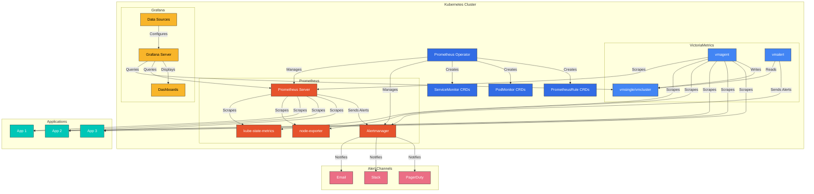
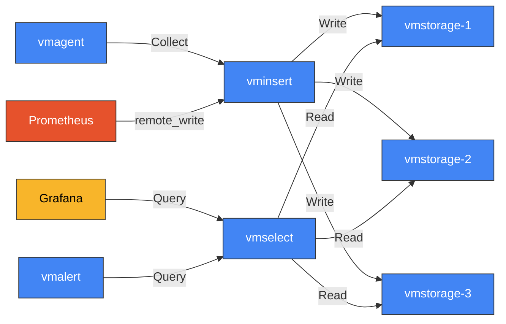
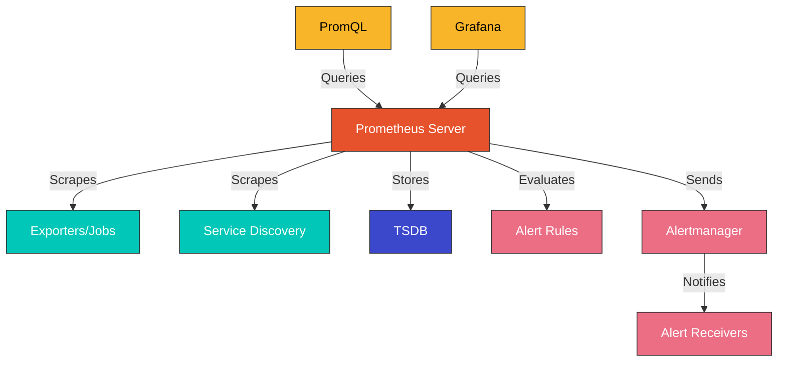
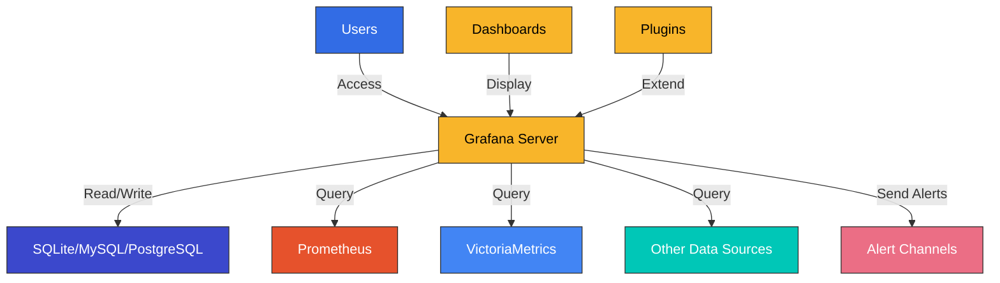

# Monitoring Stack (VictoriaMetrics, Prometheus, Grafana)

## Table of Contents
- [Introduction](#introduction)
- [Architecture](#architecture)
- [VictoriaMetrics](#victoriametrics)
- [Prometheus](#prometheus)
- [Grafana](#grafana)
- [Installation and Configuration](#installation-and-configuration)
- [Metrics Collection](#metrics-collection)
- [Alerting Configuration](#alerting-configuration)
- [Dashboard Configuration](#dashboard-configuration)
- [High Availability Configuration](#high-availability-configuration)
- [Performance Optimization](#performance-optimization)
- [Amazon EKS Integration](#amazon-eks-integration)
- [Best Practices](#best-practices)
- [Troubleshooting](#troubleshooting)
- [Conclusion](#conclusion)

## Introduction

In Kubernetes environments, monitoring is essential for understanding system health, detecting issues early, and optimizing performance. This document explains a monitoring stack composed of VictoriaMetrics, Prometheus, and Grafana. This combination provides a scalable and efficient monitoring solution.

### Importance of Monitoring

Monitoring in Kubernetes environments is important for the following reasons:

1. **Visibility**: Understand and manage the complexity of distributed systems
2. **Issue Detection**: Detect failures and performance issues early
3. **Capacity Planning**: Analyze resource usage trends to predict future requirements
4. **Performance Optimization**: Identify and resolve bottlenecks
5. **Cost Optimization**: Reduce costs through resource usage monitoring
6. **Security Monitoring**: Detect abnormal activities

### Monitoring Stack Components

#### VictoriaMetrics

VictoriaMetrics is a high-performance, cost-effective time series database and monitoring solution. It is compatible with Prometheus while providing better compression and query performance.

Key features:
- High data compression ratio
- Fast query performance
- Horizontal scalability
- Low operational overhead
- Prometheus compatibility

#### Prometheus

Prometheus is an open-source system monitoring and alerting toolkit, specialized in collecting and storing time series data.

Key features:
- Multi-dimensional data model
- Flexible query language (PromQL)
- Pull-based metrics collection
- Service discovery
- Alert management

#### Grafana

Grafana is an open-source platform for visualizing and analyzing metric data.

Key features:
- Support for various data sources
- Rich visualization options
- Dashboard templates
- Alerting capabilities
- User authentication and authorization management

### Comparison with Existing Monitoring Solutions

| Feature | VictoriaMetrics + Prometheus + Grafana | Prometheus + Grafana | CloudWatch | Datadog |
|---------|----------------------------------------|----------------------|------------|---------|
| Scalability | Very High | Medium | High | High |
| Data Compression | Very High | Medium | Low | Medium |
| Query Performance | Very High | Medium | Medium | High |
| Cost | Low (self-hosted) | Low (self-hosted) | Medium-High | High |
| Configuration Complexity | Medium | Low | Low | Low |
| Customization | Very High | High | Medium | Medium |
| Integration | Extensive | Extensive | AWS-centric | Extensive |
| Long-term Data Storage | Efficient | Limited | Cost increases | Cost increases |

## Architecture

The architecture of a monitoring stack composed of VictoriaMetrics, Prometheus, and Grafana is as follows:



### Key Components

1. **Prometheus Operator**: Controller that manages Prometheus instances in Kubernetes
2. **ServiceMonitor/PodMonitor**: Custom resources that define services and pods to monitor
3. **PrometheusRule**: Custom resource that defines alerting rules
4. **Prometheus Server**: Time series database that collects and stores metrics
5. **Alertmanager**: Component that processes and routes alerts
6. **kube-state-metrics**: Generates metrics about Kubernetes API objects
7. **node-exporter**: Collects node-level metrics
8. **VictoriaMetrics**: High-performance time series database
9. **vmagent**: Metrics collection and forwarding
10. **vmalert**: Alert rule evaluation
11. **Grafana**: Metrics visualization and dashboards

### Data Flow

1. **Metrics Collection**: Prometheus or vmagent collects metrics from applications, kube-state-metrics, node-exporter, etc.
2. **Data Storage**: Collected metrics are stored in Prometheus or VictoriaMetrics
3. **Alert Evaluation**: Prometheus or vmalert evaluates alert rules against stored metrics
4. **Alert Processing**: Alertmanager receives alerts and routes them to appropriate channels
5. **Visualization**: Grafana queries data from Prometheus or VictoriaMetrics and displays it on dashboards

## VictoriaMetrics

VictoriaMetrics is a high-performance, cost-effective time series database that is compatible with Prometheus while providing better performance and scalability.

### Key Features

1. **High Data Compression Ratio**: Up to 7x more efficient data compression than Prometheus
2. **Fast Query Performance**: Up to 20x faster performance than Prometheus for complex queries
3. **Horizontal Scalability**: Horizontally scalable in cluster mode
4. **Low Operational Overhead**: Deployable as a single binary
5. **Prometheus Compatibility**: Compatible with Prometheus API and PromQL
6. **Multi-tenancy**: Provides isolated environments for multiple teams or projects
7. **Long-term Data Storage**: Efficient long-term metric storage

### Architecture Options

VictoriaMetrics offers two deployment modes:

#### 1. Single Node Mode (vmsingle)

Single node setup suitable for small to medium deployments:

```yaml
apiVersion: apps/v1
kind: StatefulSet
metadata:
  name: vmsingle
  namespace: monitoring
spec:
  serviceName: "vmsingle"
  replicas: 1
  selector:
    matchLabels:
      app: vmsingle
  template:
    metadata:
      labels:
        app: vmsingle
    spec:
      containers:
      - name: vmsingle
        image: victoriametrics/victoria-metrics:v1.91.3
        args:
          - "--storageDataPath=/storage"
          - "--httpListenAddr=:8428"
          - "--retentionPeriod=1y"
        ports:
        - containerPort: 8428
          name: http
        volumeMounts:
        - name: storage
          mountPath: /storage
  volumeClaimTemplates:
  - metadata:
      name: storage
    spec:
      accessModes: [ "ReadWriteOnce" ]
      resources:
        requests:
          storage: 50Gi
```

#### 2. Cluster Mode (vmcluster)

Scalable cluster setup for large deployments:

- **vminsert**: Metrics collection and distribution
- **vmstorage**: Metrics storage
- **vmselect**: Query processing



```yaml
# vmstorage
apiVersion: apps/v1
kind: StatefulSet
metadata:
  name: vmstorage
  namespace: monitoring
spec:
  serviceName: "vmstorage"
  replicas: 3
  selector:
    matchLabels:
      app: vmstorage
  template:
    metadata:
      labels:
        app: vmstorage
    spec:
      containers:
      - name: vmstorage
        image: victoriametrics/victoria-metrics:v1.91.3
        args:
          - "--storageDataPath=/storage"
          - "--retentionPeriod=1y"
        ports:
        - containerPort: 8482
          name: http
        volumeMounts:
        - name: storage
          mountPath: /storage
  volumeClaimTemplates:
  - metadata:
      name: storage
    spec:
      accessModes: [ "ReadWriteOnce" ]
      resources:
        requests:
          storage: 50Gi
```

### vmagent

vmagent is a lightweight agent that collects metrics and forwards them to VictoriaMetrics:

```yaml
apiVersion: apps/v1
kind: Deployment
metadata:
  name: vmagent
  namespace: monitoring
spec:
  replicas: 2
  selector:
    matchLabels:
      app: vmagent
  template:
    metadata:
      labels:
        app: vmagent
    spec:
      containers:
      - name: vmagent
        image: victoriametrics/vmagent:v1.91.3
        args:
          - "--promscrape.config=/etc/prometheus/prometheus.yml"
          - "--remoteWrite.url=http://vmsingle:8428/api/v1/write"
        volumeMounts:
        - name: config
          mountPath: /etc/prometheus
      volumes:
      - name: config
        configMap:
          name: prometheus-config
```
## Prometheus

Prometheus is an open-source system monitoring and alerting toolkit, specialized in collecting and storing time series data.

### Key Features

1. **Multi-dimensional Data Model**: Time series data labeled with key-value pairs
2. **Flexible Query Language (PromQL)**: Query and aggregate multi-dimensional data in real-time
3. **Pull-based Metrics Collection**: Scrape metrics from targets via HTTP
4. **Service Discovery**: Automatically discover monitoring targets in dynamic environments
5. **Alert Management**: Define alert rules and send notifications
6. **Graphs and Dashboards**: Basic visualization capabilities

### Architecture

The basic architecture of Prometheus is as follows:




### Prometheus Operator

Operator for managing Prometheus in Kubernetes:

```yaml
apiVersion: apps/v1
kind: Deployment
metadata:
  name: prometheus-operator
  namespace: monitoring
spec:
  replicas: 1
  selector:
    matchLabels:
      app: prometheus-operator
  template:
    metadata:
      labels:
        app: prometheus-operator
    spec:
      containers:
      - name: prometheus-operator
        image: quay.io/prometheus-operator/prometheus-operator:v0.59.1
        args:
        - "--kubelet-service=kube-system/kubelet"
        - "--logtostderr=true"
        - "--config-reloader-image=quay.io/prometheus-operator/prometheus-config-reloader:v0.59.1"
        - "--prometheus-config-reloader=quay.io/prometheus-operator/prometheus-config-reloader:v0.59.1"
```

### Prometheus Instance

Prometheus instance managed by Prometheus Operator:

```yaml
apiVersion: monitoring.coreos.com/v1
kind: Prometheus
metadata:
  name: prometheus
  namespace: monitoring
spec:
  replicas: 2
  version: v2.41.0
  serviceAccountName: prometheus
  securityContext:
    fsGroup: 2000
    runAsNonRoot: true
    runAsUser: 1000
  serviceMonitorSelector:
    matchLabels:
      release: prometheus
  podMonitorSelector:
    matchLabels:
      release: prometheus
  ruleSelector:
    matchLabels:
      release: prometheus
  resources:
    requests:
      memory: 400Mi
      cpu: 500m
    limits:
      memory: 2Gi
      cpu: 1000m
  retention: 15d
  storage:
    volumeClaimTemplate:
      spec:
        storageClassName: standard
        resources:
          requests:
            storage: 50Gi
```

### ServiceMonitor

Custom resource for monitoring Kubernetes services:

```yaml
apiVersion: monitoring.coreos.com/v1
kind: ServiceMonitor
metadata:
  name: example-app
  namespace: monitoring
  labels:
    release: prometheus
spec:
  selector:
    matchLabels:
      app: example-app
  endpoints:
  - port: web
    interval: 30s
    path: /metrics
```

### PodMonitor

Custom resource for directly monitoring Kubernetes pods:

```yaml
apiVersion: monitoring.coreos.com/v1
kind: PodMonitor
metadata:
  name: example-app
  namespace: monitoring
  labels:
    release: prometheus
spec:
  selector:
    matchLabels:
      app: example-app
  podMetricsEndpoints:
  - port: metrics
    interval: 30s
```

### PrometheusRule

Custom resource for defining alerting and recording rules:

```yaml
apiVersion: monitoring.coreos.com/v1
kind: PrometheusRule
metadata:
  name: example-rules
  namespace: monitoring
  labels:
    release: prometheus
spec:
  groups:
  - name: example
    rules:
    - alert: HighErrorRate
      expr: sum(rate(http_requests_total{status=~"5.."}[5m])) / sum(rate(http_requests_total[5m])) > 0.1
      for: 10m
      labels:
        severity: critical
      annotations:
        summary: "High error rate detected"
        description: "Error rate is above 10% (current value: {{ $value }})"
```

### Alertmanager

Component for processing and routing alerts:

```yaml
apiVersion: monitoring.coreos.com/v1
kind: Alertmanager
metadata:
  name: alertmanager
  namespace: monitoring
spec:
  replicas: 3
  version: v0.24.0
  serviceAccountName: alertmanager
  securityContext:
    fsGroup: 2000
    runAsNonRoot: true
    runAsUser: 1000
  resources:
    requests:
      memory: 100Mi
      cpu: 100m
    limits:
      memory: 500Mi
      cpu: 200m
  storage:
    volumeClaimTemplate:
      spec:
        storageClassName: standard
        resources:
          requests:
            storage: 5Gi
  alertmanagerConfigSelector:
    matchLabels:
      alertmanagerConfig: alertmanager
```

### AlertmanagerConfig

Alert routing and receiver configuration:

```yaml
apiVersion: monitoring.coreos.com/v1alpha1
kind: AlertmanagerConfig
metadata:
  name: alertmanager-config
  namespace: monitoring
  labels:
    alertmanagerConfig: alertmanager
spec:
  route:
    groupBy: ['alertname', 'job']
    groupWait: 30s
    groupInterval: 5m
    repeatInterval: 12h
    receiver: 'slack'
    routes:
    - matchers:
      - name: severity
        value: critical
      receiver: 'pagerduty'
  receivers:
  - name: 'slack'
    slackConfigs:
    - apiURL:
        key: url
        name: slack-webhook
      channel: '#alerts'
      sendResolved: true
  - name: 'pagerduty'
    pagerdutyConfigs:
    - routingKey:
        key: routingKey
        name: pagerduty-key
      sendResolved: true
```

## Grafana

Grafana is an open-source platform for visualizing and analyzing metric data.

### Key Features

1. **Multiple Data Source Support**: Prometheus, VictoriaMetrics, Elasticsearch, InfluxDB, etc.
2. **Rich Visualization Options**: Graphs, heatmaps, tables, single stats, etc.
3. **Dashboard Templates**: Reusable dashboard templates
4. **Alerting Capabilities**: Metric-based alert configuration
5. **User Authentication and Authorization Management**: Various authentication methods and fine-grained authorization management
6. **Annotations and Event Tracking**: Add annotations to time series data
7. **Plugin System**: Extensible plugin architecture

### Architecture

The basic architecture of Grafana is as follows:



### Deployment

Deploy Grafana to Kubernetes:

```yaml
apiVersion: apps/v1
kind: Deployment
metadata:
  name: grafana
  namespace: monitoring
spec:
  replicas: 1
  selector:
    matchLabels:
      app: grafana
  template:
    metadata:
      labels:
        app: grafana
    spec:
      containers:
      - name: grafana
        image: grafana/grafana:9.3.6
        ports:
        - containerPort: 3000
          name: http
        env:
        - name: GF_SECURITY_ADMIN_USER
          valueFrom:
            secretKeyRef:
              name: grafana-credentials
              key: admin-user
        - name: GF_SECURITY_ADMIN_PASSWORD
          valueFrom:
            secretKeyRef:
              name: grafana-credentials
              key: admin-password
        - name: GF_INSTALL_PLUGINS
          value: "grafana-piechart-panel,grafana-worldmap-panel"
        volumeMounts:
        - name: grafana-storage
          mountPath: /var/lib/grafana
        - name: grafana-datasources
          mountPath: /etc/grafana/provisioning/datasources
        - name: grafana-dashboards
          mountPath: /etc/grafana/provisioning/dashboards
      volumes:
      - name: grafana-storage
        persistentVolumeClaim:
          claimName: grafana-storage
      - name: grafana-datasources
        configMap:
          name: grafana-datasources
      - name: grafana-dashboards
        configMap:
          name: grafana-dashboards
```

### Data Source Configuration

Grafana data source provisioning:

```yaml
apiVersion: v1
kind: ConfigMap
metadata:
  name: grafana-datasources
  namespace: monitoring
data:
  datasources.yaml: |-
    apiVersion: 1
    datasources:
    - name: Prometheus
      type: prometheus
      url: http://prometheus-operated:9090
      access: proxy
      isDefault: true
    - name: VictoriaMetrics
      type: prometheus
      url: http://vmsingle:8428
      access: proxy
```

### Dashboard Provisioning

Grafana dashboard provisioning:

```yaml
apiVersion: v1
kind: ConfigMap
metadata:
  name: grafana-dashboards
  namespace: monitoring
data:
  dashboards.yaml: |-
    apiVersion: 1
    providers:
    - name: 'default'
      orgId: 1
      folder: ''
      type: file
      disableDeletion: false
      updateIntervalSeconds: 30
      options:
        path: /var/lib/grafana/dashboards
```

### Dashboard Example

Dashboard for Kubernetes cluster monitoring:

```yaml
apiVersion: v1
kind: ConfigMap
metadata:
  name: kubernetes-dashboard
  namespace: monitoring
  labels:
    grafana_dashboard: "true"
data:
  kubernetes-dashboard.json: |-
    {
      "annotations": {
        "list": [
          {
            "builtIn": 1,
            "datasource": "-- Grafana --",
            "enable": true,
            "hide": true,
            "iconColor": "rgba(0, 211, 255, 1)",
            "name": "Annotations & Alerts",
            "type": "dashboard"
          }
        ]
      },
      "editable": true,
      "gnetId": null,
      "graphTooltip": 0,
      "id": 1,
      "links": [],
      "panels": [
        {
          "aliasColors": {},
          "bars": false,
          "dashLength": 10,
          "dashes": false,
          "datasource": "Prometheus",
          "fill": 1,
          "fillGradient": 0,
          "gridPos": {
            "h": 8,
            "w": 12,
            "x": 0,
            "y": 0
          },
          "hiddenSeries": false,
          "id": 2,
          "legend": {
            "avg": false,
            "current": false,
            "max": false,
            "min": false,
            "show": true,
            "total": false,
            "values": false
          },
          "lines": true,
          "linewidth": 1,
          "nullPointMode": "null",
          "options": {
            "dataLinks": []
          },
          "percentage": false,
          "pointradius": 2,
          "points": false,
          "renderer": "flot",
          "seriesOverrides": [],
          "spaceLength": 10,
          "stack": false,
          "steppedLine": false,
          "targets": [
            {
              "expr": "sum(rate(container_cpu_usage_seconds_total{container!=\"\"}[5m])) by (namespace)",
              "refId": "A"
            }
          ],
          "thresholds": [],
          "timeFrom": null,
          "timeRegions": [],
          "timeShift": null,
          "title": "CPU Usage by Namespace",
          "tooltip": {
            "shared": true,
            "sort": 0,
            "value_type": "individual"
          },
          "type": "graph",
          "xaxis": {
            "buckets": null,
            "mode": "time",
            "name": null,
            "show": true,
            "values": []
          },
          "yaxes": [
            {
              "format": "short",
              "label": null,
              "logBase": 1,
              "max": null,
              "min": null,
              "show": true
            },
            {
              "format": "short",
              "label": null,
              "logBase": 1,
              "max": null,
              "min": null,
              "show": true
            }
          ],
          "yaxis": {
            "align": false,
            "alignLevel": null
          }
        }
      ],
      "schemaVersion": 22,
      "style": "dark",
      "tags": [],
      "templating": {
        "list": []
      },
      "time": {
        "from": "now-6h",
        "to": "now"
      },
      "timepicker": {},
      "timezone": "",
      "title": "Kubernetes Dashboard",
      "uid": "kubernetes",
      "version": 1
    }
```
## Installation and Configuration

### Prerequisites

- Kubernetes cluster (v1.16 or higher)
- kubectl configured
- Helm 3
- Sufficient cluster resources (CPU, memory, storage)

### Installation Using Helm

#### 1. Installing kube-prometheus-stack

kube-prometheus-stack is a Helm chart that includes Prometheus, Alertmanager, Grafana, and related components:

```bash
# Add Helm repository
helm repo add prometheus-community https://prometheus-community.github.io/helm-charts
helm repo update

# Install kube-prometheus-stack
helm install prometheus prometheus-community/kube-prometheus-stack \
  --namespace monitoring \
  --create-namespace \
  --set prometheus.prometheusSpec.retention=15d \
  --set prometheus.prometheusSpec.storageSpec.volumeClaimTemplate.spec.storageClassName=standard \
  --set prometheus.prometheusSpec.storageSpec.volumeClaimTemplate.spec.resources.requests.storage=50Gi \
  --set grafana.persistence.enabled=true \
  --set grafana.persistence.storageClassName=standard \
  --set grafana.persistence.size=10Gi
```

#### 2. Installing VictoriaMetrics

```bash
# Add Helm repository
helm repo add vm https://victoriametrics.github.io/helm-charts/
helm repo update

# Install VictoriaMetrics single node
helm install victoria-metrics vm/victoria-metrics-single \
  --namespace monitoring \
  --set server.persistentVolume.enabled=true \
  --set server.persistentVolume.storageClass=standard \
  --set server.persistentVolume.size=50Gi \
  --set server.retentionPeriod=1y
```

#### 3. Installing vmagent

```bash
# Install vmagent
helm install vmagent vm/victoria-metrics-agent \
  --namespace monitoring \
  --set remoteWriteUrls[0]=http://victoria-metrics-single-server:8428/api/v1/write
```

### Installation Using Manifests

#### 1. Create Namespace

```yaml
apiVersion: v1
kind: Namespace
metadata:
  name: monitoring
```

#### 2. Install Prometheus Operator

```yaml
apiVersion: apps/v1
kind: Deployment
metadata:
  name: prometheus-operator
  namespace: monitoring
  labels:
    app: prometheus-operator
spec:
  replicas: 1
  selector:
    matchLabels:
      app: prometheus-operator
  template:
    metadata:
      labels:
        app: prometheus-operator
    spec:
      serviceAccountName: prometheus-operator
      containers:
      - name: prometheus-operator
        image: quay.io/prometheus-operator/prometheus-operator:v0.59.1
        args:
        - "--kubelet-service=kube-system/kubelet"
        - "--logtostderr=true"
        - "--config-reloader-image=quay.io/prometheus-operator/prometheus-config-reloader:v0.59.1"
        - "--prometheus-config-reloader=quay.io/prometheus-operator/prometheus-config-reloader:v0.59.1"
        ports:
        - containerPort: 8080
          name: http
        resources:
          limits:
            cpu: 200m
            memory: 200Mi
          requests:
            cpu: 100m
            memory: 100Mi
        securityContext:
          allowPrivilegeEscalation: false
```

#### 3. Install Prometheus Instance

```yaml
apiVersion: monitoring.coreos.com/v1
kind: Prometheus
metadata:
  name: prometheus
  namespace: monitoring
spec:
  replicas: 2
  version: v2.41.0
  serviceAccountName: prometheus
  securityContext:
    fsGroup: 2000
    runAsNonRoot: true
    runAsUser: 1000
  serviceMonitorSelector:
    matchLabels:
      release: prometheus
  podMonitorSelector:
    matchLabels:
      release: prometheus
  ruleSelector:
    matchLabels:
      release: prometheus
  resources:
    requests:
      memory: 400Mi
      cpu: 500m
    limits:
      memory: 2Gi
      cpu: 1000m
  retention: 15d
  storage:
    volumeClaimTemplate:
      spec:
        storageClassName: standard
        resources:
          requests:
            storage: 50Gi
```

#### 4. Install VictoriaMetrics

```yaml
apiVersion: apps/v1
kind: StatefulSet
metadata:
  name: vmsingle
  namespace: monitoring
spec:
  serviceName: "vmsingle"
  replicas: 1
  selector:
    matchLabels:
      app: vmsingle
  template:
    metadata:
      labels:
        app: vmsingle
    spec:
      containers:
      - name: vmsingle
        image: victoriametrics/victoria-metrics:v1.91.3
        args:
          - "--storageDataPath=/storage"
          - "--httpListenAddr=:8428"
          - "--retentionPeriod=1y"
        ports:
        - containerPort: 8428
          name: http
        volumeMounts:
        - name: storage
          mountPath: /storage
        resources:
          requests:
            cpu: 500m
            memory: 1Gi
          limits:
            cpu: 2000m
            memory: 4Gi
  volumeClaimTemplates:
  - metadata:
      name: storage
    spec:
      accessModes: [ "ReadWriteOnce" ]
      storageClassName: standard
      resources:
        requests:
          storage: 50Gi
```

#### 5. Install Grafana

```yaml
apiVersion: apps/v1
kind: Deployment
metadata:
  name: grafana
  namespace: monitoring
spec:
  replicas: 1
  selector:
    matchLabels:
      app: grafana
  template:
    metadata:
      labels:
        app: grafana
    spec:
      containers:
      - name: grafana
        image: grafana/grafana:9.3.6
        ports:
        - containerPort: 3000
          name: http
        env:
        - name: GF_SECURITY_ADMIN_USER
          valueFrom:
            secretKeyRef:
              name: grafana-credentials
              key: admin-user
        - name: GF_SECURITY_ADMIN_PASSWORD
          valueFrom:
            secretKeyRef:
              name: grafana-credentials
              key: admin-password
        volumeMounts:
        - name: grafana-storage
          mountPath: /var/lib/grafana
        - name: grafana-datasources
          mountPath: /etc/grafana/provisioning/datasources
        - name: grafana-dashboards
          mountPath: /etc/grafana/provisioning/dashboards
        resources:
          requests:
            cpu: 100m
            memory: 256Mi
          limits:
            cpu: 500m
            memory: 1Gi
      volumes:
      - name: grafana-storage
        persistentVolumeClaim:
          claimName: grafana-storage
      - name: grafana-datasources
        configMap:
          name: grafana-datasources
      - name: grafana-dashboards
        configMap:
          name: grafana-dashboards
```

## Metrics Collection

### Default Metrics

Metrics collected by default in a Kubernetes cluster:

1. **Node Metrics**: CPU, memory, disk, network usage
2. **Pod Metrics**: CPU, memory usage, network I/O
3. **Container Metrics**: CPU, memory usage
4. **API Server Metrics**: Request count, latency, error rate
5. **etcd Metrics**: Write/read latency, leader changes
6. **kubelet Metrics**: Pod start latency, container operations

### Application Metrics

How to expose Prometheus metrics from applications:

#### 1. Go Application

```go
package main

import (
    "net/http"
    "github.com/prometheus/client_golang/prometheus"
    "github.com/prometheus/client_golang/prometheus/promhttp"
)

func main() {
    // Define counter metric
    httpRequestsTotal := prometheus.NewCounterVec(
        prometheus.CounterOpts{
            Name: "http_requests_total",
            Help: "Total number of HTTP requests",
        },
        []string{"method", "endpoint", "status"},
    )

    // Define histogram metric
    httpRequestDuration := prometheus.NewHistogramVec(
        prometheus.HistogramOpts{
            Name:    "http_request_duration_seconds",
            Help:    "HTTP request duration in seconds",
            Buckets: prometheus.DefBuckets,
        },
        []string{"method", "endpoint"},
    )

    // Register metrics
    prometheus.MustRegister(httpRequestsTotal)
    prometheus.MustRegister(httpRequestDuration)

    // Expose metrics endpoint
    http.Handle("/metrics", promhttp.Handler())
    http.ListenAndServe(":8080", nil)
}
```

#### 2. Python Application

```python
from prometheus_client import Counter, Histogram, start_http_server
import time
import random

# Define counter metric
http_requests_total = Counter(
    'http_requests_total',
    'Total number of HTTP requests',
    ['method', 'endpoint', 'status']
)

# Define histogram metric
http_request_duration_seconds = Histogram(
    'http_request_duration_seconds',
    'HTTP request duration in seconds',
    ['method', 'endpoint']
)

# Start metrics endpoint
start_http_server(8000)

# Generate sample metrics
while True:
    # Increment request counter
    http_requests_total.labels(
        method='GET',
        endpoint='/api/v1/users',
        status='200'
    ).inc()

    # Record request latency
    with http_request_duration_seconds.labels(
        method='GET',
        endpoint='/api/v1/users'
    ).time():
        # Simulate request processing
        time.sleep(random.uniform(0.1, 0.5))

    time.sleep(1)
```

#### 3. Java Application (Spring Boot)

```java
import io.micrometer.core.instrument.Counter;
import io.micrometer.core.instrument.MeterRegistry;
import io.micrometer.prometheus.PrometheusMeterRegistry;
import org.springframework.boot.SpringApplication;
import org.springframework.boot.autoconfigure.SpringBootApplication;
import org.springframework.web.bind.annotation.GetMapping;
import org.springframework.web.bind.annotation.RestController;

@SpringBootApplication
public class Application {
    public static void main(String[] args) {
        SpringApplication.run(Application.class, args);
    }
}

@RestController
public class ExampleController {
    private final Counter requestCounter;

    public ExampleController(MeterRegistry registry) {
        this.requestCounter = Counter.builder("http_requests_total")
            .description("Total number of HTTP requests")
            .tag("endpoint", "/api")
            .register(registry);
    }

    @GetMapping("/api")
    public String handleRequest() {
        requestCounter.increment();
        return "Hello, World!";
    }
}
```

### ServiceMonitor Configuration

ServiceMonitor for collecting application metrics:

```yaml
apiVersion: monitoring.coreos.com/v1
kind: ServiceMonitor
metadata:
  name: example-app
  namespace: monitoring
  labels:
    release: prometheus
spec:
  selector:
    matchLabels:
      app: example-app
  endpoints:
  - port: web
    interval: 30s
    path: /metrics
    scheme: http
    relabelings:
    - sourceLabels: [__meta_kubernetes_pod_name]
      targetLabel: pod
    - sourceLabels: [__meta_kubernetes_namespace]
      targetLabel: namespace
```

### Custom Metrics Collection

Additional configuration for collecting metrics from external systems:

```yaml
apiVersion: monitoring.coreos.com/v1
kind: PodMonitor
metadata:
  name: custom-metrics
  namespace: monitoring
  labels:
    release: prometheus
spec:
  selector:
    matchLabels:
      app: metrics-exporter
  podMetricsEndpoints:
  - port: metrics
    interval: 30s
    path: /metrics
    scheme: http
    metricRelabelings:
    - sourceLabels: [__name__]
      regex: 'go_.*'
      action: drop
```

## Alerting Configuration

### Alert Rules

Alert rules for important events:

```yaml
apiVersion: monitoring.coreos.com/v1
kind: PrometheusRule
metadata:
  name: kubernetes-alerts
  namespace: monitoring
  labels:
    release: prometheus
spec:
  groups:
  - name: kubernetes
    rules:
    # Node memory usage alert
    - alert: NodeMemoryUsage
      expr: (node_memory_MemTotal_bytes - node_memory_MemAvailable_bytes) / node_memory_MemTotal_bytes * 100 > 90
      for: 5m
      labels:
        severity: warning
      annotations:
        summary: "High memory usage on {{ $labels.instance }}"
        description: "Memory usage is above 90% on node {{ $labels.instance }} for more than 5 minutes."

    # Node disk usage alert
    - alert: NodeDiskUsage
      expr: 100 - ((node_filesystem_avail_bytes{mountpoint="/"} * 100) / node_filesystem_size_bytes{mountpoint="/"}) > 85
      for: 5m
      labels:
        severity: warning
      annotations:
        summary: "High disk usage on {{ $labels.instance }}"
        description: "Disk usage is above 85% on node {{ $labels.instance }} for more than 5 minutes."

    # Pod restart alert
    - alert: PodRestartingTooMuch
      expr: increase(kube_pod_container_status_restarts_total[1h]) > 5
      for: 10m
      labels:
        severity: warning
      annotations:
        summary: "Pod {{ $labels.pod }} is restarting too much"
        description: "Pod {{ $labels.pod }} in namespace {{ $labels.namespace }} has restarted more than 5 times in the last hour."

    # Pod status alert
    - alert: PodNotReady
      expr: sum by (namespace, pod) (kube_pod_status_phase{phase=~"Pending|Unknown"}) > 0
      for: 15m
      labels:
        severity: warning
      annotations:
        summary: "Pod {{ $labels.pod }} is not ready"
        description: "Pod {{ $labels.pod }} in namespace {{ $labels.namespace }} has been in a non-ready state for more than 15 minutes."
```

### Alertmanager Configuration

Alert routing and receiver configuration:

```yaml
apiVersion: monitoring.coreos.com/v1alpha1
kind: AlertmanagerConfig
metadata:
  name: alertmanager-config
  namespace: monitoring
  labels:
    alertmanagerConfig: alertmanager
spec:
  route:
    receiver: 'default'
    groupBy: ['alertname', 'job']
    groupWait: 30s
    groupInterval: 5m
    repeatInterval: 12h
    routes:
    - receiver: 'slack'
      matchers:
      - name: severity
        value: warning
      groupBy: ['alertname', 'job', 'namespace', 'pod']
      groupWait: 30s
      groupInterval: 5m
      repeatInterval: 4h
    - receiver: 'pagerduty'
      matchers:
      - name: severity
        value: critical
      groupBy: ['alertname', 'job', 'namespace', 'pod']
      groupWait: 30s
      groupInterval: 5m
      repeatInterval: 1h

  receivers:
  - name: 'default'
    emailConfigs:
    - to: 'alerts@example.com'
      from: 'alertmanager@example.com'
      smarthost: 'smtp.example.com:587'
      authUsername: 'alertmanager'
      authPassword:
        name: email-auth
        key: password

  - name: 'slack'
    slackConfigs:
    - apiURL:
        name: slack-webhook
        key: url
      channel: '#alerts'
      sendResolved: true
      title: '{{ template "slack.default.title" . }}'
      text: '{{ template "slack.default.text" . }}'
      color: '{{ if eq .Status "firing" }}danger{{ else }}good{{ end }}'

  - name: 'pagerduty'
    pagerdutyConfigs:
    - routingKey:
        name: pagerduty-key
        key: routingKey
      sendResolved: true
      description: '{{ template "pagerduty.default.description" . }}'
      severity: '{{ if eq .GroupLabels.severity "critical" }}critical{{ else }}warning{{ end }}'
      class: '{{ .GroupLabels.alertname }}'
      component: '{{ .GroupLabels.job }}'
      group: '{{ .GroupLabels.namespace }}'
```
## Dashboard Configuration

### Grafana Dashboards

Grafana is a powerful tool for visualizing metrics collected from various data sources. The following describes the main dashboard configuration methods.

#### 1. Data Source Configuration

Add Prometheus data source:

```yaml
apiVersion: v1
kind: ConfigMap
metadata:
  name: grafana-datasources
  namespace: monitoring
data:
  datasources.yaml: |-
    apiVersion: 1
    datasources:
    - name: Prometheus
      type: prometheus
      url: http://prometheus-operated:9090
      access: proxy
      isDefault: true
    - name: VictoriaMetrics
      type: prometheus
      url: http://victoria-metrics-single-server:8428
      access: proxy
```

#### 2. Dashboard Provisioning

Auto-load pre-configured dashboards:

```yaml
apiVersion: v1
kind: ConfigMap
metadata:
  name: grafana-dashboards
  namespace: monitoring
data:
  dashboards.yaml: |-
    apiVersion: 1
    providers:
    - name: 'default'
      orgId: 1
      folder: ''
      type: file
      disableDeletion: false
      updateIntervalSeconds: 30
      options:
        path: /var/lib/grafana/dashboards
```

#### 3. Key Dashboards

##### Kubernetes Cluster Overview Dashboard

```json
{
  "annotations": {
    "list": [
      {
        "builtIn": 1,
        "datasource": "-- Grafana --",
        "enable": true,
        "hide": true,
        "iconColor": "rgba(0, 211, 255, 1)",
        "name": "Annotations & Alerts",
        "type": "dashboard"
      }
    ]
  },
  "editable": true,
  "gnetId": null,
  "graphTooltip": 0,
  "id": 1,
  "links": [],
  "panels": [
    {
      "aliasColors": {},
      "bars": false,
      "dashLength": 10,
      "dashes": false,
      "datasource": "Prometheus",
      "fill": 1,
      "fillGradient": 0,
      "gridPos": {
        "h": 8,
        "w": 12,
        "x": 0,
        "y": 0
      },
      "hiddenSeries": false,
      "id": 2,
      "legend": {
        "avg": false,
        "current": false,
        "max": false,
        "min": false,
        "show": true,
        "total": false,
        "values": false
      },
      "lines": true,
      "linewidth": 1,
      "nullPointMode": "null",
      "options": {
        "dataLinks": []
      },
      "percentage": false,
      "pointradius": 2,
      "points": false,
      "renderer": "flot",
      "seriesOverrides": [],
      "spaceLength": 10,
      "stack": false,
      "steppedLine": false,
      "targets": [
        {
          "expr": "sum(rate(container_cpu_usage_seconds_total{container!=\"\", image!=\"\"}[5m])) by (namespace)",
          "legendFormat": "{{namespace}}",
          "refId": "A"
        }
      ],
      "thresholds": [],
      "timeFrom": null,
      "timeRegions": [],
      "timeShift": null,
      "title": "CPU Usage by Namespace",
      "tooltip": {
        "shared": true,
        "sort": 0,
        "value_type": "individual"
      },
      "type": "graph",
      "xaxis": {
        "buckets": null,
        "mode": "time",
        "name": null,
        "show": true,
        "values": []
      },
      "yaxes": [
        {
          "format": "short",
          "label": null,
          "logBase": 1,
          "max": null,
          "min": null,
          "show": true
        },
        {
          "format": "short",
          "label": null,
          "logBase": 1,
          "max": null,
          "min": null,
          "show": true
        }
      ],
      "yaxis": {
        "align": false,
        "alignLevel": null
      }
    }
  ],
  "schemaVersion": 22,
  "style": "dark",
  "tags": [],
  "templating": {
    "list": []
  },
  "time": {
    "from": "now-6h",
    "to": "now"
  },
  "timepicker": {},
  "timezone": "",
  "title": "Kubernetes Cluster Overview",
  "uid": "kubernetes-cluster",
  "version": 1
}
```

### Useful Dashboard List

Useful dashboards that can be imported from the Grafana dashboard library:

1. **Node Exporter Full** (ID: 1860)
   - Comprehensive dashboard for node-level metrics
   - Displays CPU, memory, disk, network usage, etc.

2. **Kubernetes Cluster** (ID: 7249)
   - Displays cluster status, nodes, pods, container metrics
   - Provides resource usage and status overview

3. **Kubernetes API Server** (ID: 12006)
   - API server performance and status monitoring
   - Displays request latency, error rate, request volume, etc.

4. **Kubernetes / Compute Resources / Namespace (Pods)** (ID: 13119)
   - Computing resource usage by namespace
   - CPU and memory usage analysis by pod

5. **Istio Service Dashboard** (ID: 7636)
   - Istio service mesh monitoring
   - Displays inter-service traffic, error rate, latency

### Importing Dashboards

Import dashboards through Grafana UI:

1. Log in to Grafana
2. Click the "+" icon in the left menu
3. Select "Import"
4. Enter dashboard ID or upload JSON file
5. Select data source and adjust settings
6. Click "Import" to complete

## Amazon EKS Integration

### Configuring Monitoring Stack on EKS Cluster

#### 1. IAM Role Setup

Set up IAM roles so monitoring components can access AWS resources on EKS cluster:

```bash
# IRSA (IAM Roles for Service Accounts) setup
eksctl create iamserviceaccount \
  --name prometheus \
  --namespace monitoring \
  --cluster my-eks-cluster \
  --attach-policy-arn arn:aws:iam::aws:policy/AmazonPrometheusQueryAccess \
  --approve
```

#### 2. Integration with AWS Managed Prometheus

Configure long-term metric storage using AWS Managed Prometheus:

```bash
# Create AWS Managed Prometheus workspace
aws amp create-workspace --alias eks-monitoring

# Configure remote write
cat <<EOF | kubectl apply -f -
apiVersion: v1
kind: ConfigMap
metadata:
  name: prometheus-config
  namespace: monitoring
data:
  prometheus.yml: |
    global:
      scrape_interval: 15s
    remote_write:
      - url: https://aps-workspaces.${AWS_REGION}.amazonaws.com/workspaces/${WORKSPACE_ID}/api/v1/remote_write
        queue_config:
          max_samples_per_send: 1000
          max_shards: 200
          capacity: 2500
        sigv4:
          region: ${AWS_REGION}
EOF
```

#### 3. CloudWatch Container Insights Integration

Monitor EKS cluster using CloudWatch Container Insights:

```bash
# Install CloudWatch agent
curl https://raw.githubusercontent.com/aws-samples/amazon-cloudwatch-container-insights/latest/k8s-deployment-manifest-templates/deployment-mode/daemonset/container-insights-monitoring/quickstart/cwagent-fluentd-quickstart.yaml | \
sed "s/{{cluster_name}}/my-eks-cluster/;s/{{region_name}}/${AWS_REGION}/" | \
kubectl apply -f -
```

#### 4. EKS Add-on Setup

```bash
# Install Amazon EKS add-on
eksctl create addon \
  --name amazon-cloudwatch-observability \
  --cluster my-eks-cluster \
  --service-account-role-arn arn:aws:iam::${ACCOUNT_ID}:role/EKSCloudWatchObservabilityRole
```

### Cost Optimization Strategies

Cost optimization for monitoring stack in EKS environments:

1. **Metric Sampling and Filtering**
   - Filter high cardinality metrics
   - Reduce sampling frequency for non-critical metrics

2. **Data Retention Policies**
   - Store short-term data in cluster Prometheus
   - Send long-term data to VictoriaMetrics or AWS Managed Prometheus

3. **Resource Request and Limit Optimization**
   - Set resource requests based on actual usage
   - Configure auto-scaling

```yaml
apiVersion: apps/v1
kind: Deployment
metadata:
  name: prometheus
  namespace: monitoring
spec:
  template:
    spec:
      containers:
      - name: prometheus
        resources:
          requests:
            cpu: 200m
            memory: 1Gi
          limits:
            cpu: 1000m
            memory: 2Gi
```

## Best Practices

### Performance Optimization

1. **Scraping Interval Adjustment**
   - Critical metrics: 15-30 seconds
   - General metrics: 1-5 minutes
   - Metrics with little change: 10-15 minutes

2. **Query Optimization**
   - Identify and optimize expensive queries
   - Use aggregation and label filtering

3. **Storage Optimization**
   - Set appropriate retention period
   - Enable compression
   - Set sample limits

### Scalability Considerations

1. **Sharding**
   - Functional sharding: Prometheus instances by service type
   - Horizontal sharding: Sharding by namespace or label

2. **Federation and Hierarchy**
   - Configure global and local Prometheus instances
   - Long-term storage with Thanos or VictoriaMetrics

3. **Resource Allocation**
   - Memory: Adjust based on number of scrape targets and metric volume
   - CPU: Adjust based on query load
   - Disk: Adjust based on retention period and metric volume

### Security Considerations

1. **Network Security**
   - Set up network policies between monitoring components
   - Restrict access to metric endpoints

```yaml
apiVersion: networking.k8s.io/v1
kind: NetworkPolicy
metadata:
  name: prometheus-access
  namespace: monitoring
spec:
  podSelector:
    matchLabels:
      app: prometheus
  ingress:
  - from:
    - podSelector:
        matchLabels:
          app: grafana
    ports:
    - protocol: TCP
      port: 9090
```

2. **Authentication and Authorization**
   - Configure SSO for Grafana
   - Fine-grained access control through RBAC

3. **Encryption**
   - Encrypt data in transit (TLS)
   - Encrypt data at rest

## Troubleshooting

### Common Issues and Solutions

#### 1. Out of Memory Error

**Issue**: Prometheus pod terminated with OOMKilled

**Solution**:
- Increase memory limit
- Reduce retention period
- Set sample limits
- Filter metrics

```yaml
apiVersion: monitoring.coreos.com/v1
kind: Prometheus
metadata:
  name: prometheus
  namespace: monitoring
spec:
  resources:
    requests:
      memory: 2Gi
    limits:
      memory: 4Gi
  retention: 7d
  query:
    maxSamples: 50000000
```

#### 2. High Disk I/O

**Issue**: Prometheus experiencing disk I/O bottleneck

**Solution**:
- Use SSD storage
- Reduce retention period
- Reduce sampling frequency
- Filter metrics

#### 3. Target Discovery Issues

**Issue**: Prometheus not discovering targets

**Solution**:
- Check ServiceMonitor and PodMonitor labels
- Verify RBAC permissions
- Check network policies
- Check endpoint availability

```bash
# Check ServiceMonitor
kubectl get servicemonitor -n monitoring

# Check Prometheus logs
kubectl logs -f prometheus-prometheus-0 -n monitoring

# Check target status
kubectl port-forward svc/prometheus-operated 9090:9090 -n monitoring
# Access http://localhost:9090/targets in browser
```

#### 4. Grafana Dashboard Loading Slow

**Issue**: Dashboard loading is slow or timing out

**Solution**:
- Optimize queries
- Limit time range
- Reduce number of panels
- Increase refresh interval

### Logging and Debugging

#### 1. Check Prometheus Logs

```bash
# Check Prometheus logs
kubectl logs -f prometheus-prometheus-0 -n monitoring

# Set detailed log level
kubectl edit prometheus prometheus -n monitoring
# Add spec.logLevel: debug
```

#### 2. Check Alertmanager Logs

```bash
# Check Alertmanager logs
kubectl logs -f alertmanager-prometheus-alertmanager-0 -n monitoring
```

#### 3. Check Grafana Logs

```bash
# Check Grafana logs
kubectl logs -f deployment/grafana -n monitoring
```

## Conclusion

Building a monitoring stack in Kubernetes environments is essential for securing system visibility and stability. A monitoring stack combining Prometheus, VictoriaMetrics, and Grafana provides a powerful and scalable solution.

This document covered the following content:

1. **Architecture Overview**: Components and operation of the monitoring stack
2. **Installation and Configuration**: Installation methods using Helm and manifests
3. **Metrics Collection**: Default and application metrics collection methods
4. **Alerting Configuration**: Alert setup for important events
5. **Dashboard Configuration**: Metrics visualization using Grafana
6. **Amazon EKS Integration**: Integration methods with AWS services
7. **Best Practices**: Performance, scalability, security optimization
8. **Troubleshooting**: Common issues and solutions

Effectively implementing and managing a monitoring stack enables system performance optimization, rapid issue detection, and improved service availability. Maintain stability and efficiency of your Kubernetes environment through continuous monitoring and improvement.

## References

- [Prometheus Official Documentation](https://prometheus.io/docs/introduction/overview/)
- [VictoriaMetrics Official Documentation](https://docs.victoriametrics.com/)
- [Grafana Official Documentation](https://grafana.com/docs/)
- [Prometheus Operator Documentation](https://prometheus-operator.dev/)
- [kube-prometheus-stack Chart](https://github.com/prometheus-community/helm-charts/tree/main/charts/kube-prometheus-stack)
- [AWS Managed Prometheus Documentation](https://docs.aws.amazon.com/prometheus/latest/userguide/what-is-Amazon-Managed-Service-Prometheus.html)
- [Amazon EKS Monitoring Best Practices](https://aws.amazon.com/blogs/containers/amazon-eks-cluster-multi-zone-auto-scaling-groups-and-spot-best-practices/)

## Quiz

To test what you've learned in this chapter, try the [topic quiz](../quizzes/observability/07-monitoring-stack-quiz.md).
