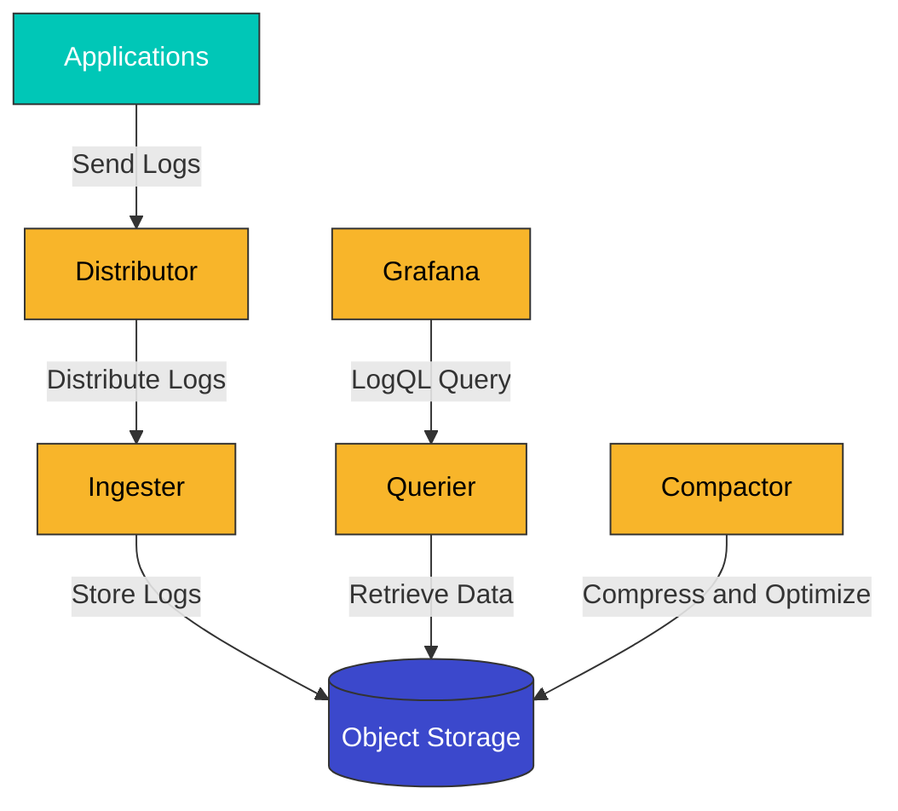
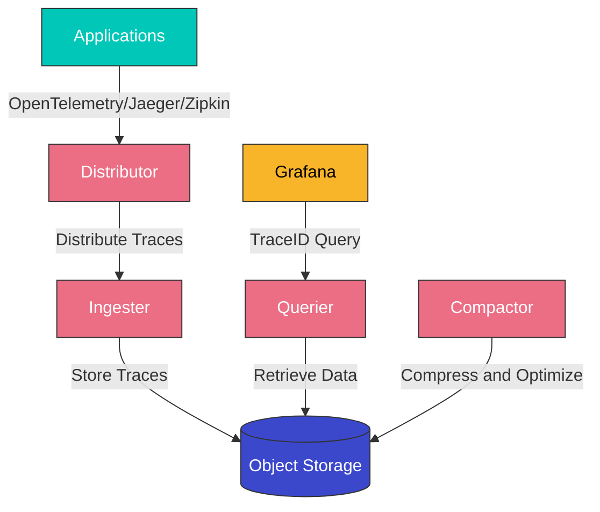
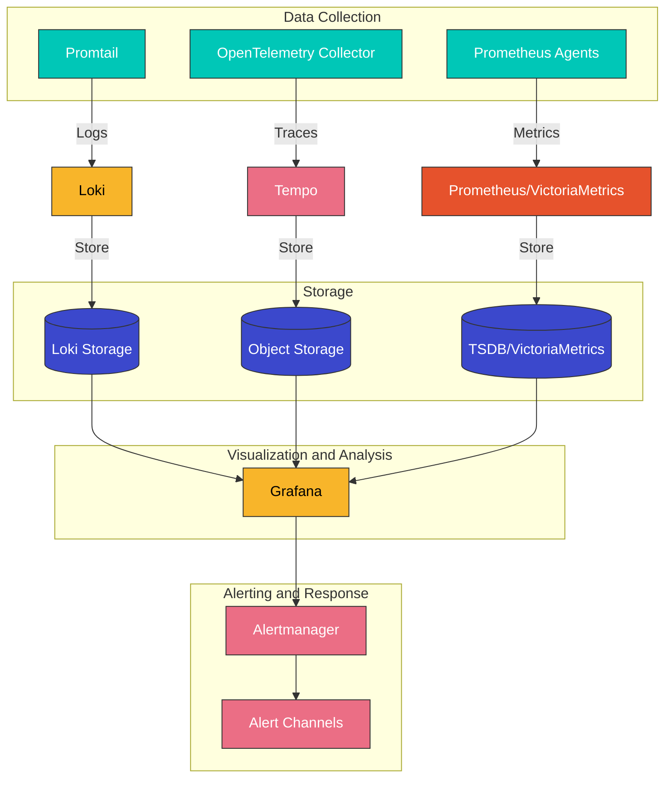

# Logging Stack (Loki, Tempo)

Effective logging and distributed tracing in Kubernetes environments are essential for system visibility and troubleshooting. This document explains log management using Grafana Loki and distributed tracing system construction using Grafana Tempo.

## Table of Contents

1. [Overview](#overview)
2. [Architecture](#architecture)
3. [Installation and Configuration](#installation-and-configuration)
4. [Log Collection and Querying](#log-collection-and-querying)
5. [Distributed Tracing](#distributed-tracing)
6. [Amazon EKS Integration](#amazon-eks-integration)
7. [Best Practices](#best-practices)
8. [Troubleshooting](#troubleshooting)
9. [Conclusion](#conclusion)

## Overview

### Grafana Loki

Grafana Loki is a horizontally scalable log aggregation system inspired by Prometheus. Loki provides a cost-effective way to store and query log data. Key features include:

- **Label-based Indexing**: Uses a label-based approach similar to Prometheus
- **Lightweight Design**: Minimizes resource usage by indexing only metadata, not log content
- **Efficient Storage**: Reduces storage costs by compressing log data and storing it in chunks
- **LogQL**: Provides a query language similar to Prometheus PromQL
- **Grafana Integration**: Seamless integration with Grafana for visualization and alerting capabilities

### Grafana Tempo

Grafana Tempo is a high-performance, cost-effective distributed tracing backend. Key features include:

- **Open Standards Support**: Supports various tracing protocols including OpenTelemetry, Jaeger, Zipkin
- **Object Storage Optimization**: Uses object storage (S3, GCS, etc.) for cost-effective storage
- **TraceID-based Search**: Reduces costs with TraceID-based search without indexing
- **Grafana Integration**: Seamless integration with Grafana for correlated analysis of logs, metrics, and trace data
- **Scalability**: Architecture that can scale horizontally even in large environments

### Benefits of the Logging Stack

1. **Unified Visibility**: View logs, metrics, and trace data in a single interface
2. **Cost Efficiency**: Reduce costs through minimal indexing and efficient storage
3. **Scalability**: Scalable for large clusters and high log volumes
4. **Correlation Analysis**: Shorten troubleshooting time through correlation analysis between logs, metrics, and trace data
5. **Various Data Source Support**: Collect and analyze logs from various sources including Kubernetes, applications, and infrastructure

## Architecture

### Loki Architecture

Loki consists of the following main components:

1. **Distributor**: Receives log streams from clients, validates them, and forwards to ingesters
2. **Ingester**: Buffers log data in memory and stores it to storage
3. **Querier**: Processes user queries and retrieves data from ingesters and storage
4. **Query Frontend**: Handles query optimization, caching, retries, etc.
5. **Compactor**: Compresses stored log chunks and optimizes indexes
6. **Table Manager**: Manages index and chunk tables
7. **Storage**: Backend storage for storing log data and indexes

### Tempo Architecture

Tempo consists of the following main components:

1. **Distributor**: Receives trace data in various formats (Jaeger, Zipkin, OpenTelemetry, etc.) and validates them
2. **Ingester**: Buffers trace data in memory and stores it to storage
3. **Querier**: Processes TraceID-based queries and retrieves data from storage
4. **Compactor**: Compresses and optimizes stored trace data
5. **Storage**: Backend storage for storing trace data (S3, GCS, Azure Blob, etc.)

### Integrated Logging Stack Architecture

The architecture of a complete observability stack integrating Loki, Tempo, and Prometheus is as follows:

### Data Flow

1. **Log Collection Flow**:
   - Promtail, Fluentd, or Fluent Bit collects logs on Kubernetes nodes
   - Labels are added to collected logs (namespace, pod, container, etc.)
   - Logs are sent to Loki Distributor
   - Ingester buffers logs in memory and stores them to storage
   - Search and visualize logs through Grafana using LogQL queries

2. **Trace Collection Flow**:
   - Applications generate trace data through OpenTelemetry, Jaeger, or Zipkin clients
   - OpenTelemetry Collector collects and preprocesses trace data
   - Trace data is sent to Tempo Distributor
   - Ingester buffers trace data in memory and stores it to object storage
   - Search and visualize trace data based on TraceID through Grafana

3. **Integrated Analysis Flow**:
   - Analyze logs, metrics, and trace data in correlation through Grafana
   - Click TraceID in logs to navigate to related trace data
   - When anomalies are found in metric dashboards, check related logs and trace data
   - Set up integrated alerts for early detection and response to issues

## Quiz

To test what you've learned in this chapter, try the [topic quiz](../quizzes/observability/08-logging-stack-quiz.md).
