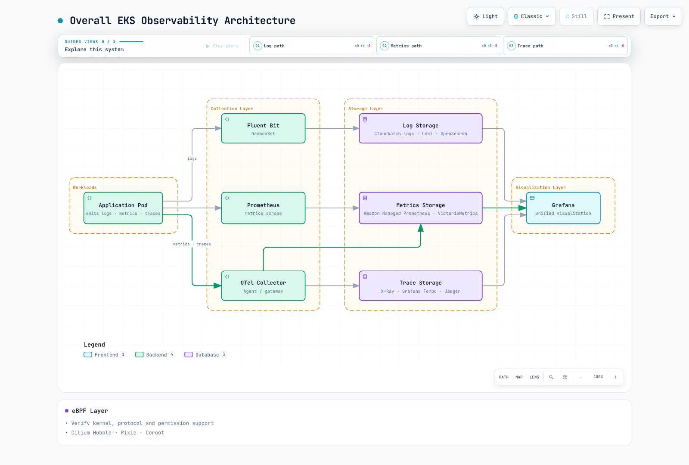
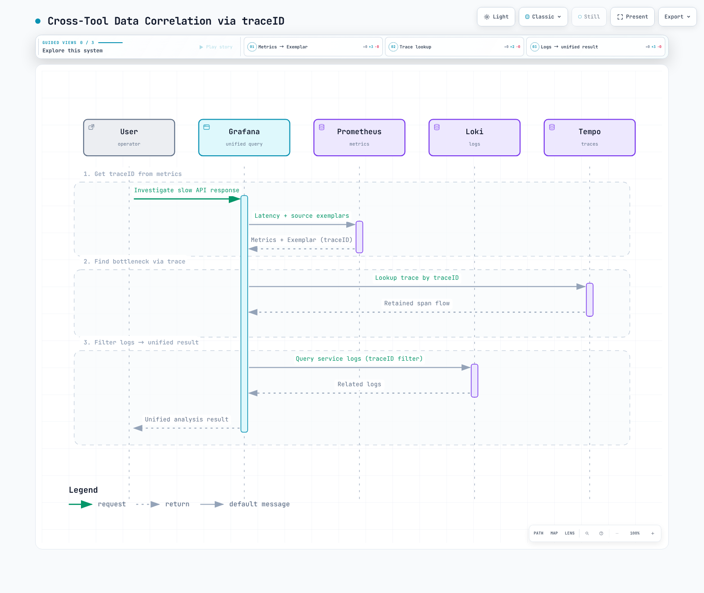

# EKS Observability Optimization Guide

> **Validated example versions**: Prometheus 3.14.0 · OTel Collector Contrib 0.160.0 · Alertmanager 0.34.0 · OpenCost 1.121.2/chart 2.5.31

> **Last Updated**: September 13, 2026

Optimize observability around incident questions, collection quality and measured cost. A node count alone cannot predict ingestion volume, query load, retention cost or staffing requirements. This chapter uses [complete configuration examples](https://github.com/Atom-oh/kubernetes-docs/tree/main/examples/observability/optimization) and links to the deployment guides for cluster installation. Native tests use synthetic data; they are not production capacity benchmarks.

<span id="table-of-contents"></span>

## Contents

- [1. Overview of the Three Pillars of Observability](#1-overview-of-the-three-pillars-of-observability)
- [2. Logging Solution Comparison](#2-logging-solution-comparison)
- [3. Metrics Collection and Storage](#3-metrics-collection-and-storage)
- [4. Distributed Tracing](#4-distributed-tracing)
- [5. eBPF-Based No-Code Monitoring](#5-ebpf-based-no-code-monitoring)
- [6. Cost Monitoring](#6-cost-monitoring)
- [7. Unified Observability Dashboard](#7-unified-observability-dashboard)
- [8. Operational Challenges and Solutions](#8-operational-challenges-and-solutions)
- [9. Best Practices and Next Steps](#9-best-practices-and-next-steps)

<span id="_1-1-relationship-between-logging-metrics-and-tracing"></span>

<span id="_1-2-role-of-each-pillar-and-selection-criteria"></span>

<span id="_1-3-overall-eks-observability-architecture"></span>

<span id="1-overview-of-the-three-pillars-of-observability"></span>

## 1. Overview of the Three Pillars of Observability

Logs describe events, metrics summarize behavior over time, and traces describe instrumented request paths. A missing trace or quiet dashboard does not establish that a service is healthy. Include collector drops, queues, failed exports and scrape health in the same operational view.


[🔍 View interactive diagram](https://www.atomai.click/kubernetes-docs/archmaps/en-observability-09-observability-optimization-0.html)

Use bounded service/route/status labels for metrics and put high-cardinality request IDs in appropriately controlled logs/traces. A trace is not necessarily complete: instrumentation, propagation, sampling and retention all affect it.



[🔍 View interactive diagram](https://www.atomai.click/kubernetes-docs/archmaps/en-observability-09-observability-optimization-1.html)

Agents and gateways have different responsibilities. Node agents read local logs; gateways can apply centralized policies. Tail sampling needs trace affinity and cannot be made correct by placing arbitrary DaemonSet replicas behind a random load balancer.

<span id="_2-1-log-storage-comparison"></span>

<span id="_2-2-log-agent-comparison"></span>

<span id="_2-3-fluent-bit-loki-configuration-example-for-eks"></span>

<span id="2-logging-solution-comparison"></span>

## 2. Logging Solution Comparison

| Backend | Useful characteristics | Costs and operating constraints |
|---|---|---|
| CloudWatch Logs | Managed ingestion, retention and Logs Insights | Region, log class, ingestion, storage, query scan and quotas |
| OpenSearch | Indexed search and analytics | Provisioned/serverless capacity, indexing, replicas, storage and query load |
| Loki | Label-indexed logs, LogQL and object storage | Compute, cache, object requests, retention, query fanout and operation |
| ClickHouse | SQL analytics, schema and compression choices | Compute, storage, replication, ingestion schema and query tuning |

There is no universal fastest or cheapest choice. Compare the same input volume, compression, retention, availability, query latency and support scope. Object storage pricing alone is not the total cost of Loki or Tempo. Managed services also have quotas.

### Agents and container log format

Fluent Bit, Fluentd and Vector differ in plugins, languages, buffering and deployment model. Fixed claims such as “15 MB” or “200K messages/second” need a reproducible workload, version and hardware. Measure your record sizes, parser cost, retries and backpressure.

Modern EKS containerd logs use CRI framing. Do not apply a Docker JSON parser blindly or assume `/var/lib/docker/containers` exists. Use the supported container/CRI parser, handle multiline messages, mount host logs read-only, and store offsets/buffers in a separate writable location. Kubernetes metadata enrichment needs the matching ServiceAccount/RBAC. A ConfigMap alone deploys no collector.

Limit Loki labels to stable dimensions such as cluster, namespace and service. Automatically copying all Pod labels can explode streams. Follow the [collector guide](./logging/05-collectors.md) and [Loki guide](./logging/01-loki.md) for current complete profiles; confirm the target Service, schema, storage, IAM and network controls before installing.

### Filtering is not percentage sampling

After parsing JSON into a `level` field, a Fluent Bit filter fragment can exclude exact DEBUG/TRACE levels:

```ini
[FILTER]
    Name     grep
    Match    application.*
    Exclude  level ^(DEBUG|TRACE)$
```

This fragment needs a matching input/parser/output pipeline. Do not discard records merely because arbitrary message text contains “DEBUG”. Fluent Bit's throttle `Rate` and `Window` implement a moving-window rate limit, not a 10% probability sampler. Measure dropped records and preserve incident/audit requirements before filtering.

For CloudWatch, use documented `cloudwatch_logs` options. `log_format json` and the old `max_batch_size`/`max_batch_put_limit` snippet are not a valid generic JSON-output/batching configuration. The plugin handles batching; check its pinned version's options. A `log_retention_days` setting used when creating a group does not establish the retention of every existing group.

<span id="_3-1-metrics-storage-comparison"></span>

<span id="_3-2-cardinality-management-strategy"></span>

<span id="_3-3-improving-query-performance-with-recording-rules"></span>

<span id="_3-4-long-term-storage-strategy"></span>

<span id="3-metrics-collection-and-storage"></span>

## 3. Metrics Collection and Storage

Prometheus has local TSDB storage; sharding, remote write and a query/aggregation layer extend its deployment model. VictoriaMetrics single-node and cluster products have different availability and replication properties. AMP is managed but has workspace quotas and configurable retention. None of these means unlimited retention, automatic replication from “three storage Pods”, or identical semantics for every extended query.

### Cardinality without dropping unrelated metrics

The example `prometheus.yaml` drops only selected buckets of one known histogram. It retains non-histogram metrics, `_sum`, `_count`, the SLO bucket `le="0.5"`, and `+Inf`.

```yaml
- source_labels:
  - __name__
  - le
  regex: lab_http_request_duration_seconds_bucket;(0\.005|0\.01|0\.025|0\.05|0\.25)
  action: drop
```

An `action: keep` matching only `.*_bucket;...` also deletes every nonmatching metric and often `+Inf`. Changing histogram buckets affects quantile accuracy; prefer the instrumentation schema where possible and retain the bucket needed by the SLO. Prometheus 3 normalizes classic histogram `le` values, for example `1` becomes `1.0`; match actual ingested labels.

`relabel_configs` changes discovered targets before scraping; `metric_relabel_configs` changes scraped samples. Removing labels does not aggregate samples and can create duplicate series. Discovery's `__meta_*` labels are not automatically persistent sample labels. Reduce labels at the source and prove the remaining label set is unique.

### Recording rules and retention

Use recording rules for repeated calculations, with consistent `service`, `cluster` and namespace keys. Node-exporter normally identifies targets with `instance`; do not group by a `node` label that was never added. Metrics needed to diagnose the collector itself should not be blindly dropped with all `go_.*` or `promhttp_.*` families.


[🔍 View interactive diagram](https://www.atomai.click/kubernetes-docs/archmaps/en-observability-09-observability-optimization-2.html)

A remote-write queue is not a backup or guarantee of lossless delivery. Plan WAL/queue capacity, retry behavior, authentication, network interruption and receiver limits. A Thanos sidecar/block upload architecture differs from the Thanos Receive path shown here.

For Prometheus Operator, `replicas: 2` and `shards: 3` mean six Prometheus Pods. Budget PVCs and memory for all six, configure selectors, and provide a query layer that merges shards and deduplicates HA replicas. Two replicas with an undeduplicated remote-write receiver can double-count data. Verify CRD fields and supported dedicated query settings against the pinned operator; do not add conflicting generic arguments.

<span id="_4-1-opentelemetry-overview-and-architecture"></span>

<span id="_4-2-tracing-backend-comparison"></span>

<span id="_4-3-sampling-strategies"></span>

<span id="_4-4-otel-collector-daemonset-configuration-for-eks"></span>

<span id="4-distributed-tracing"></span>

## 4. Distributed Tracing

Tempo supports TraceQL as well as trace-ID lookup. Jaeger 2 uses an OTel-based architecture with explicitly selected storage. X-Ray is an AWS backend; use current OTel/ADOT integration guidance rather than treating an old SDK version as universal. Consider ingestion, query, storage and operations instead of comparing only per-trace and S3 prices.


[🔍 View interactive diagram](https://www.atomai.click/kubernetes-docs/archmaps/en-observability-09-observability-optimization-3.html)

### Sampling and affinity

Head sampling decides before the full request outcome is known. Collector probabilistic sampling also happens after telemetry reaches the collector and is not the same as an SDK head decision. Tail sampling cannot recover spans already dropped upstream.

In the default `trace-complete` strategy, `decision_wait` controls timer-based decisions over received spans; it does not prove that every span arrived or the trace finished. Route all spans for one trace ID to the same sampler. Size the buffer for arrival rate × wait time plus burst and span-size headroom. Capacity overflow, oversized traces, restarts and late spans can defeat a promise to retain every error trace.

The loopback-only `collector-tail-local.yaml` is a synthetic demonstration, not an EKS manifest. It uses a 1,000-trace buffer, a two-second decision wait and a 192 MiB memory-limiter setting; tune production values from measured traces and container memory headroom. Its policies are:

```yaml
decision_wait: 2s
num_traces: 1000
maximum_trace_size_bytes: 1048576
policies:
- name: errors
  type: status_code
  status_code:
    status_codes:
    - ERROR
- name: slow
  type: latency
  latency:
    threshold_ms: 1000
- name: baseline
  type: probabilistic
  probabilistic:
    sampling_percentage: 10
```

With these positive policies, matching error/slow traces are kept and other traces are eligible for the probabilistic policy. This does not imply a 90% overall volume reduction. Drop/composite/inverted policies have different decision semantics; do not generalize “first matching rule wins”. The example removes only the specifically named `sensitive_data` span attribute. Sanitize span names, events, resource attributes and application logs through an explicit data policy before export.

For a cluster deployment, use the [OTel guide](./tracing/03-opentelemetry.md) and [observability stack lab](../labs/observability/02-observability-stack-lab.md). Operator injection annotations require the Operator, matching `Instrumentation` resource, supported runtime image and workload restart. Match OTLP HTTP/4318 versus gRPC/4317 and TLS/authentication; an annotation alone does not install instrumentation.

<span id="_5-1-why-ebpf-monitoring"></span>

<span id="_5-2-coroot-automatic-service-maps-and-latency-analysis"></span>

<span id="_5-3-pixie-now-new-relic-kubernetes-specific-observability"></span>

<span id="_5-4-cilium-hubble-network-flow-observation"></span>

<span id="_5-5-kepler-energy-consumption-monitoring"></span>

<span id="5-ebpf-based-no-code-monitoring"></span>

## 5. eBPF-Based No-Code Monitoring


[🔍 View interactive diagram](https://www.atomai.click/kubernetes-docs/archmaps/en-observability-09-observability-optimization-4.html)

eBPF can reduce source changes for supported protocols, kernels and runtimes. It does not automatically capture business semantics, every language/library, or all TLS traffic. Uprobes may observe plaintext at supported library boundaries; that is not general TLS decryption. Evaluate privileges, sensitive payload capture, kernel compatibility and measured overhead. SDK auto-instrumentation can also avoid application source changes, though restarts/configuration may be needed.

| Tool | Current deployment consideration |
|---|---|
| Coroot | The legacy `coroot/coroot` chart is deprecated. Use the documented Operator/Coroot CR flow; operator chart 0.9.10 and CE chart 0.3.3 are separate components. Review agent privileges, storage and authentication. |
| Pixie | An open-source project with kernel/protocol prerequisites and control-plane choices. In-cluster storage does not make exported queries/results impossible; review actual access and data paths. |
| Cilium Hubble | Requires a compatible Cilium deployment. Flow visibility, L7 policy/proxy coverage and enabled metrics vary; it is not an application-wide distributed tracing replacement. |
| Kepler | Version 0.10+ rewrote the old 0.7 architecture. Current metrics and deployment prerequisites differ; do not copy the old privileged/BPF DaemonSet. |

Kepler 0.11.4 documents CPU metrics such as `kepler_pod_cpu_watts` and `kepler_pod_cpu_joules_total` with `pod_namespace`/`pod_name`. Hardware energy access and attribution must work on the actual host; ordinary virtual EKS nodes are not guaranteed to expose host RAPL data. Consult the release's deployment and hardware support documentation before claiming measurement accuracy.

```promql
# A watts gauge already measures power.
sum by (pod_namespace) (kepler_pod_cpu_watts)

# J/s = W; multiplying by 1000 would give milliwatts.
rate(kepler_pod_cpu_joules_total[5m])
```

Readiness or a running exporter does not establish correct hardware measurements. EKS Auto Mode and Fargate have different host-access constraints; verify supported instrumentation instead of applying a privileged node agent everywhere. Keep Hubble/Coroot/OpenCost UIs private until authentication and network access are configured.

<span id="_6-1-kubecost-opencost-installation-and-configuration"></span>

<span id="_6-2-cost-allocation-by-namespace-team"></span>

<span id="_6-3-cloudwatch-cost-optimization"></span>

<span id="_6-4-log-metrics-storage-cost-reduction-strategies"></span>

<span id="6-cost-monitoring"></span>

## 6. Cost Monitoring

### OpenCost and allocation

`opencost-values.yaml` targets chart 2.5.31/app 1.121.2, selects an existing Prometheus and disables Cloud Cost ingestion. Replace the endpoint with one containing the metrics required by OpenCost, including workload/resource and cost data; mere reachability is insufficient. Configure approved authentication/CA handling for protected Prometheus endpoints.

```bash
helm repo add opencost https://opencost.github.io/opencost-helm-chart
helm repo update opencost
helm upgrade --install opencost opencost/opencost --version 2.5.31   -n opencost --create-namespace -f opencost-values.yaml
kubectl -n opencost port-forward service/opencost 9003:9003 --address 127.0.0.1
# In another terminal:
curl --fail --get http://127.0.0.1:9003/allocation/compute   --data-urlencode 'window=7d' --data-urlencode 'aggregate=namespace'
```

Seven days of requested output needs sufficient input history. Allocation estimates are not the AWS invoice. Standardize `team`, `cost-center`, cluster and namespace labels; define idle/shared-cost allocation and compare with CUR/Data Exports, credits, discounts and amortization. AWS Cloud Cost reconciliation requires its supported `cloudIntegrationSecret` format, CUR/Athena/S3 prerequisites and scoped identity permissions. Unsupported values such as the old `exporter.aws.athenaProjectID` fragment do not establish that integration. Never place AWS access keys in values files.

### Retention and archive safety

Inventory log groups before making retention changes:

```bash
aws logs describe-log-groups --log-group-name-prefix /eks/production/   --query 'logGroups[].{name:logGroupName,retention:retentionInDays,storedBytes:storedBytes}'   --output json
```

Apply an approved retention policy to explicitly selected groups through infrastructure configuration. `storedBytes == 0` does not mean a log group is unused; subscriptions, producers, audit requirements and future writes may still depend on it. Do not bulk-delete “empty” groups or treat tab-separated CLI text as one log-group name per line.


[🔍 View interactive diagram](https://www.atomai.click/kubernetes-docs/archmaps/en-observability-09-observability-optimization-5.html)

Do not transition active Loki/Tempo blocks into Glacier blindly: the backend may require immediate reads and will not necessarily restore archived objects on demand. Coordinate backend retention/compaction with object lifecycle rules and test retrieval. Compression, filtering and retention savings overlap; do not add their percentages as if independent.

<span id="_7-1-grafana-based-unified-dashboard-configuration"></span>

<span id="_7-2-log-metrics-trace-correlation-exemplars"></span>

<span id="_7-3-alerting-strategy-preventing-alert-fatigue"></span>

<span id="_7-4-slo-sli-based-monitoring"></span>

<span id="7-unified-observability-dashboard"></span>

## 7. Unified Observability Dashboard

Use the [Grafana guide](./grafana/README.md) for pinned provisioning with matching `prometheus`, `loki` and `tempo` UIDs, current `tracesToLogsV2`, and real HTTP/TLS endpoints. Environment variables do not create a data source by themselves. Exemplar label names and JSON trace fields must match the instrumented application.

Prometheus feature switches belong on its command line or the operator's supported `enableFeatures` field, not `global.enable_features` in `prometheus.yml`. The example uses `storage.exemplars.max_exemplars`; when enabling exemplar storage, also use the version-appropriate feature flag. Registered collectors and OpenMetrics exposition are required at the application. Avoid raw request paths or unsampled/invalid trace IDs in exemplar instrumentation.

### Request SLO, burn rate and remaining budget

For a request-based 99.9% availability SLO, allowed bad requests are `total requests × 0.001` over the defined window. That is not automatically 43 minutes of downtime; time-based and request-based SLIs have different denominators.

`slo-rules.yaml` separates short-window error ratios from a 30-day request-weighted ratio:

```promql
# Recent burn rate:
service:http_5xx:ratio_5m / 0.001

# Remaining 30-day request budget:
1 - service:http_5xx:ratio_30d / 0.001
```

The 30-day ratio uses `increase(counter[30d])` for numerator and denominator, not the latest five-minute ratio. Require sufficient history and monitor collection gaps. An exhausted budget can be negative; missing/zero traffic remains undefined rather than becoming perfect availability. The `le="0.5"` bucket divided by histogram count is the fraction of requests within 500 ms, not “the fraction of p99 values below 500 ms”.

The example pairs 1h/5m burn thresholds of 14.4 and 6h/30m thresholds of 6. For a 30-day objective these are illustrative fast/sustained burn policies, not universal severity settings. Tune evaluation windows, traffic confidence and response policy with service owners. Do not automatically suspend deployment merely because one short-window estimate crosses a threshold.

### Alert routing

`alertmanager.yaml` provides current matchers, Asia/Seoul off-hours and inhibition guarded by nonempty cluster/node labels. Missing labels otherwise compare equal and can silence unrelated alerts. Its `review-only` receiver deliberately has no integration: it validates routing without sending anything. Before operational use, add approved contacts, Secret-backed webhook/routing keys and explicit receiver policies, then test delivery and inhibition. Evaluation, grouping, repeat interval, pending duration and mute schedules serve different purposes.

<span id="_8-1-responding-to-exploding-log-metrics-storage-costs"></span>

<span id="_8-2-eks-auto-mode-node-monitoring"></span>

<span id="_8-3-cross-tool-data-correlation-analysis"></span>

<span id="_8-4-maintaining-monitoring-system-performance-at-large-scale"></span>

<span id="_8-5-high-availability-observability-stack-configuration"></span>

<span id="8-operational-challenges-and-solutions"></span>

## 8. Operational Challenges and Solutions



[🔍 View interactive diagram](https://www.atomai.click/kubernetes-docs/archmaps/en-observability-09-observability-optimization-6.html)

A computed p99 series does not itself retain exemplar metadata. Query exemplars from the original instrumented series, then verify trace retention and log fields. A trace link resolving to no data may mean sampling/retention mismatch rather than a broken UI.

EKS Auto Mode includes a node monitoring agent that publishes Kubernetes Events and node Conditions. Read those signals and node health alongside workload metrics. A PodMonitor selects Pods and named container ports; selecting a node label does not magically expose node metrics. CloudWatch Observability's add-on/operator installs agents and requires permissions/configuration; a standalone ConfigMap does not enable Container Insights.


[🔍 View interactive diagram](https://www.atomai.click/kubernetes-docs/archmaps/en-observability-09-observability-optimization-7.html)

Test failures at collection, queue, receiver, storage and query layers. PDBs constrain voluntary disruptions when respected; they do not guarantee availability during node loss. Replication factors, quorum, AZ placement, stateful storage and read-path aggregation are separate requirements. Follow current Loki/Tempo deployment modes instead of mixing retired Simple Scalable/Tempo 2 ingester examples into a current stack.

<span id="_9-1-phased-adoption-strategy"></span>

<span id="_9-2-cost-benefit-analysis"></span>

<span id="_9-3-checklist"></span>

<span id="_9-4-related-documents-and-quizzes"></span>

<span id="9-best-practices-and-next-steps"></span>

## 9. Best Practices and Next Steps


[🔍 View interactive diagram](https://www.atomai.click/kubernetes-docs/archmaps/en-observability-09-observability-optimization-8.html)

Establish a baseline: bytes/day per signal, active series, new-series churn, samples/second, spans/second, sample retention, query scan volume, retention, buffer loss, recovery time and operating effort. Use current Region-specific pricing and your negotiated terms. For a hypothetical $5,000/month baseline and $2,500 target, attribute actual cost categories before estimating savings. No tool switch guarantees 50% savings.

Roll out one measurable change at a time. Compare incident investigation success, SLO coverage, dropped data and the bill before and after. Maintain enough data to reverse a harmful filter and restore diagnosis. Deployment duration depends on permissions, team experience, validation and migration; fixed “one to two days” schedules are not commitments.

### Validation and limits

Native checks covered Prometheus configuration and nine rules, selective bucket relabeling against a real synthetic scrape, seven SLO assertions including a 30-day request budget, an actual Collector tail-sampling pipeline, Alertmanager configuration and the pinned OpenCost Helm render. There was no production workload, billing reconciliation, Kubernetes/eBPF installation or external notification. Diagram/browser checks are recorded separately in the review report.

### Related reading

- [Prometheus guide](./metrics/01-prometheus.md)
- [Grafana dashboards](./grafana/README.md)
- [Observability optimization quiz](../quizzes/observability/09-observability-optimization-quiz.md)

## References

- [Collector tail sampling v0.160.0](https://github.com/open-telemetry/opentelemetry-collector-contrib/tree/v0.160.0/processor/tailsamplingprocessor)
- [Prometheus configuration](https://prometheus.io/docs/prometheus/latest/configuration/configuration/)
- [Prometheus alerting configuration](https://prometheus.io/docs/alerting/latest/configuration/)
- [AMP workspace retention configuration](https://docs.aws.amazon.com/prometheus/latest/APIReference/API_UpdateWorkspaceConfiguration.html)
- [EKS Auto Mode troubleshooting](https://docs.aws.amazon.com/eks/latest/userguide/auto-troubleshoot.html)
- [CloudWatch Observability add-on](https://docs.aws.amazon.com/eks/latest/userguide/cloudwatch.html)
- [Kepler v0.11.4](https://github.com/sustainable-computing-io/kepler/tree/v0.11.4)
- [Coroot Helm charts](https://github.com/coroot/helm-charts/tree/main/charts)
- [OpenCost Helm chart](https://github.com/opencost/opencost-helm-chart/tree/main/charts/opencost)
- [Pixie](https://github.com/pixie-io/pixie)
