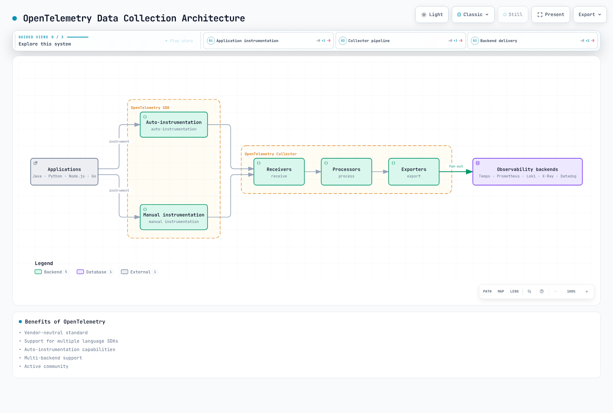

# Observability Overview

> **Last reviewed**: September 12, 2026.

## Introduction

In modern distributed systems, especially Kubernetes-based microservices architectures, the ability to observe and understand the internal state of systems from external outputs is essential. This is called **Observability**.

## Observability vs Monitoring

Monitoring is the activity of collecting and analyzing system behavior and responding to changes. Observability describes how well outputs let you understand internal state. They work together: monitoring can include logs, traces and diagnostic queries.

| Aspect | Monitoring | Observability |
| --- | --- | --- |
| **Focus** | Ongoing assessment of health and user impact | Visibility sufficient to explain system behavior |
| **Practice** | SLOs, dashboards, alerts and investigation | Instrumentation, context, correlation and exploration |
| **Questions** | What changed, and why is it failing? | Is there enough evidence to answer those questions? |
| **Data** | Metrics, logs, traces and other useful signals | Quality, coverage and connections between those signals |
| **Complexity** | Useful in simple and distributed systems | Designed around the system and operational goals |

## The Three Pillars of Observability

Logs, metrics and traces are three widely used signals. They are not an exhaustive definition of observability. Profiles can also describe code-level resource use; signal maturity differs in OpenTelemetry, where profile support remains under development.

### 1. Logs

Logs are records of individual events occurring in a system.

**Characteristics:**
- Records of discrete events; tamper resistance and retention guarantees depend on storage configuration
- Include timestamps and context information
- Structured (JSON) or unstructured format
- Useful for debugging and auditing, with deliberate event coverage, access controls and retention

**Use Cases:**
- Error and exception tracking
- Security auditing
- Compliance
- Detailed debugging

**Tool roles:** Loki, Elasticsearch/OpenSearch and CloudWatch Logs provide storage/query backends; Fluent Bit collects and forwards records.

### 2. Metrics

Metrics are numeric measurements over time.

**Characteristics:**
- Stored as time series data
- Support aggregation and mathematical operations
- Efficient storage when cardinality and collection volume are controlled
- Suitable for trend analysis

**Common Prometheus Metric Types:**
- **Counter**: Cumulative increasing values that can reset to zero, for example on restart (e.g., request count)
- **Gauge**: Current measurements that can increase or decrease (e.g., memory usage)
- **Histogram**: Distributions of observations (e.g., response time); classic and native histograms differ in representation and query syntax
- **Summary**: Observation count/sum and, depending on the implementation, precomputed quantiles; averaging instance quantiles does not produce a valid fleet-wide quantile

**Tools:** Prometheus, VictoriaMetrics, CloudWatch Metrics, Datadog

### 3. Traces

Traces describe the observed path of related work through spans. Instrumentation gaps, sampling, propagation failures and data loss can leave a partial trace.

**Characteristics:**
- Visualize request flow between services
- Measure latency at each step
- Identify bottlenecks
- Dependency analysis

**Components:**
- **Trace**: Related spans connected by a common TraceID
- **Span**: A single unit of work
- **SpanContext**: TraceID, SpanID, trace flags and tracestate used to propagate tracing context

**Tools:** Tempo, Jaeger, X-Ray, Zipkin, Datadog APM

## Correlation Between the Three Pillars

Signals can be correlated when instrumentation, collection and backend links are configured. Their presence alone does not automatically connect every event.


[🔍 View interactive diagram](https://www.atomai.click/kubernetes-docs/archmaps/en-observability-readme-2.html)

The figure abbreviates IDs for illustration. Use the valid full-width IDs shown below in real data. Metric correlation uses exemplar metadata; regular metric labels should remain bounded.

### Trace-to-Log Correlation

Record TraceID and SpanID when an active trace context exists to link emitted log events to spans. Background or uninstrumented logs may have no such IDs. This is an application JSON example, not a complete OTLP request payload.

```json
{
  "timestamp": "2025-02-15T10:30:00Z",
  "level": "ERROR",
  "message": "Payment processing failed",
  "traceId": "4bf92f3577b34da6a3ce929d0e0e4736",
  "spanId": "00f067aa0ba902b7",
  "service": "payment-service"
}
```

W3C-format TraceIDs contain 32 hexadecimal characters and SpanIDs contain 16; all-zero IDs are invalid. The JSON retains its illustrative historical event timestamp.

### Metric-to-Trace Correlation (Exemplars)

An exemplar is separate metadata linking a particular observation to a trace. A per-request TraceID on ordinary metric series would create high cardinality, so use exemplars or log fields. The following is a complete classic-histogram OpenMetrics text example with illustrative measurements.

```text
# HELP http_request_duration_seconds Observed HTTP request duration.
# TYPE http_request_duration_seconds histogram
# UNIT http_request_duration_seconds seconds
http_request_duration_seconds_bucket{le="0.5"} 1000 # {trace_id="4bf92f3577b34da6a3ce929d0e0e4736"} 0.42
http_request_duration_seconds_bucket{le="+Inf"} 1000
http_request_duration_seconds_sum 123.4
http_request_duration_seconds_count 1000
# EOF
```

An exemplar requires both a label set and an observation value (`0.42`); its timestamp is optional. Collection/storage must support and retain exemplars, and data-source links must map the `trace_id` label to the trace backend. The referenced trace must also have been sampled and retained.

## OpenTelemetry and Standardization

OpenTelemetry (OTel) provides vendor-neutral APIs, SDKs, instrumentation and Collector tooling. Supported signals and automatic instrumentation vary by language, framework and component version.



[🔍 View interactive diagram](https://www.atomai.click/kubernetes-docs/archmaps/en-observability-readme-3.html)

This is one deployment pattern. Applications can also export directly to a supported backend. Collector receivers, processors and exporters must be configured for the chosen signals; component maturity varies.

**Benefits of OpenTelemetry:**
- Vendor-neutral standard
- Support for multiple language SDKs
- Auto-instrumentation capabilities
- Multi-backend support
- Active community

## Observability Strategy for EKS Environments

Strategies for implementing effective observability in Amazon EKS:

### 1. Layer-based Observability


[🔍 View interactive diagram](https://www.atomai.click/kubernetes-docs/archmaps/en-observability-readme-4.html)

These are example signal paths, not exclusive tool-to-layer assignments. CloudWatch and other backends can cover multiple layers. Node-level collectors require the access and deployment model supported by the selected EKS compute mode.

### 2. Example Tool Choices

| Function | Self-hosted Examples | AWS Managed Examples | Commercial Platforms |
|----------|-------------|------------|------------|
| Metrics | Prometheus, VictoriaMetrics | CloudWatch, AMP | Datadog, New Relic |
| Logs | Loki, Elasticsearch/OpenSearch | CloudWatch Logs | Splunk, Datadog |
| Traces | Tempo, Jaeger | X-Ray | Datadog APM, Dynatrace |
| Visualization | Grafana | CloudWatch Dashboards | Datadog, Dynatrace |

### 3. Cost Optimization Strategies

- **Sampling**: Balance retained trace volume against investigation coverage; tail sampling still receives and buffers data before deciding, so it does not remove every upstream cost
- **Retention Policies**: Optimize data retention periods
- **Tiered Storage**: Check the backend's supported storage tiers, query paths and required retention
- **Aggregation and Cardinality**: Control collection volume and label dimensions while assessing the diagnostic detail lost through aggregation

## Observability Maturity Model

Use this practical planning model to review operational goals. It is not a product-purchase sequence or a universal certification scale. Assess signal coverage, investigation speed, actionable alerts and cost; introduce automated analysis where its behavior has been evaluated.

| Review Area | Capability to Assess | Example Tools |
| --- | --- | --- |
| Basic collection | Reliable coverage of needed service/platform signals | kubectl logs, CloudWatch |
| Centralization | Appropriate retention, access controls and querying | Loki, Prometheus, Grafana |
| Correlation | Links through request, service and deployment context | Tempo, exemplars, TraceID |
| Optional automation | Analysis assistance with tested false positives, gaps and response behavior | Datadog Watchdog, Dynatrace Intelligence |

## Section Guide

This observability section is organized as follows:

### [Logging](./logging/README.md)
Tools and strategies for log collection, storage, and analysis:
- Loki: Log aggregation and query backend
- Fluent Bit: High-performance log collector
- CloudWatch Logs: AWS native logging

### [Metrics](./metrics/README.md)
Time series metric collection and analysis:
- Prometheus: Industry standard metrics system
- VictoriaMetrics: Metrics storage and query backend
- CloudWatch Metrics: AWS native metrics

### [Tracing](./tracing/README.md)
Distributed tracing and request flow analysis:
- Tempo: Grafana's distributed tracing backend
- X-Ray: AWS native distributed tracing
- OpenTelemetry: Standardized instrumentation
- Dynatrace: AI-powered APM

### [Grafana (Dashboards)](./grafana/README.md)
Unified visualization and dashboards:
- Data source integration
- Dashboard design patterns
- Alert configuration

### [Alerting](./alerting/README.md)
Actionable alerts, routing and response integrations.

### [Observability Optimization](./09-observability-optimization.md)
Collection volume, cardinality, retention and operating cost.

### [Integrated Labs](../labs/observability/README.md)
Stepwise infrastructure, stack, application, load and tracing exercises.

## Getting Started

Start with service goals, investigation questions and existing platform/collector capabilities. Adapt this example sequence to those requirements:

1. **Set up metrics**: Select Prometheus, VictoriaMetrics or an appropriate managed backend
2. **Set up log collection**: Deploy Loki and Fluent Bit
3. **Set up tracing**: Deploy Tempo or X-Ray
4. **Visualization**: Connect the needed data sources and dashboards in the chosen platform
5. **Correlation**: Configure TraceID-based linking

## References

- [OpenTelemetry signals](https://opentelemetry.io/docs/concepts/signals/)
- [OpenTelemetry Collector](https://opentelemetry.io/docs/collector/)
- [OpenTelemetry log data model](https://opentelemetry.io/docs/specs/otel/logs/data-model/)
- [W3C Trace Context](https://www.w3.org/TR/trace-context/)
- [Prometheus metric types](https://raw.githubusercontent.com/prometheus/docs/main/docs/concepts/metric_types.md)
- [OpenMetrics specification](https://raw.githubusercontent.com/prometheus/OpenMetrics/main/specification/OpenMetrics.md)
- [OpenTelemetry sampling](https://opentelemetry.io/docs/concepts/sampling/)
- [Grafana OpenTelemetry documentation](https://grafana.com/docs/opentelemetry/)
- [Amazon EKS monitoring and logging](https://docs.aws.amazon.com/eks/latest/userguide/eks-observe.html)
- [AWS Observability Best Practices](https://aws-observability.github.io/observability-best-practices/)
- [SRE Workbook — Monitoring](https://sre.google/workbook/monitoring/)
- [Datadog Watchdog](https://docs.datadoghq.com/watchdog/)
- [Dynatrace Intelligence](https://docs.dynatrace.com/docs/dynatrace-intelligence)
