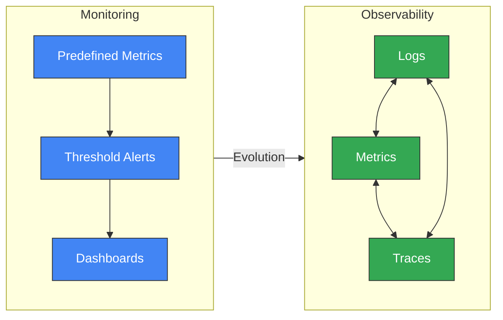
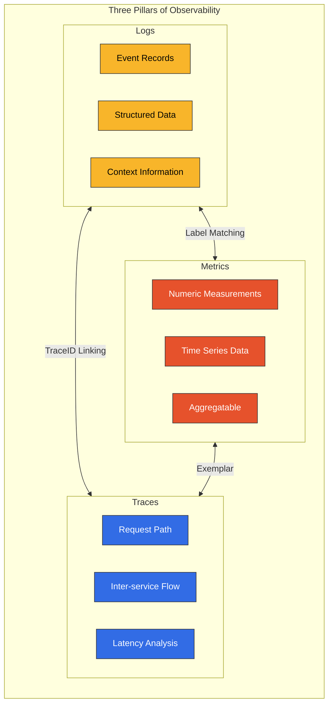
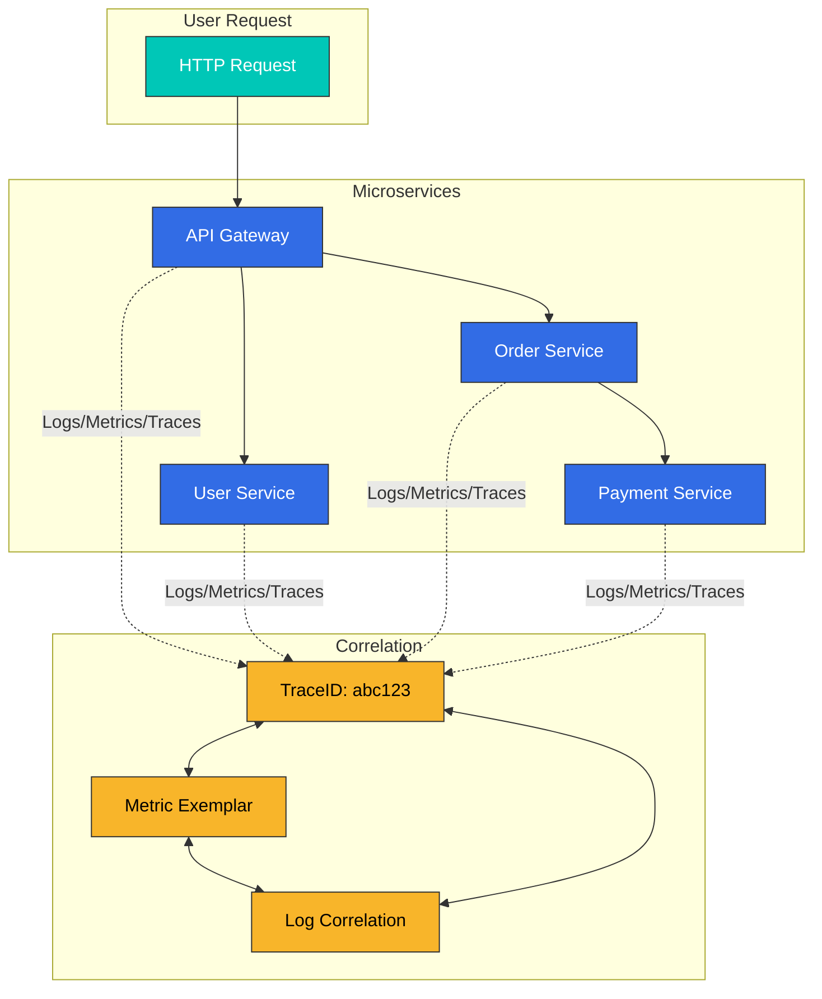
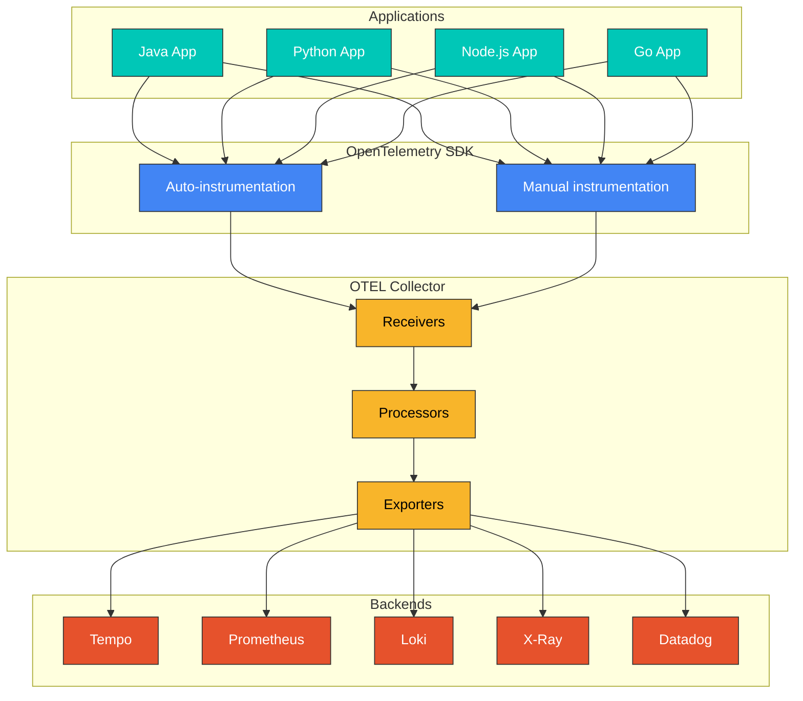
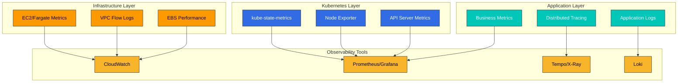
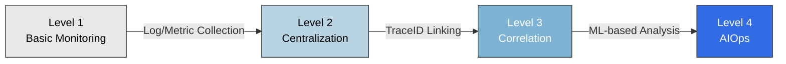

# Observability Overview

> **Last Updated**: February 2025

## Introduction

In modern distributed systems, especially Kubernetes-based microservices architectures, the ability to observe and understand the internal state of systems from external outputs is essential. This is called **Observability**.

## Observability vs Monitoring

Observability and monitoring are often used interchangeably, but there are fundamental differences:

| Aspect | Monitoring | Observability |
|--------|-----------|---------------|
| **Approach** | Based on predefined metrics and thresholds | Inferring internal state through system outputs |
| **Question Type** | "What went wrong?" (What) | "Why did it go wrong?" (Why) |
| **Data Scope** | Detecting known issues | Exploring unknown issues |
| **Flexibility** | Predefined dashboards | Dynamic queries and exploration |
| **Complexity** | Suitable for simple systems | Essential for complex distributed systems |



## The Three Pillars of Observability

Observability consists of three core data types:



### 1. Logs

Logs are records of individual events occurring in a system.

**Characteristics:**
- Discrete and immutable event records
- Include timestamps and context information
- Structured (JSON) or unstructured format
- Essential for debugging and auditing

**Use Cases:**
- Error and exception tracking
- Security auditing
- Compliance
- Detailed debugging

**Tools:** Loki, Elasticsearch, CloudWatch Logs, Fluent Bit

### 2. Metrics

Metrics are numeric measurements over time.

**Characteristics:**
- Stored as time series data
- Support aggregation and mathematical operations
- High storage efficiency
- Suitable for trend analysis

**Key Metric Types:**
- **Counter**: Cumulative increasing values (e.g., request count)
- **Gauge**: Current state values (e.g., CPU usage)
- **Histogram**: Distribution measurements (e.g., response time)
- **Summary**: Quantile calculations

**Tools:** Prometheus, VictoriaMetrics, CloudWatch Metrics, Datadog

### 3. Traces

Traces track the complete path of requests across distributed systems.

**Characteristics:**
- Visualize request flow between services
- Measure latency at each step
- Identify bottlenecks
- Dependency analysis

**Components:**
- **Trace**: The complete journey of a single request
- **Span**: A single unit of work
- **SpanContext**: Context propagated between services

**Tools:** Tempo, Jaeger, X-Ray, Zipkin, Datadog APM

## Correlation Between the Three Pillars

The three pillars are not independent but interconnected, providing powerful analytical capabilities:



### Trace-to-Log Correlation

Include TraceID in logs to track all logs related to a specific request:

```json
{
  "timestamp": "2025-02-15T10:30:00Z",
  "level": "ERROR",
  "message": "Payment processing failed",
  "traceId": "abc123def456",
  "spanId": "789xyz",
  "service": "payment-service"
}
```

### Metric-to-Trace Correlation (Exemplars)

Link TraceID to metrics to trace requests when anomalies occur:

```yaml
# Prometheus Exemplar
http_request_duration_seconds_bucket{le="0.5"} 1000 # {traceID="abc123"}
```

## OpenTelemetry and Standardization

OpenTelemetry (OTel) is the industry standard for observability data collection:



**Benefits of OpenTelemetry:**
- Vendor-neutral standard
- Support for multiple language SDKs
- Auto-instrumentation capabilities
- Multi-backend support
- Active community

## Observability Strategy for EKS Environments

Strategies for implementing effective observability in Amazon EKS:

### 1. Layer-based Observability



### 2. Recommended Tool Stack

| Function | Open Source | AWS Native | Commercial |
|----------|-------------|------------|------------|
| Metrics | Prometheus, VictoriaMetrics | CloudWatch, AMP | Datadog, New Relic |
| Logs | Loki, Elasticsearch | CloudWatch Logs | Splunk, Datadog |
| Traces | Tempo, Jaeger | X-Ray | Datadog APM, Dynatrace |
| Visualization | Grafana | CloudWatch Dashboards | Datadog, Dynatrace |

### 3. Cost Optimization Strategies

- **Sampling**: Reduce costs through trace data sampling
- **Retention Policies**: Optimize data retention periods
- **Tiered Storage**: Move older data to cheaper storage
- **Aggregation**: Store aggregated data instead of detailed data

## Observability Maturity Model



| Level | Characteristics | Example Tools |
|-------|-----------------|---------------|
| Level 1 | Basic log/metric collection | kubectl logs, CloudWatch |
| Level 2 | Centralized observability | Loki, Prometheus, Grafana |
| Level 3 | Three-pillar correlation | Tempo, Exemplars, TraceID |
| Level 4 | AIOps, automatic anomaly detection | Datadog Watchdog, Dynatrace Davis |

## Section Guide

This observability section is organized as follows:

### [Logging](./logging/)
Tools and strategies for log collection, storage, and analysis:
- Loki: Lightweight log aggregation system
- Fluent Bit: High-performance log collector
- CloudWatch Logs: AWS native logging

### [Metrics](./metrics/)
Time series metric collection and analysis:
- Prometheus: Industry standard metrics system
- VictoriaMetrics: High-performance Prometheus alternative
- CloudWatch Metrics: AWS native metrics

### [Tracing](./tracing/)
Distributed tracing and request flow analysis:
- Tempo: Grafana's distributed tracing backend
- X-Ray: AWS native distributed tracing
- OpenTelemetry: Standardized instrumentation
- Dynatrace: AI-powered APM

### [Grafana (Dashboards)](./grafana/)
Unified visualization and dashboards:
- Data source integration
- Dashboard design patterns
- Alert configuration

## Getting Started

To start implementing observability, the following order is recommended:

1. **Set up metric collection**: Deploy Prometheus or VictoriaMetrics
2. **Set up log collection**: Deploy Loki and Fluent Bit
3. **Set up tracing**: Deploy Tempo or X-Ray
4. **Visualization**: Connect all data sources in Grafana
5. **Correlation**: Configure TraceID-based linking

## References

- [OpenTelemetry Official Documentation](https://opentelemetry.io/docs/)
- [Grafana LGTM Stack](https://grafana.com/oss/lgtm-stack/)
- [AWS Observability Best Practices](https://aws-observability.github.io/observability-best-practices/)
- [SRE Workbook - Monitoring](https://sre.google/workbook/monitoring/)
