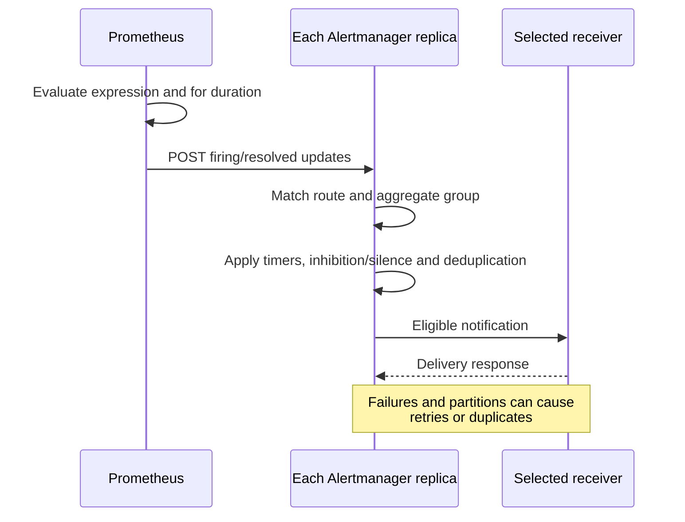
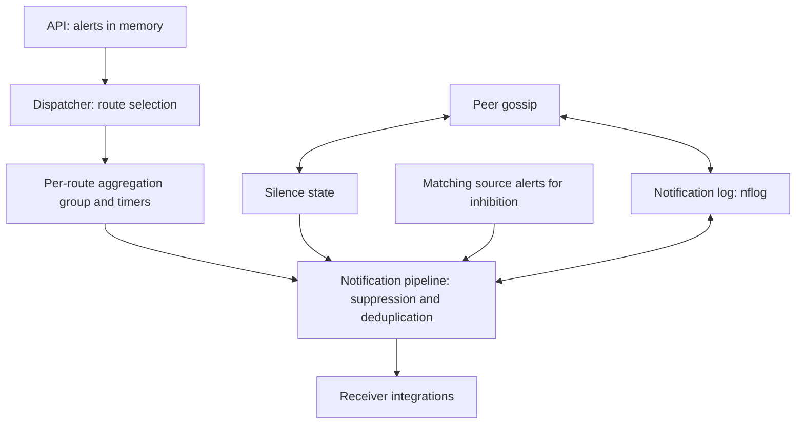
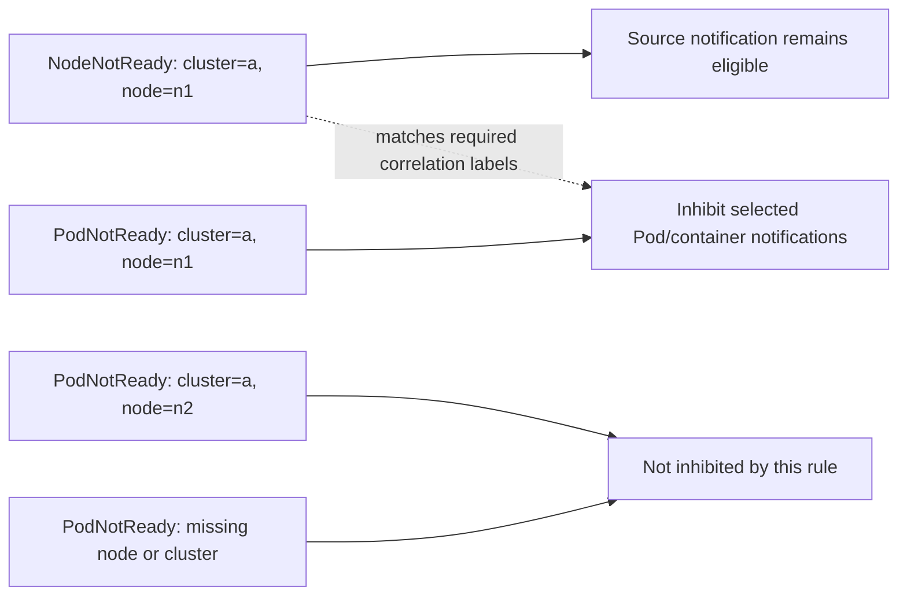
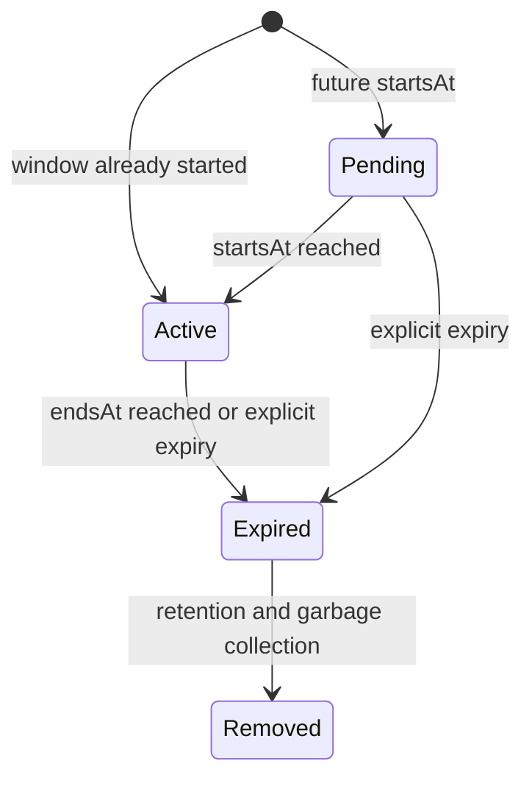

# Prometheus Alertmanager

> **Review baseline**: Alertmanager 0.34.0; kube-prometheus-stack 90.0.0 / Operator 0.93.1; standalone chart 1.43.1
> **Last Updated**: September 13, 2026

## Table of Contents

- [Alertmanager Overview](#alertmanager-overview)
- [Architecture](#architecture)
- [Installation and Configuration](#installation-and-configuration)
- [Defining Alert Rules](#defining-alert-rules)
- [Routing Configuration](#routing-configuration)
- [Receiver Configuration](#receiver-configuration)
- [Inhibition Rules](#inhibition-rules)
- [Silencing](#silencing)
- [Template Customization](#template-customization)
- [High Availability Configuration](#high-availability-configuration)
- [AlertmanagerConfig CRD](#alertmanagerconfig-crd)
- [Production Alert Rule Examples](#production-alert-rule-examples)
- [Troubleshooting](#troubleshooting)

---

## Alertmanager Overview

Prometheus Alertmanager is a component that processes alerts sent from Prometheus servers. It provides features such as deduplication, grouping, routing, inhibition, and silencing of alerts.

### Key Features

1. **Grouping** combines alerts for a route/group into notifications.
2. **Inhibition and silences** suppress notifications without changing the underlying Prometheus rule condition.
3. **Routing** selects receivers; one receiver can contain multiple integrations.
4. **HA** shares silences and notification-log state with eventual consistency. It prefers duplicate delivery during partitions to suppressing notifications; it is not exactly-once delivery.

### Prometheus Alert Flow

Prometheus evaluates rules; Alertmanager processes notifications. This sequence summarizes responsibilities, not a guarantee of delivery latency.



## Architecture

### Alertmanager Internal Structure

The dispatcher creates groups **after route selection**. Inhibition, silence/time checks and notification-log deduplication operate in the notification pipeline; they are not a fixed pre-group chain. Gossip does not replace Prometheus sending alerts to every replica. Alerts themselves are not persisted like silences/nflog.



### Component Description

| Component | Role |
|-----------|------|
| **Dispatcher** | Routes alerts to appropriate receivers based on routing tree |
| **Inhibitor** | Suppresses related alerts according to inhibition rules |
| **Silencer** | Filters alerts matching silence rules |
| **Aggregation Group** | Groups alerts in the same group for processing |
| **Notification Pipeline** | Handles actual alert sending |
| **nflog** | Records sent alerts (for deduplication) |

---

## Installation and Configuration

These are alternative examples for a Kubernetes 1.35 Linux-worker baseline. The two Helm charts and the manual StatefulSet are **different installation owners**; choose one. Charts were rendered, configuration/templates and synthetic rules were executed locally, but no Kubernetes installation, live CNI enforcement, SaaS delivery or production capacity test was performed. Existing installations need an owner-reviewed values merge and upgrade plan, not a blind replacement with this tutorial.

Prepare the `monitoring` namespace, three schedulable nodes for hard anti-affinity, a suitable default RWO StorageClass, notification credentials and approved network paths. EKS Fargate/Auto Mode and managed control-plane metrics have different collection/storage constraints. In particular, EKS-managed etcd is not a customer scrape endpoint. This profile disables Grafana and the etcd ServiceMonitor to keep the example focused; it is not an instruction to disable components in an existing stack.

### Installation via Helm (kube-prometheus-stack)

Use the pinned stack profile below for a **new release**. Version 90.0.0 contains Operator 0.93.1 and Alertmanager 0.34.0. It is a checked baseline, not a claim that no newer chart exists. Inspect cluster RBAC, CRDs, PVCs, namespaces and owner settings before installation.

```bash
helm repo add prometheus-community https://prometheus-community.github.io/helm-charts
helm repo update
helm template prometheus prometheus-community/kube-prometheus-stack   --version 90.0.0 --namespace monitoring --kube-version 1.35.0   -f kube-prometheus-stack-values.yaml > stack-rendered.yaml
# After reviewing the prerequisites and rendered resources:
helm install prometheus prometheus-community/kube-prometheus-stack   --version 90.0.0 --namespace monitoring --create-namespace   -f kube-prometheus-stack-values.yaml --wait --timeout 10m
```

### Alertmanager Dedicated Helm Chart

This is the **standalone alternative**, not an additional installation step for the stack. It uses top-level `replicaCount`, `resources`, `persistence` and `config`; the stack uses `alertmanager.alertmanagerSpec` for replicas/resources/storage. The former mixed values did not configure either chart as described.

```bash
helm template alertmanager prometheus-community/alertmanager   --version 1.43.1 --namespace monitoring --kube-version 1.35.0   -f alertmanager-values.yaml > alertmanager-rendered.yaml
helm install alertmanager prometheus-community/alertmanager   --version 1.43.1 --namespace monitoring --create-namespace   -f alertmanager-values.yaml --wait --timeout 10m
```

### values.yaml Example

The main configuration is `alertmanager.yaml` below. Its receiver credentials are file references, not token values. Create `notification-credentials` and `alertmanager-templates` before the selected workload starts. A missing file, wrong channel or invalid provider credential is not solved by a successful Helm render.

**Stack profile — `kube-prometheus-stack-values.yaml`:**

```yaml
grafana:
  enabled: false
alertmanager:
  enabled: true
  config:
    global:
      resolve_timeout: 5m
    route:
      receiver: default-receiver
      group_by:
      - cluster
      - alertname
      - namespace
      group_wait: 30s
      group_interval: 5m
      repeat_interval: 4h
      routes:
      - matchers:
        - severity="critical"
        receiver: critical-receiver
    receivers:
    - name: default-receiver
      slack_configs:
      - api_url_file: /etc/alertmanager/secrets/notification-credentials/slack-webhook-url
        channel: '#alerts'
        send_resolved: true
        title: '{{ template "slack.custom.title" . }}'
        text: '{{ template "slack.custom.text" . }}'
        color: '{{ template "slack.custom.color" . }}'
    - name: critical-receiver
      slack_configs:
      - api_url_file: /etc/alertmanager/secrets/notification-credentials/slack-webhook-url
        channel: '#critical-alerts'
        send_resolved: true
        title: '{{ template "slack.custom.title" . }}'
        text: '{{ template "slack.custom.text" . }}'
        color: '{{ template "slack.custom.color" . }}'
      pagerduty_configs:
      - routing_key_file: /etc/alertmanager/secrets/notification-credentials/pagerduty-routing-key
        send_resolved: true
        severity: '{{ if eq .CommonLabels.severity "critical" }}critical{{ else if
          eq .CommonLabels.severity "warning" }}warning{{ else }}info{{ end }}'
        description: '{{ .CommonLabels.alertname }}'
        client: Alertmanager
        client_url: https://alertmanager.example.com
        details:
          cluster: '{{ .CommonLabels.cluster }}'
          namespace: '{{ .CommonLabels.namespace }}'
    inhibit_rules:
    - source_matchers:
      - severity="critical"
      - cluster=~".+"
      - namespace=~".+"
      - alertname=~".+"
      target_matchers:
      - severity="warning"
      - cluster=~".+"
      - namespace=~".+"
      - alertname=~".+"
      equal:
      - cluster
      - namespace
      - alertname
    templates:
    - /etc/alertmanager/configmaps/alertmanager-templates/*.tmpl
  podDisruptionBudget:
    enabled: true
    minAvailable: 2
  alertmanagerSpec:
    replicas: 3
    retention: 120h
    resources:
      requests:
        cpu: 100m
        memory: 256Mi
      limits:
        cpu: 500m
        memory: 512Mi
    podAntiAffinity: hard
    secrets:
    - notification-credentials
    configMaps:
    - alertmanager-templates
    storage:
      volumeClaimTemplate:
        spec:
          accessModes:
          - ReadWriteOnce
          resources:
            requests:
              storage: 10Gi
    automountServiceAccountToken: false
  serviceAccount:
    automountServiceAccountToken: false
prometheus:
  prometheusSpec:
    externalLabels:
      cluster: example-cluster
    ruleSelectorNilUsesHelmValues: false
    ruleSelector:
      matchLabels:
        release: prometheus
    ruleNamespaceSelector:
      matchLabels:
        kubernetes.io/metadata.name: monitoring
kubeEtcd:
  enabled: false
```

**Standalone profile — `alertmanager-values.yaml`:**

```yaml
replicaCount: 3
automountServiceAccountToken: false
resources:
  requests:
    cpu: 100m
    memory: 256Mi
  limits:
    cpu: 500m
    memory: 512Mi
podAntiAffinity: hard
podDisruptionBudget:
  minAvailable: 2
persistence:
  enabled: true
  size: 10Gi
config:
  global:
    resolve_timeout: 5m
  route:
    receiver: default-receiver
    group_by:
    - cluster
    - alertname
    - namespace
    group_wait: 30s
    group_interval: 5m
    repeat_interval: 4h
    routes:
    - matchers:
      - severity="critical"
      receiver: critical-receiver
  receivers:
  - name: default-receiver
    slack_configs:
    - api_url_file: /etc/alertmanager/secrets/notification-credentials/slack-webhook-url
      channel: '#alerts'
      send_resolved: true
      title: '{{ template "slack.custom.title" . }}'
      text: '{{ template "slack.custom.text" . }}'
      color: '{{ template "slack.custom.color" . }}'
  - name: critical-receiver
    slack_configs:
    - api_url_file: /etc/alertmanager/secrets/notification-credentials/slack-webhook-url
      channel: '#critical-alerts'
      send_resolved: true
      title: '{{ template "slack.custom.title" . }}'
      text: '{{ template "slack.custom.text" . }}'
      color: '{{ template "slack.custom.color" . }}'
    pagerduty_configs:
    - routing_key_file: /etc/alertmanager/secrets/notification-credentials/pagerduty-routing-key
      send_resolved: true
      severity: '{{ if eq .CommonLabels.severity "critical" }}critical{{ else if eq
        .CommonLabels.severity "warning" }}warning{{ else }}info{{ end }}'
      description: '{{ .CommonLabels.alertname }}'
      client: Alertmanager
      client_url: https://alertmanager.example.com
      details:
        cluster: '{{ .CommonLabels.cluster }}'
        namespace: '{{ .CommonLabels.namespace }}'
  inhibit_rules:
  - source_matchers:
    - severity="critical"
    - cluster=~".+"
    - namespace=~".+"
    - alertname=~".+"
    target_matchers:
    - severity="warning"
    - cluster=~".+"
    - namespace=~".+"
    - alertname=~".+"
    equal:
    - cluster
    - namespace
    - alertname
  templates:
  - /etc/alertmanager/configmaps/alertmanager-templates/*.tmpl
  enabled: true
extraSecretMounts:
- name: notification-credentials
  secretName: notification-credentials
  mountPath: /etc/alertmanager/secrets/notification-credentials
  readOnly: true
extraVolumes:
- name: alertmanager-templates
  configMap:
    name: alertmanager-templates
extraVolumeMounts:
- name: alertmanager-templates
  mountPath: /etc/alertmanager/configmaps/alertmanager-templates
  readOnly: true
hostUsers: true
```

`hostUsers: true` keeps the standalone baseline in the traditional user namespace; enabling Pod user namespaces requires separate runtime/platform checks. Resource requests/limits and 10Gi PVCs are illustrative sizing, not a tested capacity claim. Hard anti-affinity needs three eligible nodes. PDBs constrain voluntary disruptions, not all failures.

### Direct Configuration via ConfigMap

The complete core configuration below is also embedded in the chart profiles. For the manual deployment, save it as `alertmanager.yaml` and put its contents in ConfigMap key `alertmanager.yml`. The ConfigMap contains paths and routing metadata, **not credentials**. Do not mix this manual owner with the Operator-generated Secret.

```yaml
global:
  resolve_timeout: 5m
route:
  receiver: default-receiver
  group_by:
  - cluster
  - alertname
  - namespace
  group_wait: 30s
  group_interval: 5m
  repeat_interval: 4h
  routes:
  - matchers:
    - severity="critical"
    receiver: critical-receiver
receivers:
- name: default-receiver
  slack_configs:
  - api_url_file: /etc/alertmanager/secrets/notification-credentials/slack-webhook-url
    channel: '#alerts'
    send_resolved: true
    title: '{{ template "slack.custom.title" . }}'
    text: '{{ template "slack.custom.text" . }}'
    color: '{{ template "slack.custom.color" . }}'
- name: critical-receiver
  slack_configs:
  - api_url_file: /etc/alertmanager/secrets/notification-credentials/slack-webhook-url
    channel: '#critical-alerts'
    send_resolved: true
    title: '{{ template "slack.custom.title" . }}'
    text: '{{ template "slack.custom.text" . }}'
    color: '{{ template "slack.custom.color" . }}'
  pagerduty_configs:
  - routing_key_file: /etc/alertmanager/secrets/notification-credentials/pagerduty-routing-key
    send_resolved: true
    severity: '{{ if eq .CommonLabels.severity "critical" }}critical{{ else if eq
      .CommonLabels.severity "warning" }}warning{{ else }}info{{ end }}'
    description: '{{ .CommonLabels.alertname }}'
    client: Alertmanager
    client_url: https://alertmanager.example.com
    details:
      cluster: '{{ .CommonLabels.cluster }}'
      namespace: '{{ .CommonLabels.namespace }}'
inhibit_rules:
- source_matchers:
  - severity="critical"
  - cluster=~".+"
  - namespace=~".+"
  - alertname=~".+"
  target_matchers:
  - severity="warning"
  - cluster=~".+"
  - namespace=~".+"
  - alertname=~".+"
  equal:
  - cluster
  - namespace
  - alertname
templates:
- /etc/alertmanager/configmaps/alertmanager-templates/*.tmpl
```

```bash
# The directory/files must already contain approved credentials; do not commit them.
credential_dir="$PWD/private-notification-credentials"
chmod 700 "$credential_dir"
chmod 600 "$credential_dir"/*
kubectl -n monitoring create secret generic notification-credentials   --from-file=slack-webhook-url="$credential_dir/slack-webhook-url"   --from-file=pagerduty-routing-key="$credential_dir/pagerduty-routing-key"
# Optional integrations need their own additional files; rotate existing Secrets separately.
```

```bash
kubectl -n monitoring create configmap alertmanager-config   --from-file=alertmanager.yml=alertmanager.yaml
```

Protect Secret read/exec permissions and the notification content itself. Add only the credential files required by enabled integrations. ConfigMap projection is not automatic Alertmanager reload: use the chosen owner’s reviewed reload/rollout mechanism; invalid reloads should leave the last good configuration running.

## Defining Alert Rules

### PrometheusRule CRD

A PrometheusRule must match the Prometheus instance’s **rule label and namespace selectors**. These examples use `release: prometheus` in `monitoring`, matching the explicit stack values. Installing a CR alone does not prove it was selected or successfully loaded. Compare the active rules and scrape labels after deployment. Avoid duplicate alerts with the stack’s existing rule set.

```yaml
apiVersion: monitoring.coreos.com/v1
kind: PrometheusRule
metadata:
  name: kubernetes-alerts
  namespace: monitoring
  labels:
    release: prometheus
spec:
  groups:
  - name: kubernetes.rules
    interval: 30s
    rules:
    - alert: NodeNotReady
      expr: max by (node) (kube_node_status_condition{condition="Ready",status="true"})
        == 0
      for: 5m
      labels:
        severity: critical
        team: sre
      annotations:
        summary: Node {{ $labels.node }} is not ready
        description: Node {{ $labels.node }} has been not ready for more than 5 minutes.
        runbook_url: https://runbooks.example.com/node-not-ready
```

### Alert Rule Components

`alert` and `expr` identify the rule and its expression. A non-empty result vector identifies active alert instances, even when its sample value is zero. `for` is checked across rule evaluations; it is not the scrape interval or notification deadline. `labels` affect alert identity/routing; keep changing values in `annotations`, not labels. Optional `keep_firing_for` retains Firing for a period after the condition clears. Check its support in the deployed Prometheus/Operator versions.

### Alert States

Prometheus state illustration for a positive for duration with keep_firing_for unset; zero-for rules can fire immediately at the matching evaluation.


[Interactive diagram](https://www.atomai.click/kubernetes-docs/archmaps/en-observability-alerting-01-alertmanager-2.html)

## Routing Configuration

### Routing Tree Structure

The following **routing-test configuration** declares all receiver names but leaves their integrations empty. It will not deliver notifications until an approved integration is attached. The first matching sibling normally stops sibling traversal; children may select a more specific receiver.

```yaml
route:
  receiver: default-receiver
  group_by:
  - cluster
  - alertname
  - namespace
  group_wait: 30s
  group_interval: 5m
  repeat_interval: 4h
  routes:
  - matchers:
    - severity="critical"
    receiver: critical-receiver
    group_wait: 10s
  - matchers:
    - service=~"foo|bar"
    receiver: service-team
    routes:
    - matchers:
      - owner="team-a"
      receiver: team-a
receivers:
- name: default-receiver
- name: critical-receiver
- name: service-team
- name: team-a
```

### Routing Flow

Label-only routing with continue=false. The diagram uses legacy match/match_re notation; the equivalent checked configuration uses matchers. Time-window eligibility is separate.


[Interactive diagram](https://www.atomai.click/kubernetes-docs/archmaps/en-observability-alerting-01-alertmanager-3.html)

### Matchers

Use quoted matcher strings with `=`, `!=`, `=~` or `!~`. Matchers in one route are ANDed; regex semantics are fully anchored. Empty/missing labels matter. The old `match`/`match_re` fields remain accepted in this release but are deprecated. Group timers inherit from parent routes; active/mute time intervals do not.

```yaml
# Alternative child-route fragments; attach to a complete configuration.
routes:
  - matchers: ['severity="critical"', 'namespace="production"']
    receiver: prod-critical
  - matchers: ['service=~"(api|web|worker).*"', 'environment=~"prod.*"']
    receiver: prod-team
```

### Advanced Routing Example

Split an overnight interval at midnight and specify the timezone in **each** interval entry. The old `18:00→09:00` range fails native validation. This flat example puts time constraints on the actual receiver routes. The off-hours critical route uses `continue: true`: an inactive route still matches labels and otherwise stops later siblings, so it must not swallow the business-hours route. Empty receiver integrations here are intentional test stubs.

```yaml
route:
  receiver: 'null'
  group_by:
  - cluster
  - alertname
  - namespace
  group_wait: 30s
  group_interval: 5m
  repeat_interval: 4h
  routes:
  - matchers:
    - severity="critical"
    receiver: oncall
    active_time_intervals:
    - offhours
    continue: true
  - matchers:
    - team="infra"
    receiver: infra-team
    active_time_intervals:
    - business-hours
  - matchers:
    - team="dev"
    receiver: dev-team
    active_time_intervals:
    - business-hours
  - receiver: team-slack
    active_time_intervals:
    - business-hours
receivers:
- name: 'null'
- name: oncall
- name: infra-team
- name: dev-team
- name: team-slack
time_intervals:
- name: business-hours
  time_intervals:
  - weekdays:
    - monday:friday
    times:
    - start_time: 09:00
      end_time: '18:00'
    location: Asia/Seoul
- name: offhours
  time_intervals:
  - weekdays:
    - monday:friday
    times:
    - start_time: 00:00
      end_time: 09:00
    - start_time: '18:00'
      end_time: '24:00'
    location: Asia/Seoul
  - weekdays:
    - saturday
    - sunday
    location: Asia/Seoul
```

Native label-route tests do not evaluate the calendar. The calendar was separately checked with the released time-interval implementation at opening/closing boundaries, weekends and UTC/KST offsets. A muted or inactive notification is not automatically redirected to the parent’s fallback.

## Receiver Configuration

### Slack Receiver

Use `api_url_file` for a protected webhook URL file. The checked custom template prints an approved subset of fields; do not dump all labels/annotations. These can contain user data or secrets, and truncation is not redaction. These are receiver fragments for a complete configuration.

```yaml
receivers:
- name: slack-notifications
  slack_configs:
  - api_url_file: /etc/alertmanager/secrets/notification-credentials/slack-webhook-url
    channel: '#alerts'
    send_resolved: true
    title: '{{ template "slack.custom.title" . }}'
    text: '{{ template "slack.custom.text" . }}'
    color: '{{ template "slack.custom.color" . }}'
```

### PagerDuty Receiver

Use Events API v2 `routing_key_file`; the legacy Prometheus integration uses a different service-key mode, not the same credential. Never set both. Map severities to supported PagerDuty values; arbitrary Alertmanager severity strings are not automatically valid. These are receiver fragments for a complete configuration.

```yaml
receivers:
- name: pagerduty-critical
  pagerduty_configs:
  - routing_key_file: /etc/alertmanager/secrets/notification-credentials/pagerduty-routing-key
    send_resolved: true
    severity: '{{ if eq .CommonLabels.severity "critical" }}critical{{ else if eq
      .CommonLabels.severity "warning" }}warning{{ else }}info{{ end }}'
    description: '{{ .CommonLabels.alertname }}'
    client: Alertmanager
    client_url: https://alertmanager.example.com
    details:
      cluster: '{{ .CommonLabels.cluster }}'
      namespace: '{{ .CommonLabels.namespace }}'
```

### Email Receiver

Use `auth_password_file` and require TLS with a valid SMTP trust configuration. The addresses are placeholders; review relay policy, sender identity and delivery/bounce monitoring. These are receiver fragments for a complete configuration.

```yaml
receivers:
- name: email-alerts
  email_configs:
  - to: team@example.com
    from: alertmanager@example.com
    smarthost: smtp.example.com:587
    auth_username: alertmanager@example.com
    auth_password_file: /etc/alertmanager/secrets/notification-credentials/smtp-password
    require_tls: true
    send_resolved: true
    headers:
      Subject: '[{{ .Status | toUpper }}] {{ .CommonLabels.alertname }}'
    html: '{{ template "email.default.html" . }}'
```

### OpsGenie Receiver

This is an **existing-customer migration reference**. Opsgenie sales ended June 4, 2025; support/access ends April 5, 2027 according to [Atlassian](https://www.atlassian.com/licensing/opsgenie). Do not design a new long-lived dependency around it. Use the current `responders` form and a protected key file. These are receiver fragments for a complete configuration.

```yaml
receivers:
- name: opsgenie-existing
  opsgenie_configs:
  - api_key_file: /etc/alertmanager/secrets/notification-credentials/opsgenie-api-key
    api_url: https://api.opsgenie.com/
    send_resolved: true
    message: '{{ .CommonLabels.alertname }}'
    priority: '{{ if eq .CommonLabels.severity "critical" }}P1{{ else if eq .CommonLabels.severity
      "warning" }}P3{{ else }}P5{{ end }}'
    responders:
    - name: sre-team
      type: team
```

### Webhook Receiver

Basic authentication needs HTTPS; `insecure_skip_verify: false` does not encrypt an `http://` URL. Supply the owned receiver, matching TLS certificate/trust and mounted credential files. With `max_alerts: 10`, the payload can omit alerts and reports `truncatedAlerts`; consumers must handle that. A receiver must implement the Alertmanager webhook contract, not merely return a generic health response. These are receiver fragments for a complete configuration.

```yaml
receivers:
- name: webhook-receiver
  webhook_configs:
  - url: https://alert-webhook.monitoring.svc:8443/alerts
    send_resolved: true
    max_alerts: 10
    http_config:
      basic_auth:
        username: alertmanager
        password_file: /etc/alertmanager/secrets/notification-credentials/webhook-password
      tls_config:
        ca_file: /etc/alertmanager/secrets/notification-credentials/webhook-ca.crt
        insecure_skip_verify: false
```

### Multiple Receiver Configuration

A receiver can notify several integrations without `continue`. Provider failures and retries are independent; success at one provider does not establish success at all providers. This example needs every listed provider’s files and SMTP/TLS configuration. These are receiver fragments for a complete configuration.

```yaml
receivers:
- name: team-all
  slack_configs:
  - api_url_file: /etc/alertmanager/secrets/notification-credentials/slack-webhook-url
    channel: '#alerts'
    send_resolved: true
    title: '{{ template "slack.custom.title" . }}'
    text: '{{ template "slack.custom.text" . }}'
    color: '{{ template "slack.custom.color" . }}'
  email_configs:
  - to: team@example.com
    from: alertmanager@example.com
    smarthost: smtp.example.com:587
    auth_username: alertmanager@example.com
    auth_password_file: /etc/alertmanager/secrets/notification-credentials/smtp-password
    require_tls: true
    send_resolved: true
    headers:
      Subject: '[{{ .Status | toUpper }}] {{ .CommonLabels.alertname }}'
    html: '{{ template "email.default.html" . }}'
  pagerduty_configs:
  - routing_key_file: /etc/alertmanager/secrets/notification-credentials/pagerduty-routing-key
    send_resolved: true
    severity: '{{ if eq .CommonLabels.severity "critical" }}critical{{ else if eq
      .CommonLabels.severity "warning" }}warning{{ else }}info{{ end }}'
    description: '{{ .CommonLabels.alertname }}'
    client: Alertmanager
    client_url: https://alertmanager.example.com
    details:
      cluster: '{{ .CommonLabels.cluster }}'
      namespace: '{{ .CommonLabels.namespace }}'
```

## Inhibition Rules

### Inhibition Concept

Inhibition suppresses matching **notifications**, not rule evaluation or the stored alert. Scope the relationship with non-empty labels. A node condition cannot justify suppressing every service alert in the cluster.



### Inhibition Rule Configuration

The first rule uses `NodeNotReady` with the `node` label from kube-state-metrics. The Pod rules below add node information using `kube_pod_info`, retaining an alert without enrichment if that metric is missing. A missing label compares like an empty value: require non-empty `cluster`/`node` before equality matching. Local tests reproduced the old unrelated-alert suppression and verified the guards.

`ClusterDown` requires an independently delivered source alert when the monitored cluster cannot send. Database rules require a stable shared `database_id`, not unrelated scrape `instance` labels. Define those inputs before enabling their rules.

```yaml
route:
  receiver: 'null'
receivers:
- name: 'null'
inhibit_rules:
- source_matchers:
  - alertname="NodeNotReady"
  - cluster=~".+"
  - node=~".+"
  target_matchers:
  - alertname=~"PodNotReady|PodCrashLooping|ContainerOOMKilled"
  - cluster=~".+"
  - node=~".+"
  equal:
  - cluster
  - node
- source_matchers:
  - severity="critical"
  - cluster=~".+"
  - namespace=~".+"
  - alertname=~".+"
  target_matchers:
  - severity="warning"
  - cluster=~".+"
  - namespace=~".+"
  - alertname=~".+"
  equal:
  - cluster
  - namespace
  - alertname
- source_matchers:
  - alertname="ClusterDown"
  - cluster=~".+"
  target_matchers:
  - alertname=~"Node.*"
  - cluster=~".+"
  equal:
  - cluster
- source_matchers:
  - alertname="DatabaseDown"
  - cluster=~".+"
  - database_id=~".+"
  target_matchers:
  - alertname=~"DatabaseConnection.*|DatabaseTimeout.*"
  - cluster=~".+"
  - database_id=~".+"
  equal:
  - cluster
  - database_id
```

### Inhibition Priority

The list order is **not a priority system**. Any applicable inhibition rule may suppress a target. Model infrastructure→node→service dependencies with disjoint source/target matchers and non-empty correlation labels, then test unrelated nodes/clusters and missing labels. A broad `alertname=~".*"` plus a missing `datacenter` can mute unrelated incidents. Do not infer causal relationships from severity alone.

## Silencing

### Creating Silences

Silence creation/expiry changes notification behavior. Review the endpoint, exact matchers, author, reason and finite window. `--end` requires a deliberately chosen future RFC3339 time; the former fixed 2025 window cannot silence current alerts. Protect HTTP access with the supported TLS/authentication configuration; `amtool --http.config.file` accepts a protected client configuration file.

#### Using amtool CLI

```bash
# Use an approved authenticated endpoint, or an authorized local port-forward.
: "${ALERTMANAGER_URL:?Set the reviewed Alertmanager URL}"
amtool --alertmanager.url="$ALERTMANAGER_URL" silence add   'alertname="PodCrashLooping"' 'namespace="development"'   --duration=2h --comment="Approved deployment window" --author="operator"
amtool --alertmanager.url="$ALERTMANAGER_URL" silence query
# Copy the specific UUID from the approved operation, never a blanket selection.
: "${SILENCE_ID:?Set the exact silence UUID}"
amtool --alertmanager.url="$ALERTMANAGER_URL" silence expire "$SILENCE_ID"
```

#### Creating Silence via API

Save the output of this helper as `silence.json`, review it, and POST it to the approved `/api/v2/silences` endpoint with the configured authentication. Do not put credential values in command arguments or share raw API payloads containing operational data.

```python
# Generates a payload only; it makes no API call.
import datetime
import json
now = datetime.datetime.now(datetime.timezone.utc)
print(json.dumps({
    "matchers": [
        {"name": "alertname", "value": "HighCPU", "isRegex": False, "isEqual": True},
        {"name": "namespace", "value": "development", "isRegex": False, "isEqual": True}
    ],
    "startsAt": now.isoformat(),
    "endsAt": (now + datetime.timedelta(hours=2)).isoformat(),
    "createdBy": "operator",
    "comment": "Approved maintenance window"
}, indent=2))
```

### Silence Management Best Practices

Use the shortest approved maintenance/deployment window and a bounded investigation period. “Until fixed” still needs a finite end time and owner review; four hours is an example team policy, not an Alertmanager limit. Expiration stops suppression but the expired record remains until retention/GC. Local API tests verified this distinction. Expiry reminders need a separate configured workflow.



## Template Customization

### Go Template Basics

Notification templates receive `Data`: use `.CommonLabels`, `.CommonAnnotations`, `.GroupLabels` and `.Alerts` at the root. Inside `range .Alerts`, the dot is an individual Alert with `.Labels`, `.Annotations` and `.StartsAt`. This differs from Prometheus rule annotation templates (`$labels`, `$value`). Do not use `safeHtml`/`safeUrl` on untrusted data to bypass escaping. Templates must be mounted and listed in configuration.

### Slack Template Example

Save as `slack.tmpl`. Whitespace trimming keeps the color result a single valid color string. Only approved fields are printed; this template does not sanitize arbitrary sensitive annotation values.

```text
{{ define "slack.custom.title" -}}
[{{ .Status | toUpper }}{{ if eq .Status "firing" }}:{{ len .Alerts.Firing }}{{ end }}] {{ .CommonLabels.alertname }}
{{- end }}
{{ define "slack.custom.text" -}}
{{ range .Alerts -}}
*Alert:* {{ .Labels.alertname }}
*Severity:* {{ .Labels.severity }}
*Cluster:* {{ .Labels.cluster }}
*Namespace:* {{ .Labels.namespace }}
*Summary:* {{ printf "%.100s" .Annotations.summary }}
*Started:* {{ .StartsAt.Format "2006-01-02 15:04:05 MST" }}
{{ end -}}
{{- end }}
{{ define "slack.custom.color" -}}
{{ if eq .Status "firing" }}{{ if eq .CommonLabels.severity "critical" }}#ff0000{{ else }}#ff9900{{ end }}{{ else }}#36a64f{{ end }}
{{- end }}
{{ define "custom.message" -}}
{{ .CommonLabels.alertname | title }}
{{ range .Alerts -}}
{{ .Labels.namespace | toUpper }}: {{ printf "%.100s" .Annotations.description }}
{{ .StartsAt.Format "2006-01-02 15:04" }}
{{ end -}}
{{ printf "%.2f%%" 95.5 }}
{{- end }}
```

### Template Functions

Use `if`, `range`, pipes and functions such as `toUpper`, `title`, `printf` and `date`. Go templates do not have JavaScript-style ternary expressions. `printf "%.100s"` limits a string by runes; a byte `slice` can split Korean UTF-8. The template above demonstrates root versus per-alert context and numeric formatting.

Test with synthetic notification Data, not production payloads:

Save this synthetic template-only input as `synthetic-notification.json`; its timestamps do not create or send an alert.

```json
{
  "receiver": "local-test",
  "status": "firing",
  "groupLabels": {
    "alertname": "HighCPU"
  },
  "commonLabels": {
    "alertname": "HighCPU",
    "severity": "critical"
  },
  "commonAnnotations": {},
  "externalURL": "https://alertmanager.example.com",
  "alerts": [
    {
      "status": "firing",
      "labels": {
        "alertname": "HighCPU",
        "namespace": "demo",
        "cluster": "example-cluster",
        "severity": "critical"
      },
      "annotations": {
        "summary": "Synthetic example",
        "description": "Synthetic example"
      },
      "startsAt": "2026-09-13T00:00:00Z",
      "endsAt": "2026-09-13T01:00:00Z",
      "generatorURL": "",
      "fingerprint": "synthetic"
    }
  ]
}
```

```bash
amtool template render --template.glob=slack.tmpl   --template.data=synthetic-notification.json   --template.text='{{ template "slack.custom.title" . }}'
```

### Managing Templates via ConfigMap

The stack profile mounts this ConfigMap through `alertmanagerSpec.configMaps`; the standalone profile uses an explicit volume. Both configure `/etc/alertmanager/configmaps/alertmanager-templates/*.tmpl`. Creating a ConfigMap without a matching mount/path does nothing. Reload through the selected installation owner.

```yaml
apiVersion: v1
kind: ConfigMap
metadata:
  name: alertmanager-templates
  namespace: monitoring
data:
  slack.tmpl: '{{ define "slack.custom.title" -}}

    [{{ .Status | toUpper }}{{ if eq .Status "firing" }}:{{ len .Alerts.Firing }}{{
    end }}] {{ .CommonLabels.alertname }}

    {{- end }}

    {{ define "slack.custom.text" -}}

    {{ range .Alerts -}}

    *Alert:* {{ .Labels.alertname }}

    *Severity:* {{ .Labels.severity }}

    *Cluster:* {{ .Labels.cluster }}

    *Namespace:* {{ .Labels.namespace }}

    *Summary:* {{ printf "%.100s" .Annotations.summary }}

    *Started:* {{ .StartsAt.Format "2006-01-02 15:04:05 MST" }}

    {{ end -}}

    {{- end }}

    {{ define "slack.custom.color" -}}

    {{ if eq .Status "firing" }}{{ if eq .CommonLabels.severity "critical" }}#ff0000{{
    else }}#ff9900{{ end }}{{ else }}#36a64f{{ end }}

    {{- end }}

    {{ define "custom.message" -}}

    {{ .CommonLabels.alertname | title }}

    {{ range .Alerts -}}

    {{ .Labels.namespace | toUpper }}: {{ printf "%.100s" .Annotations.description
    }}

    {{ .StartsAt.Format "2006-01-02 15:04" }}

    {{ end -}}

    {{ printf "%.2f%%" 95.5 }}

    {{- end }}

    '
```

## High Availability Configuration

### Clustering Architecture

Healthy, converged HA example: every replica receives the alerts. The illustrated single delivery is not a universal guarantee; partitions or retries can produce duplicates.


[Interactive diagram](https://www.atomai.click/kubernetes-docs/archmaps/en-observability-alerting-01-alertmanager-6.html)

### StatefulSet Configuration

This is the **manual alternative**, using the preceding ConfigMap, templates and credential Secret. The API/UI and gossip ports are internal services, not authenticated merely because they are ClusterIP. Enforce appropriate network access and review the [supported TLS/authentication configuration](https://github.com/prometheus/alertmanager/blob/v0.34.0/docs/https.md) before production. Gossip is unencrypted by default; its experimental mutual-TLS transport has different TCP-only behavior. The baseline below shows ordinary TCP/UDP gossip, not a validated secure production topology.

Parallel pod startup, headless DNS for not-yet-ready peers, both gossip protocols and persistent state are explicit. `publishNotReadyAddresses` aids peer discovery; it does not make an unready member healthy. Alerts themselves are not persisted; Prometheus must resend them. Review StorageClass/AZ binding, disruption and resource sizing.

```yaml
apiVersion: apps/v1
kind: StatefulSet
metadata:
  name: alertmanager-demo
  namespace: monitoring
spec:
  serviceName: alertmanager-demo
  podManagementPolicy: Parallel
  replicas: 3
  selector:
    matchLabels:
      app: alertmanager-demo
  template:
    metadata:
      labels:
        app: alertmanager-demo
    spec:
      automountServiceAccountToken: false
      securityContext:
        runAsNonRoot: true
        runAsUser: 65534
        runAsGroup: 65534
        fsGroup: 65534
        seccompProfile:
          type: RuntimeDefault
      affinity:
        podAntiAffinity:
          requiredDuringSchedulingIgnoredDuringExecution:
          - labelSelector:
              matchLabels:
                app: alertmanager-demo
            topologyKey: kubernetes.io/hostname
      containers:
      - name: alertmanager
        image: quay.io/prometheus/alertmanager:v0.34.0
        args:
        - --config.file=/etc/alertmanager/config-main/alertmanager.yml
        - --storage.path=/alertmanager
        - --data.retention=120h
        - --cluster.listen-address=0.0.0.0:9094
        - --cluster.peer=alertmanager-demo-0.alertmanager-demo.monitoring.svc:9094
        - --cluster.peer=alertmanager-demo-1.alertmanager-demo.monitoring.svc:9094
        - --cluster.peer=alertmanager-demo-2.alertmanager-demo.monitoring.svc:9094
        ports:
        - name: http
          containerPort: 9093
        - name: gossip-tcp
          containerPort: 9094
          protocol: TCP
        - name: gossip-udp
          containerPort: 9094
          protocol: UDP
        securityContext:
          allowPrivilegeEscalation: false
          readOnlyRootFilesystem: true
          capabilities:
            drop:
            - ALL
        readinessProbe:
          httpGet:
            path: /-/ready
            port: http
          periodSeconds: 5
        livenessProbe:
          httpGet:
            path: /-/healthy
            port: http
          initialDelaySeconds: 10
          periodSeconds: 10
        volumeMounts:
        - name: config
          mountPath: /etc/alertmanager/config-main
          readOnly: true
        - name: templates
          mountPath: /etc/alertmanager/configmaps/alertmanager-templates
          readOnly: true
        - name: credentials
          mountPath: /etc/alertmanager/secrets/notification-credentials
          readOnly: true
        - name: storage
          mountPath: /alertmanager
        resources:
          requests:
            cpu: 100m
            memory: 256Mi
          limits:
            cpu: 500m
            memory: 512Mi
      volumes:
      - name: config
        configMap:
          name: alertmanager-config
      - name: templates
        configMap:
          name: alertmanager-templates
      - name: credentials
        secret:
          secretName: notification-credentials
  volumeClaimTemplates:
  - metadata:
      name: storage
    spec:
      accessModes:
      - ReadWriteOnce
      resources:
        requests:
          storage: 10Gi
---
apiVersion: v1
kind: Service
metadata:
  name: alertmanager-demo
  namespace: monitoring
spec:
  clusterIP: None
  publishNotReadyAddresses: true
  selector:
    app: alertmanager-demo
  ports:
  - name: http
    port: 9093
    targetPort: http
  - name: gossip-tcp
    port: 9094
    targetPort: gossip-tcp
    protocol: TCP
  - name: gossip-udp
    port: 9094
    targetPort: gossip-udp
    protocol: UDP
---
apiVersion: policy/v1
kind: PodDisruptionBudget
metadata:
  name: alertmanager-demo
  namespace: monitoring
spec:
  minAvailable: 2
  selector:
    matchLabels:
      app: alertmanager-demo
```

### Prometheus Integration Configuration

Merge this fragment into the **manual Prometheus owner’s** full configuration. Choose DNS discovery or an explicit list of every replica, not both duplicate lists. Do not load-balance notifications across replicas. The Operator stack manages its own alerting discovery.

Only remove `prometheus_replica` when it is the configured distinguishing label of otherwise equivalent HA Prometheus servers. Keep cluster/tenant labels; indiscriminately dropping labels can merge unrelated alerts. This example uses IPv4 DNS A records; use the deployed address-family configuration for IPv6.

```yaml
global:
  external_labels:
    cluster: example-cluster
alerting:
  alert_relabel_configs:
  - action: labeldrop
    regex: prometheus_replica
  alertmanagers:
  - dns_sd_configs:
    - names:
      - alertmanager-demo.monitoring.svc.cluster.local
      type: A
      port: 9093
```

## AlertmanagerConfig CRD

### Namespace-Scoped Configuration

The packaged Operator 0.93.1 CRD still serves/stores **v1alpha1**. Align the object label with the selection overlay below, and explicitly select approved namespaces. Default/on-namespace matching restricts imported routes/inhibition to the object’s namespace; it is not authentication of client-supplied alert labels. Protect CRD/Secret write access and trusted alert ingestion. Global `alertmanagerConfiguration` is a separate mode, not shown here.

```yaml
apiVersion: v1
kind: Namespace
metadata:
  name: team-a
  labels:
    monitoring.example.com/alert-configs: 'true'
---
apiVersion: monitoring.coreos.com/v1alpha1
kind: AlertmanagerConfig
metadata:
  name: team-a-config
  namespace: team-a
  labels:
    alertmanagerConfig: enabled
spec:
  route:
    receiver: team-a-slack
    groupBy:
    - alertname
    - namespace
    matchers:
    - name: namespace
      value: team-a
      matchType: '='
    routes:
    - receiver: team-a-critical
      matchers:
      - name: severity
        value: critical
        matchType: '='
  receivers:
  - name: team-a-slack
    slackConfigs:
    - apiURL:
        name: slack-webhook-secret
        key: webhook-url
      channel: '#team-a-alerts'
      sendResolved: true
  - name: team-a-critical
    slackConfigs:
    - apiURL:
        name: slack-webhook-secret
        key: webhook-url
      channel: '#team-a-critical'
      sendResolved: true
    pagerdutyConfigs:
    - routingKey:
        name: pagerduty-secret
        key: routing-key
      sendResolved: true
  inhibitRules:
  - sourceMatch:
    - name: severity
      value: critical
      matchType: '='
    - name: cluster
      value: .+
      matchType: =~
    - name: alertname
      value: .+
      matchType: =~
    targetMatch:
    - name: severity
      value: warning
      matchType: '='
    - name: cluster
      value: .+
      matchType: =~
    - name: alertname
      value: .+
      matchType: =~
    equal:
    - cluster
    - namespace
    - alertname
```

### Secret Reference

Create the namespace before these Secrets, and the Secrets before the selected configuration is reconciled. Their names/keys must match the AlertmanagerConfig and reside in its namespace. Keep local credential files private and rotate existing Secrets separately.

```bash
# team-a namespace is declared in team-a-alertmanagerconfig.yaml.
# Supply protected files, without exposing values in argv or committed YAML.
kubectl -n team-a create secret generic slack-webhook-secret   --from-file=webhook-url=private-team-a/slack-webhook-url
kubectl -n team-a create secret generic pagerduty-secret   --from-file=routing-key=private-team-a/pagerduty-routing-key
```

### Alertmanager AlertmanagerConfig Selection

This is a **kube-prometheus-stack values overlay**, not an Alertmanager API object. Merge it with the selected stack profile. The former `team-a` versus `enabled` label mismatch selected no configuration. The explicit namespace label avoids selecting every namespace accidentally.

```yaml
alertmanager:
  alertmanagerSpec:
    alertmanagerConfigSelector:
      matchLabels:
        alertmanagerConfig: enabled
    alertmanagerConfigNamespaceSelector:
      matchLabels:
        monitoring.example.com/alert-configs: 'true'
    alertmanagerConfigMatcherStrategy:
      type: OnNamespace
```

## Production Alert Rule Examples

### Node Alerts

Node-exporter scrape failure is not proof that a node is physically down; `NodeExporterUnavailable` reflects that distinction. Filesystem space is not the Kubernetes DiskPressure condition, so the rule is named `NodeFilesystemSpaceLow`. Check actual job/instance/device labels and read-only filesystems. The thresholds are policy examples, not universal production limits.

```yaml
apiVersion: monitoring.coreos.com/v1
kind: PrometheusRule
metadata:
  name: node-alerts
  namespace: monitoring
  labels:
    release: prometheus
spec:
  groups:
  - name: node.rules
    rules:
    - alert: NodeExporterUnavailable
      expr: up{job="node-exporter"} == 0
      for: 5m
      labels:
        severity: critical
        team: sre
      annotations:
        summary: Node {{ $labels.instance }} is down
        description: Node exporter is not responding for more than 5 minutes.
    - alert: NodeHighCPU
      expr: 100 - (avg by(instance) (rate(node_cpu_seconds_total{mode="idle"}[5m]))
        * 100) > 80
      for: 10m
      labels:
        severity: warning
        team: sre
      annotations:
        summary: High CPU usage on {{ $labels.instance }}
        description: CPU usage is {{ $value | printf "%.2f" }}%
    - alert: NodeHighMemory
      expr: (1 - (node_memory_MemAvailable_bytes / node_memory_MemTotal_bytes)) *
        100 > 90
      for: 10m
      labels:
        severity: warning
        team: sre
      annotations:
        summary: High memory usage on {{ $labels.instance }}
        description: Memory usage is {{ $value | printf "%.2f" }}%
    - alert: NodeFilesystemSpaceLow
      expr: "(100 * node_filesystem_avail_bytes{fstype!~\"tmpfs|overlay\"}\n / node_filesystem_size_bytes{fstype!~\"\
        tmpfs|overlay\"} < 15)\nand (node_filesystem_size_bytes{fstype!~\"tmpfs|overlay\"\
        } > 0)\nand (node_filesystem_readonly{fstype!~\"tmpfs|overlay\"} == 0)"
      for: 5m
      labels:
        severity: warning
        team: sre
      annotations:
        summary: Low disk space on {{ $labels.instance }}
        description: Disk {{ $labels.mountpoint }} has only {{ $value | printf "%.2f"
          }}% free
    - alert: NodeNetworkErrors
      expr: 'rate(node_network_receive_errs_total[5m]) > 10

        or

        rate(node_network_transmit_errs_total[5m]) > 10'
      for: 5m
      labels:
        severity: warning
        team: sre
      annotations:
        summary: Network errors on {{ $labels.instance }}
    interval: 30s
```

### Pod and Container Alerts

Readiness is not just Pod phase. The rules exclude completed/deleting Pods, distinguish CrashLoopBackOff from ordinary restarts, and combine a recent restart with the last OOM reason. The last-termination/deletion metrics are experimental in kube-state-metrics 2.20.0; verify availability. Node enrichment joins by Pod UID and keeps the alert when info is absent. Memory limits must be positive; a CFS-period throttling percentage is not CPU-time percentage.

```yaml
apiVersion: monitoring.coreos.com/v1
kind: PrometheusRule
metadata:
  name: pod-alerts
  namespace: monitoring
  labels:
    release: prometheus
spec:
  groups:
  - name: pod.rules
    rules:
    - alert: PodNotReady
      expr: "(((max by (namespace, pod, uid) (kube_pod_status_ready{condition=\"true\"\
        } == 0)\n and on (namespace, pod, uid)\n max by (namespace, pod, uid) (kube_pod_status_phase{phase=~\"\
        Pending|Running|Unknown\"} == 1))\n unless on (namespace, pod, uid) (kube_pod_deletion_timestamp\
        \ > 0)) * on (namespace, pod, uid) group_left (node) max by (namespace, pod,\
        \ uid, node) (kube_pod_info))\nor on (namespace, pod, uid) ((max by (namespace,\
        \ pod, uid) (kube_pod_status_ready{condition=\"true\"} == 0)\n and on (namespace,\
        \ pod, uid)\n max by (namespace, pod, uid) (kube_pod_status_phase{phase=~\"\
        Pending|Running|Unknown\"} == 1))\n unless on (namespace, pod, uid) (kube_pod_deletion_timestamp\
        \ > 0))"
      for: 15m
      labels:
        severity: warning
        team: sre
      annotations:
        summary: Pod {{ $labels.namespace }}/{{ $labels.pod }} is not ready
        description: A non-terminal, non-deleting Pod remained not ready for 15 minutes.
    - alert: PodCrashLooping
      expr: '((max by (namespace, pod, container, uid) (kube_pod_container_status_waiting_reason{reason="CrashLoopBackOff"})
        == 1) * on (namespace, pod, uid) group_left (node) max by (namespace, pod,
        uid, node) (kube_pod_info))

        or on (namespace, pod, container, uid) (max by (namespace, pod, container,
        uid) (kube_pod_container_status_waiting_reason{reason="CrashLoopBackOff"})
        == 1)'
      for: 5m
      labels:
        severity: warning
        team: sre
      annotations:
        summary: Pod {{ $labels.namespace }}/{{ $labels.pod }} has a container waiting
          in CrashLoopBackOff
        description: The waiting reason persisted across evaluations for 5 minutes;
          a restart count alone is not this state.
    - alert: ContainerOOMKilled
      expr: "(((max by (namespace, pod, container, uid) (increase(kube_pod_container_status_restarts_total[5m]))\
        \ > 0)\n and on (namespace, pod, container, uid)\n (max by (namespace, pod,\
        \ container, uid) (kube_pod_container_status_last_terminated_reason{reason=\"\
        OOMKilled\"}) == 1)) * on (namespace, pod, uid) group_left (node) max by (namespace,\
        \ pod, uid, node) (kube_pod_info))\nor on (namespace, pod, container, uid)\
        \ ((max by (namespace, pod, container, uid) (increase(kube_pod_container_status_restarts_total[5m]))\
        \ > 0)\n and on (namespace, pod, container, uid)\n (max by (namespace, pod,\
        \ container, uid) (kube_pod_container_status_last_terminated_reason{reason=\"\
        OOMKilled\"}) == 1))"
      for: 0m
      labels:
        severity: warning
        team: sre
      annotations:
        summary: 'Recent restart with last termination reason OOMKilled: {{ $labels.namespace
          }}/{{ $labels.pod }}/{{ $labels.container }}'
        description: A five-minute restart increase plus the last reason is evidence
          of a recent OOM-related restart, not an exact OOM event counter.
    - alert: ContainerCPUThrottled
      expr: '(100 * sum by (namespace, pod, container) (rate(container_cpu_cfs_throttled_periods_total{container!="",container!="POD"}[5m]))
        / sum by (namespace, pod, container) (rate(container_cpu_cfs_periods_total{container!="",container!="POD"}[5m]))
        > 25)

        and on (namespace, pod, container) (sum by (namespace, pod, container) (rate(container_cpu_cfs_periods_total{container!="",container!="POD"}[5m]))
        > 0)'
      for: 10m
      labels:
        severity: warning
        team: sre
      annotations:
        summary: Container CPU throttling periods are high
        description: '{{ $value | printf "%.2f" }}% of measured CFS periods were throttled;
          this is not percentage of CPU time.'
    - alert: ContainerMemoryNearLimit
      expr: '(100 * max by (namespace, pod, container) (container_memory_working_set_bytes{container!="",container!="POD"})
        / max by (namespace, pod, container) (kube_pod_container_resource_limits{resource="memory",unit="byte"})
        > 90)

        and on (namespace, pod, container) (max by (namespace, pod, container) (kube_pod_container_resource_limits{resource="memory",unit="byte"})
        > 0)'
      for: 5m
      labels:
        severity: warning
        team: sre
      annotations:
        summary: Container {{ $labels.container }} memory usage is near limit
        description: Working set is {{ $value | printf "%.2f" }}% of the positive
          configured memory limit.
    interval: 30s
```

### API Server Alerts

The checked stack ServiceMonitor uses `job="apiserver"`; verify the actual target labels. No successful scrape can mean discovery/RBAC/TLS/network failure, not necessarily a failed API server. The error ratio fills an absent 5xx numerator only when total requests exist, and excludes zero traffic. Percent values are multiplied by100. The client-certificate histogram is ALPHA in the Kubernetes1.35 source and observes request certificates; a recent quantile is not a full certificate inventory or AWS IAM credential expiry monitor.

```yaml
apiVersion: monitoring.coreos.com/v1
kind: PrometheusRule
metadata:
  name: apiserver-alerts
  namespace: monitoring
  labels:
    release: prometheus
spec:
  groups:
  - name: apiserver.rules
    rules:
    - alert: KubeAPIServerScrapeUnavailable
      expr: absent(up{job="apiserver"} == 1)
      for: 5m
      labels:
        severity: critical
        team: sre
      annotations:
        summary: No successful API server scrape is observed
        description: Missing targets, credentials, networking or endpoint failure
          require investigation; this alone does not prove the control plane is down.
    - alert: KubeAPIServerLatencyHigh
      expr: "histogram_quantile(0.99,\n  sum(rate(apiserver_request_duration_seconds_bucket{job=\"\
        apiserver\",verb!~\"WATCH|CONNECT\"}[5m]))\n  by (verb, resource, le)\n) >\
        \ 1"
      for: 10m
      labels:
        severity: warning
        team: sre
      annotations:
        summary: API server latency is high
        description: 99th percentile latency for {{ $labels.verb }} {{ $labels.resource
          }} is {{ $value | printf "%.2f" }}s
    - alert: KubeAPIServerErrors
      expr: '(100 * (sum by (job) (rate(apiserver_request_total{job="apiserver",code=~"5.."}[5m]))
        or on (job) (0 * sum by (job) (rate(apiserver_request_total{job="apiserver"}[5m]))))
        / sum by (job) (rate(apiserver_request_total{job="apiserver"}[5m])) > 1)

        and on (job) (sum by (job) (rate(apiserver_request_total{job="apiserver"}[5m]))
        > 0)'
      for: 10m
      labels:
        severity: warning
        team: sre
      annotations:
        summary: API server error rate is high
        description: Error rate is {{ $value | printf "%.2f" }}%
    - alert: KubeClientCertificateExpiration
      expr: "(histogram_quantile(0.01,\n  sum by (job, instance, le) (rate(apiserver_client_certificate_expiration_seconds_bucket{job=\"\
        apiserver\"}[5m]))\n) < 604800)\nand on (job, instance)\n(sum by (job, instance)\
        \ (rate(apiserver_client_certificate_expiration_seconds_count{job=\"apiserver\"\
        }[5m])) > 0)"
      for: 0m
      labels:
        severity: warning
        team: sre
      annotations:
        summary: Recently observed client certificate remaining lifetime is low
        description: The estimated 1st percentile of recent request certificate observations
          is below 7 days; this is not a complete certificate inventory or AWS IAM
          credential expiry check.
    interval: 30s
```

### etcd Alerts

These optional rules are for an explicitly scraped **self-managed etcd** deployment with three expected members and `job="etcd"`. Do not deploy them as EKS-managed-etcd checks. `etcd_server_id` is real in the inspected3.6.5 source; count distinct observed IDs and handle no data, rather than claiming scrape counts prove Raft quorum. Database pressure uses the positive configured quota, not a fixed6GB threshold. Physical allocation and logical in-use size differ.

```yaml
apiVersion: monitoring.coreos.com/v1
kind: PrometheusRule
metadata:
  name: etcd-alerts
  namespace: monitoring
  labels:
    release: prometheus
spec:
  groups:
  - name: etcd.rules
    rules:
    - alert: EtcdObservedMembersMissing
      expr: 'count(count by (server_id) (etcd_server_id{job="etcd"})) < 3

        or on () absent(etcd_server_id{job="etcd"})'
      for: 5m
      labels:
        severity: critical
        team: sre
      annotations:
        summary: Fewer than the expected three etcd server IDs are observed
        description: This example assumes three configured members and job=etcd. Scrape
          loss or missing metrics is not proof of Raft membership or quorum failure.
    - alert: EtcdNoLeader
      expr: etcd_server_has_leader{job="etcd"} == 0
      for: 1m
      labels:
        severity: critical
        team: sre
      annotations:
        summary: etcd cluster has no leader
    - alert: EtcdHighCommitDuration
      expr: histogram_quantile(0.99, rate(etcd_disk_backend_commit_duration_seconds_bucket{job="etcd"}[5m]))
        > 0.25
      for: 10m
      labels:
        severity: warning
        team: sre
      annotations:
        summary: etcd commit duration is high
        description: 99th percentile commit duration is {{ $value | printf "%.3f"
          }}s
    - alert: EtcdHighFsyncDuration
      expr: histogram_quantile(0.99, rate(etcd_disk_wal_fsync_duration_seconds_bucket{job="etcd"}[5m]))
        > 0.5
      for: 10m
      labels:
        severity: warning
        team: sre
      annotations:
        summary: etcd fsync duration is high
    - alert: EtcdDatabaseSizeLarge
      expr: '(100 * etcd_mvcc_db_total_size_in_bytes{job="etcd"} / etcd_server_quota_backend_bytes{job="etcd"}
        > 80)

        and (etcd_server_quota_backend_bytes{job="etcd"} > 0)'
      for: 5m
      labels:
        severity: warning
        team: sre
      annotations:
        summary: etcd backend database allocation is near its configured quota
        description: Physical allocation is {{ $value | printf "%.2f" }}% of the positive
          backend quota. Check fragmentation and current etcd maintenance guidance.
    interval: 30s
```

## Troubleshooting

### Common Problems and Solutions

#### Alerts Not Being Sent

Check selected/loaded rules, firing state, Alertmanager discovery, receiver/file configuration, suppression and delivery failures. Do not dump the generated Alertmanager configuration or Secret to logs: it can contain provider credentials. Review/redact bounded component logs before sharing. Use the configured authenticated API to inspect state.

```bash
# Read-only checks against explicitly selected existing workloads.
: "${CONTEXT:?Set the approved kubectl context}"
kubectl --context="$CONTEXT" -n monitoring get pods,svc
: "${ALERTMANAGER_POD:?Select the actual Pod name}"
kubectl --context="$CONTEXT" -n monitoring logs "$ALERTMANAGER_POD"   -c alertmanager --tail=100 --since=10m
# Local validation of a reviewed configuration file, without printing credentials:
amtool check-config alertmanager.yaml
amtool config routes test --config.file=routing-tree.yaml   --verify.receivers=critical-receiver severity=critical service=foo owner=team-a
```

#### Duplicate Alerts

Check that equivalent Prometheus replicas differ only in the intended replica label, and drop that label only on the notification path. Inspect cluster membership/nflog, partitions, retries, group changes and repeat/retention timing. Adding `pod` to `group_by` creates more groups; it is not a universal duplicate fix.

#### Alerts Sent to Wrong Receiver

Test the exact label set and expected receivers locally, then test time windows and actual delivery separately. Check first-match/continue behavior, inherited group parameters and non-inherited active/mute intervals.

### amtool Command Reference

Local config/routes/template checks are distinct from authenticated API reads and silence mutations. Never pipe a broad query directly into silence expiry without reviewing exact IDs.

```bash
amtool check-config alertmanager.yaml
amtool config routes test --config.file=routing-tree.yaml   --verify.receivers=team-a severity=warning service=foo owner=team-a
: "${ALERTMANAGER_URL:?Set the approved endpoint}"
amtool --alertmanager.url="$ALERTMANAGER_URL" alert query alertname=HighCPU
amtool --alertmanager.url="$ALERTMANAGER_URL" silence query
```

### Metric Verification

The first six descriptions were checked against the actual0.34.0 `/metrics` HELP output using synthetic local traffic. A counter is cumulative; use an appropriate rate/increase window for incident analysis and account for resets. Do not label attempted notifications as successful delivery.

| Metric | Meaning |
|---|---|
| `alertmanager_alerts_received_total` | Received alerts |
| `alertmanager_alerts_invalid_total` | Invalid received alerts |
| `alertmanager_notifications_total` | **Attempted** notifications, not a success counter |
| `alertmanager_notifications_failed_total` | Failed notifications; inspect integration labels and retry behavior |
| `alertmanager_alerts` | Alerts by state |
| `alertmanager_silences` | Silences by state, including expired records as applicable |
| `alertmanager_cluster_members` | Cluster membership when gossip is enabled; absent in the single-instance gossip-disabled fixture |

### Debugging Tips

Use synthetic alerts and an owned local/test receiver before enabling provider routes. Do not forward production alert payloads to a public request-bin service. A `localhost` receiver means the Alertmanager process’s network namespace, not your laptop. Debug logging can expose operational data and must be bounded and reverted through the owner’s configuration.

Keep shell API requests outside YAML fences. Posting a test alert or reloading configuration is a deliberate mutation; only do so against the approved test endpoint. A webhook response proves that request reached the fixture, not end-to-end production incident handling.

## References

- [Alertmanager0.34 configuration](https://github.com/prometheus/alertmanager/blob/v0.34.0/docs/configuration.md)
- [High availability](https://github.com/prometheus/alertmanager/blob/v0.34.0/docs/high_availability.md)
- [Notification template data](https://github.com/prometheus/alertmanager/blob/v0.34.0/docs/notifications.md)
- [Prometheus Operator alerting](https://prometheus-operator.dev/docs/developer/alerting/)
- [kube-prometheus-stack90 values](https://github.com/prometheus-community/helm-charts/blob/kube-prometheus-stack-90.0.0/charts/kube-prometheus-stack/values.yaml)
- [Standalone Alertmanager1.43.1 values](https://github.com/prometheus-community/helm-charts/blob/alertmanager-1.43.1/charts/alertmanager/values.yaml)
- [kube-state-metrics2.20 Pod metrics](https://github.com/kubernetes/kube-state-metrics/blob/v2.20.0/docs/metrics/workload/pod-metrics.md)

## Quiz

Test your knowledge with the [Alertmanager Quiz](../../quizzes/observability/alerting/01-alertmanager-quiz.md).
