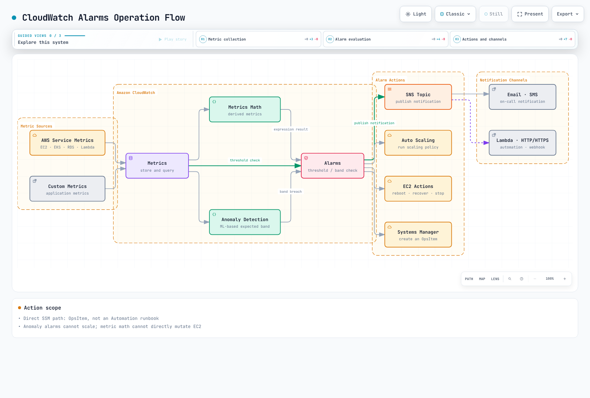

# CloudWatch Alarms

> **Last Updated**: September 13, 2026

The CLI and Terraform examples cover **classic CloudWatch metric alarms** and composite alarms. CloudWatch also supports **PromQL alarms** over metrics ingested through its OTLP endpoint and **log alarms** over Logs Insights query results. PromQL alarms use `PendingPeriod`/`RecoveryPeriod`; the M-of-N and missing-data settings below do not apply unchanged. Account, Region, and resource values are examples. Before using creation or update commands, verify the actual targets, IAM permissions, cost, and recipients. `PutMetricAlarm`/`PutCompositeAlarm` replace an existing alarm configuration, so preserve its current settings before updating it.

## Table of Contents

- [CloudWatch Alarms Overview](#cloudwatch-alarms-overview)
- [Architecture](#architecture)
- [Metric Alarms](#metric-alarms)
- [Composite Alarms](#composite-alarms)
- [Anomaly Detection](#anomaly-detection)
- [SNS Integration](#sns-integration)
- [EventBridge Integration](#eventbridge-integration)
- [Container Insights Alerts](#container-insights-alerts)
- [CloudWatch Alarm Actions](#cloudwatch-alarm-actions)
- [Cost Optimization](#cost-optimization)
- [Prometheus Metrics Integration](#prometheus-metrics-integration)
- [Terraform Examples](#terraform-examples)

---

## CloudWatch Alarms Overview

Amazon CloudWatch Alarms is the alerting feature of AWS's native monitoring service. It creates alerts based on CloudWatch metrics and enables automated responses through integration with SNS, Lambda, EC2 Auto Scaling, and more.

### Key Features

1. **Metric Alarms**: Evaluate a metric, metric math, or Metrics Insights query
2. **Composite Alarms**: Combine multiple alarm conditions
3. **Anomaly Detection**: Machine learning-based anomaly detection
4. **Alarm Actions**: Execute automatic actions when alerts fire
5. **AWS Service Integration**: Native integration with EC2, ECS, EKS, Lambda, etc.

### CloudWatch Alarms vs Prometheus Alertmanager

| Characteristic | CloudWatch Alarms | Prometheus Alertmanager |
|----------------|-------------------|-------------------------|
| **Type** | AWS Managed Service | Open Source |
| **Data Source** | CloudWatch metrics, OTLP metrics, or logs by alarm type | Alerts evaluated by Prometheus or other clients |
| **Evaluation** | Metric math, PromQL, or Logs Insights according to alarm type | Prometheus evaluates PromQL; Alertmanager groups, inhibits, and routes alerts |
| **Cost** | Depends on alarm type, evaluated metrics, queries, and contributors | No software license fee; infrastructure and operations still cost money |
| **Complex Routing** | Limited | Advanced routing support |
| **AWS Integration** | Native | Additional configuration required |

---

## Architecture

### CloudWatch Alarms Operation Flow



[🔍 View interactive diagram](https://www.atomai.click/kubernetes-docs/archmaps/en-observability-alerting-02-cloudwatch-alarms-0.html)

### Alarm States

A classic metric alarm starts in `INSUFFICIENT_DATA` and is then evaluated into `OK` or `ALARM`. Missing data does not always imply `INSUFFICIENT_DATA`: `missing` produces insufficient data when all evaluation data is missing, `notBreaching` fills missing points as good, `breaching` fills them as bad, and `ignore` retains the state. When additional real points are sufficient for evaluation, CloudWatch does not use the missing-data fill setting. A blanket `notBreaching` policy can therefore hide a stopped heartbeat or collector. A composite alarm can be in `INSUFFICIENT_DATA` only just after creation.


[🔍 View interactive diagram](https://www.atomai.click/kubernetes-docs/archmaps/en-observability-alerting-02-cloudwatch-alarms-1.html)

---

## Metric Alarms

### Basic Alarm Creation (Console/CLI)

#### AWS CLI

```bash
# Create CPU utilization alarm
aws cloudwatch put-metric-alarm \
  --alarm-name "HighCPUUtilization" \
  --alarm-description "CPU usage exceeds 80%" \
  --metric-name CPUUtilization \
  --namespace AWS/EC2 \
  --statistic Average \
  --period 300 \
  --threshold 80 \
  --comparison-operator GreaterThanThreshold \
  --evaluation-periods 2 \
  --dimensions Name=InstanceId,Value=i-1234567890abcdef0 \
  --alarm-actions arn:aws:sns:ap-northeast-2:123456789012:alerts \
  --ok-actions arn:aws:sns:ap-northeast-2:123456789012:alerts \
  --treat-missing-data missing
```

### Alarm Configuration Components

| Parameter | Description | Example |
|-----------|-------------|---------|
| `metric-name` | Name of metric to monitor | `CPUUtilization` |
| `namespace` | Metric namespace | `AWS/EC2`, `AWS/EKS` |
| `statistic` | Statistical function | `Average`, `Sum`, `Maximum`, `Minimum`, `SampleCount` |
| `period` | Evaluation period (seconds) | `60`, `300`, `3600` |
| `threshold` | Threshold value | `80` |
| `comparison-operator` | Comparison operator | `GreaterThanThreshold` |
| `evaluation-periods` | Number of evaluation periods N | `3` (M is `datapoints-to-alarm`) |
| `datapoints-to-alarm` | Datapoints required for alarm | `2` of `3` |
| `treat-missing-data` | Missing data handling | `notBreaching`, `breaching`, `ignore`, `missing` |

Use `--extended-statistic p99`, not `--statistic p99`. M breaching points within N need not be consecutive; omitting M makes it equal N. `Period` is the aggregation duration, not a notification interval. Classic metric alarm periods of 10, 20, or 30 seconds are high resolution and need matching high-resolution data. 60 seconds is standard resolution. Period×N is limited to seven days, or one day when Period is below one hour. Actions normally run on state transitions, except Auto Scaling actions.

### Comparison Operators

```yaml
# Available comparison operators
comparison-operators:
  - GreaterThanThreshold           # Greater than
  - GreaterThanOrEqualToThreshold  # Greater than or equal
  - LessThanThreshold              # Less than
  - LessThanOrEqualToThreshold     # Less than or equal
  - LessThanLowerOrGreaterThanUpperThreshold  # Outside range
  - LessThanLowerThreshold         # Below lower bound
  - GreaterThanUpperThreshold      # Above upper bound
```

### Alarms Using Metrics Math

```bash
# Error rate calculation alarm (error count / total requests)
aws cloudwatch put-metric-alarm \
  --alarm-name "HighErrorRate" \
  --alarm-description "Error rate exceeds 5%" \
  --metrics '[
    {
      "Id": "errors",
      "MetricStat": {
        "Metric": {
          "Namespace": "AWS/ApplicationELB",
          "MetricName": "HTTPCode_Target_5XX_Count",
          "Dimensions": [
            {"Name": "LoadBalancer", "Value": "app/my-alb/1234567890"}
          ]
        },
        "Period": 300,
        "Stat": "Sum"
      },
      "ReturnData": false
    },
    {
      "Id": "requests",
      "MetricStat": {
        "Metric": {
          "Namespace": "AWS/ApplicationELB",
          "MetricName": "RequestCount",
          "Dimensions": [
            {"Name": "LoadBalancer", "Value": "app/my-alb/1234567890"}
          ]
        },
        "Period": 300,
        "Stat": "Sum"
      },
      "ReturnData": false
    },
    {
      "Id": "error_rate",
      "Expression": "IF(requests > 0, 100 * FILL(errors, 0) / requests, 0)",
      "ReturnData": true
    }
  ]' \
  --threshold 5 \
  --comparison-operator GreaterThanThreshold \
  --evaluation-periods 2 \
  --alarm-actions arn:aws:sns:ap-northeast-2:123456789012:alerts
```

This expression measures target 5xx responses among requests forwarded by the ALB. It does not include every user-visible failure, such as ALB-generated errors or failures before selecting a target. Missing 5xx points are filled with zero when requests exist; zero requests is defined as 0% here. Monitor missing request/collection data separately. A classic metric math alarm must return one final time series. `SEARCH` is for graphs and cannot be used as an alarm expression. `RATE` can behave differently with sparse metrics because the evaluation range changes.

### Metrics Math Functions

```yaml
# Commonly used functions
math-functions:
  # Arithmetic operations
  - "m1 + m2"           # Sum
  - "m1 - m2"           # Difference
  - "m1 * m2"           # Product
  - "m1 / m2"           # Division
  - "(m1 / m2) * 100"   # Percentage

  # Statistical functions
  - "AVG(METRICS())"    # Average
  - "SUM(METRICS())"    # Sum
  - "MIN(METRICS())"    # Minimum
  - "MAX(METRICS())"    # Maximum

  # Conditional functions
  - "IF(m1 > 100, m1, 0)"  # Conditional

  # Time-related
  - "RATE(m1)"          # Rate of change
  - "DIFF(m1)"          # Difference
  - "PERIOD(m1)"        # Period

  # Search
  - "SEARCH('{AWS/EC2,InstanceId} MetricName=\"CPUUtilization\"', 'Average', 300)"
```

---

## Composite Alarms

### Composite Alarm Concept

Composite Alarms can combine multiple Metric Alarms to define complex conditions.


[🔍 View interactive diagram](https://www.atomai.click/kubernetes-docs/archmaps/en-observability-alerting-02-cloudwatch-alarms-2.html)

`CWAgent` memory and disk metrics require an installed agent and a matching published dimension set. The `InstanceId`-only examples work only if the agent publishes that aggregation. `disk_used_percent` often also has `path`, `device`, and `fstype`; use the **complete dimension set** returned by `list-metrics`. The example child alarms have no actions; only the composite sends notifications.

### Creating Composite Alarms

```bash
# Create individual alarms
aws cloudwatch put-metric-alarm \
  --alarm-name "HighCPU" \
  --metric-name CPUUtilization \
  --namespace AWS/EC2 \
  --statistic Average \
  --period 300 \
  --threshold 80 \
  --comparison-operator GreaterThanThreshold \
  --evaluation-periods 2 \
  --dimensions Name=InstanceId,Value=i-1234567890abcdef0

aws cloudwatch put-metric-alarm \
  --alarm-name "HighMemory" \
  --metric-name mem_used_percent \
  --namespace CWAgent \
  --statistic Average \
  --period 300 \
  --threshold 85 \
  --comparison-operator GreaterThanThreshold \
  --evaluation-periods 2 \
  --dimensions Name=InstanceId,Value=i-1234567890abcdef0

aws cloudwatch put-metric-alarm \
  --alarm-name "HighDisk" \
  --metric-name disk_used_percent \
  --namespace CWAgent \
  --statistic Average \
  --period 300 \
  --threshold 90 \
  --comparison-operator GreaterThanThreshold \
  --evaluation-periods 2 \
  --dimensions Name=InstanceId,Value=i-1234567890abcdef0

# Create Composite Alarm
aws cloudwatch put-composite-alarm \
  --alarm-name "ServerResourceCritical" \
  --alarm-description "Server resources are critical" \
  --alarm-rule '(ALARM("HighCPU") AND ALARM("HighMemory")) OR ALARM("HighDisk")' \
  --alarm-actions arn:aws:sns:ap-northeast-2:123456789012:critical-alerts \
  --ok-actions arn:aws:sns:ap-northeast-2:123456789012:alerts
```

### Alarm Rule Syntax

```yaml
# Composite Alarm rule syntax
rule-syntax:
  # Basic operators
  - "ALARM(alarm-name)"      # Check ALARM state
  - "OK(alarm-name)"         # Check OK state
  - "INSUFFICIENT_DATA(alarm-name)"  # Check INSUFFICIENT_DATA state

  # Logical operators
  - "AND"                    # All conditions met
  - "OR"                     # One or more conditions met
  - "NOT"                    # Negation
  - "()"                     # Grouping

examples:
  # All conditions met
  - "ALARM(A1) AND ALARM(A2) AND ALARM(A3)"

  # One or more met
  - "ALARM(A1) OR ALARM(A2)"

  # Complex condition
  - "(ALARM(A1) AND ALARM(A2)) OR ALARM(A3)"

  # Negation
  - "ALARM(A1) AND NOT ALARM(A2)"

  # M of N pattern (2 or more of 3)
  - "(ALARM(A1) AND ALARM(A2)) OR (ALARM(A1) AND ALARM(A3)) OR (ALARM(A2) AND ALARM(A3))"
```

### Alert Suppression Pattern

`set-alarm-state` is a temporary testing override; a metric alarm quickly returns to its evaluated state and does not establish a maintenance window. The following example assumes an external controller continuously publishes the state of a `MaintenanceMode` alarm. `ActionsSuppressor` suppresses composite actions without changing its evaluated state. Include the wait/extension periods when testing the maintenance window.

```bash
aws cloudwatch put-composite-alarm  \
  --alarm-name ProductionAlerts  \
  --alarm-rule 'ALARM("HighCPU")'  \
  --actions-suppressor MaintenanceMode  \
  --actions-suppressor-wait-period 60  \
  --actions-suppressor-extension-period 60  \
  --alarm-actions arn:aws:sns:ap-northeast-2:123456789012:alerts
```

---

## Anomaly Detection

### Anomaly Detection Overview

CloudWatch Anomaly Detection uses machine learning to learn normal patterns of metrics and detect outliers.


[🔍 View interactive diagram](https://www.atomai.click/kubernetes-docs/archmaps/en-observability-alerting-02-cloudwatch-alarms-3.html)

### Creating Anomaly Detection Alarms

```bash
# Anomaly Detection model creation (automatic)
# Model is automatically created when first alarm is created

aws cloudwatch put-metric-alarm \
  --alarm-name "CPUAnomalyDetection" \
  --alarm-description "CPU usage is anomalous" \
  --metrics '[
    {
      "Id": "m1",
      "MetricStat": {
        "Metric": {
          "Namespace": "AWS/EC2",
          "MetricName": "CPUUtilization",
          "Dimensions": [
            {"Name": "InstanceId", "Value": "i-1234567890abcdef0"}
          ]
        },
        "Period": 300,
        "Stat": "Average"
      },
      "ReturnData": true
    },
    {
      "Id": "ad1",
      "Expression": "ANOMALY_DETECTION_BAND(m1, 2)",
      "ReturnData": true
    }
  ]' \
  --threshold-metric-id ad1 \
  --comparison-operator LessThanLowerOrGreaterThanUpperThreshold \
  --evaluation-periods 2 \
  --alarm-actions arn:aws:sns:ap-northeast-2:123456789012:alerts
```

### Anomaly Detection Configuration

```yaml
# ANOMALY_DETECTION_BAND function
# ANOMALY_DETECTION_BAND(metric, stddev)
# - metric: Metric to analyze
# - stddev: Standard deviation multiplier (default 2)

examples:
  # Width parameter 2: not a guaranteed 95% confidence interval
  - "ANOMALY_DETECTION_BAND(m1, 2)"

  # Width parameter 3: a wider expected band
  - "ANOMALY_DETECTION_BAND(m1, 3)"

  # More sensitive detection (1 standard deviation)
  - "ANOMALY_DETECTION_BAND(m1, 1)"
```

The parameter controls the model's expected band width; it is not a guaranteed Gaussian 95% or 99.7% interval. The model uses up to two weeks of history and can start with less. The excluded dates below illustrate the format; replace them with relevant intervals within the model's training history.

### Adjusting Model Training Period

```bash
# Add exclusion periods to existing model (maintenance, incident periods, etc.)
aws cloudwatch put-anomaly-detector \
  --namespace AWS/EC2 \
  --metric-name CPUUtilization \
  --stat Average \
  --dimensions Name=InstanceId,Value=i-1234567890abcdef0 \
  --configuration '{
    "ExcludedTimeRanges": [
      {
        "StartTime": "2025-02-15T00:00:00Z",
        "EndTime": "2025-02-15T06:00:00Z"
      }
    ]
  }'
```

---

## SNS Integration

### Creating SNS Topic

```bash
# Create SNS Topic
aws sns create-topic --name eks-alerts

# Add Email subscription
aws sns subscribe \
  --topic-arn arn:aws:sns:ap-northeast-2:123456789012:eks-alerts \
  --protocol email \
  --notification-endpoint team@example.com

# Add SMS subscription
aws sns subscribe \
  --topic-arn arn:aws:sns:ap-northeast-2:123456789012:eks-alerts \
  --protocol sms \
  --notification-endpoint "$VERIFIED_SMS_NUMBER"

# Add Lambda subscription
aws sns subscribe \
  --topic-arn arn:aws:sns:ap-northeast-2:123456789012:eks-alerts \
  --protocol lambda \
  --notification-endpoint arn:aws:lambda:ap-northeast-2:123456789012:function:alert-handler
```

### SNS Message Filtering

Default CloudWatch SNS notifications do not automatically include the example `severity` or `environment` message attributes. To filter the body's `NewStateValue`, set `FilterPolicyScope=MessageBody`. This filter excludes `OK` recovery messages. Email requires subscription confirmation; SMS requires checking verified numbers, sandbox/Region requirements, and cost. A Lambda subscription also needs a Lambda resource policy allowing `sns.amazonaws.com` from the specific topic ARN.

```bash
aws sns set-subscription-attributes  \
  --subscription-arn "$SUBSCRIPTION_ARN"  \
  --attribute-name FilterPolicyScope  \
  --attribute-value MessageBody
aws sns set-subscription-attributes  \
  --subscription-arn "$SUBSCRIPTION_ARN"  \
  --attribute-name FilterPolicy  \
  --attribute-value '{"NewStateValue": ["ALARM"]}'
```

### SNS to Slack Integration (Lambda)

For standard CloudWatch notifications, connect the SNS topic and an approved Slack channel through **Amazon Q Developer in chat applications** (formerly AWS Chatbot). Limit the channel's IAM role and guardrail policy to its notification purpose.

If a custom Lambda is required, retrieve the webhook from a secret store, validate its destination, set connection/read timeouts, and check the response status. Do not report HTTP 429/5xx as success; configure retries, a dead-letter path, and duplicate handling. SNS uses `Records[].Sns.Message`, not the EventBridge envelope below. This chapter's validation does not send real Slack messages.

---

## EventBridge Integration

### Creating EventBridge Rule

```bash
# Route CloudWatch Alarm state changes to EventBridge
aws events put-rule \
  --name "CloudWatchAlarmStateChange" \
  --event-pattern '{
    "source": ["aws.cloudwatch"],
    "detail-type": ["CloudWatch Alarm State Change"],
    "detail": {
      "state": {
        "value": ["ALARM"]
      }
    }
  }'

# Add Lambda target
aws events put-targets \
  --rule "CloudWatchAlarmStateChange" \
  --targets '[
    {
      "Id": "AlertHandler",
      "Arn": "arn:aws:lambda:ap-northeast-2:123456789012:function:alert-handler"
    }
  ]'
```

### Automatic Response Configuration


[🔍 View interactive diagram](https://www.atomai.click/kubernetes-docs/archmaps/en-observability-alerting-02-cloudwatch-alarms-4.html)

### EventBridge Event Pattern

```json
{
  "source": ["aws.cloudwatch"],
  "detail-type": ["CloudWatch Alarm State Change"],
  "account": ["123456789012"],
  "region": ["ap-northeast-2"],
  "resources": ["arn:aws:cloudwatch:ap-northeast-2:123456789012:alarm:EKS-Node-HighCPU"],
  "detail": {
    "alarmName": ["EKS-Node-HighCPU"],
    "state": {"value": ["ALARM"]}
  }
}
```

Restricting `previousState` to `OK` misses `INSUFFICIENT_DATA → ALARM`. Matching an exact alarm ARN avoids assumptions about metric math or composite configuration shapes. `put-targets` does not grant Lambda invocation permission: add a Lambda resource policy for `events.amazonaws.com`, scoped to the rule's `SourceArn`, and configure retry/dead-letter behavior.

### Auto Recovery Lambda Example

High CPU alone is not evidence that rebooting is appropriate. This example implements the **input inspection stage** of recovery: it checks state, account, Region, and alarm ARN, then returns metric information. EventBridge `dimensions` is an object, unlike the dimension list in an SNS alarm message. It also handles an expression-first query and a composite alarm without metrics.

Package the [tested event normalizer and tests](https://github.com/Atom-oh/kubernetes-docs/tree/main/examples/observability/cloudwatch-alarms) with the Lambda handler:

```python
from event_normalizer import normalize_alarm_event

def lambda_handler(event, context):
    return normalize_alarm_event(
        event,
        expected_account="123456789012",
        expected_region="ap-northeast-2",
    )
```

The function performs no AWS mutations. Payload checks do not authenticate the sender. Any added remediation needs an explicit target allowlist, current alarm/resource state checks, idempotency, cooldown, least privilege, and rollback.

---

## Container Insights Alerts

### EKS Container Insights Metrics

These examples use the classic `ContainerInsights` CloudWatch metric path. Do not mix its names, dimensions, and billing with enhanced observability or OTel metric paths. Follow the [current EKS add-on guide](https://docs.aws.amazon.com/AmazonCloudWatch/latest/monitoring/install-CloudWatch-Observability-EKS-addon.html), which installs CloudWatch Agent and Fluent Bit, and select an add-on version compatible with the cluster's Kubernetes version and Region. Configure IAM and the agent association first when using EKS Pod Identity.

`update-addon` updates an existing installation; a first installation uses `create-addon`. Preserve existing configuration and Pod Identity associations. Query available versions and select one in the deployment plan instead of pinning the old `v1.2.0` or applying an unreviewed `latest` Fluentd manifest.

```bash
aws eks describe-addon-versions  \
  --addon-name amazon-cloudwatch-observability  \
  --kubernetes-version "$KUBERNETES_VERSION"  \
  --region "$AWS_REGION"
aws cloudwatch list-metrics  \
  --namespace ContainerInsights  \
  --metric-name pod_number_of_container_restarts  \
  --dimensions Name=ClusterName,Value=my-cluster  \
  --region "$AWS_REGION"
```

### Container Insights Alert Examples

```bash
# Cluster aggregate CPU utilization alarm
aws cloudwatch put-metric-alarm \
  --alarm-name "EKS-Node-HighCPU" \
  --metric-name node_cpu_utilization \
  --namespace ContainerInsights \
  --dimensions Name=ClusterName,Value=my-cluster \
  --statistic Average \
  --period 300 \
  --threshold 80 \
  --comparison-operator GreaterThanThreshold \
  --evaluation-periods 2 \
  --alarm-actions arn:aws:sns:ap-northeast-2:123456789012:eks-alerts

# Pod memory utilization alarm
aws cloudwatch put-metric-alarm \
  --alarm-name "EKS-Pod-HighMemory" \
  --metric-name pod_memory_utilization_over_pod_limit \
  --namespace ContainerInsights \
  --dimensions Name=ClusterName,Value=my-cluster Name=Namespace,Value=production \
  --statistic Average \
  --period 300 \
  --threshold 85 \
  --comparison-operator GreaterThanThreshold \
  --evaluation-periods 2 \
  --alarm-actions arn:aws:sns:ap-northeast-2:123456789012:eks-alerts

# One Pod's cumulative restart count (not a five-minute increase)
aws cloudwatch put-metric-alarm \
  --alarm-name "EKS-Pod-Restarts" \
  --metric-name pod_number_of_container_restarts \
  --namespace ContainerInsights \
  --dimensions Name=ClusterName,Value=my-cluster Name=Namespace,Value=production Name=PodName,Value=my-pod \
  --statistic Maximum \
  --period 300 \
  --threshold 3 \
  --comparison-operator GreaterThanThreshold \
  --evaluation-periods 1 \
  --alarm-actions arn:aws:sns:ap-northeast-2:123456789012:eks-alerts
```

The CPU example is a cluster aggregation. An individual node uses the full `ClusterName`, `NodeName`, and `InstanceId` set. `pod_memory_utilization` divides by **node memory**, whereas `pod_memory_utilization_over_pod_limit` divides by the Pod limit. The latter may be absent if any container lacks a memory limit. `pod_number_of_container_restarts` is cumulative and uses `ClusterName`, `Namespace`, and `PodName`. `Maximum > 3` means the observed lifetime count exceeded three; summing samples does not count recent restarts. Account for Pod replacement, resets, and name reuse. Use reset-aware PromQL `increase()` or a separately defined delta metric for recent increments.

### Key Container Insights Metrics

| Metric | Description | Dimensions |
|--------|-------------|------------|
| `cluster_node_count` | Cluster node count | ClusterName |
| `cluster_failed_node_count` | Failed node count | ClusterName |
| `node_cpu_utilization` | Node CPU utilization | ClusterName, NodeName, InstanceId; or ClusterName |
| `node_memory_utilization` | Node memory utilization | ClusterName, NodeName, InstanceId; or ClusterName |
| `node_filesystem_utilization` | Node disk utilization | ClusterName, NodeName, InstanceId; or ClusterName |
| `pod_cpu_utilization` | Pod CPU utilization | ClusterName, Namespace, PodName |
| `pod_memory_utilization` | Pod memory utilization | ClusterName, Namespace, PodName |
| `pod_number_of_container_restarts` | Container restart count | ClusterName, Namespace, PodName |
| `service_number_of_running_pods` | Running pods per service | ClusterName, Namespace, Service |

---

## CloudWatch Alarm Actions

### EC2 Actions

Direct EC2 actions are stop, terminate, reboot, and recover; **start is not supported**. These examples mutate instances: use only an explicitly approved target after checking supported instances, permissions, and stop/recovery impact. Use `missing` for missing data and attach mutation actions only to `ALARM`. Metric math and composite alarms cannot directly perform EC2 actions.


```bash
# EC2 instance recovery (on system status check failure)
aws cloudwatch put-metric-alarm \
  --alarm-name "EC2-SystemCheckFailed" \
  --metric-name StatusCheckFailed_System \
  --namespace AWS/EC2 \
  --dimensions Name=InstanceId,Value=i-1234567890abcdef0 \
  --statistic Maximum \
  --period 60 \
  --threshold 1 \
  --comparison-operator GreaterThanOrEqualToThreshold \
  --evaluation-periods 2 \
  --treat-missing-data missing \
  --alarm-actions arn:aws:automate:ap-northeast-2:ec2:recover

# EC2 instance stop
aws cloudwatch put-metric-alarm \
  --alarm-name "EC2-LowUtilization-Stop" \
  --metric-name CPUUtilization \
  --namespace AWS/EC2 \
  --dimensions Name=InstanceId,Value=i-1234567890abcdef0 \
  --statistic Average \
  --period 3600 \
  --threshold 5 \
  --comparison-operator LessThanThreshold \
  --evaluation-periods 24 \
  --treat-missing-data missing \
  --alarm-actions arn:aws:automate:ap-northeast-2:ec2:stop
```

### Auto Scaling Actions

```bash
# Link Auto Scaling policy
aws cloudwatch put-metric-alarm \
  --alarm-name "ASG-ScaleOut" \
  --metric-name CPUUtilization \
  --namespace AWS/EC2 \
  --dimensions Name=AutoScalingGroupName,Value=my-asg \
  --statistic Average \
  --period 300 \
  --threshold 70 \
  --comparison-operator GreaterThanThreshold \
  --evaluation-periods 2 \
  --alarm-actions arn:aws:autoscaling:ap-northeast-2:123456789012:scalingPolicy:xxx:autoScalingGroupName/my-asg:policyName/scale-out

aws cloudwatch put-metric-alarm \
  --alarm-name "ASG-ScaleIn" \
  --metric-name CPUUtilization \
  --namespace AWS/EC2 \
  --dimensions Name=AutoScalingGroupName,Value=my-asg \
  --statistic Average \
  --period 300 \
  --threshold 30 \
  --comparison-operator LessThanThreshold \
  --evaluation-periods 3 \
  --alarm-actions arn:aws:autoscaling:ap-northeast-2:123456789012:scalingPolicy:xxx:autoScalingGroupName/my-asg:policyName/scale-in
```

### Systems Manager Actions

An `automation-definition/...` ARN is not a supported direct `AlarmActions` target for running an arbitrary SSM Automation runbook. Direct SSM integration uses the API's listed actions, such as OpsItems. Route Automation through an **EventBridge SSM Automation target** or an explicit Lambda/Step Functions workflow. Scope the target execution role, `ssm:StartAutomationExecution`, runbook parameters, and Automation role separately. A disk threshold alone must not authorize arbitrary file deletion.

---

## Cost Optimization

### Cost Factors

The figures below are **US East examples** from the official pricing page checked on 2026-09-13, not a quote for Seoul. Check the target Region's current pricing. Metric alarms are charged by evaluated metrics, while composites are charged per alarm. Anomaly detection includes the actual metric and two band metrics. Adding a composite retains the child alarm charges: it reduces notification noise, not automatically cost.


| Item | Cost |
|------|------|
| Standard Resolution alarm (60s) | $0.10/alarm/month |
| High Resolution alarm (10s) | $0.30/alarm/month |
| Standard anomaly alarm: one actual metric plus two bands | $0.30/alarm/month example |
| Composite Alarm | $0.50/alarm/month |

### Cost Optimization Strategies


[🔍 View interactive diagram](https://www.atomai.click/kubernetes-docs/archmaps/en-observability-alerting-02-cloudwatch-alarms-5.html)

### Recommended Settings

```yaml
# Cost-effective alarm settings

# Critical: Standard Resolution (60s; only 10/20/30s is high resolution)
critical-alerts:
  period: 60  # 1 minute
  evaluation-periods: 2

# Warning: Standard Resolution
warning-alerts:
  period: 300  # 5 minutes
  evaluation-periods: 2

# Info: Standard Resolution (relaxed detection)
info-alerts:
  period: 900  # 15 minutes
  evaluation-periods: 3
```

### Alarm Cleanup Script

This command only lists candidates for inspection. `INSUFFICIENT_DATA` is not proof that an alarm is unused, and a fixed historical date cannot mean '90 days ago'. Review elapsed time since `StateTransitionedTimestamp`, actual collection, ownership, and composite dependencies before a separately authorized deletion. `StateUpdatedTimestamp` can also change when the state reason changes; it is not the same as time in the current state.

```bash
aws cloudwatch describe-alarms  \
  --alarm-types MetricAlarm  \
  --state-value INSUFFICIENT_DATA  \
  --query 'MetricAlarms[].{Name:AlarmName,StateSince:StateTransitionedTimestamp,Updated:StateUpdatedTimestamp}'  \
  --output json
```

---

## Prometheus Metrics Integration

### Amazon Managed Prometheus (AMP) Integration

Metrics stored in AMP are not automatically copied into classic CloudWatch metrics. Choose the path that matches the requirement.

- **Alerts inside AMP**: configure workspace Prometheus alerting rules → managed Alertmanager → a supported receiver (SNS or PagerDuty).
- **CloudWatch PromQL alarms**: evaluate metrics ingested through the CloudWatch OTLP endpoint. This is not direct querying of an AMP workspace.
- **Republishing classic CloudWatch metrics**: define only the required aggregates in a separate exporter. Sign with one consistent frozen temporary-credential set and validate timeouts, HTTP status, result type, finite values, timestamps, and dimensions. Do not turn empty results, NaN, or failures into zero or success. This adds query, custom metric, runtime costs, and delay.

The former CPU mode average was not total CPU utilization; a ratio of memory averages across unrelated or unlimited Pods was not each Pod's limit utilization. Select PromQL that preserves the required labels and reset semantics, then test the rule and validate actual collected data.

---

## Terraform Examples

The blocks below form one example module. Configure real resource values and the SNS topic policy, then review `terraform plan` before deployment. Example validation covers provider schema/syntax, not AWS deployment or actual notification delivery.


### Basic Alarm

```hcl
# SNS Topic
resource "aws_sns_topic" "alerts" {
  name = "eks-alerts"
}

resource "aws_sns_topic_subscription" "email" {
  topic_arn = aws_sns_topic.alerts.arn
  protocol  = "email"
  endpoint  = "team@example.com"
}

# EC2 CPU alarm
resource "aws_cloudwatch_metric_alarm" "ec2_cpu" {
  alarm_name          = "ec2-high-cpu"
  comparison_operator = "GreaterThanThreshold"
  evaluation_periods  = 2
  metric_name         = "CPUUtilization"
  namespace           = "AWS/EC2"
  period              = 300
  statistic           = "Average"
  threshold           = 80
  alarm_description   = "EC2 CPU usage exceeds 80%"

  dimensions = {
    InstanceId = "i-1234567890abcdef0"
  }

  alarm_actions = [aws_sns_topic.alerts.arn]
  ok_actions    = [aws_sns_topic.alerts.arn]

  treat_missing_data = "missing"
}
```

### Metrics Math Alarm

```hcl
resource "aws_cloudwatch_metric_alarm" "alb_error_rate" {
  alarm_name          = "alb-high-error-rate"
  comparison_operator = "GreaterThanThreshold"
  evaluation_periods  = 2
  threshold           = 5
  alarm_description   = "ALB error rate exceeds 5%"

  metric_query {
    id          = "errors"
    return_data = false

    metric {
      metric_name = "HTTPCode_Target_5XX_Count"
      namespace   = "AWS/ApplicationELB"
      period      = 300
      stat        = "Sum"

      dimensions = {
        LoadBalancer = "app/my-alb/1234567890"
      }
    }
  }

  metric_query {
    id          = "requests"
    return_data = false

    metric {
      metric_name = "RequestCount"
      namespace   = "AWS/ApplicationELB"
      period      = 300
      stat        = "Sum"

      dimensions = {
        LoadBalancer = "app/my-alb/1234567890"
      }
    }
  }

  metric_query {
    id          = "error_rate"
    expression  = "IF(requests > 0, 100 * FILL(errors, 0) / requests, 0)"
    label       = "Error Rate"
    return_data = true
  }

  alarm_actions = [aws_sns_topic.alerts.arn]
}
```

### Composite Alarm

```hcl
# Individual alarms
resource "aws_cloudwatch_metric_alarm" "cpu_alarm" {
  alarm_name          = "high-cpu"
  comparison_operator = "GreaterThanThreshold"
  evaluation_periods  = 2
  metric_name         = "CPUUtilization"
  namespace           = "AWS/EC2"
  period              = 300
  statistic           = "Average"
  threshold           = 80

  dimensions = {
    InstanceId = "i-1234567890abcdef0"
  }
}

resource "aws_cloudwatch_metric_alarm" "memory_alarm" {
  alarm_name          = "high-memory"
  comparison_operator = "GreaterThanThreshold"
  evaluation_periods  = 2
  metric_name         = "mem_used_percent"
  namespace           = "CWAgent"
  period              = 300
  statistic           = "Average"
  threshold           = 85

  dimensions = {
    InstanceId = "i-1234567890abcdef0"
  }
}

# Composite Alarm
resource "aws_cloudwatch_composite_alarm" "server_critical" {
  alarm_name        = "server-critical"
  alarm_description = "Server CPU and Memory are both high"

  alarm_rule = "ALARM(${aws_cloudwatch_metric_alarm.cpu_alarm.alarm_name}) AND ALARM(${aws_cloudwatch_metric_alarm.memory_alarm.alarm_name})"

  alarm_actions = [aws_sns_topic.alerts.arn]
  ok_actions    = [aws_sns_topic.alerts.arn]
}
```

### EKS Container Insights Alarm

```hcl
resource "aws_cloudwatch_metric_alarm" "eks_node_cpu" {
  alarm_name          = "eks-node-high-cpu"
  comparison_operator = "GreaterThanThreshold"
  evaluation_periods  = 2
  metric_name         = "node_cpu_utilization"
  namespace           = "ContainerInsights"
  period              = 300
  statistic           = "Average"
  threshold           = 80
  alarm_description   = "EKS Node CPU usage exceeds 80%"

  dimensions = {
    ClusterName = "my-eks-cluster"
  }

  alarm_actions = [aws_sns_topic.alerts.arn]
}

resource "aws_cloudwatch_metric_alarm" "eks_pod_restarts" {
  alarm_name          = "eks-pod-restarts"
  comparison_operator = "GreaterThanThreshold"
  evaluation_periods  = 1
  metric_name         = "pod_number_of_container_restarts"
  namespace           = "ContainerInsights"
  period              = 300
  statistic           = "Maximum"
  threshold           = 3
  alarm_description   = "Observed cumulative restart count exceeds 3; not a 5-minute increase"

  dimensions = {
    ClusterName = "my-eks-cluster"
    Namespace   = "production"
    PodName     = "my-pod"
  }

  alarm_actions = [aws_sns_topic.alerts.arn]
}
```

### Anomaly Detection Alarm

```hcl
resource "aws_cloudwatch_metric_alarm" "cpu_anomaly" {
  alarm_name          = "cpu-anomaly-detection"
  comparison_operator = "LessThanLowerOrGreaterThanUpperThreshold"
  evaluation_periods  = 2
  threshold_metric_id = "ad1"
  alarm_description   = "CPU usage is anomalous"

  metric_query {
    id          = "m1"
    return_data = true

    metric {
      metric_name = "CPUUtilization"
      namespace   = "AWS/EC2"
      period      = 300
      stat        = "Average"

      dimensions = {
        InstanceId = "i-1234567890abcdef0"
      }
    }
  }

  metric_query {
    id          = "ad1"
    expression  = "ANOMALY_DETECTION_BAND(m1, 2)"
    label       = "CPUUtilization (Expected)"
    return_data = true
  }

  alarm_actions = [aws_sns_topic.alerts.arn]
}
```

---

## References

- [CloudWatch alarm types](https://docs.aws.amazon.com/AmazonCloudWatch/latest/monitoring/CloudWatch_Alarms.html)
- [PutMetricAlarm API](https://docs.aws.amazon.com/AmazonCloudWatch/latest/APIReference/API_PutMetricAlarm.html)
- [Missing data evaluation](https://docs.aws.amazon.com/AmazonCloudWatch/latest/monitoring/alarms-and-missing-data.html)
- [Composite alarms and action suppression](https://docs.aws.amazon.com/AmazonCloudWatch/latest/APIReference/API_PutCompositeAlarm.html)
- [Metric math](https://docs.aws.amazon.com/AmazonCloudWatch/latest/monitoring/using-metric-math.html)
- [Anomaly detection](https://docs.aws.amazon.com/AmazonCloudWatch/latest/monitoring/CloudWatch_Anomaly_Detection.html)
- [SNS alarm message schemas](https://docs.aws.amazon.com/AmazonCloudWatch/latest/monitoring/Notify_Users_Alarm_Changes.html)
- [SNS filter policy scope](https://docs.aws.amazon.com/sns/latest/dg/sns-message-filtering-scope.html)
- [EventBridge alarm events](https://docs.aws.amazon.com/AmazonCloudWatch/latest/monitoring/cloudwatch-and-eventbridge.html)
- [EventBridge target permissions](https://docs.aws.amazon.com/eventbridge/latest/userguide/eb-use-resource-based.html)
- [Container Insights metric dimensions](https://docs.aws.amazon.com/AmazonCloudWatch/latest/monitoring/Container-Insights-metrics-EKS.html)
- [CloudWatch Observability EKS add-on](https://docs.aws.amazon.com/AmazonCloudWatch/latest/monitoring/install-CloudWatch-Observability-EKS-addon.html)
- [CloudWatch pricing](https://aws.amazon.com/cloudwatch/pricing/)
- [PromQL alarms](https://docs.aws.amazon.com/AmazonCloudWatch/latest/monitoring/alarm-promql.html)
- [Log alarms](https://docs.aws.amazon.com/AmazonCloudWatch/latest/monitoring/Alarm-On-Logs.html)
- [AMP alert receivers](https://docs.aws.amazon.com/prometheus/latest/userguide/AMP-alertmanager-receiver.html)

## Quiz

Test your knowledge with the [CloudWatch Alarms Quiz](../../quizzes/observability/alerting/02-cloudwatch-alarms-quiz.md).
