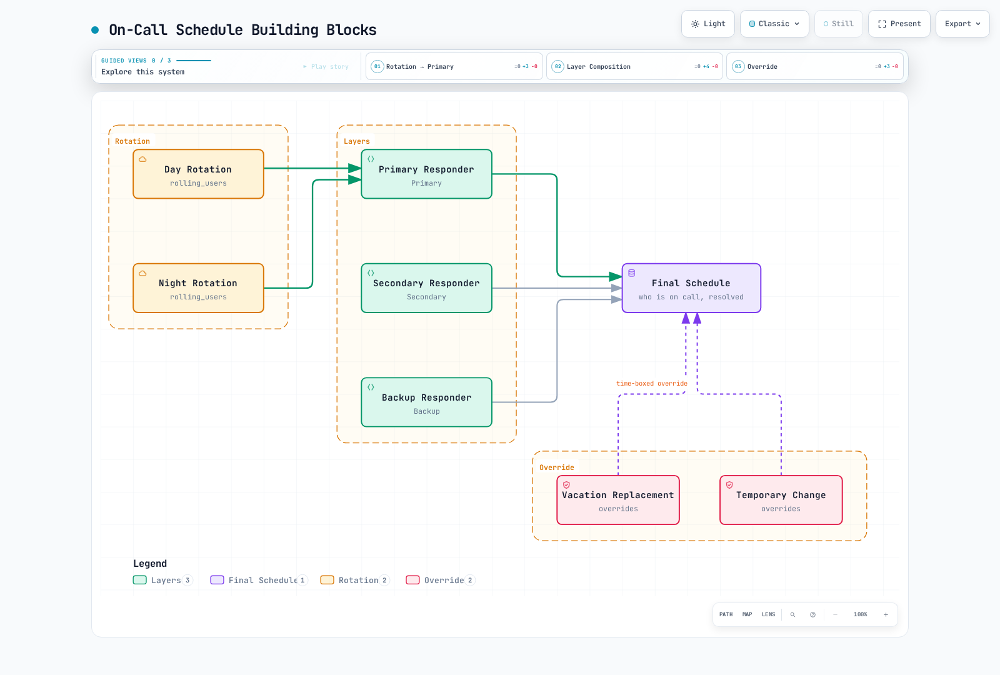

# Grafana OnCall

> **Last Updated**: February 20, 2026

## Table of Contents

- [Grafana OnCall Overview](#grafana-oncall-overview)
- [Architecture](#architecture)
- [Installation](#installation)
- [Integration Setup](#integration-setup)
- [On-Call Schedule Configuration](#on-call-schedule-configuration)
- [Escalation Chains](#escalation-chains)
- [Alert Grouping and Routing](#alert-grouping-and-routing)
- [ChatOps Integration](#chatops-integration)
- [Grafana IRM Integration](#grafana-irm-integration)
- [Mobile App](#mobile-app)
- [PagerDuty/OpsGenie Comparison](#pagerdutyopsgenie-comparison)
- [Best Practices](#best-practices)

---

## Grafana OnCall Overview

Grafana OnCall is an open-source on-call management tool that provides alert routing, on-call schedule management, and escalation policies. It is available as SaaS through Grafana Cloud or can be self-hosted.

### Key Features

1. **On-Call Schedule Management**: Rotations, overrides, holiday management
2. **Escalation Chains**: Time-based automatic escalation
3. **Alert Grouping**: Consolidate related alerts
4. **Various Integrations**: Alertmanager, Grafana, CloudWatch, Webhook
5. **ChatOps**: Slack, MS Teams, Telegram integration
6. **Mobile App**: iOS/Android push notifications

### Grafana OnCall vs PagerDuty vs OpsGenie

| Feature | Grafana OnCall | PagerDuty | OpsGenie |
|---------|----------------|-----------|----------|
| **Type** | Open Source/SaaS | SaaS | SaaS |
| **Cost** | Free(OSS)/Paid(Cloud) | Paid | Paid |
| **Self-Hosting** | Yes | No | No |
| **Grafana Integration** | Native | Plugin | Plugin |
| **On-Call Schedule** | Yes | Advanced | Advanced |
| **Escalation** | Yes | Advanced | Advanced |
| **Analytics/Reporting** | Basic | Advanced | Advanced |
| **Enterprise Support** | Paid | Included | Included |

---

## Architecture

### Grafana OnCall Components


[🔍 View interactive diagram](https://www.atomai.click/kubernetes-docs/archmaps/en-observability-alerting-03-grafana-oncall-0.html)

### Alert Processing Flow


[🔍 View interactive diagram](https://www.atomai.click/kubernetes-docs/archmaps/en-observability-alerting-03-grafana-oncall-1.html)

---

## Installation

### Installation via Helm (EKS)

```bash
# Add Helm repository
helm repo add grafana https://grafana.github.io/helm-charts
helm repo update

# Create namespace
kubectl create namespace oncall

# Install after creating values.yaml
helm install oncall grafana/oncall \
  --namespace oncall \
  -f oncall-values.yaml
```

### Basic values.yaml Configuration

```yaml
# oncall-values.yaml
base_url: oncall.example.com

# Database settings
database:
  type: postgresql

postgresql:
  enabled: true
  auth:
    database: oncall
    username: oncall
    password: "secure-password"
  primary:
    persistence:
      enabled: true
      size: 10Gi

# Redis settings
redis:
  enabled: true
  architecture: standalone
  auth:
    enabled: true
    password: "redis-password"

# Celery workers
celery:
  replicaCount: 2
  resources:
    requests:
      memory: 256Mi
      cpu: 100m
    limits:
      memory: 512Mi
      cpu: 500m

# API server
oncall:
  replicaCount: 2
  resources:
    requests:
      memory: 512Mi
      cpu: 200m
    limits:
      memory: 1Gi
      cpu: 1000m

# Ingress settings
ingress:
  enabled: true
  className: alb
  annotations:
    alb.ingress.kubernetes.io/scheme: internet-facing
    alb.ingress.kubernetes.io/target-type: ip
    alb.ingress.kubernetes.io/certificate-arn: arn:aws:acm:ap-northeast-2:xxx:certificate/xxx
    alb.ingress.kubernetes.io/listen-ports: '[{"HTTPS":443}]'
  hosts:
    - host: oncall.example.com
      paths:
        - path: /
          pathType: Prefix

# Grafana integration
grafana:
  enabled: false  # When using existing Grafana

# Environment variables
env:
  - name: SECRET_KEY
    valueFrom:
      secretKeyRef:
        name: oncall-secrets
        key: secret-key
  - name: DJANGO_SETTINGS_MODULE
    value: settings.hobby
```

### Production values.yaml

```yaml
# oncall-production-values.yaml
base_url: oncall.example.com

# External PostgreSQL (RDS)
database:
  type: postgresql

externalPostgresql:
  host: oncall-db.xxx.ap-northeast-2.rds.amazonaws.com
  port: 5432
  db: oncall
  user: oncall
  password:
    secretName: oncall-db-secret
    secretKey: password

postgresql:
  enabled: false

# External Redis (ElastiCache)
externalRedis:
  host: oncall-redis.xxx.cache.amazonaws.com
  port: 6379
  password:
    secretName: oncall-redis-secret
    secretKey: password

redis:
  enabled: false

# Celery workers (HA)
celery:
  replicaCount: 3
  resources:
    requests:
      memory: 512Mi
      cpu: 250m
    limits:
      memory: 1Gi
      cpu: 1000m
  affinity:
    podAntiAffinity:
      preferredDuringSchedulingIgnoredDuringExecution:
        - weight: 100
          podAffinityTerm:
            labelSelector:
              matchLabels:
                app.kubernetes.io/component: celery
            topologyKey: kubernetes.io/hostname

# API server (HA)
oncall:
  replicaCount: 3
  resources:
    requests:
      memory: 1Gi
      cpu: 500m
    limits:
      memory: 2Gi
      cpu: 2000m
  affinity:
    podAntiAffinity:
      preferredDuringSchedulingIgnoredDuringExecution:
        - weight: 100
          podAffinityTerm:
            labelSelector:
              matchLabels:
                app.kubernetes.io/component: oncall
            topologyKey: kubernetes.io/hostname

# Telegram/Twilio settings (for phone/SMS)
telegramPolling:
  enabled: true

twilio:
  enabled: true
  accountSid:
    secretName: twilio-secret
    secretKey: account-sid
  authToken:
    secretName: twilio-secret
    secretKey: auth-token
  phoneNumber:
    secretName: twilio-secret
    secretKey: phone-number
```

### Creating Secrets

```bash
# OnCall secrets
kubectl create secret generic oncall-secrets \
  --namespace oncall \
  --from-literal=secret-key=$(openssl rand -base64 32)

# Database secret
kubectl create secret generic oncall-db-secret \
  --namespace oncall \
  --from-literal=password='db-password'

# Redis secret
kubectl create secret generic oncall-redis-secret \
  --namespace oncall \
  --from-literal=password='redis-password'

# Twilio secret (for phone/SMS)
kubectl create secret generic twilio-secret \
  --namespace oncall \
  --from-literal=account-sid='ACxxx' \
  --from-literal=auth-token='xxx' \
  --from-literal=phone-number='+1234567890'
```

---

## Integration Setup

### Alertmanager Integration

```yaml
# Alertmanager configuration
receivers:
  - name: 'grafana-oncall'
    webhook_configs:
      - url: 'https://oncall.example.com/api/v1/webhook/<integration-id>/'
        send_resolved: true
        http_config:
          bearer_token: '<integration-token>'

route:
  receiver: 'default'
  routes:
    - match:
        severity: critical
      receiver: 'grafana-oncall'
    - match:
        severity: warning
      receiver: 'grafana-oncall'
```

### Grafana Alerting Integration

```yaml
# Grafana alerting configuration (grafana.ini)
[unified_alerting]
enabled = true

[alerting]
enabled = false

# Contact Point setup (in Grafana UI)
# 1. Alerting > Contact points
# 2. New contact point
# 3. Integration: Grafana OnCall
# 4. URL: https://oncall.example.com
# 5. Select Integration
```

### CloudWatch Integration

```bash
# Create SNS Topic
aws sns create-topic --name cloudwatch-to-oncall

# SNS subscription (OnCall Webhook)
aws sns subscribe \
  --topic-arn arn:aws:sns:ap-northeast-2:123456789012:cloudwatch-to-oncall \
  --protocol https \
  --notification-endpoint https://oncall.example.com/api/v1/webhook/<integration-id>/

# Connect CloudWatch Alarm to SNS
aws cloudwatch put-metric-alarm \
  --alarm-name "HighCPU" \
  --alarm-actions arn:aws:sns:ap-northeast-2:123456789012:cloudwatch-to-oncall \
  ...
```

### Webhook Integration

```python
# Custom alert sending example
import requests

webhook_url = "https://oncall.example.com/api/v1/webhook/<integration-id>/"
token = "<integration-token>"

alert = {
    "alert_uid": "unique-alert-id",
    "title": "High CPU Usage",
    "message": "CPU usage is above 90% on production server",
    "state": "alerting",  # alerting, ok
    "severity": "critical",  # critical, warning, info
    "link": "https://grafana.example.com/d/xxx",
    "labels": {
        "environment": "production",
        "service": "api-server"
    }
}

response = requests.post(
    webhook_url,
    json=alert,
    headers={"Authorization": f"Bearer {token}"}
)
```

---

## On-Call Schedule Configuration

### Schedule Concept



[🔍 View interactive diagram](https://www.atomai.click/kubernetes-docs/archmaps/en-observability-alerting-03-grafana-oncall-2.html)

### Creating Schedule (API)

```bash
# Create schedule
curl -X POST https://oncall.example.com/api/v1/schedules/ \
  -H "Authorization: Bearer <api-token>" \
  -H "Content-Type: application/json" \
  -d '{
    "name": "SRE Team On-Call",
    "team_id": "<team-id>",
    "time_zone": "Asia/Seoul",
    "type": "web",
    "shifts": [
      {
        "type": "rolling_users",
        "start": "2025-02-17T09:00:00",
        "duration": 604800,
        "frequency": "weekly",
        "interval": 1,
        "rolling_users": [
          ["<user-id-1>"],
          ["<user-id-2>"],
          ["<user-id-3>"]
        ]
      }
    ]
  }'
```

### Rotation Types

```yaml
# Weekly rotation
weekly-rotation:
  type: rolling_users
  start: "2025-02-17T09:00:00"
  duration: 604800  # 7 days (seconds)
  frequency: weekly
  interval: 1
  rolling_users:
    - [user-1]
    - [user-2]
    - [user-3]

# Daily rotation
daily-rotation:
  type: rolling_users
  start: "2025-02-17T09:00:00"
  duration: 86400  # 1 day (seconds)
  frequency: daily
  interval: 1
  rolling_users:
    - [user-1]
    - [user-2]

# Shift rotation (8 hours x 3)
shift-rotation:
  shifts:
    - type: rolling_users
      start: "2025-02-17T00:00:00"
      duration: 28800  # 8 hours
      frequency: daily
      rolling_users:
        - [night-shift-1]
        - [night-shift-2]
    - type: rolling_users
      start: "2025-02-17T08:00:00"
      duration: 28800
      frequency: daily
      rolling_users:
        - [day-shift-1]
        - [day-shift-2]
    - type: rolling_users
      start: "2025-02-17T16:00:00"
      duration: 28800
      frequency: daily
      rolling_users:
        - [evening-shift-1]
        - [evening-shift-2]
```

### Override Settings

```bash
# Change responder for specific period
curl -X POST https://oncall.example.com/api/v1/schedules/<schedule-id>/overrides/ \
  -H "Authorization: Bearer <api-token>" \
  -H "Content-Type: application/json" \
  -d '{
    "start": "2025-02-25T09:00:00+09:00",
    "end": "2025-02-28T09:00:00+09:00",
    "user_id": "<replacement-user-id>"
  }'
```

---

## Escalation Chains

### Escalation Chain Structure


[🔍 View interactive diagram](https://www.atomai.click/kubernetes-docs/archmaps/en-observability-alerting-03-grafana-oncall-3.html)

### Creating Escalation Chain

```bash
# Create escalation chain
curl -X POST https://oncall.example.com/api/v1/escalation_chains/ \
  -H "Authorization: Bearer <api-token>" \
  -H "Content-Type: application/json" \
  -d '{
    "name": "Production Critical",
    "team_id": "<team-id>"
  }'

# Add escalation policy
curl -X POST https://oncall.example.com/api/v1/escalation_policies/ \
  -H "Authorization: Bearer <api-token>" \
  -H "Content-Type: application/json" \
  -d '{
    "escalation_chain_id": "<chain-id>",
    "position": 0,
    "type": "notify_on_call_from_schedule",
    "notify_on_call_from_schedule": "<schedule-id>",
    "important": true
  }'

# Add wait step
curl -X POST https://oncall.example.com/api/v1/escalation_policies/ \
  -H "Authorization: Bearer <api-token>" \
  -H "Content-Type: application/json" \
  -d '{
    "escalation_chain_id": "<chain-id>",
    "position": 1,
    "type": "wait",
    "duration": 900
  }'

# Add secondary escalation
curl -X POST https://oncall.example.com/api/v1/escalation_policies/ \
  -H "Authorization: Bearer <api-token>" \
  -H "Content-Type: application/json" \
  -d '{
    "escalation_chain_id": "<chain-id>",
    "position": 2,
    "type": "notify_persons",
    "persons_to_notify": ["<user-id-1>", "<user-id-2>"],
    "important": true
  }'
```

### Escalation Policy Types

```yaml
escalation-policy-types:
  # Notify current on-call from schedule
  - type: notify_on_call_from_schedule
    notify_on_call_from_schedule: "<schedule-id>"
    important: true  # Important notification (send via all channels)

  # Notify specific users
  - type: notify_persons
    persons_to_notify:
      - "<user-id-1>"
      - "<user-id-2>"

  # Notify user group
  - type: notify_user_group
    group_to_notify: "<group-id>"

  # Wait time
  - type: wait
    duration: 900  # 15 minutes (seconds)

  # Notify next on-call responder
  - type: notify_on_call_from_schedule
    notify_on_call_from_schedule: "<schedule-id>"
    notify_if_time_from_start_matches: true

  # Repeat previous steps
  - type: repeat_escalation
    repeat_after: 3600  # Repeat after 1 hour

  # Trigger webhook
  - type: trigger_webhook
    webhook_id: "<webhook-id>"
```

### Escalation Chains by Severity

```yaml
# For Critical alerts
critical-chain:
  policies:
    - position: 0
      type: notify_on_call_from_schedule
      schedule: primary-oncall
      important: true
    - position: 1
      type: wait
      duration: 300  # 5 minutes
    - position: 2
      type: notify_persons
      persons: [secondary-oncall, team-lead]
      important: true
    - position: 3
      type: wait
      duration: 300
    - position: 4
      type: notify_user_group
      group: entire-team
    - position: 5
      type: repeat_escalation
      repeat_after: 1800  # 30 minutes

# For Warning alerts
warning-chain:
  policies:
    - position: 0
      type: notify_on_call_from_schedule
      schedule: primary-oncall
      important: false  # Non-important (Slack only)
    - position: 1
      type: wait
      duration: 900  # 15 minutes
    - position: 2
      type: notify_on_call_from_schedule
      schedule: primary-oncall
      important: true
    - position: 3
      type: wait
      duration: 900
    - position: 4
      type: notify_persons
      persons: [team-lead]
```

---

## Alert Grouping and Routing

### Route Settings


[🔍 View interactive diagram](https://www.atomai.click/kubernetes-docs/archmaps/en-observability-alerting-03-grafana-oncall-4.html)

### Creating Routes

```bash
# Create route
curl -X POST https://oncall.example.com/api/v1/routes/ \
  -H "Authorization: Bearer <api-token>" \
  -H "Content-Type: application/json" \
  -d '{
    "integration_id": "<integration-id>",
    "routing_regex": "\"severity\":\\s*\"critical\"",
    "position": 0,
    "escalation_chain_id": "<critical-chain-id>",
    "slack_channel_id": "<critical-channel-id>"
  }'

# Team-based route
curl -X POST https://oncall.example.com/api/v1/routes/ \
  -H "Authorization: Bearer <api-token>" \
  -H "Content-Type: application/json" \
  -d '{
    "integration_id": "<integration-id>",
    "routing_regex": "\"team\":\\s*\"infra\"",
    "position": 1,
    "escalation_chain_id": "<infra-chain-id>",
    "slack_channel_id": "<infra-channel-id>"
  }'
```

### Alert Grouping Configuration

```yaml
# Define grouping rules in Integration settings
grouping:
  # Grouping key criteria
  grouping_key: "{{ payload.labels.alertname }}-{{ payload.labels.namespace }}"

  # Grouping time window
  group_wait: 30s     # First alert wait
  group_interval: 5m   # Additional alert wait
  resolve_timeout: 5m  # Resolution wait

# Template examples
templates:
  grouping_key: |
    
      {{ payload.labels.alertname }}-{{ payload.labels.namespace }}
    
      {{ payload.alert_uid }}
    

  title: |
    [{{ payload.status | upper }}] {{ payload.labels.alertname }}

  message: |
    **Severity:** {{ payload.labels.severity }}
    **Namespace:** {{ payload.labels.namespace }}
    **Description:** {{ payload.annotations.description }}
```

---

## ChatOps Integration

### Slack Integration

```bash
# Slack App setup (in OnCall UI)
# 1. Settings > ChatOps > Slack
# 2. Install Slack App
# 3. Grant permissions

# Connect Slack channel (API)
curl -X POST https://oncall.example.com/api/v1/slack_channels/ \
  -H "Authorization: Bearer <api-token>" \
  -H "Content-Type: application/json" \
  -d '{
    "slack_id": "C1234567890",
    "integration_id": "<integration-id>"
  }'
```

### Slack Commands

```bash
# Available commands in Slack
/oncall                    # Check current on-call responder
/oncall schedule           # View schedule
/oncall escalate           # Escalate alert
/oncall ack                # Acknowledge alert
/oncall resolve            # Resolve alert
/oncall silence 2h         # Silence for 2 hours
/oncall unsilence          # Remove silence
```

### Slack Workflow


[🔍 View interactive diagram](https://www.atomai.click/kubernetes-docs/archmaps/en-observability-alerting-03-grafana-oncall-5.html)

### MS Teams Integration

```yaml
# MS Teams Connector setup
ms-teams:
  # 1. Add Incoming Webhook connector to MS Teams channel
  # 2. Copy Webhook URL
  # 3. Set up Outgoing Webhook in OnCall

  outgoing-webhook:
    url: "https://outlook.office.com/webhook/xxx"
    headers:
      Content-Type: "application/json"
    template: |
      {
        "@type": "MessageCard",
        "@context": "http://schema.org/extensions",
        "themeColor": "{{ 'FF0000' if alert.severity == 'critical' else 'FFA500' }}",
        "summary": "{{ alert.title }}",
        "sections": [{
          "activityTitle": "{{ alert.title }}",
          "facts": [
            {"name": "Severity", "value": "{{ alert.severity }}"},
            {"name": "Status", "value": "{{ alert.status }}"}
          ],
          "markdown": true
        }]
      }
```

### Telegram Integration

```bash
# Telegram Bot setup
# 1. Create bot with @BotFather
# 2. Get Bot Token
# 3. Enter Token in OnCall settings

# Enable Telegram in values.yaml
telegram:
  enabled: true
  token:
    secretName: telegram-secret
    secretKey: bot-token

# Connect user
# 1. User sends /start message to bot
# 2. Verify Telegram connection in OnCall UI
```

---

## Grafana IRM Integration

### Incident Response Management

Grafana IRM (formerly Grafana Incident) is an incident management tool that integrates with OnCall to manage the entire workflow from alerts to incidents.


[🔍 View interactive diagram](https://www.atomai.click/kubernetes-docs/archmaps/en-observability-alerting-03-grafana-oncall-6.html)

### Automatic Incident Creation

```yaml
# IRM integration in escalation policy
escalation-policy:
  - position: 0
    type: notify_on_call_from_schedule
    schedule: primary-oncall
  - position: 1
    type: wait
    duration: 300
  - position: 2
    type: declare_incident  # Auto-create incident
    severity: major
    title_template: "{{ alert_group.title }}"
```

---

## Mobile App

### Mobile App Features

1. **Push Notifications**: Receive alerts instantly
2. **Alert Management**: Acknowledge, Resolve, Silence
3. **Schedule View**: View on-call schedules
4. **Team Status**: Check team member on-call status

### Mobile App Configuration

```yaml
# Configuration for mobile push notifications
mobile:
  # Automatic setup when using Grafana Cloud
  # For self-hosted, Firebase configuration required

  firebase:
    enabled: true
    credentials:
      secretName: firebase-credentials
      secretKey: service-account.json

# User notification preferences
user-preferences:
  notification-rules:
    - type: default
      important: true  # Important notifications
      methods:
        - push
        - slack
    - type: default
      important: false  # Normal notifications
      methods:
        - slack
```

### Notification Channel Priority


[🔍 View interactive diagram](https://www.atomai.click/kubernetes-docs/archmaps/en-observability-alerting-03-grafana-oncall-7.html)

---

## PagerDuty/OpsGenie Comparison

### Feature Comparison

| Feature | Grafana OnCall | PagerDuty | OpsGenie |
|---------|----------------|-----------|----------|
| **Price** | OSS Free / Cloud Paid | $21-41/user/month | $9-29/user/month |
| **Self-Hosting** | Yes | No | No |
| **On-Call Schedule** | Yes | Advanced | Advanced |
| **Escalation** | Yes | Advanced | Advanced |
| **Integrations** | 30+ | 700+ | 200+ |
| **Analytics/Reporting** | Basic | Advanced | Advanced |
| **Grafana Integration** | Native | Plugin | Plugin |
| **AIOps** | Basic | Advanced | Medium |
| **Status Page** | No | Yes | Yes |
| **Mobile App** | Yes | Yes | Yes |
| **SSO/SAML** | Yes | Yes | Yes |

### Migration Considerations


[🔍 View interactive diagram](https://www.atomai.click/kubernetes-docs/archmaps/en-observability-alerting-03-grafana-oncall-8.html)

### Migration Checklist

```yaml
migration-checklist:
  before:
    - [ ] Document current schedules
    - [ ] Document escalation policies
    - [ ] Verify integration list
    - [ ] Backup alert templates

  during:
    - [ ] Install and configure OnCall
    - [ ] Create teams/users
    - [ ] Recreate schedules
    - [ ] Set up escalation chains
    - [ ] Connect integrations
    - [ ] Send test alerts

  after:
    - [ ] Run in parallel (1-2 weeks)
    - [ ] Verify alert reception
    - [ ] Verify escalation behavior
    - [ ] Disable old system
    - [ ] Team training
```

---

## Best Practices

### On-Call Schedule Design

```yaml
best-practices-schedule:
  # 1. Appropriate rotation cycle
  rotation:
    - Weekly rotation recommended (prevent burnout)
    - Rotate among at least 3-4 people
    - Provide shadowing period for new hires

  # 2. Backup responder
  backup:
    - Always designate secondary responder
    - Auto-override for vacations

  # 3. Handoff time
  handoff:
    - Handoff during business hours (09:00 recommended)
    - Conduct handoff meeting
    - Transfer ongoing issues
```

### Escalation Design

```yaml
best-practices-escalation:
  # 1. Appropriate wait times
  wait-times:
    critical: 5-10 minutes
    warning: 15-30 minutes
    info: 1 hour

  # 2. Clear escalation path
  escalation-path:
    - 1st: Current on-call
    - 2nd: Backup on-call
    - 3rd: Team lead
    - 4th: Entire team

  # 3. Alert fatigue prevention
  fatigue-prevention:
    - Non-important alerts via Slack only
    - Phone only for Critical outside business hours
    - Adjust repeat alert intervals
```

### Alert Quality Management

```yaml
best-practices-alerts:
  # 1. Only actionable alerts
  actionable:
    - Include response method in all alerts
    - Runbook link required
    - Regularly remove unnecessary alerts

  # 2. Appropriate severity
  severity:
    - Critical: Immediate response needed
    - Warning: Response within business hours
    - Info: For reference only

  # 3. Regular review
  review:
    - Weekly alert review meeting
    - Monthly on-call retrospective
    - Quarterly policy improvement
```

### On-Call Wellness

```yaml
oncall-wellness:
  # 1. Appropriate compensation
  compensation:
    - Pay on-call allowance
    - Extra compensation for nights/weekends
    - Provide compensatory time off

  # 2. Workload management
  workload:
    - Minimize other work during on-call
    - Ensure recovery time after on-call
    - Monitor alert count

  # 3. Continuous improvement
  improvement:
    - Fix root cause of recurring alerts
    - Introduce automation
    - Improve runbooks
```

---

## Quiz

Test your knowledge with the [Grafana OnCall Quiz](../../quizzes/observability/alerting/03-grafana-oncall-quiz.md).
