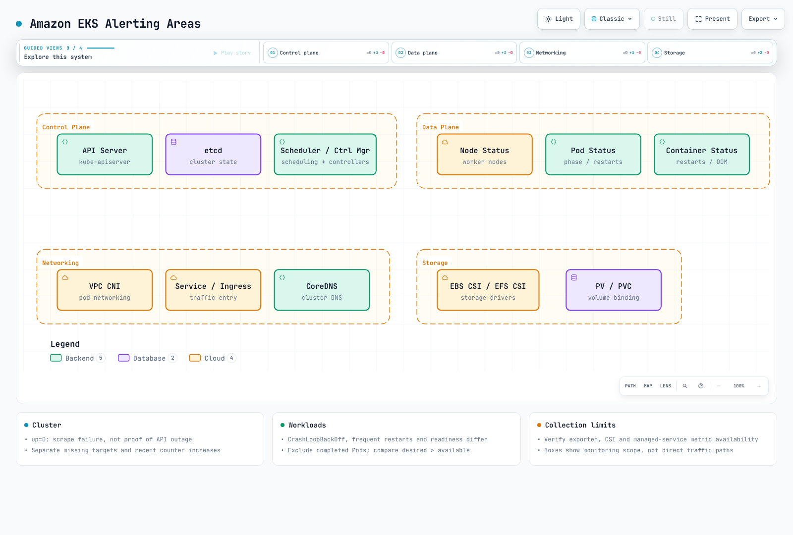

# Alerting Overview

> **Last Updated**: September 13, 2026


> Review baseline: Prometheus 3.14.0 and Alertmanager 0.34.0. Examples assume one cluster and deduplicated series. Verify actual jobs, labels, exporters and metric availability, then tune thresholds. Only local rule/routing checks were run; no cluster or notification channel was exercised.


## Table of Contents

- [The Role and Importance of Alerting](#the-role-and-importance-of-alerting)
- [Alert Lifecycle](#alert-lifecycle)
- [Alert Design Principles](#alert-design-principles)
- [Alert Routing and Escalation](#alert-routing-and-escalation)
- [On-Call Rotation](#on-call-rotation)
- [Alerting Strategy for EKS Environments](#alerting-strategy-for-eks-environments)
- [Solution Comparison](#solution-comparison)

---

## The Role and Importance of Alerting

### Alerting's Position in the Three Pillars of Observability

Metrics, logs and traces are common observability signals; profiles and other signals also exist. A rule engine does not necessarily evaluate all three directly:


[🔍 View interactive diagram](https://www.atomai.click/kubernetes-docs/archmaps/en-observability-alerting-readme-0.html)

- **Metrics**: Quantitative state of the system (CPU, memory, request count, etc.)
- **Logs**: Detailed records of events
- **Traces**: Request flow in distributed systems

Prometheus rules evaluate metrics. Logs and traces feed alerts through backend-specific rules or derived metrics. Detection, notification and human acknowledgment are separate stages, and delivery success needs its own monitoring.

### Why Alerting is Necessary

1. **Proactive Problem Response**: Detect issues before users experience problems
2. **Minimize Downtime**: Improve service availability through fast detection and response
3. **Cost Reduction**: Reduce labor costs through automated monitoring
4. **SLA/SLO Compliance**: Essential component for achieving service level objectives
5. **Incident Recording**: Track and analyze problem occurrence history

### Good Alerts vs Bad Alerts

| Aspect | Good Alerts | Bad Alerts |
|--------|-------------|------------|
| **Actionability** | Requires immediate action | Information only, no action needed |
| **Clarity** | Clear what the problem is | Vague and unclear |
| **Urgency** | Urgency matches severity | Everything is urgent |
| **Frequency** | Appropriate frequency | Too frequent or too rare |
| **Duplication** | Related alerts grouped | Dozens of alerts for same issue |

---

## Alert Lifecycle

The diagram combines rule state and incident response. Prometheus uses inactive/pending/firing; acknowledgment and work-in-progress belong to an on-call tool. Closing an incident does not clear a firing rule. A disappearing time series can also deactivate a rule and must not be treated as proof of recovery:


[🔍 View interactive diagram](https://www.atomai.click/kubernetes-docs/archmaps/en-observability-alerting-readme-1.html)

### 1. Detection

- **Threshold-based**: When a specific value exceeds a configured threshold
- **Rate of change-based**: When the rate of change is abnormal
- **Anomaly detection**: Machine learning-based abnormal pattern detection
- **Log patterns**: When specific log patterns occur

```yaml
groups:
  - name: node-alerts
    rules:
      - alert: HighCPUUsage
        expr: 100 * (1 - avg by (cluster, instance) (rate(node_cpu_seconds_total{mode="idle"}[5m]))) > 80
        for: 5m
        labels:
          severity: warning
          team: sre
        annotations:
          summary: "High CPU usage detected"
          description: "CPU usage is above 80% for 5 minutes on {{ $labels.instance }}"
```

### 2. Notification

- **Channel selection**: Slack, Email, SMS, PagerDuty, etc.
- **Routing**: Deliver to appropriate receivers based on alert type
- **Grouping**: Bundle related alerts together
- **Deduplication**: Reduce duplicate notifications; repeat_interval reminders and retries remain possible, without an exactly-once guarantee

### 3. Escalation

- **Time-based**: Escalate to next responder if no response within specified time
- **Severity-based**: Different escalation paths based on severity
- **Automatic escalation**: Configure it in the on-call service. Alertmanager repeat_interval neither checks acknowledgment nor rotates responders


[🔍 View interactive diagram](https://www.atomai.click/kubernetes-docs/archmaps/en-observability-alerting-readme-2.html)

### 4. Resolution

- **Manual resolution**: A responder closes the incident in the incident tool; rule state is checked separately
- **Auto-resolution**: Update incident state according to integration policy after checking rule and collection health
- **Resolution notification**: Send resolution notification when problem is fixed

---

## Alert Design Principles

### 1. Actionable Alerts

Pages that interrupt a person need an immediate actionable response. Informational events and longer-term work can instead go to tickets or dashboards.

**Bad example:**
```
Alert: Database connection count increased
```

**Good example:**
```
Alert: Database connection pool exhausted
Action Required: Confirm user impact; inspect pool saturation and connection leaks using the runbook
Runbook: https://example.com/runbooks/replace-db-runbook
```

### 2. Preventing Alert Fatigue

Too many alerts can cause important alerts to be missed.


[🔍 View interactive diagram](https://www.atomai.click/kubernetes-docs/archmaps/en-observability-alerting-readme-3.html)

**Alert fatigue prevention strategies:**

1. **Threshold adjustment**: Don't set too sensitive thresholds
2. **Alert grouping**: Bundle related alerts into one
3. **Inhibition**: Suppress child alerts when parent alert fires
4. **Regular review**: Remove unnecessary alerts
5. **Gradual introduction**: Start new alerts with low severity first

### 3. Severity Levels

These response times are illustrative organizational policy, not a product SLA or universal recommendation:

| Severity | Description | Response Time | Examples |
|----------|-------------|---------------|----------|
| **Critical** | Complete service outage | Immediate (within 5 min) | Full service down, data loss risk |
| **High** | Major function failure | Within 15 min | Payment system error, login failure |
| **Warning** | Potential problem | Within 1 hour | 80% disk usage, increased response latency |
| **Info** | Informational alert | Within business hours | Deployment complete, backup success |

```yaml
groups:
  - name: disk-alerts
    rules:
      - alert: DiskSpaceCritical
        expr: |
          (100 * node_filesystem_avail_bytes{fstype!~"tmpfs|overlay|squashfs"}
            / node_filesystem_size_bytes{fstype!~"tmpfs|overlay|squashfs"} < 5)
          and node_filesystem_readonly == 0
          and node_filesystem_size_bytes > 0
        for: 5m
        labels:
          severity: critical
          team: sre
        annotations:
          summary: "Disk space critical"
      - alert: DiskSpaceWarning
        expr: |
          (100 * node_filesystem_avail_bytes{fstype!~"tmpfs|overlay|squashfs"}
            / node_filesystem_size_bytes{fstype!~"tmpfs|overlay|squashfs"} < 20)
          and node_filesystem_readonly == 0
          and node_filesystem_size_bytes > 0
        for: 10m
        labels:
          severity: warning
          team: sre
        annotations:
          summary: "Disk space low"
```

### 4. Alert Documentation

All alerts should include the following information:

- **Description**: What the alert means
- **Impact**: How this problem affects the service
- **Action steps**: Step-by-step guide for resolving the problem
- **Runbook link**: Detailed response procedure document

```yaml
annotations:
  summary: "Investigate {{ $labels.alertname }}"
  description: "Check the rule expression, its units, labels, and collection health."
  impact: "Document the affected user operation before paging."
  action: "Use the owning team's reviewed runbook; do not scale resources blindly."
  runbook_url: "https://example.com/runbooks/replace-with-reviewed-runbook"
```

---

## Alert Routing and Escalation

### Routing Strategy

Alerts should be delivered to appropriate receivers based on various criteria:


[🔍 View interactive diagram](https://www.atomai.click/kubernetes-docs/archmaps/en-observability-alerting-readme-5.html)

### Routing Tree Design

This is a complete **non-notifying** routing-validation configuration. Empty receivers are intentional; configure reviewed integrations and Secret files before production use. Critical alerts fan out to the on-call receiver and matching team. Missing team labels fall back to default, except that a critical-only match does not also call default. Grouping delays mean there is no immediate-phone guarantee. Disk critical inhibits warning only for the same instance/device/mountpoint.

```yaml
route:
  receiver: default-receiver
  group_by: [alertname, cluster, namespace, service]
  group_wait: 30s
  group_interval: 5m
  repeat_interval: 4h
  routes:
    - matchers: ['severity="critical"']
      receiver: critical-oncall
      continue: true
    - matchers: ['team="sre"']
      receiver: sre-team
    - matchers: ['team="app"']
      receiver: dev-team
    - matchers: ['team="database"']
      receiver: dba-team
    - matchers: ['team="security"']
      receiver: security-team
receivers:
  - name: default-receiver
  - name: critical-oncall
  - name: sre-team
  - name: dev-team
  - name: dba-team
  - name: security-team
inhibit_rules:
  - source_matchers: ['alertname="DiskSpaceCritical"', 'instance!=""', 'device!=""', 'mountpoint!=""']
    target_matchers: ['alertname="DiskSpaceWarning"', 'instance!=""', 'device!=""', 'mountpoint!=""']
    equal: [cluster, instance, device, mountpoint]
```

### Escalation Policy

The following is illustrative. Configure time zones, acknowledgment windows, backups and re-page behavior in the on-call service and test them in a drill:

| Step | Time | Target | Channel |
|------|------|--------|---------|
| 1 | 0 min | Primary on-call | Slack, PagerDuty |
| 2 | 15 min | Secondary on-call | Slack, PagerDuty, SMS |
| 3 | 30 min | Team Lead | Slack, PagerDuty, Phone |
| 4 | 45 min | Engineering Manager | Phone |
| 5 | 60 min | CTO/VP Engineering | Phone |

---

## On-Call Rotation

### On-Call Concept

On-call refers to a designated responder responsible for system issues during a specified period.


[🔍 View interactive diagram](https://www.atomai.click/kubernetes-docs/archmaps/en-observability-alerting-readme-8.html)


### On-Call Best Practices

1. **Clear handoff schedule**: Weekly or bi-weekly rotation
2. **Handoff process**: Transfer ongoing issues during shift change
3. **Backup responder**: Backup when primary is unavailable
4. **Appropriate compensation**: On-call allowance or compensatory time off
5. **Burnout prevention**: Appropriate rotation cycle

### On-Call Tool Requirements

- **Schedule management**: Calendar integration, shift management
- **Override**: Temporary responder changes
- **Escalation**: Automatic escalation
- **Mobile support**: Receive alerts anytime, anywhere
- **Reporting**: On-call activity analysis

---

## Alerting Strategy for EKS Environments

### EKS-Specific Alerting Areas



[🔍 View interactive diagram](https://www.atomai.click/kubernetes-docs/archmaps/en-observability-alerting-readme-4.html)

### Alerting Strategy by Layer

#### 1. Cluster-Level Alerts

Replace the job name with the deployed target. up=0 proves a scrape failure, not a complete API outage. The absent rule covers one collection scope; multi-cluster setups need expected-target inventory and cluster labels. Use increase for the cumulative Cluster Autoscaler error counter. A recent increase present for five minutes does not mean errors occurred continuously for five minutes. This rule does not apply unchanged to Karpenter or EKS Auto Mode.

```yaml
groups:
  - name: eks-cluster
    rules:
      - alert: EKSAPIServerScrapeFailed
        expr: up{job="kubernetes-apiservers"} == 0
        for: 1m
        labels:
          severity: critical
          team: sre
        annotations:
          summary: "Prometheus cannot scrape the configured API server target"
      - alert: EKSAPIServerTargetMissing
        expr: absent(up{job="kubernetes-apiservers"})
        for: 5m
        labels:
          severity: warning
          team: sre
        annotations:
          summary: "No API server target series in this Prometheus"
      - alert: EKSNodeNotReady
        expr: kube_node_status_condition{condition="Ready",status="true"} == 0
        for: 5m
        labels:
          severity: critical
          team: sre
        annotations:
          summary: "Node {{ $labels.node }} is not ready"
      - alert: EKSClusterAutoscalerRecentErrors
        expr: increase(cluster_autoscaler_errors_total[10m]) > 0
        for: 5m
        labels:
          severity: warning
          team: sre
        annotations:
          summary: "Cluster Autoscaler recorded failed loops in the last 10 minutes"
```

#### 2. Workload-Level Alerts

```yaml
groups:
  - name: eks-workloads
    rules:
      - alert: PodCrashLooping
        expr: kube_pod_container_status_waiting_reason{reason="CrashLoopBackOff"} == 1
        for: 5m
        labels:
          severity: warning
          team: app
        annotations:
          summary: "Pod {{ $labels.namespace }}/{{ $labels.pod }} is waiting in CrashLoopBackOff"
      - alert: PodFrequentRestarts
        expr: increase(kube_pod_container_status_restarts_total[15m]) > 3
        for: 5m
        labels:
          severity: warning
          team: app
        annotations:
          summary: "Pod {{ $labels.namespace }}/{{ $labels.pod }} has frequent restarts"
      - alert: PodNotReady
        expr: |
          (kube_pod_status_ready{condition="true"} == 0)
          and on (namespace, pod, uid)
          (kube_pod_status_phase{phase=~"Pending|Running|Unknown"} == 1)
        for: 15m
        labels:
          severity: warning
          team: app
        annotations:
          summary: "Active pod {{ $labels.namespace }}/{{ $labels.pod }} is not ready"
      - alert: DeploymentReplicasMismatch
        expr: |
          kube_deployment_spec_replicas
            > on (namespace, deployment) kube_deployment_status_replicas_available
        for: 10m
        labels:
          severity: warning
          team: app
        annotations:
          summary: "Deployment {{ $labels.namespace }}/{{ $labels.deployment }} has fewer available replicas than desired"
```

#### 3. Resource-Level Alerts

The CFS example measures **throttled periods / total periods**, not a fraction of elapsed time. Verify cAdvisor exports these metrics. Unlimited memory can appear as zero or a very large value; restrict the memory rule to containers with explicit limits. PVC statistics depend on the CSI driver and volume type. Zero denominators are excluded, but missing metrics do not prove health.

```yaml
groups:
  - name: eks-resources
    rules:
      - alert: ContainerCPUThrottling
        expr: |
          (
            sum by (namespace, pod, container) (
              rate(container_cpu_cfs_throttled_periods_total{container!="",container!="POD"}[5m]))
            / sum by (namespace, pod, container) (
              rate(container_cpu_cfs_periods_total{container!="",container!="POD"}[5m]))
          ) > 0.25
          and sum by (namespace, pod, container) (
            rate(container_cpu_cfs_periods_total{container!="",container!="POD"}[5m])) > 0
        for: 5m
        labels:
          severity: warning
          team: app
        annotations:
          summary: "More than 25% of CFS periods throttled for {{ $labels.pod }}/{{ $labels.container }}"
      - alert: ContainerMemoryNearLimit
        expr: |
          (
            container_memory_working_set_bytes{container!="",container!="POD"}
            / container_spec_memory_limit_bytes{container!="",container!="POD"}
          ) > 0.9
          and container_spec_memory_limit_bytes{container!="",container!="POD"} > 0
        for: 5m
        labels:
          severity: warning
          team: app
        annotations:
          summary: "Container {{ $labels.pod }}/{{ $labels.container }} memory is near its reported limit"
      - alert: PVCAlmostFull
        expr: |
          (kubelet_volume_stats_used_bytes / kubelet_volume_stats_capacity_bytes > 0.85)
          and kubelet_volume_stats_capacity_bytes > 0
        for: 5m
        labels:
          severity: warning
          team: sre
        annotations:
          summary: "PVC {{ $labels.namespace }}/{{ $labels.persistentvolumeclaim }} is almost full"
```

### AWS Service Integration Alerts

EKS 1.28+ supplies selected control-plane metrics in AWS/EKS; this does not expose every internal component for scraping. Enable control-plane logs separately to investigate authentication errors. Assess availability using collection health, API request failures and external probes:

| AWS Service | Monitoring Items | Alert Tool |
|-------------|------------------|------------|
| EKS Control Plane | API Server availability, authentication errors | CloudWatch |
| EC2 (Nodes) | Instance status, system checks | CloudWatch |
| EBS | Volume status, IOPS usage | CloudWatch |
| EFS | Throughput, connection count | CloudWatch |
| ALB / NLB | ALB HTTP requests/errors/response time; NLB flows/TCP resets/target health | CloudWatch: use product-specific metrics |
| VPC / NAT Gateway | NAT metrics; accepted/rejected records in separately enabled Flow Logs | CloudWatch metrics/Logs; Flow Logs is not an alarm engine |

---

## Solution Comparison

### Major Alerting Solution Comparison Table

| Product | Role and operating constraints |
|---------|--------------------------------|
| Alertmanager | Open-source grouping, routing, inhibition and reminders; hosting and operation required. No on-call schedules or acknowledgment-based escalation |
| CloudWatch Alarms | Evaluates AWS metrics/supported queries, changes state and invokes configured actions; schedules are separate |
| Grafana OnCall OSS | Archived on 2026-03-24; not a default choice for new production deployment |
| Grafana Cloud IRM / PagerDuty | On-call/escalation candidates; verify current plans, channels, regions and contracts |
| Opsgenie | End of sale 2025-06-04; support and service end scheduled for 2027-04-05. Existing users need a migration plan |

### Solution Selection Guide


[🔍 View interactive diagram](https://www.atomai.click/kubernetes-docs/archmaps/en-observability-alerting-readme-6.html)

#### Recommended Solutions by Situation

1. Prometheus-focused: use Alertmanager for grouping/routing and connect the required channels.
2. AWS-metric-focused: evaluate CloudWatch Alarms with SNS or supported incident integrations.
3. Around-the-clock response: choose a maintained on-call service based on staffing, backups, time zones, acknowledgment, escalation and cost.
4. Existing Grafana OnCall OSS/Opsgenie: verify migration of features, history, schedules and integrations.

### Hybrid Approach

Solutions can be combined. CloudWatch does not automatically send directly to Alertmanager. This example uses SNS/a supported integration to the on-call service; routing through Alertmanager requires a separately designed adapter, authentication and duplicate/resolution handling:


[🔍 View interactive diagram](https://www.atomai.click/kubernetes-docs/archmaps/en-observability-alerting-readme-7.html)

**Example architecture:**

1. **Prometheus + Alertmanager**: Metric collection and primary alert processing
2. **CloudWatch**: AWS service metric collection
3. **Maintained on-call service**: On-call management and escalation
4. **Slack**: Real-time alerts and collaboration

---

## Next Steps

This section covered the basic concepts and strategies of alerting. For detailed configuration methods for each solution, refer to the following documents:

- [Prometheus Alertmanager](./01-alertmanager.md): Open source alert management
- [CloudWatch Alarms](./02-cloudwatch-alarms.md): AWS native alerting
- [Grafana OnCall](./03-grafana-oncall.md): existing-installation review and migration considerations

---

## References

- [Prometheus Alerting Best Practices](https://prometheus.io/docs/practices/alerting/)
- [Google SRE Book - Practical Alerting](https://sre.google/sre-book/practical-alerting/)
- [AWS CloudWatch Alarms Documentation](https://docs.aws.amazon.com/AmazonCloudWatch/latest/monitoring/AlarmThatSendsEmail.html)
- [Grafana OnCall Documentation](https://grafana.com/docs/oncall/latest/)
- [PagerDuty Operations Guide](https://www.pagerduty.com/resources/operations/)

- [Alertmanager configuration](https://prometheus.io/docs/alerting/latest/configuration/)
- [EKS control-plane metrics](https://docs.aws.amazon.com/eks/latest/userguide/cloudwatch.html)
- [Opsgenie lifecycle and migration](https://www.atlassian.com/software/opsgenie)
