# Grafana Loki

> **Supported Versions**: Loki 3.x
> **Last Updated**: February 20, 2026

Grafana Loki is a horizontally scalable log aggregation system inspired by Prometheus. It provides cost-effective log storage and querying by indexing only labels rather than log content.

## Table of Contents

1. [Overview](#overview)
2. [Architecture](#architecture)
3. [Deployment Modes](#deployment-modes)
4. [Helm Installation](#helm-installation)
5. [S3 Backend Configuration](#s3-backend-configuration)
6. [LogQL Queries](#logql-queries)
7. [Label Design](#label-design)
8. [Performance Tuning](#performance-tuning)
9. [Retention Policies](#retention-policies)
10. [Troubleshooting](#troubleshooting)

---

## Overview

### Loki's Core Philosophy

Loki was designed with the philosophy of "handling logs like Prometheus":

- **Label-based indexing**: Only indexes metadata (labels), not log content
- **Cost efficiency**: 10x+ cheaper operating costs compared to Elasticsearch
- **Simplicity**: Eliminates complexity of full-text search engines
- **Grafana integration**: Unified analysis of logs, metrics, and traces

### Key Features

| Feature | Description |
|---------|-------------|
| **Horizontal scaling** | Each component can be scaled independently |
| **Multi-tenancy** | Supports tenant-level data isolation |
| **Object storage** | Leverages cheap storage like S3, GCS, Azure Blob |
| **LogQL** | Intuitive PromQL-style query language |
| **High availability** | Built-in replication and failover |

### Loki vs Elasticsearch

```
+---------------------+------------------+------------------+
|       Item          |      Loki        |   Elasticsearch  |
+---------------------+------------------+------------------+
| Indexing method     | Labels only      | Full-text        |
| Storage cost        | Low (object)     | High (SSD rec.)  |
| Query complexity    | Simple (LogQL)   | Complex (Lucene) |
| Full-text search    | Limited          | Excellent        |
| Operational complex.| Low              | High             |
| Memory requirements | Low              | High             |
| Grafana integration | Native           | Plugin           |
+---------------------+------------------+------------------+
```

---

## Architecture

### Component Overview


### Component Details

#### 1. Distributor

The first component to receive log streams from clients.

**Responsibilities:**
- Log stream validation
- Label normalization
- Rate limiting
- Routing to Ingesters via consistent hashing

```yaml
# Distributor configuration example
distributor:
  ring:
    kvstore:
      store: memberlist
  rate_limit_strategy: local
  rate_limit:
    enabled: true
    # Max streams per second per tenant
    ingestion_rate_limit_mb: 4
    ingestion_burst_size_mb: 6
```

#### 2. Ingester

Buffers log data in memory and writes to long-term storage.

**Responsibilities:**
- Log data chunk creation
- WAL (Write-Ahead Log) management
- Flushing chunks to storage
- Serving real-time queries

```yaml
# Ingester configuration example
ingester:
  lifecycler:
    ring:
      replication_factor: 3
      kvstore:
        store: memberlist
    heartbeat_period: 5s
  chunk_idle_period: 30m
  chunk_block_size: 262144
  chunk_retain_period: 1m
  max_transfer_retries: 0
  wal:
    enabled: true
    dir: /var/loki/wal
```

#### 3. Querier

Executes LogQL queries and returns results.

**Responsibilities:**
- Query real-time data from Ingesters
- Query historical data from long-term storage
- Merge and deduplicate results

```yaml
# Querier configuration example
querier:
  max_concurrent: 10
  query_timeout: 5m
  engine:
    timeout: 5m
    max_look_back_period: 30d
```

#### 4. Query Frontend

Handles query optimization and caching.

**Responsibilities:**
- Split large queries
- Cache results
- Manage query queues
- Handle retries

```yaml
# Query Frontend configuration example
query_frontend:
  max_outstanding_per_tenant: 2048
  compress_responses: true
  log_queries_longer_than: 5s
  query_stats_enabled: true
```

#### 5. Compactor

Optimizes stored data.

**Responsibilities:**
- Merge small chunks into larger chunks
- Optimize indexes
- Apply retention policies (data deletion)

```yaml
# Compactor configuration example
compactor:
  working_directory: /var/loki/compactor
  shared_store: s3
  compaction_interval: 10m
  retention_enabled: true
  retention_delete_delay: 2h
  retention_delete_worker_count: 150
```

---

## Deployment Modes

Loki offers three deployment modes:

### 1. Monolithic Mode

All components run in a single process.

```yaml
# values-monolithic.yaml
deploymentMode: SingleBinary

singleBinary:
  replicas: 1
  resources:
    limits:
      cpu: 2
      memory: 4Gi
    requests:
      cpu: 1
      memory: 2Gi

loki:
  auth_enabled: false
  commonConfig:
    replication_factor: 1
```

**Best for:**
- Development/test environments
- Daily log volume < 100GB
- Quick prototyping

### 2. Simple Scalable Mode (Recommended)

Provides scalability by separating read/write paths.

```yaml
# values-simple-scalable.yaml
deploymentMode: SimpleScalable

read:
  replicas: 3
  resources:
    limits:
      cpu: 2
      memory: 4Gi
    requests:
      cpu: 1
      memory: 2Gi

write:
  replicas: 3
  resources:
    limits:
      cpu: 2
      memory: 4Gi
    requests:
      cpu: 1
      memory: 2Gi

backend:
  replicas: 2
  resources:
    limits:
      cpu: 1
      memory: 2Gi
    requests:
      cpu: 500m
      memory: 1Gi
```

**Best for:**
- Production environments
- Daily log volume 100GB ~ 10TB
- Most EKS clusters

### 3. Microservices Mode

Deploys each component independently.

```yaml
# values-microservices.yaml
deploymentMode: Distributed

distributor:
  replicas: 3
  autoscaling:
    enabled: true
    minReplicas: 3
    maxReplicas: 10

ingester:
  replicas: 3
  autoscaling:
    enabled: true
    minReplicas: 3
    maxReplicas: 20
  persistence:
    enabled: true
    size: 50Gi

querier:
  replicas: 3
  autoscaling:
    enabled: true
    minReplicas: 3
    maxReplicas: 15

queryFrontend:
  replicas: 2
  autoscaling:
    enabled: true
    minReplicas: 2
    maxReplicas: 5

compactor:
  replicas: 1
```

**Best for:**
- Large-scale production environments
- Daily log volume > 10TB
- Fine-grained per-component resource management

---

## Helm Installation

### Prerequisites

```bash
# Add Helm repository
helm repo add grafana https://grafana.github.io/helm-charts
helm repo update

# Create namespace
kubectl create namespace loki
```

### Simple Scalable Mode Installation (Recommended for EKS)

```yaml
# values-eks-production.yaml
deploymentMode: SimpleScalable

loki:
  auth_enabled: false

  schemaConfig:
    configs:
      - from: "2024-01-01"
        store: tsdb
        object_store: s3
        schema: v13
        index:
          prefix: loki_index_
          period: 24h

  storage:
    type: s3
    bucketNames:
      chunks: my-loki-chunks
      ruler: my-loki-ruler
      admin: my-loki-admin
    s3:
      region: ap-northeast-2
      # endpoint auto-configured when using IRSA

  commonConfig:
    replication_factor: 3

  limits_config:
    retention_period: 744h  # 31 days
    max_query_length: 721h
    max_query_parallelism: 32
    ingestion_rate_mb: 10
    ingestion_burst_size_mb: 20
    per_stream_rate_limit: 5MB
    per_stream_rate_limit_burst: 15MB

  rulerConfig:
    storage:
      type: s3
      s3:
        bucketnames: my-loki-ruler

# Read path
read:
  replicas: 3
  resources:
    limits:
      cpu: 2
      memory: 4Gi
    requests:
      cpu: 1
      memory: 2Gi
  affinity:
    podAntiAffinity:
      preferredDuringSchedulingIgnoredDuringExecution:
        - weight: 100
          podAffinityTerm:
            labelSelector:
              matchLabels:
                app.kubernetes.io/component: read
            topologyKey: topology.kubernetes.io/zone

# Write path
write:
  replicas: 3
  resources:
    limits:
      cpu: 2
      memory: 4Gi
    requests:
      cpu: 1
      memory: 2Gi
  persistence:
    enabled: true
    size: 50Gi
    storageClass: gp3
  affinity:
    podAntiAffinity:
      preferredDuringSchedulingIgnoredDuringExecution:
        - weight: 100
          podAffinityTerm:
            labelSelector:
              matchLabels:
                app.kubernetes.io/component: write
            topologyKey: topology.kubernetes.io/zone

# Backend
backend:
  replicas: 2
  resources:
    limits:
      cpu: 1
      memory: 2Gi
    requests:
      cpu: 500m
      memory: 1Gi
  persistence:
    enabled: true
    size: 20Gi
    storageClass: gp3

# Gateway
gateway:
  enabled: true
  replicas: 2
  resources:
    limits:
      cpu: 500m
      memory: 512Mi
    requests:
      cpu: 100m
      memory: 128Mi
  ingress:
    enabled: true
    ingressClassName: alb
    annotations:
      alb.ingress.kubernetes.io/scheme: internal
      alb.ingress.kubernetes.io/target-type: ip
    hosts:
      - host: loki.internal.example.com
        paths:
          - path: /
            pathType: Prefix

# Results caching
resultsCache:
  enabled: true
  defaultValidity: 12h
  # External Redis recommended for production
  # host: redis.example.com:6379

# Chunks caching
chunksCache:
  enabled: true
  defaultValidity: 12h

# Monitoring
monitoring:
  serviceMonitor:
    enabled: true
    labels:
      release: prometheus
  selfMonitoring:
    enabled: true
    grafanaAgent:
      installOperator: false

# Disable tests
test:
  enabled: false
```

### Run Installation

```bash
# Install
helm install loki grafana/loki \
  --namespace loki \
  --values values-eks-production.yaml \
  --version 6.x.x

# Upgrade
helm upgrade loki grafana/loki \
  --namespace loki \
  --values values-eks-production.yaml

# Check status
kubectl get pods -n loki
kubectl get svc -n loki
```

---

## S3 Backend Configuration

### IRSA (IAM Roles for Service Accounts) Setup

```bash
# 1. Create IAM policy
cat > loki-s3-policy.json << 'EOF'
{
  "Version": "2012-10-17",
  "Statement": [
    {
      "Effect": "Allow",
      "Action": [
        "s3:ListBucket",
        "s3:GetBucketLocation"
      ],
      "Resource": [
        "arn:aws:s3:::my-loki-chunks",
        "arn:aws:s3:::my-loki-ruler",
        "arn:aws:s3:::my-loki-admin"
      ]
    },
    {
      "Effect": "Allow",
      "Action": [
        "s3:PutObject",
        "s3:GetObject",
        "s3:DeleteObject"
      ],
      "Resource": [
        "arn:aws:s3:::my-loki-chunks/*",
        "arn:aws:s3:::my-loki-ruler/*",
        "arn:aws:s3:::my-loki-admin/*"
      ]
    }
  ]
}
EOF

aws iam create-policy \
  --policy-name LokiS3Policy \
  --policy-document file://loki-s3-policy.json

# 2. Setup IRSA
eksctl create iamserviceaccount \
  --cluster=my-cluster \
  --namespace=loki \
  --name=loki \
  --attach-policy-arn=arn:aws:iam::123456789012:policy/LokiS3Policy \
  --approve
```

### S3 Bucket Creation (Terraform)

```hcl
# s3.tf
resource "aws_s3_bucket" "loki_chunks" {
  bucket = "my-loki-chunks"

  tags = {
    Name        = "Loki Chunks"
    Environment = "production"
  }
}

resource "aws_s3_bucket" "loki_ruler" {
  bucket = "my-loki-ruler"

  tags = {
    Name        = "Loki Ruler"
    Environment = "production"
  }
}

resource "aws_s3_bucket_versioning" "loki_chunks" {
  bucket = aws_s3_bucket.loki_chunks.id
  versioning_configuration {
    status = "Disabled"
  }
}

resource "aws_s3_bucket_lifecycle_configuration" "loki_chunks" {
  bucket = aws_s3_bucket.loki_chunks.id

  rule {
    id     = "transition-to-ia"
    status = "Enabled"

    transition {
      days          = 30
      storage_class = "STANDARD_IA"
    }

    transition {
      days          = 90
      storage_class = "GLACIER"
    }

    expiration {
      days = 365
    }
  }
}

resource "aws_s3_bucket_server_side_encryption_configuration" "loki_chunks" {
  bucket = aws_s3_bucket.loki_chunks.id

  rule {
    apply_server_side_encryption_by_default {
      sse_algorithm = "AES256"
    }
  }
}

resource "aws_s3_bucket_public_access_block" "loki_chunks" {
  bucket = aws_s3_bucket.loki_chunks.id

  block_public_acls       = true
  block_public_policy     = true
  ignore_public_acls      = true
  restrict_public_buckets = true
}
```

### Loki Storage Configuration

```yaml
# loki-config.yaml
storage_config:
  tsdb_shipper:
    active_index_directory: /var/loki/tsdb-index
    cache_location: /var/loki/tsdb-cache
    shared_store: s3

  aws:
    s3: s3://ap-northeast-2/my-loki-chunks
    bucketnames: my-loki-chunks
    region: ap-northeast-2
    # access_key_id and secret_access_key not needed with IRSA
    s3forcepathstyle: false
    insecure: false
    sse_encryption: true

  boltdb_shipper:
    active_index_directory: /var/loki/boltdb-index
    cache_location: /var/loki/boltdb-cache
    shared_store: s3
```

---

## LogQL Queries

### Basic Syntax

LogQL supports two types of queries:

1. **Log queries**: Return log lines
2. **Metric queries**: Return calculated values from logs

### Stream Selectors

```logql
# Basic stream selection
{namespace="production"}

# Multiple label combinations
{namespace="production", app="nginx"}

# Label matching operators
{namespace="production", app=~"nginx|apache"}  # Regex match
{namespace!="kube-system"}                      # Negation
{app!~"test.*"}                                 # Regex negation
```

### Line Filters

```logql
# Contains
{app="nginx"} |= "error"

# Does not contain
{app="nginx"} != "healthcheck"

# Regex match
{app="nginx"} |~ "status=[45][0-9]{2}"

# Regex does not match
{app="nginx"} !~ "GET /health"

# Chaining
{app="nginx"} |= "error" != "timeout" |~ "user_id=\\d+"
```

### Parsers

```logql
# JSON parser
{app="api"} | json

# Extract specific fields only
{app="api"} | json level, message, user_id

# Logfmt parser
{app="api"} | logfmt

# Regex parser
{app="nginx"} | regexp `(?P<ip>[\d.]+) - - \[(?P<timestamp>[^\]]+)\]`

# Pattern parser (faster)
{app="nginx"} | pattern `<ip> - - [<_>] "<method> <path> <_>" <status> <size>`

# Unpack (Promtail pack stage result)
{app="api"} | unpack
```

### Label Filters

```logql
# Filter after JSON parsing
{app="api"} | json | level="error"

# Numeric comparison
{app="api"} | json | response_time > 1000

# Multiple conditions
{app="api"} | json | level="error" and user_id!=""

# IP filtering
{app="nginx"} | pattern `<ip> - -` | ip != "10.0.0.1"
```

### Line Format

```logql
# Reconstruct log line
{app="api"} | json | line_format "{{.level}}: {{.message}}"

# Conditional format
{app="api"} | json | line_format `{{ if eq .level "error" }}ERROR: {{ end }}{{.message}}`

# Template functions
{app="api"} | json | line_format `{{ .timestamp | toDate "2006-01-02T15:04:05Z07:00" | date "15:04:05" }}`
```

### Metric Queries

```logql
# Log lines per second
rate({app="nginx"}[5m])

# Error ratio
sum(rate({app="nginx"} |= "error" [5m])) / sum(rate({app="nginx"}[5m]))

# Response time percentiles
quantile_over_time(0.99,
  {app="api"} | json | unwrap response_time [5m]
) by (endpoint)

# Top 10 errors
topk(10, sum by (error_type) (
  count_over_time({app="api"} | json | level="error" [1h])
))

# Average response size
avg_over_time(
  {app="nginx"} | pattern `<_> <_> <size>` | unwrap size [5m]
) by (path)

# Error count aggregation
sum(count_over_time({namespace="production"} |= "error" [1h])) by (app)

# Absent log detection
absent_over_time({app="critical-service"}[5m])
```

### Practical Query Examples

```logql
# Analyze Kubernetes pod restart causes
{namespace="production"} |= "OOMKilled" or |= "CrashLoopBackOff"

# Find slow API requests
{app="api"} | json | response_time > 5000 | line_format `{{.method}} {{.path}}: {{.response_time}}ms`

# Track specific user activity
{app="api"} | json | user_id="user-12345" | line_format `{{.timestamp}} {{.action}}`

# HTTP 5xx error analysis
{app="nginx"} | pattern `<_> "<method> <path> <_>" <status>` | status >= 500

# Error patterns by time
sum by (hour) (
  count_over_time({app="api"} |= "error" [1h])
  | label_format hour="{{ __timestamp__ | date \"15\" }}"
)

# Detect error spike after deployment
sum(increase(
  count_over_time({app="api"} |= "error" [5m])
)) > 100
```

---

## Label Design

### Label Design Principles

Good label design is key to Loki performance.

#### Recommended Labels

```yaml
# Good labels (low cardinality)
labels:
  - namespace     # ~10-50 values
  - app           # ~50-200 values
  - environment   # dev, staging, production
  - component     # api, worker, scheduler
  - log_level     # debug, info, warn, error
```

#### Labels to Avoid

```yaml
# Bad labels (high cardinality)
labels:
  - pod_name      # Thousands of unique values
  - request_id    # Unique per request
  - user_id       # Millions of users
  - timestamp     # Never use as label
  - ip_address    # Very high cardinality
```

### Cardinality Management



**Stream Count Calculation:**
```
Total streams = namespace values x app values x component values x ...
```

**Recommendations:**
- Total streams per cluster: < 100,000
- Active streams per tenant: < 10,000
- Unique values per label: < 1,000

### Promtail Label Configuration

```yaml
# promtail-config.yaml
scrape_configs:
  - job_name: kubernetes-pods
    kubernetes_sd_configs:
      - role: pod
    relabel_configs:
      # Namespace label
      - source_labels: [__meta_kubernetes_namespace]
        target_label: namespace

      # App label (from Kubernetes labels)
      - source_labels: [__meta_kubernetes_pod_label_app]
        target_label: app

      # Component label
      - source_labels: [__meta_kubernetes_pod_label_component]
        target_label: component

      # Container name
      - source_labels: [__meta_kubernetes_pod_container_name]
        target_label: container

      # Do not add pod_name as label (high cardinality)
      # Include in log line instead

    pipeline_stages:
      - json:
          expressions:
            level: level
      - labels:
          level:
```

### Dynamic Labeling

```yaml
# Extract labels from log content
pipeline_stages:
  - json:
      expressions:
        level: level
        service: service

  - labels:
      level:
      service:

  # High cardinality values as structured metadata
  - structured_metadata:
      user_id:
      request_id:
```

---

## Performance Tuning

### Ingester Tuning

```yaml
ingester:
  # Chunk settings
  chunk_idle_period: 30m      # Wait time before flushing idle stream
  chunk_block_size: 262144    # Chunk block size (256KB)
  chunk_target_size: 1572864  # Target chunk size (1.5MB)
  chunk_retain_period: 1m     # Memory retention time after flush

  # Concurrency
  max_chunk_age: 2h           # Maximum chunk age
  concurrent_flushes: 32      # Concurrent flush count

  # WAL
  wal:
    enabled: true
    dir: /var/loki/wal
    flush_on_shutdown: true
    replay_memory_ceiling: 4GB
```

### Querier Tuning

```yaml
querier:
  max_concurrent: 16          # Concurrent queries
  query_timeout: 5m           # Query timeout

  engine:
    timeout: 5m
    max_look_back_period: 30d

query_range:
  align_queries_with_step: true
  cache_results: true
  max_retries: 5
  parallelise_shardable_queries: true

  results_cache:
    cache:
      embedded_cache:
        enabled: true
        max_size_mb: 500
```

### Frontend Tuning

```yaml
query_frontend:
  max_outstanding_per_tenant: 4096
  compress_responses: true
  log_queries_longer_than: 10s

  # Query splitting
  split_queries_by_interval: 30m

query_scheduler:
  max_outstanding_requests_per_tenant: 2048
  grpc_client_config:
    max_recv_msg_size: 104857600  # 100MB
```

### Resource Guidelines

```yaml
# Small (daily < 100GB)
write:
  replicas: 2
  resources:
    requests:
      cpu: 500m
      memory: 1Gi
    limits:
      cpu: 1
      memory: 2Gi

read:
  replicas: 2
  resources:
    requests:
      cpu: 500m
      memory: 1Gi
    limits:
      cpu: 1
      memory: 2Gi

---
# Medium (daily 100GB - 1TB)
write:
  replicas: 3
  resources:
    requests:
      cpu: 1
      memory: 2Gi
    limits:
      cpu: 2
      memory: 4Gi

read:
  replicas: 3
  resources:
    requests:
      cpu: 1
      memory: 2Gi
    limits:
      cpu: 2
      memory: 4Gi

---
# Large (daily > 1TB)
write:
  replicas: 5
  autoscaling:
    enabled: true
    minReplicas: 5
    maxReplicas: 20
  resources:
    requests:
      cpu: 2
      memory: 4Gi
    limits:
      cpu: 4
      memory: 8Gi

read:
  replicas: 5
  autoscaling:
    enabled: true
    minReplicas: 5
    maxReplicas: 15
  resources:
    requests:
      cpu: 2
      memory: 4Gi
    limits:
      cpu: 4
      memory: 8Gi
```

---

## Retention Policies

### Global Retention Policy

```yaml
# loki-config.yaml
limits_config:
  retention_period: 744h  # 31 days (default)

compactor:
  working_directory: /var/loki/compactor
  shared_store: s3
  retention_enabled: true
  retention_delete_delay: 2h
  retention_delete_worker_count: 150
  delete_request_store: s3
```

### Per-Tenant Retention Policy

```yaml
# runtime-config.yaml
overrides:
  tenant-production:
    retention_period: 2160h   # 90 days

  tenant-development:
    retention_period: 168h    # 7 days

  tenant-compliance:
    retention_period: 8760h   # 365 days
```

### Per-Stream Retention Policy

```yaml
limits_config:
  retention_stream:
    - selector: '{namespace="production", level="error"}'
      priority: 1
      period: 2160h  # 90 days - production errors

    - selector: '{namespace="development"}'
      priority: 2
      period: 72h    # 3 days - development

    - selector: '{app="audit-log"}'
      priority: 1
      period: 8760h  # 365 days - audit logs
```

---

## Troubleshooting

### Common Issues and Solutions

#### 1. "too many outstanding requests"

```yaml
# Symptom: Query failures, 503 errors
# Cause: Frontend/scheduler overload

# Solution
query_frontend:
  max_outstanding_per_tenant: 4096  # Increase from default 2048

query_scheduler:
  max_outstanding_requests_per_tenant: 2048

# Or increase querier replicas
querier:
  replicas: 5  # From 3 to 5
```

#### 2. "rate limit exceeded"

```yaml
# Symptom: Log collection failures, 429 errors
# Cause: Ingestion rate limit exceeded

# Solution
limits_config:
  ingestion_rate_mb: 20           # Increase from default 4
  ingestion_burst_size_mb: 30     # Increase from default 6
  per_stream_rate_limit: 10MB     # Per-stream limit
  per_stream_rate_limit_burst: 30MB
```

#### 3. "max streams limit exceeded"

```yaml
# Symptom: New stream creation fails
# Cause: High cardinality labels

# Solution 1: Increase limit (temporary)
limits_config:
  max_streams_per_user: 20000     # Default 10000

# Solution 2: Reduce label cardinality (recommended)
# Remove high cardinality labels in promtail config
```

#### 4. Query Performance Degradation

```bash
# Diagnostics
# 1. Check query stats
curl -s "http://loki:3100/loki/api/v1/query_range" \
  -G --data-urlencode 'query={app="nginx"}' \
  --data-urlencode 'start=1h' | jq '.data.stats'

# 2. Check stream count
curl -s "http://loki:3100/loki/api/v1/series" \
  -G --data-urlencode 'match[]={namespace="production"}' | jq '.data | length'
```

```yaml
# Solution
query_range:
  parallelise_shardable_queries: true
  split_queries_by_interval: 15m  # From 30m to 15m

limits_config:
  max_query_parallelism: 64       # From 32 to 64
```

#### 5. Ingester OOM

```yaml
# Symptom: Ingester pod restarts, OOM Killed
# Cause: Insufficient memory settings or chunk configuration issues

# Solution 1: Increase memory
ingester:
  resources:
    limits:
      memory: 8Gi   # Increase from 4Gi
    requests:
      memory: 4Gi

# Solution 2: Adjust chunk settings
ingester:
  chunk_idle_period: 15m     # Decrease from 30m
  chunk_target_size: 1048576 # Smaller chunks
  max_chunk_age: 1h          # Decrease from 2h
```

### Useful Diagnostic Commands

```bash
# Check Loki status
kubectl exec -it loki-read-0 -n loki -- wget -qO- http://localhost:3100/ready

# Check ring membership
kubectl exec -it loki-write-0 -n loki -- wget -qO- http://localhost:3100/ring

# Check flush status
kubectl exec -it loki-write-0 -n loki -- wget -qO- http://localhost:3100/flush

# Check metrics
kubectl exec -it loki-write-0 -n loki -- wget -qO- http://localhost:3100/metrics | grep loki_ingester

# Check configuration
kubectl exec -it loki-read-0 -n loki -- wget -qO- http://localhost:3100/config
```

### Grafana Dashboard Setup

```json
{
  "annotations": {
    "list": []
  },
  "panels": [
    {
      "title": "Ingestion Rate",
      "targets": [
        {
          "expr": "sum(rate(loki_distributor_bytes_received_total[5m]))",
          "legendFormat": "bytes/s"
        }
      ]
    },
    {
      "title": "Active Streams",
      "targets": [
        {
          "expr": "sum(loki_ingester_memory_streams)",
          "legendFormat": "streams"
        }
      ]
    },
    {
      "title": "Query Latency",
      "targets": [
        {
          "expr": "histogram_quantile(0.99, sum(rate(loki_request_duration_seconds_bucket{route=~\"loki_api_v1_query.*\"}[5m])) by (le))",
          "legendFormat": "p99"
        }
      ]
    }
  ]
}
```

---

## Best Practices Summary

### Do's

1. **Keep labels minimal**: Use only namespace, app, component, level
2. **Adopt JSON logging**: Reduce parsing overhead with structured logs
3. **Configure S3 lifecycle**: Set up tiering for cost optimization
4. **Use IRSA**: Use IAM Role instead of Access Keys
5. **Enable caching**: Improve performance with query result and chunk caching
6. **Set up monitoring**: Collect Loki's own metrics and configure alerts

### Don'ts

1. **Avoid high cardinality labels**: pod_name, request_id, etc.
2. **Avoid unlimited query ranges**: Time range limits are essential
3. **Avoid single node deployment**: Minimum 3 replicas for production
4. **Don't disable WAL**: Essential for data loss prevention
5. **Don't deploy without resource limits**: Prevent OOM

---

## Quiz

Test your knowledge with the [Loki Quiz](../../quizzes/observability/logging/01-loki-quiz.md).
