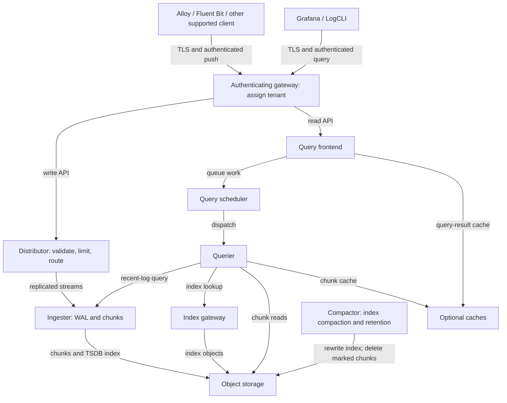

# Grafana Loki

> **Last Updated**: September 13, 2026
> **Example baseline**: Loki 3.7.7 / community Helm chart 18.12.1. Local configuration, rendering and LogQL checks; no EKS deployment, S3 access, load test or HA/failover test.

Loki stores logs as compressed chunks and indexes stream labels. This can reduce index overhead, but does not establish a universal cost or query-speed advantage over Elasticsearch/OpenSearch. Compare ingestion, retention, query selectivity, object requests, compute, caches and operational requirements with a representative workload.

## Overview

| Capability | Meaning and boundary |
|---|---|
| Label index | Select streams before scanning their log content. Parsing JSON and scanning chunks still require work. |
| Object storage | Production storage can use S3 and other supported backends. Local filesystem storage is useful for small experiments, but is not a shared distributed object store. |
| LogQL | Supports log pipelines and metrics derived from logs. It is not interchangeable with PromQL or SQL. |
| Multi-tenancy | Tenant IDs separate data and limits. An authenticating proxy must decide which tenant a caller may access. |
| Scaling and replication | Depend on the deployment mode, ring, quorum, storage and failure domains. Replicas and WAL alone do not guarantee lossless delivery. |

Elasticsearch/OpenSearch has a different indexing and search model. Loki can search log text, but ordinarily first narrows the label/time range and scans matching chunks. Avoid fixed “10× cheaper,” “always faster,” or memory rankings without a reproducible comparison.

## Architecture

The diagram shows a conventional TSDB/chunk deployment, not every optional or experimental Loki component. Query arrows point toward the service being requested; responses return along the same path.



| Component | Responsibilities |
|---|---|
| Distributor | Validates streams, applies tenant/per-stream ingestion limits and routes writes through the ring. Byte-rate limits are not a streams-per-second setting. |
| Ingester | Buffers streams, writes a WAL when enabled, builds/flushes chunks and serves recent data. Persistent WAL storage reduces a failure risk; it does not replace replication, backups or client retry planning. |
| Querier | Reads recent data from ingesters and historical data through the index/object-store paths, then evaluates LogQL and merges results. |
| Query frontend / scheduler | Splits and queues query work; optional result caching and controlled retries. The runtime configuration key is `frontend`; Helm's workload key is `queryFrontend`. |
| Index gateway | Serves index lookups in a distributed deployment. It is distinct from the chunk store. |
| Compactor | Compacts **index files** and, when enabled, removes expired index references and asynchronously deletes marked chunks. It is not a general small-log-chunk merger. |

## Deployment modes

| Mode | Selection guidance |
|---|---|
| Monolithic, `-target=all` | Convenient for small installations and experiments. Chart 18.12.1 calls the mode `Monolithic`; its workload values remain under `singleBinary`. The chart default is not evidence of production suitability. |
| Simple Scalable (SSD) | Historical read/write/backend groups. SSD is deprecated and scheduled for removal in Loki 4.0. Plan an explicit migration rather than selecting it as the default for new production EKS installations. |
| Microservices, chart `Distributed` | Separate distributors, ingesters, queriers, frontend, scheduler, index gateway and compactor. Current Helm guidance recommends this for production scalability/HA, with higher operational complexity. |

The old `<100GB`, `100GB–10TB`, and `>10TB` categories were not measured capacities. Size for peak bytes/sec, active streams, query concurrency, retention, chunk utilization and failure recovery. Do not turn approximate sizing guidance into a guarantee.

## Helm installation

### Prerequisites and ownership

The following is a **configuration starting point for a new installation**, not a complete production platform:

- Chart 18.12.1 declares Kubernetes `>=1.25.0-0`; the manifest check used Kubernetes 1.36.2. This is not a test of every Kubernetes/EKS version or platform.
- Provision private buckets, a scoped IAM role, an EKS OIDC provider for IRSA, and an appropriate existing `gp3` StorageClass. That class name is an assumption, not an EKS built-in guarantee. EBS CSI/Auto Mode provisioner, node OS, AZ capacity, PVC binding and quotas must match the actual cluster.
- Prepare `loki-gateway-auth` with a `.htpasswd` key and `loki-gateway-tls` with `tls.crt`/`tls.key`. Use a trusted certificate for the gateway's actual DNS names. Supply secrets through your secret-management workflow; do not commit passwords or private keys to values files.
- The gateway maps the authenticated username to `X-Scope-OrgID`, overriding a caller-supplied tenant header. Restrict direct access to Loki component ports with network policy/security boundaries and namespace RBAC. A tenant header alone is not authentication; bypassing the gateway bypasses its authorization.
- The gateway uses HTTPS and a ClusterIP Service, with ingress disabled. Internal Loki component traffic still needs the transport/network controls appropriate to the environment. No ALB, public endpoint or complete network policy is provisioned here.

### Versioned distributed values

Save as `values-eks.yaml`. Replace the example account, role and bucket names consistently. The schema start date is for a **new** store; preserve all existing schema entries during upgrades.

```yaml
deploymentMode: Distributed
loki:
  image:
    tag: 3.7.7
  auth_enabled: true
  analytics:
    reporting_enabled: false
  commonConfig:
    replication_factor: 3
  schemaConfig:
    configs:
    - from: '2026-09-01'
      store: tsdb
      object_store: s3
      schema: v13
      index:
        prefix: loki_index_
        period: 24h
  storage:
    type: s3
    bucketNames:
      chunks: example-loki-chunks-123456789012
      ruler: example-loki-ruler-123456789012
    s3:
      region: ap-northeast-2
  ingester:
    chunk_encoding: snappy
    wal:
      enabled: true
      dir: /var/loki/wal
  compactor:
    working_directory: /var/loki/compactor
    retention_enabled: true
    delete_request_store: s3
    retention_delete_delay: 2h
  limits_config:
    retention_period: 744h
    allow_structured_metadata: true
    ingestion_rate_strategy: global
    ingestion_rate_mb: 10
    ingestion_burst_size_mb: 20
    per_stream_rate_limit: 5MB
    per_stream_rate_limit_burst: 15MB
  runtimeConfig:
    overrides:
      development:
        retention_period: 168h
serviceAccount:
  create: true
  name: loki
  annotations:
    eks.amazonaws.com/role-arn: arn:aws:iam::123456789012:role/loki-s3
singleBinary:
  replicas: 0
read:
  replicas: 0
write:
  replicas: 0
backend:
  replicas: 0
ingester:
  replicas: 3
  zoneAwareReplication:
    enabled: false
  persistence:
    enabled: true
    claims:
    - name: data
      accessModes:
      - ReadWriteOnce
      size: 50Gi
      storageClass: gp3
distributor:
  replicas: 2
querier:
  replicas: 2
queryFrontend:
  replicas: 2
queryScheduler:
  replicas: 2
indexGateway:
  replicas: 2
compactor:
  replicas: 1
  persistence:
    enabled: true
    claims:
    - name: data
      accessModes:
      - ReadWriteOnce
      size: 20Gi
      storageClass: gp3
ruler:
  enabled: false
gateway:
  enabled: true
  replicas: 2
  service:
    type: ClusterIP
    port: 443
  ingress:
    enabled: false
  basicAuth:
    enabled: true
    existingSecret: loki-gateway-auth
  nginxConfig:
    locationSnippet: proxy_set_header X-Scope-OrgID $remote_user;
    ssl: true
    serverSnippet: 'ssl_certificate /etc/nginx/tls/tls.crt;

      ssl_certificate_key /etc/nginx/tls/tls.key;

      ssl_protocols TLSv1.2 TLSv1.3;'
  containerPort: 8443
  metrics:
    enabled: false
  extraVolumes:
  - name: gateway-tls
    secret:
      secretName: loki-gateway-tls
  extraVolumeMounts:
  - name: gateway-tls
    mountPath: /etc/nginx/tls
    readOnly: true
  readinessProbe:
    httpGet:
      path: /
      port: http
      scheme: HTTPS
    initialDelaySeconds: 15
    timeoutSeconds: 1
chunksCache:
  enabled: false
resultsCache:
  enabled: false
sidecar:
  rules:
    enabled: false
lokiCanary:
  enabled: false
test:
  enabled: false
```

The `loki.*` fields configure the application; top-level `ingester`, `querier`, `compactor` and other component fields configure Kubernetes workloads. The example deliberately uses one compactor and three ingesters. It disables zone-aware replication, so it makes **no AZ-resilience claim**. Add appropriate requests/limits, anti-affinity/topology spread, PDBs and tested capacity before production; do not copy the old fixed CPU/memory sizing table.

The ruler is disabled here. The optional ruler bucket is shown for a later rule configuration; it is not an administrative bucket required by open-source Loki. The enterprise `admin` bucket is not required for this example. Caches and synthetic canary/test workloads are disabled to keep the example's scope clear; plan and enable them separately with suitable capacity and authentication.

```bash
helm repo add grafana-community https://grafana-community.github.io/helm-charts
helm repo update grafana-community

# Review the rendered resources before installing.
helm template loki grafana-community/loki \
  --version 18.12.1 --namespace loki \
  --values values-eks.yaml > loki-rendered.yaml

# Creates/updates resources; run only against the intended cluster.
helm upgrade --install loki grafana-community/loki \
  --version 18.12.1 --namespace loki --create-namespace \
  --values values-eks.yaml

kubectl get pods,services,pvc -n loki
```

For an existing release, review the intervening chart/Loki upgrade notes, values changes, schema compatibility and rollback limits first. Replacing an old chart's values with this file is not an in-place migration procedure.

## S3 backend and workload identity

### IAM and ServiceAccount

This example uses IRSA. EKS Pod Identity is another option when the node platform, agent and the application's AWS SDK credential chain support it; IRSA is not the only secure choice. Do not embed S3 access keys in Loki YAML or inherit broad node-role permissions.

An illustrative same-account policy for the named buckets is:

```json
{
  "Version": "2012-10-17",
  "Statement": [
    {
      "Effect": "Allow",
      "Action": [
        "s3:ListBucket",
        "s3:GetBucketLocation"
      ],
      "Resource": [
        "arn:aws:s3:::example-loki-chunks-123456789012",
        "arn:aws:s3:::example-loki-ruler-123456789012"
      ],
      "Condition": {
        "StringEquals": {
          "aws:ResourceAccount": "123456789012"
        }
      }
    },
    {
      "Effect": "Allow",
      "Action": [
        "s3:GetObject",
        "s3:PutObject",
        "s3:DeleteObject"
      ],
      "Resource": [
        "arn:aws:s3:::example-loki-chunks-123456789012/*",
        "arn:aws:s3:::example-loki-ruler-123456789012/*"
      ],
      "Condition": {
        "StringEquals": {
          "aws:ResourceAccount": "123456789012"
        }
      }
    }
  ]
}
```

The compactor needs object deletion for retention. Separate component roles can narrow privileges further. With SSE-KMS, add the specific KMS permissions and key policy needed by the selected encryption configuration; `s3:*` or a broadly trusted role is not a substitute.

An IRSA role must trust the cluster's exact OIDC provider, with `aud=sts.amazonaws.com` and `sub=system:serviceaccount:loki:loki`. After creating/reviewing that scoped policy and associating the OIDC provider, an administrator can create **only the role**:

```bash
eksctl create iamserviceaccount \
  --cluster="$CLUSTER_NAME" --region="$AWS_REGION" \
  --namespace=loki --name=loki \
  --role-only --role-name=loki-s3 \
  --attach-policy-arn="$LOKI_S3_POLICY_ARN" \
  --approve
```

Set those variables explicitly for the intended account/cluster. Helm owns the ServiceAccount through `serviceAccount.create: true`; do not also create the same ServiceAccount with eksctl. If an external system owns it, use `create: false` and ensure its name, annotation and role trust match.

### Private bucket example

This Terraform fragment is a resource example, not a tested apply or complete root module. Use your reviewed AWS provider configuration and globally unique names. Both buckets receive encryption and Block Public Access.

```hcl
variable "loki_buckets" {
  type = map(string)
  default = {
    chunks = "example-loki-chunks-123456789012"
    ruler  = "example-loki-ruler-123456789012"
  }
}

resource "aws_s3_bucket" "loki" {
  for_each      = var.loki_buckets
  bucket        = each.value
  force_destroy = false
}

resource "aws_s3_bucket_public_access_block" "loki" {
  for_each                = aws_s3_bucket.loki
  bucket                  = each.value.id
  block_public_acls       = true
  block_public_policy     = true
  ignore_public_acls      = true
  restrict_public_buckets = true
}

resource "aws_s3_bucket_server_side_encryption_configuration" "loki" {
  for_each = aws_s3_bucket.loki
  bucket   = each.value.id
  rule {
    apply_server_side_encryption_by_default {
      sse_algorithm = "AES256"
    }
  }
}

resource "aws_s3_bucket_versioning" "loki" {
  for_each = aws_s3_bucket.loki
  bucket   = each.value.id
  versioning_configuration {
    status = "Disabled"
  }
}
```

A new bucket is unversioned unless configured otherwise. The AWS Terraform provider accepts `status = "Disabled"` when creating/importing an unversioned bucket, as in this example. It cannot change an already `Enabled` or `Suspended` bucket back to `Disabled`; use the appropriate supported transition and preserve existing state. If versioning is enabled, object deletion can leave older versions: plan noncurrent-version cleanup and legal holds separately from Loki's query retention.

Do not transition live Loki chunks to restore-required Glacier classes. Queries require immediate object reads; restoring archived objects is not part of the normal Loki read path. Do not expire the entire bucket with an unscoped age rule: index files, cluster state and delete-request/ruler data have different lifecycles. If using a lifecycle safety net, scope it to confirmed chunk prefixes and set expiration beyond retention **plus deletion delay**. Compactor retention is usually the primary deletion mechanism.

The chart generates S3/TSDB runtime configuration. Do not append legacy `tsdb_shipper.shared_store`, `boltdb_shipper.shared_store`, `compactor.shared_store` or `storage_config.aws.sse_encryption`; Loki 3.7.7 rejects those fields. Use the pinned storage/encryption configuration reference.

## LogQL

### Selectors, filters and parsers

Every selector needs a matcher that cannot match an empty value. Negative matchers alone can select missing labels; include a positive nonempty matcher. These are independent queries, not one multi-statement program.

```logql
{namespace="production"}

{namespace="production", app=~"nginx|apache"}

{namespace=~".+", namespace!="kube-system"}

{app=~".+", app!~"test.*"}
```

Line filters are case-sensitive; regular-expression line filters can match a substring. Put selective filters early when doing so preserves the intended meaning. Excluding health-check text from a query is different from deleting those logs at ingestion.

```logql
{app="nginx"} |= "error"

{app="nginx"} != "healthcheck"

{app="nginx"} |~ "status=[45][0-9]{2}"

{app="nginx"} !~ "GET /health"

{app="nginx"} |= "error" != "timeout"

{namespace="production"} |= "OOMKilled" or "CrashLoopBackOff"
```

The last query searches collected text; Kubernetes reasons/events do not automatically appear in application logs. Collect the appropriate event/runtime source before relying on it.

```logql
{app="api"} | json

{app="api"} | json level, message, request_id

{app="api"} | logfmt

{app="nginx"} | regexp `(?P<ip>[\d.]+) - - \[(?P<timestamp>[^\]]+)\]`

{app="nginx"} | pattern `<ip> - - [<_>] "<method> <path> <_>" <status> <size>`

{app="packed"} | unpack
```

`json` supports named extraction; the short `json level, message` form remains valid in 3.7.7. `unpack` requires lines produced by a compatible pack stage, not arbitrary JSON. Pattern and regexp parsers must match the actual log format; neither has a universal speed guarantee.

```logql
{app="api"} | json | level="error" | __error__=""

{app="api"} | json | response_time > 1000 | __error__=""

{app="api"} | json | level="error" and request_id!="" | __error__=""

{app="nginx"} | pattern `<ip> - - <_>` | ip != ip("10.0.0.1")

{app="api"} | json | line_format "{{.level}}: {{.message}}"

{app="api"} | json | line_format `{{ if eq .level "error" }}ERROR: {{ end }}{{.message}}`

{app="api"} | json | line_format `{{ .timestamp | toDate "2006-01-02T15:04:05Z07:00" | date "15:04:05" }}`
```

The numeric `response_time` examples assume milliseconds; do not apply that threshold to seconds or a differently named field. Parsing/type conversion can attach `__error__`. Filtering errors explicitly discards those records from the calculation; monitor rejected/malformed records separately.

### Metrics derived from logs

```logql
rate({app="nginx"}[5m])

(sum(rate({app="api"} | json | __error__="" | level="error" [5m])) or vector(0))
/
sum(rate({app="api"} | json | __error__="" [5m]))

quantile_over_time(0.99,
  {app="api"} | json | unwrap response_time | __error__="" [5m]
) by (endpoint)

topk(10, sum by (error_type) (
  count_over_time({app="api"} | json | __error__="" | level="error" [1h])
))

avg_over_time(
  {app="nginx"} | pattern `<_> - - [<_>] "<_> <path> <_>" <_> <size>`
  | unwrap size | __error__="" [5m]
) by (path)

sum by (app) (count_over_time({namespace="production"} |= "error" [1h]))

absent_over_time({app="critical-service"}[5m])
```

The error ratio is the fraction of **successfully parsed log lines** with `level="error"`, not automatically an HTTP-request error rate. The numerator's zero fallback handles no matching error lines when valid logs exist. No traffic/missing telemetry remains a separate no-data or nonfinite condition, not proof of health. For an HTTP SLI, define one access event per request, valid status codes, sampling and collection coverage.

Apply the `__error__=""` filter **after** `unwrap` so numeric conversion errors are excluded. `absent_over_time` detects absence in the selected data; it does not distinguish a quiet application from a failed collector. LogQL also supports vector aggregation such as `count(...)`; that is different from using a log-stream expression as a metric vector.

```logql
{app="api"} | json | response_time > 5000 | __error__="" | line_format `{{.method}} {{.path}}: {{.response_time}}ms`

{app="api"} | json | request_id="example-request" | __error__=""

{app="nginx"} | pattern `<_> - - [<_>] "<method> <path> <_>" <status> <_>`
| status >= 500 and status < 600 | __error__=""

sum by (hour) (
  count_over_time({app="api"} |= "error" | label_format hour=`{{ __timestamp__ | date "15" }}` [24h])
)

sum(count_over_time({app="api"} |= "error" [5m])) > 100
```

Hour-of-day grouping uses the entry timestamp and can combine different days; choose a deliberate time range/timezone and use Grafana range-query steps for a chronological chart. The final expression is an illustrative count threshold. It neither detects a deployment nor proves a statistically significant spike. `increase(count_over_time(...))` is not a valid LogQL replacement.

## Label design and collectors

Keep bounded, useful indexed labels such as cluster, namespace, service/app and environment. Even familiar label names are not inherently low-cardinality: measure the actual combinations and churn. Request IDs, user IDs, timestamps, pod UIDs/names and client IPs are usually poor index labels; retain necessary values in log content or structured metadata under your privacy/access policy.

| Example | Stream implication |
|---|---|
| 2 namespaces and 3 apps, but each app exists in only one namespace | 3 observed combinations, not automatically 6 |
| Every app occurs in both namespaces | Up to 6 combinations before other labels |
| A unique request ID added to the label set | Potentially a new stream per request |

The product of per-label cardinalities is an **upper bound** when all combinations can occur, not an exact stream count. Stream count, ingestion rate, chunk size, query selectivity, caches and storage latency all influence resource use. The old `<100,000 streams/cluster`, `<10,000/tenant` and `<1,000 values/label` were not universal limits.

Promtail reached end of life on **March 2, 2026**; use a maintained client such as Alloy and review the migration guide. `lambda-promtail` has a separate lifecycle. A migrated scrape configuration also needs working discovery, RBAC, paths/CRI framing, positions, retries and output authentication; relabel rules alone are not a collector.

For an existing Alloy pipeline, the following **processing fragment** extracts fields before using them as labels/structured metadata. It assumes `loki.write.default` already exists and that an upstream component forwards plain application JSON to `loki.process.app.receiver`. It is not a complete configuration or a CRI parser.

```alloy
loki.process "app" {
  forward_to = [loki.write.default.receiver]

  stage.json {
    expressions = {
      level      = "level",
      request_id = "request_id",
    }
  }

  stage.labels {
    values = { level = "level" }
  }

  stage.structured_metadata {
    values = { request_id = "request_id" }
  }
}
```

The indexed `level` must have a controlled set of values; application-provided data is not trusted tenant or cluster identity. Structured metadata requires a compatible schema (v13 in this example) and `allow_structured_metadata`. It is not a privacy redaction feature. Collector secret references and file permissions must be configured separately.

## Performance tuning

These are **Loki runtime fragments**, not Helm workload replicas/resources. With this chart, place them under `loki.structuredConfig`, or use the documented corresponding `loki.ingester`, `loki.frontend`, `loki.querier` and `loki.limits_config` values. Render and validate the final merged configuration.

```yaml
ingester:
  chunk_idle_period: 30m
  chunk_block_size: 262144
  chunk_target_size: 1572864
  chunk_retain_period: 1m
  max_chunk_age: 2h
  concurrent_flushes: 32
  wal:
    enabled: true
    dir: /var/loki/wal
    flush_on_shutdown: true
    replay_memory_ceiling: 512MB
querier:
  max_concurrent: 4
frontend:
  max_outstanding_per_tenant: 2048
  compress_responses: true
  log_queries_longer_than: 5s
query_scheduler:
  max_outstanding_requests_per_tenant: 2048
limits_config:
  query_timeout: 5m
  max_query_length: 744h
  max_query_lookback: 744h
  max_query_parallelism: 32
  tsdb_max_query_parallelism: 32
  split_queries_by_interval: 15m
  max_global_streams_per_user: 5000
```

- Ingestion limits belong to `limits_config`; the global tenant rate is distributed across healthy distributors, while burst and per-stream behavior are distinct. Inspect the returned 429 reason and discarded-samples/bytes metrics before raising limits.
- `chunk_idle_period` controls flushing after no new data arrives for a stream. Smaller chunks can increase object requests, index work and storage overhead. A memory limit can cause OOM termination; it does not prevent excessive memory demand.
- WAL replay needs adequate persistent storage and memory. `replay_memory_ceiling` is not a cap on total process RSS. Planned ingester downscaling needs graceful termination/draining and verified data availability; a CPU-only HPA is not sufficient.
- Query timeout, splitting, TSDB parallelism and concurrency interact with fan-out and storage load. More queued requests or replicas can make an overloaded backend worse.
- This chart's result/chunk caches use Memcached by default. A comment naming a Redis host does not configure an external Redis cache. Size/cache-test separately and keep cache ports private.

## Retention

Retention is not enabled merely by setting a duration. The example uses TSDB v13 with a 24h index period, enables the compactor's retention processing and supplies `delete_request_store`. Compactor marker state must survive restarts; this example uses a PVC. Actual deletion occurs asynchronously after index updates and the delete delay.

`744h` is an illustrative 31-day policy, **not Loki's default**. With retention disabled or a zero retention period, logs are not automatically retained for only 31 days. Backup/versioning/legal-hold requirements are separate.

Merge this optional Helm overlay only after choosing the policy:

```yaml
loki:
  limits_config:
    retention_period: 744h
    retention_stream:
    - selector: '{namespace="development"}'
      priority: 1
      period: 72h
  runtimeConfig:
    overrides:
      production:
        retention_period: 2160h
        retention_stream:
        - selector: '{namespace="production",level="error"}'
          priority: 2
          period: 2160h
        - selector: '{app="audit-log"}'
          priority: 1
          period: 8760h
      development:
        retention_period: 168h
```

`loki.runtimeConfig` renders the runtime override file and its mount; a loose `runtime-config.yaml` file is not automatically loaded. With gateway username-to-tenant mapping, a username such as `development` selects the corresponding override.

Tenant stream rules take precedence over global stream rules; among matching rules in the relevant list, larger priority wins, and equal priorities select the shorter period. Then tenant/global duration fallbacks apply. Selectors match **indexed stream labels**, not parsed JSON fields or structured metadata. For example, the `level="error"` policy above needs `level` indexed at ingestion. Retention changes are not a way to restore already deleted logs; plan changes against the pinned release and test the deletion window.

## Troubleshooting and monitoring

| Symptom | Checks before changing limits |
|---|---|
| Outstanding-query limit | Query fan-out, scheduler queues, querier concurrency, slow object storage and expensive ranges. Increasing queue depth can merely delay failure. |
| Ingestion 429 | Distinguish tenant byte rate/burst, per-stream rate and active-stream limits. Clients need bounded retries/backoff and a delivery-loss policy. |
| Stream-limit rejection | Inspect actual label combinations and churn; use the correct local/global stream-limit setting for the deployment. Do not treat 10,000 as a universal default. |
| Ingester OOM | Active streams, chunks, WAL replay, cache/buffer sizes and node/container limits. Avoid duplicate `ingester:` YAML keys or mixing Helm resources into runtime YAML. |
| S3 errors | Effective workload identity, bucket/region, account/resource restrictions, KMS policy, DNS/endpoints and object availability. Do not “fix” them with public buckets or static access keys. |
| “Ingester is shutting down” on writes | Check actual lifecycle state **and WAL disk pressure**:3.7.7 can return the same error when the WAL disk-full threshold(default0.9) throttles writes. Recover capacity; do not blindly disable the safeguard. |
| No org ID / unexpected tenant | Gateway authentication, header overwrite and direct-backend bypass. `auth_enabled: true` requires a tenant ID; it does not validate a password. |

Use a securely configured LogCLI connection or an authenticated HTTPS gateway. For example, keep credentials in a protected netrc file and use your trusted CA rather than putting a password in a command or disabling certificate verification:

```bash
curl --fail --silent --show-error \
  --netrc-file "$LOKI_NETRC_FILE" --cacert "$LOKI_CA_FILE" \
  --get "$LOKI_GATEWAY_URL/loki/api/v1/query_range" \
  --data-urlencode 'query={app="nginx"}' \
  --data-urlencode 'since=1h' \
  --data-urlencode 'limit=100' | jq '.data.stats'

curl --fail --silent --show-error \
  --netrc-file "$LOKI_NETRC_FILE" --cacert "$LOKI_CA_FILE" \
  --get "$LOKI_GATEWAY_URL/loki/api/v1/series" \
  --data-urlencode 'match[]={namespace="production"}' \
  --data-urlencode 'since=1h' | jq '.data | length'
```

Set the URL to the intended HTTPS gateway, restrict credential-file permissions and bound the query window. `start` expects an absolute supported timestamp; use `since=1h` for a relative range. A series API count is the matching series in the requested interval, not necessarily the current in-memory active-stream count.

For administrative diagnostics, select the actual Pod and use a local port-forward:

```bash
kubectl get pods -n loki -l app.kubernetes.io/instance=loki
kubectl port-forward -n loki pod/REPLACE_WITH_ACTUAL_POD 13100:3100

# In a second terminal; local administrative connection.
curl --fail http://127.0.0.1:13100/ready
curl --fail http://127.0.0.1:13100/metrics
```

Readiness is not proof of end-to-end storage/query health. Ring endpoints depend on the selected component. Treat `/config` output as sensitive operational information. **`POST /flush` triggers flushing; it is not a status endpoint**, so it is omitted from the diagnostic commands.

These are Prometheus expressions against **scraped Loki metrics**, not LogQL or a complete importable Grafana dashboard:

```promql
sum(rate(loki_distributor_bytes_received_total[5m]))

sum(loki_ingester_memory_streams)

histogram_quantile(0.99,
  sum by (le) (rate(loki_request_duration_seconds_bucket{route=~"loki_api_v1_query.*"}[5m]))
)
```

Distributor bytes describe data reaching distributors; they do not alone prove durable ingestion. Summing ingester streams counts replicas too. Confirm the actual route labels before using the latency selector, and distinguish no samples from zero latency.

## Validation and references

The audit used the official Loki 3.7.7 binary and chart 18.12.1, verified against release SHA digests, for local configuration/Helm/LogQL checks. These checks do not establish EKS permissions, TLS secret validity, delivery guarantees, S3 retention execution, production capacity or AZ failover. The Alloy fragment and Terraform resource example require integration validation in their complete configurations.

- [Versioned community chart values](https://raw.githubusercontent.com/grafana-community/helm-charts/loki-18.12.1/charts/loki/values.yaml)
- [Helm installation and deployment recommendations](https://grafana.com/docs/loki/latest/setup/install/helm/)
- [Deployment modes](https://grafana.com/docs/loki/latest/get-started/deployment-modes/) and [upgrade guidance](https://grafana.com/docs/loki/latest/setup/upgrade/)
- [Components](https://grafana.com/docs/loki/latest/get-started/components/) and [configuration reference](https://grafana.com/docs/loki/latest/configure/)
- [Authentication](https://grafana.com/docs/loki/latest/operations/authentication/) and [tenant isolation](https://grafana.com/docs/loki/latest/operations/multi-tenancy/)
- [Log queries](https://grafana.com/docs/loki/latest/query/log_queries/), [metric queries](https://grafana.com/docs/loki/latest/query/metric_queries/) and [HTTP API](https://grafana.com/docs/loki/latest/reference/loki-http-api/)
- [Cardinality](https://grafana.com/docs/loki/latest/get-started/labels/cardinality/) and [structured metadata](https://grafana.com/docs/loki/latest/get-started/labels/structured-metadata/)
- [Retention and object-store lifecycle](https://grafana.com/docs/loki/latest/operations/storage/retention/)
- [Promtail lifecycle](https://grafana.com/docs/loki/latest/send-data/promtail/) and [Alloy migration](https://grafana.com/docs/alloy/latest/set-up/migrate/from-promtail/)
- [IRSA](https://docs.aws.amazon.com/eks/latest/userguide/iam-roles-for-service-accounts.html) and [EKS Pod Identity](https://docs.aws.amazon.com/eks/latest/userguide/pod-identities.html)

## Quiz

Test the distinctions above with the [Loki quiz](../../quizzes/observability/logging/01-loki-quiz.md).
