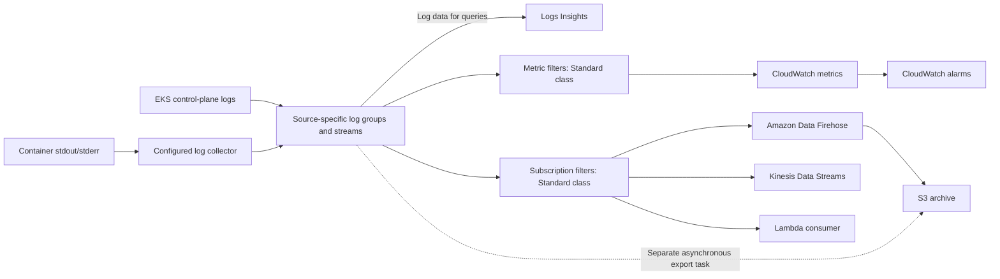

# CloudWatch Logs

> **Last Updated**: September 13, 2026
> **Checked examples**: AWS provider 6.64.0; optional CloudWatch Observability Helm chart 6.6.0; manual AWS for Fluent Bit 3.4.15/Fluent Bit 5.0.9. Local configuration, SDK and synthetic-payload checks only. No AWS resources, log delivery, Insights queries or alarms were executed.

Amazon CloudWatch Logs manages log ingestion, storage and analysis. You still configure producers, identity, networking, retention, quotas and downstream consumers. EKS control-plane logs, workload logs and EKS Auto Mode managed-component logs are separate collection paths.

## Table of Contents

1. [Overview](#overview)
2. [EKS Control Plane Logging](#eks-control-plane-logging)
3. [Container Insights](#container-insights)
4. [FluentBit Integration](#fluentbit-integration)
5. [CloudWatch Logs Insights](#cloudwatch-logs-insights)
6. [Subscription Filters](#subscription-filters)
7. [Cost Optimization](#cost-optimization)

## Overview

<span id="cloudwatch-logs-features"></span>

### Features and Log Classes

| Area | What to check |
|---|---|
| Managed service | No search cluster to operate, but collectors and delivery integrations still need an owner |
| Capacity | Event-size, API, subscription and destination quotas apply; ingestion is not unlimited |
| Security | IAM, encryption, data protection and private connectivity have separate configuration |
| Timeliness | Delivery and alerting are asynchronous; retries and duplicate or missing deliveries must be considered |
| Standard class | Supports the metric filters and subscriptions used in this chapter |
| Infrequent Access | Lower ingestion pricing and a different feature set; no subscription filters, metric filters or EMF |
| Delivery class | A separate option for Lambda logs delivered to S3/Firehose; fixed two-day CloudWatch retention and no Logs Insights queries |

A log group's class cannot be changed after creation. Infrequent Access currently supports features including S3 export, Logs Insights and data protection, so older blanket statements that it supports none of these are incorrect. Check the current feature table before changing the collection design.

<span id="terminology"></span>

### Key Concepts



Subscription filters do **not** take an S3 bucket ARN as their destination. Continuous S3 delivery through Firehose and an asynchronous S3 export task are different paths. CloudWatch Logs batches also cannot be delivered through Firehose's OpenSearch destination; use the documented CloudWatch-to-OpenSearch integration instead. Direct application records sent to Firehose are a different input contract.

| Term | Meaning |
|---|---|
| Log group | Common retention, access and configuration boundary; for example `/aws/eks/example-eks/cluster` |
| Log stream | A sequence of log events within a group |
| Log event | Timestamp and message, subject to service limits |
| Retention | A supported discrete retention period, or no expiry if retention is not set |

## EKS Control Plane Logging

### Log Types

The five types are `api`, `audit`, `authenticator`, `controllerManager` and `scheduler`. They cover API-server diagnostics, audit events, IAM authentication, controller-manager diagnostics and scheduling respectively. Worker-node and application logs are separate.

Control-plane logging is disabled by default. Select types according to your diagnostic, security and retention requirements; the API does not mandate the earlier table's “required” choices. Delivery normally takes minutes and is best effort. Enabling logging does not recover already rotated historical logs.

<span id="enable-via-aws-cli"></span>

### Enable and Observe the Update

For an existing cluster, save the following as `control-plane-logging.json`:

```json
{
  "clusterLogging": [
    {
      "types": [
        "api",
        "audit",
        "authenticator",
        "controllerManager",
        "scheduler"
      ],
      "enabled": true
    }
  ]
}
```

```bash
DOCS_CLUSTER=example-eks
DOCS_REGION=ap-northeast-2

aws eks describe-cluster --name "$DOCS_CLUSTER" --region "$DOCS_REGION" \
  --query 'cluster.{version:version,logging:logging}'

UPDATE_ID=$(aws eks update-cluster-config \
  --name "$DOCS_CLUSTER" --region "$DOCS_REGION" \
  --logging file://control-plane-logging.json --query update.id --output text)

aws eks describe-update --name "$DOCS_CLUSTER" --region "$DOCS_REGION" \
  --update-id "$UPDATE_ID" --query 'update.{status:status,errors:errors}'
```

The update must reach `Successful`; request acceptance alone is insufficient. Logging updates can require up to five free IP addresses per cluster subnet. To disable a type, explicitly review that change rather than copying a second example that silently turns off existing logs.

<span id="configure-with-terraform"></span>

### Terraform Ownership and Retention

For Terraform-managed clusters, change `enabled_cluster_log_types` in the **existing cluster resource's owning configuration**. Do not create another `aws_eks_cluster` resource just to enable logs, and do not copy the obsolete Kubernetes 1.29 creation example.

The following separate file manages the log groups and the manual collector's policy:

```hcl
terraform {
  required_providers {
    aws = {
      source  = "hashicorp/aws"
      version = "6.64.0"
    }
  }
}

variable "region" {
  type    = string
  default = "ap-northeast-2"
}

variable "account_id" {
  type = string
  validation {
    condition     = can(regex("^[0-9]{12}$", var.account_id))
    error_message = "Use the owning account ID."
  }
}

variable "cluster_name" {
  type    = string
  default = "example-eks"
}

provider "aws" {
  region = var.region
}

resource "aws_cloudwatch_log_group" "application" {
  name              = "/aws/containerinsights/${var.cluster_name}/application"
  log_group_class   = "STANDARD"
  retention_in_days = 30

  lifecycle {
    prevent_destroy = true
  }
}

resource "aws_cloudwatch_log_group" "control_plane" {
  name              = "/aws/eks/${var.cluster_name}/cluster"
  log_group_class   = "STANDARD"
  retention_in_days = 30

  lifecycle {
    prevent_destroy = true
  }
}

resource "aws_iam_policy" "collector" {
  name_prefix = "fluent-bit-cloudwatch-"
  policy = jsonencode({
    Version = "2012-10-17"
    Statement = [{
      Effect   = "Allow"
      Action   = ["logs:CreateLogStream", "logs:PutLogEvents"]
      Resource = "${aws_cloudwatch_log_group.application.arn}:*"
    }]
  })
}

output "collector_policy_arn" {
  value = aws_iam_policy.collector.arn
}
```

If a group already exists, reuse its owner or import it into the intended state before applying. For example, the control-plane group uses the import ID `/aws/eks/example-eks/cluster`. Do not declare the same group again as an “audit” group: all five control-plane types share this group and its retention.

The 30-day values are examples, not legal requirements. `prevent_destroy` blocks Terraform destruction, but does not prevent retention reductions or deletion outside Terraform. CloudWatch encrypts stored log data; a customer-managed KMS key requires its own key policy and operational planning.

### Log Group Structure

```text
/aws/eks/example-eks/cluster
  kube-apiserver-...          API server
  kube-apiserver-audit-...    Audit
  authenticator-...          IAM authentication
  kube-controller-manager-... Controller manager
  kube-scheduler-...         Scheduler
```

Stream suffixes rotate. The example `/aws/eks/cluster/logs` in the old figure was not the actual control-plane group naming convention.

## Container Insights

<span id="container-insights-overview"></span>
<span id="installation-methods"></span>
<span id="cloudwatch-agent-fluentbit-recommended"></span>
<span id="install-via-helm-chart"></span>
<span id="irsa-setup"></span>

### Installation Choices

Use the current **Amazon CloudWatch Observability EKS add-on** or its **amazon-cloudwatch-observability** Helm chart. The former ADOT exporter chart and an unsubstituted quickstart URL are not equivalent installations.

For an add-on, discover versions compatible with the actual cluster, inspect the selected configuration schema and configure the documented IAM association. A chart version is not an EKS add-on version string.

```bash
K8S_VERSION=$(aws eks describe-cluster --name "$DOCS_CLUSTER" \
  --region "$DOCS_REGION" --query cluster.version --output text)
aws eks describe-addon-versions \
  --addon-name amazon-cloudwatch-observability \
  --kubernetes-version "$K8S_VERSION" --region "$DOCS_REGION"
```

The optional Helm example uses the following `cloudwatch-values.yaml`. It selects the traditional Container Insights path and container logs; Application Signals and the separate OTel Container Insights pipeline are disabled here.

```yaml
clusterName: example-eks
region: ap-northeast-2
containerInsights:
  enabled: true
containerLogs:
  enabled: true
applicationSignals:
  enabled: false
otelContainerInsights:
  enabled: false
  logs:
    enabled: false
```

```bash
helm repo add aws-observability https://aws-observability.github.io/helm-charts
helm repo update aws-observability
helm upgrade --install cloudwatch-observability \
  aws-observability/amazon-cloudwatch-observability \
  --version 6.6.0 --namespace amazon-cloudwatch --create-namespace \
  --values cloudwatch-values.yaml
```

Set IAM permissions **before installation**. In this chart, the Fluent Bit DaemonSets use the `cloudwatch-agent` service account; its name and namespace must match the selected Pod Identity association. Follow the official association/role-trust requirements. An IRSA role for a differently named service account will not authorize a manually created `fluent-bit` Pod. Do not install this chart over an EKS-managed add-on or run duplicate collectors on the same logs.

<span id="collected-logs"></span>

### Collected Logs and Platforms

| Typical group suffix | Content and limits |
|---|---|
| `application` | Container stdout/stderr under `/aws/containerinsights/CLUSTER/application` |
| `dataplane` | Configured kubelet/runtime/VPC CNI/kube-proxy sources; actual components vary by platform |
| `host` | Configured Linux files/journals or Windows event logs; not every OS has `/var/log/messages`, `/var/log/secure` or `/var/log/dmesg` |
| `performance` | Performance events, often EMF; not interchangeable with application log messages |

The supported add-on/chart has Linux and Windows paths, but Application Signals is not supported for EKS Windows. Fargate uses its platform log router, not this manual DaemonSet. Verify Hybrid Nodes and Auto Mode separately; do not assume traditional EC2 host paths exist everywhere.

EKS Auto Mode's AWS-managed Karpenter, EBS CSI, load-balancer-controller and IPAM logs use a separate **vended log delivery** setup. Its log types are `AUTO_MODE_COMPUTE_LOGS`, `AUTO_MODE_BLOCK_STORAGE_LOGS`, `AUTO_MODE_LOAD_BALANCING_LOGS` and `AUTO_MODE_IPAM_LOGS`. The documented `PutDeliverySource` → `PutDeliveryDestination` → `CreateDelivery` flow can target a log group, S3 or Firehose. That is distinct from `PutSubscriptionFilter` and from enabling the five control-plane log types.

## FluentBit Integration

<span id="fluentbit-configmap"></span>
<span id="fluentbit-daemonset"></span>

### Manual Application-Log Collector

This is an **alternative application-log-only profile** for eligible Linux EC2 nodes. It does not install the complete Container Insights metric pipeline or promise universal host/dataplane collection.

Create or reuse the application group first. The collector policy above allows stream creation and event writes to that group; it deliberately does not create groups or change retention. The manual profile therefore does not need `cloudwatch:PutMetricData`, `s3:PutObject`, or blanket `logs:*` permissions.

Prepare an approved IRSA role whose OIDC trust matches `system:serviceaccount:logging:fluent-bit-cloudwatch` and audience `sts.amazonaws.com`, and attach the generated policy. An `eksctl --role-only` workflow can create the role while the manifest owns the ServiceAccount. Replace the role ARN, cluster name and Region consistently.

```yaml
apiVersion: v1
kind: Namespace
metadata:
  name: logging
---
apiVersion: v1
kind: ServiceAccount
metadata:
  name: fluent-bit-cloudwatch
  namespace: logging
  annotations:
    eks.amazonaws.com/role-arn: arn:aws:iam::123456789012:role/FluentBitCloudWatchLogsRole
---
apiVersion: rbac.authorization.k8s.io/v1
kind: ClusterRole
metadata:
  name: fluent-bit-cloudwatch-metadata
rules:
- apiGroups:
  - ''
  resources:
  - namespaces
  - pods
  verbs:
  - get
  - list
  - watch
---
apiVersion: rbac.authorization.k8s.io/v1
kind: ClusterRoleBinding
metadata:
  name: fluent-bit-cloudwatch-metadata
roleRef:
  apiGroup: rbac.authorization.k8s.io
  kind: ClusterRole
  name: fluent-bit-cloudwatch-metadata
subjects:
- kind: ServiceAccount
  name: fluent-bit-cloudwatch
  namespace: logging
---
apiVersion: v1
kind: ConfigMap
metadata:
  name: fluent-bit-cloudwatch-config
  namespace: logging
data:
  fluent-bit.conf: |
    [SERVICE]
        Flush         5
        Grace         30
        Log_Level     info
        HTTP_Server   Off
        storage.path  /buffers/storage

    [INPUT]
        Name              tail
        Tag               application.*
        Path              /var/log/containers/*.log
        Exclude_Path      /var/log/containers/fluent-bit-cloudwatch-*_logging_fluent-bit-*.log
        multiline.parser  docker, cri
        DB                /buffers/tail.db
        Mem_Buf_Limit     50MB
        Skip_Long_Lines   On
        Read_from_Head    Off
        storage.type      filesystem

    [FILTER]
        Name                kubernetes
        Match               application.*
        Kube_Tag_Prefix     application.var.log.containers.
        Use_Kubelet         Off
        Merge_Log           On
        Merge_Log_Key       log_processed
        Keep_Log            On
        Labels              Off
        Annotations         Off
        K8S-Logging.Parser  Off
        K8S-Logging.Exclude Off

    [OUTPUT]
        Name                     cloudwatch_logs
        Match                    application.*
        region                   ap-northeast-2
        log_group_name           /aws/containerinsights/example-eks/application
        log_stream_prefix        ${HOST_NAME}-
        auto_create_group        false
        Retry_Limit              5
        storage.total_limit_size 1G
---
apiVersion: apps/v1
kind: DaemonSet
metadata:
  name: fluent-bit-cloudwatch
  namespace: logging
spec:
  selector:
    matchLabels:
      app: fluent-bit-cloudwatch
  template:
    metadata:
      labels:
        app: fluent-bit-cloudwatch
    spec:
      serviceAccountName: fluent-bit-cloudwatch
      nodeSelector:
        kubernetes.io/os: linux
      tolerations:
      - operator: Exists
        effect: NoSchedule
      containers:
      - name: fluent-bit
        image: public.ecr.aws/aws-observability/aws-for-fluent-bit:3.4.15@sha256:88e1b56cedb230486afeca6eeb26c5f6bd59c48879d0054d1674d5a58838c607
        args:
        - -c
        - /fluent-bit/custom/fluent-bit.conf
        securityContext:
          runAsUser: 0
          allowPrivilegeEscalation: false
          readOnlyRootFilesystem: true
          capabilities:
            drop:
            - ALL
          seccompProfile:
            type: RuntimeDefault
        resources:
          requests:
            cpu: 100m
            memory: 128Mi
          limits:
            memory: 512Mi
        volumeMounts:
        - name: logs
          mountPath: /var/log
          readOnly: true
        - name: buffers
          mountPath: /buffers
        - name: config
          mountPath: /fluent-bit/custom
          readOnly: true
        - name: tmp
          mountPath: /tmp
        command:
        - /fluent-bit/bin/fluent-bit
        env:
        - name: HOST_NAME
          valueFrom:
            fieldRef:
              fieldPath: spec.nodeName
      volumes:
      - name: logs
        hostPath:
          path: /var/log
          type: Directory
      - name: buffers
        hostPath:
          path: /var/lib/fluent-bit-cloudwatch
          type: DirectoryOrCreate
      - name: config
        configMap:
          name: fluent-bit-cloudwatch-config
      - name: tmp
        emptyDir: {}
      terminationGracePeriodSeconds: 45
```

The native plugin is `cloudwatch_logs`; the older Go plugin is named `cloudwatch`. The image's default command is an entrypoint script, so the manual manifest explicitly starts the native Fluent Bit binary with its configuration.

The Tail DB and filesystem buffer are writable and separate from the read-only log mount. Grace is 30 seconds and the Pod termination grace is 45 seconds, but that does not guarantee all buffered data is delivered. Node loss, full disks, long lines, finite retries and restart offsets can still lose logs. `Read_from_Head Off` affects previously unseen files; persistent offsets still matter.

The profile uses API-server metadata lookup rather than host-network kubelet access. Application annotations cannot change parsing or exclude logs. Do not set the reserved `extra_user_agent: container-insights` value in a custom collector to imply it is the managed installation.

### Record Contract and Host Sources

An illustrative enriched event sent to CloudWatch is:

```json
{"log":"{\"level\":\"error\",\"message\":\"upstream request failed\",\"error_type\":\"upstream_timeout\",\"http\":{\"response_time_ms\":1250,\"status_code\":503}}","stream":"stderr","kubernetes":{"namespace_name":"production","pod_name":"api-example","container_name":"api"},"log_processed":{"level":"error","message":"upstream request failed","error_type":"upstream_timeout","http":{"response_time_ms":1250,"status_code":503}}}
```

Application fields are under `log_processed`, while trusted Kubernetes metadata is under `kubernetes`. The raw `log` string duplicates application data; redact prohibited fields before collection. The query, subscription and metric-filter examples below use this exact JSON envelope and lowercase `level: error`.

If you need Linux journal collection, verify whether persistent journals exist at `/var/log/journal` or volatile journals at `/run/log/journal`. Configure a `systemd` input, appropriate unit filters, read-only mounts, separate writable DB, output group and IAM permissions. Do not blindly mount Docker's old `/var/lib/docker/containers` path or require nonexistent text files on containerd/Bottlerocket/AL2023 nodes. These platform-specific host configurations are not deployed by the manual profile.

## CloudWatch Logs Insights

These examples use **Logs Insights QL**, not SQL. Select the intended log group and a bounded time range. Local review checked published syntax/contracts; no managed query service was called.

### Basic Query Syntax

```text
fields @timestamp, @message
| filter @message like /(?i)error/
| sort @timestamp desc
| limit 100
```

Case-insensitive regex uses `/(?i)error/`, not JavaScript's `/error/i` suffix. Text matching can match words that are not an application's structured error level.

For the collector's JSON envelope:

```text
fields jsonParse(@message) as record
| filter record.log_processed.level = "error"
| fields @timestamp, record.log_processed.message as message
| sort @timestamp desc
| limit 100
```

For an actual text field containing `user_id=12345`:

```text
fields @timestamp, @message
| parse @message /user_id=(?<user_id>\d+)/
| filter user_id = "12345"
| limit 100
```

Do not rely on a glob that assumes arbitrary JSON key order and whitespace. `jsonParse` and explicit nested fields make the expected record structure clear.

### EKS Log Query Examples

API-server diagnostics exclude the overlapping audit stream prefix:

```text
fields @timestamp, @logStream, @message
| filter @logStream like /^kube-apiserver-/
| filter @logStream not like /^kube-apiserver-audit-/
| filter @message like /(?i)error/
| sort @timestamp desc
| limit 50
```

Audit activity for a specific Kubernetes username:

```text
fields jsonParse(@message) as audit
| filter @logStream like /^kube-apiserver-audit-/
| filter audit.user.username = "example-user"
| fields @timestamp, audit.verb as verb, audit.objectRef as objectRef
| sort @timestamp desc
| limit 100
```

Authenticator diagnostics:

```text
fields @timestamp, @message
| filter @logStream like /^authenticator-/
| filter @message like /(?i)(AccessDenied|Forbidden|unauthorized)/
| sort @timestamp desc
| limit 100
```

Pod create/delete audit events:

```text
fields jsonParse(@message) as audit
| filter @logStream like /^kube-apiserver-audit-/
| filter audit.verb in ["create", "delete"]
| filter audit.objectRef.resource = "pods"
| fields @timestamp, audit.verb as verb, audit.objectRef.name as pod
| sort @timestamp desc
| limit 100
```

These are diagnostic searches, not proof that audit captures every action or that text matches establish the root cause.

### Application Log Queries

Errors by namespace:

```text
fields jsonParse(@message) as record
| filter record.log_processed.level = "error"
| stats count(*) as error_count by record.kubernetes.namespace_name as namespace
| sort error_count desc
```

Slow responses using the declared numeric millisecond field:

```text
fields jsonParse(@message) as record
| filter record.kubernetes.container_name = "api"
| filter record.log_processed.http.response_time_ms > 1000
| fields @timestamp, record.log_processed.http.response_time_ms as response_time_ms
| sort response_time_ms desc
| limit 100
```

Hourly event counts:

```text
stats count(*) as log_count by bin(1h) as bucket
| sort bucket asc
```

After `stats`, sort the defined bucket alias; the original per-event `@timestamp` is no longer a grouping output.

Top error categories:

```text
fields jsonParse(@message) as record
| filter record.log_processed.level = "error"
| stats count(*) as error_count by record.log_processed.error_type as error_type
| sort error_count desc
| limit 10
```

A bounded category is usually more interpretable than grouping by every unique full message. Do not turn request IDs or arbitrary messages into unbounded metric dimensions.

### Advanced Queries

```text
fields jsonParse(@message) as record
| filter ispresent(record.log_processed.http.response_time_ms)
| stats pct(record.log_processed.http.response_time_ms, 50) as p50_ms,
        pct(record.log_processed.http.response_time_ms, 90) as p90_ms,
        pct(record.log_processed.http.response_time_ms, 99) as p99_ms
  by bin(5m) as bucket
| sort bucket asc
```

The QL aggregate is `pct`, not `percentile`. The producer must emit numeric milliseconds; the old nginx examples had mismatched wildcard counts and invented field positions.

```text
fields @timestamp, @message, @logStream
| filter @message like /Back-off restarting failed container/
| stats count(*) as backoff_log_events by @logStream
| sort backoff_log_events desc
```

This counts matching **log events**, not container restarts. A kubelet event/message may be absent, repeated or aggregated. Use an appropriate Kubernetes restart metric when you need an actual restart count.

`SOURCE` is supported in CLI/API queries, not the console query editor:

```text
SOURCE logGroups(accountIdentifier:['111122223333'], namePrefix:['/aws/containerinsights/prod-', '/aws/containerinsights/stage-'])
| fields @timestamp, @message, @logStream
| filter @message like /(?i)error/
| sort @timestamp desc
| limit 100
```

`accountIdentifier` is singular. Cross-account queries require an approved monitoring/source-account setup and permissions; mentioning a second account or group does not create that access. Omitting account/prefix selection can greatly widen a query.

## Subscription Filters

Subscription filters forward new matching events asynchronously. Delivery is at least once; duplicates may occur. Retryable destination failures can be retried for up to 24 hours; non-retryable errors and sustained failures can lose deliveries. Monitor quotas, `DeliveryErrors` and `DeliveryThrottling`. Subscriptions do not backfill all historical logs.

The direct Lambda, Kinesis and Firehose destinations in these examples belong to the same account as the log group. Cross-account delivery uses a supported logical destination and its destination policy; an arbitrary cross-account Lambda ARN is not a substitute.

<span id="export-to-s3"></span>

### Archive to S3 through Firehose

This optional file uses the group above, an existing private S3 bucket, and an approved Firehose delivery role:

```hcl
variable "firehose_delivery_role_arn" {
  type = string
}

variable "archive_bucket_arn" {
  type = string
}

resource "aws_cloudwatch_log_group" "firehose" {
  name              = "/aws/kinesisfirehose/cloudwatch-archive"
  retention_in_days = 30
}

resource "aws_cloudwatch_log_stream" "firehose" {
  name           = "S3Delivery"
  log_group_name = aws_cloudwatch_log_group.firehose.name
}

resource "aws_kinesis_firehose_delivery_stream" "archive" {
  name        = "cloudwatch-archive"
  destination = "extended_s3"

  extended_s3_configuration {
    role_arn            = var.firehose_delivery_role_arn
    bucket_arn          = var.archive_bucket_arn
    prefix              = "cloudwatch/year=!{timestamp:yyyy}/month=!{timestamp:MM}/day=!{timestamp:dd}/"
    error_output_prefix = "errors/!{firehose:error-output-type}/year=!{timestamp:yyyy}/"
    buffering_size      = 64
    buffering_interval  = 300
    compression_format  = "UNCOMPRESSED"

    cloudwatch_logging_options {
      enabled         = true
      log_group_name  = aws_cloudwatch_log_group.firehose.name
      log_stream_name = aws_cloudwatch_log_stream.firehose.name
    }
  }
}

resource "aws_iam_role" "logs_to_firehose" {
  name_prefix = "cloudwatch-to-firehose-"
  assume_role_policy = jsonencode({
    Version = "2012-10-17"
    Statement = [{
      Effect    = "Allow"
      Principal = { Service = "logs.amazonaws.com" }
      Action    = "sts:AssumeRole"
      Condition = {
        StringEquals = { "aws:SourceAccount" = var.account_id }
        ArnLike      = { "aws:SourceArn" = "arn:aws:logs:${var.region}:${var.account_id}:*" }
      }
    }]
  })
}

resource "aws_iam_role_policy" "logs_to_firehose" {
  role = aws_iam_role.logs_to_firehose.id
  policy = jsonencode({
    Version = "2012-10-17"
    Statement = [{
      Effect   = "Allow"
      Action   = ["firehose:PutRecord", "firehose:PutRecordBatch"]
      Resource = aws_kinesis_firehose_delivery_stream.archive.arn
    }]
  })
}

resource "aws_cloudwatch_log_subscription_filter" "archive" {
  name            = "application-archive"
  log_group_name  = aws_cloudwatch_log_group.application.name
  filter_pattern  = ""
  destination_arn = aws_kinesis_firehose_delivery_stream.archive.arn
  role_arn        = aws_iam_role.logs_to_firehose.arn

  depends_on = [aws_iam_role_policy.logs_to_firehose]
}
```

The delivery role needs its reviewed Firehose trust, bucket/prefix access, optional KMS permissions and destination-log permissions. The CloudWatch-to-Firehose role is separate, and the deployer needs scoped `iam:PassRole`. Avoid subscribing delivery-error logs back into their own pipeline.

CloudWatch subscription records are already gzip-compressed. `UNCOMPRESSED` here disables **additional Firehose compression**; it does not turn the incoming payload into plain text or remove the CloudWatch envelope. Consumers must handle the actual archived record format.

For decompressed output, configure Firehose's documented decompression feature deliberately. Optional message extraction removes `owner`, `logGroup`, `logStream` and other envelope metadata. Do not mix vended-log input with a stream configured for CloudWatch-subscription decompression, and do not assume these settings make the unsupported CloudWatch→Firehose→OpenSearch path valid.

### Process with Lambda

The example processes the structured envelope above, ignores control messages, and sends an error **summary** rather than raw log text. Save it as `log_processor.py`:

```python
import base64
import gzip
import hashlib
import io
import json
import os

import boto3

# Example processing limit, not an AWS service quota.
MAX_UNCOMPRESSED_BYTES = 8 * 1024 * 1024


def summarize(event):
    compressed = base64.b64decode(event["awslogs"]["data"], validate=True)
    with gzip.GzipFile(fileobj=io.BytesIO(compressed)) as stream:
        payload = stream.read(MAX_UNCOMPRESSED_BYTES + 1)
    if len(payload) > MAX_UNCOMPRESSED_BYTES:
        raise ValueError("Batch exceeds this example's processing limit")
    batch = json.loads(payload)
    if batch.get("messageType") == "CONTROL_MESSAGE":
        return None
    if batch.get("messageType") != "DATA_MESSAGE":
        raise ValueError("Unsupported subscription message type")

    errors = []
    unparsed = 0
    for item in batch["logEvents"]:
        try:
            record = json.loads(item["message"])
            application = record["log_processed"]
            if not isinstance(application, dict):
                raise ValueError("Expected an application object")
        except (ValueError, KeyError, TypeError):
            unparsed += 1
            continue
        if application.get("level") == "error":
            errors.append(item)
    if not errors:
        return None

    # Raw messages are intentionally excluded from the notification.
    event_keys = [
        hashlib.sha256(
            json.dumps([batch["owner"], batch["logGroup"], batch["logStream"], item["id"]],
                       ensure_ascii=True).encode("utf-8")
        ).hexdigest()
        for item in errors[:20]
    ]
    return {
        "errorCount": len(errors),
        "unparsedRecords": unparsed,
        "sampleEventKeys": event_keys,
    }


def lambda_handler(event, context):
    summary = summarize(event)
    if summary is None:
        return {"notified": False}
    topic_arn = os.environ["ALERT_TOPIC_ARN"]  # Non-secret destination identifier.
    message = json.dumps(summary, ensure_ascii=True)
    if len(message.encode("utf-8")) > 262144:
        raise ValueError("SNS message is too large")
    boto3.client("sns").publish(
        TopicArn=topic_arn,
        Subject="CloudWatch Logs error batch",
        Message=message,
    )
    return {"notified": True, "errorCount": summary["errorCount"]}
```

`ALERT_TOPIC_ARN` is a non-secret destination identifier for an approved same-Region topic. The Lambda execution role needs scoped `sns:Publish` and its own log permissions, plus applicable KMS permissions. Its logging group must not recursively feed the same subscription.

The 8MiB processing limit is a chosen example bound, not an AWS quota. Invalid envelopes raise errors; records outside the expected application schema are not treated as structured errors. Monitor parsing failures, configure failure handling, and test replay before deployment. SNS non-SMS messages are limited by **UTF-8 bytes**, not a 1,000-character rule; the fixed subject also stays below the subject limit.

Event keys aid investigation; they are **not persistent deduplication**. Repeated invocations can send repeated notifications. A production consumer needs explicit idempotency and failure-destination decisions.

<span id="create-alerts-with-metric-filters"></span>

### Metric Filters and Alarms

The following optional file connects an already deployed, unqualified Lambda function ARN and creates a count metric/alarm. It uses the same JSON field as the collector and queries:

```hcl
variable "processor_function_arn" {
  type = string
}

variable "alerts_topic_arn" {
  type = string
}

resource "aws_lambda_permission" "cloudwatch" {
  statement_id   = "AllowOwnedCloudWatchLogGroup"
  action         = "lambda:InvokeFunction"
  function_name  = var.processor_function_arn
  principal      = "logs.${var.region}.amazonaws.com"
  source_arn     = "${aws_cloudwatch_log_group.application.arn}:*"
  source_account = var.account_id
}

resource "aws_cloudwatch_log_subscription_filter" "processor" {
  name            = "structured-errors"
  log_group_name  = aws_cloudwatch_log_group.application.name
  filter_pattern  = "{ $.log_processed.level = \"error\" }"
  destination_arn = var.processor_function_arn

  depends_on = [aws_lambda_permission.cloudwatch]
}

resource "aws_cloudwatch_log_metric_filter" "errors" {
  name           = "StructuredErrorCount"
  log_group_name = aws_cloudwatch_log_group.application.name
  pattern        = "{ $.log_processed.level = \"error\" }"

  metric_transformation {
    name          = "ErrorCount"
    namespace     = "Example/Logs"
    value         = "1"
    default_value = "0"
    unit          = "Count"
  }
}

resource "aws_cloudwatch_metric_alarm" "high_error_count" {
  alarm_name          = "ExampleHighErrorCount"
  comparison_operator = "GreaterThanThreshold"
  evaluation_periods  = 2
  datapoints_to_alarm = 2
  metric_name         = "ErrorCount"
  namespace           = "Example/Logs"
  period              = 300
  statistic           = "Sum"
  threshold           = 100
  treat_missing_data  = "missing"
  alarm_description   = "More than 100 matching error events in each of two 5-minute periods"
  alarm_actions       = [var.alerts_topic_arn]
}
```

The permission precedes the Lambda subscription and is restricted by log-group ARN and source account. The SNS alarm destination also needs its appropriate topic policy. Function deployment, execution-role policy, topic subscriptions and end-to-end notification are separate prerequisites.

The alarm is **an error count**, not an error rate: more than 100 matching events in each of two five-minute periods. `default_value = 0` applies when logs arrive but none match; no incoming logs can still mean missing data. `treat_missing_data = "missing"` does not treat silence as health. Metric filters do not backfill historical events, and duplicates can affect counts.

<span id="_3-archive-to-s3"></span>

### Export Tasks and S3 Lifecycle

For a bounded historical export, use CloudWatch's separate S3 export task API and its bucket/KMS permissions. Export availability can lag by up to 12 hours, ordering is not guaranteed, and the service does not recommend periodic export tasks for continuous archiving.

Archive lifecycle rules belong to the bucket's single configuration owner. Merge a reviewed prefix-scoped rule into that configuration instead of replacing existing rules with a second Terraform resource. Consider small-object transition behavior, minimum storage durations, retrieval costs and Object Lock before selecting Standard-IA or Glacier tiers.

## Cost Optimization

### Cost Structure

Check current regional/class/tier pricing for ingestion, retained storage, query scans, vended delivery, transformation and downstream services. Firehose, S3, KMS, Lambda, custom metrics and alarms are not universally free. The older table did not substantiate its Seoul rates or a zero-cost “Logs to S3” path.

The following is **hypothetical arithmetic, not current regional pricing**:

| Assumption | Monthly calculation |
|---|---|
| 100GB/day ingested for 30 days at an assumed $0.50/GB | 3,000 × $0.50 = $1,500 |
| 30-day steady-state retention, assumed stored fraction 0.5, $0.03/GB-month | Average 1,500GB × $0.03 = $45 |
| 200GB scanned daily for 30 days at an assumed $0.005/GB | 6,000 × $0.005 = $30 |
| Subtotal under only these assumptions | **$1,575** |

This is not the first month's storage ramp, a compression benchmark, or a complete bill. The original $1,576 total mixed daily/monthly query values. Use measured average retained bytes, scan volume, current rates and all other charge categories.

<span id="cost-reduction-strategies"></span>
<span id="_1-log-filtering"></span>
<span id="_2-retention-period-optimization"></span>
<span id="_4-adjust-log-levels"></span>

### Filtering, Retention and Log Levels

Filter only records that your diagnostic and security requirements allow you to discard. Fluent Bit classic configuration is not YAML. With this record structure, a namespace filter uses a record accessor such as `$kubernetes['namespace_name']`, not the nonexistent flat field `kubernetes_namespace_name`.

Avoid broad substring filters that discard useful errors merely because they mention a health-check path. Prefer explicit fields such as a reviewed event type, and verify examples that must be retained as well as dropped.

Different retention periods can be appropriate for development, production and audit needs, but changing retention can delete data. All control-plane streams in one group share the group's policy. Application log levels are an application contract: putting `LOG_LEVEL: INFO` in a ConfigMap does nothing unless the application consumes and implements it. Temporarily increased verbosity needs access controls, an expiry and a volume budget.

### Cost Monitoring

Use `AWS/Logs` metrics such as `IncomingBytes` and `IncomingLogEvents` with the `LogGroupName` dimension and `Sum` statistic. They describe ingestion, not the entire invoice. `@billedDuration` is a Lambda field, not CloudWatch Logs' storage or ingestion billing metric.

```bash
aws logs describe-log-groups --region "$DOCS_REGION" \
  --log-group-name-prefix /aws/containerinsights/example-eks/ \
  --query 'logGroups[].{name:logGroupName,retention:retentionInDays,class:logGroupClass,storedBytes:storedBytes}'

# Example complete month; End is exclusive.
aws ce get-dimension-values --region us-east-1 \
  --time-period Start=2026-08-01,End=2026-09-01 \
  --dimension SERVICE --search-string CloudWatch
```

Use the returned billing-service value in a Cost Explorer filter, and include related services when estimating the complete pipeline. `storedBytes` is a log-group attribute, not a guaranteed `AWS/Logs` metric of that name. Querying all logs to estimate their cost can itself incur query charges.

## Validation and References

The audit checked local Terraform/Helm configuration, Kubernetes schema, SDK payload types, synthetic Lambda events, bilingual examples, quiz answers and Markdown rendering. These checks do not prove live IAM, collector delivery, managed QL execution, Firehose archives, alarm delivery or actual costs.

- [EKS control-plane logs](https://docs.aws.amazon.com/eks/latest/userguide/control-plane-logs.html)
- [CloudWatch Observability add-on and Helm installation](https://docs.aws.amazon.com/AmazonCloudWatch/latest/monitoring/install-CloudWatch-Observability-EKS-addon.html)
- [Auto Mode managed-component log delivery](https://docs.aws.amazon.com/eks/latest/userguide/auto-managed-component-logs.html)
- [Log classes](https://docs.aws.amazon.com/AmazonCloudWatch/latest/logs/CloudWatch_Logs_Log_Classes.html) and [quotas](https://docs.aws.amazon.com/AmazonCloudWatch/latest/logs/cloudwatch_limits_cwl.html)
- [Fluent Bit native CloudWatch output](https://raw.githubusercontent.com/fluent/fluent-bit-docs/master/pipeline/outputs/cloudwatch.md)
- [QL filter](https://docs.aws.amazon.com/AmazonCloudWatch/latest/logs/CWL_QuerySyntax-Filter.html), [stats](https://docs.aws.amazon.com/AmazonCloudWatch/latest/logs/CWL_QuerySyntax-Stats.html), [functions](https://docs.aws.amazon.com/AmazonCloudWatch/latest/logs/CWL_QuerySyntax-operations-functions.html), and [SOURCE](https://docs.aws.amazon.com/AmazonCloudWatch/latest/logs/CWL_QuerySyntax-Source.html)
- [Subscription examples](https://docs.aws.amazon.com/AmazonCloudWatch/latest/logs/SubscriptionFilters.html) and [destination API](https://docs.aws.amazon.com/AmazonCloudWatchLogs/latest/APIReference/API_PutSubscriptionFilter.html)
- [CloudWatch Logs to Firehose limitations](https://docs.aws.amazon.com/firehose/latest/dev/writing-with-cloudwatch-logs.html), [decompression](https://docs.aws.amazon.com/firehose/latest/dev/writing-with-cloudwatch-logs-decompression.html), and [message extraction](https://docs.aws.amazon.com/firehose/latest/dev/Message_extraction.html)
- [Metric filters](https://docs.aws.amazon.com/AmazonCloudWatch/latest/logs/MonitoringLogData.html), [S3 export tasks](https://docs.aws.amazon.com/AmazonCloudWatch/latest/logs/S3Export.html), and [CloudWatch Logs service metrics](https://docs.aws.amazon.com/AmazonCloudWatch/latest/logs/CloudWatch-Logs-Monitoring-CloudWatch-Metrics.html)
- [SNS Publish API](https://docs.aws.amazon.com/sns/latest/api/API_Publish.html) and [current CloudWatch pricing](https://aws.amazon.com/cloudwatch/pricing/)

## Quiz

Check the distinctions with the [CloudWatch Logs Quiz](../../quizzes/observability/logging/03-cloudwatch-logs-quiz.md).
