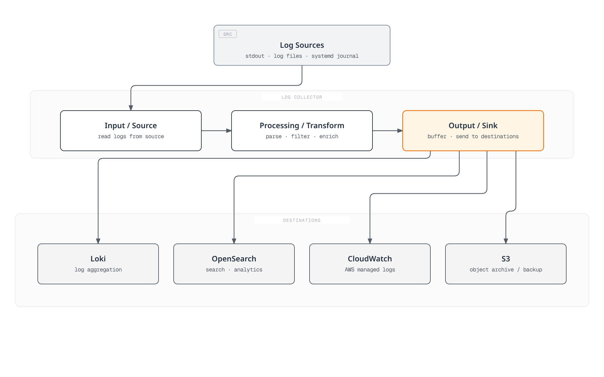
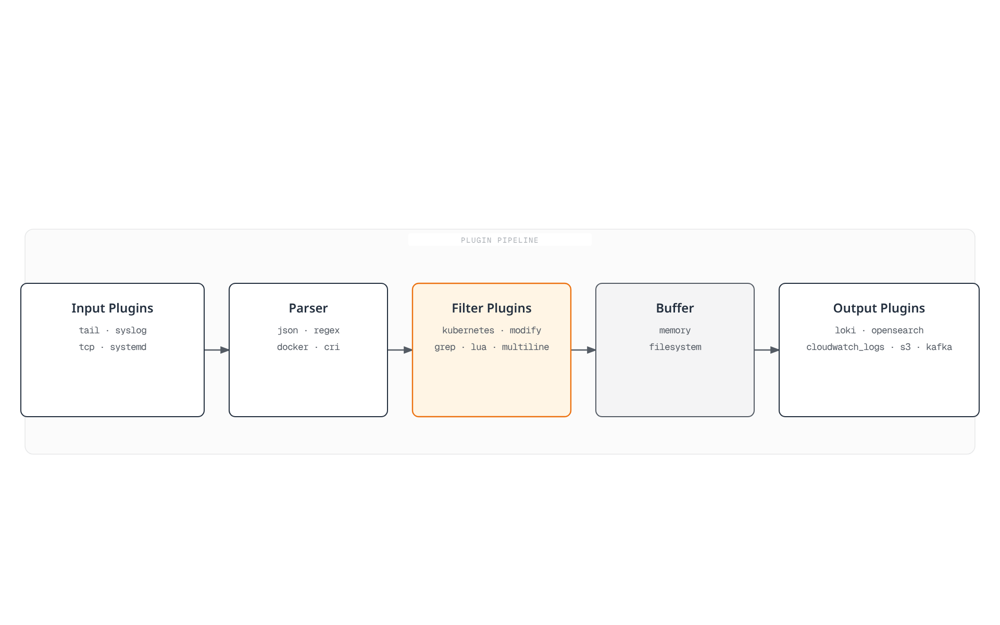
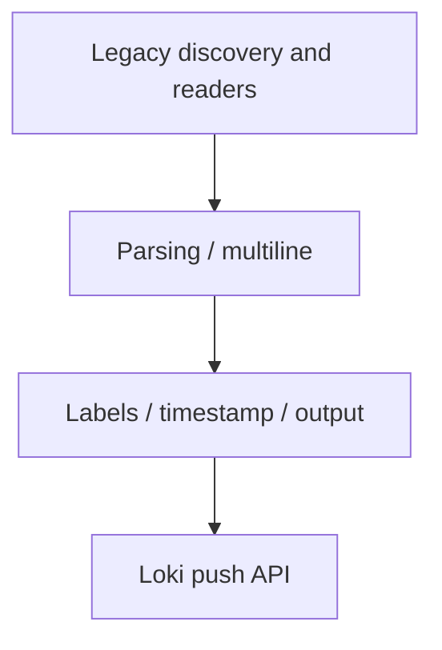
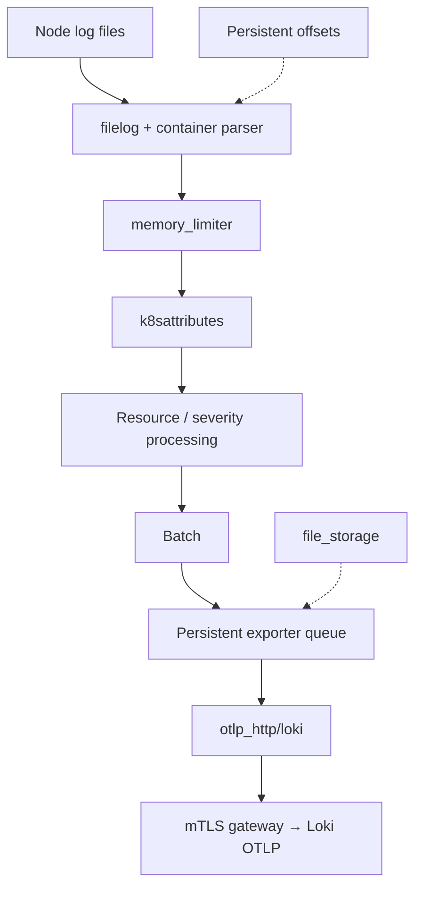
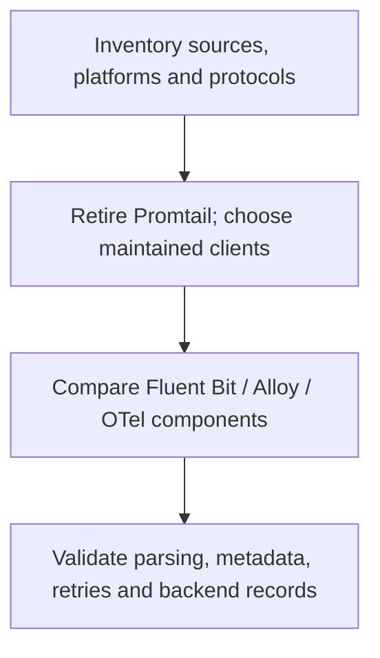

# Log Collectors Comparison

> **Last Updated**: September 13, 2026

This guide compares Fluent Bit, Grafana Alloy and the OpenTelemetry Collector, and explains migration from retired Promtail installations. Choose a collector by its actual inputs, output plugins, deployment permissions and failure behavior, not an assumed memory or events-per-second ranking.

The configuration baselines are **Fluent Bit 5.1.2**, **Alloy 1.19.2** and **OpenTelemetry Collector Contrib 0.160.0**. A distribution's version, the components it includes and its supported platforms are separate checks.

## Table of Contents

1. [Overview](#overview)
2. [FluentBit](#fluentbit)
3. [Promtail](#promtail)
4. [Grafana Alloy](#grafana-alloy)
5. [OpenTelemetry Collector](#opentelemetry-collector)
6. [Comparison and selection](#comparison-and-selection-guide)

## Overview

### Log Collector Role



[View interactive diagram](https://www.atomai.click/kubernetes-docs/archmaps/en-observability-logging-05-collectors-0.html)

The figure shows possible destinations. It does not mean every collector supports every destination natively, or that enabling several outputs provides transactional delivery to all of them.

### Core Functions

| Function | Verify |
|---|---|
| Input | File/API permissions, rotation, first-read position and source ownership |
| Parsing | Container-runtime framing separately from application JSON or stack traces |
| Transform/filter | Which records and fields are changed or discarded |
| Metadata | Correct Pod/namespace association and controlled label cardinality |
| Buffering | Memory versus persistent storage, capacity, retry and overflow policy |
| Output | Authentication, TLS, tenant mapping, acknowledgement and destination limits |

Run one intentional collection path per source. Multiple agents reading the same files, or file and Kubernetes-API readers targeting the same Pods, can duplicate logs. Offsets, a persistent queue and successful backend ingestion are different states.

| Platform | Collection considerations |
|---|---|
| Linux Kubernetes nodes | Host-file agents need node log mounts and a permitted security context; journal locations vary |
| Windows nodes | Use a supported Windows build/configuration and actual Windows paths; the Linux manifests below do not apply |
| EKS Fargate | Do not install a host-file DaemonSet; use the managed Fargate log router or an appropriate API/application-based path |
| EKS Auto Mode | Verify available host paths and add-on support; managed component vended logs are distinct from application stdout |

The examples send to a **pre-existing private, mTLS-enabled log gateway**. It must trust each agent's client certificate, present a certificate matching its DNS name, route the Loki/OTLP paths and enforce any tenant policy. Certificates, DNS, gateway configuration and NetworkPolicies are prerequisites, not created by these snippets.

## FluentBit

### Overview

Fluent Bit is a C-based telemetry agent in the graduated Fluentd ecosystem. Current builds support logs, metrics, traces and OpenTelemetry plugins; the older “no traces/no OTLP” comparison is inaccurate. Check which plugins the selected image actually includes.

Fluent Bit 5.1.2 and AWS for Fluent Bit are separately versioned distributions. An AWS image tag is not the embedded Fluent Bit version. This example pins the official upstream image and its manifest digest; the AWS-specific guides linked below use their own reviewed image baseline.

### Architecture



[View interactive diagram](https://www.atomai.click/kubernetes-docs/archmaps/en-observability-logging-05-collectors-1.html)

Treat the diagram as a logical overview. Buffering is not an exactly-once guarantee, and filtering does not erase original container log files. Protect node storage and control sensitive data at the application boundary.

### Complete Configuration Example

Save this as `fluent-bit.conf`. It collects container logs and uses the **native C `loki` output**, whose options include `line_format`, `tenant_id` and `auto_kubernetes_labels`. The separately developed Go plugin's `LineFormat`, `TenantID`, `BatchWait` and `BatchSize` names are not interchangeable.

```ini
[SERVICE]
    Flush                     2
    Grace                     30
    Daemon                    Off
    Log_Level                 info
    HTTP_Server               On
    HTTP_Listen               0.0.0.0
    HTTP_Port                 2020
    Health_Check              On
    storage.path              /var/lib/fluent-bit/storage
    storage.sync              normal
    storage.checksum          On
    storage.backlog.mem_limit 32M

[INPUT]
    Name                      tail
    Tag                       kube.*
    Path                      /var/log/containers/*.log
    Exclude_Path              /var/log/containers/fluent-bit-*_logging_*.log
    multiline.parser          docker, cri
    DB                        /var/lib/fluent-bit/tail.db
    DB.locking                true
    Mem_Buf_Limit             32M
    Skip_Long_Lines           On
    Refresh_Interval          10
    Rotate_Wait               30
    Read_From_Head            Off
    storage.type              filesystem

[FILTER]
    Name                      kubernetes
    Match                     kube.*
    Kube_URL                  https://kubernetes.default.svc:443
    Kube_Tag_Prefix           kube.var.log.containers.
    Merge_Log                 On
    Merge_Log_Key             log_processed
    Keep_Log                  On
    K8S-Logging.Parser         Off
    K8S-Logging.Exclude        Off
    Use_Kubelet               Off
    Labels                    On
    Annotations               Off

[FILTER]
    Name                      lua
    Match                     kube.*
    script                    /fluent-bit/scripts/process.lua
    call                      process_log
    protected_mode            On

[OUTPUT]
    Name                      loki
    Match                     kube.*
    Host                      logs-gateway.logging.svc.cluster.local
    Port                      443
    tls                       On
    tls.verify                On
    tls.verify_hostname       On
    tls.ca_file               /fluent-bit/tls/ca.crt
    tls.crt_file              /fluent-bit/tls/tls.crt
    tls.key_file              /fluent-bit/tls/tls.key
    Labels                    job=fluent-bit,namespace=$kubernetes['namespace_name']
    line_format               json
    auto_kubernetes_labels    Off
    Retry_Limit               5
    storage.total_limit_size  1G
```

The tail database and filesystem chunks use the writable state mount, not the read-only log mount. Existing offsets resume from the database; `Read_From_Head Off` skips pre-existing content when a file is first discovered. Choose a deliberate backfill policy before changing it. `Skip_Long_Lines On`, finite retries and finite storage can discard data; monitor these conditions.

The exclusion matches this example's own collector Pods. Adjust it if the namespace or workload name changes, rather than silently excluding every application in a namespace. Kubernetes annotations cannot override the parser/exclusion policy in this configuration.

The example uses the API server for metadata and does not require kubelet `nodes/proxy` access. If you enable `Use_Kubelet`, separately verify the kubelet address, authorization, certificates and network access. An HTTP metrics listener is not permission to expose the collector UI/health endpoint publicly.

For other destinations, select the matching output and workload identity deliberately:

- [CloudWatch Logs](03-cloudwatch-logs.md): use native `cloudwatch_logs`, a pre-created log group and the actual agent ServiceAccount identity. Do not add an unsupported `compress` option or assume creation/retention permissions exist.
- [OpenSearch](02-opensearch.md): use the native `opensearch` output, correct SigV4 service/Region, TLS and typeless API settings for the selected backend.
- S3: configure the `s3` output's own writable `store_dir`, unique object-key policy and bucket-prefix permissions. Its buffering/upload behavior differs from the generic filesystem queue. Test partial uploads, restart recovery and retrieval before calling it a backup.

If adding a `systemd` input, mount the journal that exists on that node OS, keep its cursor database writable, and add a matching output for its tag. A `host.systemd` input with only `Match kube.*` outputs has no delivery path. Host journal/audit files are not EKS control-plane API audit logs.

### Parser Configuration

The tail input's built-in `docker, cri` multiline parsers reassemble container-runtime fragments. This is different from joining an application's Java/Python/Go stack trace.

| Format | Approach |
|---|---|
| Docker JSON envelope | Parse the runtime envelope before application JSON |
| CRI/containerd/CRI-O | Parse timestamp, stream and partial/full markers; reassemble partial records |
| JSON application log | Parse only the application payload; retain or explicitly handle malformed/plaintext records |
| Nginx/logfmt/custom text | Select a parser for that application format, not an unconditional chain of every parser |
| Application stack trace | Use a tested multiline parser with stream boundaries, size and timeout limits |

When using the multiline **filter**, follow its re-emission/order guidance: place it before filters that would otherwise process re-emitted records again. Test interleaved containers and exceptions without a timestamp; a single generic “line begins with a date” expression is not a universal stack-trace parser.

### Lua Script Example

Save this as `process.lua`. It redacts selected keys in parsed application objects, including nested objects/arrays, and removes the unredacted raw duplicate. It does **not** detect every secret or personal identifier in arbitrary text.

```lua
-- Redacts selected structured keys; it is not a general PII detector.
local sensitive = {
    password = true, passwd = true, token = true, secret = true,
    api_key = true, ["api-key"] = true, authorization = true
}

local function redact(value, depth)
    if type(value) ~= "table" then
        return value
    end
    if depth > 8 then
        return "[DEPTH_LIMIT]"
    end
    for key, child in pairs(value) do
        if type(key) == "string" and sensitive[string.lower(key)] then
            value[key] = "***"
        elseif type(child) == "table" then
            value[key] = redact(child, depth + 1)
        end
    end
    return value
end

function process_log(tag, timestamp, record)
    local app = record["log_processed"]
    if type(app) == "table" then
        record["log_processed"] = redact(app, 0)
        -- Do not retain an unredacted duplicate of the parsed application JSON.
        record["log"] = nil
        if type(app["level"]) == "string" then
            record["level"] = string.upper(app["level"])
        else
            record["level"] = "UNKNOWN"
        end
    else
        if type(record["log"]) ~= "string" then
            record["log"] = "[NON_STRING_LOG]"
        end
        record["level"] = "UNKNOWN"
    end
    -- 2 changes the record while retaining the original Fluent Bit timestamp.
    return 2, timestamp, record
end
```

For example, a `password` field is redacted, but text such as `"message": "password=..."` is not automatically understood as a credential. Plaintext logs remain plaintext. This transform is not a fail-closed security boundary; protect source files, local storage and the destination, and use an application logging allowlist where stronger guarantees are required.

`return 2` keeps Fluent Bit's original timestamp while changing the record. Type checks avoid a malformed boolean log level crashing the callback. Tests exercised these transformations with a native Lua interpreter; the complete Fluent Bit container was not executed.

### DaemonSet Deployment

Save the following as `fluent-bit-workload.yaml`. It requires the `agent-gateway-client` Secret in `logging`, with `ca.crt`, `tls.crt` and `tls.key`. These are deployment-specific credentials; do not paste a sample private key into Git.

```yaml
apiVersion: v1
kind: ServiceAccount
metadata:
  name: fluent-bit
  namespace: logging
---
apiVersion: rbac.authorization.k8s.io/v1
kind: ClusterRole
metadata:
  name: log-collector-fluent-bit
rules:
- apiGroups:
  - ''
  resources:
  - pods
  - namespaces
  verbs:
  - get
  - list
  - watch
---
apiVersion: rbac.authorization.k8s.io/v1
kind: ClusterRoleBinding
metadata:
  name: log-collector-fluent-bit
roleRef:
  apiGroup: rbac.authorization.k8s.io
  kind: ClusterRole
  name: log-collector-fluent-bit
subjects:
- kind: ServiceAccount
  name: fluent-bit
  namespace: logging
---
apiVersion: apps/v1
kind: DaemonSet
metadata:
  name: fluent-bit
  namespace: logging
spec:
  selector:
    matchLabels: &id001
      app.kubernetes.io/name: fluent-bit
  template:
    metadata:
      labels: *id001
    spec:
      serviceAccountName: fluent-bit
      nodeSelector:
        kubernetes.io/os: linux
      terminationGracePeriodSeconds: 45
      containers:
      - name: fluent-bit
        image: fluent/fluent-bit:5.1.2@sha256:d792375ca8e53be72fc25716c28f291f32c6fc6f4f31d12d0d14bc78cefe9226
        command:
        - /fluent-bit/bin/fluent-bit
        args:
        - -c
        - /fluent-bit/etc/fluent-bit.conf
        ports:
        - name: metrics
          containerPort: 2020
        securityContext:
          runAsUser: 0
          allowPrivilegeEscalation: false
          readOnlyRootFilesystem: true
          capabilities:
            drop:
            - ALL
        resources:
          requests:
            cpu: 100m
            memory: 128Mi
          limits:
            cpu: 500m
            memory: 512Mi
        livenessProbe:
          httpGet:
            path: /
            port: metrics
          initialDelaySeconds: 10
        readinessProbe:
          httpGet:
            path: /api/v1/health
            port: metrics
          initialDelaySeconds: 10
        volumeMounts:
        - name: logs
          mountPath: /var/log
          readOnly: true
        - name: state
          mountPath: /var/lib/fluent-bit
        - name: config
          mountPath: /fluent-bit/etc
          readOnly: true
        - name: scripts
          mountPath: /fluent-bit/scripts
          readOnly: true
        - name: tls
          mountPath: /fluent-bit/tls
          readOnly: true
        - name: tmp
          mountPath: /tmp
      volumes:
      - name: logs
        hostPath:
          path: /var/log
          type: Directory
      - name: state
        hostPath:
          path: /var/lib/fluent-bit
          type: DirectoryOrCreate
      - name: config
        configMap:
          name: fluent-bit-config
          items:
          - key: fluent-bit.conf
            path: fluent-bit.conf
      - name: scripts
        configMap:
          name: fluent-bit-config
          items:
          - key: process.lua
            path: process.lua
      - name: tls
        secret:
          secretName: agent-gateway-client
      - name: tmp
        emptyDir:
          sizeLimit: 32Mi
```

Save the earlier configuration/script files, then create their ConfigMap before starting the workload:

```bash
kubectl create namespace logging --dry-run=client -o yaml |
  kubectl apply -f -
kubectl -n logging create configmap fluent-bit-config \
  --from-file=fluent-bit.conf --from-file=process.lua \
  --dry-run=client -o yaml | kubectl apply -f -
kubectl apply -f fluent-bit-workload.yaml
kubectl -n logging rollout status daemonset/fluent-bit
```

The agent runs as root to read the example node log paths and write its dedicated state directory, with no added capabilities, privilege escalation or writable root filesystem. HostPath use still requires an appropriate cluster admission policy. Adapt file permissions, SELinux/AppArmor, taints and storage to the actual node OS. Do not grant a reserved system-critical PriorityClass merely to keep an application log agent running.

The 45-second Pod termination grace exceeds Fluent Bit's 30-second grace but does not guarantee successful delivery through a prolonged outage. Resource limits are illustrative. Verify real records at the backend, tail offsets, health and buffer/retry metrics; Ready Pods alone do not prove ingestion.

## Promtail

### Overview

**Promtail reached end of life on March 2, 2026.** Commercial support and future updates have ended. Migrate existing installations to Alloy or another supported client; do not choose Promtail for a new Loki deployment. The announced retirement does not include the separate `lambda-promtail` client.

### Architecture



This is a historical data path, not an installation recommendation. The Loki repository's [licensing exceptions](https://github.com/grafana/loki/blob/v2.9.4/LICENSING.md) list `clients/`, including Promtail source, under Apache-2.0; do not copy the Loki server's AGPL label onto every client. Check the licenses of the actual artifact and dependencies. Positions record reads, not confirmed backend delivery.

### Complete Configuration Example

Use an **existing** `promtail.yaml` as migration input instead of deploying the obsolete 2.9.4 image:

```bash
alloy convert --source-format=promtail \
  --report=conversion-report.txt \
  --output=config.alloy promtail.yaml
alloy validate config.alloy
```

Inspect the generated configuration and diagnostic report. Do not bypass conversion errors as a normal deployment step. The converter supports nearly all legacy features, not an unconditional guarantee of identical behavior.

The reviewed legacy configuration converted successfully, but the tool warned that its global read-rate limit becomes per-pipeline `stage.limit` limits, that Promtail's own tracing configuration may need manual migration, and that Alloy emits different self-metrics. Update alerts/dashboards and verify those changes with real data.

### Pipeline Stage Details

These are **individual concepts**, not a recipe to run all parsers sequentially:

| Promtail YAML | Alloy equivalent | Important distinction |
|---|---|---|
| `cri` / `docker` | `stage.cri` / `stage.docker` | Choose the actual runtime framing |
| `json`, `regex`, `logfmt` | Corresponding `stage.*` | Select the correct source field and malformed-data policy |
| `template`, then `labels` | `stage.template`, then `stage.labels` | Normalize before copying values into labels |
| `drop` | `stage.drop` | Promtail's YAML key is `drop`, not `stage.drop` |
| `match` | `stage.match` | Apply a branch only to its intended streams |
| `metrics` | `stage.metrics` | Review label sets, idle series and metric names |
| `timestamp`, `multiline` | Corresponding stages | Test time formats, stream isolation and bounded waits |
| `output` | `stage.output` | Replacing the line can discard fields needed for correlation |
| `pack` | `stage.pack` | JSON line packing is not Loki's separate structured-metadata feature |

Do not index client IPs, order IDs, trace IDs or all arbitrary application labels by default. Pod and filename labels also have cardinality costs. Decide which metadata must remain available as labels, structured metadata or the log body.

### DaemonSet Deployment

Replace the retired workload with the chosen maintained collector and preserve the source/state transition deliberately. A positions file under `/tmp` is neither persistent nor writable in the old read-only-root example; a mount at `/run/promtail` does not fix a configuration that writes elsewhere.

Coordinate the old reader's stop position, new reader's start position and backend checks. Do not run both readers against the same logs indefinitely. Conversion success does not validate Secret mounts, Kubernetes RBAC, journal paths, state migration or backend delivery.

## Grafana Alloy

### Overview

Alloy is Grafana's OpenTelemetry Collector distribution with Prometheus and Loki components. Its configuration language is called the **Alloy configuration syntax**, formerly River; it is HCL-like, not an interchangeable Terraform file.

### River Configuration

Save the following as `config.alloy`. This example uses **one file-based path** for Linux CRI logs. Set the nonsecret `NODE_NAME` from `spec.nodeName` in the Pod Downward API, mount the node log files and provide writable persistent `--storage.path`.

```alloy
logging {
  level = "info"
}

discovery.kubernetes "pods" {
  role = "pod"
  selectors {
    role = "pod"
    field = "spec.nodeName=" + sys.env("NODE_NAME")
  }
}

discovery.relabel "pods" {
  targets = discovery.kubernetes.pods.targets
  rule {
    source_labels = ["__meta_kubernetes_namespace", "__meta_kubernetes_pod_label_app_kubernetes_io_name"]
    regex = "logging;alloy"
    action = "drop"
  }
  rule {
    source_labels = ["__meta_kubernetes_namespace"]
    target_label = "namespace"
  }
  rule {
    source_labels = ["__meta_kubernetes_pod_name"]
    target_label = "pod"
  }
  rule {
    source_labels = ["__meta_kubernetes_pod_container_name"]
    target_label = "container"
  }
  rule {
    source_labels = ["__meta_kubernetes_pod_label_app_kubernetes_io_name"]
    target_label = "service_name"
    regex = "(.+)"
  }
  rule {
    source_labels = ["__meta_kubernetes_pod_uid", "__meta_kubernetes_pod_container_name"]
    separator = "/"
    target_label = "__path__"
    replacement = "/var/log/pods/*$1/*.log"
  }
}

local.file_match "pods" {
  path_targets = discovery.relabel.pods.output
}

loki.source.file "pods" {
  targets = local.file_match.pods.targets
  forward_to = [loki.process.pods.receiver]
  tail_from_end = true
}

loki.process "pods" {
  forward_to = [loki.write.logs.receiver]
  stage.cri {}
  stage.json {
    expressions = {
      level = "level",
    }
    drop_malformed = false
  }
  stage.template {
    source = "level"
    template = "{{ if .Value }}{{ $v := ToUpper .Value }}{{ if or (eq $v \"TRACE\") (eq $v \"DEBUG\") (eq $v \"INFO\") (eq $v \"WARN\") (eq $v \"WARNING\") (eq $v \"ERROR\") (eq $v \"FATAL\") (eq $v \"CRITICAL\") }}{{ $v }}{{ else }}UNKNOWN{{ end }}{{ else }}UNKNOWN{{ end }}"
  }
  stage.labels {
    values = {
      level = "",
    }
  }
  stage.label_drop {
    values = ["filename"]
  }
  // Retain the application line, including its trace ID; do not assume it is safe.
}

loki.write "logs" {
  endpoint {
    url = "https://logs-gateway.logging.svc.cluster.local/loki/api/v1/push"
    batch_wait = "1s"
    batch_size = "1MiB"
    tls_config {
      ca_file = "/etc/alloy/tls/ca.crt"
      cert_file = "/etc/alloy/tls/tls.crt"
      key_file = "/etc/alloy/tls/tls.key"
      insecure_skip_verify = false
    }
  }
  external_labels = {
    cluster = "lab-cluster",
  }
}
```

The configured mTLS certificate files must exist. Apply Kubernetes discovery permissions and the matching gateway policy separately. Validate the file with the selected Alloy binary:

```bash
alloy validate config.alloy
```

The severity label is restricted to known levels and `UNKNOWN`, while the application line remains available for trace-ID lookup. It is not a redaction pipeline. The filename label is removed; Pod/container labels are retained and should still be assessed against retention/cardinality limits.

For API-based collection, use `loki.source.kubernetes` **instead of** the file reader and remove the CRI/Docker-envelope stage: the Kubernetes log API supplies application log lines. One API collector can collect a cluster without host mounts. Multiple instances need deliberate target partitioning or configured Alloy clustering with component participation; merely adding replicas can duplicate collection.

`env()` remains a deprecated function in this reviewed release; use `sys.env()` for nonsecret configuration. Prefer mounted credential files or secret-aware components over exposing tokens through environment dumps.

Alloy's self-metrics can be scraped. Sending them to Prometheus `/api/v1/write` additionally requires an enabled remote-write receiver or a backend designed for remote write; the URL alone does not enable one. Keep metrics/UI access private. Configure telemetry/reporting explicitly for the deployment.

### Migrating from Promtail

Preserve these independently: runtime parsing, discovery labels, application fields, offsets, dropped-record policy, client authentication and self-metric alerts. An API-source example with an undefined discovery component or a `stage.docker` parser applied to already decoded API logs is not a complete migration.

Alloy 1.19.2 has an optional Loki WAL, but that feature is **experimental and disabled by default**. The main example does not enable it. Persistent source positions are not a durable acknowledgement queue; assess retry limits, source rotation and any WAL retention separately.

## OpenTelemetry Collector

### Overview

OpenTelemetry provides vendor-neutral telemetry pipelines and became a **CNCF Graduated project on May 11, 2026**. Use a distribution containing the required receivers/processors/exporters; the core distribution does not include every Contrib component.

OTLP can use Protobuf or JSON. Wire size depends on actual fields, resource grouping, compression and transport. Filebeat/Fluentd can also batch. Replacing field names with Protobuf tags does not remove arbitrary JSON-body or attribute-key strings.

For a conditional arithmetic example, if one pipeline stores one event per Kafka record and another packs 150 events per record, 1,000 events need about seven records in the latter. That does not establish an equal reduction in network requests or an 18× throughput improvement. Benchmark the complete pipeline on matching hardware, data, destinations and durability settings.

### Architecture



Loki is reached through its OTLP endpoint. The retired Collector `loki` exporter is not present in Contrib 0.160.0. Cluster-wide Kubernetes events and centralized Syslog/OTLP receivers need their own ownership and deployment model; do not duplicate an event watcher on every node.

### Complete Configuration Example

Save this as `otel.yaml`. It uses the Contrib `container` operator for runtime parsing/reassembly and file-path resource metadata. A Pod UID must be a **resource attribute** for the specified Kubernetes association; extracting a plain `attributes.uid` alone is insufficient.

```yaml
extensions:
  file_storage/offsets:
    directory: /var/lib/otelcol/offsets
    create_directory: true
  file_storage/queue:
    directory: /var/lib/otelcol/queue
    create_directory: true
  health_check:
    endpoint: 0.0.0.0:13133

receivers:
  filelog:
    include: [/var/log/pods/*/*/*.log]
    exclude: [/var/log/pods/logging_otel-collector-*/*/*.log]
    start_at: end
    include_file_path: true
    storage: file_storage/offsets
    retry_on_failure:
      enabled: true
      max_elapsed_time: 5m
    operators:
      - type: container
        id: container-parser

processors:
  memory_limiter:
    check_interval: 1s
    limit_mib: 400
    spike_limit_mib: 100
  k8sattributes:
    auth_type: serviceAccount
    filter:
      node_from_env_var: NODE_NAME
    pod_association:
      - sources:
          - from: resource_attribute
            name: k8s.pod.uid
    extract:
      metadata:
        - k8s.namespace.name
        - k8s.pod.name
        - k8s.pod.uid
        - k8s.node.name
        - k8s.container.name
  resource/cluster:
    attributes:
      - key: k8s.cluster.name
        value: lab-cluster
        action: upsert
  transform/application:
    error_mode: ignore
    log_statements:
      - context: log
        statements:
          - 'set(cache["app"], ParseJSON(body)) where IsString(body) and IsMatch(body, "^\\s*\\{")'
          - 'set(severity_text, ConvertCase(cache["app"]["level"], "upper")) where IsMap(cache["app"]) and IsString(cache["app"]["level"])'
          - 'set(severity_number, SEVERITY_NUMBER_ERROR) where severity_text == "ERROR"'
          - 'set(severity_number, SEVERITY_NUMBER_WARN) where severity_text == "WARN" or severity_text == "WARNING"'
          - 'set(severity_number, SEVERITY_NUMBER_INFO) where severity_text == "INFO"'
          - 'set(severity_number, SEVERITY_NUMBER_DEBUG) where severity_text == "DEBUG"'
          - 'set(severity_number, SEVERITY_NUMBER_TRACE) where severity_text == "TRACE"'
          - 'set(severity_number, SEVERITY_NUMBER_FATAL) where severity_text == "FATAL" or severity_text == "CRITICAL"'
  batch:
    send_batch_size: 1024
    send_batch_max_size: 2048
    timeout: 2s

exporters:
  otlp_http/loki:
    endpoint: https://logs-gateway.logging.svc.cluster.local/otlp
    encoding: proto
    compression: gzip
    tls:
      ca_file: /etc/otelcol/tls/ca.crt
      cert_file: /etc/otelcol/tls/tls.crt
      key_file: /etc/otelcol/tls/tls.key
    sending_queue:
      enabled: true
      num_consumers: 2
      queue_size: 128
      storage: file_storage/queue
    retry_on_failure:
      enabled: true
      max_elapsed_time: 5m

service:
  extensions: [file_storage/offsets, file_storage/queue, health_check]
  telemetry:
    logs:
      level: info
    metrics:
      readers:
        - pull:
            exporter:
              prometheus:
                host: 0.0.0.0
                port: 8888
  pipelines:
    logs:
      receivers: [filelog]
      processors: [memory_limiter, k8sattributes, resource/cluster, transform/application, batch]
      exporters: [otlp_http/loki]
```

Provide the `NODE_NAME` Downward API value, read-only node log mounts, a writable `/var/lib/otelcol`, Kubernetes metadata RBAC and client certificate mounts. The storage extensions create their own directories inside that writable volume. Validate with the deployed environment values:

```bash
otelcol-contrib validate --config=otel.yaml
```

The exporter appends `/v1/logs` to `/otlp`; configure the gateway and Loki's OTLP/structured-metadata support accordingly. `service.telemetry.metrics.readers` replaces the old invalid `address` key in this baseline.

`memory_limiter` can refuse data with a retryable error and request garbage collection. It is not a process-memory cap or an absolute OOM guarantee. Upstream retry behavior matters; this file receiver retries for a bounded five minutes, after which a failed batch can be discarded. Queue capacity, disk capacity, shutdown and backend failure still need testing.

The application body is retained, including plain text and malformed JSON. Severity parsing is not sensitive-data removal. Do not add a parallel detailed-debug exporter that inadvertently copies unredacted production payloads into collector logs.

### Routing Connector

This **separate local routing demonstration** has every referenced component defined and a fallback route. An OTLP producer supplies `resource.attributes["logtype"]`; a field in an application's JSON body does not automatically become a resource attribute.

```yaml
receivers:
  otlp:
    protocols:
      http:
        endpoint: 127.0.0.1:4318

connectors:
  routing:
    default_pipelines: [logs/other]
    table:
      - condition: resource.attributes["logtype"] == "mysql"
        pipelines: [logs/mysql]
      - condition: resource.attributes["logtype"] == "nginx"
        pipelines: [logs/nginx]
      - condition: resource.attributes["logtype"] == "app"
        pipelines: [logs/app]

exporters:
  file/mysql:
    path: /var/lib/otelcol/routed/mysql.json
  file/nginx:
    path: /var/lib/otelcol/routed/nginx.json
  file/app:
    path: /var/lib/otelcol/routed/app.json
  file/other:
    path: /var/lib/otelcol/routed/other.json

service:
  pipelines:
    logs/ingestion:
      receivers: [otlp]
      exporters: [routing]
    logs/mysql:
      receivers: [routing]
      exporters: [file/mysql]
    logs/nginx:
      receivers: [routing]
      exporters: [file/nginx]
    logs/app:
      receivers: [routing]
      exporters: [file/app]
    logs/other:
      receivers: [routing]
      exporters: [file/other]
```

Create the writable output directory before running this example. Its receiver binds to loopback and its destinations are local files; it is not a production gateway or a ClickHouse deployment. Replace local outputs only after configuring each real backend, authentication and storage policy.

The current connector accepts `statement: route() where ...`; it was verified and is not falsely treated as removed. `condition` is the clearer form used here. The default `move` action removes matched data from subsequent routing; `copy` has different fan-out behavior. Unmatched records need an intentional fallback.

Combining Kafka topics may simplify administration only when ACLs, retention, partitions, consumer ownership and failure isolation remain suitable. In-Collector classification does not replace broker isolation or make fan-out atomic. A producer-controlled routing attribute is not a tenant authorization boundary.

### Log Level Pool Separation (Large-scale Environments)

| Pool | Example objective | Required controls |
|---|---|---|
| Fast: ERROR/FATAL | Arrive within two minutes | Reserved capacity, appropriate queue/partition isolation and measured backlog |
| Common: INFO/WARN | Arrive within 15 minutes | Measured autoscaling and bounded retention/queues |
| Debug: DEBUG/TRACE | Best effort | Explicit drop/throttle policy and visibility into discarded data |

These are illustrative objectives, not measured SLAs. Merely naming three Deployments or assigning replicas does not route data or isolate a shared congested input queue. Size resource requests and limits from observed input size, processing, batching and retries.

Use an operator-owned PriorityClass appropriate to the cluster, not reserved `system-cluster-critical`/`system-node-critical` classes as a general logging recommendation. Dedicated nodes, priorities and spare capacity do not guarantee availability during every failure.

## Comparison and Selection Guide

### Feature Comparison Table

| Item | Fluent Bit | Promtail | Alloy | OTel Collector Contrib |
|---|---|---|---|---|
| Lifecycle | Maintained | EOL; migrate | Maintained | Maintained |
| Configuration | Classic config / YAML | Legacy YAML | Alloy syntax | YAML |
| Signals | Plugin-dependent logs/metrics/traces | Primarily Loki logs | Logs/metrics/traces | Component-dependent logs/metrics/traces |
| Loki path | Native output | Legacy push client | Loki components | OTLP HTTP exporter |
| AWS outputs | Native plugins available | Not its purpose | Check included components/forwarding path | Check included AWS exporters |
| Extensibility | C/plugins, Lua filters, other build-dependent options | Legacy pipeline stages | Components and pipelines | Receivers/processors/connectors/exporters |
| Persistence | Input chunks/state and output-specific storage | Source positions; bounded client buffering | Positions; optional experimental Loki WAL | File storage for offsets and supported exporter queues |
| Resource use | Measure the selected configuration | Historical measurements only | Measure the selected configuration | Measure the selected configuration |

Native plugin support is not the same as forwarding OTLP to a second collector. Confirm the installed distribution's actual component list and the backend protocol before concluding that a destination is supported or unsupported.

### Recommendations by Use Case

- Evaluate Fluent Bit for existing native output integrations and a node-agent footprint suited to your measured workload.
- Evaluate Alloy for Grafana/Loki/Prometheus workflows and Promtail migration, with one deliberate source ownership model.
- Evaluate the OTel Collector for standard OTLP and multi-vendor pipelines requiring its processors/connectors.
- Migrate Promtail; retaining it solely because it already runs is not a supported long-term choice.

### Decision Flow



## References and Validation Scope

- [Fluent Bit 5.1.2 source and capabilities](https://github.com/fluent/fluent-bit/tree/v5.1.2)
- [Native Loki output options](https://github.com/fluent/fluent-bit/blob/v5.1.2/plugins/out_loki/loki.c)
- [Promtail lifecycle](https://grafana.com/docs/loki/latest/send-data/promtail/)
- [Alloy migration](https://grafana.com/docs/alloy/latest/set-up/migrate/from-promtail/)
- [Alloy Kubernetes API source](https://grafana.com/docs/alloy/latest/reference/components/loki/loki.source.kubernetes/)
- [Alloy Loki output/WAL](https://grafana.com/docs/alloy/latest/reference/components/loki/loki.write/)
- [Collector Contrib release](https://github.com/open-telemetry/opentelemetry-collector-releases/releases/tag/v0.160.0)
- [Filelog receiver](https://github.com/open-telemetry/opentelemetry-collector-contrib/blob/v0.160.0/receiver/filelogreceiver/README.md)
- [Routing connector](https://github.com/open-telemetry/opentelemetry-collector-contrib/blob/v0.160.0/connector/routingconnector/README.md)
- [Memory limiter](https://github.com/open-telemetry/opentelemetry-collector/blob/v0.160.0/processor/memorylimiterprocessor/README.md)
- [OpenTelemetry CNCF status](https://www.cncf.io/projects/opentelemetry/)
- [EKS Fargate logging](https://docs.aws.amazon.com/eks/latest/userguide/fargate-logging.html)

Validation covers released Alloy/Collector configuration checks and local synthetic log processing, Lua transformation tests, official plugin/source contracts and Kubernetes manifest shape. No real Kubernetes metadata lookup, node-agent deployment, gateway mTLS, AWS delivery, HA, production load or throughput benchmark was executed.

## Quiz

Test your understanding with the [log collectors quiz](../../quizzes/observability/logging/05-collectors-quiz.md).
