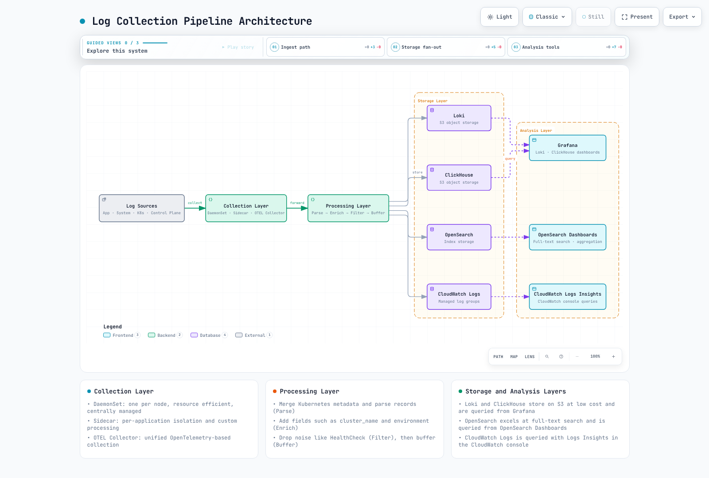
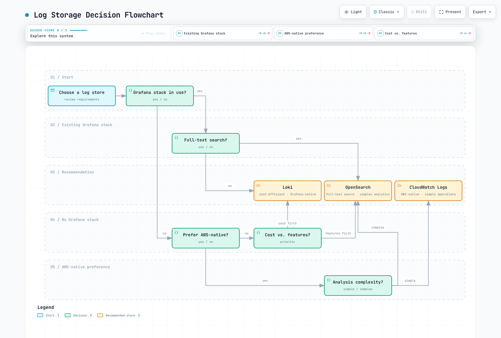

# Logging

> **Last Updated**: February 20, 2026

Effective logging in Kubernetes environments is essential for system visibility, troubleshooting, and security auditing. This document covers logging fundamentals, log collection pipeline architecture, and logging strategies for EKS environments.

## Table of Contents

1. [Logging Fundamentals](#logging-fundamentals)
2. [Log Collection Pipeline Architecture](#log-collection-pipeline-architecture)
3. [Log Storage Selection Criteria](#log-storage-selection-criteria)
4. [EKS Logging Strategy](#eks-logging-strategy)
5. [Solution Comparison](#solution-comparison)

***

## Logging Fundamentals

### Structured Logging

Structured logging outputs log messages in a consistent format, making parsing and analysis easier. Unlike unstructured text logs, structured logs consist of field-value pairs that enable much more efficient searching and filtering.

#### Unstructured vs Structured Logs

```plaintext
# Unstructured log (difficult to parse)
2025-02-15 10:23:45 ERROR Failed to connect to database: connection timeout after 30s

# Structured log (JSON format)
{
  "timestamp": "2025-02-15T10:23:45.123Z",
  "level": "ERROR",
  "message": "Failed to connect to database",
  "error": "connection timeout",
  "timeout_seconds": 30,
  "service": "user-api",
  "pod": "user-api-7d4f8b9c6-x2k9m",
  "namespace": "production",
  "trace_id": "abc123def456"
}
```

#### Benefits of Structured Logging

| Benefit                  | Description                                               |
| ------------------------ | --------------------------------------------------------- |
| **Search Efficiency**    | Fast filtering by specific fields                         |
| **Consistency**          | Same format across all services                           |
| **Correlation Analysis** | Track requests via trace\_id, request\_id                 |
| **Automation**           | Immediately usable in analysis tools without parsing      |
| **Alert Configuration**  | Easy to create alert rules based on specific field values |

### Log Levels

Log levels indicate the importance and severity of messages. Proper use of log levels is crucial for effective troubleshooting and noise reduction.

| Level     | Number | Purpose                                  | Example                                              |
| --------- | ------ | ---------------------------------------- | ---------------------------------------------------- |
| **TRACE** | 0      | Most detailed debugging information      | Function entry/exit, variable values                 |
| **DEBUG** | 1      | Debugging information during development | SQL queries, request parameters                      |
| **INFO**  | 2      | General operational information          | Service startup, request completion                  |
| **WARN**  | 3      | Potential problem situations             | Retries occurring, performance degradation           |
| **ERROR** | 4      | Error occurred (recoverable)             | API call failure, validation failure                 |
| **FATAL** | 5      | Critical error (unrecoverable)           | Service startup failure, missing required dependency |

#### Recommended Log Levels by Environment

```yaml
# Development environment
LOG_LEVEL: DEBUG

# Staging environment
LOG_LEVEL: INFO

# Production environment
LOG_LEVEL: INFO  # or WARN (for high traffic)
```

### JSON Log Format

In Kubernetes environments, JSON format is the de facto standard. Most log collectors and analysis tools natively support JSON.

#### Recommended JSON Fields

```json
{
  "timestamp": "2025-02-15T10:23:45.123Z",
  "level": "INFO",
  "logger": "com.example.UserService",
  "message": "User login successful",
  "context": {
    "user_id": "user-12345",
    "session_id": "sess-abc123",
    "ip_address": "10.0.1.50"
  },
  "kubernetes": {
    "namespace": "production",
    "pod": "user-api-7d4f8b9c6-x2k9m",
    "container": "user-api",
    "node": "ip-10-0-1-100.ec2.internal"
  },
  "trace": {
    "trace_id": "abc123def456",
    "span_id": "789ghi",
    "parent_span_id": "456def"
  }
}
```

#### Key Field Descriptions

| Field Group    | Field         | Description                                         |
| -------------- | ------------- | --------------------------------------------------- |
| **Basic**      | timestamp     | ISO 8601 format timestamp                           |
|                | level         | Log level                                           |
|                | message       | Human-readable message                              |
| **Context**    | context.\*    | Business logic related information                  |
| **Kubernetes** | kubernetes.\* | K8s metadata like pod, namespace                    |
| **Trace**      | trace.\*      | Distributed tracing IDs (OpenTelemetry integration) |

***

## Log Collection Pipeline Architecture

### Architecture Overview



[🔍 View interactive diagram](https://www.atomai.click/kubernetes-docs/archmaps/en-observability-logging-readme-0.html)

### Layer Responsibilities

#### 1. Collection Layer

Responsible for collecting raw logs from log sources.

| Method          | Advantages                                   | Disadvantages                     | Best For                          |
| --------------- | -------------------------------------------- | --------------------------------- | --------------------------------- |
| **DaemonSet**   | Resource efficient, centralized management   | Only one per node                 | Most standard workloads           |
| **Sidecar**     | Per-application isolation, custom processing | Resource overhead                 | Special log formats, multi-tenant |
| **Direct Push** | Real-time, flexible delivery                 | Requires application modification | High-performance requirements     |

#### 2. Processing Layer

Normalizes collected logs and adds metadata.

```yaml
# FluentBit processing pipeline example
[FILTER]
    Name         kubernetes
    Match        kube.*
    Kube_URL     https://kubernetes.default.svc:443
    Merge_Log    On
    K8S-Logging.Parser  On

[FILTER]
    Name         modify
    Match        *
    Add          cluster_name eks-production
    Add          environment production

[FILTER]
    Name         grep
    Match        *
    Exclude      log HealthCheck
```

#### 3. Storage Layer

Stores and indexes processed logs. Storage methods vary by solution characteristics.

#### 4. Analysis Layer

Searches and visualizes stored logs.

***

## Log Storage Selection Criteria

### Key Considerations

#### 1. Cost

```
Monthly log volume: Estimated cost based on 1TB (2025)

+------------------+------------------+-----------------+
|     Solution     |   Storage/GB     |   Query Cost    |
+------------------+------------------+-----------------+
| Loki (S3)        | $0.023 (S3)      | Free            |
| OpenSearch       | $0.10-0.15       | Free            |
| CloudWatch       | $0.50 (ingest)   | $0.005/GB scan  |
| ClickHouse       | $0.023 (S3)      | Free            |
+------------------+------------------+-----------------+
```

#### 2. Query Performance

| Solution       | Real-time Query | Aggregation | Full-text Search | Dashboard             |
| -------------- | --------------- | ----------- | ---------------- | --------------------- |
| **Loki**       | Excellent       | Good        | Limited          | Grafana               |
| **OpenSearch** | Excellent       | Excellent   | Excellent        | OpenSearch Dashboards |
| **CloudWatch** | Good            | Good        | Good             | CloudWatch Console    |
| **ClickHouse** | Excellent       | Excellent   | Good             | Grafana               |

#### 3. Retention Period

```yaml
# Recommended retention policies
regulatory_compliance:
  financial: 7 years
  healthcare: 6 years
  general: 1 year

operational:
  hot_storage: 7-14 days    # Fast queries
  warm_storage: 30-90 days  # Investigation
  cold_storage: 1 year+     # Compliance
```

#### 4. Operational Complexity

| Solution       | Installation | Operations | Scalability |
| -------------- | ------------ | ---------- | ----------- |
| **Loki**       | Low          | Low        | High        |
| **OpenSearch** | Medium       | High       | Medium      |
| **CloudWatch** | Very Low     | Very Low   | High        |
| **ClickHouse** | High         | Medium     | High        |

***

## EKS Logging Strategy

### Log Collection Patterns

#### 1. stdout/stderr Pattern (Recommended)

Logging through container standard output/error is the default Kubernetes pattern.

```yaml
apiVersion: v1
kind: Pod
metadata:
  name: app-pod
spec:
  containers:
  - name: app
    image: myapp:1.0
    # Application outputs logs to stdout/stderr
    # kubelet saves to files in /var/log/containers/
    # DaemonSet agent collects
```

**Advantages:**

* Kubernetes native approach
* Automatic log rotation management (`/var/log/containers/`)
* `kubectl logs` command available
* No separate volume mount required

**Log file locations:**

```bash
# Actual log files
/var/log/containers/<pod-name>_<namespace>_<container-name>-<container-id>.log

# Symbolic links
/var/log/pods/<namespace>_<pod-name>_<pod-uid>/<container-name>/0.log
```

#### 2. Sidecar Pattern

Used when file-based logging or special processing is required.

```yaml
apiVersion: v1
kind: Pod
metadata:
  name: app-with-sidecar
spec:
  containers:
  - name: app
    image: legacy-app:1.0
    volumeMounts:
    - name: log-volume
      mountPath: /var/log/app

  - name: log-collector
    image: fluent/fluent-bit:latest
    volumeMounts:
    - name: log-volume
      mountPath: /var/log/app
      readOnly: true
    - name: fluent-bit-config
      mountPath: /fluent-bit/etc/

  volumes:
  - name: log-volume
    emptyDir: {}
  - name: fluent-bit-config
    configMap:
      name: fluent-bit-sidecar-config
```

**Use Cases:**

* Legacy applications (file logging only)
* Log isolation in multi-tenant environments
* Special parsing required per application
* High security requirements

#### 3. DaemonSet Pattern (Most Common)

One agent per node collects all container logs.

```yaml
apiVersion: apps/v1
kind: DaemonSet
metadata:
  name: fluent-bit
  namespace: logging
spec:
  selector:
    matchLabels:
      app: fluent-bit
  template:
    metadata:
      labels:
        app: fluent-bit
    spec:
      serviceAccountName: fluent-bit
      tolerations:
      - operator: Exists  # Deploy on all nodes
      containers:
      - name: fluent-bit
        image: public.ecr.aws/aws-observability/aws-for-fluent-bit:latest
        volumeMounts:
        - name: varlog
          mountPath: /var/log
          readOnly: true
        - name: varlibdockercontainers
          mountPath: /var/lib/docker/containers
          readOnly: true
        resources:
          limits:
            memory: 200Mi
            cpu: 200m
          requests:
            memory: 100Mi
            cpu: 100m
      volumes:
      - name: varlog
        hostPath:
          path: /var/log
      - name: varlibdockercontainers
        hostPath:
          path: /var/lib/docker/containers
```

### EKS Control Plane Logging

EKS control plane logs are sent to CloudWatch Logs.

```bash
# Enable control plane logging via AWS CLI
aws eks update-cluster-config \
  --name my-cluster \
  --logging '{"clusterLogging":[{"types":["api","audit","authenticator","controllerManager","scheduler"],"enabled":true}]}'
```

| Log Type              | Description             | Recommended         |
| --------------------- | ----------------------- | ------------------- |
| **api**               | API server logs         | Required            |
| **audit**             | Kubernetes audit logs   | Required (security) |
| **authenticator**     | IAM authentication logs | Recommended         |
| **controllerManager** | Controller manager logs | Optional            |
| **scheduler**         | Scheduler logs          | Optional            |

### Container Insights Logging

```yaml
# CloudWatch Agent ConfigMap
apiVersion: v1
kind: ConfigMap
metadata:
  name: cloudwatch-agent-config
  namespace: amazon-cloudwatch
data:
  cwagentconfig.json: |
    {
      "logs": {
        "metrics_collected": {
          "kubernetes": {
            "cluster_name": "my-cluster",
            "metrics_collection_interval": 60
          }
        },
        "force_flush_interval": 5
      }
    }
```

***

## Solution Comparison

### Feature Comparison Table

| Feature                     | Loki       | OpenSearch     | CloudWatch     | ClickHouse     |
| --------------------------- | ---------- | -------------- | -------------- | -------------- |
| **Installation Complexity** | Low        | Medium         | None (managed) | High           |
| **Query Language**          | LogQL      | Lucene/DQL     | Insights QL    | SQL            |
| **Full-text Search**        | Limited    | Excellent      | Good           | Good           |
| **Schema**                  | Schemaless | Schemaless     | Schemaless     | Schema defined |
| **Compression**             | High       | Medium         | N/A            | Very High      |
| **Real-time Tailing**       | Supported  | Supported      | Limited        | Supported      |
| **Alerting**                | Grafana    | Built-in       | Built-in       | Grafana        |
| **Multi-tenancy**           | Supported  | Supported      | Supported      | Supported      |
| **S3 Backend**              | Native     | Snapshots only | N/A            | Native         |

### Recommended Solutions by Use Case

```
+-------------------------------------+---------------------+
|           Use Case                  |  Recommended        |
+-------------------------------------+---------------------+
| Cost optimization is top priority   | Loki + S3           |
| Full-text search and analytics      | OpenSearch          |
| AWS native, simple operations       | CloudWatch Logs     |
| Large-scale analytics, SQL pref.    | ClickHouse          |
| Existing Grafana stack              | Loki                |
| Compliance requirements             | OpenSearch/CloudWatch|
| Startup/small team                  | Loki or CloudWatch  |
| Enterprise/complex analytics        | OpenSearch          |
+-------------------------------------+---------------------+
```

### Cost Simulation (Based on 100GB/month logs)

```
Estimated monthly cost by solution:

Loki (S3 Simple Scalable):
  +- S3 storage: $2.30
  +- S3 requests: $0.50
  +- EC2 (3x m5.large): $180
  +- Total: ~$183

OpenSearch (3x m5.large):
  +- Instances: $300
  +- EBS storage: $15
  +- Total: ~$315

CloudWatch Logs:
  +- Ingestion: $50
  +- Storage: $3
  +- Queries (estimated): $10
  +- Total: ~$63

ClickHouse (self-hosted):
  +- EC2 (3x m5.large): $180
  +- S3 storage: $2.30
  +- Total: ~$183
```

> **Note**: Actual costs can vary significantly based on query patterns, retention period, and region.

### Decision Flowchart



[🔍 View interactive diagram](https://www.atomai.click/kubernetes-docs/archmaps/en-observability-logging-readme-1.html)

***

## Next Steps

For detailed information on each log storage solution, see the following documents:

* [Grafana Loki](01-loki.md) - Cost-effective log aggregation
* [Amazon OpenSearch Service](02-opensearch.md) - Powerful search and analytics
* [CloudWatch Logs](03-cloudwatch-logs.md) - AWS native logging
* [ClickHouse](04-clickhouse.md) - High-performance log analytics
* [Log Collectors Comparison](05-collectors.md) - FluentBit, Promtail, Alloy, OTEL

***

## Quiz

Test your knowledge with the [Logging Overview Quiz](https://github.com/Atom-oh/kubernetes-docs/blob/main/en/quizzes/observability/logging/README-quiz.md).
