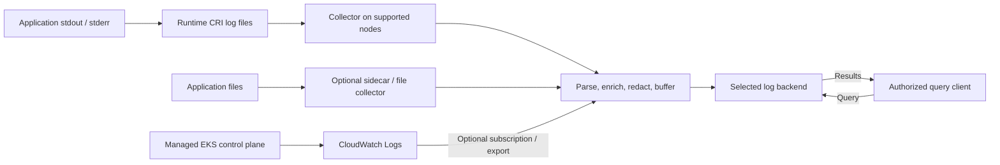

# Logging

> **Last Updated**: September 13, 2026

Logging connects application behavior, infrastructure events and audit evidence.
Design the event schema, collection ownership, delivery failure behavior, access,
retention and queries together. A collector or backend choice alone does not
guarantee complete records, tenant isolation or regulatory compliance.

## Logging fundamentals

### Structured records still require parsing

JSON makes fields explicit and easier to validate/search, but it still needs decoding,
timestamp/type mapping and correct handling of container-runtime framing. JSON can
be larger than plain text and does not automatically remove sensitive data.
Produce one event per line unless a tested multiline format requires otherwise.

This synthetic example retains its original 2025 timestamp as a format illustration,
not a claim about a current incident:

```json
{
  "timestamp": "2025-02-15T10:23:45.123Z",
  "level": "ERROR",
  "message": "Database connection timed out",
  "service": "example-api",
  "operation": "database.connect",
  "timeout_ms": 30000,
  "trace_id": "4bf92f3577b34da6a3ce929d0e0e4736",
  "span_id": "00f067aa0ba902b7"
}
```

The expanded JSON is shown for readability. A line-oriented producer can encode it
as follows, including messages that contain newline characters:

```python
import json


def encode_log(record):
    # JSON escapes embedded newlines; append exactly one record delimiter.
    return json.dumps(record, ensure_ascii=False, separators=(",", ":")) + "\n"
```

These are application field conventions, not the OTLP wire schema. Configure the
collector/backend mapping to OpenTelemetry's Timestamp, SeverityText/SeverityNumber,
Body, Resource, Attributes and trace context where relevant.

Trace IDs are 16-byte values (32 hexadecimal characters in this representation);
span IDs are 8 bytes (16 hexadecimal characters). All-zero IDs are invalid. Attach
the actual active context, not a fresh unrelated ID per log. Startup/system records
without a span can omit trace context; the fields are not mandatory for every JSON log.
Correct IDs alone do not create spans or guarantee cross-service correlation.

Collect the business/context fields you actually need. Do not recommend raw
session tokens, passwords, customer data, IPs or request bodies as universal default
fields. Identity-bearing audit data may have a legitimate purpose, but needs a
defined access/retention/redaction policy. Prefer trusted collector metadata for
routing rather than letting application JSON claim an arbitrary tenant/namespace.

### Severity is not a universal 0–5 scale

Frameworks have different names and numeric levels. Map their meaning explicitly.
For the OpenTelemetry log model, the ranges are:

| Severity | SeverityNumber |
| --- | --- |
| TRACE | 1–4 |
| DEBUG | 5–8 |
| INFO | 9–12 |
| WARN | 13–16 |
| ERROR | 17–20 |
| FATAL | 21–24 |

Zero represents unspecified severity in that model. ERROR does not universally
mean recoverable, and a label alone does not decide retry/recovery policy.
INFO is often a starting point for production operations; audit/security events
and temporarily enabled debugging need their own requirements. Raising everything
to WARN merely to reduce volume can remove needed evidence.

## Collection and processing

The layers below are responsibilities, not necessarily separate processes.
Destinations are selected deliberately; this is not a requirement to copy every
record to every backend. Managed EKS control-plane records enter through CloudWatch,
not worker-node log files.



| Pattern | Appropriate use and limits |
| --- | --- |
| stdout/stderr + node collector | Common Linux worker-node path; runtime files and collector permissions still matter |
| File + sidecar | Legacy/file-only applications or application-specific processing; shared volume, startup/shutdown and overhead need care |
| Application/SDK push | Can carry structured events directly; buffering, authentication and failure behavior affect the application |
| Managed platform router | For example EKS Fargate's built-in log router; uses its supported configuration model |

A DaemonSet schedules on eligible nodes according to selectors, affinity, tolerations,
OS and rollout behavior. It does not prove every node has a healthy collector or every
container is included. Multiple collectors/rolling overlap can duplicate collection.
A sidecar is not automatically a strong multi-tenant security boundary.

### Default Linux log paths and lifecycle

The common default layout is:

```text
Runtime log files:
  /var/log/pods/<namespace>_<pod>_<uid>/<container>/0.log

Compatibility symlinks pointing to those files:
  /var/log/containers/<pod>_<namespace>_<container>-<container-id>.log
```

Kubelet directs the runtime's CRI log path and manages rotation. `podLogsDir` can
change the default path, and OS/runtime-specific layouts differ. Inspect the actual
deployment instead of adding Docker-only mounts to every containerd workload.
`kubectl logs` exposes the current log file; `--previous` can access a previous
container instance when retained. It is not a historical log archive.

Rotation bounds local files; it does not implement central retention or backup.
Node loss, eviction or deletion can remove records before collection. A sidecar's
`emptyDir` survives a container restart within the same pod, but not pod deletion.
Collector offset databases, queues and persistent storage must be designed alongside
output acknowledgment/retries. Buffering is finite; retries can duplicate records.
Measure loss/duplicates, backlog, storage exhaustion and recovery under failure.

Choose a primary route per record. A sidecar that both forwards records and writes
them to stdout can duplicate the node collector path. Avoid collecting collector
output recursively or forwarding into the same subscribed source log group.

### Fluent Bit processing fragment

The following is **classic Fluent Bit configuration**, not YAML. It illustrates
filters only: supply and validate the actual input, CRI/multiline parser, tag format,
RBAC/cache access, storage and output separately.

```text
# Fluent Bit classic-format FILTER fragment, not YAML or a complete pipeline.
# Requires matching tail input tags and CRI/Docker parsing.
[FILTER]
    Name               kubernetes
    Match              kube.*
    Kube_Tag_Prefix     kube.var.log.containers.
    Merge_Log          On
    Merge_Log_Key      app
    Keep_Log           On
    K8S-Logging.Parser  Off
    Labels             Off
    Annotations        Off

[FILTER]
    Name               modify
    Match              kube.*
    Set                cluster_name example-cluster
    Set                environment demo
```

`Merge_Log_Key app` keeps parsed application fields separate from collector metadata.
`Set` replaces the chosen trusted cluster/environment values; `Add` would leave an
already-present value unchanged. Workload-selected parsers/annotations are not
implicitly trusted in this fragment. Match `Kube_Tag_Prefix` to the real input tags.

With `Keep_Log On`, redaction must account for both the original log and parsed
copy. Remove the raw copy only under a tested policy. Do not drop any line containing
`HealthCheck`: a failing health check may be the evidence you need. Filter only
well-defined routine events after checking the application format and failure cases.

This overview does not present an incomplete `latest`-image DaemonSet as a complete
installation. A real collector requires pinned images, an actual configuration,
service account/RBAC, correct mounts, permissions and resources. Follow the
[collector chapter](05-collectors.md) for deployment details and validate its chosen
platform/backend configuration.

## EKS logging paths

### Control-plane logs

EKS can send `api`, `audit`, `authenticator`, `controllerManager` and `scheduler`
records directly to CloudWatch Logs in the account. They serve different purposes:
API diagnostics, audit events, IAM authentication diagnostics, controller and
scheduler diagnostics. Select the types your operating/security requirements need.

Save this request as `control-plane-logging.json`:

```json
{
  "clusterLogging": [
    {
      "types": [
        "api",
        "audit",
        "authenticator",
        "controllerManager",
        "scheduler"
      ],
      "enabled": true
    }
  ]
}
```
```bash
export AWS_REGION=ap-northeast-2
export CLUSTER_NAME=my-cluster

# Inspect the existing configuration before choosing a change.
aws eks describe-cluster --name "$CLUSTER_NAME" --region "$AWS_REGION" \
  --query 'cluster.logging'

# This changes the cluster logging configuration and can incur log charges.
aws eks update-cluster-config --name "$CLUSTER_NAME" --region "$AWS_REGION" \
  --logging file://control-plane-logging.json

# Use the actual update ID from the response, then inspect status/errors.
: "${UPDATE_ID:?Set the returned update ID}"
aws eks describe-update --name "$CLUSTER_NAME" --region "$AWS_REGION" \
  --update-id "$UPDATE_ID"
```

Logging updates are asynchronous. EKS documents up to five available IP addresses
per subnet for the update. Verify the update status, emitted streams and log-group
retention/permissions. Delivery is best effort, usually within minutes; enabling a
type does not backfill every prior event.

Audit events follow the audit policy and its levels/stages/exclusions. They do not
prove that every request/body was recorded, and enabling `audit` alone does not
establish compliance. The node DaemonSet does not read a managed control-plane host.
Forwarding CloudWatch records elsewhere is a separate subscription/export path
with its encoding, IAM, delivery and duplicate-handling requirements.

### Fargate and Container Insights

EKS Fargate provides a managed Fluent Bit-based router configured by `aws-logging`
in the `aws-observability` namespace, with a documented 5,300-character limit and
supported-section/plugin restrictions. You do not install the ordinary host
DaemonSet there. Configure its destination permissions and test new workload logs.
Auto Mode/mixed/Windows environments also need their supported collection paths.

The namespace requires the `aws-observability: enabled` label. Grant destination
permissions to the Fargate pod execution role as documented. ConfigMap changes
apply to new pods, not existing pods; plan a controlled rollout and verify delivery.


CloudWatch Agent's `logs.metrics_collected.kubernetes` emits Container Insights
performance data; that alone is not application stdout/stderr log collection.
Fluent Bit or a configured OTel log path handles application logs separately.
A ConfigMap has no effect unless the actual workload/Operator consumes it.
See the reviewed [CloudWatch guide](../metrics/04-cloudwatch-metrics.md) for those
model and configuration boundaries.

## Storage, retention and cost decisions

| Backend | Design questions |
| --- | --- |
| Loki | LogQL, label-indexed streams/chunks and supported metadata/filter paths; choose labels, tenancy/authentication, storage and query capacity |
| OpenSearch | Search/aggregation APIs and mappings/index lifecycle; distinguish self-managed, managed domains, UltraWarm and Serverless |
| CloudWatch Logs | Managed log groups, IAM, retention and Logs Insights QL/SQL/PPL; features vary by log class and Region |
| ClickHouse | Column-oriented SQL analytics, schema/order/partition/TTL choices and the selected self-managed or cloud storage model |

OpenSearch is not universally “S3 snapshots only”: UltraWarm uses S3 and caching,
and Serverless separates storage and compute. CloudWatch is not a user-configured
S3 log backend, but supports separate export/delivery/integration paths. A product's
tenant identifier or a sidecar does not replace authenticated routing and backend
access controls.

Full-text filtering, indexing and query latency are different questions. Test
representative volumes, query predicates, concurrency, cold data and recovery.
Avoid unconditional “excellent/limited” rankings, “schemaless means no schema”
claims or compression ratios without a measured dataset/configuration.

### Retention requires a policy for the actual records

Do not map `financial` to seven years, `healthcare` to six years or general logs to
one year as universal legal rules. Determine the applicable record category,
jurisdiction, contractual requirements, legal holds and approved owner policy.
Hot/warm/cold tiers are operational choices, not evidence that these obligations
were met. Include replicas, object versions, backups and exports in deletion/access
plans, and test restoration separately.

### Compare like-for-like costs

The old 2025 table mixed per-GB storage and ingestion prices and called self-managed
queries free. The later 100-GB estimates lacked a reproducible Region, hours,
retention, capacity and workload basis. These were illustrative estimates, not
production measurements; changing the date or only one price would not repair them.

Compare ingestion, retained/compressed bytes and index overhead, replicas, compute,
query scans/capacity, storage requests, network transfer, backups and operating work.
An object-store price is only one term. Even without a per-query service charge,
queries consume provisioned CPU/memory/I/O. Loki plus S3 is not a guaranteed cost
winner, nor is a named backend automatically suitable for compliance.

1. Define required queries, freshness, retention, access and recovery objectives.
2. Shortlist deployment models that meet those requirements.
3. Replay representative data/queries and failure/recovery cases.
4. Compare complete costs and operating ownership.
5. Record remaining assumptions and verify them before production use.

## Next steps and validation scope

Promtail reached end of life on **2026-03-02**. Use Alloy or another supported client
for new work and plan migration for existing Promtail deployments. The cited notice
explicitly treats `lambda-promtail` separately; do not broaden the retirement claim.

- [Loki](01-loki.md)
- [OpenSearch](02-opensearch.md)
- [CloudWatch Logs](03-cloudwatch-logs.md)
- [ClickHouse](04-clickhouse.md)
- [Collectors: Fluent Bit, Alloy and OpenTelemetry](05-collectors.md)

This audit checked source facts, example serialization/IDs and request/configuration
structure. No EKS logging change, collector deployment, tenant/storage provisioning,
legal determination, production cost measurement or delivery/recovery test was run.

## References

- [Kubernetes logging architecture](https://kubernetes.io/docs/concepts/cluster-administration/logging/)
- [Kubelet legacy log symlinks](https://github.com/kubernetes/kubernetes/blob/v1.36.2/pkg/kubelet/kuberuntime/legacy.go)
- [DaemonSet behavior](https://kubernetes.io/docs/concepts/workloads/controllers/daemonset/)
- [Kubernetes audit policy](https://kubernetes.io/docs/tasks/debug/debug-cluster/audit/)
- [OpenTelemetry logs data model](https://opentelemetry.io/docs/specs/otel/logs/data-model/)
- [W3C Trace Context](https://www.w3.org/TR/trace-context/)
- [EKS control-plane logging](https://docs.aws.amazon.com/eks/latest/userguide/control-plane-logs.html)
- [EKS Fargate log router](https://docs.aws.amazon.com/eks/latest/userguide/fargate-logging.html)
- [Fluent Bit Kubernetes filter source documentation](https://github.com/fluent/fluent-bit-docs/blob/master/pipeline/filters/kubernetes.md)
- [Fluent Bit modify filter](https://github.com/fluent/fluent-bit-docs/blob/master/pipeline/filters/modify.md)
- [Loki architecture](https://grafana.com/docs/loki/latest/get-started/overview/)
- [Promtail end of life](https://grafana.com/docs/loki/latest/send-data/promtail/)
- [OpenSearch UltraWarm](https://docs.aws.amazon.com/opensearch-service/latest/developerguide/ultrawarm.html)
- [OpenSearch Serverless](https://docs.aws.amazon.com/opensearch-service/latest/developerguide/serverless-overview.html)
- [CloudWatch Logs query languages](https://docs.aws.amazon.com/AmazonCloudWatch/latest/logs/AnalyzingLogData.html)
- [CloudWatch log classes](https://docs.aws.amazon.com/AmazonCloudWatch/latest/logs/CloudWatch_Logs_Log_Classes.html)
- [ClickHouse overview](https://github.com/ClickHouse/ClickHouse)

[Quiz](../../quizzes/observability/logging/README-quiz.md)
