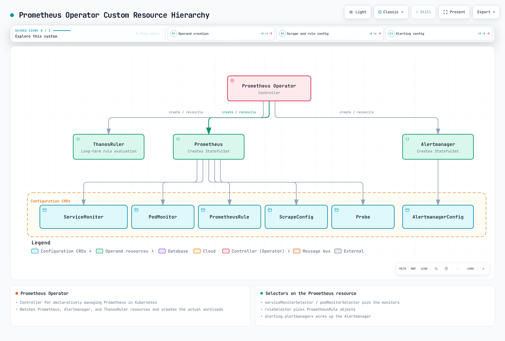

# Prometheus

> Reviewed: September 13, 2026. Local configuration/query checks are described below; no cluster or cloud deployment was performed.

## Contents

- [Introduction and versions](#introduction-and-versions)
- [Architecture and components](#architecture-and-components)
- [PromQL](#promql)
- [Discovery and Operator selectors](#discovery-and-operator-selectors)
- [kube-prometheus-stack installation](#kube-prometheus-stack-installation)
- [Rules and Alertmanager](#rules-and-alertmanager)
- [Remote write and AMP](#remote-write-and-amp)
- [Performance, HA and troubleshooting](#performance-ha-and-troubleshooting)

## Introduction and versions

Prometheus is the CNCF monitoring toolkit originally developed at SoundCloud. It collects numeric time series, stores them in a local TSDB, evaluates PromQL and recording/alert rules, and sends alerts to Alertmanager. Normal collection uses HTTP scraping; remote write and optional batch integrations add other delivery paths. It is not an event log, trace store or exact per-request billing ledger.

Local retention is configurable and can exceed 30 days. A separate store is a choice driven by retention, capacity, shared querying and failure/recovery requirements.

This chapter uses the official **kube-prometheus-stack 90.0.0** package, released on September 6, 2026. Its component versions were inspected as a cohort:

| Component | Package default |
|---|---|
| Prometheus Operator | 0.93.1 |
| Prometheus | 3.14.0, distroless image |
| Alertmanager | 0.34.0 |
| Grafana | 13.2.1, subchart 13.2.2 |
| kube-state-metrics | 2.20.0, subchart 8.4.2 |
| node-exporter | 1.12.1, subchart 4.56.3 |

The chart's `kubeVersion` guard is `>=1.25.0-0`. This is not a complete compatibility matrix or a statement that every Kubernetes 1.25+ version remains supported. Check the actual cluster, component support, admission policy and storage driver.

The profile targets **Linux EC2-backed EKS workers**. Fargate has no DaemonSets; Auto Mode, Hybrid Nodes and Windows require platform-specific collector/storage checks.

### Historical July 2026 updates

- The [July 14 Kubernetes exporter article](https://kubernetes.io/blog/2026/07/14/custom-metrics-exporter-kubernetes/) explains application instrumentation and custom exporters. HPA use also requires the appropriate metrics API/adapter; scraping alone does not connect arbitrary metrics to HPA.
- The [July 21 AMP announcement](https://aws.amazon.com/about-aws/whats-new/2026/07/amazon-managed-service-prometheus-1500m-metrics-workspace/) describes up to 1.5 billion active series and 200,000 recording/alerting rules per workspace. These are announced scaling limits, not automatically granted default quotas or approval guarantees. Check current quotas for the intended workspace/account.

## Architecture and components


[Interactive diagram](https://www.atomai.click/kubernetes-docs/archmaps/en-observability-metrics-01-prometheus-0.html)

The Pushgateway branch is optional for suitable service-level batch jobs, not every short-lived Pod. Groups need lifecycle management; see the [metrics overview](README.md). `up` reports scrape health, not application availability.

| Component | Responsibility and prerequisites |
|---|---|
| Prometheus | Discovery, scraping, local TSDB, query API and rule evaluation |
| kube-state-metrics | API object state; needs ServiceAccount, RBAC and a scrape endpoint |
| node-exporter | Host OS metrics; host access/mounts and platform support need review |
| kubelet/cAdvisor | Container measurements; verify serving certificates, authorization and endpoint availability |
| metrics-server / adapters | Resource/custom metrics APIs for autoscaling; separate from historical TSDB storage |
| Alertmanager | Group, deduplicate, inhibit and route alerts to configured receivers |
| Grafana | Query/visualize data sources; authentication and database/storage require their own configuration |

The chart supplies exporters and supporting resources. Incomplete standalone Deployment/DaemonSet snippets do not supply missing ServiceAccounts, RBAC and Services and should not create a duplicate monitoring stack.

### TSDB and configuration layers

Recent samples use the head/WAL; compacted blocks contain chunks, an index and metadata. Tombstones mark deleted ranges. WAL replay helps crash recovery but does not replace backups, survive volume loss or guarantee recovery of every event.

| Layer | Correct settings |
|---|---|
| Process flags | `--storage.tsdb.path`, `--storage.tsdb.retention.time`, `--storage.tsdb.retention.size` |
| Prometheus configuration | `global`, `scrape_configs`, `rule_files`, `remote_write` |
| Operator `Prometheus.spec` | `retention`, `retentionSize`, `storage`, `replicas`, `shards` |
| This chart's values | `prometheus.prometheusSpec.retention`, `storageSpec` and the values below |

The old `storage.tsdb.path/retention.time/...` YAML is not valid process configuration. In a **separate standalone installation**, basic flags look like:

```sh
prometheus --config.file=prometheus.yml \
  --storage.tsdb.path=/prometheus \
  --storage.tsdb.retention.time=15d \
  --storage.tsdb.retention.size=15GB
```

For the Operator installation, configure the owning Helm values. Retention size is not a total-disk hard limit: leave space for the WAL, head, indexes and compaction. Use supported local/block storage; arbitrary NFS is not a supported replacement.

## PromQL

Examples assume `job="example-app"` and the chart's node-exporter/kube-state-metrics job labels. Adapt them to actual targets. `example_queue_depth` and `temperature_celsius` are application-defined gauges, not built-in Kubernetes metrics.

### Selectors, ranges and rates

Instant selectors use lookback/staleness rules to find eligible samples; “current” does not guarantee an observation at the exact evaluation time. A range selector chooses a sample interval. A subquery evaluates an expression at its resolution, rather than selecting every Nth stored raw sample.

| Purpose | PromQL |
|---|---|
| Instant selector | `http_requests_total{job="example-app"}` |
| Positive/regex filtering | `http_requests_total{job="example-app",method="GET",status=~"2[0-9]{2}"}` |
| Negative regex | `http_requests_total{job="example-app",status!~"5[0-9]{2}"}` |
| Range vector | `http_requests_total{job="example-app"}[5m]` |
| One-hour subquery with five-minute resolution | `rate(http_requests_total{job="example-app"}[5m])[1h:5m]` |
| Rate window one hour earlier | `rate(http_requests_total{job="example-app"}[5m] offset 1h)` |
| Average per-second counter rate | `rate(http_requests_total{job="example-app"}[5m])` |
| Rate from the last two usable samples | `irate(http_requests_total{job="example-app"}[5m])` |
| Extrapolated counter increase | `increase(http_requests_total{job="example-app"}[1h])` |

Negative matchers can select series without the label. `rate()` and `increase()` handle observed resets and extrapolate; they cannot recover every missed increment. Apply **rate before aggregation**. `irate()` is sensitive to the latest samples and is usually less suitable for stable alert conditions.

A range vector is an input to range functions, not a ready-made range-query graph. For instance, use `rate(counter[5m])` when requesting an evaluated rate series.

### Aggregation, gauges and time

| Purpose | PromQL |
|---|---|
| Request rate by method | `sum by (method) (rate(http_requests_total{job="example-app"}[5m]))` |
| Aggregate away instance | `sum without (instance) (rate(http_requests_total{job="example-app"}[5m]))` |
| Sum deduplicated Running indicators | `sum(max by (namespace,pod,uid) (kube_pod_status_phase{job="kube-state-metrics",phase="Running"}))` |
| Maximum available memory | `max(node_memory_MemAvailable_bytes{job="node-exporter"})` |
| Top Pod CPU without empty/infra container labels | `topk(5, sum by (namespace,pod) (rate(container_cpu_usage_seconds_total{job="kubelet",container!="",container!="POD"}[5m])))` |
| Quantile across current queue-depth gauges | `quantile(0.95, example_queue_depth{job="example-app"})` |
| Standard deviation across rates | `stddev(rate(http_requests_total{job="example-app"}[5m]))` |
| Extrapolated Gauge change | `delta(temperature_celsius{job="example-app"}[1h])` |
| Gauge slope per second | `deriv(temperature_celsius{job="example-app"}[1h])` |
| Absolute deviation from 20°C | `abs(temperature_celsius{job="example-app"} - 20)` |
| Round up | `ceil(example_queue_depth{job="example-app"})` |
| Clamp to a range | `clamp(example_queue_depth{job="example-app"}, 0, 100)` |
| Square root | `sqrt(example_queue_depth{job="example-app"})` |
| Natural logarithm | `ln(example_queue_depth{job="example-app"})` |
| Evaluation time in Unix seconds | `time()` |
| Selected sample timestamp | `timestamp(up{job="example-app"})` |
| UTC hour of the sample | `hour(timestamp(up{job="example-app"}))` |

Counting `kube_pod_status_phase{phase="Running"}` series counts zeros too. Summing the 0/1 indicators after removing duplicate exporter identities gives zero when only zero indicators exist, while absent telemetry remains absent.

The Gauge `quantile()` example compares values across series. It does not calculate a histogram's request-latency p95 or combine Summary p99 values. Math functions have input-domain limits; for example, a nonpositive logarithm needs deliberate handling. Related functions include `floor`, `round`, `clamp_min` and `clamp_max`.

This business-hours filter is **UTC**, not the browser/cluster timezone:

```promql
sum(rate(http_requests_total{job="example-app"}[5m])) and on() (hour() >= 9 < 18)
```

### Distributions and forecasts

```promql
histogram_quantile(0.95, sum by (le) (rate(http_request_duration_seconds_bucket{job="example-app"}[5m])))
```

```promql
histogram_quantile(0.99, sum by (le,method) (rate(http_request_duration_seconds_bucket{job="example-app"}[5m])))
```

```promql
sum(rate(http_request_duration_seconds_sum{job="example-app"}[5m])) / sum(rate(http_request_duration_seconds_count{job="example-app"}[5m]))
```

Aggregate compatible classic buckets and retain `le`. Quantiles interpolate within buckets. Summary quantiles are also approximations and cannot be averaged into a fleet percentile; sum/count can calculate a fleet mean.

`predict_linear()` extrapolates a fitted Gauge trend. A negative projection is a reason to investigate, not a guaranteed future disk failure:

```promql
predict_linear(node_filesystem_avail_bytes{job="node-exporter",mountpoint="/",fstype!~"tmpfs|overlay"}[6h], 86400)
```

Prometheus 3 renamed `holt_winters` to `double_exponential_smoothing`. This is **Holt linear smoothing, not seasonal triple-exponential prediction**, and requires Gauge float samples. Optional expression: `double_exponential_smoothing(example_queue_depth{job="example-app"}[1h], 0.5, 0.5)`. The evaluating server needs `--enable-feature=promql-experimental-functions`. The local audit checked its parser syntax; experimental value evaluation is not claimed as passed.

### Operational examples

| Purpose | PromQL |
|---|---|
| CPU non-idle percentage | `100 * (1 - avg by (instance) (rate(node_cpu_seconds_total{job="node-exporter",mode="idle"}[5m])))` |
| Share not reported as MemAvailable | `100 * (1 - node_memory_MemAvailable_bytes{job="node-exporter"} / node_memory_MemTotal_bytes{job="node-exporter"})` |
| Estimated restart increase above three | `increase(kube_pod_container_status_restarts_total{job="kube-state-metrics"}[1h]) > 3` |
| Filesystem unavailable-space percentage | `100 * (1 - node_filesystem_avail_bytes{job="node-exporter",mountpoint="/"} / node_filesystem_size_bytes{job="node-exporter",mountpoint="/"})` |
| Receive + transmit bytes per second | `rate(node_network_receive_bytes_total{job="node-exporter",device="eth0"}[5m]) + rate(node_network_transmit_bytes_total{job="node-exporter",device="eth0"}[5m])` |

For error percentage, a healthy service may have no 5xx series. The zero fallback below exists only for matching total-traffic groups; it does not invent healthy data for missing services.

```promql
100 * (sum by (namespace, service) (rate(http_requests_total{job="example-app",status=~"5[0-9]{2}"}[5m])) or on (namespace, service) (0 * (sum by (namespace, service) (rate(http_requests_total{job="example-app"}[5m]))))) / (sum by (namespace, service) (rate(http_requests_total{job="example-app"}[5m])))
```

Observed healthy traffic yields 0, all-5xx traffic yields 100, and a zero denominator remains undefined. Missing telemetry remains missing; monitor collection failures separately.

## Discovery and Operator selectors



[Interactive diagram](https://www.atomai.click/kubernetes-docs/archmaps/en-observability-metrics-01-prometheus-1.html)

Prometheus/Alertmanager nodes in this figure mean **custom resources**. The Operator reads them and reconciles actual workloads such as StatefulSets. The objects or Prometheus server do not independently create StatefulSets.

| Selection stage | Selected object |
|---|---|
| Prometheus `serviceMonitorNamespaceSelector` | Namespaces containing ServiceMonitor objects |
| Prometheus `serviceMonitorSelector` | Labels on those ServiceMonitor objects |
| ServiceMonitor `namespaceSelector` / `selector` | Target Service namespaces and labels |
| ServiceMonitor endpoint `port` | **Service port name**, not an arbitrary container port number |
| PodMonitor selector / endpoint `port` | Pod labels and declared container port name |

RBAC, discovery and network/TLS access are separate requirements. Selectors do not replace authorization. Helm's `*SelectorNilUsesHelmValues` booleans affect label-selector defaults, not all target namespaces.

### A coherent application scrape

Assume an existing instrumented Deployment in `example-app`, Pod label `app: example-app`, and a declared port named `metrics` serving `/metrics`. The Service below does not create the application:

```yaml
# service.yaml
apiVersion: v1
kind: Service
metadata:
  name: example-app
  namespace: example-app
  labels:
    app: example-app
    metrics-job: example-app
spec:
  selector:
    app: example-app
  ports:
  - name: http-metrics
    port: 8080
    targetPort: metrics
```

```yaml
# servicemonitor.yaml
apiVersion: monitoring.coreos.com/v1
kind: ServiceMonitor
metadata:
  name: example-app
  namespace: monitoring
  labels:
    release: kube-prom
spec:
  jobLabel: metrics-job
  selector:
    matchLabels:
      app: example-app
  namespaceSelector:
    matchNames:
    - example-app
  endpoints:
  - port: http-metrics
    path: /metrics
    interval: 30s
    scrapeTimeout: 10s
    relabelings:
    - sourceLabels:
      - __meta_kubernetes_service_name
      targetLabel: service
    - sourceLabels:
      - __meta_kubernetes_namespace
      targetLabel: namespace
    - sourceLabels:
      - __meta_kubernetes_pod_name
      targetLabel: pod
```

The ServiceMonitor's `release: kube-prom` matches the installation. Its `jobLabel` reads the Service's `metrics-job: example-app`, establishing the application-query job label.

PodMonitor is an **alternative** for the same Pods. Choose one intended collection path for an endpoint to avoid duplicate ingestion:

```yaml
# podmonitor.yaml
apiVersion: monitoring.coreos.com/v1
kind: PodMonitor
metadata:
  name: example-app-pods
  namespace: monitoring
  labels:
    release: kube-prom
spec:
  selector:
    matchLabels:
      app: example-app
  namespaceSelector:
    matchNames:
    - example-app
  podMetricsEndpoints:
  - port: metrics
    interval: 30s
    path: /metrics
    relabelings:
    - targetLabel: job
      replacement: example-app
    - targetLabel: service
      replacement: example-app
```

### Other discovery paths

- Standalone/agent Pod discovery can use the [overview's named-port configuration](README.md#metric-collection-models), which preserves discovery-provided IPv4/IPv6 addresses. An annotation such as `prometheus.io/scheme` has no effect unless the actual configuration consumes it.
- Service blackbox probing needs an installed exporter, defined probe module, appropriate target URL/scheme and a `Probe`/scrape configuration. `up` describes exporter scraping; probe success is a separate signal.
- Node discovery reaches kubelet endpoints, not node-exporter automatically. Verify serving certificates, the correct CA and node-metric RBAC. The Kubernetes API CA does not prove trust for arbitrary node certificates.
- Use reviewed namespace/service/team labels rather than unrestricted node `labelmap`. Removing identity labels is not an aggregation operation.

## kube-prometheus-stack installation

These are cluster-changing operator commands, **not commands executed in the audit**. Use the intended context and an owned release. For existing installations, review actual values, CRDs, storage and upgrade notes instead of installing a duplicate stack.

Prerequisites for this profile:

- Authorized Helm/Kubernetes access and sufficient Linux EC2 node resources.
- A working default block-storage StorageClass/CSI driver, or explicit reviewed class names for every PVC. `gp3` is not guaranteed to exist.
- An existing `monitoring` namespace, Secrets Store CSI driver and AWS provider (ASCP) on the Linux EC2 nodes. Prepare `observability/grafana-admin` in AWS Secrets Manager (`ap-northeast-2`) with the JSON string key `admin-password`; do not synchronize it into a Kubernetes Secret.
- The `metrics-demo-grafana` service account needs a scoped IRSA role for that secret. Replace the example IAM role ARN below and apply the matching SecretProviderClass. See the [complete identity, KMS, mount and rotation prerequisites](../../../examples/observability/secret-profiles/README.md).
- Verified kubelet TLS trust. This profile enables certificate verification; supply the proper CA if certificates use another issuer rather than bypassing verification.

Sizing is illustrative. Each Prometheus replica gets its own PVC; retention size does not bound WAL/head/compaction use. Grafana remains one replica with a PVC-backed database. Increasing replicas alone is not shared-database HA.

```yaml
# kube-prometheus-stack 90.0.0; replace the example IRSA role ARN before use.
fullnameOverride: metrics-demo
kubeControllerManager:
  enabled: false
kubeScheduler:
  enabled: false
kubeEtcd:
  enabled: false
kubeProxy:
  enabled: false
kubelet:
  serviceMonitor:
    tlsConfig:
      insecureSkipVerify: false
prometheus:
  serviceAccount:
    create: true
    name: metrics-demo-prometheus
  prometheusSpec:
    replicas: 1
    shards: 1
    retention: 15d
    retentionSize: 15GB
    storageSpec:
      volumeClaimTemplate:
        spec:
          accessModes:
          - ReadWriteOnce
          resources:
            requests:
              storage: 20Gi
    resources:
      requests:
        cpu: 500m
        memory: 2Gi
      limits:
        memory: 4Gi
    externalLabels:
      cluster: eks-metrics-demo
    serviceMonitorSelectorNilUsesHelmValues: true
    serviceMonitorNamespaceSelector: &id001
      matchExpressions:
      - key: kubernetes.io/metadata.name
        operator: In
        values:
        - monitoring
        - example-app
    podMonitorSelectorNilUsesHelmValues: true
    podMonitorNamespaceSelector: *id001
    ruleSelectorNilUsesHelmValues: true
    ruleNamespaceSelector:
      matchLabels:
        kubernetes.io/metadata.name: monitoring
alertmanager:
  alertmanagerSpec:
    replicas: 1
    storage:
      volumeClaimTemplate:
        spec:
          accessModes:
          - ReadWriteOnce
          resources:
            requests:
              storage: 5Gi
grafana:
  fullnameOverride: metrics-demo-grafana
  replicas: 1
  persistence:
    enabled: true
    size: 10Gi
  sidecar:
    dashboards:
      searchNamespace: monitoring
      skipReload: true
      initDashboards: true
      provider:
        updateIntervalSeconds: 30
    datasources:
      searchNamespace: monitoring
      skipReload: true
      initDatasources: true
  serviceAccount:
    create: true
    name: metrics-demo-grafana
    annotations:
      eks.amazonaws.com/role-arn: arn:aws:iam::111122223333:role/metrics-grafana-secrets
  env:
    GF_SECURITY_ADMIN_USER: admin
    GF_SECURITY_ADMIN_PASSWORD: $__file{/mnt/grafana-secrets/admin-password}
  grafana.ini:
    security:
      admin_user: admin
      admin_password: $__file{/mnt/grafana-secrets/admin-password}
  extraVolumes:
  - name: grafana-secrets
    csi:
      driver: secrets-store.csi.k8s.io
      readOnly: true
      volumeAttributes:
        secretProviderClass: metrics-grafana-admin
  extraVolumeMounts:
  - name: grafana-secrets
    mountPath: /mnt/grafana-secrets
    readOnly: true
```

This EKS profile disables monitors for managed control-plane components and kube-proxy endpoints whose exposure is not assumed here. It does not disable Kubernetes itself. ServiceMonitors in `monitoring`/`example-app` need matching release labels; rules are selected from `monitoring`.

Grafana receives a **literal file-provider expression**, not a password value, in `GF_SECURITY_ADMIN_PASSWORD`. This suppresses the chart's automatic credential environment references. Grafana 13.2.1 evaluates `$__file{...}` inside its configuration after environment overrides; no `__FILE` entrypoint or shell exports the file contents. The read-only CSI file must be readable by UID/GID 472 (`fsGroup: 472`, mode `0440`), and only the main Grafana container mounts it. Use a password without leading/trailing whitespace, which the file provider trims.

The dashboard/datasource init containers populate provisioning files before startup. Sidecars keep watching files but use `skipReload: true`, so none needs admin credentials. Grafana polls dashboard files every 30 seconds; **datasource updates require a controlled Pod restart**. `admin_password` initializes a new database only: changing the AWS secret, CSI rotation or a restart does not reset the administrator password in an existing PVC/database. Use the approved password-change/SSO procedure and reconcile the secret; preserve the PVC.

Use the complete [reusable profile](../../../examples/observability/secret-profiles/README.md), including `grafana-secret-provider.yaml`. Local render/tests cover config and mounts, not live CSI permissions, login or rotation. Primary contracts: [Grafana configuration](https://grafana.com/docs/grafana/latest/setup-grafana/configure-grafana/) and [AWS ASCP](https://github.com/aws/secrets-store-csi-driver-provider-aws/blob/main/README.md).

From the repository root, install once after preparing the prerequisites:

```sh
PROFILE=examples/observability/secret-profiles
kubectl apply -f "$PROFILE/grafana-secret-provider.yaml"
helm repo add prometheus-community https://prometheus-community.github.io/helm-charts
helm repo update prometheus-community
helm template kube-prom prometheus-community/kube-prometheus-stack \
  --version 90.0.0 --namespace monitoring -f "$PROFILE/prometheus-values.yaml" \
  > grafana-reviewed-render.yaml
# Review resources, prerequisites and ownership before this cluster-changing command.
helm upgrade --install kube-prom prometheus-community/kube-prometheus-stack \
  --version 90.0.0 --namespace monitoring -f "$PROFILE/prometheus-values.yaml" \
  --wait --timeout 15m
```

Check CRD establishment, Operator health, PVC binding and actual targets. Apply the chosen application monitor/rules only after their CRDs are established.

Chart CRD upgrade handling is version-specific. Read upgrade notes instead of assuming every CRD migration is covered by a plain Helm upgrade. Chart 90 also changes the Grafana dependency to the community repository; validate existing authentication/provisioning values and preserve database/PVC backups when upgrading.

## Rules and Alertmanager

The selected PrometheusRule below contains alert and recording examples. CPU recording uses `rate` and ratio units consistently. The error expression is a percentage, so the threshold is 1 and the annotation prints a percentage.

```yaml
# prometheusrule.yaml
apiVersion: monitoring.coreos.com/v1
kind: PrometheusRule
metadata:
  name: example-rules
  namespace: monitoring
  labels:
    release: kube-prom
spec:
  groups:
  - name: example-alerts
    interval: 30s
    rules:
    - alert: NodeMemoryHigh
      expr: 100 * (1 - node_memory_MemAvailable_bytes{job="node-exporter"} / node_memory_MemTotal_bytes{job="node-exporter"})
        > 90
      for: 5m
      labels:
        severity: warning
        team: infrastructure
      annotations:
        summary: Node {{ $labels.instance }} memory availability is low
        description: '{{ printf "%.2f" $value }}% is not reported as MemAvailable.'
    - alert: PodRestartingFrequently
      expr: increase(kube_pod_container_status_restarts_total{job="kube-state-metrics"}[1h]) > 5
      for: 10m
      labels:
        severity: warning
      annotations:
        summary: Pod {{ $labels.namespace }}/{{ $labels.pod }} is restarting
        description: '{{ printf "%.2f" $value }} estimated restarts in one hour.'
    - alert: ProjectedDiskExhaustion
      expr: predict_linear(node_filesystem_avail_bytes{job="node-exporter",mountpoint="/",fstype!~"tmpfs|overlay"}[6h],
        86400) < 0
      for: 1h
      labels:
        severity: warning
      annotations:
        summary: Projected disk exhaustion on {{ $labels.instance }}
        description: The fitted six-hour trend projects negative free space in 24 hours; inspect the filesystem
          and workload.
    - alert: HighErrorRate
      expr: (100 * (sum by (namespace, service) (rate(http_requests_total{job="example-app",status=~"5[0-9]{2}"}[5m]))
        or on (namespace, service) (0 * (sum by (namespace, service) (rate(http_requests_total{job="example-app"}[5m])))))
        / (sum by (namespace, service) (rate(http_requests_total{job="example-app"}[5m])))) > 1
      for: 5m
      labels:
        severity: warning
        team: backend
      annotations:
        summary: High error rate on {{ $labels.namespace }}/{{ $labels.service }}
        description: '{{ printf "%.2f" $value }}% of requests are 5xx, above the 1% threshold.'
  - name: example-recording
    rules:
    - record: instance:node_cpu_utilization:ratio_rate5m
      expr: 100 * (1 - avg by (instance) (rate(node_cpu_seconds_total{job="node-exporter",mode="idle"}[5m])))
        / 100
    - record: instance:node_memory_not_available:ratio
      expr: max by (instance) ((1 - node_memory_MemAvailable_bytes{job="node-exporter"} / node_memory_MemTotal_bytes{job="node-exporter"}))
```

`for` means the same alert label set must continue satisfying the expression through evaluations before firing. Missing data or changing labels can interrupt pending state. It is not Alertmanager's notification delay or repeat interval. A forecast alert describes a projection, not guaranteed failure.

### AlertmanagerConfig and namespace boundaries

Operator 0.93.1's packaged AlertmanagerConfig CRD serves **v1alpha1**. This example uses it as an administrator-owned **global configuration**. Referenced Secrets must exist in `monitoring`. Replace/approve addresses, channels and provider destinations before enabling delivery.

The Operator API marks `alertmanagerConfiguration` experimental: retain the version boundary and test upgrades. Ordinary selected namespaced AlertmanagerConfigs normally get namespace matchers; a config in `monitoring` does not automatically receive application alerts from every namespace. The global configuration deliberately has a wider administrative boundary.

```yaml
# alertmanagerconfig.yaml
apiVersion: monitoring.coreos.com/v1alpha1
kind: AlertmanagerConfig
metadata:
  name: main-config
  namespace: monitoring
spec:
  route:
    receiver: default
    groupBy:
    - alertname
    - namespace
    - severity
    groupWait: 30s
    groupInterval: 5m
    repeatInterval: 4h
    routes:
    - receiver: pagerduty-critical
      matchers:
      - name: severity
        matchType: '='
        value: critical
      groupWait: 10s
      repeatInterval: 1h
    - receiver: slack-backend
      matchers:
      - name: team
        matchType: '='
        value: backend
    - receiver: slack-warnings
      matchers:
      - name: severity
        matchType: '='
        value: warning
      groupWait: 1m
  inhibitRules:
  - sourceMatch:
    - name: severity
      matchType: '='
      value: critical
    targetMatch:
    - name: severity
      matchType: '='
      value: warning
    equal:
    - alertname
    - cluster
    - namespace
    - service
    - instance
    - pod
    - container
  receivers:
  - name: default
    emailConfigs:
    - to: alerts@example.com
      from: alertmanager@example.com
      smarthost: smtp.example.com:587
      authUsername: alertmanager
      authPassword:
        name: alertmanager-smtp
        key: password
      requireTLS: true
  - name: slack-backend
    slackConfigs:
    - apiURL:
        name: alertmanager-slack
        key: webhook-url
      channel: '#team-backend-alerts'
      sendResolved: true
  - name: slack-warnings
    slackConfigs:
    - apiURL:
        name: alertmanager-slack
        key: webhook-url
      channel: '#alerts'
      sendResolved: true
  - name: pagerduty-critical
    pagerdutyConfigs:
    - routingKey:
        name: alertmanager-pagerduty
        key: routing-key
      sendResolved: true
```

By default, sibling routes stop at the first match. Critical routes come first; the backend route precedes the general warning route, so it can be reached. Set `continue` deliberately only when multiple deliveries are intended. Inhibition matches resource identity as well as alert name: a critical alert for one service/node must not suppress an unrelated warning. Choose meaningful equal-label fields for your alert families; labels missing from both alerts compare equal.

`groupBy` in the CR becomes `group_by` in native Alertmanager configuration. Grouping controls notification batches; it is not the same as deduplicating identical alerts. `groupWait`, `groupInterval` and `repeatInterval` govern notification timing separately from a PrometheusRule's `for`.

After creating the referenced Secrets and AlertmanagerConfig, merge this additional values file into the **same** pinned release:

```yaml
# alerting-values.yaml
alertmanager:
  alertmanagerSpec:
    alertmanagerConfiguration:
      name: main-config
```

```sh
helm upgrade --install kube-prom prometheus-community/kube-prometheus-stack \
  --version 90.0.0 --namespace monitoring \
  -f values.yaml -f alerting-values.yaml --wait --timeout 15m
```

The native routing check used receiver names without sending notifications. Secret retrieval, provider authentication and real notification delivery still require controlled verification.

## Remote write and AMP

Remote write asynchronously forwards samples to a configured backend. It does not deliver alerts, guarantee unlimited buffering or replace a backup. Monitor backlog, retries and receiver limits. Keep complete histogram distributions unless a reviewed aggregation/drop policy establishes the consequences.

### Scoped AMP ingestion

The account and workspace identifiers below are **synthetic placeholders**. Substitute the approved Region/account/workspace consistently in the endpoint, IAM resource and role annotation. An ingestion role needs only `aps:RemoteWrite` for that workspace; query permissions belong to the appropriate query client, not automatically to the collector.

```json
{
  "Version": "2012-10-17",
  "Statement": [
    {
      "Effect": "Allow",
      "Action": "aps:RemoteWrite",
      "Resource": "arn:aws:aps:ap-northeast-2:111122223333:workspace/ws-11111111-1111-4111-8111-111111111111"
    }
  ]
}
```

Create/manage the role through the environment's existing IaC owner. For the IRSA example, its trust must reference the intended cluster's IAM OIDC provider and require both audience `sts.amazonaws.com` and subject `system:serviceaccount:monitoring:metrics-demo-prometheus`. An OIDC issuer URL alone does not prove that the IAM provider/trust exists.

Helm owns this profile's ServiceAccount and annotation. Avoid also creating the same ServiceAccount through a second owner. If reusing an existing account, reconcile ownership and the chart's `create` setting. EKS Pod Identity is another credential-delivery design; configure and verify it separately rather than mixing incompatible assumptions.

```yaml
# amp-values.yaml
prometheus:
  serviceAccount:
    create: true
    name: metrics-demo-prometheus
    annotations:
      eks.amazonaws.com/role-arn: arn:aws:iam::111122223333:role/metrics-prometheus-amp
  prometheusSpec:
    replicas: 2
    shards: 1
    podAntiAffinity: hard
    podAntiAffinityTopologyKey: kubernetes.io/hostname
    replicaExternalLabelName: __replica__
    externalLabels:
      cluster: eks-metrics-demo
    remoteWrite:
    - url: https://aps-workspaces.ap-northeast-2.amazonaws.com/workspaces/ws-11111111-1111-4111-8111-111111111111/api/v1/remote_write
      sigv4:
        region: ap-northeast-2
      queueConfig:
        capacity: 10000
        maxSamplesPerSend: 2000
        maxShards: 10
```

Merge the optional AMP file with the base values in the same release after identity/workspace verification. Two replicas with hard node anti-affinity need at least two suitable nodes and working per-replica PVCs.

AMP HA deduplication expects `cluster` and `__replica__`. The Operator's `replicaExternalLabelName` supplies its supported per-Pod identity; handwritten extra replica labels are not a substitute. Inspect existing metric labels for collisions with HA labels.

This example intentionally uses `shards: 1`. Sharding divides target sets; replication copies a target set. If sharding is introduced, each shard's HA replica group needs a distinct deduplication identity and a complete-query design. Do not send independent shards under one HA identity and assume no data is dropped.

These queries describe a local cluster. Central/AMP queries spanning clusters must include the intended cluster scope or aggregate explicitly.

### Other receivers

VictoriaMetrics single-node commonly accepts `/api/v1/write` on its configured HTTP port. A cluster's vminsert endpoint uses `/insert/<tenant>/prometheus/api/v1/write`; vmauth or another approved access layer must supply the intended routing/authentication. Tenant IDs are not credentials. Mimir/other receivers have their own URLs, identity and HA contracts.

Do not copy the old rule that discarded every sub-second histogram bucket or whole control-plane latency families without evaluating the resulting quantile/SLO loss. Queue defaults are a starting point, not a measured production optimum.

## Performance, HA and troubleshooting

### Tune from measurements

Head series/chunks, cardinality churn, scrape load and concurrent queries affect memory. Reducing historical retention is not a universal fix for active-head or query OOM. Inspect actual usage and query workload before changing limits.

This optional values fragment illustrates query limits, not a sizing recommendation:

```yaml
# tuning-values.yaml
prometheus:
  prometheusSpec:
    query:
      maxConcurrency: 10
      maxSamples: 50000000
      timeout: 2m
```

A longer timeout or larger `maxSamples` can increase resource exposure. Inspect expensive expressions, ranges, aggregation and recording rules before raising both limits.

For a **standalone** scrape configuration, this example limits one job and drops one reviewed debug family:

```yaml
# scrape-limits.yaml
scrape_configs:
- job_name: example-app
  scrape_interval: 30s
  scrape_timeout: 10s
  sample_limit: 10000
  static_configs:
  - targets:
    - example-app.example-app.svc:8080
  metric_relabel_configs:
  - source_labels:
    - __name__
    regex: example_debug_payload_total
    action: drop
```

`sample_limit` is a scrape acceptance limit after metric relabeling. Exceeding it fails the scrape; it does not neatly truncate the endpoint to 10,000 samples. Longer intervals reduce resolution and slow detection, while removing all `go_.*`/`process_.*` metrics discards runtime diagnostics.

`labeldrop` can collapse formerly distinct samples onto the same series; it does not sum them. Preserve uniqueness and evaluate receiver/cardinality effects before removing identity labels. Scope cardinality queries to an intended job:

```promql
topk(10, count by (__name__) ({job="example-app"}))
```

Do not copy unsupported TSDB flags or string-shaped `additionalArgs` into an Operator CR. Its `additionalArgs` uses named argument objects, and a valid CR schema does not prove that a flag exists in the selected Prometheus binary. Avoid overriding internal block/chunk behavior without version-specific evidence.

### HA boundaries

Prometheus `replicas` and `shards` multiply Pod count but solve different problems. Anti-affinity needs sufficient nodes; zone resilience also needs suitable placement and storage. Querying one shard does not provide every target's data.

Collector HA does not automatically make Alertmanager, Grafana, PVCs or remote storage highly available. Alertmanager replicas need working peer connectivity and independent placement/storage; Grafana HA needs a suitable shared database/authentication design. Keep receiver-specific deduplication labels and alert identity consistent.

### Troubleshooting from an owned release

Verify context, release identity and generated resource names. These names correspond to the example's `fullnameOverride: metrics-demo`, not to every chart installation:

```sh
kubectl config current-context
helm status kube-prom --namespace monitoring
kubectl get prometheus,alertmanager,servicemonitor,podmonitor,prometheusrule \
  --namespace monitoring
kubectl get pods,pvc --namespace monitoring
kubectl get pods --namespace monitoring -l app.kubernetes.io/name=prometheus -o wide
kubectl top pod --namespace monitoring
```

`kubectl top` requires a functioning Resource Metrics API. It is not a measurement of every cause of Prometheus memory pressure.

For private API inspection, bind the port-forward to loopback and keep that process running in a separate terminal:

```sh
kubectl port-forward --namespace monitoring --address 127.0.0.1 \
  service/metrics-demo-prometheus 9090:9090
```

```sh
curl --fail --silent --show-error --max-time 10 \
  http://127.0.0.1:9090/api/v1/targets \
  | jq '.data.activeTargets[] | select(.health != "up") | {labels, scrapeUrl, lastError}'
curl --fail --silent --show-error --max-time 10 http://127.0.0.1:9090/api/v1/status/tsdb
curl --fail --silent --show-error --max-time 10 http://127.0.0.1:9090/api/v1/status/flags
curl --fail --silent --show-error --max-time 10 http://127.0.0.1:9090/api/v1/status/runtimeinfo
curl --fail --silent --show-error --max-time 10 http://127.0.0.1:9090/api/v1/rules
curl --fail --silent --show-error --max-time 10 http://127.0.0.1:9090/api/v1/alerts
```

| Symptom | Check before changing resources |
|---|---|
| OOMKilled | Container limit, head series/churn, query concurrency/ranges, samples and workload peaks |
| PVC Pending | Actual StorageClass/CSI availability, access mode, capacity and zone scheduling |
| Missing target | Both monitor selectors, namespace selection, Service labels/port, Pod labels and Operator reconciliation |
| Target down | Target URL, CA/SAN/auth, RBAC/network path and endpoint response; an error is not evidence of absence |
| No notification | Rule state, label stability, selected/global config, namespace enforcement, route order/inhibition, Secrets and provider status |
| Remote backlog | Credentials/Region/workspace, receiver errors/quotas, queue/WAL capacity and duplicate-label contract |

The distroless Prometheus image is not guaranteed to contain a shell, `wget` or `curl`; do not assume `kubectl exec ... wget` will work. Use approved diagnostic tooling when testing from a Pod network context. Treat configuration/target/log output as operational data and avoid publishing sensitive endpoints or credentials.

## Validation and references

The local audit rendered the pinned Helm base/alerting/AMP profiles, validated released CRD structures, evaluated the core PromQL/rules on synthetic samples, and checked native Alertmanager routing. Discovery, admission/CEL, storage binding, IAM enforcement, external secrets and notification delivery were not executed. Experimental smoothing had parser-only verification; its value fixture was not accepted by the released promtool test engine despite the feature flag.

- [Chart 90.0.0 release](https://github.com/prometheus-community/helm-charts/releases/tag/kube-prometheus-stack-90.0.0) and [versioned upgrade notes](https://github.com/prometheus-community/helm-charts/blob/kube-prometheus-stack-90.0.0/charts/kube-prometheus-stack/README.md)
- [Operator 0.93.1 API reference](https://github.com/prometheus-operator/prometheus-operator/blob/v0.93.1/Documentation/api-reference/api.md)
- [Prometheus 3.14 configuration](https://github.com/prometheus/prometheus/blob/v3.14.0/docs/configuration/configuration.md), [functions](https://github.com/prometheus/prometheus/blob/v3.14.0/docs/querying/functions.md) and [storage](https://github.com/prometheus/prometheus/blob/v3.14.0/docs/storage.md)
- [AMP ingestion](https://docs.aws.amazon.com/prometheus/latest/userguide/AMP-onboard-ingest-metrics-existing-Prometheus.html), [HA deduplication](https://docs.aws.amazon.com/prometheus/latest/userguide/AMP-ingest-dedupe.html) and [quotas](https://docs.aws.amazon.com/prometheus/latest/userguide/AMP_quotas.html)
- [Metrics overview](README.md) and [Prometheus quiz](../../quizzes/observability/metrics/01-prometheus-quiz.md)
