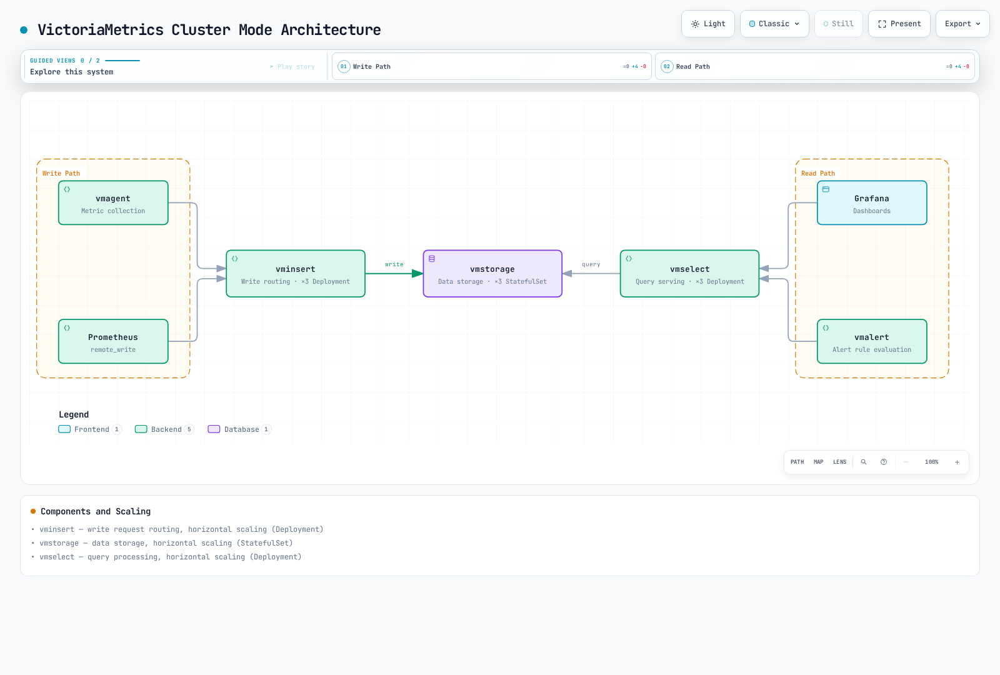

# VictoriaMetrics

> **Review baseline**: VictoriaMetrics 1.151.0 · stack chart 0.92.1
> **Last Updated**: September 12, 2026

## Table of Contents

- [Introduction](#introduction)
- [Architecture Options](#architecture-options)
- [Single-Node Mode](#single-node-mode)
- [Cluster Mode](#cluster-mode)
- [vmagent](#vmagent)
- [vmalert](#vmalert)
- [MetricsQL](#metricsql)
- [Helm Installation](#helm-installation)
- [Long-term Storage Configuration](#long-term-storage-configuration)
- [Downsampling](#downsampling)
- [Performance Optimization](#performance-optimization)
- [Best Practices](#best-practices)
- [Troubleshooting](#troubleshooting)

## Introduction

VictoriaMetrics stores and queries time series, with separate tools for collection (`vmagent`) and rule evaluation (`vmalert`). It accepts Prometheus remote write and provides Prometheus-compatible query endpoints. **MetricsQL intentionally differs from PromQL**, so migrations must compare real queries and data rather than assume identical results or support for every Prometheus API.

This chapter reviews VictoriaMetrics **1.151.0** and **victoria-metrics-k8s-stack 0.92.1**. Native tests use a tiny local dataset; manifests and charts are inspected/rendered. No live EKS deployment, cloud backup, load test, or failure-recovery test is claimed.

### Comparison and Measurement

| Dimension | What to compare |
|---|---|
| Deployment | Prometheus combines scraping, local TSDB and rules; VictoriaMetrics single-node storage/query and its optional agents can be deployed separately. Cluster mode splits insert/storage/select. |
| Compression and speed | Measure the same dataset, ingestion rate, churn, query range, cache state and hardware. There is no workload-independent 7× compression, 20× speed, or 70% saving guarantee. |
| Cardinality | Active series, churn, labels, query fan-out, RAM and disk determine capacity. Neither product has a universal 10M-versus-100M series boundary. |
| Retention | Prometheus's default retention is not its maximum. VictoriaMetrics retention is configurable but still consumes finite storage. |
| Query language | MetricsQL supports many familiar PromQL expressions, with documented differences in rate/increase, NaN, scalar and metric-name behavior. |
| Tenants and access | Cluster tenant IDs separate data namespaces. They do not authenticate callers; restrict access and use a reviewed authentication/authorization gateway such as vmauth. |
| Downsampling | Distinguish Enterprise storage downsampling, ingestion-time stream aggregation and recording additional derived series. |

Published benchmarks should keep their actual software versions, dataset and date. Unattributed comparison numbers are not a sizing basis.

## Architecture Options

| Requirement | Design decision |
|---|---|
| A workload fits one server and operational simplicity matters | Evaluate single-node mode first with measured capacity and recovery objectives. |
| Read/write/storage must scale separately or one-server limits are reached | Evaluate cluster mode and account for query fan-out, replication cost and operational complexity. |
| Survive failures | Design independent failure domains, redundant ingestion, query routing, durable storage and tested restoration. Two processes or a replicated disk alone do not establish service HA. |
| A known ingestion volume | Convert to samples/second, active series, churn, retention and query load; **100M samples/day is not a product mode-selection threshold**. |

Two independent single-node instances require deliberate write replication and query/failover handling. Do not point multiple `vmsingle` processes at one data directory as an HA shortcut.

## Single-Node Mode

A single storage/query process simplifies operations, but does not implement every collector, alerting and HA function. Capacity depends on the measured workload.

The raw manifests and Helm profile later are **alternative deployments**, not a sequence to apply together. They assume namespace `monitoring`, Linux EC2 workers and an existing `gp3` StorageClass/compatible EBS CSI setup with appropriate permissions and volume binding. EKS Auto Mode storage uses its own provisioner; do not assume the same class/driver on Auto Mode, Fargate, Windows or Hybrid Nodes. Resource numbers are illustrative. Restrict Pod endpoints to trusted clients; ClusterIP is not authentication.

### StatefulSet Deployment

```yaml
apiVersion: apps/v1
kind: StatefulSet
metadata:
  name: vmsingle
  namespace: monitoring
spec:
  serviceName: vmsingle
  replicas: 1
  selector:
    matchLabels:
      app: vmsingle
  template:
    metadata:
      labels:
        app: vmsingle
    spec:
      containers:
      - name: vmsingle
        image: victoriametrics/victoria-metrics:v1.151.0
        args:
        - --storageDataPath=/storage
        - --httpListenAddr=:8428
        - --retentionPeriod=1y
        - --search.latencyOffset=30s
        - --search.maxUniqueTimeseries=1000000
        - --search.maxSamplesPerQuery=1000000000
        - --memory.allowedPercent=60
        ports:
        - containerPort: 8428
          name: http
        resources:
          requests:
            cpu: 500m
            memory: 2Gi
          limits:
            cpu: 2000m
            memory: 8Gi
        volumeMounts:
        - name: storage
          mountPath: /storage
        livenessProbe:
          httpGet:
            path: /health
            port: 8428
          initialDelaySeconds: 30
          periodSeconds: 30
        readinessProbe:
          httpGet:
            path: /health
            port: 8428
          initialDelaySeconds: 5
          periodSeconds: 15
      securityContext:
        fsGroup: 65534
        runAsNonRoot: true
        runAsUser: 65534
  volumeClaimTemplates:
  - metadata:
      name: storage
    spec:
      accessModes:
      - ReadWriteOnce
      storageClassName: gp3
      resources:
        requests:
          storage: 100Gi
---
apiVersion: v1
kind: Service
metadata:
  name: vmsingle
  namespace: monitoring
spec:
  selector:
    app: vmsingle
  ports:
  - port: 8428
    targetPort: 8428
    name: http
  type: ClusterIP
```

### Key Endpoints

| Endpoint | Description |
|----------|-------------|
| `/api/v1/write` | Prometheus Remote Write |
| `/api/v1/query` | Instant query |
| `/api/v1/query_range` | Range query |
| `/api/v1/series` | Series metadata |
| `/api/v1/labels` | Label list |
| `/api/v1/label/{name}/values` | Label value list |
| `/vmui` | Built-in UI |
| `/metrics` | Self metrics |

## Cluster Mode

Scalable cluster configuration for large-scale environments.

### Architecture



[🔍 View interactive diagram](https://www.atomai.click/kubernetes-docs/archmaps/en-observability-metrics-02-victoriametrics-2.html)

### Components

| Component | Role | Scaling Method |
|-----------|------|----------------|
| **vminsert** | Write request routing | Horizontal scaling (Deployment) |
| **vmstorage** | Data storage | Horizontal scaling (StatefulSet) |
| **vmselect** | Query processing | Horizontal scaling (Deployment) |

The arrows show **requests**, not responses. The three replicas in this raw example are a topology choice, not a universal minimum or availability guarantee. Each storage member has a separate PVC; hard node anti-affinity requires at least three eligible Kubernetes nodes.

`vminsert -replicationFactor=2` requests two copies. Configure `vmselect` consistently only if all relevant data was actually written with that replication factor; increasing the flag does not backfill old data. `vmselect` can return partial responses when storage is unavailable. `-search.denyPartialResponse` rejects responses classified as partial; a claimed replication factor still affects that classification. Degraded writes, older unreplicated data and multiple failures require separate verification.

The `1ms` dedup setting handles replicated copies with the same timestamps and must agree between vmstorage and vmselect. HA scrapers at different times need a deliberate interval and identical identifying labels; a `30s` interval retains one sample per discrete window and can discard legitimate higher-resolution samples. This is not a compression switch. Adding vmstorage redistributes new writes, not all historical data.

### vmstorage Deployment

```yaml
apiVersion: apps/v1
kind: StatefulSet
metadata:
  name: vmstorage
  namespace: monitoring
spec:
  serviceName: vmstorage
  replicas: 3
  selector:
    matchLabels:
      app: vmstorage
  template:
    metadata:
      labels:
        app: vmstorage
    spec:
      containers:
      - name: vmstorage
        image: victoriametrics/vmstorage:v1.151.0-cluster
        args:
        - --storageDataPath=/storage
        - --httpListenAddr=:8482
        - --vminsertAddr=:8400
        - --vmselectAddr=:8401
        - --retentionPeriod=1y
        - --dedup.minScrapeInterval=1ms
        ports:
        - containerPort: 8482
          name: http
        - containerPort: 8400
          name: vminsert
        - containerPort: 8401
          name: vmselect
        resources:
          requests:
            cpu: 500m
            memory: 2Gi
          limits:
            cpu: 2000m
            memory: 8Gi
        volumeMounts:
        - name: storage
          mountPath: /storage
        livenessProbe:
          httpGet:
            path: /health
            port: 8482
          initialDelaySeconds: 30
          periodSeconds: 30
      affinity:
        podAntiAffinity:
          requiredDuringSchedulingIgnoredDuringExecution:
          - labelSelector:
              matchLabels:
                app: vmstorage
            topologyKey: kubernetes.io/hostname
  volumeClaimTemplates:
  - metadata:
      name: storage
    spec:
      accessModes:
      - ReadWriteOnce
      storageClassName: gp3
      resources:
        requests:
          storage: 100Gi
---
apiVersion: v1
kind: Service
metadata:
  name: vmstorage
  namespace: monitoring
spec:
  selector:
    app: vmstorage
  clusterIP: None
  ports:
  - port: 8482
    name: http
  - port: 8400
    name: vminsert
  - port: 8401
    name: vmselect
```

### vminsert Deployment

```yaml
apiVersion: apps/v1
kind: Deployment
metadata:
  name: vminsert
  namespace: monitoring
spec:
  replicas: 3
  selector:
    matchLabels:
      app: vminsert
  template:
    metadata:
      labels:
        app: vminsert
    spec:
      containers:
      - name: vminsert
        image: victoriametrics/vminsert:v1.151.0-cluster
        args:
          - "--httpListenAddr=:8480"
          - "--storageNode=vmstorage-0.vmstorage:8400"
          - "--storageNode=vmstorage-1.vmstorage:8400"
          - "--storageNode=vmstorage-2.vmstorage:8400"
          - "--replicationFactor=2"
        ports:
        - containerPort: 8480
          name: http
        resources:
          requests:
            cpu: 200m
            memory: 256Mi
          limits:
            cpu: 1000m
            memory: 1Gi
        livenessProbe:
          httpGet:
            path: /health
            port: 8480
          initialDelaySeconds: 10
          periodSeconds: 30
---
apiVersion: v1
kind: Service
metadata:
  name: vminsert
  namespace: monitoring
spec:
  selector:
    app: vminsert
  ports:
  - port: 8480
    targetPort: 8480
    name: http
  type: ClusterIP
```

### vmselect Deployment

```yaml
apiVersion: apps/v1
kind: Deployment
metadata:
  name: vmselect
  namespace: monitoring
spec:
  replicas: 3
  selector:
    matchLabels:
      app: vmselect
  template:
    metadata:
      labels:
        app: vmselect
    spec:
      containers:
      - name: vmselect
        image: victoriametrics/vmselect:v1.151.0-cluster
        args:
        - --httpListenAddr=:8481
        - --storageNode=vmstorage-0.vmstorage:8401
        - --storageNode=vmstorage-1.vmstorage:8401
        - --storageNode=vmstorage-2.vmstorage:8401
        - --search.maxUniqueTimeseries=1000000
        - --search.maxSamplesPerQuery=1000000000
        - --replicationFactor=2
        - --dedup.minScrapeInterval=1ms
        - --search.denyPartialResponse
        ports:
        - containerPort: 8481
          name: http
        resources:
          requests:
            cpu: 200m
            memory: 512Mi
          limits:
            cpu: 1000m
            memory: 2Gi
        livenessProbe:
          httpGet:
            path: /health
            port: 8481
          initialDelaySeconds: 10
          periodSeconds: 30
---
apiVersion: v1
kind: Service
metadata:
  name: vmselect
  namespace: monitoring
spec:
  selector:
    app: vmselect
  ports:
  - port: 8481
    targetPort: 8481
    name: http
  type: ClusterIP
```

## vmagent

vmagent is a lightweight agent for metric collection and forwarding.

### Key Features

- Compatible with Prometheus scrape configuration
- Supports multiple Remote Write targets
- Data buffering and retransmission
- Low resource usage
- Label rewriting and filtering

### Deployment

```yaml
apiVersion: apps/v1
kind: Deployment
metadata:
  name: vmagent
  namespace: monitoring
spec:
  replicas: 1
  selector:
    matchLabels:
      app: vmagent
  template:
    metadata:
      labels:
        app: vmagent
    spec:
      serviceAccountName: vmagent
      containers:
      - name: vmagent
        image: victoriametrics/vmagent:v1.151.0
        args:
        - --promscrape.config=/etc/vmagent/prometheus.yml
        - --remoteWrite.url=http://vminsert:8480/insert/0/prometheus/api/v1/write
        - --remoteWrite.tmpDataPath=/tmp/vmagent-remotewrite-data
        - --remoteWrite.maxDiskUsagePerURL=1GB
        ports:
        - containerPort: 8429
          name: http
        resources:
          requests:
            cpu: 100m
            memory: 256Mi
          limits:
            cpu: 500m
            memory: 1Gi
        volumeMounts:
        - name: config
          mountPath: /etc/vmagent
        - name: tmpdata
          mountPath: /tmp/vmagent-remotewrite-data
      volumes:
      - name: config
        configMap:
          name: vmagent-config
      - name: tmpdata
        emptyDir:
          sizeLimit: 2Gi
---
apiVersion: v1
kind: ConfigMap
metadata:
  name: vmagent-config
  namespace: monitoring
data:
  prometheus.yml: "global:\n  scrape_interval: 30s\n  scrape_timeout: 10s\nscrape_configs:\n- job_name: kubernetes-pods\n  kubernetes_sd_configs:\n  - role: pod\n    namespaces:\n      names:\n      - example-app\n  relabel_configs:\n  - source_labels:\n    - __meta_kubernetes_pod_phase\n    action: keep\n    regex: Running\n  - source_labels:\n    - __meta_kubernetes_pod_container_port_protocol\n    action: keep\n    regex: TCP\n  - source_labels:\n    - __meta_kubernetes_pod_container_port_name\n    action: keep\n    regex: metrics\n  - source_labels:\n    - __meta_kubernetes_pod_annotation_prometheus_io_scrape\n    action: keep\n    regex: 'true'\n  - source_labels:\n    - __meta_kubernetes_pod_annotation_prometheus_io_path\n    action: replace\n    regex: (/.*)\n    target_label: __metrics_path__\n  - source_labels:\n    - __meta_kubernetes_namespace\n    target_label: namespace\n  - source_labels:\n    - __meta_kubernetes_pod_name\n    target_label: pod\n"
---
apiVersion: v1
kind: ServiceAccount
metadata:
  name: vmagent
  namespace: monitoring
---
apiVersion: rbac.authorization.k8s.io/v1
kind: Role
metadata:
  name: vmagent-pod-discovery
  namespace: example-app
rules:
- apiGroups:
  - ''
  resources:
  - pods
  verbs:
  - get
  - list
  - watch
---
apiVersion: rbac.authorization.k8s.io/v1
kind: RoleBinding
metadata:
  name: vmagent-pod-discovery
  namespace: example-app
roleRef:
  apiGroup: rbac.authorization.k8s.io
  kind: Role
  name: vmagent-pod-discovery
subjects:
- kind: ServiceAccount
  name: vmagent
  namespace: monitoring
```

This minimal agent scrapes only Running Pods in the existing `example-app` namespace with a TCP port named `metrics` and `prometheus.io/scrape: "true"`. Discovery supplies the IPv4/IPv6 address; no colon-splitting rewrite is used. Its namespace Role only lists Pods. Node/kubelet scraping needs separate scoped RBAC and validated serving certificates; do not disable TLS checks or grant `nodes/proxy` just to make a sample work.

The optional `prometheus.io/path` annotation is used when it starts with `/`; otherwise the scrape path stays `/metrics`.

The demo queue is an `emptyDir`: it survives container restart in the same Pod, **not Pod deletion/replacement**. Reaching `remoteWrite.maxDiskUsagePerURL` drops the oldest queued data. For durable buffering use a reviewed persistent volume/StatefulSet or operator configuration, size each URL queue and monitor retries, drops and free space. A queue is not a backup or lossless-delivery guarantee.

### vmagent Sharding

Every member needs the same discovery/relabel configuration and a distinct stable ordinal from `0` to `membersCount-1`. A StatefulSet name ending in that ordinal, such as `vmagent-0`, is also accepted. **A Deployment's random Pod name is not a stable shard number.** The one-replica manifest above intentionally has no sharding flags. The following is an argument reference, not a second deployable workload. Scrape replication and storage replication are different; duplicate scrape streams require compatible deduplication.

```yaml
args:
  - "--promscrape.cluster.membersCount=3"    # Total number of vmagents
  - "--promscrape.cluster.memberNum=0"       # Current instance number (0, 1, 2)
  - "--promscrape.cluster.replicationFactor=2"  # How many instances scrape each target
```

## vmalert

vmalert is a component that evaluates alerting rules and generates alerts.

### Deployment

```yaml
apiVersion: apps/v1
kind: Deployment
metadata:
  name: vmalert
  namespace: monitoring
spec:
  replicas: 1
  selector:
    matchLabels:
      app: vmalert
  template:
    metadata:
      labels:
        app: vmalert
    spec:
      containers:
      - name: vmalert
        image: victoriametrics/vmalert:v1.151.0
        args:
        - --datasource.url=http://vmselect:8481/select/0/prometheus
        - --remoteRead.url=http://vmselect:8481/select/0/prometheus
        - --remoteWrite.url=http://vminsert:8480/insert/0/prometheus
        - --notifier.url=http://alertmanager:9093
        - --rule=/etc/vmalert/rules/*.yaml
        - --evaluationInterval=30s
        - --external.url=http://vmalert:8880
        - --external.label=cluster=production
        ports:
        - containerPort: 8880
          name: http
        resources:
          requests:
            cpu: 100m
            memory: 128Mi
          limits:
            cpu: 500m
            memory: 512Mi
        volumeMounts:
        - name: rules
          mountPath: /etc/vmalert/rules
        livenessProbe:
          httpGet:
            path: /health
            port: 8880
          initialDelaySeconds: 10
          periodSeconds: 30
      volumes:
      - name: rules
        configMap:
          name: vmalert-rules
---
apiVersion: v1
kind: ConfigMap
metadata:
  name: vmalert-rules
  namespace: monitoring
data:
  kubernetes.yaml: "groups:\n- name: kubernetes\n  interval: 30s\n  rules:\n  - alert: NodeMemoryHigh\n    expr: '(node_memory_MemTotal_bytes - node_memory_MemAvailable_bytes)\n\n      / node_memory_MemTotal_bytes * 100 > 90\n\n      '\n    for: 5m\n    labels:\n      severity: warning\n    annotations:\n      summary: High memory usage on {{ $labels.instance }}\n      description: Memory usage is {{ printf \"%.2f\" $value }}%\n  - alert: PodRestartsHigh\n    expr: increase(kube_pod_container_status_restarts_total[1h]) > 5\n    for: 10m\n    labels:\n      severity: warning\n    annotations:\n      summary: 'Frequent restarts: {{ $labels.namespace }}/{{ $labels.pod }}'\n      description: Pod has restarted {{ $value }} times in the last hour\n- name: recording-rules\n  interval: 30s\n  rules:\n  - record: instance:node_cpu_utilization:ratio_rate5m\n    expr: 1 - avg by (instance) (rate(node_cpu_seconds_total{mode=\"idle\"}[5m]))\n  - record: instance:node_memory_utilization:ratio\n    expr:\
    \ '1 - node_memory_MemAvailable_bytes / node_memory_MemTotal_bytes\n\n      '\n"
```

The rules assume node-exporter and kube-state-metrics are already scraped; the minimal application-Pod discovery above does not install them. A restart count is not proof of `CrashLoopBackOff`, so the alert is named `PodRestartsHigh`. CPU recording uses a counter rate and stores a ratio, not a raw cumulative counter average.

`datasource.url` and `remoteRead.url` use the query API base; `remoteWrite.url` uses the write base to persist recording/alert-state series. The flag named remoteRead is not a claim that every Prometheus Remote Read protocol is implemented. Alertmanager must exist and be reachable; notification routing is separate. For evaluator HA review external labels, notification deduplication and restoration of alert state.

## MetricsQL

MetricsQL supports familiar PromQL syntax but has intentional semantic differences: `rate`/`increase` can consider the raw sample before the lookbehind window and do not use Prometheus's extrapolation in the same way; NaN points are removed; scalar/instant-vector and metric-name handling can differ. Compare dashboards, alert expressions and recording rules with known input data when migrating. Do not infer full Prometheus API compatibility from query-language compatibility.

### PromQL-style Queries

```promql
rate(http_requests_total[5m])
sum by (service) (rate(http_requests_total[5m]))
histogram_quantile(0.95, sum by (service, le) (rate(http_request_duration_seconds_bucket[5m])))
```

Aggregate histogram rates by the desired identity **and `le`**, then calculate the quantile. A quantile of separately calculated quantiles is not a global request quantile.

### MetricsQL Extensions

The following function examples use `audit_gauge` as a small synthetic gauge, not an automatically available exporter metric.

```promql
rate(http_requests_total)
keep_last_value(up)
missing_metric default 0
label_set(up, "env", "demo")
label_del(up, "instance")
label_copy(up, "instance", "node")
label_move(up, "instance", "node")
label_join(up, "dst", "-", "job", "instance")
label_transform(up, "job", "api", "frontend")
union(up{job="api"}, up{job="web"})
lag(audit_gauge[2m])
lifetime(audit_gauge[2m])
scrape_interval(audit_gauge[2m])
range_avg(audit_gauge)
range_max(audit_gauge)
range_min(audit_gauge)
range_sum(audit_gauge)
range_first(audit_gauge)
range_last(audit_gauge)
rollup(audit_gauge[2m])
rollup_rate(http_requests_total[5m])
rollup_delta(audit_gauge[2m])
zscore_over_time(audit_gauge[2m])
```

| Function or operator | Actual meaning and boundary |
|---|---|
| `rate(metric)` | Omitting the window derives it from query step and observed scrape interval. Use an explicit window for reproducible rules. |
| `keep_last_value(q)` | Fills gaps in evaluated points with an earlier value. It can hide missing scrapes; do not use it to make an availability alert look healthy. |
| `q1 default q2` | Fills missing points from the corresponding right-hand expression. It does not prove that missing data means zero, create the intended service labels in every case, or make zero-traffic ratios meaningful. |
| `label_set/copy/move/join/transform` | Modify labels of the query result. They do not rewrite stored history. The regex example changes a job label and does not split IPv6 addresses. |
| `label_del` | Removes identifying labels; check for colliding output series and use an explicit aggregation when combining identities. |
| `union` | Combines query results; it is not numeric addition. |
| `lag(metric[2m])` | Seconds between the most recent raw sample in that window and the evaluation timestamp; not the interval between two samples. |
| `lifetime(metric[2m])` | Seconds between first and last raw samples **inside that window**, not the series's entire stored lifetime. |
| `scrape_interval(metric[2m])` | Estimates spacing from raw samples in that window; it does not read scrape configuration. |
| `range_avg/max/min/sum/first/last(q)` | Operate across the evaluated points of each result series in the selected query range. Step/resolution affects those points; they are not aggregations over all stored history. |
| `rollup`, `rollup_rate`, `rollup_delta` | Return multiple rollup variants (for example min/max/avg); account for the added `rollup` label and metric type. |
| `zscore_over_time` | Statistical z-score for a gauge's window, not a calibrated anomaly probability or a value constrained to 0–1. `anomaly_score` is not a supported 1.151.0 function. |

### Error Rates, Missing Data and Histograms

First remove the `status` dimension consistently. The numerator falls back to zero **only for services with a denominator series**, and the denominator filters out zero traffic:

```promql
(sum by (service) (rate(http_requests_total{status=~"5.."}[5m])) or 0 * sum by (service) (rate(http_requests_total[5m]))) / (sum by (service) (rate(http_requests_total[5m])) > 0)
```

This fixture groups by `service`. If cluster or namespace is part of the service identity, include those labels consistently in every numerator and denominator aggregation.

The native fixture gives healthy/no-5xx = **0**, all-5xx = **1**, and 10% failures = **0.1**. Zero-traffic and absent services yield no value; monitor traffic and missing telemetry separately. Dividing status-labelled series without aggregation can match the 5xx numerator only to the same 5xx denominator, producing 1 instead of the true service error rate. Appending `default 0` is not a substitute for these cases.

```promql
histogram_share(0.5, sum by (service, le) (rate(http_request_duration_seconds_bucket[5m])))
count(up)
count by (job) (up)
```

`histogram_share` above estimates the share of requests at or below 500 ms during the recent window. Raw cumulative buckets instead describe accumulation since counter resets. `count(up)` counts selected `up` series, not the database's total cardinality. Use scoped TSDB/cardinality diagnostics for that purpose.

## Helm Installation

The operator-based **victoria-metrics-k8s-stack 0.92.1** uses `vmsingle`, `vmcluster`, `vmagent` and `vmalert` at the root. Values for the separate `victoria-metrics-single` or `victoria-metrics-cluster` charts do not configure this stack. Helm can accept unused keys, so inspect the rendered custom resources.

The pinned archive contains operator chart **0.67.3 / operator 0.74.1** and configures VictoriaMetrics **1.151.0**. Its Kubernetes `>=1.25.0-0` chart guard is not a complete product/EKS support matrix. `--kube-version 1.35.0` below is a rendering input, not an API-server test. Check your supported EKS version, CSI provisioner and existing operator/CRD ownership before installation.

```bash
helm repo add vm https://victoriametrics.github.io/helm-charts/
helm repo update vm
helm pull vm/victoria-metrics-k8s-stack --version 0.92.1 --untar --untardir ./vendor
helm template vm-demo ./vendor/victoria-metrics-k8s-stack \
  --namespace monitoring --kube-version 1.35.0 --include-crds \
  -f values-single.yaml > rendered.yaml
```

### values-single.yaml

This starter profile enables the store and a one-replica agent that selects release-labelled `VMServiceScrape` objects. It deliberately leaves unrelated collectors, default rules, Grafana and notification services disabled until their targets, permissions and credentials are configured. It is not a complete cluster-monitoring or production-HA profile. `gp3` must exist with compatible storage provisioning; resource sizes are examples.

```yaml
fullnameOverride: vm-demo
victoria-metrics-operator:
  crds:
    cleanup:
      enabled: false
  operator:
    disable_prometheus_converter: true
grafana:
  enabled: false
defaultDashboards:
  enabled: false
defaultRules:
  enabled: false
alertmanager:
  enabled: false
vmalert:
  enabled: false
vmsingle:
  enabled: true
  spec:
    retentionPeriod: 90d
    storage:
      storageClassName: gp3
      accessModes:
      - ReadWriteOnce
      resources:
        requests:
          storage: 100Gi
    resources:
      requests:
        cpu: 500m
        memory: 2Gi
      limits:
        cpu: '2'
        memory: 8Gi
vmcluster:
  enabled: false
vmagent:
  enabled: true
  spec:
    replicaCount: 1
    selectAllByDefault: false
    serviceScrapeSelector:
      matchLabels:
        app.kubernetes.io/instance: vm-demo
    resources:
      requests:
        cpu: 100m
        memory: 256Mi
      limits:
        cpu: 500m
        memory: 1Gi
prometheus-node-exporter:
  enabled: false
kube-state-metrics:
  enabled: false
kubelet:
  enabled: false
kubeApiServer:
  enabled: false
kubeControllerManager:
  enabled: false
kubeDns:
  enabled: false
coreDns:
  enabled: false
kubeEtcd:
  enabled: false
kubeScheduler:
  enabled: false
kubeProxy:
  enabled: false
```

`serviceScrapeSelector` selects **VMServiceScrape metadata**. The scrape resource then selects Services/endpoints; it is not a selector for application Pods directly. Keep namespace selection and agent RBAC consistent. For node/kubelet/control-plane metrics on EKS, enable only the endpoints available for the chosen platform and validate TLS. Managed control-plane endpoints, Auto Mode, Fargate and Windows do not all expose the same targets.

Use one owner for operator/CRDs. The profile disables the chart's CRD cleanup hook and Prometheus-resource conversion; it does not make arbitrary deletion of CRDs safe. If reusing a separately managed operator, configure the chart for that ownership instead of installing a competing controller. Review CRD upgrades separately from Helm release upgrades.

After reviewing the context, rendered objects, permissions and existing resources, installation uses the same pin and values:

```bash
helm upgrade --install vm-demo vm/victoria-metrics-k8s-stack \
  --version 0.92.1 --namespace monitoring --create-namespace \
  -f values-single.yaml
```

### Cluster Overlay

For a **new, separate cluster-mode deployment**, layer this over the starter profile. Do not flip an existing single-node release to cluster mode as a data migration: disabling its CR can remove the running store, while its PVC/history is not copied into the cluster automatically.

```yaml
vmsingle:
  enabled: false
vmcluster:
  enabled: true
  spec:
    retentionPeriod: 90d
    replicationFactor: 2
    vmstorage:
      replicaCount: 3
      extraArgs:
        dedup.minScrapeInterval: 1ms
      storage:
        volumeClaimTemplate:
          spec:
            storageClassName: gp3
            accessModes:
            - ReadWriteOnce
            resources:
              requests:
                storage: 100Gi
      resources:
        requests:
          cpu: 500m
          memory: 2Gi
        limits:
          cpu: '2'
          memory: 8Gi
    vmselect:
      replicaCount: 2
      extraArgs:
        dedup.minScrapeInterval: 1ms
        search.denyPartialResponse: 'true'
      resources:
        requests:
          cpu: 200m
          memory: 512Mi
        limits:
          cpu: '1'
          memory: 2Gi
      storage:
        volumeClaimTemplate:
          spec:
            storageClassName: gp3
            accessModes:
            - ReadWriteOnce
            resources:
              requests:
                storage: 2Gi
    vminsert:
      replicaCount: 2
      resources:
        requests:
          cpu: 200m
          memory: 256Mi
        limits:
          cpu: '1'
          memory: 1Gi
```

Render with `-f values-single.yaml -f values-cluster.yaml`. The native check confirmed a VMCluster, replication factor 2, three storage replicas, matching 1ms dedup settings and the cluster tenant-0 write URL. Operator reconciliation, PVC binding, failure-domain placement and actual availability still require a live test. Three storage members meet the `2*N-1` count needed to retain N=2 copies while one member is unavailable, provided the other prerequisites hold.

Grafana can use the Prometheus datasource pointed at the single-node base or `http://vmselect:8481/select/0/prometheus` for the raw cluster. Configure authentication, persistence and datasource access before enabling the optional Grafana chart. Configure vmalert rules, Alertmanager routing/receivers and exporter targets together; merely enabling replicas does not establish alert delivery.

## Long-term Storage Configuration

### Retention and Disk Capacity

Choose **one** retention argument, not several duplicate `args` mappings or competing flags:

```yaml
args:
  - "--retentionPeriod=90d"
```

In 1.151.0 the default is one month (31 days) and the minimum is one day. A bare number is in months; an explicit unit makes intent clear. Retention does not cap storage bytes, and lowering it does not promise immediate space reclamation. There is no supported `storage.maxDiskSpace` flag in the reviewed binary. `storage.minFreeDiskSpaceBytes` stops accepting new data below a free-space threshold; it does not evict data to maintain a size-based retention target. Leave room for merges, snapshots and temporary workload spikes.

### Snapshot Backup and Restore

`vmbackup` reads a consistent snapshot from the **same storage directory** as the single-node/vmstorage process. It supports S3, GCS, Azure Blob, S3-compatible and local filesystem destinations. The local snapshot alone is not an independent backup; protect remote copies, credentials and restoration procedures.

The raw StatefulSet above produces PVC **`storage-vmsingle-0`** (`claim-template` + `StatefulSet` + ordinal), not `vmsingle-storage-vmsingle-0`. Operator-created names differ: inspect the actual Pod volumes/PVCs. A random CronJob cannot be assumed to attach an EBS RWO volume on another node or read the snapshot created by a different Pod. Prefer a reviewed co-located backup sidecar/workflow, and point the snapshot URL to that exact storage process.

```bash
# Run only in the reviewed backup container with this storage directory mounted.
vmbackup -storageDataPath=/storage \
  -snapshot.createURL=http://127.0.0.1:8428/snapshot/create \
  -dst=s3://example-vm-backup/cluster-a/vmsingle-0/2026-09-12
```

The bucket/prefix above is a placeholder and the command creates storage snapshots and writes backup objects; it was **not executed against AWS**. Avoid concurrent writers to one destination. Reusing a destination performs incremental synchronization, not an immutable historical backup by itself; define versioned destinations/retention and test recovery. In cluster mode back up **every vmstorage member to a distinct prefix**, not vminsert/vmselect or a load-balanced random member. Restore with the compatible `vmrestore` workflow into reviewed storage while the target database process is stopped.

Use a least-privilege workload identity for the actual backup container and bucket/prefix; configure its AWS Region, TLS and network route as well. The reviewed source uses AWS SDK for Go v2's default configuration chain; EKS Pod Identity additionally needs its Agent/association and supported Linux EC2 platform, while IRSA is another supported integration path. Neither a ServiceAccount name nor S3 networking alone grants access. Check required read/write/list/delete or KMS operations against the chosen backup/retention workflow. Do not inject static AWS access keys into the chart, CronJob or image.

## Downsampling

Enterprise storage downsampling and OSS **recording additional derived series** are not the same operation. Recording rules do not remove or compact raw data and can increase stored series. Ingestion-time stream aggregation is another option, with explicit grouping, reset and keep/drop-input semantics; evaluate those before discarding raw samples.

### Recording Derived Series

Use this group **instead of** the earlier recording group when choosing five-minute output intervals; do not activate both with the same record names.

CPU seconds are counters, so calculate an idle **rate**, then derive utilization. The one-hour expression below averages the recorded five-minute ratio observations. Keep histogram quantiles in separate series; combining same-label p50/p90/p99 expressions with `or` retains the first matching series and loses the others.

```yaml
groups:
- name: derived-series
  interval: 5m
  rules:
  - record: instance:node_cpu_utilization:ratio_rate5m
    expr: 1 - avg by (instance) (rate(node_cpu_seconds_total{mode="idle"}[5m]))
  - record: instance:node_cpu_utilization:ratio_avg1h
    expr: avg_over_time(instance:node_cpu_utilization:ratio_rate5m[1h])
  - record: service:http_request_duration_seconds:p50_5m
    expr: histogram_quantile(0.5, sum by (service, le) (rate(http_request_duration_seconds_bucket[5m])))
  - record: service:http_request_duration_seconds:p90_5m
    expr: histogram_quantile(0.9, sum by (service, le) (rate(http_request_duration_seconds_bucket[5m])))
  - record: service:http_request_duration_seconds:p99_5m
    expr: histogram_quantile(0.99, sum by (service, le) (rate(http_request_duration_seconds_bucket[5m])))
```

These p50/p90/p99 values are derived gauges and cannot reconstruct the original histogram or a correct quantile across arbitrary longer windows. Preserve rate/count/bucket information if later aggregation is required. Alert thresholds, record intervals, missing inputs and query semantics need tests before adoption.

## Performance Optimization

| Control | What it actually bounds |
|---|---|
| `memory.allowedPercent` / `memory.allowedBytes` | Internal caches, **not total process RSS**; query/ingestion/Go/OS memory needs additional headroom. |
| `search.maxMemoryPerQuery` | One query; account for concurrent requests and other allocations. |
| `search.maxUniqueTimeseries`, `search.maxSamplesPerQuery` | Reject unexpectedly large queries; they do not reduce ingestion cardinality. |
| `search.maxQueryDuration`, `search.maxPointsPerTimeseries` | Query time/output bounds. A larger range step changes evaluation resolution, not the original stored samples. |
| `storage.cacheSizeIndexDBDataBlocks`, `storage.cacheSizeIndexDBIndexBlocks` | Advanced cache overrides. Measure cache misses, CPU and disk I/O before overriding automatic sizing. |
| `maxLabelsPerTimeseries`, `maxLabelValueLen` | The reviewed version rejects series exceeding limits and increments `vm_rows_ignored_total`; these are not harmless label truncation. |
| `dedup.minScrapeInterval` | Retains one point per discrete interval of the same label set; choose deliberately for replication/scraper cadence, not as generic compression. |

Measure active series and churn, query fan-out, retention, queue growth, cache pressure and free disk. A fixed resource example or one benchmark does not establish a safe production capacity. Protect administrative and query endpoints with network and application access controls.

## Best Practices

Choose failure and recovery objectives before replica counts. Separate collector HA, storage replication, query availability and backups. Keep tenant routing/authentication, TLS, workload identity, PVC ownership and upgrade/migration responsibilities explicit. Monitor insert failures, rejected rows, queue drops, slow queries, memory and disk; discover the labels actually exposed by each component's `/metrics` endpoint before writing rules.

The local 1.151.0 `/metrics` endpoint exposed these metric names. After scraping it, use the actual job/instance labels to scope queries:

```promql
vm_app_version
rate(vm_rows_inserted_total[5m])
rate(vm_slow_queries_total[5m])
process_resident_memory_bytes
```

### Migration Guide

1. Keep the current scraper and add a reviewed VictoriaMetrics remote-write target; validate queue health and data arrival.
2. Run Grafana queries and alert rules against both stores with known inputs, including missing/zero traffic, counter resets and histogram aggregation.
3. If importing history, create and preserve a consistent Prometheus snapshot. Run the separately supplied `vmctl` against the intended destination and account for retention, overlap/dedup, rate limits and permissions.
4. Retire the old write path only after the replacement scraper/agent is collecting all targets and its data is present. **Changing Grafana's datasource does not replace metric collection.** Keep a rollback window and backup ownership.

```yaml
remote_write:
  - url: http://vmsingle.monitoring.svc:8428/api/v1/write
```

```bash
vmctl prometheus --prom-snapshot=/backup/prometheus-snapshot \
  --vm-addr=http://vmsingle.monitoring.svc:8428
```

These are configuration/command references, not a migration executed in this audit. The URL names above refer to the raw single-node manifest; use the actual generated Services for the Helm profile. Cluster import/write/query paths differ from the single-node paths. For `vmctl`, supply the vminsert base through `--vm-addr` and the intended tenant through `--vm-account-id`; do not substitute the remote-write URL for the importer base.

## Troubleshooting

Use a known single-node Service and a local port-forward for read-only diagnostics; replace the Service name for the operator/Helm deployment:

```bash
kubectl port-forward -n monitoring svc/vmsingle 8428:8428
```

```bash
curl --fail --silent --show-error http://127.0.0.1:8428/api/v1/status/tsdb
curl --fail --silent --show-error http://127.0.0.1:8428/api/v1/status/active_queries
curl --fail --silent --show-error http://127.0.0.1:8428/api/v1/status/top_queries
curl --fail --silent --show-error http://127.0.0.1:8428/metrics
```

TSDB status describes series/cardinality, **not filesystem free bytes or a complete memory profile**. Check process/container memory, PVC/filesystem metrics, queue size and storage health separately. Active/top-query endpoints describe requests and may require profiling flags or elapsed collection time to provide useful results. Query filters, range, step and concurrency can materially affect cost.

A full disk needs a storage/retention/ingestion plan, not a blanket deletion command. `delete_series`, `/snapshot/create` and `/internal/force_merge` are mutating administrative operations. Deletion requires a valid, narrowly reviewed selector and backup/retention approval; snapshots can retain disk blocks, and force-merge consumes I/O and needs working space. They are intentionally not included in a copy-paste read-only diagnostic block. Stopping ingress under storage pressure can overflow finite collector queues, so inspect the whole data path.

## References

- [VictoriaMetrics 1.151.0](https://github.com/VictoriaMetrics/VictoriaMetrics/releases/tag/v1.151.0)
- [Single-node](https://docs.victoriametrics.com/victoriametrics/single-server-victoriametrics/)
- [Cluster / replication](https://docs.victoriametrics.com/victoriametrics/cluster-victoriametrics/)
- [MetricsQL](https://docs.victoriametrics.com/victoriametrics/metricsql/)
- [vmagent](https://docs.victoriametrics.com/victoriametrics/vmagent/)
- [vmalert](https://docs.victoriametrics.com/victoriametrics/vmalert/)
- [vmbackup](https://docs.victoriametrics.com/victoriametrics/vmbackup/)
- [Prometheus snapshot migration](https://docs.victoriametrics.com/victoriametrics/vmctl/prometheus/)
- [Stream aggregation](https://docs.victoriametrics.com/victoriametrics/stream-aggregation/)
- [Stack0.92.1 values](https://raw.githubusercontent.com/VictoriaMetrics/helm-charts/victoria-metrics-k8s-stack-0.92.1/charts/victoria-metrics-k8s-stack/values.yaml)
- [VMServiceScrape](https://docs.victoriametrics.com/operator/resources/vmservicescrape/)
- [EKS EBS CSI](https://docs.aws.amazon.com/eks/latest/userguide/ebs-csi.html)
- [Pod Identity SDK requirements](https://docs.aws.amazon.com/eks/latest/userguide/pod-id-minimum-sdk.html)
- [Backup S3 implementation](https://github.com/VictoriaMetrics/VictoriaMetrics/blob/v1.151.0/lib/backup/s3remote/s3.go)

## Quiz

[VictoriaMetrics Quiz](../../quizzes/observability/metrics/02-victoriametrics-quiz.md)
