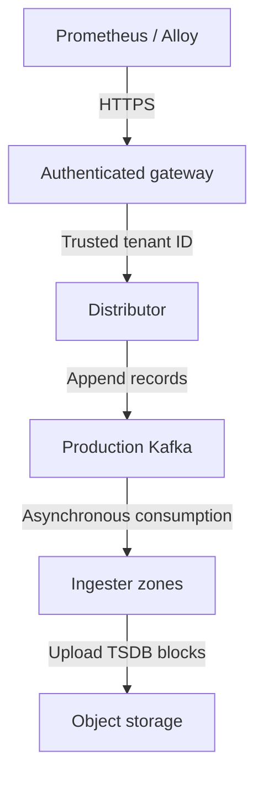
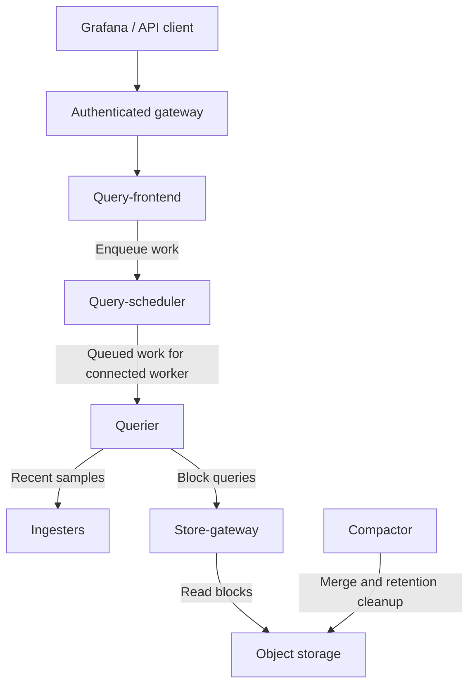

# Grafana Mimir

> **Review baseline**: Mimir 3.2.1 / mimir-distributed Helm chart 6.2.0
> **Last updated**: September 12, 2026

Grafana Mimir is a Prometheus-compatible metrics backend with tenant-aware ingestion, querying and long-term block storage. Capacity, query compatibility and operating cost depend on the selected architecture, configuration and workload; neither retention nor scaling is unlimited.

## Mimir, Cortex and Thanos

Mimir and Cortex are separate projects with related origins. Do not interpret Mimir as a notice that Cortex is unavailable. Thanos supports both sidecars and a remote-write Receiver; a sidecar is not mandatory for every Thanos deployment.

| Project | Deployment choices to compare |
| --- | --- |
| Mimir | Tenant-aware remote write, object storage and the current Kafka-based ingest-storage architecture |
| Cortex | A separate Prometheus-compatible multi-tenant backend; check its own release and storage configuration |
| Thanos | Sidecar-based integration or Receive-based ingestion, shared querying and object-storage components |

Compare failure recovery, actual query behavior, storage/request/transfer cost and team capacity using the same workload. Unsupported “fast/medium” rankings are not benchmark evidence. See [Cortex](https://cortexmetrics.io/docs/) and [Thanos Receive](https://thanos.io/tip/components/receive.md/).

## Core architecture

### Ingest storage and the classic write path

Since Mimir 3.0, ingest storage is stable and the preferred architecture. Distributors validate incoming samples and append records to Kafka. A successful write is acknowledged after the Kafka write succeeds under the configured durability/replication conditions; it does not mean that a block has already reached S3.



Each ingester consumes one partition; ingesters in different zones can consume the same partition for read-path availability. Partition assignment depends on the numeric suffix of the ingester instance ID. Kafka partition capacity and retention must cover the planned ingester ordinals, backlog and recovery window. Broker replication/ISR, persistence and failure recovery require their own configuration.

Ingesters keep an in-memory TSDB and local WAL, periodically create blocks (two-hour ranges by default), and upload them. Their local TSDB retention gives queriers/store-gateways time to discover uploaded blocks; it is different from long-term retention. Persistent disks aid recovery, but no combination of WAL and object storage guarantees recovery from every failure or an expired Kafka backlog.

The **classic** architecture sends writes directly from distributors to an ingester quorum. Its ingester replication factor is not the Kafka write-replication setting. Classic mode remains available for existing deployments; the binary defaults and Helm defaults are different. Chart 6.x enables ingest storage, while the inspected 3.2.1 binary's `ingest_storage.enabled` default is false. Follow the [architecture](https://grafana.com/docs/mimir/latest/get-started/about-grafana-mimir-architecture/about-ingest-storage-architecture/) and [migration procedure](https://grafana.com/docs/mimir/latest/set-up/migrate/migrate-ingest-storage/) rather than switching a live installation with one flag.

### Query path and components



This diagram shows request/work relationships; query results return through the frontend. The frontend splits/shards work, uses result caches and combines responses. The scheduler queues work for queriers. Queriers fetch the needed data from ingesters and store-gateways, including overlap during block handoff; these are not two perfectly disjoint recent/historical time partitions.

Kafka consumption is asynchronous, so the default read path does not promise read-after-write consistency. A client can request `X-Read-Consistency: strong`; ingesters then wait for the propagated partition offsets, with timeout and latency implications. This is not a guarantee during every broker or ingester failure.

| Component | Responsibility |
| --- | --- |
| Distributor | Validate/limit incoming writes and send them to Kafka, or to ingesters in classic mode |
| Ingester | Consume its Kafka partition, maintain local TSDB/WAL, serve recent samples and upload blocks |
| Store-gateway | Serve block data using object storage, local index headers and configured caches |
| Compactor | Merge blocks, deduplicate replicated samples and perform eligible retention cleanup |
| Query-frontend / scheduler / querier | Plan/cache/queue queries and execute the resulting work |
| Ruler / Alertmanager | Optional rule evaluation and alert handling; storage/identity/HA need separate configuration |

Compaction does not provide the invented `compactor.downsampling_enabled` option. Recording rules can create derived series, but do not downsample or remove the original raw series automatically.

## Multi-tenancy and authentication

`X-Scope-OrgID` identifies a tenant; it is **not authentication**. Use a gateway that authenticates the caller, authorizes its tenant, overwrites any untrusted tenant header and forwards only allowed requests. Restrict direct access to backend services. Basic-auth usernames become tenant IDs only if a trusted proxy explicitly implements that mapping. The chart's default routing gateway alone does not establish this policy.

This Prometheus example assumes that such an HTTPS gateway and a mounted credential file already exist. The gateway derives the tenant from the authenticated identity, so the client does not choose a tenant header here.

```yaml
remote_write:
  - url: https://metrics.example.internal/api/v1/push
    authorization:
      type: Bearer
      credentials_file: /etc/prometheus/credentials/mimir-token
```

A directly supplied tenant header is suitable only for a separately trusted test path. Tenant-separated object keys and limits do not stop an unauthenticated caller from selecting another tenant. Disabling multi-tenancy maps requests to a shared tenant; it does not add protection. See [authentication and authorization](https://grafana.com/docs/mimir/latest/manage/secure/authentication-and-authorization/).

### Tenant limits and runtime configuration

Main configuration uses `limits` for defaults. Per-tenant `overrides` belong in a separate runtime configuration file, not a top-level block in the main Mimir configuration. With this chart, use top-level `runtimeConfig.overrides`, as in the example below. Runtime files can override supported limits without restarting the process; this does not make every startup setting reloadable. Validate [runtime configuration](https://grafana.com/docs/mimir/latest/configure/about-runtime-configuration/) access and reload results.

## Helm configuration on EKS

Chart **6.2.0** declares appVersion **3.2.0** and Kubernetes `^1.32.0-0`. This example explicitly selects the **3.2.1** patch image, released September 10, 2026. The chart constraint is not an EKS support/lifecycle matrix. Check the selected EKS version, CSI driver, admission policy and rollout-operator dependencies; weekly development charts are a separate release stream.

### Prepare dependencies

The following is a **renderable configuration for review**, not a production deployment test. Before applying it, prepare:

- An external production Kafka cluster/topic that accepts the shown client-certificate authentication, appropriate broker replication/retention and authorized producer/consumer operations. Replace the example bootstrap address/port with the actual endpoint. Other SASL/MSK configurations require the matching Mimir options and identity setup.
- Secret `mimir-kafka-client-tls` in `monitoring`, containing `ca.crt`, `tls.crt` and `tls.key`. Every Mimir process loading this shared TLS configuration needs these files, including components that do not themselves consume Kafka.
- Three existing S3 buckets and an authorized `mimir-storage` service account described below. Mimir does not create these buckets.
- The real AZ labels, a suitable existing StorageClass and enough schedulable nodes/PVC capacity. `gp3` is an example class name. EKS Auto Mode and the EBS CSI add-on use different provisioners; select the class matching the cluster's storage owner.
- Authenticated external routing to the distributor and query-frontend. The example disables the unauthenticated chart routing gateway and creates no replacement public ingress.

The rollout operator is enabled. Its CRDs, webhooks, permissions and ownership must be reviewed before installation/upgrades; `--include-crds` below includes them in the local output. Do not disable it on an existing deployment without reviewing the zone-aware rollout behavior. A three-zone configuration needs actual zone selectors; logical names alone do not create geographical redundancy.

### Values and local rendering

Save this as `mimir-values.yaml`. The YAML anchors reuse the same certificate mounts and AZ definitions. Replica counts, volume sizes and rate/query limits are examples to size against workload measurements. The rendered three-zone configuration has **one ingester and one store-gateway per zone**, three of each in total; a single compactor is not a blanket HA claim.

```yaml
image:
  tag: 3.2.1
serviceAccount:
  create: false
  name: mimir-storage
minio:
  enabled: false
kafka:
  enabled: false
gateway:
  enabled: false
distributor:
  replicas: 2
  extraVolumes: &kafka-volumes
  - name: kafka-client-tls
    secret:
      secretName: mimir-kafka-client-tls
  extraVolumeMounts: &kafka-mounts
  - name: kafka-client-tls
    mountPath: /etc/mimir/kafka-tls
    readOnly: true
ingester:
  replicas: 3
  persistentVolume:
    enabled: true
    storageClass: gp3
    size: 50Gi
  zoneAwareReplication:
    enabled: true
    topologyKey: kubernetes.io/hostname
    zones: &az-zones
    - name: zone-a
      nodeSelector:
        topology.kubernetes.io/zone: ap-northeast-2a
    - name: zone-b
      nodeSelector:
        topology.kubernetes.io/zone: ap-northeast-2b
    - name: zone-c
      nodeSelector:
        topology.kubernetes.io/zone: ap-northeast-2c
  extraVolumes: *kafka-volumes
  extraVolumeMounts: *kafka-mounts
store_gateway:
  replicas: 3
  persistentVolume:
    enabled: true
    storageClass: gp3
    size: 20Gi
  zoneAwareReplication:
    enabled: true
    topologyKey: kubernetes.io/hostname
    zones: *az-zones
  extraVolumes: *kafka-volumes
  extraVolumeMounts: *kafka-mounts
compactor:
  replicas: 1
  persistentVolume:
    enabled: true
    storageClass: gp3
    size: 50Gi
  extraVolumes: *kafka-volumes
  extraVolumeMounts: *kafka-mounts
querier:
  replicas: 2
  extraVolumes: *kafka-volumes
  extraVolumeMounts: *kafka-mounts
query_frontend:
  replicas: 2
  extraVolumes: *kafka-volumes
  extraVolumeMounts: *kafka-mounts
query_scheduler:
  enabled: true
  replicas: 2
  extraVolumes: *kafka-volumes
  extraVolumeMounts: *kafka-mounts
ruler:
  enabled: false
alertmanager:
  enabled: false
rollout_operator:
  enabled: true
chunks-cache:
  enabled: true
index-cache:
  enabled: true
metadata-cache:
  enabled: true
results-cache:
  enabled: true
mimir:
  structuredConfig:
    common:
      storage:
        backend: s3
        s3:
          endpoint: s3.ap-northeast-2.amazonaws.com
          region: ap-northeast-2
    blocks_storage:
      s3:
        bucket_name: example-mimir-blocks
    ruler_storage:
      s3:
        bucket_name: example-mimir-rules
    alertmanager_storage:
      s3:
        bucket_name: example-mimir-alerts
    ingest_storage:
      enabled: true
      kafka:
        address: kafka.metrics.example.internal:9093
        topic: mimir-ingest
        auto_create_topic_enabled: false
        tls_enabled: true
        tls_ca_path: /etc/mimir/kafka-tls/ca.crt
        tls_cert_path: /etc/mimir/kafka-tls/tls.crt
        tls_key_path: /etc/mimir/kafka-tls/tls.key
    frontend:
      split_queries_by_interval: 24h
    querier:
      max_concurrent: 20
      max_samples: 50000000
      timeout: 2m
    limits:
      ingestion_rate: 100000
      ingestion_burst_size: 200000
      max_global_series_per_user: 5000000
      compactor_blocks_retention_period: 365d
      max_total_query_length: 30d
      max_query_parallelism: 32
      query_sharding_total_shards: 16
      align_queries_with_step: false
runtimeConfig:
  overrides:
    tenant-1:
      ingestion_rate: 50000
      ingestion_burst_size: 100000
      max_global_series_per_user: 1000000
overrides_exporter:
  extraVolumes: *kafka-volumes
  extraVolumeMounts: *kafka-mounts
```

```bash
helm repo add grafana https://grafana.github.io/helm-charts
helm repo update grafana
helm template mimir grafana/mimir-distributed \
  --version 6.2.0 --namespace monitoring --include-crds \
  --kube-version 1.36.2 -f mimir-values.yaml > mimir-rendered.yaml
```

`--kube-version` supplies an offline rendering capability, not a cluster upgrade or live compatibility test. Inspect the rendered Services, selectors, PVCs, security context, CRDs and workload configuration before applying. The bundled single-node Kafka and MinIO defaults are for demonstrations; setting their `enabled` values to false only disables those bundled deployments, not Mimir's ingest storage or S3 backend.

Ruler and Alertmanager are disabled in this example. Enabling either requires its own replicas, storage, security and the shared configuration's certificate mounts. See [production configuration](https://grafana.com/docs/helm-charts/mimir-distributed/latest/run-production-environment-with-helm/).

### Existing classic installations

Chart 5.x→6.x also changes the gateway and rollout-operator requirements. Retaining classic architecture requires both disabling ingest storage and permitting ingester Push RPCs. This fragment describes that choice; it is not a complete migration plan and should not be blindly merged into a new Kafka installation.

```yaml
kafka:
  enabled: false
mimir:
  structuredConfig:
    ingest_storage:
      enabled: false
    ingester:
      push_grpc_method_enabled: true
```

Use the [5.x→6.x migration guide](https://grafana.com/docs/helm-charts/mimir-distributed/latest/migration-guides/migrate-helm-chart-5.x-to-6.0/) and a reviewed values diff. Do not assume a chart upgrade backfills data, creates Kafka durability, preserves availability or safely deletes old webhooks.

## S3 and workload identity

### Buckets and IRSA

The example uses separate buckets for blocks, rules and Alertmanager state. Blocks cannot use the same bucket **and storage prefix** as the ruler or Alertmanager store. The corresponding storage targets reject that conflicting layout; a distributor-only startup check does not validate every storage role. A deliberately distinct supported `storage_prefix` is another option. Do not assume an arbitrary `blocks/` lifecycle filter matches the actual configured layout.

Prepare the EKS cluster's OIDC provider and an IRSA role whose trust policy restricts `sub` to `system:serviceaccount:monitoring:mimir-storage` and `aud` to `sts.amazonaws.com`. The chart's `serviceAccount.create: false` and `name: mimir-storage` must match the prepared account. Verify the role annotation and projected token delivery. Kubernetes RBAC does not grant S3 permissions.

A scoped S3 policy for the three example buckets has this shape; replace the bucket names and review any KMS/key-policy requirements separately:

```json
{
  "Version": "2012-10-17",
  "Statement": [
    {
      "Effect": "Allow",
      "Action": ["s3:ListBucket"],
      "Resource": ["arn:aws:s3:::example-mimir-blocks", "arn:aws:s3:::example-mimir-rules", "arn:aws:s3:::example-mimir-alerts"]
    },
    {
      "Effect": "Allow",
      "Action": ["s3:GetObject", "s3:PutObject", "s3:DeleteObject"],
      "Resource": ["arn:aws:s3:::example-mimir-blocks/*", "arn:aws:s3:::example-mimir-rules/*", "arn:aws:s3:::example-mimir-alerts/*"]
    }
  ]
}
```

The inspected S3 provider chain supports the IRSA web-identity token file and role ARN. No static access key or secret is embedded in this values file or injected with `extraEnvFrom`. Validate actual STS/S3 access and prevent unintended fallback to node credentials. Do not equate IRSA with EKS Pod Identity without checking the selected credential-provider support and setup. Keep S3 Block Public Access enabled and review encryption, versioning, Object Lock and backup requirements.

See [Mimir object storage](https://grafana.com/docs/mimir/latest/configure/configure-object-storage-backend/) and [EKS service-account IAM roles](https://docs.aws.amazon.com/eks/latest/userguide/associate-service-account-role.html).

### Lifecycle and retention

`limits.compactor_blocks_retention_period: 365d` sets the retention policy. Cleanup is asynchronous and block-based: scan/mark/delete scheduling, block time ranges and `compactor.deletion_delay` affect physical removal. This is not an exact deletion deadline or automatic regulatory compliance. A deletion delay is not a backup/undo guarantee, and current-object deletion does not purge all noncurrent versions or backups.

Do not add a conflicting S3 expiration rule that removes live blocks behind Mimir. An incomplete-multipart-upload cleanup rule is a separate bucket-management option. Storage-class transitions require analysis of object size, minimum duration, requests/retrieval costs and compaction rewrites; a fixed “90 days → STANDARD_IA” rule is not universally suitable. See [S3 transition considerations](https://docs.aws.amazon.com/AmazonS3/latest/userguide/lifecycle-transition-general-considerations.html).

## Queries, caching and performance

### Current configuration keys

Mimir's main query frontend configuration is `frontend`, while the Helm workload configuration is `query_frontend`. They are different namespaces. Current examples use `querier.max_samples`, `limits.max_total_query_length`, `limits.query_sharding_total_shards` and `limits.align_queries_with_step`; the former `query_frontend.query_sharding.enabled/total_shards`, `align_querier_with_step` and `max_fetched_samples_per_query` examples are not valid replacements.

Keep step alignment disabled when exact requested timestamps/PromQL conformance matter. Aligning steps can improve cache reuse but changes semantics. Increasing query parallelism, shard counts, samples or timeouts can increase memory and downstream load rather than fix the bottleneck.

### Cache roles

| Chart cache | Configuration role |
| --- | --- |
| `results-cache` | Frontend query results; partial hits still require uncached work |
| `index-cache` | Block index/postings/series information |
| `chunks-cache` | Block chunk data |
| `metadata-cache` | Object-storage metadata operations |

Metadata or index-cache hits do not themselves constitute complete query answers. These are not three sequential “hit → return answer” stages. Local index-header files and TSDB/WAL disks also differ from Memcached. Verify hit rate, latency, memory/item sizing, eviction and cold-cache behavior before changing caches. See the [query frontend](https://grafana.com/docs/mimir/latest/references/architecture/components/query-frontend/) and [store-gateway](https://grafana.com/docs/mimir/latest/references/architecture/components/store-gateway/).

### Capacity and availability

Profile ingestion samples/series/cardinality, ingester memory/WAL/disk, Kafka backlog, frontend queueing, querier memory/CPU, store-gateway cache misses and compactor progress. The chart's small/large sizing plans are starting estimates, not capacity guarantees. Check query shape and tenant limits before increasing replicas or concurrency.

Durability and availability require separate review of Kafka write replication, ingester partition/zone coverage, store-gateway placement, schedulable capacity, object storage, frontend/scheduler replicas and rollout behavior. Cache replication alone is not data durability. Rate/cardinality limits can reject data; they do not automatically preserve or aggregate rejected samples.

To reduce ingestion volume, use reviewed collector-side relabeling or recording rules appropriate to the data. Mimir also supports `limits.drop_labels`, including per-tenant runtime overrides. This changes ingested label sets; it does not safely reduce arbitrary cardinality by itself. Dropping identity labels can merge previously distinct series, so test collisions and query/alert semantics before deployment.

## Comparison with VictoriaMetrics

| Dimension | Mimir | VictoriaMetrics |
| --- | --- | --- |
| Open-source license | AGPL-3.0 | Apache-2.0; distinguish enterprise features |
| Deployment | Selectable binary targets; this example uses microservices | Single-node and cluster modes |
| Storage | Object storage for production blocks; filesystem backend exists for local development | Local storage paths in the reviewed single/cluster architecture; separate backup paths |
| Query behavior | PromQL-compatible API with documented feature/configuration limits | MetricsQL with documented semantic differences |
| Tenancy | Tenant ID plus an enforced authentication/authorization layer | Tenant/account paths and an enforced authentication/authorization layer |
| Cost/performance | Measure ingestion, queries, Kafka, cache, object requests and operations | Measure the equivalent workload, replication, disks and operations |

Grafana integration or a desire for tenancy does not determine a universal winner. Validate migration/query parity, retention, failure recovery, team capacity and total cost. See the [reviewed VictoriaMetrics guide](02-victoriametrics.md).

## Monitoring and troubleshooting

Use the version-matched Mimir mixin/integration to observe the deployment. Inspect current `cortex_ingester_active_series`, `cortex_distributor_received_samples_total`, `cortex_ingest_storage_reader_last_consumed_offset` and compactor progress metrics; a counter/offset alone is not lag, throughput or an SLO. The deprecated Grafana Agent-based meta-monitoring path should not be a new default; current documentation points to Alloy/Kubernetes Monitoring integration.

This illustrative compactor alert uses a metric present in the pinned mixin. It counts failures in a window, not necessarily consecutive attempts; scope aggregation labels to the deployed scrape setup and add missing-target monitoring separately.

```yaml
groups:
  - name: mimir-example
    rules:
      - alert: MimirCompactorRepeatedFailures
        expr: sum by (cluster, namespace, pod) (increase(cortex_compactor_runs_failed_total{reason!="shutdown"}[2h])) >= 2
        for: 5m
        labels:
          severity: warning
```

For the rendered release name/namespace, an authorized operator can inspect a query-frontend through localhost port-forwarding:

```bash
kubectl -n monitoring get pods
kubectl -n monitoring get pvc
kubectl -n monitoring port-forward service/mimir-query-frontend 18080:8080
```

In another terminal:

```bash
curl --fail --silent --show-error http://127.0.0.1:18080/ready
curl --fail --silent --show-error http://127.0.0.1:18080/api/v1/status/buildinfo
```

`buildinfo` returns build metadata, not slow queries. Investigate queueing, query statistics/logging and bounded query samples for timeouts. For ingester OOM, inspect actual series/cardinality and buffers before adjusting instance limits. For compactor delays, inspect object permissions, disk, failures and backlog before changing resources. Protect `/config`, `/runtime_config`, tenant statistics, ring and metrics endpoints; do not expose them as public diagnostics. Ring endpoints are component-specific and the partition ring also matters with Kafka.

## Validation and references

The example was rendered with chart 6.2.0 and parsed/validated by Mimir 3.2.1 for its eight deployed component targets using `-print.config`, which exits before service initialization. Local test certificate paths were substituted for the prepared Secret-volume paths. This verifies configuration structure and validation behavior, not Kafka/mTLS/IRSA/S3 connections, PVC provisioning, runtime reloads, HA or load performance. No cloud resources were created.

- [Configuration reference](https://grafana.com/docs/mimir/latest/configure/configuration-parameters/)
- [Mimir Helm chart](https://grafana.com/docs/helm-charts/mimir-distributed/latest/)
- [Mimir deployment modes](https://grafana.com/docs/mimir/latest/references/architecture/deployment-modes/)
- [HTTP API reference](https://grafana.com/docs/mimir/latest/references/http-api/)

## Quiz

Test the chapter with the [Grafana Mimir quiz](../../quizzes/observability/metrics/03-mimir-quiz.md).
