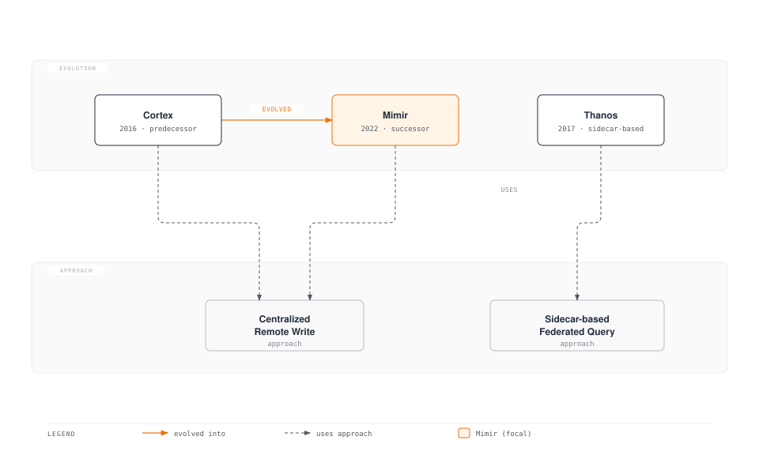
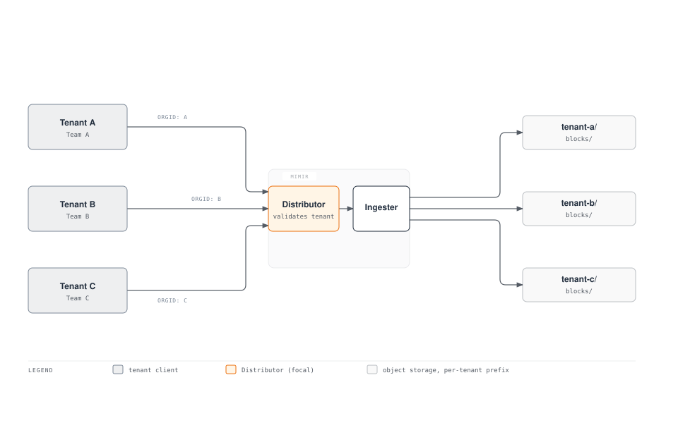
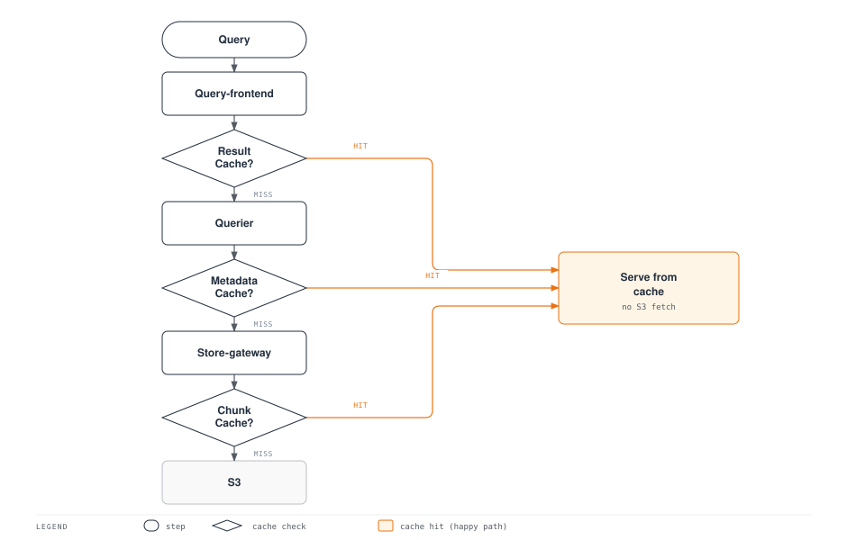
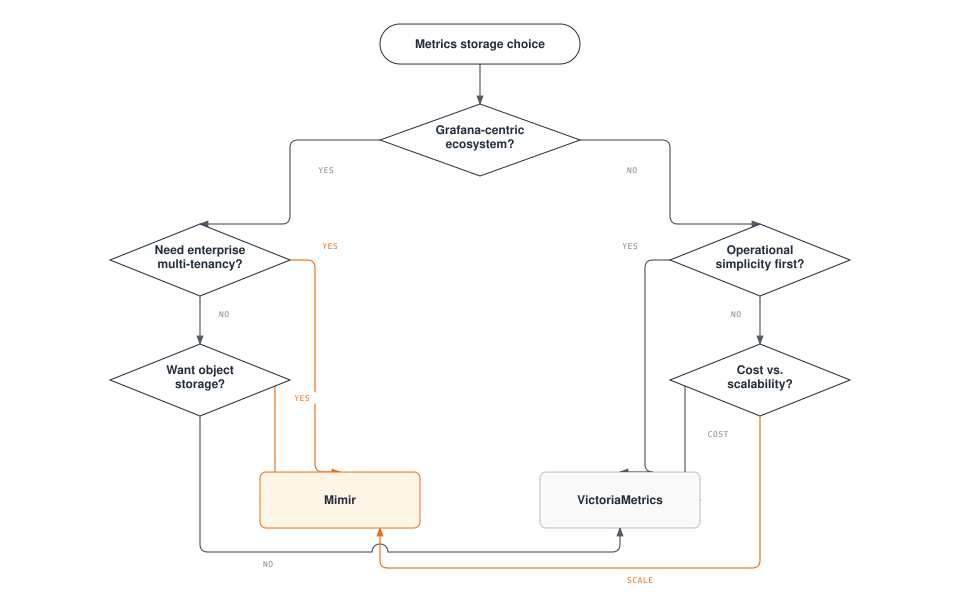

# Grafana Mimir

> **Supported Versions**: Mimir 2.x
> **Last Updated**: February 20, 2026

## Table of Contents

- [Introduction](#introduction)
- [Architecture](#architecture)
- [Core Components](#core-components)
- [Multi-tenancy](#multi-tenancy)
- [Helm Installation](#helm-installation)
- [S3 Backend Configuration](#s3-backend-configuration)
- [Query and Data Retention](#query-and-data-retention)
- [Comparison with VictoriaMetrics](#comparison-with-victoriametrics)
- [Performance Tuning](#performance-tuning)
- [Best Practices](#best-practices)
- [Troubleshooting](#troubleshooting)

## Introduction

Grafana Mimir is an open-source, horizontally scalable long-term metrics storage developed by Grafana Labs. As an enterprise-grade storage for Prometheus metrics, it provides multi-tenancy, high availability, and unlimited scalability using object storage.

### Key Features

| Feature | Description |
|---------|-------------|
| **Horizontal Scaling** | Scalable to billions of active time series |
| **Multi-tenancy** | Native tenant isolation support |
| **High Availability** | Component-level replication and automatic failover |
| **Object Storage** | Supports S3, GCS, Azure Blob, etc. |
| **100% PromQL Compatible** | Supports all PromQL queries |
| **Long-term Retention** | Unlimited data retention period |
| **Grafana Integration** | Native integration with Grafana |

### Mimir vs Cortex vs Thanos

Mimir is the successor to Cortex, offering better performance and operability:



| Item | Mimir | Cortex | Thanos |
|------|-------|--------|--------|
| Architecture | Centralized | Centralized | Sidecar-based |
| Complexity | Medium | High | Medium |
| Query Performance | Fast | Medium | Medium |
| Operational Overhead | Low | High | Medium |
| Prometheus Modification | Not required | Not required | Requires sidecar |
| Multi-tenancy | Native | Native | Limited |

## Architecture

### Overall Architecture


### Data Flow

1. **Write Path**:
   - Prometheus sends metrics via remote_write
   - Distributor validates tenant and distributes samples
   - Ingester stores in memory and periodically uploads blocks

2. **Read Path**:
   - Query-frontend splits queries and caches
   - Querier queries Ingester (recent data) and Store-gateway (historical data)
   - Results are merged and returned

3. **Background Processes**:
   - Compactor merges small blocks into larger blocks
   - Applies downsampling and retention policies

## Core Components

### Distributor

The first entry point for write requests, handling tenant validation and sample distribution.

```yaml
# Distributor configuration
distributor:
  ring:
    kvstore:
      store: memberlist
  instance_limits:
    max_inflight_push_requests: 30000
    max_ingestion_rate: 100000
```

**Roles**:
- Tenant ID validation
- Time series validation (labels, sample values)
- Hash ring-based Ingester distribution
- Replication based on replication factor

### Ingester

Stores time series data in memory and periodically uploads to object storage.

```yaml
# Ingester configuration
ingester:
  ring:
    replication_factor: 3
    kvstore:
      store: memberlist
  instance_limits:
    max_series: 5000000
    max_inflight_push_requests: 30000

blocks_storage:
  tsdb:
    block_ranges_period: [2h]
    retention_period: 24h
    ship_interval: 1m
```

**Roles**:
- Store time series data in memory
- Maintain WAL (Write-Ahead Log)
- Create and upload TSDB blocks
- Process queries for recent data

### Store-gateway

Caches and queries blocks from object storage.

```yaml
# Store-gateway configuration
store_gateway:
  sharding_ring:
    replication_factor: 3
    kvstore:
      store: memberlist

blocks_storage:
  bucket_store:
    sync_interval: 15m
    bucket_index:
      enabled: true
    chunks_cache:
      backend: memcached
      memcached:
        addresses: dns+memcached:11211
    metadata_cache:
      backend: memcached
      memcached:
        addresses: dns+memcached:11211
```

**Roles**:
- Cache object storage block indexes
- Process queries for historical data
- Cache block metadata and chunks

### Compactor

Performs block compaction and downsampling.

```yaml
# Compactor configuration
compactor:
  data_dir: /data/compactor
  sharding_ring:
    kvstore:
      store: memberlist
  compaction_interval: 1h
  block_ranges: [2h, 12h, 24h]
  deletion_delay: 12h
```

**Roles**:
- Merge small blocks into larger blocks
- Remove duplicate data
- Delete data based on retention policies
- Optimize block indexes

### Querier

Queries and merges data from Ingester and Store-gateway.

```yaml
# Querier configuration
querier:
  max_concurrent: 20
  timeout: 2m
  query_ingesters_within: 13h
```

**Roles**:
- Execute PromQL queries
- Parallel query to Ingester/Store-gateway
- Merge results and deduplicate

### Query-frontend

Handles query optimization and caching.

```yaml
# Query-frontend configuration
query_frontend:
  align_querier_with_step: true
  cache_results: true
  results_cache:
    backend: memcached
    memcached:
      addresses: dns+memcached:11211
      timeout: 500ms
  split_queries_by_interval: 24h
  max_retries: 5
```

**Roles**:
- Split large queries
- Cache results
- Manage query queues
- Handle retries

## Multi-tenancy

Mimir supports native multi-tenancy to isolate metrics from multiple teams/organizations.

### Tenant Configuration

```yaml
# Add tenant header to Prometheus remote_write
remote_write:
  - url: http://mimir:8080/api/v1/push
    headers:
      X-Scope-OrgID: tenant-1

# Or identify tenant via basic auth
remote_write:
  - url: http://mimir:8080/api/v1/push
    basic_auth:
      username: tenant-1
      password: secret
```

### Per-tenant Limits

```yaml
# Mimir configuration
limits:
  # Default limits (all tenants)
  ingestion_rate: 100000
  ingestion_burst_size: 200000
  max_global_series_per_user: 5000000
  max_global_series_per_metric: 50000
  max_label_names_per_series: 30
  max_label_value_length: 2048

# Per-tenant overrides
overrides:
  tenant-1:
    ingestion_rate: 200000
    max_global_series_per_user: 10000000
  tenant-2:
    ingestion_rate: 50000
    max_global_series_per_user: 1000000
```

### Tenant Isolation



## Helm Installation

### Install mimir-distributed

```bash
# Add Helm repository
helm repo add grafana https://grafana.github.io/helm-charts
helm repo update

# Install
helm install mimir grafana/mimir-distributed \
  --namespace monitoring \
  --create-namespace \
  -f values.yaml
```

### values.yaml

```yaml
# Global configuration
global:
  # Object storage configuration
  extraEnvFrom:
    - secretRef:
        name: mimir-s3-credentials

# Distributor
distributor:
  replicas: 3
  resources:
    requests:
      cpu: 100m
      memory: 512Mi
    limits:
      cpu: 1000m
      memory: 2Gi

# Ingester
ingester:
  replicas: 3
  persistentVolume:
    enabled: true
    storageClass: gp3
    size: 50Gi
  resources:
    requests:
      cpu: 500m
      memory: 2Gi
    limits:
      cpu: 2000m
      memory: 8Gi
  zoneAwareReplication:
    enabled: true
    zones:
      - name: zone-a
        nodeSelector:
          topology.kubernetes.io/zone: ap-northeast-2a
      - name: zone-b
        nodeSelector:
          topology.kubernetes.io/zone: ap-northeast-2b
      - name: zone-c
        nodeSelector:
          topology.kubernetes.io/zone: ap-northeast-2c

# Store-gateway
store_gateway:
  replicas: 3
  persistentVolume:
    enabled: true
    storageClass: gp3
    size: 20Gi
  resources:
    requests:
      cpu: 200m
      memory: 1Gi
    limits:
      cpu: 1000m
      memory: 4Gi

# Compactor
compactor:
  replicas: 1
  persistentVolume:
    enabled: true
    storageClass: gp3
    size: 50Gi
  resources:
    requests:
      cpu: 500m
      memory: 2Gi
    limits:
      cpu: 2000m
      memory: 8Gi

# Querier
querier:
  replicas: 3
  resources:
    requests:
      cpu: 200m
      memory: 512Mi
    limits:
      cpu: 1000m
      memory: 2Gi

# Query-frontend
query_frontend:
  replicas: 2
  resources:
    requests:
      cpu: 100m
      memory: 256Mi
    limits:
      cpu: 500m
      memory: 1Gi

# Query-scheduler (optional)
query_scheduler:
  enabled: true
  replicas: 2

# Ruler (optional)
ruler:
  enabled: true
  replicas: 2

# Alertmanager (optional, Mimir built-in)
alertmanager:
  enabled: false

# Cache configuration
memcached:
  enabled: true

memcached-queries:
  enabled: true
  replicas: 2

memcached-metadata:
  enabled: true
  replicas: 2

# Minio (for testing, use S3 in production)
minio:
  enabled: false

# Structured configuration
mimir:
  structuredConfig:
    common:
      storage:
        backend: s3
        s3:
          endpoint: s3.ap-northeast-2.amazonaws.com
          region: ap-northeast-2
          bucket_name: my-mimir-bucket

    limits:
      ingestion_rate: 100000
      ingestion_burst_size: 200000
      max_global_series_per_user: 5000000
      compactor_blocks_retention_period: 365d

    blocks_storage:
      tsdb:
        dir: /data/tsdb
      bucket_store:
        sync_dir: /data/tsdb-sync

    compactor:
      data_dir: /data/compactor
```

## S3 Backend Configuration

### IRSA Setup

```bash
# Check OIDC provider
aws eks describe-cluster --name my-cluster --query "cluster.identity.oidc.issuer" --output text

# Create IAM policy
cat <<EOF > mimir-s3-policy.json
{
    "Version": "2012-10-17",
    "Statement": [
        {
            "Effect": "Allow",
            "Action": [
                "s3:PutObject",
                "s3:GetObject",
                "s3:DeleteObject",
                "s3:ListBucket"
            ],
            "Resource": [
                "arn:aws:s3:::my-mimir-bucket",
                "arn:aws:s3:::my-mimir-bucket/*"
            ]
        }
    ]
}
EOF

aws iam create-policy \
  --policy-name MimirS3Policy \
  --policy-document file://mimir-s3-policy.json

# Create service account
eksctl create iamserviceaccount \
  --name mimir \
  --namespace monitoring \
  --cluster my-cluster \
  --attach-policy-arn arn:aws:iam::123456789012:policy/MimirS3Policy \
  --approve
```

### S3 Bucket Configuration

```yaml
# Mimir S3 configuration
mimir:
  structuredConfig:
    common:
      storage:
        backend: s3
        s3:
          endpoint: s3.ap-northeast-2.amazonaws.com
          region: ap-northeast-2
          bucket_name: my-mimir-bucket
          # access_key and secret_key not needed with IRSA

    blocks_storage:
      s3:
        bucket_name: my-mimir-bucket

    ruler_storage:
      s3:
        bucket_name: my-mimir-bucket

    alertmanager_storage:
      s3:
        bucket_name: my-mimir-bucket
```

### S3 Bucket Lifecycle Policy

```json
{
  "Rules": [
    {
      "ID": "CleanupIncompleteMultipartUploads",
      "Status": "Enabled",
      "Filter": {},
      "AbortIncompleteMultipartUpload": {
        "DaysAfterInitiation": 7
      }
    },
    {
      "ID": "TransitionToIA",
      "Status": "Enabled",
      "Filter": {
        "Prefix": "blocks/"
      },
      "Transitions": [
        {
          "Days": 90,
          "StorageClass": "STANDARD_IA"
        }
      ]
    }
  ]
}
```

## Query and Data Retention

### Retention Policy Configuration

```yaml
mimir:
  structuredConfig:
    limits:
      # Block retention period
      compactor_blocks_retention_period: 365d

    compactor:
      # Deletion delay (recovery time for mistakes)
      deletion_delay: 12h
```

### Query Optimization Configuration

```yaml
mimir:
  structuredConfig:
    query_frontend:
      # Query splitting
      split_queries_by_interval: 24h
      # Query step alignment
      align_querier_with_step: true
      # Result caching
      cache_results: true
      results_cache:
        backend: memcached
        memcached:
          addresses: dns+memcached:11211
          timeout: 500ms

    querier:
      # Concurrent queries
      max_concurrent: 20
      # Query timeout
      timeout: 2m
      # Ingester query range
      query_ingesters_within: 13h

    limits:
      # Maximum samples per query
      max_fetched_samples_per_query: 50000000
      # Query range limit
      max_query_length: 30d
      # Maximum query parallelism
      max_query_parallelism: 32
```

### Query Caching Strategy



## Comparison with VictoriaMetrics

### Detailed Comparison

| Item | Grafana Mimir | VictoriaMetrics |
|------|---------------|-----------------|
| **License** | AGPL v3 | Apache 2.0 |
| **Architecture** | Microservices | Monolithic/Cluster |
| **Storage** | Object storage required | Local disk possible |
| **Operational Complexity** | High | Low-Medium |
| **Query Language** | PromQL | MetricsQL (superset) |
| **Multi-tenancy** | Native | Supported |
| **Compression** | Good | Very good |
| **Memory Efficiency** | Medium | High |
| **Community** | Grafana Labs | Active open source |
| **Commercial Support** | Grafana Cloud | VictoriaMetrics Inc. |

### Selection Criteria



**Choose Mimir when**:
- Using Grafana Cloud or Grafana ecosystem
- Need enterprise-grade multi-tenancy
- Want to leverage object storage
- Can manage complex operational environment

**Choose VictoriaMetrics when**:
- Prefer simple operational environment
- Prefer local disk-based storage
- Maximum compression and performance important
- Cost efficiency is priority

## Performance Tuning

### Ingester Tuning

```yaml
ingester:
  ring:
    replication_factor: 3
  instance_limits:
    max_series: 5000000
    max_inflight_push_requests: 30000

blocks_storage:
  tsdb:
    block_ranges_period: [2h]
    retention_period: 24h
    head_compaction_interval: 15m
    head_compaction_concurrency: 4
    wal_compression_enabled: true
```

### Store-gateway Tuning

```yaml
blocks_storage:
  bucket_store:
    sync_interval: 15m
    max_chunk_pool_bytes: 2147483648  # 2GB
    chunk_pool_min_bucket_size_bytes: 16384
    chunk_pool_max_bucket_size_bytes: 524288

    index_cache:
      backend: memcached
      memcached:
        addresses: dns+memcached:11211
        max_item_size: 5242880  # 5MB
        timeout: 450ms

    chunks_cache:
      backend: memcached
      memcached:
        addresses: dns+memcached:11211
        max_item_size: 1048576  # 1MB
        timeout: 450ms
```

### Query Tuning

```yaml
query_frontend:
  parallelize_shardable_queries: true
  split_queries_by_interval: 24h
  max_retries: 5

  query_sharding:
    enabled: true
    total_shards: 16

querier:
  max_concurrent: 20
  timeout: 2m
```

## Best Practices

### Production Checklist

1. **High Availability**
   - Ingester: minimum 3, zone-aware replication
   - Store-gateway: minimum 2
   - Distributor: minimum 2
   - Query-frontend: minimum 2

2. **Caching**
   - Result cache: memcached
   - Metadata cache: memcached
   - Chunk cache: memcached

3. **Monitoring**
   ```promql
   # Mimir self metrics
   cortex_ingester_active_series
   cortex_distributor_received_samples_total
   cortex_querier_request_duration_seconds
   cortex_compactor_runs_completed_total
   ```

4. **Alert Rules**
   ```yaml
   groups:
   - name: mimir
     rules:
     - alert: MimirIngesterUnhealthy
       expr: cortex_ring_members{state="Unhealthy"} > 0
       for: 5m
       labels:
         severity: critical

     - alert: MimirCompactorFailed
       expr: increase(cortex_compactor_runs_failed_total[1h]) > 0
       for: 5m
       labels:
         severity: warning
   ```

### Cost Optimization

```yaml
# Use S3 storage classes
blocks_storage:
  s3:
    storage_class: INTELLIGENT_TIERING

# Filter unnecessary metrics
limits:
  drop_labels:
    - pod_template_hash
    - controller_revision_hash

# Downsampling (Enterprise)
compactor:
  downsampling_enabled: true
```

## Troubleshooting

### Common Issues

#### 1. Ingester OOM

```bash
# Check memory usage
kubectl top pod -l app.kubernetes.io/component=ingester -n monitoring

# Solution: Adjust time series limit
ingester:
  instance_limits:
    max_series: 3000000  # Reduce
```

#### 2. Query Timeout

```bash
# Check slow queries
curl http://query-frontend:8080/api/v1/status/buildinfo

# Solution: Query splitting and parallelization
query_frontend:
  split_queries_by_interval: 12h  # Smaller
  query_sharding:
    total_shards: 32  # Increase
```

#### 3. Compactor Delay

```bash
# Check Compactor status
curl http://compactor:8080/compactor/ring

# Solution: Increase resources
compactor:
  resources:
    limits:
      cpu: 4000m
      memory: 16Gi
```

### Debugging Commands

```bash
# Check component status
curl http://distributor:8080/distributor/all_user_stats
curl http://ingester:8080/ingester/ring
curl http://store-gateway:8080/store-gateway/ring
curl http://compactor:8080/compactor/ring

# Check metrics
curl http://distributor:8080/metrics | grep cortex_
curl http://ingester:8080/metrics | grep cortex_

# Check configuration
curl http://distributor:8080/config
```

## References

- [Grafana Mimir Official Documentation](https://grafana.com/docs/mimir/latest/)
- [Mimir GitHub](https://github.com/grafana/mimir)
- [mimir-distributed Helm Chart](https://github.com/grafana/mimir/tree/main/operations/helm/charts/mimir-distributed)
- [Mimir Architecture](https://grafana.com/docs/mimir/latest/references/architecture/)

## Quiz

To test your understanding of this chapter, try the [Grafana Mimir Quiz](../../quizzes/observability/metrics/03-mimir-quiz.md).
