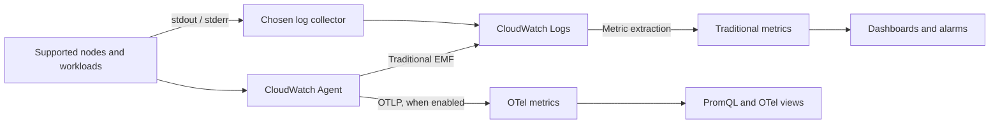

# CloudWatch Metrics

> **Last Updated**: September 13, 2026
> Helm example: amazon-cloudwatch-observability 6.6.0.
> Historical April/July announcements below retain their actual dates.

## Introduction

CloudWatch manages storage, query, dashboards and alarms. Teams still configure
collectors, workload identity, network access, cardinality, retention and response
ownership. A managed backend does not remove these operating responsibilities.

| Topic | CloudWatch | Self-managed Prometheus / VictoriaMetrics |
| --- | --- | --- |
| Backend | AWS-managed service; feature/Region availability varies | Operate capacity, storage, upgrades and recovery |
| Collection | AWS service metrics plus configured agents/SDKs/OTLP | Exporters, agents, scraping and remote write |
| Query | Metric Math, Metrics Insights; PromQL for OTel metrics | PromQL / MetricsQL |
| Cost | Metric/observation or OTLP ingestion model, logs, queries and alarms | Compute/storage/network plus operations |
| Platforms | AWS and supported hybrid/multicloud collection | Cloud-neutral deployment choices |
| Retention | Depends on metric model and resolution; logs have separate retention | Configured storage/retention policy |

## Container Insights: choose a metric model

The CloudWatch Observability EKS add-on and Helm chart configure an Operator and
collection components. Traditional Container Insights uses performance log events
and extracted CloudWatch metrics; OTel-based Container Insights sends OpenTelemetry
metrics and can use PromQL. These are distinct naming, dimension and billing models.

| Traditional `ContainerInsights` metric | Meaning and example dimension set |
| --- | --- |
| `cluster_node_count` | Node count; `ClusterName` |
| `cluster_failed_node_count` | Nodes with failure conditions; `ClusterName`. Not exclusively `NotReady` |
| `node_cpu_utilization`, `node_memory_utilization` | Node utilization; `ClusterName`, or `NodeName,ClusterName,InstanceId` |
| `node_network_total_bytes` | Network throughput in **bytes/second**, not a cumulative byte counter |
| `namespace_number_of_running_pods` | Pod count; `Namespace,ClusterName` |
| `pod_cpu_utilization`, `pod_memory_utilization` | Pod usage relative to the **node** limit; use the documented `_over_pod_limit` metrics for pod-limit ratios |
| `pod_number_of_container_restarts` | Total restarts in a pod; `PodName,Namespace,ClusterName` |

The documented list does not contain `cluster_cpu_utilization` or
`cluster_memory_utilization`. A node metric with only `ClusterName` is not automatically
a capacity-weighted cluster utilization calculation. Match the exact published
dimension set. Some fields appear only in performance logs, and enhanced metrics
have additional sets such as `FullPodName`; do not invent metric names from log fields.
Network receive/transmit metrics are also rates. Avoid applying `RATE()` to them
as if they were monotonic byte counters.

The diagram separates traditional metric extraction, optional OTLP metrics and application logs.



### Installation and platform scope

Use either the EKS managed add-on or a Helm-owned installation for the same
components. Establish ownership before switching; do not install both blindly.
For the managed add-on, discover compatibility with the actual Kubernetes version,
architecture, compute type and Region. A Helm version is not an EKS
`v…-eksbuild.…` version.

```bash
# Read-only discovery. Use the intended account, Region and cluster.
export AWS_REGION=ap-northeast-2
export CLUSTER_NAME=my-cluster
K8S_VERSION=$(aws eks describe-cluster --name "$CLUSTER_NAME" \
  --region "$AWS_REGION" --query 'cluster.version' --output text)
aws eks describe-addon-versions \
  --addon-name amazon-cloudwatch-observability \
  --kubernetes-version "$K8S_VERSION" --region "$AWS_REGION" \
  --query 'addons[0].addonVersions[].{version:addonVersion,architectures:architecture,computeTypes:computeTypes,compatibilities:compatibilities}'

# Set ADDON_VERSION to the exact compatible version selected above.
: "${ADDON_VERSION:?Select a compatible EKS add-on version}"
aws eks describe-addon-configuration \
  --addon-name amazon-cloudwatch-observability \
  --addon-version "$ADDON_VERSION" --region "$AWS_REGION" \
  --query configurationSchema --output text > addon-schema.json
```

Prepare the add-on's documented IAM permissions and workload identity separately.
EKS Pod Identity is recommended by the add-on guide for supported versions; it
requires an Agent and an association for the actual namespace/service account.
IRSA is an alternative requiring the cluster OIDC provider, trust policy and service
account annotation. A local `aws sts get-caller-identity` only identifies that caller,
not credentials used inside the collector.

The add-on supports Container Insights on Linux and Windows worker nodes, with
Windows support from 1.5.0; Application Signals on EKS Windows is not supported.
Fargate does not run this host-mounted DaemonSet; use its documented collection path.
Check Auto Mode and mixed clusters against the selected add-on's supported compute
types and collection requirements. Do not promise identical host metrics on every
platform. Workloads, collectors and AWS endpoints also need the relevant network
paths and RBAC.

The following Helm example targets **Linux EC2 worker nodes**. Chart 6.6.0 declares
agent image `1.300072.0b1766`; the public agent GitHub release `v1.300071.0` is a
different release channel. The chart is pinned and its default image is retained.
This review rendered the chart, not a live EKS deployment.

```yaml
# cloudwatch-values.yaml: reviewed Helm chart 6.6.0, Linux EC2 example
clusterName: my-cluster
region: ap-northeast-2
containerInsights:
  enabled: true
containerLogs:
  enabled: true
applicationSignals:
  enabled: false
otelContainerInsights:
  enabled: false
  logs:
    enabled: false
```

In this chart the CloudWatch agent and Fluent Bit use the `cloudwatch-agent`
service account in the release namespace. Prepare its Pod Identity association
before expecting telemetry. For IRSA, configure and maintain the annotation on that
actual service account; the top-level chart `roleArn` is **not** an EKS IRSA shortcut.
Review generated CRDs, ClusterRoles, Secrets, host mounts and node selectors. The
Operator creates agent workloads from `AmazonCloudWatchAgent` custom resources;
`helm template` alone does not execute that reconciliation.

Chart 6.6.0 also renders two Windows-specific agent CRs, selected for Windows
nodes, even in this Linux example. The Linux `applicationSignals.enabled: false`
setting does not remove those Windows CRs. This example assumes Linux-only nodes;
review the generated Windows configuration separately before using it on a mixed cluster.

```bash
helm repo add aws-observability https://aws-observability.github.io/helm-charts
helm repo update aws-observability
helm template cloudwatch aws-observability/amazon-cloudwatch-observability \
  --version 6.6.0 --namespace amazon-cloudwatch \
  --include-crds --values cloudwatch-values.yaml > cloudwatch-rendered.yaml

# Installation changes the cluster; run only after reviewing ownership and prerequisites.
helm upgrade --install cloudwatch aws-observability/amazon-cloudwatch-observability \
  --version 6.6.0 --namespace amazon-cloudwatch --create-namespace \
  --values cloudwatch-values.yaml
```

`eksctl utils update-cluster-logging` configures **EKS control-plane logs**. It does
not install CloudWatch Agent or enable Container Insights.

### OTel migration and historical announcements

The current OTel Container Insights guide recommends the OTel path for new
development and describes the traditional path as maintenance mode. OTel is
disabled by default; the guide requires add-on 6.2.0 or later. Check actual compatible
add-on versions and feature availability, not just that minimum.

For the reviewed chart, enable `otelContainerInsights.enabled` after evaluating
the OTel metric model. Keeping `containerInsights.enabled: true` allows both
metric paths during migration, with additional ingestion/cost to assess.
The example keeps `otelContainerInsights.logs.enabled: false` while Fluent Bit
collects logs; choose log ownership deliberately instead of duplicating collection.

OTel metrics retain source names such as `container_cpu_usage_seconds_total` and
support up to 150 labels from source/resource/Kubernetes metadata. Traditional
`PutMetricData` metrics have a separate limit of 30 dimensions. Extra labels increase
payload size and may expose metadata; they are not a free or unlimited cardinality
budget. Accelerator metrics still require supported drivers/plugins/toolkits.

The **2026-04-02 preview announcement** listed N. Virginia, Oregon, Sydney,
Singapore and Ireland. That is a dated launch record, not today's full availability
or pricing table. The **2026-07-06 Service Events announcement** describes error,
latency and deployment events for active Application Signals applications, supported
Java/Python/JavaScript instrumentation and optional function metrics. Application
Signals must actually be enabled and instrumented; the metrics-only example above
does not enable it. Keep the July date even though the announcement URL contains `/06/`.

## CloudWatch Agent configuration

### Correct traditional Container Insights JSON

The Kubernetes collector belongs under **`logs.metrics_collected.kubernetes`**.
This fragment shows that traditional collection configuration; it is not a complete
DaemonSet, identity policy or replacement for all generated add-on settings.
JSON does not permit inline comments.

```json
{
  "logs": {
    "metrics_collected": {
      "kubernetes": {
        "cluster_name": "my-cluster",
        "metrics_collection_interval": 60,
        "enhanced_container_insights": true
      }
    }
  }
}
```

Do not put a second Kubernetes collector under `metrics.metrics_collected`.
With the Helm chart, a custom `agent.config` overrides generated defaults and can
remove Application Signals, trace or other configured collection. Start with the
effective rendered configuration and preserve the features you intend to keep.
Changing a ConfigMap that is not mounted by the running workload has no effect.

The chart/Operator supplies service accounts, discovery RBAC, configuration mounts
and runtime-specific host paths. A hand-written DaemonSet needs all of them and
must account for its platform. Do not copy a Docker socket-only deployment into
containerd/Fargate/Auto Mode environments and assume equivalent behavior.
Host-level collection is privileged access; limit who can alter its workload and
service account.

Enhanced observability adds metrics and dimensions, but several reserved-capacity
metrics already exist in the traditional list. Verify the enhanced metric catalogue
and billing model instead of treating every reserved/GPU metric as enhanced-only.
GPU/EFA/Neuron collection also depends on the relevant supported node hardware and
software.

## Custom Metric Collection

### Target selection and dimension labels

Use one collection owner per target: CloudWatch Agent Prometheus collection,
ADOT/EMF, or an appropriate OTLP path. Scraping all pods from every DaemonSet replica
can multiply samples and charges. A singleton Deployment is one simple ownership
model; HA/sharding requires a reviewed allocation strategy.

This example expects a **gauge** named `queue_depth` on `/metrics`, a pod container
port named `metrics`, annotation `prometheus.io/scrape: "true"` and label
`app.kubernetes.io/name` in namespace `default`. The target must be reachable and
authorized; add TLS/authentication to match the actual endpoint. This HTTP scrape
fragment assumes an allowed internal endpoint, not a public metrics service.

Save the following as `prometheus.yaml`. It selects the named port and creates
**all three** label values needed by the EMF declaration. An EMF dimension list
does not create missing labels. A pod label used for `Service` is a logical service
identity; it is not proof that a Kubernetes Service object exists.

```yaml
global:
  scrape_interval: 30s
  scrape_timeout: 10s
scrape_configs:
- job_name: my-app
  kubernetes_sd_configs:
  - role: pod
    namespaces:
      names:
      - default
  relabel_configs:
  - source_labels:
    - __meta_kubernetes_pod_annotation_prometheus_io_scrape
    action: keep
    regex: 'true'
  - source_labels:
    - __meta_kubernetes_pod_container_port_name
    action: keep
    regex: metrics
  - source_labels:
    - __meta_kubernetes_namespace
    target_label: Namespace
  - source_labels:
    - __meta_kubernetes_pod_label_app_kubernetes_io_name
    target_label: Service
  - source_labels:
    - Service
    action: keep
    regex: .+
  - target_label: ClusterName
    replacement: my-cluster
  metric_relabel_configs:
  - source_labels:
    - __name__
    action: keep
    regex: queue_depth
```

### CloudWatch Agent Prometheus configuration

The agent's JSON and Prometheus YAML are two separate files. Mount the former in
the agent's configured input path and the latter at the exact
`/etc/prometheusconfig/prometheus.yaml` path referenced below. This is the config
for a separately owned collector, not a complete installation or an override to
paste into every Container Insights DaemonSet.

```json
{
  "logs": {
    "metrics_collected": {
      "prometheus": {
        "cluster_name": "my-cluster",
        "log_group_name": "/aws/containerinsights/my-cluster/prometheus",
        "prometheus_config_path": "/etc/prometheusconfig/prometheus.yaml",
        "emf_processor": {
          "metric_declaration_dedup": true,
          "metric_namespace": "CustomMetrics",
          "metric_unit": {
            "queue_depth": "Count"
          },
          "metric_declaration": [
            {
              "source_labels": [
                "job"
              ],
              "label_matcher": "^my-app$",
              "dimensions": [
                [
                  "ClusterName",
                  "Namespace",
                  "Service"
                ]
              ],
              "metric_selectors": [
                "^queue_depth$"
              ]
            }
          ]
        }
      }
    }
  }
}
```

The official traditional Prometheus integration documents gauge, counter and summary
support, not automatic import of Prometheus histograms. Counter deltas, first samples,
resets and summary fields require their own interpretation. This example deliberately
uses a gauge: `Average`/`Maximum` describe queue depth, while summing snapshots does
not count processed requests. Use the OTel path where appropriate and verify its
actual histogram/temporality mapping separately.

### AWS Distro for OpenTelemetry (ADOT)

For the **EMF path**, an ADOT collector with the `prometheus` receiver and `awsemf`
exporter can use the following `config.yaml`. The reviewed ADOT release is
`v0.50.0`; confirm its image/platform and enabled components for your deployment.
The exporter sends EMF log events, which CloudWatch extracts into traditional
metrics. It is not a statement that every modern CloudWatch/OTLP path uses EMF.

```yaml
receivers:
  prometheus:
    config:
      global:
        scrape_interval: 30s
        scrape_timeout: 10s
      scrape_configs:
      - job_name: my-app
        kubernetes_sd_configs:
        - role: pod
          namespaces:
            names:
            - default
        relabel_configs:
        - source_labels:
          - __meta_kubernetes_pod_annotation_prometheus_io_scrape
          action: keep
          regex: 'true'
        - source_labels:
          - __meta_kubernetes_pod_container_port_name
          action: keep
          regex: metrics
        - source_labels:
          - __meta_kubernetes_namespace
          target_label: Namespace
        - source_labels:
          - __meta_kubernetes_pod_label_app_kubernetes_io_name
          target_label: Service
        - source_labels:
          - Service
          action: keep
          regex: .+
        - target_label: ClusterName
          replacement: my-cluster
        metric_relabel_configs:
        - source_labels:
          - __name__
          action: keep
          regex: queue_depth
processors:
  memory_limiter:
    check_interval: 1s
    limit_mib: 384
    spike_limit_mib: 64
  batch:
    timeout: 10s
exporters:
  awsemf:
    region: ap-northeast-2
    namespace: CustomMetrics
    log_group_name: /aws/containerinsights/my-cluster/prometheus
    dimension_rollup_option: NoDimensionRollup
    metric_declarations:
    - dimensions:
      - - ClusterName
        - Namespace
        - Service
      metric_name_selectors:
      - ^queue_depth$
service:
  pipelines:
    metrics:
      receivers:
      - prometheus
      processors:
      - memory_limiter
      - batch
      exporters:
      - awsemf
```

The collector must run with a config mount and `--config` pointing to that file,
workload IAM credentials allowed to write the intended **Standard-class** EMF log
group/streams, and memory limits consistent with the limiter. It also needs
Kubernetes discovery RBAC and network access to the selected targets and AWS Logs.
The following Role is scoped to the one discovered namespace; create the
`amazon-cloudwatch` namespace first and bind this SA to the actual collector.

```yaml
apiVersion: v1
kind: ServiceAccount
metadata:
  name: metrics-scraper
  namespace: amazon-cloudwatch
---
apiVersion: rbac.authorization.k8s.io/v1
kind: Role
metadata:
  name: metrics-pod-discovery
  namespace: default
rules:
- apiGroups:
  - ''
  resources:
  - pods
  verbs:
  - get
  - list
  - watch
---
apiVersion: rbac.authorization.k8s.io/v1
kind: RoleBinding
metadata:
  name: metrics-pod-discovery
  namespace: default
roleRef:
  apiGroup: rbac.authorization.k8s.io
  kind: Role
  name: metrics-pod-discovery
subjects:
- kind: ServiceAccount
  name: metrics-scraper
  namespace: amazon-cloudwatch
```

IAM and Kubernetes RBAC are separate. Associate the collector SA with its own
Pod Identity role or correctly configured IRSA role; no role is created by this
RBAC manifest. Pre-create/own the log group or explicitly authorize its creation.
When using more replicas or namespaces, review target ownership and expand only
the necessary discovery permissions. The config fragments were not deployed or
used to send metrics during this audit.

### Send Custom Metrics via SDK

These are reusable helpers, not standalone executables. The caller creates and
reuses a boto3/AWS SDK for Go v2 CloudWatch client with the intended Region,
workload credentials, timeouts and retry policy. Errors propagate to that caller.
No credentials are embedded. The Python timestamp is timezone-aware UTC.
The value is the count for the application's reporting interval; query it with
`Sum` for a matching window rather than treating it as a cumulative counter.
`PutMetricData` has no idempotency token, so ambiguous retries can duplicate samples;
do not treat telemetry submission as an exactly-once business ledger.

```python
from datetime import datetime, timezone


def put_orders_processed(cloudwatch, count):
    """The caller supplies a configured boto3 CloudWatch client."""
    if isinstance(count, bool) or not isinstance(count, int) or count < 0:
        raise ValueError("count must be a non-negative integer")
    return cloudwatch.put_metric_data(
        Namespace="MyApp/Production",
        MetricData=[{
            "MetricName": "OrdersProcessed",
            "Dimensions": [
                {"Name": "Service", "Value": "order-service"},
                {"Name": "Environment", "Value": "production"},
            ],
            "Timestamp": datetime.now(timezone.utc),
            "Value": count,
            "Unit": "Count",
            "StorageResolution": 60,
        }],
    )
```

```go
package metrics

import (
    "context"
    "time"

    "github.com/aws/aws-sdk-go-v2/aws"
    "github.com/aws/aws-sdk-go-v2/service/cloudwatch"
    "github.com/aws/aws-sdk-go-v2/service/cloudwatch/types"
)

func PutOrdersProcessed(ctx context.Context, client *cloudwatch.Client, count uint64) error {
    _, err := client.PutMetricData(ctx, &cloudwatch.PutMetricDataInput{
        Namespace: aws.String("MyApp/Production"),
        MetricData: []types.MetricDatum{{
            MetricName: aws.String("OrdersProcessed"),
            Dimensions: []types.Dimension{
                {Name: aws.String("Service"), Value: aws.String("order-service")},
                {Name: aws.String("Environment"), Value: aws.String("production")},
            },
            Timestamp: aws.Time(time.Now().UTC()),
            Value: aws.Float64(float64(count)),
            Unit: types.StandardUnitCount,
            StorageResolution: aws.Int32(60),
        }},
    })
    return err
}
```

Namespace, metric name and the **complete dimension set** identify a traditional
metric. Omitting `Environment` queries a different identity; custom dimensions do
not automatically produce all aggregate series. Batch within the documented API
limits and constrain `cloudwatch:PutMetricData` to the intended namespace with
the `cloudwatch:namespace` IAM condition.

## Metric Math and Anomaly Detection

### Metric Math

Use the same time period, dimensions and compatible units for related series.
ALB target-error and request metrics are counts, so the widget uses **Sum**.
Confirm the actual load-balancer dimension value and that both metrics belong to it.

```json
{
  "metrics": [
    [{"expression": "IF(m2>0,100*m1/m2)", "label": "Target 5xx / requests (%)", "id": "e1"}],
    ["AWS/ApplicationELB", "HTTPCode_Target_5XX_Count", "LoadBalancer", "app/replace-with-your-alb/id", {"id": "m1", "visible": false}],
    [".", "RequestCount", ".", ".", {"id": "m2", "visible": false}]
  ],
  "view": "timeSeries",
  "region": "ap-northeast-2",
  "period": 60,
  "stat": "Sum"
}
```

CloudWatch arithmetic treats missing datapoints as zero; division by zero drops
the result. The `IF` keeps zero-traffic periods out of this ratio. For request
traffic with no published target-5xx count, the missing numerator contributes zero.
Distinguish that documented sparse metric behavior from a broken collection path;
missing request telemetry must not be presented as a healthy zero-error result.

| Expression or setting | Meaning / limitation |
| --- | --- |
| `SUM(METRICS())`, `AVG(METRICS())` | Combine the widget's metric time series; not a temporal moving average |
| `AVG(m1)`, `STDDEV(m1)` | Scalar summaries of one series; cannot be the final time-series result alone |
| `DIFF(m1)`, `RATE(m1)` | Difference/rate of datapoints; inspect source semantics, sparsity and resets |
| `FILL(m1,0)` | Explicit fill; may hide a telemetry outage if used without an independent freshness check |
| Metric statistic `p95` | Percentile of the selected metric's eligible samples |
| `period: 300`, `stat: "Average"` | Five-minute aggregation buckets; not a sliding five-minute mean |
| `SEARCH(...)` | Array of matching metric series for a dashboard; not directly alarmable |
| `SLICE(SORT(SEARCH(...), AVG, DESC), 0, 10)` | Rank matching series by average over the evaluated range and keep ten |

`PERCENTILE(m1,95)` and `AVG(METRICS()) PERIOD(300)` are not valid Metric Math.
Choose `p95` as a metric statistic when supported. Averaging or taking the percentile
of service-level p95 values does not reconstruct a global request-latency p95:
that requires a compatible distribution/sample aggregation at the collection layer.
Do not mix CloudWatch Metric Math semantics with PromQL.

### Anomaly Detection

CloudWatch Anomaly Detection automatically detects abnormal metric patterns using ML.

```bash
# Enable anomaly detection via CLI
aws cloudwatch put-anomaly-detector \
  --namespace ContainerInsights \
  --metric-name pod_cpu_utilization \
  --stat Average \
  --dimensions Name=ClusterName,Value=my-cluster

# Create anomaly detection alarm
aws cloudwatch put-metric-alarm \
  --alarm-name "AnomalyDetection-PodCPU" \
  --comparison-operator LessThanLowerOrGreaterThanUpperThreshold \
  --evaluation-periods 2 \
  --metrics '[
    {
      "Id": "m1",
      "MetricStat": {
        "Metric": {
          "Namespace": "ContainerInsights",
          "MetricName": "pod_cpu_utilization",
          "Dimensions": [{"Name": "ClusterName", "Value": "my-cluster"}]
        },
        "Period": 300,
        "Stat": "Average"
      },
      "ReturnData": true
    },
    {
      "Id": "ad1",
      "Expression": "ANOMALY_DETECTION_BAND(m1, 2)",
      "ReturnData": true
    }
  ]' \
  --threshold-metric-id ad1 \
  --alarm-actions arn:aws:sns:ap-northeast-2:123456789012:my-alerts
```

### Anomaly Detection with Terraform

```hcl
resource "aws_cloudwatch_metric_alarm" "anomaly_detection" {
  alarm_name          = "pod-cpu-anomaly"
  comparison_operator = "LessThanLowerOrGreaterThanUpperThreshold"
  evaluation_periods  = 2
  threshold_metric_id = "ad1"

  metric_query {
    id          = "m1"
    return_data = true

    metric {
      metric_name = "pod_cpu_utilization"
      namespace   = "ContainerInsights"
      period      = 300
      stat        = "Average"

      dimensions = {
        ClusterName = var.cluster_name
      }
    }
  }

  metric_query {
    id          = "ad1"
    expression  = "ANOMALY_DETECTION_BAND(m1, 2)"
    label       = "Anomaly Detection Band"
    return_data = true
  }

  alarm_actions = [var.alert_topic_arn]

  tags = {
    Environment = "production"
  }
}
```

## Dashboard Creation

### CloudFormation

This template preserves node CPU/memory/count, namespace pod count, network throughput
and top-ten pod views. Use the actual published namespace/dimensions.
`namespace_number_of_running_pods` is a pod count; counting running **containers**
does not give the same value. Count snapshots use `Average`, not repeated-sample `Sum`.
The network metric is already bytes/second. The top-ten view ranks series over the
selected range; it is not a separate ten-pod alarm.

```yaml
AWSTemplateFormatVersion: '2010-09-09'
Description: Traditional Container Insights dashboard
Parameters:
  ClusterName:
    Type: String
    MinLength: 1
  NamespaceName:
    Type: String
    Default: default
    MinLength: 1
Resources:
  Dashboard:
    Type: AWS::CloudWatch::Dashboard
    Properties:
      DashboardName:
        Fn::Sub: ${AWS::StackName}-${AWS::Region}
      DashboardBody:
        Fn::Sub: |-
          {
            "widgets": [
              {
                "type": "metric",
                "x": 0,
                "y": 0,
                "width": 8,
                "height": 6,
                "properties": {
                  "title": "Node CPU (ClusterName series)",
                  "region": "${AWS::Region}",
                  "period": 60,
                  "stat": "Average",
                  "view": "timeSeries",
                  "metrics": [
                    [
                      "ContainerInsights",
                      "node_cpu_utilization",
                      "ClusterName",
                      "${ClusterName}"
                    ]
                  ]
                }
              },
              {
                "type": "metric",
                "x": 8,
                "y": 0,
                "width": 8,
                "height": 6,
                "properties": {
                  "title": "Node memory (ClusterName series)",
                  "region": "${AWS::Region}",
                  "period": 60,
                  "stat": "Average",
                  "view": "timeSeries",
                  "metrics": [
                    [
                      "ContainerInsights",
                      "node_memory_utilization",
                      "ClusterName",
                      "${ClusterName}"
                    ]
                  ]
                }
              },
              {
                "type": "metric",
                "x": 16,
                "y": 0,
                "width": 8,
                "height": 6,
                "properties": {
                  "title": "Node count",
                  "region": "${AWS::Region}",
                  "period": 60,
                  "stat": "Average",
                  "view": "singleValue",
                  "metrics": [
                    [
                      "ContainerInsights",
                      "cluster_node_count",
                      "ClusterName",
                      "${ClusterName}"
                    ]
                  ]
                }
              },
              {
                "type": "metric",
                "x": 0,
                "y": 6,
                "width": 8,
                "height": 6,
                "properties": {
                  "title": "Running pods in namespace",
                  "region": "${AWS::Region}",
                  "period": 60,
                  "stat": "Average",
                  "view": "timeSeries",
                  "metrics": [
                    [
                      "ContainerInsights",
                      "namespace_number_of_running_pods",
                      "Namespace",
                      "${NamespaceName}",
                      "ClusterName",
                      "${ClusterName}"
                    ]
                  ]
                }
              },
              {
                "type": "metric",
                "x": 8,
                "y": 6,
                "width": 8,
                "height": 6,
                "properties": {
                  "title": "Node network (bytes/second)",
                  "region": "${AWS::Region}",
                  "period": 60,
                  "stat": "Average",
                  "view": "timeSeries",
                  "metrics": [
                    [
                      "ContainerInsights",
                      "node_network_total_bytes",
                      "ClusterName",
                      "${ClusterName}"
                    ]
                  ]
                }
              },
              {
                "type": "metric",
                "x": 16,
                "y": 6,
                "width": 8,
                "height": 6,
                "properties": {
                  "title": "Top 10 pod series by average CPU",
                  "region": "${AWS::Region}",
                  "view": "timeSeries",
                  "period": 60,
                  "metrics": [
                    [
                      {
                        "expression": "SLICE(SORT(SEARCH('{ContainerInsights,ClusterName,Namespace,PodName} MetricName=\"pod_cpu_utilization\" ClusterName=\"${ClusterName}\"', 'Average', 60), AVG, DESC), 0, 10)",
                        "id": "top10",
                        "label": "Pod CPU"
                      }
                    ]
                  ]
                }
              }
            ]
          }
```

### Terraform

Use the following HCL fragments in a root module with an AWS provider pinned by
your version constraints/lock file and configured for the intended account/Region.
Declare these inputs once for the anomaly, dashboard and alarm examples; supply the
existing SNS topic ARN rather than referencing an undeclared topic resource.

```hcl
variable "cluster_name" {
  type = string
}
variable "namespace_name" {
  type    = string
  default = "default"
}
variable "region" {
  type = string
}
variable "alert_topic_arn" {
  type = string
}
```
```hcl
resource "aws_cloudwatch_dashboard" "eks_monitoring" {
  dashboard_name = "${var.cluster_name}-${var.region}-metrics"
  dashboard_body = jsonencode({
  "widgets": [
    {
      "type": "metric",
      "x": 0,
      "y": 0,
      "width": 8,
      "height": 6,
      "properties": {
        "title": "Node CPU (ClusterName series)",
        "region": "${var.region}",
        "period": 60,
        "stat": "Average",
        "view": "timeSeries",
        "metrics": [
          [
            "ContainerInsights",
            "node_cpu_utilization",
            "ClusterName",
            "${var.cluster_name}"
          ]
        ]
      }
    },
    {
      "type": "metric",
      "x": 8,
      "y": 0,
      "width": 8,
      "height": 6,
      "properties": {
        "title": "Node memory (ClusterName series)",
        "region": "${var.region}",
        "period": 60,
        "stat": "Average",
        "view": "timeSeries",
        "metrics": [
          [
            "ContainerInsights",
            "node_memory_utilization",
            "ClusterName",
            "${var.cluster_name}"
          ]
        ]
      }
    },
    {
      "type": "metric",
      "x": 16,
      "y": 0,
      "width": 8,
      "height": 6,
      "properties": {
        "title": "Node count",
        "region": "${var.region}",
        "period": 60,
        "stat": "Average",
        "view": "singleValue",
        "metrics": [
          [
            "ContainerInsights",
            "cluster_node_count",
            "ClusterName",
            "${var.cluster_name}"
          ]
        ]
      }
    },
    {
      "type": "metric",
      "x": 0,
      "y": 6,
      "width": 8,
      "height": 6,
      "properties": {
        "title": "Running pods in namespace",
        "region": "${var.region}",
        "period": 60,
        "stat": "Average",
        "view": "timeSeries",
        "metrics": [
          [
            "ContainerInsights",
            "namespace_number_of_running_pods",
            "Namespace",
            "${var.namespace_name}",
            "ClusterName",
            "${var.cluster_name}"
          ]
        ]
      }
    },
    {
      "type": "metric",
      "x": 8,
      "y": 6,
      "width": 8,
      "height": 6,
      "properties": {
        "title": "Node network (bytes/second)",
        "region": "${var.region}",
        "period": 60,
        "stat": "Average",
        "view": "timeSeries",
        "metrics": [
          [
            "ContainerInsights",
            "node_network_total_bytes",
            "ClusterName",
            "${var.cluster_name}"
          ]
        ]
      }
    },
    {
      "type": "metric",
      "x": 16,
      "y": 6,
      "width": 8,
      "height": 6,
      "properties": {
        "title": "Top 10 pod series by average CPU",
        "region": "${var.region}",
        "view": "timeSeries",
        "period": 60,
        "metrics": [
          [
            {
              "expression": "SLICE(SORT(SEARCH('{ContainerInsights,ClusterName,Namespace,PodName} MetricName=\"pod_cpu_utilization\" ClusterName=\"${var.cluster_name}\"', 'Average', 60), AVG, DESC), 0, 10)",
              "id": "top10",
              "label": "Pod CPU"
            }
          ]
        ]
      }
    }
  ]
})
}
```

## Alert Configuration

The following CloudFormation template is independent of the dashboard template;
it declares its inputs. Thresholds are examples, not universal incident criteria.
A `ClusterName`-only node series can conceal one hot node; inspect per-node series
and the aggregation you need. Validate alarm delivery and missing-data behavior.

```yaml
AWSTemplateFormatVersion: '2010-09-09'
Description: Example traditional metric alarms; tune thresholds
Parameters:
  ClusterName:
    Type: String
    MinLength: 1
  NamespaceName:
    Type: String
    Default: default
    MinLength: 1
  PodMetricName:
    Type: String
    Description: Exact published PodName dimension value
    MinLength: 1
  AlertTopicArn:
    Type: String
    Description: Existing authorized SNS topic with confirmed delivery
    AllowedPattern: ^arn:[^:]+:sns:[^:]+:[0-9]{12}:.+$
Resources:
  HighCPU:
    Type: AWS::CloudWatch::Alarm
    Properties:
      AlarmDescription: Node CPU ClusterName series exceeds the example threshold
      Namespace: ContainerInsights
      MetricName: node_cpu_utilization
      Dimensions:
      - Name: ClusterName
        Value:
          Ref: ClusterName
      Statistic: Average
      Period: 300
      EvaluationPeriods: 2
      DatapointsToAlarm: 2
      Threshold: 80
      ComparisonOperator: GreaterThanThreshold
      TreatMissingData: missing
      AlarmActions:
      - Ref: AlertTopicArn
  HighMemory:
    Type: AWS::CloudWatch::Alarm
    Properties:
      AlarmDescription: Node memory ClusterName series exceeds the example threshold
      Namespace: ContainerInsights
      MetricName: node_memory_utilization
      Dimensions:
      - Name: ClusterName
        Value:
          Ref: ClusterName
      Statistic: Average
      Period: 300
      EvaluationPeriods: 2
      DatapointsToAlarm: 2
      Threshold: 85
      ComparisonOperator: GreaterThanThreshold
      TreatMissingData: missing
      AlarmActions:
      - Ref: AlertTopicArn
  PodRestartTotal:
    Type: AWS::CloudWatch::Alarm
    Properties:
      AlarmDescription: Observed restart total exceeds 5; not five new restarts per
        period
      Namespace: ContainerInsights
      MetricName: pod_number_of_container_restarts
      Dimensions:
      - Name: ClusterName
        Value:
          Ref: ClusterName
      - Name: Namespace
        Value:
          Ref: NamespaceName
      - Name: PodName
        Value:
          Ref: PodMetricName
      Statistic: Maximum
      Period: 300
      EvaluationPeriods: 2
      DatapointsToAlarm: 2
      Threshold: 5
      ComparisonOperator: GreaterThanThreshold
      TreatMissingData: missing
      AlarmActions:
      - Ref: AlertTopicArn
```

The restart alarm evaluates a **total**, not five new restarts within five minutes.
Use the exact `PodName` metric dimension; it may represent a workload-normalized
name rather than a full Kubernetes pod name. Pod replacement and metric identity
changes can reset/split observations. For a recent-restart alert, define and validate
the delta/rate collection and reset behavior separately.

Anomaly detection models need suitable history and are not instant proof of an
incident. The observed series and `ANOMALY_DETECTION_BAND` query can both have
`ReturnData: true` in the documented anomaly-alarm form; do not apply the generic
single-output math-alarm rule to remove the required series blindly.

### Terraform alarms

```hcl
resource "aws_cloudwatch_metric_alarm" "high_cpu" {
  alarm_name          = "${var.cluster_name}-node-cpu"
  comparison_operator = "GreaterThanThreshold"
  evaluation_periods  = 2
  datapoints_to_alarm  = 2
  metric_name         = "node_cpu_utilization"
  namespace           = "ContainerInsights"
  period              = 300
  statistic           = "Average"
  threshold           = 80
  treat_missing_data  = "missing"
  alarm_description   = "Node CPU ClusterName series exceeds the example threshold"
  dimensions          = { ClusterName = var.cluster_name }
  alarm_actions       = [var.alert_topic_arn]
  ok_actions          = [var.alert_topic_arn]
}

resource "aws_cloudwatch_metric_alarm" "failed_nodes" {
  alarm_name          = "${var.cluster_name}-failed-nodes"
  comparison_operator = "GreaterThanThreshold"
  evaluation_periods  = 2
  datapoints_to_alarm  = 2
  metric_name         = "cluster_failed_node_count"
  namespace           = "ContainerInsights"
  period              = 60
  statistic           = "Maximum"
  threshold           = 0
  treat_missing_data  = "missing"
  alarm_description   = "Node failure conditions; inspect the actual conditions"
  dimensions          = { ClusterName = var.cluster_name }
  alarm_actions       = [var.alert_topic_arn]
}
```

`cluster_failed_node_count` covers node failure conditions, not only NotReady.
`TreatMissingData: missing` makes telemetry gaps visible as insufficient data when
appropriate; it does not itself send a notification unless that action is configured.
Use a separate collection-health check and verify SNS subscriptions, policies and
delivery. A successful template/plan does not prove a metric has datapoints.

## Cost Optimization

### Match the billing model to collection

| Path | Cost drivers to verify |
| --- | --- |
| Traditional custom metrics / `PutMetricData` | Published metric/dimension identities, API usage, queries and alarms |
| EKS Container Insights with enhanced observability | Observation-based tiers; performance-log storage and container logs are additional |
| OTel metrics | OTLP ingestion bytes including attributes/resource metadata; applicable query and centralization charges |
| Logs | Ingestion, storage, query scans and enabled features |

Do not reuse a fixed Seoul price table or a blanket “first ten metrics/1M API calls
are free” assumption across all products and account offers. Consult the current
Region/product pricing and account eligibility. OTel pricing is not the traditional
per-unique-metric model. More labels still increase bytes and disclosure risk.
Enabling both traditional and OTel collection may incur both models' costs.

One-second custom metrics do not have a universal tenfold per-metric storage rate.
More frequent `PutMetricData` requests and high-resolution alarms can increase
charges. Batch supported requests, collect only required series and choose resolution
against the detection objective. Standard metric retention rolls up older samples;
“15 months” does not mean every one-second sample remains queryable for 15 months.

### Retention is a data-deletion decision

Set retention for an explicit, approved log group. A shorter retention can expire
existing history; it is not just a future billing preference. Never loop over every
account log group without retention and assign a short period.

```bash
# Inspect exactly one owned log group and its current retention before changing it.
: "${AWS_REGION:?Set the intended Region}"
: "${OWNED_LOG_GROUP:?Set one approved log group name}"
aws logs describe-log-groups --region "$AWS_REGION" \
  --log-group-name-prefix "$OWNED_LOG_GROUP" \
  --query 'logGroups[].{name:logGroupName,retention:retentionInDays,class:logGroupClass}'

# Only after checking exact name, ownership and the approved retention requirement:
aws logs put-retention-policy --region "$AWS_REGION" \
  --log-group-name "$OWNED_LOG_GROUP" --retention-in-days 30
```

The prefix query can return additional groups. Inspect the exact name; the write
uses only `OWNED_LOG_GROUP`. Apply the organization's legal/incident retention
requirement instead of treating this illustrative 30-day value as universal.
For repeatable operations, manage this in the log group's owned IaC.

### Infrequent Access has feature constraints

Standard and Infrequent Access differ in ingestion price; storage and Logs Insights
query pricing are the same. A log group's class cannot be changed after creation.
Infrequent Access does **not** support EMF, Container Insights log ingestion, metric
filters, subscription filters or Live Tail. Do not move this guide's performance/
EMF logs to that class as a blanket saving. Evaluate it for eligible forensic/archive
logs, with its supported query features. A lower ingestion price does not imply
50% savings on the total observability bill.

### Cost visibility

Use billed usage and cost allocation for cost analysis. `ListMetrics` is discovery,
not an invoice or a complete historical-series inventory; inactive metrics may not
appear. Counting dimension **names** does not measure unique dimension-value
combinations, and therefore is not cardinality measurement.

CloudWatch `AWS/Billing` estimated-charge metrics require billing alerts to be
enabled and are published in **us-east-1**. Verify the applicable account/payer
scope and actual `Currency`/service dimensions. They update periodically and are
not a spending cap. Use AWS Budgets/Cost Explorer for service cost tracking and
alerts; an SNS subscription must also be confirmed and its delivery tested.

## Best Practices

- Separate application namespaces from AWS/collector-owned namespaces. Namespace is
  metric identity, not an IAM security boundary by itself.
- Use stable service/environment dimensions; avoid user IDs, request IDs, raw URLs
  or other sensitive/high-cardinality labels. Missing or renamed dimensions change identity.
- Classify each metric as a gauge, interval count, cumulative counter or distribution
  before choosing `Average`, `Sum`, percentile or rate. Inspect actual samples/resets.
- Define detection windows, missing-data behavior and delivery ownership together.
  Use SLO/customer impact plus resource/collection health rather than CPU alone.
- Record the collection model, pinned versions, IAM/SA ownership, retention decisions
  and measured cost. Do not switch models or delete history merely to match a sample.

## Troubleshooting

### No metrics or unexpected values

Check the **selected model** first: an OTel source name is not necessarily a
traditional `ContainerInsights` name. Check Region, namespace, complete dimension
set, requested time range/statistic and the delay between collection and visibility.
Inspect collector health/logs, actual mounted configuration and scrape target/label
selection. An annotation alone does not guarantee the target port/path is correct.

```bash
# Read-only checks; use the actual Region and installation owner.
aws eks describe-addon --cluster-name "$CLUSTER_NAME" \
  --addon-name amazon-cloudwatch-observability --region "$AWS_REGION" \
  --query 'addon.{version:addonVersion,status:status,health:health,config:configurationValues}'
kubectl get amazoncloudwatchagents -n amazon-cloudwatch
kubectl get pods,daemonsets,deployments,serviceaccounts -n amazon-cloudwatch

aws cloudwatch list-metrics --region "$AWS_REGION" \
  --namespace ContainerInsights --metric-name node_cpu_utilization \
  --dimensions "Name=ClusterName,Value=$CLUSTER_NAME"

: "${ALARM_NAME:?Set one alarm name}"
aws cloudwatch describe-alarms --alarm-names "$ALARM_NAME" --region "$AWS_REGION"
aws cloudwatch describe-alarm-history --alarm-name "$ALARM_NAME" \
  --history-item-type StateUpdate --region "$AWS_REGION"
```

`describe-addon` applies to a managed add-on; a Helm-only installation has no
corresponding add-on record. `ListMetrics` filtering matches metrics containing
the requested dimensions and can return additional dimensions. Inspect the
returned **complete** set before querying. Discovery does not prove recent
datapoints, complete historical inventory or current billed cardinality.

Check Kubernetes discovery authorization separately from IAM. Review the actual
collector SA/association or IRSA trust and the credential provider selected inside
that workload. A local STS command or IAM policy simulation alone does not prove
end-to-end authorization: SCPs, resource policies, endpoints and runtime identity
can change the result. Do not log temporary credentials or tokens while diagnosing.

### High cost or inactive alarms

Use billing usage categories to separate duplicate scrapes, extra dimension sets,
enhanced observations, OTLP payload, logs, scans and alarm/query usage. Remove
unneeded collection at its owner; do not shorten every log group's retention.
For an inactive alarm, inspect its actual metric data, state reason, missing-data
policy and history. Then verify action enablement, SNS topic permissions,
subscription confirmation and delivery. A non-breaching alarm and an alarm with
no usable telemetry are different states.

## Validation scope

This guide distinguishes configuration/structure checks from deployed behavior.
No EKS installation, identity/credential lookup, metric/log submission, retention
change, CloudFormation/Terraform apply, real alarm delivery or pricing measurement
was performed during the audit. Collector fragments require the stated runtime,
mount, RBAC, identity and network prerequisites. Validate actual targets and
end-to-end results before operational use.

Local checks included Helm 6.6.0 rendering, the agent v1.300071.0 JSON schema,
Python 3.12.13/boto3 1.42.97 requests under Stubber, HCL syntax and Markdown/diagram
rendering. The chart retains its newer declared image; the schema check is not
validation of that running binary. ADOT v0.50.0 component fields and Go SDK
CloudWatch v1.72.0 API types were inspected in source; neither collector execution
nor Go compilation was performed. Metric Math was checked against the reference
and arithmetic cases, without calling the CloudWatch expression engine.

## References

- [EKS add-on and Helm installation](https://docs.aws.amazon.com/AmazonCloudWatch/latest/monitoring/install-CloudWatch-Observability-EKS-addon.html)
- [Reviewed Helm 6.6.0 release](https://github.com/aws-observability/helm-charts/releases/tag/amazon-cloudwatch-observability-6.6.0)
- [Traditional EKS metrics and dimensions](https://docs.aws.amazon.com/AmazonCloudWatch/latest/monitoring/Container-Insights-metrics-EKS.html)
- [Enhanced EKS metrics](https://docs.aws.amazon.com/AmazonCloudWatch/latest/monitoring/Container-Insights-metrics-enhanced-EKS.html)
- [OTel Container Insights](https://docs.aws.amazon.com/AmazonCloudWatch/latest/monitoring/container-insights-eks-otel.html)
- [OTel quick start](https://docs.aws.amazon.com/AmazonCloudWatch/latest/monitoring/container-insights-eks-otel-quickstart.html)
- [April 2 preview announcement](https://aws.amazon.com/about-aws/whats-new/2026/04/cloudwatch-otel-container-insights-eks/)
- [July 6 Service Events announcement](https://aws.amazon.com/about-aws/whats-new/2026/06/cloudwatch-service-events/)
- [Agent configuration reference](https://docs.aws.amazon.com/AmazonCloudWatch/latest/monitoring/CloudWatch-Agent-Configuration-File-Details.html)
- [Prometheus / EMF configuration](https://docs.aws.amazon.com/AmazonCloudWatch/latest/monitoring/ContainerInsights-Prometheus-Setup-configure.html)
- [ADOT v0.50.0](https://github.com/aws-observability/aws-otel-collector/releases/tag/v0.50.0)
- [PutMetricData API](https://docs.aws.amazon.com/AmazonCloudWatch/latest/APIReference/API_PutMetricData.html)
- [Namespace IAM condition](https://docs.aws.amazon.com/AmazonCloudWatch/latest/monitoring/iam-cw-condition-keys-namespace.html)
- [Metric Math](https://docs.aws.amazon.com/AmazonCloudWatch/latest/monitoring/using-metric-math.html)
- [Dashboard body structure](https://docs.aws.amazon.com/AmazonCloudWatch/latest/monitoring/CloudWatch-Dashboard-Body-Structure.html)
- [Log class capabilities](https://docs.aws.amazon.com/AmazonCloudWatch/latest/logs/CloudWatch_Logs_Log_Classes.html)
- [CloudWatch pricing](https://aws.amazon.com/cloudwatch/pricing/)
- [Billing alarm prerequisites](https://docs.aws.amazon.com/AmazonCloudWatch/latest/monitoring/monitor_estimated_charges_with_cloudwatch.html)

[Quiz](../../quizzes/observability/metrics/04-cloudwatch-metrics-quiz.md)
